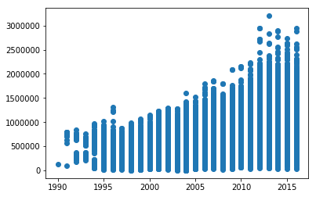
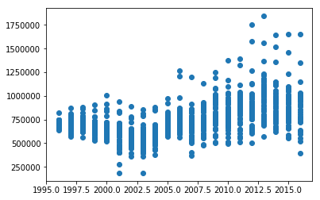

## Intro to Python

In this lab you will be familiarizing yourself with the programming language called Python. Python is a so-called high level programming language. Which means it is very abstracted from machine languages and are easily readable by humans. 

Python is one of the most popular programming languages nowadays, and is used in various spheres from research and Data Science to Machine Learning and Artificial Intelligence.

In this lab you will also learn some of the most popular Python libraries such as Pandas, Numpy, and Matplotlib. Libraries are used to make Python more efficient. By itself (solely with built-in functions and methods), Python is not a very useful language, hence people keep building libraries (sets of functions and methods) that can be used together with Python in order to make it more useful.

### 1. Python's Data Types

#### 1.1 Numerals

One of the data types that is commonly used in Python are numerals (aka numbers). 
With numerals, Python can be used as a calculator. Run the cells below to see it for yourself.


{:.input_area}
```python
3+5
```


{:.output .output_data_text}
```
8
```


{:.input_area}
```python
140-20
```


{:.output .output_data_text}
```
120
```


{:.input_area}
```python
40/2
```


{:.output .output_data_text}
```
20.0
```


{:.input_area}
```python
2*2
```


{:.output .output_data_text}
```
4
```


Python follows the same arithmetic rules as we do. So guess what the output of the next cell will be:


{:.input_area}
```python
2*5+1
```


{:.output .output_data_text}
```
11
```


What about this cell:


{:.input_area}
```python
2*(5+1)
```


{:.output .output_data_text}
```
12
```


Guess what a double star notation does? Run the cell below to see if you had the right intuition about it.


{:.input_area}
```python
3**2
```


{:.output .output_data_text}
```
9
```


There are a few types of them: integers and floats. 
They are not compatible, so it is important to remember which one you are using in order to avoid bugs. Floats use decimal points, so it will be easy for you to spot them. See how the output changes when we print the same number as an integer and as a float.


{:.input_area}
```python
int(1776)
```


{:.output .output_data_text}
```
1776
```


{:.input_area}
```python
float(1776)
```


{:.output .output_data_text}
```
1776.0
```


#### 1.2 Variables

To store the values in Python (and in many other programming languages) we need to use variables. Variables can store all kinds of information. This is useful if you plan to use the same values later on in your project. It will save you time and make your code more readable. To see how we store values in variables run the cell below.


{:.input_area}
```python
burr = "Wait for it!"
burr
```


{:.output .output_data_text}
```
'Wait for it!'
```


If you don't assign any value to the variable and call it later, it will give you an error. We can see it in the cell below. (It will give you an error, but it was planned that way)


{:.input_area}
```python
burr
```


{:.output .output_data_text}
```
'Wait for it!'
```


{:.input_area}
```python
y = 8
z = x+y
```


```
---------------------------------------------------------------------------
NameError                                 Traceback (most recent call last)
<ipython-input-25-33c5b6ca9af3> in <module>()
      1 y = 8
----> 2 z = x+y

NameError: name 'x' is not defined
```

Here, we did not assign x to anything, and since x was not defined, we cannot add its value to y, so this produces an error.

#### 1.3 Strings

The phrases and words in Python are always stored inbetween double or single quotation marks. They are formally called strings.


{:.input_area}
```python
"History has its eyes on you"
```


{:.output .output_data_text}
```
'History has its eyes on you'
```


Also, you can use both single and double quotes for the strings, but sometimes you need to use single quotes inside of the string and that might cause a problem (it will "exit it out"). 

You can just always use the double quotation marks on the outside to avoid such problem. Or, you can use a backslash before the single quotation mark. It will tell Python to ignore it and not to exit it out. You can see an example of it below:


{:.input_area}
```python
print("What'd I miss")
print('You\'ll be back')
```


{:.output .output_stream}
```
What'd I miss
You'll be back

```

The strings can also be "added" onto one another. Run the cell below to see how it works.


{:.input_area}
```python
"York"+"town"
```


{:.output .output_data_text}
```
'Yorktown'
```


When we are using Jupyter Notebooks, the last line is printed out automatically (unless it is performing some other operation, eg. getting assigned to a specific value). But if you would like to print more than just the last line, you can use the print( ) method. If you just run the next cell, it will not give you any output.


{:.input_area}
```python
aaron = "Ev’ryone give it up for America’s favorite fighting Frenchman"
everyone = "Lafayette!"
mdl = "I’m takin this horse by the reins"
```


Try using print( ) in the cell below to output all the three lines of lyrics of "Guns and Ships".

**Hint:** you'll need to use it three times.


{:.input_area}
```python
##fill this cell in


```


A string is a sequence of characters. If you want to see how many characters your string has, use the len() method. Do you think spaces are considered characters in Python? Check if your intuition was correct by running the cell below.


{:.input_area}
```python
len(burr)
```


{:.output .output_data_text}
```
12
```


Now create a variable name in which you will save your full name. Note that you need to call the variable once again in order to get an output.


{:.input_area}
```python
##fill this in
name = ...
name
```


Sometimes you need to switch the values in two variables. 
In the cell below we have the last names mixed up. The variable theodosia should have an output "burr" and philip should return "hamilton".
How would you approach this problem without manually retyping the outputs?

**Hint** Use a temporary variable in which you can temporarily save the value of one of the other variables. 


{:.input_area}
```python
theodosia = "hamilton"
philip = "burr"

##fill these in, Version 1:
theodosia, philip = ...

# Version 2
temp = ...
theodosia = ...
philip = ...
```


#### 1.4 Lists

You have learnt about the strings and numerals, it's time to take it up a notch. Another useful and very popular data type is a Python list.
Lists can take various data types (both numerals, strings, arrays, other lists, etc). 

To create an empty list just make your variable equal to "[ ]", like so:


{:.input_area}
```python
washington = []
washington
```


{:.output .output_data_text}
```
[]
```


To add the values into your list you can either use lst.append( ), lst.insert( ), or lst.extend( ).


{:.input_area}
```python
washington.extend(["Right Hand Man"])
washington
```


{:.output .output_data_text}
```
['Right Hand Man']
```


{:.input_area}
```python
washington.insert(0, "I need my")
washington
```


{:.output .output_data_text}
```
['I need my', 'Right Hand Man']
```


{:.input_area}
```python
washington.append("Back")
washington
```


{:.output .output_data_text}
```
['I need my', 'Right Hand Man', 'Back']
```


Notice, that the insert method takes two positional values. You need to specify the index in the list at which it will be inserted, whilst append just adds the value to the end of the list. 
extend takes another list as its input. If you try to use a string or a number by itself, it will give you an error.

When you need to access an element at a specific index, that is the code you can use The code below returns the second element of the list.


{:.input_area}
```python
washington[1]
```


{:.output .output_data_text}
```
'Right Hand Man'
```


**Note:** Python starts counting at 0, not 1.

Sometimes you just need to use part of the list. In this case you can use ":" to modify your list. Let's make a new list:

Sometimes you just need to use part of the list or copy the whole list into a new variable. In this
case you can use ":" to modify your list.
The notation is:

**a = b[start:stop:step]**

***start***: the index you want to start with. (the default is 0)

***stop***: the index you want to end with. (the default is the last number)

***step***: use it, if you wish to skip some indeces (eg. use only every other value). For example, if you start with index 1 and step is 2, you will iterate through the 1st index, then 3rd, then 5th, etc. until you get to the stopping index. (the default is 1)

Note that python will stop iterating at the value before the last index. See the following example:


{:.input_area}
```python
lst = [1,2,3,4,5]
```


{:.input_area}
```python
lst[0:5:1]
```


{:.output .output_data_text}
```
[1, 2, 3, 4, 5]
```


Note: if you wish to start iterating from the end of a list backwards, we use a negative step:


{:.input_area}
```python
lst[::-1]
```


{:.output .output_data_text}
```
[5, 4, 3, 2, 1]
```


{:.input_area}
```python
ham_songs = ["Alexander Hamilton", "Aaron Burr, Sir", "My Shot", \
             "The Story of Tonight", "The Schuyler Sisters", "Farmer Refuted",
             "You'll be Back", "Right Hand Man", "A Winter's Ball", \
             "Helpless", "Satisfied"]

every_other = ham_songs[::2] 
every_other
```


{:.output .output_data_text}
```
['Alexander Hamilton',
 'My Shot',
 'The Schuyler Sisters',
 "You'll be Back",
 "A Winter's Ball",
 'Satisfied']
```


{:.input_area}
```python
lyrics = ["I", "am", "not", "throwing", "away", "my", "shot"]
lyrics
```


{:.output .output_data_text}
```
['I', 'am', 'not', 'throwing', 'away', 'my', 'shot']
```


Let's say you want to save only the two last words from your old list into your new list. That's what you will need to do then:


{:.input_area}
```python
alex = lyrics[-2:]
alex

# alternatively you can use lyrics[5:]
```


{:.output .output_data_text}
```
['my', 'shot']
```


Notice also that if you want to learn the length of your list, you can use the same method "len( )", but it will not count all the characters anymore. Instead, it will count all the elements in it. Like so:


{:.input_area}
```python
len(washington)
```


{:.output .output_data_text}
```
3
```


Exercise: Create a list with the values 1, 2, 3, 4, and 5 and only get the values 2 and 4


{:.input_area}
```python
##fill this cell in


```


### 2. Built-in Functions

Although Python doesn't have a lot of functions and methods by itself, it is not like it doesn't have any. Let's go over some of the most valuable built-in funsctions in Python.


{:.input_area}
```python
min(1, 3)
```


{:.output .output_data_text}
```
1
```


{:.input_area}
```python
max(15, 25, 70)
```


{:.output .output_data_text}
```
70
```


You can also use these functions with strings. Can you guess what the output will be?


{:.input_area}
```python
max("Hamilton", "Washington")
```


{:.output .output_data_text}
```
'Washington'
```


So does Python know that George Washington was older than Alexander Hamilton? Of course not, when comparing strings, Python goes of off the letters of alphabet. Since "W" goes after "H" in the alphabet, "Washington" is a value that is "bigger" than "Hamilton".

We have created two lists with different integers. Let's now find the biggest number among the two smallest numbers in two lists. In other words, let's find the max( ) of the two min( ). You can achieve it with either 3 or 1 lines of code.


{:.input_area}
```python
dob = [1757, 1756, 1732, 1737, 1754]
dod = [1804, 1836, 1799, 1793, 1782] 

##fill in
min_dob = ...
min_dod = ...
max_of_mins = ...


# you can do it in one line

max_mins = max(min(), min())
```


Another valuable function you can use with your numerals is "round". It will round your floats to the nearest integer. Like so:


{:.input_area}
```python
round(8.7)
```


{:.output .output_data_text}
```
9
```


Another useful function we can use with numbers is "abs". It outputs an absolute value of a number:


{:.input_area}
```python
abs(-3.5)
```


{:.output .output_data_text}
```
3.5
```


### 3. Conditionals and For-loops

#### 3.1 Conditionals

Conditionals are also known as **booleans**. With conditional statements we can let the computer know when (aka under which condition) we want a specific operation to be executed. Under the hood the computer evaluates if the condition is True and performs a specific operation (like print( ), return( ), etc). Some of the most popular conditional statements are:

**A == B: True if A equals B**

**A != B: True if A is not equal to B**

**A > B: True if A is greater than B. Same syntax for "<"**

**A >= B: True if A is greater than or equal to B. Same syntax for "<="**

We have three types of statements in the Python conditionals: if, elif, and else. We always start with "if", we always end with "else". The "elif" statement is optional. It literally means "else if". While both "if" and "else" can only be used once, "elif" can be used multiple times, and let you add many more conditions to your statement.

If the condition in the if case is False, then we move to the elif case. If the elif case is false, then we will move to the else case and perform whatever is inside the else condition. We move into the condition that has a True conditional value first and evaluate that.


{:.input_area}
```python
playwright = "Lin-Manuel Miranda"

if playwright == "Lin-Manuel Miranda":
    print (True)
else:
    print (False)
```


{:.output .output_stream}
```
True

```

**Note:** "=" and "==" are not the same operations in Python. A single equals sign (=) assignes the value to the right of it to the variable name to the left of it. While the double equals sign (==) compares if the value on the right is equal to the value to the left of it. 

In the next line, let's ask Python to print the name of the school two of the Founding Fathers went based on their name. Feel free to change the string our "name" variable is assigned to.


{:.input_area}
```python
name = "Hamilton"

# Feel free to change the value of the variable "name"

if name == "Hamilton":
    print("Columbia")
elif name == "Burr":
    print("Princeton")
else:
    print("I don't know")
```


{:.output .output_stream}
```
Columbia

```

In the cell below guess what the output will be, before you run it. Feel free to change the numeral under the variable "year".


{:.input_area}
```python
year = 1789

# Who's the president

if year>=1789 and year<1797:
    print("George Washington")
elif year>=1797:
    print("John Adams")
else:
    print("King George")
```


{:.output .output_stream}
```
George Washington

```

We can also search through lists of values in our conditional statements to see if a word is in our list using the keyword 'in':


{:.input_area}
```python
founding_fathers = ["Jefferson", "Hancock", "Hamilton", "Adams", "Washington", "Burr", "Madison"]

# change the name in "any_name"
if "any_name" in founding_fathers:
    print("You are not throwing away your shot!")
else:
    print("You've got to be in the room where it happens!")
```


{:.output .output_stream}
```
You've got to be in the room where it happens!

```

#### 3.2 Loops

Loops (aka for-loops) allow for some code to be executed repeatedly. For example, if you wish to print the numbers from 0 to 10, you can do that with the for-loop. 

A for-loop iterates through a sequence of elements (list, string, array, etc.) and reassigns an element (which can have any name, most common are "x", "i", "elem", the name in itself doesn't matter) to each element of the sequence sequentially. 


{:.input_area}
```python
for elem in ['a', 'b', 'c']:   
    print(elem)

elem
```


{:.output .output_stream}
```
a
b
c

```


{:.output .output_data_text}
```
'c'
```


That is why in the previous code cell we can see that when an "elem" is called at the end of the loop, it is equal to "c" which is the last element of the sequence.


In the cell below we will be using the built-in function called range( ). It enumerates the numbers from 0 up to a number you put in (exclusive of that last number).

**Note:** remember that Python starts to count from 0, hence the last number you specify is not going to be included.


{:.input_area}
```python
for i in range(11):
    print(i)
```


{:.output .output_stream}
```
0
1
2
3
4
5
6
7
8
9
10

```

Exercise: Let's combine what you know so far about lists, conditionals, and for loops. Create a list with values 1, 2, 3, 4, 5. Iterate through the list with a for loop, and print only the values that are greater than 2. Otherwise, print the statement "This value is not greater than 2."


{:.input_area}
```python
##fill this cell in


```


### 4. Working with Libraries

It is time for us to introduce a concept of Python libraries. As we mentioned before, Python is not a very powerful programming language by itself. What makes it powerful are the libraries people wrote for it. Libraries are the sets of different functions that you can import and use. The two most popular libraries are numpy and pandas.


Since we are using anaconda, a lot of libraries have been preloaded for you. You just need to "call" them. Just run the cell below. It will make our notebook know that we will be using these preinstalled libraries from that point on. 


{:.input_area}
```python
import pandas as pd
import numpy as np
```


With the help of numpy we can introduce a new data type - arrays. Arrays are commonly used with Data Frames (basically, tables of values). There are a lot of functions and methods that can be used with arrays when one is analysing their data. The main difference between the lists and arrays is that an array can take only one type of data (eg. only numerals, or strings, but never both).

To create an array with values, just make your variable equal to np.array("your value")


{:.input_area}
```python
arr = np.array(10)
arr
```


{:.output .output_data_text}
```
array(10)
```


A very useful method that can be used with an array of numbers is np.arange( ). It takes at least 2, sometimes 3 positional arguments. The first number will be the starting point of your array, the last one will identify up to which number your array will go (not inclusive). The third positional argument is optional, it shows how many steps an array should skip through. (This is very similar to lists)

For example, if you need an array with numbers from 0 to 20, but you only want for it to include every other number, you will need add a third positional argument.


{:.input_area}
```python
every_other = np.arange(0, 21, 2)
every_other
```


{:.output .output_data_text}
```
array([ 0,  2,  4,  6,  8, 10, 12, 14, 16, 18, 20])
```


You can also convert a list of numbers in Python into an array:


{:.input_area}
```python
num_lst = [1, 2, 3, 4, 5]
num_arr = np.array(num_lst)
num_arr
```


{:.output .output_data_text}
```
array([1, 2, 3, 4, 5])
```


You can do some arithmetic with arrays. Guess what will be the output of this line of code before you run it:


{:.input_area}
```python
num_arr*2
```


{:.output .output_data_text}
```
array([ 2,  4,  6,  8, 10])
```


As you can see, all the values in our array got mutliplied by 2.

Try performing the same operation with the initial list of numbers instead. What do you think the output will be in the cell below?


{:.input_area}
```python
num_lst*2
```


{:.output .output_data_text}
```
[1, 2, 3, 4, 5, 1, 2, 3, 4, 5]
```


As you can see, lists and arrays not only can be used differently, but they lso give different outputs when we are using the same operations on them.

### 5. Data Frames and Tables

Now that you are familiar with all the basics of Python coding, it is time for you to learn how to work with Tables and Pandas Data Frames. First let's upload the dataset we have selected to work on.


{:.input_area}
```python
broadway = pd.read_csv("broadway.csv")
broadway.head(7)
```


<div markdown="0" class="output output_html">
<div>
<style scoped>
    .dataframe tbody tr th:only-of-type {
        vertical-align: middle;
    }

    .dataframe tbody tr th {
        vertical-align: top;
    }

    .dataframe thead th {
        text-align: right;
    }
</style>
<table border="1" class="dataframe">
  <thead>
    <tr style="text-align: right;">
      <th></th>
      <th>Attendance</th>
      <th>Capacity</th>
      <th>Day</th>
      <th>Full</th>
      <th>Gross</th>
      <th>Gross Potential</th>
      <th>Month</th>
      <th>Name</th>
      <th>Performances</th>
      <th>Theatre</th>
      <th>Type</th>
      <th>Year</th>
    </tr>
  </thead>
  <tbody>
    <tr>
      <th>0</th>
      <td>5500</td>
      <td>88</td>
      <td>26</td>
      <td>08/26/1990</td>
      <td>134456</td>
      <td>0</td>
      <td>8</td>
      <td>Tru</td>
      <td>8</td>
      <td>Booth</td>
      <td>Play</td>
      <td>1990</td>
    </tr>
    <tr>
      <th>1</th>
      <td>1737</td>
      <td>100</td>
      <td>24</td>
      <td>03/24/1991</td>
      <td>100647</td>
      <td>0</td>
      <td>3</td>
      <td>Miss Saigon</td>
      <td>0</td>
      <td>Broadway</td>
      <td>Musical</td>
      <td>1991</td>
    </tr>
    <tr>
      <th>2</th>
      <td>12160</td>
      <td>100</td>
      <td>31</td>
      <td>03/31/1991</td>
      <td>634424</td>
      <td>0</td>
      <td>3</td>
      <td>Miss Saigon</td>
      <td>0</td>
      <td>Broadway</td>
      <td>Musical</td>
      <td>1991</td>
    </tr>
    <tr>
      <th>3</th>
      <td>13921</td>
      <td>100</td>
      <td>7</td>
      <td>04/07/1991</td>
      <td>713353</td>
      <td>0</td>
      <td>4</td>
      <td>Miss Saigon</td>
      <td>0</td>
      <td>Broadway</td>
      <td>Musical</td>
      <td>1991</td>
    </tr>
    <tr>
      <th>4</th>
      <td>10973</td>
      <td>90</td>
      <td>14</td>
      <td>04/14/1991</td>
      <td>573981</td>
      <td>0</td>
      <td>4</td>
      <td>Miss Saigon</td>
      <td>4</td>
      <td>Broadway</td>
      <td>Musical</td>
      <td>1991</td>
    </tr>
    <tr>
      <th>5</th>
      <td>14076</td>
      <td>101</td>
      <td>21</td>
      <td>04/21/1991</td>
      <td>706793</td>
      <td>0</td>
      <td>4</td>
      <td>Miss Saigon</td>
      <td>8</td>
      <td>Broadway</td>
      <td>Musical</td>
      <td>1991</td>
    </tr>
    <tr>
      <th>6</th>
      <td>14065</td>
      <td>101</td>
      <td>28</td>
      <td>04/28/1991</td>
      <td>714968</td>
      <td>0</td>
      <td>4</td>
      <td>Miss Saigon</td>
      <td>8</td>
      <td>Broadway</td>
      <td>Musical</td>
      <td>1991</td>
    </tr>
  </tbody>
</table>
</div>
</div>


We can call a column in our dataset by typing:

**Note:** it will return an array of values


{:.input_area}
```python
broadway['Name']
```


{:.output .output_data_text}
```
0                                                      Tru
1                                              Miss Saigon
2                                              Miss Saigon
3                                              Miss Saigon
4                                              Miss Saigon
5                                              Miss Saigon
6                                              Miss Saigon
7                                              Miss Saigon
8                                              Miss Saigon
9                                              Miss Saigon
10                                             Miss Saigon
11                                             Miss Saigon
12                                             Miss Saigon
13                                             Miss Saigon
14                                             Miss Saigon
15                                             Miss Saigon
16                                             Miss Saigon
17                                             Miss Saigon
18                                             Miss Saigon
19                                             Miss Saigon
20                                             Miss Saigon
21                                             Miss Saigon
22                                             Miss Saigon
23                                             Miss Saigon
24                                             Miss Saigon
25                                             Miss Saigon
26                                             Miss Saigon
27                                             Miss Saigon
28                                             Miss Saigon
29                                             Miss Saigon
                               ...                        
31266                                        The Lion King
31267                             The Phantom Of The Opera
31268                                             Waitress
31269                                               Wicked
31270                                              Aladdin
31271                                   An Act Of God 2016
31272                                 An American In Paris
31273                                            Beautiful
31274                                            Cats 2016
31275                                              Chicago
31276                             Fiddler On The Roof 2015
31277                                    Finding Neverland
31278                                             Fun Home
31279                                             Hamilton
31280                                          Jersey Boys
31281                                          Kinky Boots
31282                                    Les Misrables '14
31283                                              Matilda
31284                                        On Your Feet!
31285                                             Paramour
31286                                       School Of Rock
31287                                    Something Rotten!
31288                                   The Book Of Mormon
31289                                The Color Purple 2015
31290    The Curious Incident Of The Dog In The Night-Time
31291                                           The Humans
31292                                        The Lion King
31293                             The Phantom Of The Opera
31294                                             Waitress
31295                                               Wicked
Name: Name, Length: 31296, dtype: object
```


Let's find the most and the least profitable shows of all time. We want for our code to return the whole row for the highest value in the "Gross" column:


{:.input_area}
```python
broadway[broadway['Gross'] == broadway['Gross'].max()]
```


<div markdown="0" class="output output_html">
<div>
<style scoped>
    .dataframe tbody tr th:only-of-type {
        vertical-align: middle;
    }

    .dataframe tbody tr th {
        vertical-align: top;
    }

    .dataframe thead th {
        text-align: right;
    }
</style>
<table border="1" class="dataframe">
  <thead>
    <tr style="text-align: right;">
      <th></th>
      <th>Attendance</th>
      <th>Capacity</th>
      <th>Day</th>
      <th>Full</th>
      <th>Gross</th>
      <th>Gross Potential</th>
      <th>Month</th>
      <th>Name</th>
      <th>Performances</th>
      <th>Theatre</th>
      <th>Type</th>
      <th>Year</th>
    </tr>
  </thead>
  <tbody>
    <tr>
      <th>26997</th>
      <td>17352</td>
      <td>100</td>
      <td>29</td>
      <td>12/29/2013</td>
      <td>3201333</td>
      <td>121</td>
      <td>12</td>
      <td>Wicked</td>
      <td>9</td>
      <td>Gershwin</td>
      <td>Musical</td>
      <td>2013</td>
    </tr>
  </tbody>
</table>
</div>
</div>


{:.input_area}
```python
broadway['Gross'].max()
```


{:.output .output_data_text}
```
3201333
```


Let's go over the code in the previous line. We are asking Python to show as a row from a dataset where the value in column "Gross" equals the largest value in that column.


Now do the same for the smallest value in the "Gross" column.


{:.input_area}
```python
##fill this cell in


```


Let's now search for a show with the highest amount of people who attended it in a single day. Then, let's find out what type of perfomance this one was. 

**Note:** There are three types of shows listed in this dataset: Musical, Play, and Special.


{:.input_area}
```python
broadway[broadway['Attendance'] == broadway['Attendance'].max()]["Type"]
```


{:.output .output_data_text}
```
1711    Special
Name: Type, dtype: object
```


In the code above we used the same things we used previously, but added the last element **["Type"]** to it. What our code does is:

1) it searches through the column "Attendance"

2) finds the largest value there

3) finds a row in our dataset where it has found that value

4) returns only the value in the column "Type" for that row

To ensure your understanding, find the name of the show with the highest value in the "Gross" column.


{:.input_area}
```python
##fill this cell in


```


Let's see which 5 shows on Broadway have the largest amount of rows to their name (aka has been on Broadway the longest).


For that to work we'll need to use method .groupby( ) which will combine all the rows for the shows with same name. Then we'll use .size( ), which will count the total of every column. Then we'll use .nlargest(n) that will return the n-largest values.


{:.input_area}
```python
broadway.groupby(['Name']).size().nlargest(5)
```


{:.output .output_data_text}
```
Name
The Phantom Of The Opera    1053
Chicago                     1032
The Lion King                980
Mamma Mia!                   725
Beauty And The Beast         690
dtype: int64
```


To do visualizations, we will need to import yet another library.


{:.input_area}
```python
import matplotlib.pyplot as plt
```


Sometimes it is easier to see a certain trend in our data by simply plotting the values from a few columns together. Like so:


{:.input_area}
```python
plt.scatter(broadway['Year'], broadway['Gross'])
plt.show()
```


{:.output .output_png}



So we can see that the Gross amount for the shows were growing in the course of years. Which makes perfect sense. What if we wanted to see the same trend for a specific show? How about we see the changes in gross amount by week for all the years "The Phantom of the Opera" was on stage?


{:.input_area}
```python
phantom = broadway[broadway['Name'] == "The Phantom Of The Opera"]
plt.scatter(phantom['Year'], phantom['Gross'])
plt.show()
```


{:.output .output_png}



Feel free to use the same code for any other show you are interested in.
