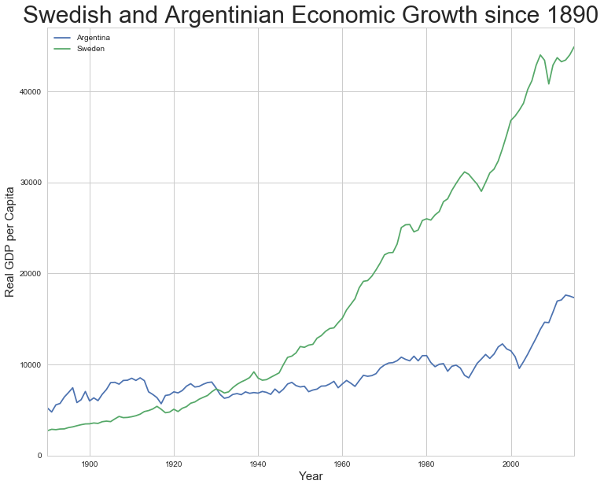
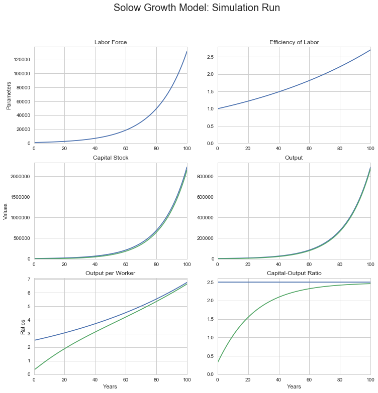
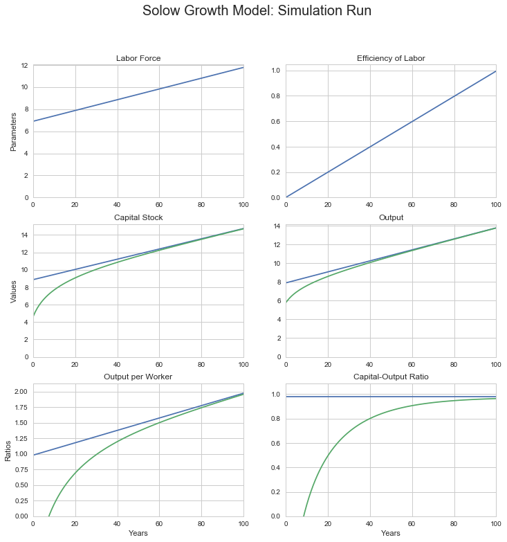
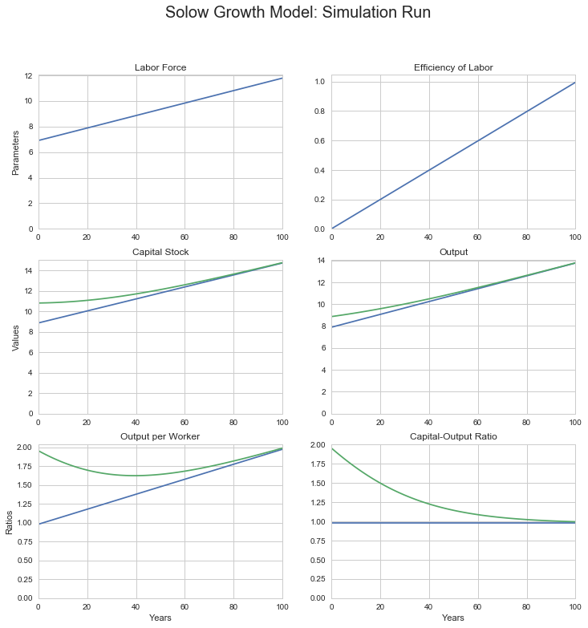
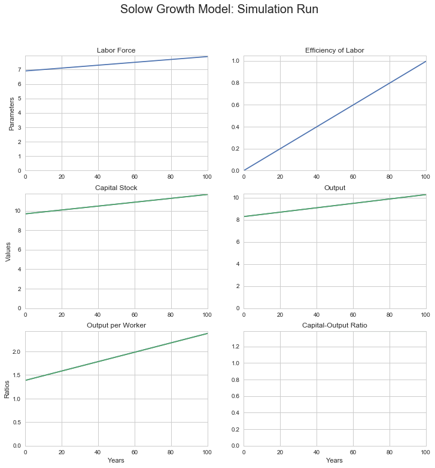
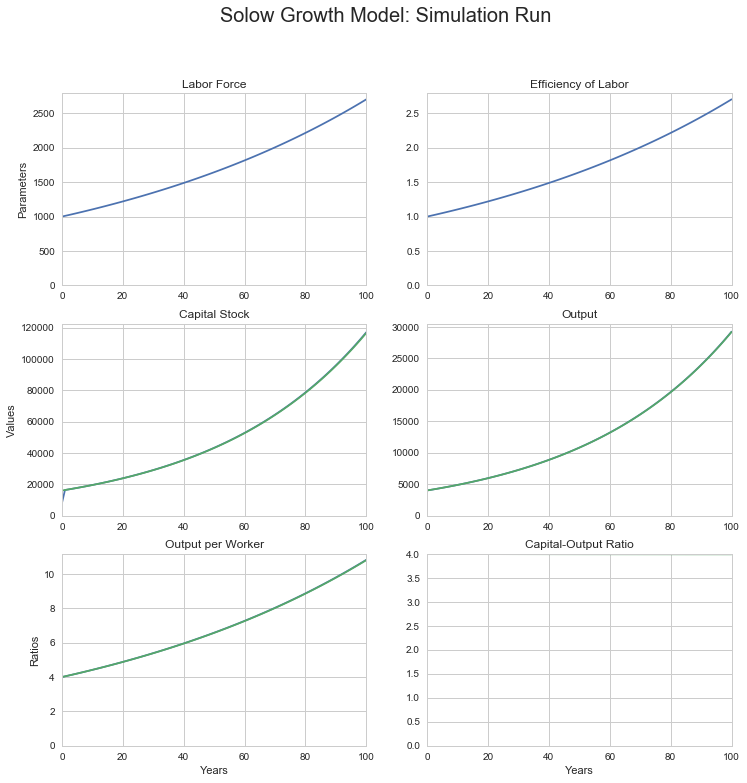
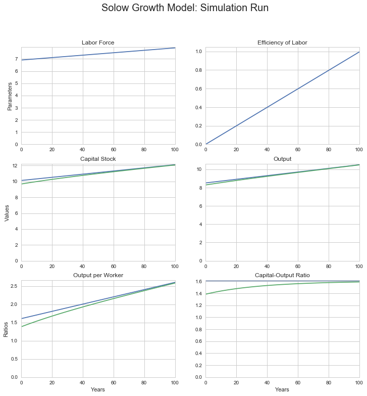
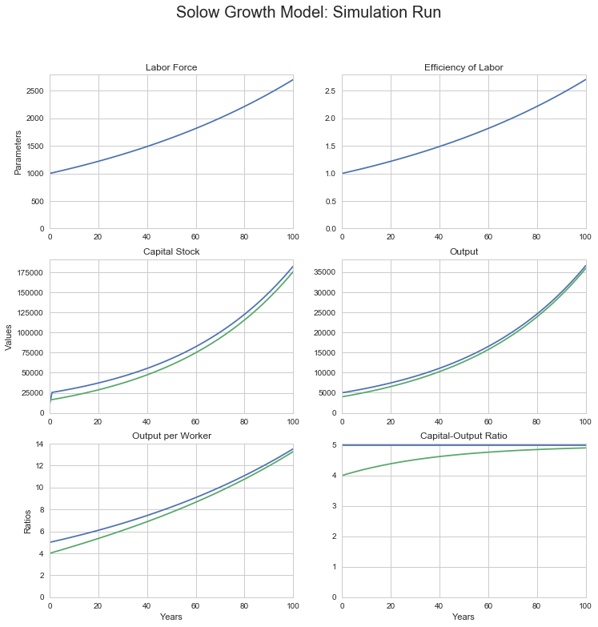

# Convergence to Balanced Growth Path

## Setting up the Python/Jupyter environment


{:.input_area}
```python
# set up the environment by reading in every library we might need: 
# os... graphics... data manipulation... time... math... statistics...

import sys
import os
from urllib.request import urlretrieve

import matplotlib as mpl
import matplotlib.pyplot as plt
from IPython.display import Image

import pandas as pd
from pandas import DataFrame, Series
from datetime import datetime

import scipy as sp
import numpy as np
import math
import random

import seaborn as sns
import statsmodels
import statsmodels.api as sm
import statsmodels.formula.api as smf
```


{:.input_area}
```python
# graphics setup: seaborn-whitegrid and figure size...

%matplotlib inline 

plt.style.use('seaborn-whitegrid')

figure_size = plt.rcParams["figure.figsize"]
figure_size[0] = 12
figure_size[1] = 10
plt.rcParams["figure.figsize"] = figure_size
```


# 4.1 Sources of Long-Run Economic Growth

## 4.1.1 The Eagle's Eye View

### 4.1.1.1 The Shape of Global Growth

Step back and take a broad, sweeping view of the economy.

Look at it, but do not focus on the “short run” of calendar-year quarters or even of a year or two in which shifts in investment spending and other shocks push the unemployment rate up or down—that’s what we will do in Chapters 9 through 12. 

Look at it, but do not focus on the “long run” period of 3 to 10 years or so, in which prices have time to adjust to return the economy to a full-employment equilibrium but in which the economy’s productive resources do not change much—that’s what we will look at in Chapters 6 through 8. 

What do we do here in Chapters 4 and 5? We take that step back and focus on the very long run of decades and generations—a period over which everything else dwindles into insignificance except the sustained and significant increases in standards of living that we call long-run economic growth.

When we take this broad, sweeping view, it is clear that what we are calling long-run economic growth is _the_ only truly important factor determining the economy's potential for generating prosperity. 

As Figure 4.1 shows, material standards of living and levels of economic productivity today in the United States are more than three times what they are in, say, Mexico (and more than nine times those of Nigeria, and more than 25 times those of Afghanistan). These differences matter for more than just how comfortable people are: richer societies have much longer life expectancies in addition to higher levels of consumption and greater control over resources by typical citizens. Even a large economic depression would not reduce U.S. levels of prosperity to those of Mexico, let alone Nigeria or Afghanistan.
 
----

&nbsp;

**Figure 4.1: U.S. Output per Capita in International Perspective**


###### Source: _Gapminder_ <http://gapminder.org/tools>

----

&nbsp;

Moreover, as Figure 4.2 shows, U.S. average living standards and productivity levels have not been near their current high levels for long. Standard estimates show that U.S. GDP per capita has grown more than thirteen-fold since 1870. And life expectancy at birth in the U.S. has doubled over the past century and a half. Even a large economic depression would not reduce U.S. levels of productivity to those of the U.S. a generation, let alone a century ago.

----

&nbsp;

**Figure 4.2: U.S. Output per Capita in Historical Perspective**


###### Source: _Gapminder_ <http://gapminder.org/tools>

----

&nbsp;

These differences and changes are huge.

At most a trivial part of them are due to whether unemployment in a country is currently above or below its average level, or whether various bad macroeconomic policies are currently disrupting the functioning of the price system. 

The overwhelming bulk of these differences are the result of differences in economies’ productive potentials. The most important differences spring from differences in the level of technology and of organization currently used in production, which are themelves the result of differences in the skills of workers, the availability and competence of engineers and engineering knowledge, and the creation and maintenance of organizations with internal structures that impel them toward profductive efficiency. Secondary differences spring from differences in the presence or absence of key natural resources, and in the value of the capital stock—the structures and buildings, machines and programs, and inventories and work flows that have themselves been produced by humans earlier and are necessary for a productive economy.

The enormous gaps between the productive potentials of different nations spring from favorable initial conditions and successful growth-promoting economic policies in the United States—and from less favorable initial conditions and less successful subsequent policies in Mexico and downright unsuccessful policies in Nigeria and Afghanistan.

Moreover, the bulk of today’s gap between living standards and productivity levels in the United States and Mexico (and Nigeria, and Afghanistan) opened up in the past century and a half; the bulk of success (or failure) at boosting an economy’s productive potential is thus—to a historian at least—of relatively recent origin. A century and a half ago U.S. GDP per capita was four times Afghan, not twenty times. While U.S. productive potential has amplified 13-fold since 1870, Afghan has only amplified two-fold and Nigerian five-fold. (Do, however, note that life expectancies at birth have more than doubled everywhere: humanity has done better at distributing the technologies that reduce infant mortality and enable longer life expectancy across the globe than it has done at distributing the technologies that boost production.

----

&nbsp;

**Figure 4.3: Growth since 1870: Afghan, Nigerian, Mexican, and American**


##### Source: _Gapminder_ <http://gapminder.org/tools>

----

&nbsp;

Successful economic growth means that nearly all citizens of the United States today live better—along almost every dimension of material life—than did even the rich elites of preindustrial times. If good policies and good circumstances accelerate economic growth, bad policies and bad circumstances cripple long-run economic growth. Argentineans were richer than Swedes before World War I, but Swedes today have four times the standard of living and the productivity level of Argentineans.

----

&nbsp;

#### Box 4.1.1: Sweden and Argentina's Reversal of Fortune

<span style="float:right;">**Figure 4.4: Long-Run Measured Economic Growth: Sweden  
    and Argentina, 1890-2017**</span>


At the start of the twentieth century, Argentina was richer—and seen as having a brighter future—than Sweden. Europeans in large numbers were then migrating to Argentina, not Sweden—and Swedes were leaving their country in large numbers for greener pastures elsewhere, largely in the Americas. But economic policies that were mostly bad for long-run growth left Argentina far behind Sweden. The average Swede today looks to be more than sixteen times as well off in terms of material income as the average Swede of 1890. The average Argentinian today looks to be only between three and a third times as well off as their predecessor back in 1890.
 
###### Source: _Gapminder_ <http://www.gapminder.org/data/> <http://docs.google.com/spreadsheet/pub?key=phAwcNAVuyj1jiMAkmq1iMg&output=xlsx>

&nbsp;


{:.input_area}
```python
# Calculations for: Figure 4.4 Long-Run Measured Economic Growth: 
# Sweden and Argentina, 1890-2017
# data previously downloaded
# time series for measured real national product per capita for 
# Sweden and Argentina since 1890, plus source notes, accessible 
# in the argentina_sweden_dict object for later use, if needed...

sourceURL = "http://delong.typepad.com/2017-08-11-argentina-and-sweden-gdp-per-capita-1890-2015-from-gapminder.org.csv"
argentina_sweden_df = pd.read_csv(sourceURL, index_col = 0)

argentina_sweden_dict = {}
argentina_sweden_dict["df"] = argentina_sweden_df
argentina_sweden_dict["sourceURL"] = sourceURL
argentina_sweden_dict["sourceDescription"] = "Hans Rosling's Gapminder: http://gapminder.org"   
argentina_sweden_dict["sourceNotes"] = "From Gapminder World data page: http://www.gapminder.org/data/"

argentina_sweden_dict["df"].plot()

plt.ylim(0, )
plt.xlabel("Year", size = 15)
plt.ylabel("Real GDP per Capita", size = 15)
plt.title("Swedish and Argentinian Economic Growth since 1890", size = 30)

## Calculate the difference in growth multiples between Sweden and
## Argentina since 1890

# Sweden's measured growth multiple over 1890-2015:

Sweden_multiple18902015 = argentina_sweden_df.Sweden[2015]/argentina_sweden_df.Sweden[1890]

# Argentina's measured growth multiple over 1890-2015:

Argentina_multiple18902015 = argentina_sweden_df.Argentina[2015]/argentina_sweden_df.Argentina[1890]

print("Sweden's growth multiple over 1890-2015:", Sweden_multiple18902015)
print("Argentinas growth multiple over 1890-2015:", Argentina_multiple18902015)


# Possible Exercises: 
# -------------------
#
# 1. Calculate and print the year that Sweden surpasses Argentina
# 2. Calculate and print the 20-year period over which Sweden's growth
#    rate was slowest
# 3. Calculate and pritn the 20-year period over which Argentina's
#    growth rate was fastest
# 4. Do you get the same impression of relative economic success and
#    disappointment if you plot not the levels but the logs of GDP
#    per capita alongside each other?
```


{:.output .output_stream}
```
Sweden's growth multiple over 1890-2015: 16.4138939671
Argentinas growth multiple over 1890-2015: 3.31752104055

```


{:.output .output_png}



----

&nbsp;

#### Box 4.1.2: Gapminder: An Information Source:

On the World Wide Web at: <http://gapminder.org> is _Gapminder_. It is, its mission statement says:

>an independent Swedish foundation... a fact tank, not a think tank.... fight[ing] devastating misconceptions about global development. Gapminder produces free teaching resources making the world understandable based on reliable statistics. Gapminder promotes a fact-based worldview everyone can understand...

and Gapminder exists because:

>We humans are born with a craving for... drama. We pay attention to dramatic stories and we get bored if nothing happens. Journalists and lobbyists tell dramatic stories... about extraordinary events and unusual people. The piles of dramatic stories pile up in people’s minds into an overdramatic worldview and strong negative stress feelings: “The world is getting worse!”, “It’s we vs. them!” , “Other people are strange!”, “The population just keeps growing!” and “Nobody cares!” For the first time in human history reliable statistics exist. There’s data for almost every aspect of global development. The data shows a very different picture: a world where most things improve.... [where] decisions [are] based on universal human needs... easy to understand....

>Fast population growth will soon be over. The total number of children in the world has stopped growing.... We live in a globalized world, not only in terms of trade and migration. More people than ever care about global development! The world has never been less bad. Which doesn’t mean it’s perfect. The world is far from perfect.

>The dramatic worldview has to be dismantled, because it is stressful... wrong.... leads to bad focus and bad decisions. We know this because we have measured the global ignorance... [of] top decision makers... journalists, activists, teachers and the general public. This has nothing to do with intelligence. It’s a problem of factual knowledge. Facts don’t come naturally. Drama and opinions do. Factual knowledge has to be learned. We need to teach global facts in schools and in corporate training. This is an exciting problem to work on and we invite all our users to join the Gapminder movement for global factfulness. The problem can be solved, because the data exists...

Do not be globally ignorant! Explore—and use—Gapminder! And watch Ola and Hans Rosling's "How Not to Be Ignorant about the World" talk at: <https://www.youtube.com/watch?v=Sm5xF-UYgdg>..com/embed/Sm5xF-UYgdg" frameborder="0" allow="encrypted-media" ></iframe>

----

&nbsp;

### 4.3.2.2 The Balanced Growth Capital-Output Ratio

But at what value will the economy’s capital-output ratio be constant? Here is where allowing n and g to take on values other than 0 matters. The capital-output ratio will be constant—and therefore we’ll be in balanced-growth equilibrium — when K/Y = s/(n + g + δ). Add up the economy’s labor-force growth rate, efficiency-of-labor growth rate, and depreciation rate; divide the saving-investment rate by that sum; and that is your balanced-growth equilibrium capital-output ratio.

Why is s/(n + g + δ) the capital-output ratio in equilibrium? Think of it this way: Suppose the economy is in balanced growth. How much is it investing? There must be investment equal to δK to replace depreciated capital. There must be investment equal to nK to provide the extra workers in the labor force, which is expanding at rate n, with the extra capital they will need. And, since the efficiency of labor is growing at rate g, there must be investment equal to gK in order for the capital stock to keep up with increasing efficiency of labor.

Adding these three parts of required investment together and setting the sum equal to the gross investment sY actually going on gets us (n + g + δ)K = sY as a condition for capital and output to be in balance. Thus the economy’s investment requirements for balanced growth equal the actual flow of investment when:

(4.3.1)&nbsp;&nbsp;&nbsp;&nbsp;&nbsp;&nbsp;&nbsp;&nbsp;&nbsp;&nbsp;
$ \frac{K}{Y} = \frac{s}{n+g+δ}  $

This is the balanced-growth equilibrium condition. When it is attained, what the capital-output ratio K/Y will be is constant because s, n, g, and δ are all constant. So when there is balanced growth—when output per worker Y/L and capital per worker K/L are growing at the same rate—the capital-output ratio K/Y will be constant. If the capital-output ratio K/Y is lower than s/(n + g + &delta;), then depreciation (&delta;K) plus the amount (n + g)K that capital needs to grow to keep up with growing output will be less than investment (sY), so the capital-output ratio will grow. It will keep growing until K/Y reaches s/(n + g + &delta;). If the capital-output ratio K/Y is greater than s/(n + g + &delta;), then depreciation (&delta;K) plus the amount (n + g)K that capital needs to grow to keep up with growing output will be greater than investment (sY), so the capital-output ratio will shrink. It will keep shrinking until K/Y falls to s/(n + g + &delta;). 

----

&nbsp;

### 4.3.2.3 Some Algebra

To see more formally that K/Y = s/(n + g + δ) is the balanced-growth equilibrium condition requires a short march through algebra—simple algebra, we promise. Start with the production function in its per worker form:

(4.3.2)&nbsp;&nbsp;&nbsp;&nbsp;&nbsp;&nbsp;&nbsp;&nbsp;&nbsp;&nbsp;
$ \frac{Y}{L} = \left(\frac{K}{L}\right)^α \left(E\right)^{1-α} $

Break the capital-labor ratio down into the capital-output ratio times output per worker:

(4.3.3)&nbsp;&nbsp;&nbsp;&nbsp;&nbsp;&nbsp;&nbsp;&nbsp;&nbsp;&nbsp;
$ \frac{Y}{L} = \left(\frac{K}{Y}\frac{Y}{L}\right)^α \left(E\right)^{1-α} $

Regroup:

(4.3.4)&nbsp;&nbsp;&nbsp;&nbsp;&nbsp;&nbsp;&nbsp;&nbsp;&nbsp;&nbsp;
$ \frac{Y}{L} = \left(\frac{Y}{L}\right)^α\left(\frac{K}{Y}\right)^α \left(E\right)^{1-α} $

Collect terms:

(4.3.4)&nbsp;&nbsp;&nbsp;&nbsp;&nbsp;&nbsp;&nbsp;&nbsp;&nbsp;&nbsp;
$ \left(\frac{Y}{L}\right)^{1-α} = \left(\frac{K}{Y}\right)^α \left(E\right)^{1-α} $

And clean up:

(4.3.5)&nbsp;&nbsp;&nbsp;&nbsp;&nbsp;&nbsp;&nbsp;&nbsp;&nbsp;&nbsp;
$ \left(\frac{Y}{L}\right) = \left(\frac{K}{Y}\right)^{\frac{α}{1-α}} \left(E\right) $

This tells us that _if the capital-output ratio K/L is constant, then the proportional growth rate of output per worker is the same as the proportional growth rate of E_. And the proportional growth rate of labor efficiency E is the constant g. 

Recall  that the labor force is growing at a constant proportional rate n. With output per worker growing at rate g and the number of workers growing at rate n, total output is growing at the constant rate n + g. Thus for the capital-output ratio K/Y to be constant, the capital stock also has to be growing at rate n + g. 

This means that the annual change in the capital stock must be: (n + g)K. Add in investment necessary to compensate for depreciation, and we have:

(4.3.1)&nbsp;&nbsp;&nbsp;&nbsp;&nbsp;&nbsp;&nbsp;&nbsp;&nbsp;&nbsp;
$ \frac{K}{Y} = \frac{s}{n+g+δ}  $

as our balanced-growth equilibrium condition.

----

&nbsp;

## 4.3.3 Understanding the Solow Model

### 4.3.3.1 Deriving the Balanced Growth Path for Output per Worker

Along what path for output per worker will the balanced-growth equilibrium condition be satisfied? Y/L is, after all, our best simple proxy for the economy’s overall level of prosperity: for material standards of living and for the possession by the economy of the resources needed to diminish poverty. Let’s calculate the level of output per worker Y/L along the balanced-growth path.

Begin with the capital-output ratio version of the production function that we just calculated above:

(4.3.5)&nbsp;&nbsp;&nbsp;&nbsp;&nbsp;&nbsp;&nbsp;&nbsp;&nbsp;&nbsp;
$ \left(\frac{Y}{L}\right) = \left(\frac{K}{Y}\right)^{\frac{α}{1-α}} \left(E\right) $

Since the economy is on its balanced-growth path, it satisfies the equilibrium con  dition K/Y = s/(n + g + δ). Substitute that in:

(4.3.6)&nbsp;&nbsp;&nbsp;&nbsp;&nbsp;&nbsp;&nbsp;&nbsp;&nbsp;&nbsp;
$ \left(\frac{Y}{L}\right) = \left(\frac{s}{n+g+δ}\right)^{\frac{α}{1-α}} \left(E\right) $

s, n, g, δ, and α are all constants, and so [s/(n + g + δ)]<sup>(α/(1-α))</sup>;is a constant as well. This tells us that along the balanced-growth path, output per worker is simply a constant multiple of the efficiency of labor, with the multiple equal to:

(4.3.7)&nbsp;&nbsp;&nbsp;&nbsp;&nbsp;&nbsp;&nbsp;&nbsp;&nbsp;&nbsp;
$ \left(\frac{s}{n+g+δ}\right)^{\frac{α}{1-α}}  $

Over time, the efficiency of labor grows. Each year it is g percent higher than the last year. Since along the balanced-growth path output per worker Y/L is just a constant multiple of the efficiency of labor, it too must be growing at the same proportional rate g.

Now it is time to introduce time subscripts, for we want to pay attention to where the economy is now, where it was whence, and where it will be when. So rewrite (4.3.6) as:

(4.3.8)&nbsp;&nbsp;&nbsp;&nbsp;&nbsp;&nbsp;&nbsp;&nbsp;&nbsp;&nbsp;
$ \left(\frac{Y_t}{L_t}\right) = \left(\frac{s}{n+g+δ}\right)^{\frac{α}{1-α}} \left(E_t\right) $

Paying attention to the equations for how labor efficiency and the labor force grow over time, $ E_t = E_0(1 + g)^t  $ and $ L_t = L_0(1 + n)^t  $, we can plug in and solve for what Y/L and Y will be at any time t—as long as the economy is on its balanced-growth path.

----

&nbsp;

### 4.3.3.2 Interpreting the Balanced Growth Path for Output per Worker

We now see how capital intensity and technological and organizational progress drive economic growth. Capital intensity—the economy’s capital-output ratio—determines what is the multiple of the current efficiency of labor E that balanced-growth path output per worker Y/L is. Things that increase capital intensity—raise the capital-output ratio—make balanced-growth output per worker a higher multiple of the efficiency of labor. Thus they make the economy richer. Things that reduce capital intensity make balanced-growth output per worker a lower multiple of the efficiency of labor, and so make the economy poorer.

Suppose that α is 1/2, so that α/(l—α) is 1, and that s is equal to three times n + g + δ, so that the balanced-growth capital-output ratio is 3. Then balanced-growth output per worker is simply equal to three times the efficiency of labor. If we consider another economy with twice the saving rate s, its balanced-growth capital-output ratio is 6, and its balanced-growth level of output per worker is twice as great a multiple of the level of the efficiency of labor.

The higher is the parameter α—that is, the slower diminishing returns to investment set in—the stronger is the effect of changes in the economy’s balanced-growth capital intensity on the level of output per worker, and the more important are thrift and investment incentives and other factors that influence s relative to those that influence the efficiency of labor.

Note—this is important- that changes in the economy’s capital intensity shift the balanced-growth path up or down to a different multiple of the efficiency of labor, but the growth rate of Y/L along the balanced-growth path is simply the rate of growth g of the efficiency of labor E. The material standard of living grows at the same rate as labor efficiency. 

To change the very long run growth rate of the economy you need to change how fast the efficiency of labor grows. Changes in the economy that merely alter the capital-output ratio will not do it.

This is what tells us that technology, organization, worker skills—all those things that increase the efficiency of labor and keep on increasing it—are ultimately more important to growth in output per worker than saving and investment. The U.S. economy experienced a large increase in its capital-output ratio in the late nineteenth century. It may be experiencing a similar increase now, as we invest more and more in computers. But the Gilded Age industrialization came to an end, and the information technology revolution will run its course. Aside from these episodes, it is growth in the efficiency of labor E that sustains and accounts for the lion’s share of long-run economic growth.

----

&nbsp;

### 4.3.3.3 Off the Balanced Growth Path

To calculate what output per worker would be if the economy were to be on its balanced-growth path is a straightforward three-step procedure:

1. Calculate the balanced-growth equilibrium capital-output ratio s/(n + g + δ), the saving rate s divided by the sum of the labor-force growth rate n, the efficiency of labor growth rate g, and the depreciation rate δ.
2. Raise the balanced-growth capital-output ratio to the α/(l-α) power, where α is the diminishing-retums-to-investment parameter in the production function. 
3. Multiply the result by the current value of the efficiency of labor E. The result is the current value of what output per worker would be if the economy were on its balanced growth path, and the path traced out by that result as E grows over time is the balanced-growth path for output per worker.

But is this of use if the economy is not on its balanced growth path?

How can we use a model which assumes that the economy is on its balanced-growth path to analyze a sit  uation in which the economy is not on that path? We still can use the model—and this is an important part of the magic of economics—because being on the balanced-growth path is an equilibrium condition. In an economic model, the thing to do if an equilibrium condition is not satisfied is to wait and, after a while, look again. When we look again, it will be satisfied.
Whenever the capital-output ratio K/Y is above its balanced-growth equilibrium value s/(n + g + δ), K/Y is falling: Investment is insufficient to keep the capital stock growing as fast as output. Whenever K/Y is below its balanced-growth equilibrium value, K/Y is rising: Capital stock growth outruns output. And as the capital-output ratio converges to its balanced-growth value, so does the economy’s level of output per worker converge to its balanced-growth path.

The fact that an economy converges to its balanced-growth path makes analyzing the long-run growth of an economy relatively easy as well even when the economy is not on its balanced-growth path:

1. Calculate the balanced-growth path.
2. From the balanced-growth path, forecast the future of the economy: If the
economy is on its balanced-growth path today, it will stay on that path in the future (unless some of the parameters—n, g, δ, s, and α—change).
3. If those parameters change, calculate the new, shifted balanced-growth path and predict that the economy will head for it.
4. If the economy is not on its balanced-growth path today, it is heading for that path and will get there eventually.

Thus _long run_ economic forecasting becomes simple. All you have to do is predict that the economy will head for its balanced-growth path, and calculate what the balanced-growth path is.

----

&nbsp;

### 4.3.3.4 Converging to the Balanced Growth Path

How fast does an economy head for its balanced-growth path? Does the convergence of an economy following the Solow growth model to its balanced-growth path take a year, or five years, or is it a matter of decades?

It is a matter of decades. But to see this requires more algebra:

Those of you for whom calculus is a tool and an intellectual force multiplier rather than a ritualistic obstacle to thought can start with the output form of the production function:

(4.3.9)&nbsp;&nbsp;&nbsp;&nbsp;&nbsp;&nbsp;&nbsp;&nbsp;&nbsp;&nbsp;
$ Y = K^α(EL)^{(1-α)}  $

Take first logarithms, and then derivatives to obtain:

(4.3.10)&nbsp;&nbsp;&nbsp;&nbsp;&nbsp;&nbsp;&nbsp;&nbsp;&nbsp;&nbsp;
$\frac{d(ln(Y_{t}))}{dt} = \alpha\frac{d(ln(K_t))}{dt} + (1-\alpha)\frac{d(ln(E_t))}{dt} + (1-\alpha)\frac{d(ln(L_t))}{dt}$

Note that since the derivative of a logarithm is simply a proportional growth rate, that (4.3.10) is an equation that tells us that—on or off of the balanced-growth path—the proportional growth rate of output is a function of the parameter α and of the growth rates of the capital stock, the labor force, and the efficiency of labor.

To keep those of you for whom math is not so much a tool and intellectual force multiplier on the same page, we are simply going to write "g<sub>x</sub>" for the proportional growth rate of an economic variable X. Thus g<sub>Y</sub> is the proportional growth rate of output Y. g<sub>K</sub> is the proportional growth rate of the capital stock K. And so forth. 

(4.3.10) can then become a friendlier form: an equation about growth rates, an equation the truth of which isbuilt into the definitions of logarithms, proportional growth rates, and the Cobb-Douglas production function:

(4.3.10')&nbsp;&nbsp;&nbsp;&nbsp;&nbsp;&nbsp;&nbsp;&nbsp;&nbsp;&nbsp;
$ g_Y = αg_K + (1-α)g_L + (1-α)g_E  $

We know what the proportional growth rates of the labor force L and labor efficiency E are in the Solow model: they are n and g:

(4.3.11)&nbsp;&nbsp;&nbsp;&nbsp;&nbsp;&nbsp;&nbsp;&nbsp;&nbsp;&nbsp;
$ g_Y = αg_K + (1-α)(n + g)  $

Now subtract both sides of this from the growth rate of the capital stock:

(4.3.12)&nbsp;&nbsp;&nbsp;&nbsp;&nbsp;&nbsp;&nbsp;&nbsp;&nbsp;&nbsp;
$ g_K - g_Y = (1-α)g_K - (1-α)(n + g)  $

We are almost done. Then to determine what the growth rate of the capital stock is, we simply take its change, sY - δK, and divide it by its level, K—but only on the right hand side:

(4.3.13)&nbsp;&nbsp;&nbsp;&nbsp;&nbsp;&nbsp;&nbsp;&nbsp;&nbsp;&nbsp;
$ g_K - g_Y = (1-α)\left(s\left(\frac{Y}{K}\right) - δ\right) - (1-α)(n + g)  $

The proportional growth rate of the quotient of two variables is just the difference between the proportional growth rates of the numerator and the denominator. Thus the left hand side is:

(4.3.14)&nbsp;&nbsp;&nbsp;&nbsp;&nbsp;&nbsp;&nbsp;&nbsp;&nbsp;&nbsp;
$ g_{K/Y} = (1-α)s\left(\frac{Y}{K}\right) - (1-α)(n + g + δ)  $

And since the proportional growth rate of a variable is its rate of change divided by its level, the left hand side is:

(4.3.15)&nbsp;&nbsp;&nbsp;&nbsp;&nbsp;&nbsp;&nbsp;&nbsp;&nbsp;&nbsp;
$ \frac{d(K/Y)/dt}{K/Y} = (1-α)s\left(\frac{Y}{K}\right) - (1-α)(n + g + δ)  $

Getting rid of the denominator on the left-hand side:

(4.3.16)&nbsp;&nbsp;&nbsp;&nbsp;&nbsp;&nbsp;&nbsp;&nbsp;&nbsp;&nbsp;
$ \frac{d(K/Y)}{dt} = (1-α)s - (1-α)(n + g + δ)\left(\frac{K}{Y}\right)  $

(4.3.17)&nbsp;&nbsp;&nbsp;&nbsp;&nbsp;&nbsp;&nbsp;&nbsp;&nbsp;&nbsp;
$ \frac{d(K/Y)}{dt} = - (1-α)(n + g + δ)\left(\frac{K}{Y} - \frac{s}{n + g + δ}\right)  $

This equation tells us three things:

* When the capital-output ratio K/Y is equal to s/(n+g+δ), it is indeed the case that it is stable.

* When K/Y is above that s/(n+g+δ) value, it is falling; when it is below, it is rising.

* The speed with which it is falling or rising is always proportional to the gap between K/Y and s/(n+g+δ), with the factor of proportionality equal to (1-α)(n+g+δ)

----

&nbsp;

### 4.3.3.5 Solving for the Time Path of the Capital-Labor Ratio

This march through algebra has just confirmed the arguments made so far. So what extra good—besides serving as a check on correctness—has this algebra done us?

It has done us good because equation (4.3.17) is a very special equation: it has a rate of change of something on the left hand side. It has the level of something on the right hand side. It has a negative constant multiplying the level. It is a _convergent exponential_. The function that satisfies this equation is:

(4.3.18)&nbsp;&nbsp;&nbsp;&nbsp;&nbsp;&nbsp;&nbsp;&nbsp;&nbsp;&nbsp;
$ \frac{K_t}{Y_t} = \frac{s}{\delta + n + g} + \left(C - \frac{s}{\delta + n + g}\right) e^{-(1 - \alpha)(\delta + g + n)t}  $

for the appropriate constant C.

What is the value of this constant C? Well, we know what the capital-output ratio is right now, when we start our analysis, which we might as well take to be the time t = 0. If we do take now to be time t = 0, and take K<sub>0</sub>/Y<sub>0</sub> for the capital output tday, then we can substitute in for the constant C:

(4.3.19)&nbsp;&nbsp;&nbsp;&nbsp;&nbsp;&nbsp;&nbsp;&nbsp;&nbsp;&nbsp;
$ \frac{K_t}{Y_t} = \frac{s}{\delta + n + g} + \left(\frac{K_0}{Y_0} - \frac{s}{\delta + n + g}\right) e^{-(1 - \alpha)(\delta + g + n)t}  $

This tells us that, when it is off the equilibrium balanced-growth path, the capital-output ratio of a Solow growth model economy is a weighted average of (a) its initial capital-output ratio K<sub>0</sub>/Y<sub>0</sub> and (b) its long-run balanced-growth capital-output ratio s/(n+g+δ), with the weight placed on the first declining exponentially according to the function exp(-(1-α)(n + g + δ)t)

This tells us that, in the Solow growth model, an economy will close a fraction (1 — α)(n + g + δ) of the gap between its current position and the balanced-growth path each year. If (1 — α)(n + g + δ) turns out to be equal to 0.05, the capital-output ratio will close 5 percent of the gap between its current level and its balanced-growth value each year. It would close half of the gap in fourteen years. It would close three-quarters of the gap in 28 years.

The Solow growth model is thus definitely a long-run model. It predicts that in the short run things will pretty much stay as they have been. If that is not right—if there are interesting and important fluctuations in the short run—the Solow model knows nothing about them. For them we will have to turn to the models of Chapter 6 and beyond.


{:.input_area}
```python
# convergence to the balanced growth path
#
# we need to alter our dataframe in order to add a BGP line
#
# # we are going to want to see what happens for lots of
# different model parameter values and initial conditions,
# so stuff our small simulation program inside a function, so 
# we can then invoke it with a single line...

def sgm_bgp_100yr_run(L0, E0, K0, n=0.01, g=0.02, s=0.15, alpha=0.5, delta=0.03, T = 100):

    sg_df = pd.DataFrame(index=range(T),columns=['Labor', 
        'Efficiency',
        'Capital',
        'Output',
        'Output_per_Worker',
        'Capital_Output_Ratio',
        'BGP_Output',
        'BGP_Output_per_Worker',
        'BGP_Capital_Output_Ratio',
        'BGP_Capital'],
        dtype='float')

    sg_df.Labor[0] = L0
    sg_df.Efficiency[0] = E0
    sg_df.Capital[0] = K0
    sg_df.Output[0] = (sg_df.Capital[0]**alpha * (sg_df.Labor[0] * 
        sg_df.Efficiency[0])**(1-alpha))
    sg_df.Output_per_Worker[0] = sg_df.Output[0]/sg_df.Labor[0]
    sg_df.Capital_Output_Ratio[0] = sg_df.Capital[0]/sg_df.Output[0]
    sg_df.BGP_Capital_Output_Ratio[0] = (s / (n + g + delta))
    sg_df.BGP_Output_per_Worker[0] = sg_df.Efficiency[0] * (
        sg_df.BGP_Capital_Output_Ratio[0]*(alpha/(1 - alpha)))
    sg_df.BGP_Output[0] = sg_df.BGP_Output_per_Worker[0] * sg_df.Labor[0]
    sg_df.BGP_Capital[0] = sg_df.Labor[0] * sg_df.Efficiency[0] * (
        sg_df.BGP_Capital_Output_Ratio[0]*(1/(1 - alpha)))

    for i in range(T):
        sg_df.Labor[i+1] = sg_df.Labor[i] + sg_df.Labor[i] * n
        sg_df.Efficiency[i+1] = sg_df.Efficiency[i] + sg_df.Efficiency[i] * g
        sg_df.Capital[i+1] = sg_df.Capital[i] - sg_df.Capital[i] * delta + (
            sg_df.Output[i] * s)
        sg_df.Output[i+1] = (sg_df.Capital[i+1]**alpha * 
            (sg_df.Labor[i+1] * sg_df.Efficiency[i+1])**(1-alpha))
        sg_df.Output_per_Worker[i+1] = sg_df.Output[i+1]/sg_df.Labor[i+1]
        sg_df.Capital_Output_Ratio[i+1] = (sg_df.Capital[i+1]/
            sg_df.Output[i+1])
        sg_df.BGP_Capital_Output_Ratio[i+1] = (s / (n + g + delta))
        sg_df.BGP_Output_per_Worker[i+1] = sg_df.Efficiency[i+1] * (
            sg_df.BGP_Capital_Output_Ratio[i+1]**(alpha/(1 - alpha)))
        sg_df.BGP_Output[i+1] = (sg_df.BGP_Output_per_Worker[i+1] * 
            sg_df.Labor[i+1])
        sg_df.BGP_Capital[i+1] = (s / (n + g + delta))**(1/(1-alpha)) * (
            sg_df.Efficiency[i+1] * sg_df.Labor[i+1])
        
    fig = plt.figure(figsize=(12, 12))

    ax1 = plt.subplot(3,2,1)
    sg_df.Labor.plot(ax = ax1, title = "Labor Force")
    plt.ylabel("Parameters")
    plt.ylim(0, )

    ax2 = plt.subplot(3,2,2)
    sg_df.Efficiency.plot(ax = ax2, title = "Efficiency of Labor")
    plt.ylim(0, )
    
    ax3 = plt.subplot(3,2,3)
    sg_df.BGP_Capital.plot(ax = ax3, title = "BGP Capital Stock")
    sg_df.Capital.plot(ax = ax3, title = "Capital Stock")
    plt.ylabel("Values")
    plt.ylim(0, )

    ax4 = plt.subplot(3,2,4)
    sg_df.BGP_Output.plot(ax = ax4, title = "BGP Output")
    sg_df.Output.plot(ax = ax4, title = "Output")
    plt.ylim(0, )

    ax5 = plt.subplot(3,2,5)
    sg_df.BGP_Output_per_Worker.plot(ax = ax5, 
        title = "BGP Output per Worker")
    sg_df.Output_per_Worker.plot(ax = ax5, title = "Output per Worker")
    plt.xlabel("Years")
    plt.ylabel("Ratios")
    plt.ylim(0, )

    ax6 = plt.subplot(3,2,6)
    sg_df.BGP_Capital_Output_Ratio.plot(ax = ax6, 
        title = "BGP Capital-Output Ratio")
    sg_df.Capital_Output_Ratio.plot(ax = ax6, 
        title = "Capital-Output Ratio")
    plt.xlabel("Years")
    plt.ylim(0, )

    plt.suptitle('Solow Growth Model: Simulation Run', size = 20)

    plt.show()
    
    print(n, "is the labor force growth rate")
    print(g, "is the efficiency of labor growth rate")
    print(delta, "is the depreciation rate")
    print(s, "is the savings rate")
    print(alpha, "is the decreasing-returns-to-scale parameter")
```


{:.input_area}
```python
sgm_bgp_100yr_run(1000, 1, 100, n=0.05, g=0.01, 
    s=0.225, alpha=0.5, delta=0.03)
```


{:.output .output_png}



{:.output .output_stream}
```
0.05 is the labor force growth rate
0.01 is the efficiency of labor growth rate
0.03 is the depreciation rate
0.225 is the savings rate
0.5 is the decreasing-returns-to-scale parameter

```


{:.input_area}
```python
# convergence to the balanced growth path—log graphs
#
# we need to alter our dataframe in order to add a BGP line
#
# # we are going to want to see what happens for lots of
# different model parameter values and initial conditions,
# so stuff our small simulation program inside a function, so 
# we can then invoke it with a single line...

def log_sgm_bgp_100yr_run(L0, E0, K0, n=0.01, g=0.02, s=0.15, alpha=0.5, delta=0.03, T=100):

    sg_df = pd.DataFrame(index=range(T),columns=['Labor', 
        'Efficiency',
        'Capital',
        'Output',
        'Output_per_Worker',
        'Capital_Output_Ratio',
        'BGP_Output',
        'BGP_Output_per_Worker',
        'BGP_Capital_Output_Ratio',
        'BGP_Capital'],
        dtype='float')

    sg_df.Labor[0] = L0
    sg_df.Efficiency[0] = E0
    sg_df.Capital[0] = K0
    sg_df.Output[0] = (sg_df.Capital[0]**alpha * (sg_df.Labor[0] * sg_df.Efficiency[0])**(1-alpha))
    sg_df.Output_per_Worker[0] = sg_df.Output[0]/sg_df.Labor[0]
    sg_df.Capital_Output_Ratio[0] = sg_df.Capital[0]/sg_df.Output[0]
    sg_df.BGP_Capital_Output_Ratio[0] = (s / (n + g + delta))
    sg_df.BGP_Output_per_Worker[0] = sg_df.Efficiency[0] * sg_df.BGP_Capital_Output_Ratio[0]*(alpha/(1 - alpha))
    sg_df.BGP_Output[0] = sg_df.BGP_Output_per_Worker[0] * sg_df.Labor[0]
    sg_df.BGP_Capital[0] = (s / (n + g + delta))**(1/(1-alpha)) * sg_df.Efficiency[0] * sg_df.Labor[0]

    for i in range(T):
        sg_df.Labor[i+1] = sg_df.Labor[i] + sg_df.Labor[i] * n
        sg_df.Efficiency[i+1] = sg_df.Efficiency[i] + sg_df.Efficiency[i] * g
        sg_df.Capital[i+1] = sg_df.Capital[i] - sg_df.Capital[i] * delta + sg_df.Output[i] * s 
        sg_df.Output[i+1] = (sg_df.Capital[i+1]**alpha * (sg_df.Labor[i+1] * sg_df.Efficiency[i+1])**(1-alpha))
        sg_df.Output_per_Worker[i+1] = sg_df.Output[i+1]/sg_df.Labor[i+1]
        sg_df.Capital_Output_Ratio[i+1] = sg_df.Capital[i+1]/sg_df.Output[i+1]
        sg_df.BGP_Capital_Output_Ratio[i+1] = (s / (n + g + delta))
        sg_df.BGP_Output_per_Worker[i+1] = sg_df.Efficiency[i+1] * sg_df.BGP_Capital_Output_Ratio[i+1]**(alpha/(1 - alpha))
        sg_df.BGP_Output[i+1] = sg_df.BGP_Output_per_Worker[i+1] * sg_df.Labor[i+1]
        sg_df.BGP_Capital[i+1] = (s / (n + g + delta))**(1/(1-alpha)) * sg_df.Efficiency[i+1] * sg_df.Labor[i+1]

        
    fig = plt.figure(figsize=(12, 12))

    ax1 = plt.subplot(3,2,1)
    np.log(sg_df.Labor).plot(ax = ax1, title = "Labor Force")
    plt.ylabel("Parameters")
    plt.ylim(0, )

    ax2 = plt.subplot(3,2,2)
    np.log(sg_df.Efficiency).plot(ax = ax2, title = "Efficiency of Labor")
    plt.ylim(0, )
    
    ax3 = plt.subplot(3,2,3)
    np.log(sg_df.BGP_Capital).plot(ax = ax3, title = "BGP Capital Stock")
    np.log(sg_df.Capital).plot(ax = ax3, title = "Capital Stock")
    plt.ylabel("Values")
    plt.ylim(0, )

    ax4 = plt.subplot(3,2,4)
    np.log(sg_df.BGP_Output).plot(ax = ax4, title = "BGP Output")
    np.log(sg_df.Output).plot(ax = ax4, title = "Output")
    plt.ylim(0, )

    ax5 = plt.subplot(3,2,5)
    np.log(sg_df.BGP_Output_per_Worker).plot(ax = ax5, title = "BGP Output per Worker")
    np.log(sg_df.Output_per_Worker).plot(ax = ax5, title = "Output per Worker")
    plt.xlabel("Years")
    plt.ylabel("Ratios")
    plt.ylim(0, )

    ax6 = plt.subplot(3,2,6)
    np.log(sg_df.BGP_Capital_Output_Ratio).plot(ax = ax6, title = "BGP Capital-Output Ratio")
    np.log(sg_df.Capital_Output_Ratio).plot(ax = ax6, title = "Capital-Output Ratio")
    plt.xlabel("Years")
    plt.ylim(0, )

    plt.suptitle('Solow Growth Model: Simulation Run', size = 20)

    plt.show()
    
    print(n, "is the labor force growth rate")
    print(g, "is the efficiency of labor growth rate")
    print(delta, "is the depreciation rate")
    print(s, "is the savings rate")
    print(alpha, "is the decreasing-returns-to-scale parameter")
    
log_sgm_bgp_100yr_run(1000, 1, 100, n=0.05, g=0.01, s=0.24, 
    alpha=0.5, delta=0.03)
```


{:.output .output_png}



{:.output .output_stream}
```
0.05 is the labor force growth rate
0.01 is the efficiency of labor growth rate
0.03 is the depreciation rate
0.24 is the savings rate
0.5 is the decreasing-returns-to-scale parameter

```


{:.input_area}
```python
log_sgm_bgp_100yr_run(1000, 1, 50000, n=0.05, g=0.01, s=0.24, 
    alpha=0.5, delta=0.03)
```


{:.output .output_png}



{:.output .output_stream}
```
0.05 is the labor force growth rate
0.01 is the efficiency of labor growth rate
0.03 is the depreciation rate
0.24 is the savings rate
0.5 is the decreasing-returns-to-scale parameter

```


{:.input_area}
```python
# suppose we started the economy on some balanced growth path, say
# for s = 0.20. And then s jumped to 0.25. What would happen?
# n=0.01, g=0.01, delta=0.03, s=0.20, alpha=0.5...
# SS K/Y = 4...
# Y/L = 4 x E
# K/L = 16 x E

log_sgm_bgp_100yr_run(1000, 1, 16000, n=0.01, g=0.01, s=0.20, 
    alpha=0.5, delta=0.03)
```


{:.output .output_png}



{:.output .output_stream}
```
0.01 is the labor force growth rate
0.01 is the efficiency of labor growth rate
0.03 is the depreciation rate
0.2 is the savings rate
0.5 is the decreasing-returns-to-scale parameter

```


{:.input_area}
```python
# in levels, that is:

sgm_bgp_100yr_run(1000, 1, 16000, n=0.01, g=0.01, 
    s=0.20, alpha=0.5, delta=0.03)
```


{:.output .output_png}



{:.output .output_stream}
```
0.01 is the labor force growth rate
0.01 is the efficiency of labor growth rate
0.03 is the depreciation rate
0.2 is the savings rate
0.5 is the decreasing-returns-to-scale parameter

```


{:.input_area}
```python
# Now, from the s = 0.20 BGP, jump s  to 0.25:

log_sgm_bgp_100yr_run(1000, 1, 16000, n=0.01, g=0.01, s=0.25, 
    alpha=0.5, delta=0.03)
```


{:.output .output_png}



{:.output .output_stream}
```
0.01 is the labor force growth rate
0.01 is the efficiency of labor growth rate
0.03 is the depreciation rate
0.25 is the savings rate
0.5 is the decreasing-returns-to-scale parameter

```


{:.input_area}
```python
# in levels, that is:

sgm_bgp_100yr_run(1000, 1, 16000, n=0.01, g=0.01, 
    s=0.25, alpha=0.5, delta=0.03)
```


{:.output .output_png}



{:.output .output_stream}
```
0.01 is the labor force growth rate
0.01 is the efficiency of labor growth rate
0.03 is the depreciation rate
0.25 is the savings rate
0.5 is the decreasing-returns-to-scale parameter

```

----

&nbsp;

**Box: How Fast Do Economies Converge?**


----

&nbsp;

**Box: West Germany After World War II**

The Return of the West German Economy to Its Balanced-Growth Path Economies do converge to and then remain on their balanced-growth paths. The West German econ  omy after World War II is a case in point.
Source: J. Bradford DeLong and Barry Eichengreen, "The Marshall Plan: History's Most Successful Structural Adjustment Programme," in Rudiger Dornbusch, Willhelm Nolling, and Richard Layard, eds., Postwar Economic Reconstruction and Lessons for the East Today (Cambridge, MA: MIT Press, 1993), pp. 189-230.

We can see such convergence in action in many places and times. For example, consider the post-World War II history of West Germany. The defeat of the Nazis left the German economy at the end of World War II in ruins. Output per worker was less than one-third of its prewar level. The economy’s capital stock had been wrecked and devastated by three years of American and British bombing and then by the ground campaigns of the last six months of the war. But in the years immediately after the war, the West German economy’s capital-output ratio rapidly grew and con  verged back to its prewar value. As Figure 4.11 shows, within 12 years the West German economy had closed half the gap back to its pre-World War II growth path. And within 30 years the West German economy had effectively closed the entire gap between where it had started at the end of World War II and its balanced-growth path.

----

&nbsp;

## 4.3.4 RECAP: UNDERSTANDING THE GROWTH MODEL

**According to the Solow growth model, capital intensity and growth in the effi  ciency of labor together determine the destiny of an economy. The value of the balanced-growth equilibrium capital-output ratio and the economy's diminish- ing-returns-to-investment parameter determine the multiple that balanced- growth output per worker is of the current efficiency of labor. The growth rate of output per worker along the economy’s balanced-growth path is equal to the growth rate of the efficiency of labor. And if the economy is not on its balanced-growth path, the Solow growth model tells us that it is converging to it—although this convergence takes decades, not years.**
 
----

&nbsp;

# 4.4 USING THE SOLOW GROWTH MODEL

Up until now we have assumed that all the parameters of the Solow growth model are unchanging. This is false. But it allowed us to make progress.

Now let's try to make some more progress.

----

&nbsp;

## 4.4.1 Jumps in Parameter Values

What if one or more of the parameters in the Solow growth model  were to suddenly and substantially shift? What if the labor-force growth rate were to rise, or the rate of technological progress to fall? 

One principal use of the Solow growth model is to analyze questions like these: how changes in the economic environment and in economic policy will affect an econ  omy’s long-run levels and growth path of output per worker Y/L.

Let’s consider, as examples, several such shifts: an increase in the growth rate of the labor force n, a change in the economy’s saving-investment rate s, and a change in the growth rate of labor efficiency g. All of these will have effects on the balanced- growth path level of output per worker. But only one—the change in the growth rate of labor efficiency — will permanently affect the growth rate of the economy.

----

&nbsp;

## 4.4.2 A Shift in the Labor-Force Growth Rate

Real-world economies exhibit profound shifts in labor-force growth. The average woman in India today has only half the number of children that the average woman in India had only half a century ago. The U.S. labor force in the early eighteenth century grew at nearly 3 percent per year, doubling every 24 years. Today the U.S. labor force grows at 1 percent per year. Changes in the level of prosperity, changes in the freedom of migration, changes in the status of women that open up new categories of jobs to them (Supreme Court Justice Sandra Day O’Connor could not get a private-sector legal job in San Francisco when she graduated from Stanford Law School even with her amazingly high class rank), changes in the average age of marriage or the availability of birth control that change fertility — all of these have powerful effects on economies’ rates of labor-force growth.

What effects do such changes have on output per worker Y/L — on our mea  sure of material prosperity? The faster the growth rate of the labor force n, the lower will be the economy’s balanced-growth capital-output ratio s/(n + g - δ). Why? Because each new worker who joins the labor force must be equipped with enough capital to be productive and to, on average, match the productivity of his or her peers. The faster the rate of growth of the labor force, the larger the share of current investment that must go to equip new members of the labor force with the capital they need to be productive. Thus the lower will be the amount of invest  ment that can be devoted to building up the average ratio of capital to output.

A sudden and permanent increase in the rate of growth of the labor force will lower the level of output per worker on the balanced-growth path. How large will the long-run change in the level of output be, relative to what would have hap  pened had labor-force growth not increased? It is straightforward to calculate if we know the other parameter values, as is shown in Box 4.7.

----

&nbsp;

Box: AN INCREASE IN THE LABOR-FORCE GROWTH RATE: AN EXAMPLE
Consider an economy in which the parameter a is 1/2, the efficiency of labor growth rate g is 1.5 percent per year, the depreciation rate 8 is 3.5 percent per year, and the saving rate s is 21 percent. Suppose that the labor-force growth rate sud  denly and permanently increases from 1 to 2 percent per year.
Before the increase in the labor-force growth rate, the balanced-growth equilib  rium capital-output ratio was
After the increase in the labor-force growth rate, the new balanced-growth equi  librium capital-output ratio will be
Before the increase in labor-force growth, the level of output per worker along the balanced-growth path was equal to
After the increase in labor-force growth, the level of output per worker along the balanced-growth path will be equal to
This fall in the balanced-growth path level of output per worker means that in the very long run — after the economy has converged to its new balanced-growth path — one-seventh of its economic prosperity has been lost because of the increase in the rate of labor-force growth.
In the short run of a year or two, however, such an increase in the labor-force growth rate has little effect on output per worker. In the months and years after labor-force growth increases, the increased rate of labor-force growth has had no time to affect the economy’s capital-output ratio. But over decades and generations, the capital-output ratio will fall as it converges to its new balanced-growth equi  librium level.
A sudden and permanent change in the rate of growth of the labor force will immediately and substantially change the level of output per worker along the economy’s balanced-growth path: It will shift the balanced-growth path for output per worker up (if labor-force growth falls) or down (if labor-force growth rises). But there is no corresponding immediate jump in the actual level of output per worker in the economy. Output per worker doesn’t immediately jump — it is just that the shift in the balanced-growth path means that the economy is no longer in its Solow growth model long-run equilibrium.
It takes time, decades and generations, for the economy to converge to its new balanced-growth path equilibrium, and thus for the shift in labor-force

----

&nbsp;

Box: The Labor-Force Growth Rate Matters 

The average country with
a labor-force growth rate of less than 1 percent per year has an output-per- worker level that is nearly 60 percent of the U.S. level. The average country with a labor-force growth rate of more than 3 per  cent per year has an out- put-per-worker level that is only 20 percent of the U.S. level. To some degree
poor countries have fast labor-force growth rates because they are poor: Causation runs both ways. Nevertheless, high labor- force growth rates are a powerful cause of low cap  ital intensity and relative poverty in the world today.
Source: Authors' calculations from Alan Heston, Robert Summers, and Bettina Aten, Penn World Table Version 6.1, Center for International Comparisons at the University of Pennsylvania (CICUP), October 2002, www.nber.org.

----

&nbsp;

How important is all this in the real world? Does a high rate of labor-force growth play a role in making countries relatively poor not just in economists’ models but in reality? It turns out that it is important, as Figure 4.12 on page 110 shows. Of the 22 countries in the world with output-per-worker levels at least half of the U.S. level, 18 have labor-force growth rates of less than 2 percent per year, and 12 have labor-force growth rates of less than 1 percent per year. The additional investment requirements imposed by rapid labor-force growth are a powerful reducer of capital intensity and a powerful obstacle to rapid economic growth.

growth to affect average prosperity and living standards. But the time needed is reason for governments that value their countries’ long-run prosperity to take steps now (or even sooner) to start assisting the demographic transition to low levels of population growth. Female education, social changes that provide women with more opportunities than being a housewife, inexpensive birth control — all these pay large long-run dividends as far as national prosperity levels are concerned.
U.S. President John F Kennedy used to tell a story of a retired French general, Marshal Lyautey, “who once asked his gardener to plant a tree. The gardener objected that the tree was slow-growing and would not reach maturity for a hun  dred years. The Marshal replied, ‘In that case, there is no time to lose, plant it this afternoon.’”

----

&nbsp;

## 4.4.3 The Saving Rate and the Price of Capital Goods

The most frequent sources of shifts in the parameters of the Solow growth model are shifts in the economy’s saving-investment rate. The rise of politicians eager to promise goodies — whether new spending programs or tax cuts — to voters induces large government budget deficits, which can be a persistent drag on an economy’s saving rate and its rate of capital accumulation. Foreigners become alternately overoptimistic and overpessimistic about the value of investing in our country, and

 so either foreign saving adds to or foreign capital flight reduces our own saving- investment rate. And changes in households’ fears of future economic disaster, in households’ access to credit, or in any of numerous other factors change the share of household income that is saved and invested as well.
 
What effects do changes in saving rates have on the balanced-growth path lev  els of Y/L? The higher the share of national product devoted to saving and gross investment — the higher is s — the higher will be the economy’s balanced-growth capital-output ratio s/(n + g + 5). Why? Because more investment increases the amount of new capital that can be devoted to building up the average ratio of cap  ital to output. Double the share of national product spent on gross investment, and you will find that you have doubled the economy’s capital intensity, or its average ratio of capital to output.

One way to think about this is that the equilibrium is the point at which the economy’s investment effort and its investment requirements are in balance. Invest  ment effort is simply s, the share of total output devoted to saving and investment. Investment requirements are the amount of new capital needed to replace depre  ciated and worn-out machines and buildings, plus the amount needed to equip new workers who increase the labor force, plus the amount needed to keep the stock of tools and machines at the disposal of workers increasing at the same rate as the efficiency of their labor. So double the saving rate and you double the balanced-growth capital-output ratio, as seen in Box 4.8.

----

&nbsp;

Box: AN INCREASE IN THE SAVING-INVESTMENT RATE: AN EXAMPLE

To see how an increase in the economy’s saving rate s changes the balanced-growth path for output per worker, consider an economy in which the parameter a is 2/3, the rate of labor-force growth n is 1 percent per year, the rate of labor efficiency growth g is 1.5 percent per year, and the depreciation rate 8 is 3.5 percent per year. Suppose that the saving rate s, which was 18 percent, suddenly and permanently jumped to 24 percent of output.
Before the increase in the saving rate, when s was 18 percent, the balanced- growth equilibrium capital-output ratio was
After the increase in the saving rate, the new balanced-growth equilibrium capital- output ratio will be
Before the increase in saving, the balanced-growth path for output per worker was
After the increase in saving, the balanced-growth path for output per worker will be

Divide the second equation by the first. We see that balanced-growth path output per worker after the jump in the saving rate is higher by a factor of 16/9, or fully 78 percent higher.

Just after the increase in saving has taken place, the economy is still on its old, balanced-growth path. But as decades and generations pass the economy converges to its new balanced-growth path, where output per worker is not 9 but 16 times the efficiency of labor. The jump in capital intensity makes an enormous differ  ence for the economy’s relative prosperity.

Note that this example has been constructed to make the effects of capital inten  sity on relative prosperity large: The high value for the diminishing-returns-to- investment parameter a means that differences in capital intensity have large and powerful effects on output-per-worker levels.

But even here, the shift in saving and investment does not permanently raise the economy’s growth rate. After the economy has settled onto its new balanced-growth path, the growth rate of output per worker returns to the same 1.5 percent
per year that is g, the growth rate of the efhciency of labor.

----

&nbsp;

The same consequences as a low saving rate — a lower balanced-growth capital- output ratio — would follow from a country that makes the purchase of capital goods expensive. An abnormally high price of capital goods can translate a reasonably high saving effort into a remarkably low outcome in terms of actual gross additions to the real capital stock. The late economist Carlos Diaz-Alejandro placed the blame for much of Argentina’s poor growth performance since World War II on trade policies that restricted imports and artificially boosted the price of capital goods. Economist Charles
Jones reached the same conclusion for India. And economists Peter Klenow and Chang-Tai Hsieh argued that the world structure of prices that makes capital goods relatively expensive in poor countries plays a major role in blocking development.

How important is all this in the real world? Does a high rate of saving and investment play a role in making countries relatively rich not just in economists’ models but in reality? It turns out that it is important indeed, as Figure 4.13 shows. Of the 22 countries in the world with output-per-worker levels at least half of the U.S. level, 19 have investment that is more than 20 percent of output. The high capital-output ratios generated by high investment efforts are a very powerful source of relative prosperity in the world today.

----

&nbsp;

### 4.4.4 Growth Rate of the Efficiency of Labor

By far the most important impact on an economy’s balanced-growth path values of output per worker, however, is from shifts in the growth rate of the efhciency of labor g. We already know that growth in the efhciency of labor is absolutely essen  tial for sustained growth in output per worker and that changes in g are the only things that cause permanent changes in growth rates that cumulate indehnitely.
Recall yet one more time the capital-output ratio form of the production function:
The capital-output ratio K/Y is constant along the balanced-growth path. The retums- to-investment parameter a is constant. And so the balanced-growth path level of out  put per worker Y/L grows only if and only as fast as the efhciency of labor E grows.

FIGURE 4.13
Investment Shares of Output and Relative Prosperity The average country with an investment share of output of more
than 25 percent has an output-per-worker level that is more than 70 percent of the U.S. level. The average country with an investment share of output of less than 15 percent has an output-per-worker level that is less than 15 percent of the U.S. level. This is not entirely due to a one-way relationship from a high investment effort to a high balanced-growth capital-output ratio: Countries are poor not just because they invest little; to some degree they invest little because they are poor. But much of the relationship is due to investment's effect on prosperity. High saving and investment rates are a very powerful cause of relative wealth in the world today.

Where is the United States on this graph? For these data it has an investment rate of 21 percent of GDP and an output- per-worker level equal (not surprisingly) to 100 percent of the U.S. level.
Source: Authors' calculations from the Penn World Table data constructed by Alan Heston, Robert Summers, and Bettina Aten, www.nber.org.

Increases or decreases in the rate of growth of the efficiency of labor g have effects on capital intensity that are in one sense just like changes in the rate of labor-force growth. An increase in the efficiency of labor growth rate g reduces the balanced-growth equilibrium capital-output ratio, just as an increase in labor-force growth did. And, as with a shift in labor-force growth, the level of output per worker after such a change in the labor efficiency growth rate begins the process of converging to its new balanced-growth path.

You might think that this means that an increase in g lowers output per worker Y/L— it lowers the capital-output ratio, after all. But you would be wrong. The effect on the capital-output ratio KIY is only a small part of the story.

Changes in the efficiency of labor change the growth rate of output per worker along the balanced-growth path. In the very long run, no matter how large the


TABLE 4.2
Effects of Increases In Parameters on the Solow Growth Model
I
The effect on .
Level of Y/L Increases
Decreases Decreases Increases
l
|
j
|
r .... ■
1 ! 1
s saving- investment rate n labor-force
When there is an increase in the parameter . . .
Equilibrium
K/Y
Increases Decreases Decreases Decreases
Level o f Y Increases
Increases Decreases Increases
Permanent Growth Rate of Y
No change Increases No change Increases
Permanent Growth Rate of Y/L
No change
No change j
No change
Increases j
l
| growth rate
; 8 depreciation
I rate
• g efficiency of
1 labor growth rate

effects of a shift in efficiency of labor growth g on the economy’s capital-output ratio, these effects are overwhelmed by the direct effect of g on output per worker. It is the economy with a high rate of efficiency of labor force growth g that becomes by far the richest over time.

This is our most important conclusion. The growth rate of the standard of living — of output per worker — can change if and only if the growth rate of labor efficiency changes. Other factors — a higher saving-investment rate, lower labor-force growth rate, or lower depreciation rate — can shift output per worker up as noted in Table 4.2, but they do not permanently change the growth rate of output per worker. Only a change in the growth rate of labor efficiency can permanently change the growth rate of output per worker. If we are to increase the rate of growth of the standard of living, we must pursue policies that increase the rate at which labor efficiency grows — policies that enhance technological or organizational progress. Chapter 5 looks at centuries of eco  nomic history for examples of just those all-important changes in the growth rate of labor efficiency.

----

&nbsp;

## 4.4.5 RECAP USING THE SOLOW GROWTH MODEL

**Changes in the economic environment and in economic policy can have pow  erful effects on the economy’s long-run economic growth path. In the Solow model we analyze the effects of such changes by looking at their effects on cap  ital intensity and on the efficiency of labor. Shifts in the growth rate of the effi  ciency of labor have the most powerful effects: They change the long-run growth rate of the economy. Shifts in other parameters affect the economy’s capital intensity; affect what multiple of the efficiency of labor the balanced-growth path of output per worker follows, and make the economy richer or poorer as it con  verges to a new, different balanced-growth path. But only a change in the growth rate of labor efficiency can produce a permanent change in the growth rate of output per worker.**

$ \frac{d(ln(Y))}{dt} = \alpha\left(\frac{d(ln(K))}{dt}\right) + ( 1- \alpha)\left(\frac{d(ln(L))}{dt}\right) + (1 - \alpha)\left(\frac{d(ln(E))}{dt}\right)  $

$ \frac{d(ln(K))}{dt} - \frac{d(ln(Y))}{dt} = (1 - \alpha)\left(\frac{d(ln(K))}{dt}\right) - (1 - \alpha)\left(\frac{d(ln(E))}{dt}\right) - (1 - \alpha)\left(\frac{d(ln(L))}{dt}\right)  $

$ \frac{d(ln(K))}{dt} - \frac{d(ln(Y))}{dt} = (1 - \alpha)\left(s\left(\frac{Y}{K}\right) - \delta\right) - (1 - \alpha)g - (1 - \alpha){n}  $

$ \frac{d(ln(K/Y))}{dt} = (1 - \alpha)\left(s\left(\frac{Y}{K}\right) - \delta\right) - (1 - \alpha)g - (1 - \alpha){n}  $

$ \left(\frac{Y}{K}\right)\left(\frac{d(K/Y)}{dt}\right) = (1 - \alpha)\left(s\left(\frac{Y}{K}\right) - \delta\right) - (1 - \alpha)g - (1 - \alpha){n}  $

$ \frac{d(K/Y)}{dt} = (1 - \alpha)s - (1 - \alpha)(\delta + g + n)\left(\frac{K}{Y}\right)  $

$ \frac{d(K/Y)}{dt} = - (1 - \alpha)(\delta + g + n)\left(\frac{K}{Y} - \frac{s}{\delta + g + n}\right)  $

$ \frac{K_t}{Y_t} = \frac{s}{\delta + n + g} + \left(\frac{K_0}{Y_0} - \frac{s}{\delta + n + g}\right) e^{-(1 - \alpha)(\delta + g + n)t}  $

The 1/e time of convergence is: $ \frac{1}{(1 - \alpha)(\delta + g + n)}  $

The halving time of convergence is: $ \frac{ln(2)}{(1 - \alpha)(\delta + g + n)}  $

The requirement:

(4) &nbsp; &nbsp; &nbsp; &nbsp; &nbsp; &nbsp; &nbsp; &nbsp;
$\frac{K_{t}}{Y_{t}} =\frac{s}{n+g+\delta}$

What is that equilibrium value of output per worker? We can move back and forth between the capital-per-worker form of the production function that we have already seen:

(1) &nbsp; &nbsp; &nbsp; &nbsp; &nbsp; &nbsp; &nbsp; &nbsp;
$\frac{Y _{t}}{L _{t}} = \left(\frac{K _{t}}{L _{t}}\right)^{\alpha} \left(L_{t}\right) \left(E_{t}\right)^{1 - \alpha}$

to the capital form that we have already seen obtained by multiplying all the terms in (1) by the labor force:

(2) &nbsp; &nbsp; &nbsp; &nbsp; &nbsp; &nbsp; &nbsp; &nbsp;
$Y _{t} = {\left({K _{t}}\right)^{\alpha}}{\left(L_{t}E_{t}\right)^{1-\alpha}}$

and to a still different (but more convenient) form: the capital-output ratio form of the production function:

(5) &nbsp; &nbsp; &nbsp; &nbsp; &nbsp; &nbsp; &nbsp; &nbsp;
$\frac{Y _{t}}{L _{t}} = \left(\frac{K _{t}}{Y _{t}}\right)^{\frac{\alpha}{(1-\alpha)}} \left(E_{t}\right)  $

All forms of the production function contain the same information. But for our purposes the capital-output ratio form is more convenient to work with, so work with it we shall.

What, then, is the equilibrium value of output per worker? We know the value of the diminishing-returns-to-investment parameter a. We know the value of the efficiency of labor E. And we know that in equilibrium K/Y will be equal to s/(n + g + &delta;). So just substitute s/(n + g + &delta;) in for K/Y where it appears, and calculate:

(6)  &nbsp; &nbsp; &nbsp; &nbsp; &nbsp; &nbsp; &nbsp; &nbsp;
$\frac{Y _{t}}{L _{t}} = \left(\frac{s}{(n + g + \delta)}\right)^{\frac{\alpha}{(1-\alpha)}} \left(E_{t}\right)  $

----

&nbsp;


{:.input_area}
```python
sgm_200yr_run(L0 = 1000, E0 = 1, K0 = 1000, g = 0.02, n = 0.01,
    s = 0.15)
```


&nbsp;

----
