---
redirect_from:
  - "/xenglish-r1a/01-chinatowns"
interact_link: content/xenglish-r1a/01-Chinatowns.ipynb
kernel_name: python3
has_widgets: false
title: 'Chinatowns'
prev_page:
  url: /xenglish-r1a/xenglish-r1a-intro.html
  title: 'English'
next_page:
  url: /legalst-190/legalst-190-intro.html
  title: 'Legal Studies'
comment: "***PROGRAMMATICALLY GENERATED, DO NOT EDIT. SEE ORIGINAL FILES IN /content***"
---
# ENGLISH R1A: Chinatown and the Culture of Exclusion
**Instructor: Amy Lee**

**Developers: Michaela Palmer, Maya Shen, Cynthia Leu, Chris Cheung**

**FPF 2017**

Welcome to lab! Please read this lab in its entirety, as the analysis will make a lot more sense with the background context provided.
This lab is intended to be a hands-on introduction to data science as it can be applied to Chinatown demographics and analyzing primary texts.

We will be reading and analyzing representations of Chinatown in the form of data and maps. In addition, we will learn how data tools can be used to read and analyze large volumes of text.

## What this lab will cover
* Running Jupyter Notebooks
* Data Analysis of Chinatowns' demographics
* Visualization & Interpretation
* Using Data Tools to Analyze Primary Texts

## What you need to do
* Read the content, complete the questions
* Analyze the data
* Submit the assignment


# 1. Running Jupyter Notebooks

You are currently working in a Jupyter Notebook. A Notebook allows text and code to be combined into one document. Each rectangular section of a notebook is called a "cell." There are two types of cells in this notebook: text cells and code cells. 

Jupyter allows you to run simulations and regressions in real time. To do this, select a code cell, and click the "run cell" button at the top that looks like ▶| to confirm any changes. Alternatively, you can hold down the `shift` key and then press `return` or `enter`.

In the following simulations, anytime you see `In [ ]` you should click the "run cell" button to see output. **If you get an error message after running a cell, go back to the beginning of the lab and make sure that every previous code cell has been run.**


# Part 0: Introduction to Python and Jupyter Notebooks: <a id='jupyter'></a>

## 1. Cells, Arithmetic, and Code
In a notebook, each rectangle containing text or code is called a *cell*.

Cells (like this one) can be edited by double-clicking on them. This cell is a text cell, written in a simple format called [Markdown](http://daringfireball.net/projects/markdown/syntax) to add formatting and section headings.  You don't need to worry about Markdown today, but it's a pretty fun+easy tool to learn.

After you edit a cell, click the "run cell" button at the top that looks like ▶| to confirm any changes. (Try not to delete the instructions.) You can also press `SHIFT-ENTER` to run any cell or progress from one cell to the next.

Other cells contain code in the Python programming language.  Running a code cell will execute all of the code it contains.

Try running this cell:


{:.input_area}
```python
print("Hello, World!")
```


{:.output .output_stream}
```
Hello, World!

```

We will now quickly go through some very basic functionality of Python, which we'll be using throughout the rest of this notebook.

### 1.1 Arithmetic
Quantitative information arises everywhere in data science. In addition to representing commands to `print` out lines, expressions can represent numbers and methods of combining numbers. 

The expression `3.2500` evaluates to the number 3.25. (Run the cell and see.)


{:.input_area}
```python
3.2500
```


{:.output .output_data_text}
```
3.25
```


We don't necessarily always need to say "`print`", because Jupyter always prints the last line in a code cell. If you want to print more than one line, though, do specify "`print`".


{:.input_area}
```python
print(3)
4
5
```


{:.output .output_stream}
```
3

```


{:.output .output_data_text}
```
5
```


Many basic arithmetic operations are built in to Python, like `*` (multiplication), `+` (addition), `-` (subtraction), and `/` (division). There are many others, which you can find information about [here](http://www.inferentialthinking.com/chapters/03/1/expressions.html). Use parentheses to specify the order of operations, which act according to PEMDAS, just as you may have learned in school. Use parentheses for a happy new year!


{:.input_area}
```python
2 + (6 * 5 - (6 * 3)) ** 2 * (( 2 ** 3 ) / 4 * 7)
```


{:.output .output_data_text}
```
2018.0
```


### 1.2 Variables

We sometimes want to work with the result of some computation more than once. To be able to do that without repeating code everywhere we want to use it, we can store it in a variable with *assignment statements*, which have the variable name on the left, an equals sign, and the expression to be evaluated and stored on the right. In the cell below, `(3 * 11 + 5) / 2 - 9` evaluates to 10, and gets stored in the variable `result`.


{:.input_area}
```python
result = (3 * 11 + 5) / 2 - 9
```


{:.input_area}
```python
result 
```


{:.output .output_data_text}
```
10.0
```


## 2. Functions

One important form of an expression is the call expression, which first names a function and then describes its arguments. The function returns some value, based on its arguments. Some important mathematical functions are:

| Function | Description                                                   |
|----------|---------------------------------------------------------------|
| `abs`      | Returns the absolute value of its argument                    |
| `max`      | Returns the maximum of all its arguments                      |
| `min`      | Returns the minimum of all its arguments                      |
| `round`    | Round its argument to the nearest integer                     |

Here are two call expressions that both evaluate to 3

```python
abs(2 - 5)
max(round(2.8), min(pow(2, 10), -1 * pow(2, 10)))
```

These function calls first evaluate the expressions in the arguments (inside the parentheses), then evaluate the function on the results. `abs(2-5)` evaluates first to `abs(3)`, then returns `3`.

A **statement** is a whole line of code.  Some statements are just expressions, like the examples above, that can be broken down into its subexpressions which get evaluated individually before evaluating the statement as a whole.


### 2.1 Calling functions

The most common way to combine or manipulate values in Python is by calling functions. Python comes with many built-in functions that perform common operations.

For example, the `abs` function takes a single number as its argument and returns the absolute value of that number.  The absolute value of a number is its distance from 0 on the number line, so `abs(5)` is 5 and `abs(-5)` is also 5.


{:.input_area}
```python
abs(5)
```


{:.output .output_data_text}
```
5
```


{:.input_area}
```python
abs(-5)
```


{:.output .output_data_text}
```
5
```


Functions can be called as above, putting the argument in parentheses at the end, or by using "dot notation", and calling the function after finding the arguments, as in the cell immediately below.


{:.input_area}
```python
from datascience import make_array
nums = make_array(1, 2, 3)  # makes a list of items, in this case, numbers
```


{:.input_area}
```python
nums.mean()  # finds the average of the array
```


{:.output .output_data_text}
```
2.0
```


# 1: Exploring Demographic Data: <a id='jupyter'></a>

## 1.1 Importing Modules

First, we need to import libraries so that we are able to call the functions from within. We are going to use these functions to manipulate data tables and conduct a statistical analysis. Run the code cell below to import these modules.


{:.input_area}
```python
%%capture
from datascience import *
import numpy as np
import matplotlib.pyplot as plt
from ipywidgets import *
%matplotlib inline
import folium
import pandas as pd
from IPython.display import HTML, display, IFrame
import folium
import spacy
from wordcloud import WordCloud
from textblob import TextBlob
import geojson
```


### Official map of Chinatown in San Francisco - 1855
#### Prepared under the supervision of the special committee of the Board of Supervisors. July 1885.

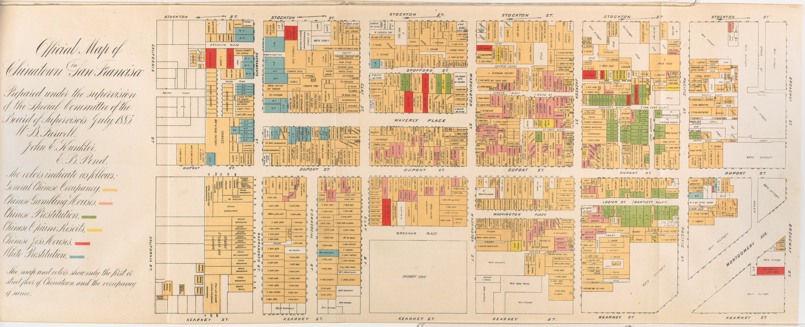


This map reflects the pervasive bias against the Chinese in California and in turn further fostered the hysteria. It was published as part of an official report of a Special Committee established by the San Francisco Board of Supervisors "on the Condition of the Chinese Quarter." The Report resulted from a dramatic increase in hostility to the Chinese, particularly because many Chinese laborers had been driven out of other Western states by vigilantes and sought safety in San Francisco (Shah 2001, 37).

The substance and tone of the Report is best illustrated by a few excerpts: "The general aspect of the streets and habitations was filthy in the extreme, . . . a slumbering pest, likely at any time to generate and spread disease, . . . a constant source of danger . . . , the filthiest spot inhabited by men, women and children on the American continent." (Report 4-5). "The Chinese brought here with them and have successfully maintained and perpetuated the grossest habits of bestiality practiced by the human race." (Ibid. 38).

The map highlights the Committee's points, particularly the pervasiveness of gambling, prostitution and opium use. It shows the occupancy of the street floor of every building in Chinatown, color coded to show: General Chinese Occupancy, Chinese Gambling Houses, Chinese Prostitution, Chinese Opium Resorts, Chinese Joss Houses, and White Prostitution.

The Report concludes with a recommendation that the Chinese be driven out of the City by stern enforcement of the law: "compulsory obedience to our laws [is] necessarily obnoxious and revolting to the Chinese and the more rigidly this enforcement is insisted upon and carried out the less endurable will existence be to them here, the less attractive will life be to them in California. Fewer will come and fewer will remain. . . . Scatter them by such a policy as this to other States . . . ." (Ibid. 67-68)

# 2. Analyzing Demographics
In this section, we will examine some of the factors that influence population growth and how they are changing the landscape of Chinatowns across the U.S.

## 2.1 Reading Data, 2010-2015

Now it's time to work with tables and explore some real data. A `Table` is just like how we made a list above with `make_array`, but for all the rows in a table.

We're going to first look at the most recent demographic data from 2010-2015:


{:.input_area}
```python
historical_data = Table.read_table('data/2010-2015.csv')  # read in data from file
historical_data['FIPS'] = ['0' + str(x) for x in historical_data['FIPS']]  # fix FIPS columns
historical_data.show(10)  # show first ten rows
```


<div markdown="0" class="output output_html">
<table border="1" class="dataframe">
    <thead>
        <tr>
            <th>FIPS</th> <th>Population</th> <th>One_race</th> <th>Two_or_more_races</th> <th>Asian</th> <th>Year</th>
        </tr>
    </thead>
    <tbody>
        <tr>
            <td>06075010100</td> <td>3744      </td> <td>3689    </td> <td>55               </td> <td>1276 </td> <td>2010</td>
        </tr>
        <tr>
            <td>06075010200</td> <td>4184      </td> <td>3942    </td> <td>242              </td> <td>385  </td> <td>2010</td>
        </tr>
        <tr>
            <td>06075010300</td> <td>4285      </td> <td>4173    </td> <td>112              </td> <td>1445 </td> <td>2010</td>
        </tr>
        <tr>
            <td>06075010400</td> <td>4154      </td> <td>4068    </td> <td>86               </td> <td>1161 </td> <td>2010</td>
        </tr>
        <tr>
            <td>06075010500</td> <td>2429      </td> <td>2357    </td> <td>72               </td> <td>317  </td> <td>2010</td>
        </tr>
        <tr>
            <td>06075010600</td> <td>3927      </td> <td>3789    </td> <td>138              </td> <td>2453 </td> <td>2010</td>
        </tr>
        <tr>
            <td>06075010700</td> <td>5683      </td> <td>5657    </td> <td>26               </td> <td>4541 </td> <td>2010</td>
        </tr>
        <tr>
            <td>06075010800</td> <td>4587      </td> <td>4475    </td> <td>112              </td> <td>2336 </td> <td>2010</td>
        </tr>
        <tr>
            <td>06075010900</td> <td>4463      </td> <td>4339    </td> <td>124              </td> <td>1056 </td> <td>2010</td>
        </tr>
        <tr>
            <td>06075011000</td> <td>5718      </td> <td>5653    </td> <td>65               </td> <td>3027 </td> <td>2010</td>
        </tr>
    </tbody>
</table>
<p>... (1172 rows omitted)</p>
</div>


We can get some quick summary statistics by calling the `.stats()` function on our `Table` variable:


{:.input_area}
```python
historical_data.stats()
```


<div markdown="0" class="output output_html">
<table border="1" class="dataframe">
    <thead>
        <tr>
            <th>statistic</th> <th>FIPS</th> <th>Population</th> <th>One_race</th> <th>Two_or_more_races</th> <th>Asian</th> <th>Year</th>
        </tr>
    </thead>
    <tbody>
        <tr>
            <td>min      </td> <td>06075010100</td> <td>0          </td> <td>0          </td> <td>0                </td> <td>0         </td> <td>2010       </td>
        </tr>
        <tr>
            <td>max      </td> <td>06075990100</td> <td>12511      </td> <td>12157      </td> <td>660              </td> <td>5291      </td> <td>2015       </td>
        </tr>
        <tr>
            <td>median   </td> <td>           </td> <td>4026.5     </td> <td>3872       </td> <td>157              </td> <td>1004      </td> <td>2012.5     </td>
        </tr>
        <tr>
            <td>sum      </td> <td>           </td> <td>4.88225e+06</td> <td>4.68046e+06</td> <td>201782           </td> <td>1.6378e+06</td> <td>2.37878e+06</td>
        </tr>
    </tbody>
</table>
</div>


So which census tract has the highest Asian population?

First we can find the highest population by using the `max` function:


{:.input_area}
```python
max(historical_data['Asian'])
```


{:.output .output_data_text}
```
5291.0
```


Let's plug that into a table that uses the `where` and `are.equal_to` functions:


{:.input_area}
```python
historical_data.where('Asian', are.equal_to(max(historical_data['Asian'])))
```


<div markdown="0" class="output output_html">
<table border="1" class="dataframe">
    <thead>
        <tr>
            <th>FIPS</th> <th>Population</th> <th>One_race</th> <th>Two_or_more_races</th> <th>Asian</th> <th>Year</th>
        </tr>
    </thead>
    <tbody>
        <tr>
            <td>06075035300</td> <td>7885      </td> <td>7667    </td> <td>218              </td> <td>5291 </td> <td>2014</td>
        </tr>
    </tbody>
</table>
</div>


This FIPS code 06075035300 is tract [353](https://censusreporter.org/profiles/14000US06075035300-census-tract-353-san-francisco-ca/). Does this make sense to you?

---

It might be better to look at which census tracts has Asian as the highest proportion of the population:


{:.input_area}
```python
historical_data['Asian_percentage'] = historical_data['Asian'] / historical_data['Population']
historical_data.show(5)
```


<div markdown="0" class="output output_html">
<table border="1" class="dataframe">
    <thead>
        <tr>
            <th>FIPS</th> <th>Population</th> <th>One_race</th> <th>Two_or_more_races</th> <th>Asian</th> <th>Year</th> <th>Asian_percentage</th>
        </tr>
    </thead>
    <tbody>
        <tr>
            <td>06075010100</td> <td>3744      </td> <td>3689    </td> <td>55               </td> <td>1276 </td> <td>2010</td> <td>0.340812        </td>
        </tr>
        <tr>
            <td>06075010200</td> <td>4184      </td> <td>3942    </td> <td>242              </td> <td>385  </td> <td>2010</td> <td>0.0920172       </td>
        </tr>
        <tr>
            <td>06075010300</td> <td>4285      </td> <td>4173    </td> <td>112              </td> <td>1445 </td> <td>2010</td> <td>0.337223        </td>
        </tr>
        <tr>
            <td>06075010400</td> <td>4154      </td> <td>4068    </td> <td>86               </td> <td>1161 </td> <td>2010</td> <td>0.27949         </td>
        </tr>
        <tr>
            <td>06075010500</td> <td>2429      </td> <td>2357    </td> <td>72               </td> <td>317  </td> <td>2010</td> <td>0.130506        </td>
        </tr>
    </tbody>
</table>
<p>... (1177 rows omitted)</p>
</div>


Now we can use the same method to get the `max` and subset our table:


{:.input_area}
```python
max(historical_data['Asian_percentage'])
```


{:.output .output_data_text}
```
0.9575070821529745
```


{:.input_area}
```python
historical_data.where('Asian_percentage', are.equal_to(max(historical_data['Asian_percentage'])))
```


<div markdown="0" class="output output_html">
<table border="1" class="dataframe">
    <thead>
        <tr>
            <th>FIPS</th> <th>Population</th> <th>One_race</th> <th>Two_or_more_races</th> <th>Asian</th> <th>Year</th> <th>Asian_percentage</th>
        </tr>
    </thead>
    <tbody>
        <tr>
            <td>06075011800</td> <td>1765      </td> <td>1765    </td> <td>0                </td> <td>1690 </td> <td>2010</td> <td>0.957507        </td>
        </tr>
    </tbody>
</table>
</div>


FIPS code 06075011800 is census tract [118](https://censusreporter.org/profiles/14000US06075011800-census-tract-118-san-francisco-ca/). Does this make sense?

<div class="alert alert-info">
Question: Write one sentence describing the Asian population in Chinatown.
</div>

_Replace this text with your response_

---

### Tables Essentials!

For your reference, here's a table of useful `Table` functions:

|Name|Example|Purpose|
|-|-|-|
|`Table`|`Table()`|Create an empty table, usually to extend with data|
|`Table.read_table`|`Table.read_table("my_data.csv")`|Create a table from a data file|
|`with_columns`|`tbl = Table().with_columns("N", np.arange(5), "2*N", np.arange(0, 10, 2))`|Create a copy of a table with more columns|
|`column`|`tbl.column("N")`|Create an array containing the elements of a column|
|`sort`|`tbl.sort("N")`|Create a copy of a table sorted by the values in a column|
|`where`|`tbl.where("N", are.above(2))`|Create a copy of a table with only the rows that match some *predicate*|
|`num_rows`|`tbl.num_rows`|Compute the number of rows in a table|
|`num_columns`|`tbl.num_columns`|Compute the number of columns in a table|
|`select`|`tbl.select("N")`|Create a copy of a table with only some of the columns|
|`drop`|`tbl.drop("2*N")`|Create a copy of a table without some of the columns|
|`take`|`tbl.take(np.arange(0, 6, 2))`|Create a copy of the table with only the rows whose indices are in the given array|
|`join`|`tbl1.join("shared_column_name", tbl2)`|Join together two tables with a common column name
|`are.equal_to()`|`tbl.where("SEX", are.equal_to(0))`|find values equal to that indicated|
|`are.not_equal_to()`|`tbl.where("SEX", are.not_equal_to(0))` | find values not including the one indicated|
|`are.above()`| `tbl.where("AGE", are.above(30))` | find values greater to that indicated|
|`are.below()`| `tbl.where("AGE", are.below(40))` | find values less than that indicated |
|`are.between()`| `tbl.where("SEX", are.between(18, 60))` | find values between the two indicated |

---

---

## 2.2 The correlation coefficient - *r*

If we were interested in the relationship between two variables in our dataset, we'd want to look at correlation.


> The correlation coefficient ranges from −1 to 1. A value of 1 implies that a linear equation describes the relationship between X and Y perfectly, with all data points lying on a line for which Y increases as X increases. A value of −1 implies that all data points lie on a line for which Y decreases as X increases. A value of 0 implies that there is no linear correlation between the variables. ~Wikipedia

*r* = 1: the scatter diagram is a perfect straight line sloping upwards

*r* = -1: the scatter diagram is a perfect straight line sloping downwards.

Let's calculate the correlation coefficient between each of the continuous variables in our dataset.. We can use the `.to_df().corr()` function:


{:.input_area}
```python
historical_data.to_df().corr()
```


<div markdown="0" class="output output_html">
<div>
<style scoped>
    .dataframe tbody tr th:only-of-type {
        vertical-align: middle;
    }

    .dataframe tbody tr th {
        vertical-align: top;
    }

    .dataframe thead th {
        text-align: right;
    }
</style>
<table border="1" class="dataframe">
  <thead>
    <tr style="text-align: right;">
      <th></th>
      <th>Population</th>
      <th>One_race</th>
      <th>Two_or_more_races</th>
      <th>Asian</th>
      <th>Year</th>
      <th>Asian_percentage</th>
    </tr>
  </thead>
  <tbody>
    <tr>
      <th>Population</th>
      <td>1.000000</td>
      <td>0.998493</td>
      <td>0.568193</td>
      <td>0.690292</td>
      <td>0.053188</td>
      <td>0.264237</td>
    </tr>
    <tr>
      <th>One_race</th>
      <td>0.998493</td>
      <td>1.000000</td>
      <td>0.522172</td>
      <td>0.696641</td>
      <td>0.043588</td>
      <td>0.273538</td>
    </tr>
    <tr>
      <th>Two_or_more_races</th>
      <td>0.568193</td>
      <td>0.522172</td>
      <td>1.000000</td>
      <td>0.281429</td>
      <td>0.172941</td>
      <td>0.002922</td>
    </tr>
    <tr>
      <th>Asian</th>
      <td>0.690292</td>
      <td>0.696641</td>
      <td>0.281429</td>
      <td>1.000000</td>
      <td>0.029201</td>
      <td>0.839065</td>
    </tr>
    <tr>
      <th>Year</th>
      <td>0.053188</td>
      <td>0.043588</td>
      <td>0.172941</td>
      <td>0.029201</td>
      <td>1.000000</td>
      <td>0.002954</td>
    </tr>
    <tr>
      <th>Asian_percentage</th>
      <td>0.264237</td>
      <td>0.273538</td>
      <td>0.002922</td>
      <td>0.839065</td>
      <td>0.002954</td>
      <td>1.000000</td>
    </tr>
  </tbody>
</table>
</div>
</div>


We often visualize correlations with a `scatter` plot:


{:.input_area}
```python
historical_data.scatter('Population', 'Asian')
```


{:.output .output_png}


{:.input_area}
```python
historical_data.scatter('One_race', 'Asian')
```


{:.output .output_png}
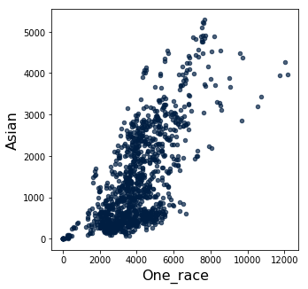


{:.input_area}
```python
historical_data.scatter('Two_or_more_races', 'Asian')
```


{:.output .output_png}
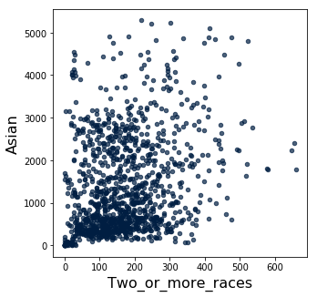


To look at a 1-1 relationship over time we might prefer a simple line graph. We can first group the data by `Year`, then take the `mean` for the `Population`, and `plot` that against `Year`:


{:.input_area}
```python
historical_data.to_df().groupby('Year')['Population'].mean()
```


{:.output .output_data_text}
```
Year
2010    4005.949239
2011    4050.675127
2012    4100.279188
2013    4149.751269
2014    4208.487310
2015    4267.832487
Name: Population, dtype: float64
```


{:.input_area}
```python
historical_data.to_df().groupby('Year')['Population'].mean().plot()
```


{:.output .output_data_text}
```
<matplotlib.axes._subplots.AxesSubplot at 0x1317a5a20>
```


{:.output .output_png}
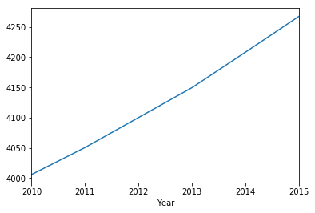


{:.input_area}
```python
historical_data.to_df().groupby('Year')['Asian_percentage'].mean().plot()
```


{:.output .output_data_text}
```
<matplotlib.axes._subplots.AxesSubplot at 0x1318a4f60>
```


{:.output .output_png}
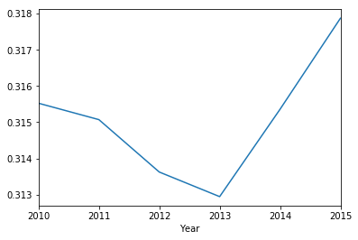


## 2.3 2015

Let's look at only the year 2015:


{:.input_area}
```python
historical_2015 = historical_data.where('Year', are.equal_to(2015))
historical_2015.show(5)
```


<div markdown="0" class="output output_html">
<table border="1" class="dataframe">
    <thead>
        <tr>
            <th>FIPS</th> <th>Population</th> <th>One_race</th> <th>Two_or_more_races</th> <th>Asian</th> <th>Year</th> <th>Asian_percentage</th>
        </tr>
    </thead>
    <tbody>
        <tr>
            <td>06075010100</td> <td>3798      </td> <td>3517    </td> <td>281              </td> <td>1284 </td> <td>2015</td> <td>0.338073        </td>
        </tr>
        <tr>
            <td>06075010200</td> <td>4172      </td> <td>4014    </td> <td>158              </td> <td>401  </td> <td>2015</td> <td>0.096117        </td>
        </tr>
        <tr>
            <td>06075010300</td> <td>4387      </td> <td>4334    </td> <td>53               </td> <td>1700 </td> <td>2015</td> <td>0.387509        </td>
        </tr>
        <tr>
            <td>06075010400</td> <td>5148      </td> <td>4709    </td> <td>439              </td> <td>1429 </td> <td>2015</td> <td>0.277584        </td>
        </tr>
        <tr>
            <td>06075010500</td> <td>2589      </td> <td>2337    </td> <td>252              </td> <td>804  </td> <td>2015</td> <td>0.310545        </td>
        </tr>
    </tbody>
</table>
<p>... (192 rows omitted)</p>
</div>


We can make a [choropleth map](https://en.wikipedia.org/wiki/Choropleth_map) with a little function, don't worry about the code below!


{:.input_area}
```python
def choro_column(tab, column):
    sf_2010 = geojson.load(open("data/2010-sf.geojson"))
    threshold_scale = np.linspace(min(tab[column]), max(tab[column]), 6, dtype=float).tolist()

    mapa = folium.Map(location=(37.7793784, -122.4063879), zoom_start=11)
    mapa.choropleth(geo_data=sf_2010,
                    data=tab.to_df(),
                    columns=['FIPS', column],
                    fill_color='YlOrRd',
                    key_on='feature.properties.GEOID10',
                    threshold_scale=threshold_scale)
    
    mapa.save("output/map-{}.html".format(column.replace(" ", "-")))
    return mapa
```


Here's a choropleth of all the population:


{:.input_area}
```python
choro_column(historical_2015, 'Population')
IFrame('output/map-Population.html', width=700, height=400)
```


<div markdown="0" class="output output_html">

<iframe
    width="700"
    height="400"
    src="output/map-Population.html"
    frameborder="0"
    allowfullscreen
></iframe>

</div>


Let's look at only Asian:


{:.input_area}
```python
choro_column(historical_2015, 'Asian')
```


<div markdown="0" class="output output_html">
<div style="width:100%;"><div style="position:relative;width:100%;height:0;padding-bottom:60%;"><iframe src="data:text/html;charset=utf-8;base64,PCFET0NUWVBFIGh0bWw+CjxoZWFkPiAgICAKICAgIDxtZXRhIGh0dHAtZXF1aXY9ImNvbnRlbnQtdHlwZSIgY29udGVudD0idGV4dC9odG1sOyBjaGFyc2V0PVVURi04IiAvPgogICAgCiAgICAgICAgPHNjcmlwdD4KICAgICAgICAgICAgTF9OT19UT1VDSCA9IGZhbHNlOwogICAgICAgICAgICBMX0RJU0FCTEVfM0QgPSBmYWxzZTsKICAgICAgICA8L3NjcmlwdD4KICAgIAogICAgPHNjcmlwdCBzcmM9Imh0dHBzOi8vY2RuLmpzZGVsaXZyLm5ldC9ucG0vbGVhZmxldEAxLjQuMC9kaXN0L2xlYWZsZXQuanMiPjwvc2NyaXB0PgogICAgPHNjcmlwdCBzcmM9Imh0dHBzOi8vY29kZS5qcXVlcnkuY29tL2pxdWVyeS0xLjEyLjQubWluLmpzIj48L3NjcmlwdD4KICAgIDxzY3JpcHQgc3JjPSJodHRwczovL21heGNkbi5ib290c3RyYXBjZG4uY29tL2Jvb3RzdHJhcC8zLjIuMC9qcy9ib290c3RyYXAubWluLmpzIj48L3NjcmlwdD4KICAgIDxzY3JpcHQgc3JjPSJodHRwczovL2NkbmpzLmNsb3VkZmxhcmUuY29tL2FqYXgvbGlicy9MZWFmbGV0LmF3ZXNvbWUtbWFya2Vycy8yLjAuMi9sZWFmbGV0LmF3ZXNvbWUtbWFya2Vycy5qcyI+PC9zY3JpcHQ+CiAgICA8bGluayByZWw9InN0eWxlc2hlZXQiIGhyZWY9Imh0dHBzOi8vY2RuLmpzZGVsaXZyLm5ldC9ucG0vbGVhZmxldEAxLjQuMC9kaXN0L2xlYWZsZXQuY3NzIi8+CiAgICA8bGluayByZWw9InN0eWxlc2hlZXQiIGhyZWY9Imh0dHBzOi8vbWF4Y2RuLmJvb3RzdHJhcGNkbi5jb20vYm9vdHN0cmFwLzMuMi4wL2Nzcy9ib290c3RyYXAubWluLmNzcyIvPgogICAgPGxpbmsgcmVsPSJzdHlsZXNoZWV0IiBocmVmPSJodHRwczovL21heGNkbi5ib290c3RyYXBjZG4uY29tL2Jvb3RzdHJhcC8zLjIuMC9jc3MvYm9vdHN0cmFwLXRoZW1lLm1pbi5jc3MiLz4KICAgIDxsaW5rIHJlbD0ic3R5bGVzaGVldCIgaHJlZj0iaHR0cHM6Ly9tYXhjZG4uYm9vdHN0cmFwY2RuLmNvbS9mb250LWF3ZXNvbWUvNC42LjMvY3NzL2ZvbnQtYXdlc29tZS5taW4uY3NzIi8+CiAgICA8bGluayByZWw9InN0eWxlc2hlZXQiIGhyZWY9Imh0dHBzOi8vY2RuanMuY2xvdWRmbGFyZS5jb20vYWpheC9saWJzL0xlYWZsZXQuYXdlc29tZS1tYXJrZXJzLzIuMC4yL2xlYWZsZXQuYXdlc29tZS1tYXJrZXJzLmNzcyIvPgogICAgPGxpbmsgcmVsPSJzdHlsZXNoZWV0IiBocmVmPSJodHRwczovL3Jhd2Nkbi5naXRoYWNrLmNvbS9weXRob24tdmlzdWFsaXphdGlvbi9mb2xpdW0vbWFzdGVyL2ZvbGl1bS90ZW1wbGF0ZXMvbGVhZmxldC5hd2Vzb21lLnJvdGF0ZS5jc3MiLz4KICAgIDxzdHlsZT5odG1sLCBib2R5IHt3aWR0aDogMTAwJTtoZWlnaHQ6IDEwMCU7bWFyZ2luOiAwO3BhZGRpbmc6IDA7fTwvc3R5bGU+CiAgICA8c3R5bGU+I21hcCB7cG9zaXRpb246YWJzb2x1dGU7dG9wOjA7Ym90dG9tOjA7cmlnaHQ6MDtsZWZ0OjA7fTwvc3R5bGU+CiAgICAKICAgICAgICAgICAgPG1ldGEgbmFtZT0idmlld3BvcnQiIGNvbnRlbnQ9IndpZHRoPWRldmljZS13aWR0aCwKICAgICAgICAgICAgICAgIGluaXRpYWwtc2NhbGU9MS4wLCBtYXhpbXVtLXNjYWxlPTEuMCwgdXNlci1zY2FsYWJsZT1ubyIgLz4KICAgICAgICAgICAgPHN0eWxlPgogICAgICAgICAgICAgICAgI21hcF9kYjBlZjQ0MjgwNzY0MTg2YjJkMTEwMzk4NjYxMTMyNiB7CiAgICAgICAgICAgICAgICAgICAgcG9zaXRpb246IHJlbGF0aXZlOwogICAgICAgICAgICAgICAgICAgIHdpZHRoOiAxMDAuMCU7CiAgICAgICAgICAgICAgICAgICAgaGVpZ2h0OiAxMDAuMCU7CiAgICAgICAgICAgICAgICAgICAgbGVmdDogMC4wJTsKICAgICAgICAgICAgICAgICAgICB0b3A6IDAuMCU7CiAgICAgICAgICAgICAgICB9CiAgICAgICAgICAgIDwvc3R5bGU+CiAgICAgICAgCiAgICA8c2NyaXB0IHNyYz0iaHR0cHM6Ly9jZG5qcy5jbG91ZGZsYXJlLmNvbS9hamF4L2xpYnMvZDMvMy41LjUvZDMubWluLmpzIj48L3NjcmlwdD4KPC9oZWFkPgo8Ym9keT4gICAgCiAgICAKICAgICAgICAgICAgPGRpdiBjbGFzcz0iZm9saXVtLW1hcCIgaWQ9Im1hcF9kYjBlZjQ0MjgwNzY0MTg2YjJkMTEwMzk4NjYxMTMyNiIgPjwvZGl2PgogICAgICAgIAo8L2JvZHk+CjxzY3JpcHQ+ICAgIAogICAgCiAgICAgICAgICAgIHZhciBtYXBfZGIwZWY0NDI4MDc2NDE4NmIyZDExMDM5ODY2MTEzMjYgPSBMLm1hcCgKICAgICAgICAgICAgICAgICJtYXBfZGIwZWY0NDI4MDc2NDE4NmIyZDExMDM5ODY2MTEzMjYiLAogICAgICAgICAgICAgICAgewogICAgICAgICAgICAgICAgICAgIGNlbnRlcjogWzM3Ljc3OTM3ODQsIC0xMjIuNDA2Mzg3OV0sCiAgICAgICAgICAgICAgICAgICAgY3JzOiBMLkNSUy5FUFNHMzg1NywKICAgICAgICAgICAgICAgICAgICB6b29tOiAxMSwKICAgICAgICAgICAgICAgICAgICB6b29tQ29udHJvbDogdHJ1ZSwKICAgICAgICAgICAgICAgICAgICBwcmVmZXJDYW52YXM6IGZhbHNlLAogICAgICAgICAgICAgICAgfQogICAgICAgICAgICApOwoKICAgICAgICAgICAgCgogICAgICAgIAogICAgCiAgICAgICAgICAgIHZhciB0aWxlX2xheWVyX2RiMGY2ZWU3YmFhODRkMmY4Mjk3ODg1NDRiODg1OWExID0gTC50aWxlTGF5ZXIoCiAgICAgICAgICAgICAgICAiaHR0cHM6Ly97c30udGlsZS5vcGVuc3RyZWV0bWFwLm9yZy97en0ve3h9L3t5fS5wbmciLAogICAgICAgICAgICAgICAgeyJhdHRyaWJ1dGlvbiI6ICJEYXRhIGJ5IFx1MDAyNmNvcHk7IFx1MDAzY2EgaHJlZj1cImh0dHA6Ly9vcGVuc3RyZWV0bWFwLm9yZ1wiXHUwMDNlT3BlblN0cmVldE1hcFx1MDAzYy9hXHUwMDNlLCB1bmRlciBcdTAwM2NhIGhyZWY9XCJodHRwOi8vd3d3Lm9wZW5zdHJlZXRtYXAub3JnL2NvcHlyaWdodFwiXHUwMDNlT0RiTFx1MDAzYy9hXHUwMDNlLiIsICJkZXRlY3RSZXRpbmEiOiBmYWxzZSwgIm1heE5hdGl2ZVpvb20iOiAxOCwgIm1heFpvb20iOiAxOCwgIm1pblpvb20iOiAwLCAibm9XcmFwIjogZmFsc2UsICJvcGFjaXR5IjogMSwgInN1YmRvbWFpbnMiOiAiYWJjIiwgInRtcyI6IGZhbHNlfQogICAgICAgICAgICApLmFkZFRvKG1hcF9kYjBlZjQ0MjgwNzY0MTg2YjJkMTEwMzk4NjYxMTMyNik7CiAgICAgICAgCiAgICAKICAgICAgICAgICAgdmFyIGNob3JvcGxldGhfMGZiMjdkNjA0Njk3NDM4NTgxMGI0MjE4M2Q5MzIxY2QgPSBMLmZlYXR1cmVHcm91cCgKICAgICAgICAgICAgICAgIHt9CiAgICAgICAgICAgICkuYWRkVG8obWFwX2RiMGVmNDQyODA3NjQxODZiMmQxMTAzOTg2NjExMzI2KTsKICAgICAgICAKICAgIAogICAgICAgIGZ1bmN0aW9uIGdlb19qc29uXzUwYjM4YzBhNmQ4NDRjYTNhNjFkNjU5ZjY1NDI0Y2I3X3N0eWxlcihmZWF0dXJlKSB7CiAgICAgICAgICAgIHN3aXRjaChmZWF0dXJlLnByb3BlcnRpZXMuVFJBQ1RDRTEwKSB7CiAgICAgICAgICAgICAgICBjYXNlICIwMTYxMDAiOiBjYXNlICIwMTU5MDAiOiBjYXNlICIwMTU2MDAiOiBjYXNlICIwMTU1MDAiOiBjYXNlICIwMTU0MDAiOiBjYXNlICIwMTUyMDAiOiBjYXNlICIwMTIxMDAiOiBjYXNlICIwMTIwMDAiOiBjYXNlICIwMTE4MDAiOiBjYXNlICIwMTEyMDAiOiBjYXNlICIwMTExMDAiOiBjYXNlICIwMTA5MDAiOiBjYXNlICIwMTI1MDIiOiBjYXNlICIwMTA0MDAiOiBjYXNlICIwMTAzMDAiOiBjYXNlICIwMTAxMDAiOiBjYXNlICIwNjEyMDAiOiBjYXNlICIwNDc4MDEiOiBjYXNlICIwNDI2MDIiOiBjYXNlICIwNDI2MDEiOiBjYXNlICIwMzMyMDQiOiBjYXNlICIwMzMyMDMiOiBjYXNlICIwMzEyMDIiOiBjYXNlICIwMTc4MDIiOiBjYXNlICIwMTI1MDEiOiBjYXNlICIwMTI0MDIiOiBjYXNlICIwMTI0MDEiOiBjYXNlICIwMTIyMDEiOiBjYXNlICIwMjMwMDMiOiBjYXNlICIwNjA1MDIiOiBjYXNlICIwNDc5MDIiOiBjYXNlICIwNDUxMDAiOiBjYXNlICIwNDAxMDAiOiBjYXNlICIwMzUyMDIiOiBjYXNlICIwMzExMDAiOiBjYXNlICIwMzEwMDAiOiBjYXNlICIwMzA4MDAiOiBjYXNlICIwMzA3MDAiOiBjYXNlICIwMzAyMDIiOiBjYXNlICIwMzAxMDIiOiBjYXNlICIwMzAxMDEiOiBjYXNlICIwMjY0MDQiOiBjYXNlICIwMzAyMDEiOiBjYXNlICIwMjU4MDAiOiBjYXNlICIwMjYwMDIiOiBjYXNlICIwMjU0MDMiOiBjYXNlICIwMjAyMDAiOiBjYXNlICIwMjAxMDAiOiAKICAgICAgICAgICAgICAgICAgICByZXR1cm4geyJjb2xvciI6ICJibGFjayIsICJmaWxsQ29sb3IiOiAiI2ZlY2M1YyIsICJmaWxsT3BhY2l0eSI6IDAuNiwgIm9wYWNpdHkiOiAxLCAid2VpZ2h0IjogMX07CiAgICAgICAgICAgICAgICBjYXNlICIwMTU3MDAiOiBjYXNlICIwMTEzMDAiOiBjYXNlICIwMTEwMDAiOiBjYXNlICIwMTA4MDAiOiBjYXNlICIwMTA2MDAiOiBjYXNlICIwNDc4MDIiOiBjYXNlICIwMzI4MDEiOiBjYXNlICIwMzI2MDIiOiBjYXNlICIwMzI2MDEiOiBjYXNlICIwMzEzMDEiOiBjYXNlICIwMjU3MDEiOiBjYXNlICIwMTc4MDEiOiBjYXNlICIwNjEwMDAiOiBjYXNlICIwNDc5MDEiOiBjYXNlICIwNDc3MDIiOiBjYXNlICIwNDc2MDAiOiBjYXNlICIwNDUyMDAiOiBjYXNlICIwNDI3MDAiOiBjYXNlICIwNDAyMDAiOiBjYXNlICIwNDc3MDEiOiBjYXNlICIwMzA0MDAiOiBjYXNlICIwMzAzMDIiOiBjYXNlICIwMzAzMDEiOiBjYXNlICIwMjY0MDMiOiBjYXNlICIwMjY0MDEiOiBjYXNlICIwMjYzMDIiOiBjYXNlICIwMjY0MDIiOiBjYXNlICIwMjYwMDMiOiBjYXNlICIwMjYzMDEiOiBjYXNlICIwMjYwMDQiOiBjYXNlICIwMjYwMDEiOiBjYXNlICIwMjU5MDAiOiBjYXNlICIwMjMzMDAiOiAKICAgICAgICAgICAgICAgICAgICByZXR1cm4geyJjb2xvciI6ICJibGFjayIsICJmaWxsQ29sb3IiOiAiI2ZkOGQzYyIsICJmaWxsT3BhY2l0eSI6IDAuNiwgIm9wYWNpdHkiOiAxLCAid2VpZ2h0IjogMX07CiAgICAgICAgICAgICAgICBjYXNlICIwMTA3MDAiOiBjYXNlICIwNjE1MDAiOiBjYXNlICIwNjExMDAiOiBjYXNlICIwMzEyMDEiOiBjYXNlICIwNjA3MDAiOiBjYXNlICIwMzUzMDAiOiBjYXNlICIwMzUxMDAiOiBjYXNlICIwMzMwMDAiOiBjYXNlICIwMzI3MDAiOiBjYXNlICIwMjYyMDAiOiBjYXNlICIwMjYxMDAiOiAKICAgICAgICAgICAgICAgICAgICByZXR1cm4geyJjb2xvciI6ICJibGFjayIsICJmaWxsQ29sb3IiOiAiI2JkMDAyNiIsICJmaWxsT3BhY2l0eSI6IDAuNiwgIm9wYWNpdHkiOiAxLCAid2VpZ2h0IjogMX07CiAgICAgICAgICAgICAgICBjYXNlICIwMzI5MDIiOiBjYXNlICIwMzI5MDEiOiBjYXNlICIwMzI4MDIiOiBjYXNlICIwMzEzMDIiOiBjYXNlICIwMjU3MDIiOiBjYXNlICIwMzU0MDAiOiBjYXNlICIwMzUyMDEiOiBjYXNlICIwMzMxMDAiOiBjYXNlICIwMzE0MDAiOiBjYXNlICIwMzA5MDAiOiBjYXNlICIwMjYzMDMiOiBjYXNlICIwMjU2MDAiOiBjYXNlICIwMjU1MDAiOiBjYXNlICIwMjMwMDEiOiBjYXNlICIwMTc2MDEiOiAKICAgICAgICAgICAgICAgICAgICByZXR1cm4geyJjb2xvciI6ICJibGFjayIsICJmaWxsQ29sb3IiOiAiI2YwM2IyMCIsICJmaWxsT3BhY2l0eSI6IDAuNiwgIm9wYWNpdHkiOiAxLCAid2VpZ2h0IjogMX07CiAgICAgICAgICAgICAgICBjYXNlIG51bGw6IAogICAgICAgICAgICAgICAgICAgIHJldHVybiB7ImNvbG9yIjogImJsYWNrIiwgImZpbGxDb2xvciI6ICJibGFjayIsICJmaWxsT3BhY2l0eSI6IDAuNiwgIm9wYWNpdHkiOiAxLCAid2VpZ2h0IjogMX07CiAgICAgICAgICAgICAgICBkZWZhdWx0OgogICAgICAgICAgICAgICAgICAgIHJldHVybiB7ImNvbG9yIjogImJsYWNrIiwgImZpbGxDb2xvciI6ICIjZmZmZmIyIiwgImZpbGxPcGFjaXR5IjogMC42LCAib3BhY2l0eSI6IDEsICJ3ZWlnaHQiOiAxfTsKICAgICAgICAgICAgfQogICAgICAgIH0KICAgICAgICBmdW5jdGlvbiBnZW9fanNvbl81MGIzOGMwYTZkODQ0Y2EzYTYxZDY1OWY2NTQyNGNiN19vbkVhY2hGZWF0dXJlKGZlYXR1cmUsIGxheWVyKSB7CiAgICAgICAgICAgIGxheWVyLm9uKHsKICAgICAgICAgICAgICAgIGNsaWNrOiBmdW5jdGlvbihlKSB7CiAgICAgICAgICAgICAgICAgICAgbWFwX2RiMGVmNDQyODA3NjQxODZiMmQxMTAzOTg2NjExMzI2LmZpdEJvdW5kcyhlLnRhcmdldC5nZXRCb3VuZHMoKSk7CiAgICAgICAgICAgICAgICB9CiAgICAgICAgICAgIH0pOwogICAgICAgIH07CiAgICAgICAgdmFyIGdlb19qc29uXzUwYjM4YzBhNmQ4NDRjYTNhNjFkNjU5ZjY1NDI0Y2I3ID0gTC5nZW9Kc29uKG51bGwsIHsKICAgICAgICAgICAgICAgIG9uRWFjaEZlYXR1cmU6IGdlb19qc29uXzUwYjM4YzBhNmQ4NDRjYTNhNjFkNjU5ZjY1NDI0Y2I3X29uRWFjaEZlYXR1cmUsCiAgICAgICAgICAgIAogICAgICAgICAgICAgICAgc3R5bGU6IGdlb19qc29uXzUwYjM4YzBhNmQ4NDRjYTNhNjFkNjU5ZjY1NDI0Y2I3X3N0eWxlciwKICAgICAgICB9KS5hZGRUbyhjaG9yb3BsZXRoXzBmYjI3ZDYwNDY5NzQzODU4MTBiNDIxODNkOTMyMWNkKTsKICAgICAgICAgICAgZ2VvX2pzb25fNTBiMzhjMGE2ZDg0NGNhM2E2MWQ2NTlmNjU0MjRjYjcuYWRkRGF0YSh7ImNycyI6IHsicHJvcGVydGllcyI6IHsibmFtZSI6ICJ1cm46b2djOmRlZjpjcnM6T0dDOjEuMzpDUlM4NCJ9LCAidHlwZSI6ICJuYW1lIn0sICJmZWF0dXJlcyI6IFt7Imdlb21ldHJ5IjogeyJjb29yZGluYXRlcyI6IFtbWy0xMjIuNDQ2NDcxLCAzNy43NzU4MDJdLCBbLTEyMi40NDQ3OCwgMzcuNzc2MDE3XSwgWy0xMjIuNDQzMTMyLCAzNy43NzYyMjZdLCBbLTEyMi40NDE0ODgsIDM3Ljc3NjQzNV0sIFstMTIyLjQ0MTMsIDM3Ljc3NTUwNV0sIFstMTIyLjQ0MTExLCAzNy43NzQ1NjddLCBbLTEyMi40NDA5MjIsIDM3Ljc3MzYzNV0sIFstMTIyLjQ0MjU2NSwgMzcuNzczNDI0XSwgWy0xMjIuNDQ0MjE2LCAzNy43NzMyMTJdLCBbLTEyMi40NDU5MDIsIDM3Ljc3Mjk5NV0sIFstMTIyLjQ0NzQ5NywgMzcuNzcyNzldLCBbLTEyMi40NDkxNDMsIDM3Ljc3MjU3OV0sIFstMTIyLjQ1MDc4NywgMzcuNzcyMzY4XSwgWy0xMjIuNDUyMjQyLCAzNy43NzIxODFdLCBbLTEyMi40NTI0MzcsIDM3Ljc3MjE4OV0sIFstMTIyLjQ1Mzk1OSwgMzcuNzcxOTk3XSwgWy0xMjIuNDU0MDgzLCAzNy43NzE5M10sIFstMTIyLjQ1NDI4NSwgMzcuNzcyODk1XSwgWy0xMjIuNDU0NDUxLCAzNy43NzM3MTFdLCBbLTEyMi40NTQ2NDIsIDM3Ljc3NDY0Nl0sIFstMTIyLjQ1NDY4MywgMzcuNzc0NzU1XSwgWy0xMjIuNDUzMDAzLCAzNy43NzQ5NzFdLCBbLTEyMi40NTI4MSwgMzcuNzc0OTk1XSwgWy0xMjIuNDUxMzU4LCAzNy43NzUxNzVdLCBbLTEyMi40NDk3MDgsIDM3Ljc3NTM5XSwgWy0xMjIuNDQ4ODUsIDM3Ljc3NTQ5OV0sIFstMTIyLjQ0ODA2OCwgMzcuNzc1NTk5XSwgWy0xMjIuNDQ3NDQzLCAzNy43NzU2NzhdLCBbLTEyMi40NDY0NzEsIDM3Ljc3NTgwMl1dXSwgInR5cGUiOiAiUG9seWdvbiJ9LCAicHJvcGVydGllcyI6IHsiQUxBTkQxMCI6IDM3MDQ1OS4wLCAiQVdBVEVSMTAiOiAwLjAsICJDT1VOVFlGUDEwIjogIjA3NSIsICJGVU5DU1RBVDEwIjogIlMiLCAiR0VPSUQxMCI6ICIwNjA3NTAxNjUwMCIsICJJTlRQVExBVDEwIjogIiszNy43NzQxOTU4IiwgIklOVFBUTE9OMTAiOiAiLTEyMi40NDc3ODg0IiwgIk1URkNDMTAiOiAiRzUwMjAiLCAiTkFNRTEwIjogIjE2NSIsICJOQU1FTFNBRDEwIjogIkNlbnN1cyBUcmFjdCAxNjUiLCAiU1RBVEVGUDEwIjogIjA2IiwgIlRSQUNUQ0UxMCI6ICIwMTY1MDAifSwgInR5cGUiOiAiRmVhdHVyZSJ9LCB7Imdlb21ldHJ5IjogeyJjb29yZGluYXRlcyI6IFtbWy0xMjIuNDQwMzQsIDM3Ljc3NjU4XSwgWy0xMjIuNDM5ODQ0LCAzNy43NzY2NDRdLCBbLTEyMi40MzgxNzcsIDM3Ljc3Njg1Nl0sIFstMTIyLjQzNjUwNywgMzcuNzc3MDY4XSwgWy0xMjIuNDM0ODY0LCAzNy43NzcyODFdLCBbLTEyMi40MzMyMTksIDM3Ljc3NzQ5XSwgWy0xMjIuNDMzMDI4LCAzNy43NzY1NV0sIFstMTIyLjQzMjg2LCAzNy43NzU3MTldLCBbLTEyMi40MzI4MywgMzcuNzc1NjI2XSwgWy0xMjIuNDMyNjYzLCAzNy43NzQ4XSwgWy0xMjIuNDMyNjQ5LCAzNy43NzQ2OTNdLCBbLTEyMi40MzI2MzQsIDM3Ljc3NDU4NV0sIFstMTIyLjQzMjQ2NywgMzcuNzczNzU3XSwgWy0xMjIuNDM0MTA5LCAzNy43NzM1NDldLCBbLTEyMi40MzU3NTEsIDM3Ljc3MzM0Nl0sIFstMTIyLjQzNzQyMywgMzcuNzczMTMzXSwgWy0xMjIuNDM5MDg5LCAzNy43NzI5MjJdLCBbLTEyMi40NDA3MzUsIDM3Ljc3MjcxM10sIFstMTIyLjQ0MDkyMiwgMzcuNzczNjM1XSwgWy0xMjIuNDQxMTEsIDM3Ljc3NDU2N10sIFstMTIyLjQ0MTMsIDM3Ljc3NTUwNV0sIFstMTIyLjQ0MTQ4OCwgMzcuNzc2NDM1XSwgWy0xMjIuNDQwMzQsIDM3Ljc3NjU4XV1dLCAidHlwZSI6ICJQb2x5Z29uIn0sICJwcm9wZXJ0aWVzIjogeyJBTEFORDEwIjogMzA5MDk3LjAsICJBV0FURVIxMCI6IDAuMCwgIkNPVU5UWUZQMTAiOiAiMDc1IiwgIkZVTkNTVEFUMTAiOiAiUyIsICJHRU9JRDEwIjogIjA2MDc1MDE2NDAwIiwgIklOVFBUTEFUMTAiOiAiKzM3Ljc3NTA5OTUiLCAiSU5UUFRMT04xMCI6ICItMTIyLjQzNjk3MjkiLCAiTVRGQ0MxMCI6ICJHNTAyMCIsICJOQU1FMTAiOiAiMTY0IiwgIk5BTUVMU0FEMTAiOiAiQ2Vuc3VzIFRyYWN0IDE2NCIsICJTVEFURUZQMTAiOiAiMDYiLCAiVFJBQ1RDRTEwIjogIjAxNjQwMCJ9LCAidHlwZSI6ICJGZWF0dXJlIn0sIHsiZ2VvbWV0cnkiOiB7ImNvb3JkaW5hdGVzIjogW1tbLTEyMi40MjkxNTIsIDM3Ljc3ODAwN10sIFstMTIyLjQyODkwOSwgMzcuNzc4MDM5XSwgWy0xMjIuNDI4MDg0LCAzNy43NzgxNDVdLCBbLTEyMi40MjY2NDEsIDM3Ljc3ODMyOV0sIFstMTIyLjQyNjU0OCwgMzcuNzc3ODYyXSwgWy0xMjIuNDI2NDUyLCAzNy43NzczODhdLCBbLTEyMi40MjYzNTksIDM3Ljc3NjkzXSwgWy0xMjIuNDI2MjYzLCAzNy43NzY0NjRdLCBbLTEyMi40MjYxNjcsIDM3Ljc3NTk5N10sIFstMTIyLjQyNjA3LCAzNy43NzU1MjVdLCBbLTEyMi40MjU5NzksIDM3Ljc3NTA0OV0sIFstMTIyLjQyNTg4OCwgMzcuNzc0NTk5XSwgWy0xMjIuNDI3NTQ2LCAzNy43NzQzODhdLCBbLTEyMi40MjkxNzgsIDM3Ljc3NDE4MV0sIFstMTIyLjQzMDgyNSwgMzcuNzczOTczXSwgWy0xMjIuNDMyMzUxLCAzNy43NzM3NzldLCBbLTEyMi40MzI0NjcsIDM3Ljc3Mzc1N10sIFstMTIyLjQzMjYzNCwgMzcuNzc0NTg1XSwgWy0xMjIuNDMyNjQ5LCAzNy43NzQ2OTNdLCBbLTEyMi40MzI2NjMsIDM3Ljc3NDhdLCBbLTEyMi40MzI4MywgMzcuNzc1NjI2XSwgWy0xMjIuNDMyODYsIDM3Ljc3NTcxOV0sIFstMTIyLjQzMzAyOCwgMzcuNzc2NTVdLCBbLTEyMi40MzMyMTksIDM3Ljc3NzQ5XSwgWy0xMjIuNDMxNTc1LCAzNy43Nzc3XSwgWy0xMjIuNDMwNTc2LCAzNy43Nzc4MjddLCBbLTEyMi40Mjk4NDksIDM3Ljc3NzkxOV0sIFstMTIyLjQyOTE1MiwgMzcuNzc4MDA3XV1dLCAidHlwZSI6ICJQb2x5Z29uIn0sICJwcm9wZXJ0aWVzIjogeyJBTEFORDEwIjogMjQ1ODY3LjAsICJBV0FURVIxMCI6IDAuMCwgIkNPVU5UWUZQMTAiOiAiMDc1IiwgIkZVTkNTVEFUMTAiOiAiUyIsICJHRU9JRDEwIjogIjA2MDc1MDE2MzAwIiwgIklOVFBUTEFUMTAiOiAiKzM3Ljc3NjA0NTYiLCAiSU5UUFRMT04xMCI6ICItMTIyLjQyOTU1MDkiLCAiTVRGQ0MxMCI6ICJHNTAyMCIsICJOQU1FMTAiOiAiMTYzIiwgIk5BTUVMU0FEMTAiOiAiQ2Vuc3VzIFRyYWN0IDE2MyIsICJTVEFURUZQMTAiOiAiMDYiLCAiVFJBQ1RDRTEwIjogIjAxNjMwMCJ9LCAidHlwZSI6ICJGZWF0dXJlIn0sIHsiZ2VvbWV0cnkiOiB7ImNvb3JkaW5hdGVzIjogW1tbLTEyMi40Mjg5MDksIDM3Ljc3ODAzOV0sIFstMTIyLjQyOTE1MiwgMzcuNzc4MDA3XSwgWy0xMjIuNDI5ODQ5LCAzNy43Nzc5MTldLCBbLTEyMi40MzA1NzYsIDM3Ljc3NzgyN10sIFstMTIyLjQzMTU3NSwgMzcuNzc3N10sIFstMTIyLjQzMzIxOSwgMzcuNzc3NDldLCBbLTEyMi40MzM0MDcsIDM3Ljc3ODQyMl0sIFstMTIyLjQzMzU5NiwgMzcuNzc5MzU1XSwgWy0xMjIuNDMzNzg1LCAzNy43ODAyODddLCBbLTEyMi40MzM5NzMsIDM3Ljc4MTIxOV0sIFstMTIyLjQzMzI1MSwgMzcuNzgxMzFdLCBbLTEyMi40MzIzMjksIDM3Ljc4MTQyOF0sIFstMTIyLjQzMTY5NiwgMzcuNzgxNTA4XSwgWy0xMjIuNDMwNjA5LCAzNy43ODE2NDZdLCBbLTEyMi40MjkwNDEsIDM3Ljc4MTg0N10sIFstMTIyLjQyNzM5NiwgMzcuNzgyMDU3XSwgWy0xMjIuNDI0MTA4LCAzNy43ODI0NzddLCBbLTEyMi40MjM5MTgsIDM3Ljc4MTUzNl0sIFstMTIyLjQyMzgyNSwgMzcuNzgxMDc4XSwgWy0xMjIuNDIzNzMxLCAzNy43ODA2MTJdLCBbLTEyMi40MjM1NDEsIDM3Ljc3OTY3NF0sIFstMTIyLjQyMzQ0OCwgMzcuNzc5MjEzXSwgWy0xMjIuNDIzMzU0LCAzNy43Nzg3NDddLCBbLTEyMi40MjQ5OTgsIDM3Ljc3ODUzOF0sIFstMTIyLjQyNjY0MSwgMzcuNzc4MzI5XSwgWy0xMjIuNDI4MDg0LCAzNy43NzgxNDVdLCBbLTEyMi40Mjg5MDksIDM3Ljc3ODAzOV1dXSwgInR5cGUiOiAiUG9seWdvbiJ9LCAicHJvcGVydGllcyI6IHsiQUxBTkQxMCI6IDM2ODkwMS4wLCAiQVdBVEVSMTAiOiAwLjAsICJDT1VOVFlGUDEwIjogIjA3NSIsICJGVU5DU1RBVDEwIjogIlMiLCAiR0VPSUQxMCI6ICIwNjA3NTAxNjEwMCIsICJJTlRQVExBVDEwIjogIiszNy43Nzk5ODMxIiwgIklOVFBUTE9OMTAiOiAiLTEyMi40Mjg2NjMxIiwgIk1URkNDMTAiOiAiRzUwMjAiLCAiTkFNRTEwIjogIjE2MSIsICJOQU1FTFNBRDEwIjogIkNlbnN1cyBUcmFjdCAxNjEiLCAiU1RBVEVGUDEwIjogIjA2IiwgIlRSQUNUQ0UxMCI6ICIwMTYxMDAifSwgInR5cGUiOiAiRmVhdHVyZSJ9LCB7Imdlb21ldHJ5IjogeyJjb29yZGluYXRlcyI6IFtbWy0xMjIuNDIwNDI1LCAzNy43ODA1ODNdLCBbLTEyMi40MjAzMzYsIDM3Ljc4MDE5XSwgWy0xMjIuNDIwMjQ3LCAzNy43ODAwNzVdLCBbLTEyMi40MjA0NjEsIDM3Ljc4MDA2OV0sIFstMTIyLjQyMTg5MiwgMzcuNzc5ODldLCBbLTEyMi40MjM1NDEsIDM3Ljc3OTY3NF0sIFstMTIyLjQyMzczMSwgMzcuNzgwNjEyXSwgWy0xMjIuNDIzODI1LCAzNy43ODEwNzhdLCBbLTEyMi40MjM5MTgsIDM3Ljc4MTUzNl0sIFstMTIyLjQyNDEwOCwgMzcuNzgyNDc3XSwgWy0xMjIuNDI0MjAyLCAzNy43ODI5NDJdLCBbLTEyMi40MjQyOTUsIDM3Ljc4MzRdLCBbLTEyMi40MjQ0ODcsIDM3Ljc4NDM0Nl0sIFstMTIyLjQyNDY4NywgMzcuNzg1MzM1XSwgWy0xMjIuNDI0NTM4LCAzNy43ODUyNzRdLCBbLTEyMi40MjQxNywgMzcuNzg1MTkzXSwgWy0xMjIuNDIzODc0LCAzNy43ODUwMDNdLCBbLTEyMi40MjM2MTIsIDM3Ljc4NDc2Nl0sIFstMTIyLjQyMzMyNSwgMzcuNzg0NjE1XSwgWy0xMjIuNDIzMDQsIDM3Ljc4NDU1M10sIFstMTIyLjQyMjgzOCwgMzcuNzg0NTQ3XSwgWy0xMjIuNDIxMTkzLCAzNy43ODQ3NTNdLCBbLTEyMi40MjEyNDMsIDM3Ljc4NDYzNV0sIFstMTIyLjQyMTE3MSwgMzcuNzg0MjgzXSwgWy0xMjIuNDIxMDk4LCAzNy43ODM5MTVdLCBbLTEyMi40MjEwMDgsIDM3Ljc4MzgyNF0sIFstMTIyLjQyMTA1LCAzNy43ODM3MTJdLCBbLTEyMi40MjA5NzcsIDM3Ljc4MzM1Ml0sIFstMTIyLjQyMDkwMSwgMzcuNzgyOTc3XSwgWy0xMjIuNDIwODE3LCAzNy43ODI4OTRdLCBbLTEyMi40MjA4ODIsIDM3Ljc4Mjc3Nl0sIFstMTIyLjQyMDgxLCAzNy43ODI0MTddLCBbLTEyMi40MjA3MzgsIDM3Ljc4MjA1M10sIFstMTIyLjQyMDYzOCwgMzcuNzgxOTYxXSwgWy0xMjIuNDIwNjkzLCAzNy43ODE4NTJdLCBbLTEyMi40MjA2MjMsIDM3Ljc4MTQ5NF0sIFstMTIyLjQyMDU1MiwgMzcuNzgxMTI2XSwgWy0xMjIuNDIwNDQsIDM3Ljc4MTAzMV0sIFstMTIyLjQyMDQ5OSwgMzcuNzgwOTA5XSwgWy0xMjIuNDIwNDI1LCAzNy43ODA1ODNdXV0sICJ0eXBlIjogIlBvbHlnb24ifSwgInByb3BlcnRpZXMiOiB7IkFMQU5EMTAiOiAxNTgyMzYuMCwgIkFXQVRFUjEwIjogMC4wLCAiQ09VTlRZRlAxMCI6ICIwNzUiLCAiRlVOQ1NUQVQxMCI6ICJTIiwgIkdFT0lEMTAiOiAiMDYwNzUwMTYwMDAiLCAiSU5UUFRMQVQxMCI6ICIrMzcuNzgyMzM2MyIsICJJTlRQVExPTjEwIjogIi0xMjIuNDIyNDgzOCIsICJNVEZDQzEwIjogIkc1MDIwIiwgIk5BTUUxMCI6ICIxNjAiLCAiTkFNRUxTQUQxMCI6ICJDZW5zdXMgVHJhY3QgMTYwIiwgIlNUQVRFRlAxMCI6ICIwNiIsICJUUkFDVENFMTAiOiAiMDE2MDAwIn0sICJ0eXBlIjogIkZlYXR1cmUifSwgeyJnZW9tZXRyeSI6IHsiY29vcmRpbmF0ZXMiOiBbW1stMTIyLjQzMjMyOSwgMzcuNzgxNDI4XSwgWy0xMjIuNDMzMjUxLCAzNy43ODEzMV0sIFstMTIyLjQzMzk3MywgMzcuNzgxMjE5XSwgWy0xMjIuNDM0MTYyLCAzNy43ODIxNTFdLCBbLTEyMi40MzQzNSwgMzcuNzgzMDgzXSwgWy0xMjIuNDM0NTYyLCAzNy43ODQxNTJdLCBbLTEyMi40MzQ0NjUsIDM3Ljc4NDIyMl0sIFstMTIyLjQzMzczNywgMzcuNzg0MzE0XSwgWy0xMjIuNDMyOTcsIDM3Ljc4NDQxXSwgWy0xMjIuNDMyOTE0LCAzNy43ODQzNTVdLCBbLTEyMi40MzI4ODUsIDM3Ljc4NDQyXSwgWy0xMjIuNDMxMzk5LCAzNy43ODQ2MDddLCBbLTEyMi40MzEyMDUsIDM3Ljc4NDU2OF0sIFstMTIyLjQzMTA1MywgMzcuNzg0NjY4XSwgWy0xMjIuNDI5NTE5LCAzNy43ODQ4NTVdLCBbLTEyMi40MjkwNjMsIDM3Ljc4NDkxXSwgWy0xMjIuNDI4MTAyLCAzNy43ODUwMjddLCBbLTEyMi40Mjc5ODksIDM3Ljc4NDk1NF0sIFstMTIyLjQyNzg5NCwgMzcuNzg1MDY0XSwgWy0xMjIuNDI2NDgzLCAzNy43ODUyNDJdLCBbLTEyMi40MjQ4OTksIDM3Ljc4NTQ0MV0sIFstMTIyLjQyNDY4NywgMzcuNzg1MzM1XSwgWy0xMjIuNDI0NDg3LCAzNy43ODQzNDZdLCBbLTEyMi40MjQyOTUsIDM3Ljc4MzRdLCBbLTEyMi40MjQyMDIsIDM3Ljc4Mjk0Ml0sIFstMTIyLjQyNDEwOCwgMzcuNzgyNDc3XSwgWy0xMjIuNDI3Mzk2LCAzNy43ODIwNTddLCBbLTEyMi40MjkwNDEsIDM3Ljc4MTg0N10sIFstMTIyLjQzMDYwOSwgMzcuNzgxNjQ2XSwgWy0xMjIuNDMxNjk2LCAzNy43ODE1MDhdLCBbLTEyMi40MzIzMjksIDM3Ljc4MTQyOF1dXSwgInR5cGUiOiAiUG9seWdvbiJ9LCAicHJvcGVydGllcyI6IHsiQUxBTkQxMCI6IDI5NTM4OC4wLCAiQVdBVEVSMTAiOiAwLjAsICJDT1VOVFlGUDEwIjogIjA3NSIsICJGVU5DU1RBVDEwIjogIlMiLCAiR0VPSUQxMCI6ICIwNjA3NTAxNTkwMCIsICJJTlRQVExBVDEwIjogIiszNy43ODMzNDAwIiwgIklOVFBUTE9OMTAiOiAiLTEyMi40MjkzNDI4IiwgIk1URkNDMTAiOiAiRzUwMjAiLCAiTkFNRTEwIjogIjE1OSIsICJOQU1FTFNBRDEwIjogIkNlbnN1cyBUcmFjdCAxNTkiLCAiU1RBVEVGUDEwIjogIjA2IiwgIlRSQUNUQ0UxMCI6ICIwMTU5MDAifSwgInR5cGUiOiAiRmVhdHVyZSJ9LCB7Imdlb21ldHJ5IjogeyJjb29yZGluYXRlcyI6IFtbWy0xMjIuNDQxNjc4LCAzNy43NzczNzNdLCBbLTEyMi40NDE2MzQsIDM3Ljc3NzE1Nl0sIFstMTIyLjQ0MTQ4OCwgMzcuNzc2NDM1XSwgWy0xMjIuNDQzMTMyLCAzNy43NzYyMjZdLCBbLTEyMi40NDQ3OCwgMzcuNzc2MDE3XSwgWy0xMjIuNDQ2NDcxLCAzNy43NzU4MDJdLCBbLTEyMi40NDc0NDMsIDM3Ljc3NTY3OF0sIFstMTIyLjQ0ODA2OCwgMzcuNzc1NTk5XSwgWy0xMjIuNDQ4ODUsIDM3Ljc3NTQ5OV0sIFstMTIyLjQ0OTcwOCwgMzcuNzc1MzldLCBbLTEyMi40NTEzNTgsIDM3Ljc3NTE3NV0sIFstMTIyLjQ1MjgxLCAzNy43NzQ5OTVdLCBbLTEyMi40NTMwMDMsIDM3Ljc3NDk3MV0sIFstMTIyLjQ1NDY4MywgMzcuNzc0NzU1XSwgWy0xMjIuNDU0NjY4LCAzNy43NzQ5NjVdLCBbLTEyMi40NTQ3NjQsIDM3Ljc3NTUyN10sIFstMTIyLjQ1NDg0NywgMzcuNzc1Njg1XSwgWy0xMjIuNDU0OTc4LCAzNy43NzYzMjJdLCBbLTEyMi40NTUxMjQsIDM3Ljc3NzAyNl0sIFstMTIyLjQ1NTIyLCAzNy43Nzc0OTRdLCBbLTEyMi40NTUyMTcsIDM3Ljc3NzU5OV0sIFstMTIyLjQ1NDMzMSwgMzcuNzc3NzEzXSwgWy0xMjIuNDUzMzg1LCAzNy43Nzc4MjddLCBbLTEyMi40NTM0NSwgMzcuNzc3OTc4XSwgWy0xMjIuNDUzNjY5LCAzNy43NzkwNTVdLCBbLTEyMi40NTM3ODIsIDM3Ljc3OTYwMl0sIFstMTIyLjQ1Mzg0MSwgMzcuNzc5ODg4XSwgWy0xMjIuNDUzODU1LCAzNy43ODAxMjZdLCBbLTEyMi40NTM4NzcsIDM3Ljc4MDIzOV0sIFstMTIyLjQ1NDExNiwgMzcuNzgxNDM1XSwgWy0xMjIuNDU0MTc2LCAzNy43ODE1OTldLCBbLTEyMi40NTQwNywgMzcuNzgxNjg2XSwgWy0xMjIuNDUzMjY4LCAzNy43ODE3NzldLCBbLTEyMi40NTMxNywgMzcuNzgxNzE3XSwgWy0xMjIuNDUzMDk5LCAzNy43ODE4MDNdLCBbLTEyMi40NTIyNTIsIDM3Ljc4MTkxM10sIFstMTIyLjQ1MjE0MywgMzcuNzgxODUzXSwgWy0xMjIuNDUyMDYxLCAzNy43ODE5NDddLCBbLTEyMi40NTEyMzMsIDM3Ljc4MjA1MV0sIFstMTIyLjQ1MTEyLCAzNy43ODE5ODRdLCBbLTEyMi40NTEwNDYsIDM3Ljc4MjA3M10sIFstMTIyLjQ1MDE5OSwgMzcuNzgyMTc3XSwgWy0xMjIuNDUwMDkyLCAzNy43ODIxMTddLCBbLTEyMi40NTAwMjYsIDM3Ljc4MjIwM10sIFstMTIyLjQ0OTA3OSwgMzcuNzgyMzE0XSwgWy0xMjIuNDQ4OTg5LCAzNy43ODIzNl0sIFstMTIyLjQ0ODA2NCwgMzcuNzgyNDgzXSwgWy0xMjIuNDQ3MzY2LCAzNy43ODI1NTVdLCBbLTEyMi40NDczMTgsIDM3Ljc4MjQzMl0sIFstMTIyLjQ0NzMwMiwgMzcuNzgyMzkyXSwgWy0xMjIuNDQ2Nzc1LCAzNy43ODI0NjFdLCBbLTEyMi40NDU4NTMsIDM3Ljc4MjUxXSwgWy0xMjIuNDQ1ODI2LCAzNy43ODI1MTJdLCBbLTEyMi40NDU4MDMsIDM3Ljc4MjUxM10sIFstMTIyLjQ0NTcxMSwgMzcuNzgyNTE4XSwgWy0xMjIuNDQ0NDQxLCAzNy43ODI2NzhdLCBbLTEyMi40NDI3OTMsIDM3Ljc4Mjg4NV0sIFstMTIyLjQ0MjY5MiwgMzcuNzgyNjQzXSwgWy0xMjIuNDQxODIsIDM3Ljc4MjMwN10sIFstMTIyLjQ0MTY3MiwgMzcuNzgyMjM0XSwgWy0xMjIuNDQxNTEyLCAzNy43ODIwOTZdLCBbLTEyMi40NDEzNCwgMzcuNzgxMjM1XSwgWy0xMjIuNDQxMTQ5LCAzNy43ODAyOTNdLCBbLTEyMi40NDA5NTgsIDM3Ljc3OTM2NF0sIFstMTIyLjQ0MTExOSwgMzcuNzc5MzcyXSwgWy0xMjIuNDQyMDUzLCAzNy43NzkyNDRdLCBbLTEyMi40NDE4NjYsIDM3Ljc3ODNdLCBbLTEyMi40NDE2NzgsIDM3Ljc3NzM3M11dXSwgInR5cGUiOiAiUG9seWdvbiJ9LCAicHJvcGVydGllcyI6IHsiQUxBTkQxMCI6IDgzNjU1MC4wLCAiQVdBVEVSMTAiOiAwLjAsICJDT1VOVFlGUDEwIjogIjA3NSIsICJGVU5DU1RBVDEwIjogIlMiLCAiR0VPSUQxMCI6ICIwNjA3NTAxNTcwMCIsICJJTlRQVExBVDEwIjogIiszNy43Nzg5MTU0IiwgIklOVFBUTE9OMTAiOiAiLTEyMi40NDgwMDY5IiwgIk1URkNDMTAiOiAiRzUwMjAiLCAiTkFNRTEwIjogIjE1NyIsICJOQU1FTFNBRDEwIjogIkNlbnN1cyBUcmFjdCAxNTciLCAiU1RBVEVGUDEwIjogIjA2IiwgIlRSQUNUQ0UxMCI6ICIwMTU3MDAifSwgInR5cGUiOiAiRmVhdHVyZSJ9LCB7Imdlb21ldHJ5IjogeyJjb29yZGluYXRlcyI6IFtbWy0xMjIuNDU0NjgzLCAzNy43NzQ3NTVdLCBbLTEyMi40NTUyNTMsIDM3Ljc3NDY4N10sIFstMTIyLjQ1NjI4NCwgMzcuNzc0NTU1XSwgWy0xMjIuNDU4MzcxLCAzNy43NzQzMDldLCBbLTEyMi40NTg0MzUsIDM3Ljc3NTI0XSwgWy0xMjIuNDU4NDYzLCAzNy43NzU2MThdLCBbLTEyMi40NTg1MDUsIDM3Ljc3NjE5XSwgWy0xMjIuNDU4NTgxLCAzNy43NzcyNTRdLCBbLTEyMi40NTg2MzgsIDM3Ljc3ODAwOF0sIFstMTIyLjQ1ODczMiwgMzcuNzc5MzMzXSwgWy0xMjIuNDU4ODU5LCAzNy43ODEyNTddLCBbLTEyMi40NTg3MywgMzcuNzgxMzQzXSwgWy0xMjIuNDU3ODIzLCAzNy43ODEzNzZdLCBbLTEyMi40NTc3MzMsIDM3Ljc4MTMxNV0sIFstMTIyLjQ1NzY0NywgMzcuNzgxMzk2XSwgWy0xMjIuNDU2NjI5LCAzNy43ODE0MzldLCBbLTEyMi40NTYzOTYsIDM3Ljc4MTQ0N10sIFstMTIyLjQ1NjI5NiwgMzcuNzgxMzgxXSwgWy0xMjIuNDU2MjI2LCAzNy43ODE0NTRdLCBbLTEyMi40NTU2MzMsIDM3Ljc4MTQ5XSwgWy0xMjIuNDU1NTI0LCAzNy43ODE0MzFdLCBbLTEyMi40NTU0NjksIDM3Ljc4MTUxNF0sIFstMTIyLjQ1NTM3OCwgMzcuNzgxNTI0XSwgWy0xMjIuNDU1MjgxLCAzNy43ODE0NTldLCBbLTEyMi40NTUyMTEsIDM3Ljc4MTUzNl0sIFstMTIyLjQ1NDI4MywgMzcuNzgxNjU1XSwgWy0xMjIuNDU0MTc2LCAzNy43ODE1OTldLCBbLTEyMi40NTQxMTYsIDM3Ljc4MTQzNV0sIFstMTIyLjQ1Mzg3NywgMzcuNzgwMjM5XSwgWy0xMjIuNDUzODU1LCAzNy43ODAxMjZdLCBbLTEyMi40NTM4NDEsIDM3Ljc3OTg4OF0sIFstMTIyLjQ1Mzc4MiwgMzcuNzc5NjAyXSwgWy0xMjIuNDUzNjY5LCAzNy43NzkwNTVdLCBbLTEyMi40NTM0NSwgMzcuNzc3OTc4XSwgWy0xMjIuNDUzMzg1LCAzNy43Nzc4MjddLCBbLTEyMi40NTQzMzEsIDM3Ljc3NzcxM10sIFstMTIyLjQ1NTIxNywgMzcuNzc3NTk5XSwgWy0xMjIuNDU1MjIsIDM3Ljc3NzQ5NF0sIFstMTIyLjQ1NTEyNCwgMzcuNzc3MDI2XSwgWy0xMjIuNDU0OTc4LCAzNy43NzYzMjJdLCBbLTEyMi40NTQ4NDcsIDM3Ljc3NTY4NV0sIFstMTIyLjQ1NDc2NCwgMzcuNzc1NTI3XSwgWy0xMjIuNDU0NjY4LCAzNy43NzQ5NjVdLCBbLTEyMi40NTQ2ODMsIDM3Ljc3NDc1NV1dXSwgInR5cGUiOiAiUG9seWdvbiJ9LCAicHJvcGVydGllcyI6IHsiQUxBTkQxMCI6IDI5MzQ5Mi4wLCAiQVdBVEVSMTAiOiAwLjAsICJDT1VOVFlGUDEwIjogIjA3NSIsICJGVU5DU1RBVDEwIjogIlMiLCAiR0VPSUQxMCI6ICIwNjA3NTAxNTYwMCIsICJJTlRQVExBVDEwIjogIiszNy43NzgyNDI3IiwgIklOVFBUTE9OMTAiOiAiLTEyMi40NTY0MjU0IiwgIk1URkNDMTAiOiAiRzUwMjAiLCAiTkFNRTEwIjogIjE1NiIsICJOQU1FTFNBRDEwIjogIkNlbnN1cyBUcmFjdCAxNTYiLCAiU1RBVEVGUDEwIjogIjA2IiwgIlRSQUNUQ0UxMCI6ICIwMTU2MDAifSwgInR5cGUiOiAiRmVhdHVyZSJ9LCB7Imdlb21ldHJ5IjogeyJjb29yZGluYXRlcyI6IFtbWy0xMjIuNDMyOTE0LCAzNy43ODQzNTVdLCBbLTEyMi40MzI5NywgMzcuNzg0NDFdLCBbLTEyMi40MzM3MzcsIDM3Ljc4NDMxNF0sIFstMTIyLjQzNDQ2NSwgMzcuNzg0MjIyXSwgWy0xMjIuNDM0NTYyLCAzNy43ODQxNTJdLCBbLTEyMi40MzQ2NTksIDM3Ljc4NDE5NF0sIFstMTIyLjQzNzc1MiwgMzcuNzgzODAyXSwgWy0xMjIuNDM3ODQ4LCAzNy43ODM3MThdLCBbLTEyMi40MzgwMTcsIDM3Ljc4Mzc3M10sIFstMTIyLjQzODI2OCwgMzcuNzgzNzE2XSwgWy0xMjIuNDM4NTUxLCAzNy43ODM1OTddLCBbLTEyMi40Mzg5MzcsIDM3Ljc4MzQ1XSwgWy0xMjIuNDM5MzUyLCAzNy43ODMzOTVdLCBbLTEyMi40Mzk0OCwgMzcuNzgzMzA4XSwgWy0xMjIuNDM5NjMzLCAzNy43ODMzNl0sIFstMTIyLjQ0MTE1OCwgMzcuNzgzMTY0XSwgWy0xMjIuNDQyNzAyLCAzNy43ODI5NzJdLCBbLTEyMi40NDI3OTMsIDM3Ljc4Mjg4NV0sIFstMTIyLjQ0Mjk4OSwgMzcuNzgzODk3XSwgWy0xMjIuNDQzMTgzLCAzNy43ODQ4MjddLCBbLTEyMi40NDE1MzcsIDM3Ljc4NTAzNl0sIFstMTIyLjQzOTg3MywgMzcuNzg1MjQ4XSwgWy0xMjIuNDM4MjA2LCAzNy43ODU0NTldLCBbLTEyMi40MzY1NTcsIDM3Ljc4NTY2OF0sIFstMTIyLjQzNDkxOCwgMzcuNzg1ODc2XSwgWy0xMjIuNDMzMjcyLCAzNy43ODYwODVdLCBbLTEyMi40MzIyNzEsIDM3Ljc4NjIxMl0sIFstMTIyLjQzMTU1MiwgMzcuNzg2MzA0XSwgWy0xMjIuNDI5OTc5LCAzNy43ODY1MDRdLCBbLTEyMi40MjgzMzYsIDM3Ljc4NjcxM10sIFstMTIyLjQyNjY2NywgMzcuNzg2OTI1XSwgWy0xMjIuNDI1MDQ3LCAzNy43ODcxM10sIFstMTIyLjQyNDg1OCwgMzcuNzg2MTk2XSwgWy0xMjIuNDI0Njg3LCAzNy43ODUzMzVdLCBbLTEyMi40MjQ4OTksIDM3Ljc4NTQ0MV0sIFstMTIyLjQyNjQ4MywgMzcuNzg1MjQyXSwgWy0xMjIuNDI3ODk0LCAzNy43ODUwNjRdLCBbLTEyMi40Mjc5ODksIDM3Ljc4NDk1NF0sIFstMTIyLjQyODEwMiwgMzcuNzg1MDI3XSwgWy0xMjIuNDI5MDYzLCAzNy43ODQ5MV0sIFstMTIyLjQyOTUxOSwgMzcuNzg0ODU1XSwgWy0xMjIuNDMxMDUzLCAzNy43ODQ2NjhdLCBbLTEyMi40MzEyMDUsIDM3Ljc4NDU2OF0sIFstMTIyLjQzMTM5OSwgMzcuNzg0NjA3XSwgWy0xMjIuNDMyODg1LCAzNy43ODQ0Ml0sIFstMTIyLjQzMjkxNCwgMzcuNzg0MzU1XV1dLCAidHlwZSI6ICJQb2x5Z29uIn0sICJwcm9wZXJ0aWVzIjogeyJBTEFORDEwIjogMzEyNjI0LjAsICJBV0FURVIxMCI6IDAuMCwgIkNPVU5UWUZQMTAiOiAiMDc1IiwgIkZVTkNTVEFUMTAiOiAiUyIsICJHRU9JRDEwIjogIjA2MDc1MDE1NTAwIiwgIklOVFBUTEFUMTAiOiAiKzM3Ljc4NTA5MjMiLCAiSU5UUFRMT04xMCI6ICItMTIyLjQzNDEzNTAiLCAiTVRGQ0MxMCI6ICJHNTAyMCIsICJOQU1FMTAiOiAiMTU1IiwgIk5BTUVMU0FEMTAiOiAiQ2Vuc3VzIFRyYWN0IDE1NSIsICJTVEFURUZQMTAiOiAiMDYiLCAiVFJBQ1RDRTEwIjogIjAxNTUwMCJ9LCAidHlwZSI6ICJGZWF0dXJlIn0sIHsiZ2VvbWV0cnkiOiB7ImNvb3JkaW5hdGVzIjogW1tbLTEyMi40NDMzNywgMzcuNzg1NzU5XSwgWy0xMjIuNDQzMTgzLCAzNy43ODQ4MjddLCBbLTEyMi40NDI5ODksIDM3Ljc4Mzg5N10sIFstMTIyLjQ0Mjc5MywgMzcuNzgyODg1XSwgWy0xMjIuNDQ0NDQxLCAzNy43ODI2NzhdLCBbLTEyMi40NDU3MTEsIDM3Ljc4MjUxOF0sIFstMTIyLjQ0NTgwMywgMzcuNzgyNTEzXSwgWy0xMjIuNDQ1ODI2LCAzNy43ODI1MTJdLCBbLTEyMi40NDU4NTMsIDM3Ljc4MjUxXSwgWy0xMjIuNDQ2Nzc1LCAzNy43ODI0NjFdLCBbLTEyMi40NDczMDIsIDM3Ljc4MjM5Ml0sIFstMTIyLjQ0NzMxOCwgMzcuNzgyNDMyXSwgWy0xMjIuNDQ3MzY2LCAzNy43ODI1NTVdLCBbLTEyMi40NDgwNjQsIDM3Ljc4MjQ4M10sIFstMTIyLjQ0ODk4OSwgMzcuNzgyMzZdLCBbLTEyMi40NDkwNzksIDM3Ljc4MjMxNF0sIFstMTIyLjQ1MDAyNiwgMzcuNzgyMjAzXSwgWy0xMjIuNDUwMDkyLCAzNy43ODIxMTddLCBbLTEyMi40NTAxOTksIDM3Ljc4MjE3N10sIFstMTIyLjQ1MTA0NiwgMzcuNzgyMDczXSwgWy0xMjIuNDUxMTIsIDM3Ljc4MTk4NF0sIFstMTIyLjQ1MTIzMywgMzcuNzgyMDUxXSwgWy0xMjIuNDUyMDYxLCAzNy43ODE5NDddLCBbLTEyMi40NTIxNDMsIDM3Ljc4MTg1M10sIFstMTIyLjQ1MjI1MiwgMzcuNzgxOTEzXSwgWy0xMjIuNDUzMDk5LCAzNy43ODE4MDNdLCBbLTEyMi40NTMxNywgMzcuNzgxNzE3XSwgWy0xMjIuNDUzMjY4LCAzNy43ODE3NzldLCBbLTEyMi40NTQwNywgMzcuNzgxNjg2XSwgWy0xMjIuNDU0MTc2LCAzNy43ODE1OTldLCBbLTEyMi40NTQyODMsIDM3Ljc4MTY1NV0sIFstMTIyLjQ1NTIxMSwgMzcuNzgxNTM2XSwgWy0xMjIuNDU1MjgxLCAzNy43ODE0NTldLCBbLTEyMi40NTUzNzgsIDM3Ljc4MTUyNF0sIFstMTIyLjQ1NTQ2OSwgMzcuNzgxNTE0XSwgWy0xMjIuNDU1NTI0LCAzNy43ODE0MzFdLCBbLTEyMi40NTU2MzMsIDM3Ljc4MTQ5XSwgWy0xMjIuNDU2MjI2LCAzNy43ODE0NTRdLCBbLTEyMi40NTYyOTYsIDM3Ljc4MTM4MV0sIFstMTIyLjQ1NjM5NiwgMzcuNzgxNDQ3XSwgWy0xMjIuNDU2NjI5LCAzNy43ODE0MzldLCBbLTEyMi40NTc2NDcsIDM3Ljc4MTM5Nl0sIFstMTIyLjQ1NzczMywgMzcuNzgxMzE1XSwgWy0xMjIuNDU3ODIzLCAzNy43ODEzNzZdLCBbLTEyMi40NTg3MywgMzcuNzgxMzQzXSwgWy0xMjIuNDU4ODU5LCAzNy43ODEyNTddLCBbLTEyMi40NTg5OTgsIDM3Ljc4MzE4OV0sIFstMTIyLjQ1OTA0NSwgMzcuNzgzODI3XSwgWy0xMjIuNDU5MTM0LCAzNy43ODUwNTldLCBbLTEyMi40NTkxNzksIDM3Ljc4NTY4Ml0sIFstMTIyLjQ1ODA2MiwgMzcuNzg1ODI0XSwgWy0xMjIuNDU2OTYzLCAzNy43ODU5NjRdLCBbLTEyMi40NTY2ODUsIDM3Ljc4Nl0sIFstMTIyLjQ1NTg2NSwgMzcuNzg2MTA1XSwgWy0xMjIuNDU1MDUsIDM3Ljc4NjIwOV0sIFstMTIyLjQ1NDc3NCwgMzcuNzg2MjQ0XSwgWy0xMjIuNDUzNDA3LCAzNy43ODY0MThdLCBbLTEyMi40NTMyODcsIDM3Ljc4NjQyOF0sIFstMTIyLjQ1MTc1OCwgMzcuNzg2NjJdLCBbLTEyMi40NTAyMjUsIDM3Ljc4NjgxN10sIFstMTIyLjQ1MDExOCwgMzcuNzg2ODM4XSwgWy0xMjIuNDQ4NDY4LCAzNy43ODcwNDldLCBbLTEyMi40NDY3OTMsIDM3Ljc4NzI2Ml0sIFstMTIyLjQ0NTQwMiwgMzcuNzg3NDM4XSwgWy0xMjIuNDQzNzUzLCAzNy43ODc2NDddLCBbLTEyMi40NDM1NiwgMzcuNzg2NjkxXSwgWy0xMjIuNDQzMzcsIDM3Ljc4NTc1OV1dXSwgInR5cGUiOiAiUG9seWdvbiJ9LCAicHJvcGVydGllcyI6IHsiQUxBTkQxMCI6IDcxOTg1Ni4wLCAiQVdBVEVSMTAiOiAwLjAsICJDT1VOVFlGUDEwIjogIjA3NSIsICJGVU5DU1RBVDEwIjogIlMiLCAiR0VPSUQxMCI6ICIwNjA3NTAxNTQwMCIsICJJTlRQVExBVDEwIjogIiszNy43ODQzNjA4IiwgIklOVFBUTE9OMTAiOiAiLTEyMi40NTEwMzU4IiwgIk1URkNDMTAiOiAiRzUwMjAiLCAiTkFNRTEwIjogIjE1NCIsICJOQU1FTFNBRDEwIjogIkNlbnN1cyBUcmFjdCAxNTQiLCAiU1RBVEVGUDEwIjogIjA2IiwgIlRSQUNUQ0UxMCI6ICIwMTU0MDAifSwgInR5cGUiOiAiRmVhdHVyZSJ9LCB7Imdlb21ldHJ5IjogeyJjb29yZGluYXRlcyI6IFtbWy0xMjIuNDM0OTE4LCAzNy43ODU4NzZdLCBbLTEyMi40MzY1NTcsIDM3Ljc4NTY2OF0sIFstMTIyLjQzODIwNiwgMzcuNzg1NDU5XSwgWy0xMjIuNDM5ODczLCAzNy43ODUyNDhdLCBbLTEyMi40NDE1MzcsIDM3Ljc4NTAzNl0sIFstMTIyLjQ0MzE4MywgMzcuNzg0ODI3XSwgWy0xMjIuNDQzMzcsIDM3Ljc4NTc1OV0sIFstMTIyLjQ0MzU2LCAzNy43ODY2OTFdLCBbLTEyMi40NDM3NTMsIDM3Ljc4NzY0N10sIFstMTIyLjQ0MjExLCAzNy43ODc4NTZdLCBbLTEyMi40NDA0NCwgMzcuNzg4MDY3XSwgWy0xMjIuNDM4NzczLCAzNy43ODgyNzhdLCBbLTEyMi40MzcxMjksIDM3Ljc4ODQ4OF0sIFstMTIyLjQzNTQ4NiwgMzcuNzg4Njk3XSwgWy0xMjIuNDM1MjkzLCAzNy43ODc3NDFdLCBbLTEyMi40MzUxOTksIDM3Ljc4NzI3NV0sIFstMTIyLjQzNTEwNiwgMzcuNzg2ODExXSwgWy0xMjIuNDM0OTE4LCAzNy43ODU4NzZdXV0sICJ0eXBlIjogIlBvbHlnb24ifSwgInByb3BlcnRpZXMiOiB7IkFMQU5EMTAiOiAyMzM3MTkuMCwgIkFXQVRFUjEwIjogMC4wLCAiQ09VTlRZRlAxMCI6ICIwNzUiLCAiRlVOQ1NUQVQxMCI6ICJTIiwgIkdFT0lEMTAiOiAiMDYwNzUwMTUzMDAiLCAiSU5UUFRMQVQxMCI6ICIrMzcuNzg2NzYxOCIsICJJTlRQVExPTjEwIjogIi0xMjIuNDM5MzM0NiIsICJNVEZDQzEwIjogIkc1MDIwIiwgIk5BTUUxMCI6ICIxNTMiLCAiTkFNRUxTQUQxMCI6ICJDZW5zdXMgVHJhY3QgMTUzIiwgIlNUQVRFRlAxMCI6ICIwNiIsICJUUkFDVENFMTAiOiAiMDE1MzAwIn0sICJ0eXBlIjogIkZlYXR1cmUifSwgeyJnZW9tZXRyeSI6IHsiY29vcmRpbmF0ZXMiOiBbW1stMTIyLjQzMjI3MSwgMzcuNzg2MjEyXSwgWy0xMjIuNDMzMjcyLCAzNy43ODYwODVdLCBbLTEyMi40MzQ5MTgsIDM3Ljc4NTg3Nl0sIFstMTIyLjQzNTEwNiwgMzcuNzg2ODExXSwgWy0xMjIuNDM1MTk5LCAzNy43ODcyNzVdLCBbLTEyMi40MzUyOTMsIDM3Ljc4Nzc0MV0sIFstMTIyLjQzNTQ4NiwgMzcuNzg4Njk3XSwgWy0xMjIuNDMzODQsIDM3Ljc4ODkwNl0sIFstMTIyLjQzMzAxOSwgMzcuNzg5MDExXSwgWy0xMjIuNDMyMTk3LCAzNy43ODkxMTVdLCBbLTEyMi40MzA1NTEsIDM3Ljc4OTMyNF0sIFstMTIyLjQyODkwNSwgMzcuNzg5NTM0XSwgWy0xMjIuNDI3MjYsIDM3Ljc4OTc0M10sIFstMTIyLjQyNTYxNiwgMzcuNzg5OTUyXSwgWy0xMjIuNDI1NDIzLCAzNy43ODg5OTVdLCBbLTEyMi40MjUzMzEsIDM3Ljc4ODUzNl0sIFstMTIyLjQyNTIzNywgMzcuNzg4MDddLCBbLTEyMi40MjUxNDEsIDM3Ljc4NzU5N10sIFstMTIyLjQyNTA0NywgMzcuNzg3MTNdLCBbLTEyMi40MjY2NjcsIDM3Ljc4NjkyNV0sIFstMTIyLjQyODMzNiwgMzcuNzg2NzEzXSwgWy0xMjIuNDI5OTc5LCAzNy43ODY1MDRdLCBbLTEyMi40MzE1NTIsIDM3Ljc4NjMwNF0sIFstMTIyLjQzMjI3MSwgMzcuNzg2MjEyXV1dLCAidHlwZSI6ICJQb2x5Z29uIn0sICJwcm9wZXJ0aWVzIjogeyJBTEFORDEwIjogMjc5MTk1LjAsICJBV0FURVIxMCI6IDAuMCwgIkNPVU5UWUZQMTAiOiAiMDc1IiwgIkZVTkNTVEFUMTAiOiAiUyIsICJHRU9JRDEwIjogIjA2MDc1MDE1MjAwIiwgIklOVFBUTEFUMTAiOiAiKzM3Ljc4NzkxMzkiLCAiSU5UUFRMT04xMCI6ICItMTIyLjQzMDI2NjYiLCAiTVRGQ0MxMCI6ICJHNTAyMCIsICJOQU1FMTAiOiAiMTUyIiwgIk5BTUVMU0FEMTAiOiAiQ2Vuc3VzIFRyYWN0IDE1MiIsICJTVEFURUZQMTAiOiAiMDYiLCAiVFJBQ1RDRTEwIjogIjAxNTIwMCJ9LCAidHlwZSI6ICJGZWF0dXJlIn0sIHsiZ2VvbWV0cnkiOiB7ImNvb3JkaW5hdGVzIjogW1tbLTEyMi40MjExOTMsIDM3Ljc4NDc1M10sIFstMTIyLjQyMjgzOCwgMzcuNzg0NTQ3XSwgWy0xMjIuNDIzMDQsIDM3Ljc4NDU1M10sIFstMTIyLjQyMzMyNSwgMzcuNzg0NjE1XSwgWy0xMjIuNDIzNjEyLCAzNy43ODQ3NjZdLCBbLTEyMi40MjM4NzQsIDM3Ljc4NTAwM10sIFstMTIyLjQyNDE3LCAzNy43ODUxOTNdLCBbLTEyMi40MjQ1MzgsIDM3Ljc4NTI3NF0sIFstMTIyLjQyNDY4NywgMzcuNzg1MzM1XSwgWy0xMjIuNDI0ODU4LCAzNy43ODYxOTZdLCBbLTEyMi40MjUwNDcsIDM3Ljc4NzEzXSwgWy0xMjIuNDI1MTQxLCAzNy43ODc1OTddLCBbLTEyMi40MjUyMzcsIDM3Ljc4ODA3XSwgWy0xMjIuNDI1MzMxLCAzNy43ODg1MzZdLCBbLTEyMi40MjU0MjMsIDM3Ljc4ODk5NV0sIFstMTIyLjQyNTYxNiwgMzcuNzg5OTUyXSwgWy0xMjIuNDIzOTc1LCAzNy43OTAxNl0sIFstMTIyLjQyMjMyOSwgMzcuNzkwMzddLCBbLTEyMi40MjI0MDgsIDM3Ljc5MDI0MV0sIFstMTIyLjQyMjI1NywgMzcuNzg5NDkyXSwgWy0xMjIuNDIyMTM1LCAzNy43ODk0MTJdLCBbLTEyMi40MjIyMTksIDM3Ljc4OTMwNl0sIFstMTIyLjQyMjE0NSwgMzcuNzg4OTQzXSwgWy0xMjIuNDIyMDcsIDM3Ljc4ODU3XSwgWy0xMjIuNDIxOTQ5LCAzNy43ODg0OV0sIFstMTIyLjQyMjAzMiwgMzcuNzg4MzgzXSwgWy0xMjIuNDIxOTU1LCAzNy43ODgwMDFdLCBbLTEyMi40MjE4NzksIDM3Ljc4NzYyOF0sIFstMTIyLjQyMTc1OCwgMzcuNzg3NTQ4XSwgWy0xMjIuNDIxODQyLCAzNy43ODc0NDJdLCBbLTEyMi40MjE3NjUsIDM3Ljc4NzA2Ml0sIFstMTIyLjQyMTY4OSwgMzcuNzg2Njg5XSwgWy0xMjIuNDIxNTcsIDM3Ljc4NjYxOV0sIFstMTIyLjQyMTQ0NywgMzcuNzg2NTI4XSwgWy0xMjIuNDIxMzczLCAzNy43ODYxNjZdLCBbLTEyMi40MjEyOTgsIDM3Ljc4NTc5NF0sIFstMTIyLjQyMTM5MywgMzcuNzg1Njg2XSwgWy0xMjIuNDIxNDQyLCAzNy43ODU1NjddLCBbLTEyMi40MjEzNiwgMzcuNzg1MjE0XSwgWy0xMjIuNDIxMjc3LCAzNy43ODQ4NTddLCBbLTEyMi40MjExOTMsIDM3Ljc4NDc1M11dXSwgInR5cGUiOiAiUG9seWdvbiJ9LCAicHJvcGVydGllcyI6IHsiQUxBTkQxMCI6IDE3NDMxNS4wLCAiQVdBVEVSMTAiOiAwLjAsICJDT1VOVFlGUDEwIjogIjA3NSIsICJGVU5DU1RBVDEwIjogIlMiLCAiR0VPSUQxMCI6ICIwNjA3NTAxNTEwMCIsICJJTlRQVExBVDEwIjogIiszNy43ODc0NDU3IiwgIklOVFBUTE9OMTAiOiAiLTEyMi40MjM0MDExIiwgIk1URkNDMTAiOiAiRzUwMjAiLCAiTkFNRTEwIjogIjE1MSIsICJOQU1FTFNBRDEwIjogIkNlbnN1cyBUcmFjdCAxNTEiLCAiU1RBVEVGUDEwIjogIjA2IiwgIlRSQUNUQ0UxMCI6ICIwMTUxMDAifSwgInR5cGUiOiAiRmVhdHVyZSJ9LCB7Imdlb21ldHJ5IjogeyJjb29yZGluYXRlcyI6IFtbWy0xMjIuNDMzMDE5LCAzNy43ODkwMTFdLCBbLTEyMi40MzM4NCwgMzcuNzg4OTA2XSwgWy0xMjIuNDM1NDg2LCAzNy43ODg2OTddLCBbLTEyMi40MzU1ODEsIDM3Ljc4OTE3Ml0sIFstMTIyLjQzNTY3MywgMzcuNzg5NjI5XSwgWy0xMjIuNDM1ODQ5LCAzNy43OTA1MDJdLCBbLTEyMi40MzYwMjYsIDM3Ljc5MTM4M10sIFstMTIyLjQzNjIwNCwgMzcuNzkyMjYzXSwgWy0xMjIuNDM0NTU4LCAzNy43OTI0NzJdLCBbLTEyMi40MzI5MTgsIDM3Ljc5MjY4XSwgWy0xMjIuNDMxMjYzLCAzNy43OTI4ODldLCBbLTEyMi40Mjk2MjUsIDM3Ljc5MzA5OF0sIFstMTIyLjQyOTQ0NywgMzcuNzkyMjE3XSwgWy0xMjIuNDI5MjcsIDM3Ljc5MTMzOV0sIFstMTIyLjQyOTA5MiwgMzcuNzkwNDU5XSwgWy0xMjIuNDI4OTA1LCAzNy43ODk1MzRdLCBbLTEyMi40MzA1NTEsIDM3Ljc4OTMyNF0sIFstMTIyLjQzMjE5NywgMzcuNzg5MTE1XSwgWy0xMjIuNDMzMDE5LCAzNy43ODkwMTFdXV0sICJ0eXBlIjogIlBvbHlnb24ifSwgInByb3BlcnRpZXMiOiB7IkFMQU5EMTAiOiAyMzUxODQuMCwgIkFXQVRFUjEwIjogMC4wLCAiQ09VTlRZRlAxMCI6ICIwNzUiLCAiRlVOQ1NUQVQxMCI6ICJTIiwgIkdFT0lEMTAiOiAiMDYwNzUwMTM1MDAiLCAiSU5UUFRMQVQxMCI6ICIrMzcuNzkwODk3NiIsICJJTlRQVExPTjEwIjogIi0xMjIuNDMyNTU1MSIsICJNVEZDQzEwIjogIkc1MDIwIiwgIk5BTUUxMCI6ICIxMzUiLCAiTkFNRUxTQUQxMCI6ICJDZW5zdXMgVHJhY3QgMTM1IiwgIlNUQVRFRlAxMCI6ICIwNiIsICJUUkFDVENFMTAiOiAiMDEzNTAwIn0sICJ0eXBlIjogIkZlYXR1cmUifSwgeyJnZW9tZXRyeSI6IHsiY29vcmRpbmF0ZXMiOiBbW1stMTIyLjQzNTQ4NiwgMzcuNzg4Njk3XSwgWy0xMjIuNDM3MTI5LCAzNy43ODg0ODhdLCBbLTEyMi40Mzg3NzMsIDM3Ljc4ODI3OF0sIFstMTIyLjQ0MDQ0LCAzNy43ODgwNjddLCBbLTEyMi40NDIxMSwgMzcuNzg3ODU2XSwgWy0xMjIuNDQzNzUzLCAzNy43ODc2NDddLCBbLTEyMi40NDU0MDIsIDM3Ljc4NzQzOF0sIFstMTIyLjQ0NTU4OSwgMzcuNzg4MzY0XSwgWy0xMjIuNDQ1NzU4LCAzNy43ODkyNDhdLCBbLTEyMi40NDU5MzQsIDM3Ljc5MDExOV0sIFstMTIyLjQ0NjExNywgMzcuNzkwOTk5XSwgWy0xMjIuNDQ0NDc4LCAzNy43OTEyMDhdLCBbLTEyMi40NDI4MjcsIDM3Ljc5MTQxOF0sIFstMTIyLjQ0MTE1NSwgMzcuNzkxNjMxXSwgWy0xMjIuNDM5NDg4LCAzNy43OTE4NDNdLCBbLTEyMi40Mzc4NDYsIDM3Ljc5MjA1NF0sIFstMTIyLjQzNjIwNCwgMzcuNzkyMjYzXSwgWy0xMjIuNDM2MDI2LCAzNy43OTEzODNdLCBbLTEyMi40MzU4NDksIDM3Ljc5MDUwMl0sIFstMTIyLjQzNTY3MywgMzcuNzg5NjI5XSwgWy0xMjIuNDM1NTgxLCAzNy43ODkxNzJdLCBbLTEyMi40MzU0ODYsIDM3Ljc4ODY5N11dXSwgInR5cGUiOiAiUG9seWdvbiJ9LCAicHJvcGVydGllcyI6IHsiQUxBTkQxMCI6IDM1NDE3My4wLCAiQVdBVEVSMTAiOiAwLjAsICJDT1VOVFlGUDEwIjogIjA3NSIsICJGVU5DU1RBVDEwIjogIlMiLCAiR0VPSUQxMCI6ICIwNjA3NTAxMzQwMCIsICJJTlRQVExBVDEwIjogIiszNy43ODk4NDkwIiwgIklOVFBUTE9OMTAiOiAiLTEyMi40NDA3OTkwIiwgIk1URkNDMTAiOiAiRzUwMjAiLCAiTkFNRTEwIjogIjEzNCIsICJOQU1FTFNBRDEwIjogIkNlbnN1cyBUcmFjdCAxMzQiLCAiU1RBVEVGUDEwIjogIjA2IiwgIlRSQUNUQ0UxMCI6ICIwMTM0MDAifSwgInR5cGUiOiAiRmVhdHVyZSJ9LCB7Imdlb21ldHJ5IjogeyJjb29yZGluYXRlcyI6IFtbWy0xMjIuNDQ1NTg5LCAzNy43ODgzNjRdLCBbLTEyMi40NDU0MDIsIDM3Ljc4NzQzOF0sIFstMTIyLjQ0Njc5MywgMzcuNzg3MjYyXSwgWy0xMjIuNDQ4NDY4LCAzNy43ODcwNDldLCBbLTEyMi40NTAxMTgsIDM3Ljc4NjgzOF0sIFstMTIyLjQ1MDIyNSwgMzcuNzg2ODE3XSwgWy0xMjIuNDUxNzU4LCAzNy43ODY2Ml0sIFstMTIyLjQ1MzI4NywgMzcuNzg2NDI4XSwgWy0xMjIuNDUzNDA3LCAzNy43ODY0MThdLCBbLTEyMi40NTQ3NzQsIDM3Ljc4NjI0NF0sIFstMTIyLjQ1NTA1LCAzNy43ODYyMDldLCBbLTEyMi40NTU4NjUsIDM3Ljc4NjEwNV0sIFstMTIyLjQ1NjY4NSwgMzcuNzg2XSwgWy0xMjIuNDU2OTYzLCAzNy43ODU5NjRdLCBbLTEyMi40NTgwNjIsIDM3Ljc4NTgyNF0sIFstMTIyLjQ1OTE3OSwgMzcuNzg1NjgyXSwgWy0xMjIuNDU5MjU2LCAzNy43ODY2MjNdLCBbLTEyMi40NTkyOCwgMzcuNzg2OTE0XSwgWy0xMjIuNDU5MzI0LCAzNy43ODc1MjFdLCBbLTEyMi40NTkzODgsIDM3Ljc4ODQwNV0sIFstMTIyLjQ1OTQ1MywgMzcuNzg5MzAxXSwgWy0xMjIuNDU5NDc2LCAzNy43ODk3MTFdLCBbLTEyMi40NTkwMjksIDM3Ljc4OTcxNl0sIFstMTIyLjQ1NzQ4LCAzNy43OTAwMjZdLCBbLTEyMi40NTU4MzYsIDM3Ljc5MDM1NV0sIFstMTIyLjQ1NDIyOSwgMzcuNzkwNjc2XSwgWy0xMjIuNDUyNzQsIDM3Ljc5MDk3NF0sIFstMTIyLjQ1MDk5NSwgMzcuNzkxMzIzXSwgWy0xMjIuNDQ5NDI2LCAzNy43OTE2MzddLCBbLTEyMi40NDkzNjcsIDM3Ljc5MTQ4OF0sIFstMTIyLjQ0NzY3OSwgMzcuNzkxNzAzXSwgWy0xMjIuNDQ2MywgMzcuNzkxODc5XSwgWy0xMjIuNDQ2MTE3LCAzNy43OTA5OTldLCBbLTEyMi40NDU5MzQsIDM3Ljc5MDExOV0sIFstMTIyLjQ0NTc1OCwgMzcuNzg5MjQ4XSwgWy0xMjIuNDQ1NTg5LCAzNy43ODgzNjRdXV0sICJ0eXBlIjogIlBvbHlnb24ifSwgInByb3BlcnRpZXMiOiB7IkFMQU5EMTAiOiA1ODEzMTAuMCwgIkFXQVRFUjEwIjogMC4wLCAiQ09VTlRZRlAxMCI6ICIwNzUiLCAiRlVOQ1NUQVQxMCI6ICJTIiwgIkdFT0lEMTAiOiAiMDYwNzUwMTMzMDAiLCAiSU5UUFRMQVQxMCI6ICIrMzcuNzg4NzMwNyIsICJJTlRQVExPTjEwIjogIi0xMjIuNDUyNDI5MyIsICJNVEZDQzEwIjogIkc1MDIwIiwgIk5BTUUxMCI6ICIxMzMiLCAiTkFNRUxTQUQxMCI6ICJDZW5zdXMgVHJhY3QgMTMzIiwgIlNUQVRFRlAxMCI6ICIwNiIsICJUUkFDVENFMTAiOiAiMDEzMzAwIn0sICJ0eXBlIjogIkZlYXR1cmUifSwgeyJnZW9tZXRyeSI6IHsiY29vcmRpbmF0ZXMiOiBbW1stMTIyLjQzMDA2NSwgMzcuNzk1MjczXSwgWy0xMjIuNDI5OTg5LCAzNy43OTQ4OTVdLCBbLTEyMi40Mjk4MDQsIDM3Ljc5Mzk3N10sIFstMTIyLjQyOTYyNSwgMzcuNzkzMDk4XSwgWy0xMjIuNDMxMjYzLCAzNy43OTI4ODldLCBbLTEyMi40MzI5MTgsIDM3Ljc5MjY4XSwgWy0xMjIuNDM0NTU4LCAzNy43OTI0NzJdLCBbLTEyMi40MzYyMDQsIDM3Ljc5MjI2M10sIFstMTIyLjQzNzg0NiwgMzcuNzkyMDU0XSwgWy0xMjIuNDM5NDg4LCAzNy43OTE4NDNdLCBbLTEyMi40NDExNTUsIDM3Ljc5MTYzMV0sIFstMTIyLjQ0MjgyNywgMzcuNzkxNDE4XSwgWy0xMjIuNDQ0NDc4LCAzNy43OTEyMDhdLCBbLTEyMi40NDYxMTcsIDM3Ljc5MDk5OV0sIFstMTIyLjQ0NjMsIDM3Ljc5MTg3OV0sIFstMTIyLjQ0NjQ0NiwgMzcuNzkyODExXSwgWy0xMjIuNDQ2NTI0LCAzNy43OTMzMzddLCBbLTEyMi40NDY1ODgsIDM3Ljc5Mzc2NV0sIFstMTIyLjQ0NjY1MiwgMzcuNzk0MTk1XSwgWy0xMjIuNDQ2NzI4LCAzNy43OTQ3MDZdLCBbLTEyMi40NDUyMjQsIDM3Ljc5NDg5OF0sIFstMTIyLjQ0MzU3MywgMzcuNzk1MTA4XSwgWy0xMjIuNDQxOTAyLCAzNy43OTUzMjFdLCBbLTEyMi40NDAyMzQsIDM3Ljc5NTUzM10sIFstMTIyLjQzODU5MSwgMzcuNzk1NzQxXSwgWy0xMjIuNDM2OTUsIDM3Ljc5NTk0OV0sIFstMTIyLjQzNjc2MSwgMzcuNzk1MDE2XSwgWy0xMjIuNDM1MTEzLCAzNy43OTUyMjZdLCBbLTEyMi40MzM0NjksIDM3Ljc5NTQzNV0sIFstMTIyLjQzMTgyOCwgMzcuNzk1NjQ0XSwgWy0xMjIuNDMwMTgzLCAzNy43OTU4NTRdLCBbLTEyMi40MzAxNDMsIDM3Ljc5NTY1N10sIFstMTIyLjQzMDA2NSwgMzcuNzk1MjczXV1dLCAidHlwZSI6ICJQb2x5Z29uIn0sICJwcm9wZXJ0aWVzIjogeyJBTEFORDEwIjogNTQ2NjgwLjAsICJBV0FURVIxMCI6IDAuMCwgIkNPVU5UWUZQMTAiOiAiMDc1IiwgIkZVTkNTVEFUMTAiOiAiUyIsICJHRU9JRDEwIjogIjA2MDc1MDEzMjAwIiwgIklOVFBUTEFUMTAiOiAiKzM3Ljc5MzY2NzYiLCAiSU5UUFRMT04xMCI6ICItMTIyLjQzODc0NTUiLCAiTVRGQ0MxMCI6ICJHNTAyMCIsICJOQU1FMTAiOiAiMTMyIiwgIk5BTUVMU0FEMTAiOiAiQ2Vuc3VzIFRyYWN0IDEzMiIsICJTVEFURUZQMTAiOiAiMDYiLCAiVFJBQ1RDRTEwIjogIjAxMzIwMCJ9LCAidHlwZSI6ICJGZWF0dXJlIn0sIHsiZ2VvbWV0cnkiOiB7ImNvb3JkaW5hdGVzIjogW1tbLTEyMi40MjQ0OCwgMzcuNzk2NTc4XSwgWy0xMjIuNDI1MjUsIDM3Ljc5NjQ4MV0sIFstMTIyLjQyNjg5MywgMzcuNzk2MjcyXSwgWy0xMjIuNDI3NTExLCAzNy43OTYxOTNdLCBbLTEyMi40Mjc5MTYsIDM3Ljc5NjE0Ml0sIFstMTIyLjQyODUzOCwgMzcuNzk2MDYzXSwgWy0xMjIuNDI4NjAxLCAzNy43OTYwNTRdLCBbLTEyMi40Mjk1NzQsIDM3Ljc5NTkzMV0sIFstMTIyLjQzMDE4MywgMzcuNzk1ODU0XSwgWy0xMjIuNDMxODI4LCAzNy43OTU2NDRdLCBbLTEyMi40MzM0NjksIDM3Ljc5NTQzNV0sIFstMTIyLjQzNTExMywgMzcuNzk1MjI2XSwgWy0xMjIuNDM2NzYxLCAzNy43OTUwMTZdLCBbLTEyMi40MzY5NSwgMzcuNzk1OTQ5XSwgWy0xMjIuNDM3MTM4LCAzNy43OTY4NzldLCBbLTEyMi40MzczMjYsIDM3Ljc5NzgxMV0sIFstMTIyLjQzNTY3OCwgMzcuNzk4MDIxXSwgWy0xMjIuNDM0MDM2LCAzNy43OTgyM10sIFstMTIyLjQzMjM5MywgMzcuNzk4NDM5XSwgWy0xMjIuNDMwNzQ3LCAzNy43OTg2NDhdLCBbLTEyMi40MjkxMDIsIDM3Ljc5ODg1OF0sIFstMTIyLjQyNzQ1NywgMzcuNzk5MDY3XSwgWy0xMjIuNDI2NjMxLCAzNy43OTkxNzJdLCBbLTEyMi40MjU4MTQsIDM3Ljc5OTI3Nl0sIFstMTIyLjQyNDE3MSwgMzcuNzk5NDg1XSwgWy0xMjIuNDI0MjU0LCAzNy43OTkzNzhdLCBbLTEyMi40MjQxMDQsIDM3Ljc5ODYzM10sIFstMTIyLjQyMzk4MiwgMzcuNzk4NTUyXSwgWy0xMjIuNDI0MDY2LCAzNy43OTg0NDZdLCBbLTEyMi40MjM5MTQsIDM3Ljc5NzY5N10sIFstMTIyLjQyMzc5MywgMzcuNzk3NjE3XSwgWy0xMjIuNDIzODc3LCAzNy43OTc1MV0sIFstMTIyLjQyMzgwNSwgMzcuNzk3MTU2XSwgWy0xMjIuNDIzNzI2LCAzNy43OTY3NjZdLCBbLTEyMi40MjM2MDEsIDM3Ljc5NjY5MV0sIFstMTIyLjQyNDQ4LCAzNy43OTY1NzhdXV0sICJ0eXBlIjogIlBvbHlnb24ifSwgInByb3BlcnRpZXMiOiB7IkFMQU5EMTAiOiAzNjYxMDMuMCwgIkFXQVRFUjEwIjogMC4wLCAiQ09VTlRZRlAxMCI6ICIwNzUiLCAiRlVOQ1NUQVQxMCI6ICJTIiwgIkdFT0lEMTAiOiAiMDYwNzUwMTMwMDAiLCAiSU5UUFRMQVQxMCI6ICIrMzcuNzk3MjQ0OSIsICJJTlRQVExPTjEwIjogIi0xMjIuNDMwNTEyMSIsICJNVEZDQzEwIjogIkc1MDIwIiwgIk5BTUUxMCI6ICIxMzAiLCAiTkFNRUxTQUQxMCI6ICJDZW5zdXMgVHJhY3QgMTMwIiwgIlNUQVRFRlAxMCI6ICIwNiIsICJUUkFDVENFMTAiOiAiMDEzMDAwIn0sICJ0eXBlIjogIkZlYXR1cmUifSwgeyJnZW9tZXRyeSI6IHsiY29vcmRpbmF0ZXMiOiBbW1stMTIyLjczNDYwNTE0MzE2MTk0LCAzNy44Mjc2MjcwOTE0Mzk0OTZdXV0sICJ0eXBlIjogIlBvbHlnb24ifSwgInByb3BlcnRpZXMiOiB7IkFMQU5EMTAiOiAwLjAsICJBV0FURVIxMCI6IDcwOTM5MTgxLjAsICJDT1VOVFlGUDEwIjogIjA3NSIsICJGVU5DU1RBVDEwIjogIlMiLCAiR0VPSUQxMCI6ICIwNjA3NTk5MDEwMCIsICJJTlRQVExBVDEwIjogIiszNy43NjIxNjAwIiwgIklOVFBUTE9OMTAiOiAiLTEyMi41NTE4NjIyIiwgIk1URkNDMTAiOiAiRzUwMjAiLCAiTkFNRTEwIjogIjk5MDEiLCAiTkFNRUxTQUQxMCI6ICJDZW5zdXMgVHJhY3QgOTkwMSIsICJTVEFURUZQMTAiOiAiMDYiLCAiVFJBQ1RDRTEwIjogIjk5MDEwMCJ9LCAidHlwZSI6ICJGZWF0dXJlIn0sIHsiZ2VvbWV0cnkiOiB7ImNvb3JkaW5hdGVzIjogW1tbLTEyMi40MzcxMzgsIDM3Ljc5Njg3OV0sIFstMTIyLjQzNjk1LCAzNy43OTU5NDldLCBbLTEyMi40Mzg1OTEsIDM3Ljc5NTc0MV0sIFstMTIyLjQ0MDIzNCwgMzcuNzk1NTMzXSwgWy0xMjIuNDQxOTAyLCAzNy43OTUzMjFdLCBbLTEyMi40NDM1NzMsIDM3Ljc5NTEwOF0sIFstMTIyLjQ0NTIyNCwgMzcuNzk0ODk4XSwgWy0xMjIuNDQ2NzI4LCAzNy43OTQ3MDZdLCBbLTEyMi40NDY4NzEsIDM3Ljc5NTY0MV0sIFstMTIyLjQ0NzAxNSwgMzcuNzk2NTc5XSwgWy0xMjIuNDQ3MTU4LCAzNy43OTc1MTVdLCBbLTEyMi40NDczMDMsIDM3Ljc5ODQ1OV0sIFstMTIyLjQ0NzM0MSwgMzcuNzk4NTUzXSwgWy0xMjIuNDQ3NDY2LCAzNy43OTkzOV0sIFstMTIyLjQ0NjE2MSwgMzcuNzk5NTU2XSwgWy0xMjIuNDQ1OTY1LCAzNy43OTk1ODFdLCBbLTEyMi40NDQ1MTYsIDM3Ljc5OTc2NV0sIFstMTIyLjQ0Mjg0NiwgMzcuNzk5OTc4XSwgWy0xMjIuNDQxMTc3LCAzNy44MDAxOV0sIFstMTIyLjQ0MDMxLCAzNy44MDAzMDFdLCBbLTEyMi40Mzk1MDQsIDM3LjgwMDQwM10sIFstMTIyLjQzNzg4OSwgMzcuODAwNjA5XSwgWy0xMjIuNDM3MywgMzcuODAwNjg0XSwgWy0xMjIuNDM2Mjc0LCAzNy44MDA4MTRdLCBbLTEyMi40MzYyMjUsIDM3LjgwMDcyMl0sIFstMTIyLjQzNjA0NiwgMzcuNzk5ODQzXSwgWy0xMjIuNDM1OTYxLCAzNy43OTk0MTldLCBbLTEyMi40MzU4NjYsIDM3Ljc5ODk1Ml0sIFstMTIyLjQzNTc3MiwgMzcuNzk4NDg3XSwgWy0xMjIuNDM1Njc4LCAzNy43OTgwMjFdLCBbLTEyMi40MzczMjYsIDM3Ljc5NzgxMV0sIFstMTIyLjQzNzEzOCwgMzcuNzk2ODc5XV1dLCAidHlwZSI6ICJQb2x5Z29uIn0sICJwcm9wZXJ0aWVzIjogeyJBTEFORDEwIjogNDk3ODQxLjAsICJBV0FURVIxMCI6IDAuMCwgIkNPVU5UWUZQMTAiOiAiMDc1IiwgIkZVTkNTVEFUMTAiOiAiUyIsICJHRU9JRDEwIjogIjA2MDc1MDEyODAwIiwgIklOVFBUTEFUMTAiOiAiKzM3Ljc5NzgwOTkiLCAiSU5UUFRMT04xMCI6ICItMTIyLjQ0MTc0NjYiLCAiTVRGQ0MxMCI6ICJHNTAyMCIsICJOQU1FMTAiOiAiMTI4IiwgIk5BTUVMU0FEMTAiOiAiQ2Vuc3VzIFRyYWN0IDEyOCIsICJTVEFURUZQMTAiOiAiMDYiLCAiVFJBQ1RDRTEwIjogIjAxMjgwMCJ9LCAidHlwZSI6ICJGZWF0dXJlIn0sIHsiZ2VvbWV0cnkiOiB7ImNvb3JkaW5hdGVzIjogW1tbLTEyMi40NDEzNjgsIDM3LjgwMTEyNl0sIFstMTIyLjQ0MTE3NywgMzcuODAwMTldLCBbLTEyMi40NDI4NDYsIDM3Ljc5OTk3OF0sIFstMTIyLjQ0NDUxNiwgMzcuNzk5NzY1XSwgWy0xMjIuNDQ1OTY1LCAzNy43OTk1ODFdLCBbLTEyMi40NDYxNjEsIDM3Ljc5OTU1Nl0sIFstMTIyLjQ0NzQ2NiwgMzcuNzk5MzldLCBbLTEyMi40NDc2MTMsIDM3LjgwMDMyNF0sIFstMTIyLjQ0NzY1NiwgMzcuODAwNjgxXSwgWy0xMjIuNDQ3Njk1LCAzNy44MDA4MzJdLCBbLTEyMi40NDc4MiwgMzcuODAxNjMzXSwgWy0xMjIuNDQ3OTIyLCAzNy44MDE1MzJdLCBbLTEyMi40NDgzNiwgMzcuODAxNTg3XSwgWy0xMjIuNDQ4ODAzLCAzNy44MDE3NzJdLCBbLTEyMi40NDkxNzksIDM3LjgwMjA3NF0sIFstMTIyLjQ0OTQ2LCAzNy44MDI0NTRdLCBbLTEyMi40NDk1NjUsIDM3LjgwMjc5MV0sIFstMTIyLjQ0OTU4NCwgMzcuODAzMTUzXSwgWy0xMjIuNDQ5NDk2LCAzNy44MDM0N10sIFstMTIyLjQ0OTM4OCwgMzcuODAzNzExXSwgWy0xMjIuNDQ5MTI0LCAzNy44MDQwMDhdLCBbLTEyMi40NDg4MTUsIDM3LjgwNDIyOV0sIFstMTIyLjQ0ODI0MSwgMzcuODA0NDc4XSwgWy0xMjIuNDQ4Mjc5LCAzNy44MDQ3MjRdLCBbLTEyMi40NDgzMjEsIDM3LjgwNDk5NF0sIFstMTIyLjQ0ODQ5MiwgMzcuODA2MDg4XSwgWy0xMjIuNDQ4Mzg2LCAzNy44MDYyMl0sIFstMTIyLjQ0ODE4NCwgMzcuODA2MzM5XSwgWy0xMjIuNDQ4MTQ2LCAzNy44MDYzNV0sIFstMTIyLjQ0ODE4NSwgMzcuODA2NzU1XSwgWy0xMjIuNDQ4MTI3LCAzNy44MDY4OTZdLCBbLTEyMi40NDg2ODIsIDM3LjgwODYyOF0sIFstMTIyLjQ0MzA4MiwgMzcuODA5NzI4XSwgWy0xMjIuNDM5NTUxLCAzNy44MDg4ODNdLCBbLTEyMi40NDA4NzEsIDM3LjgwNjk3OV0sIFstMTIyLjQ0MDkyMSwgMzcuODA2OTQ0XSwgWy0xMjIuNDQxMDQzLCAzNy44MDY5MjZdLCBbLTEyMi40NDExOTQsIDM3LjgwNjkxN10sIFstMTIyLjQ0MTI0MiwgMzcuODA2ODk2XSwgWy0xMjIuNDQxMjc1LCAzNy44MDY5XSwgWy0xMjIuNDQxMzA2LCAzNy44MDY4ODNdLCBbLTEyMi40NDE0MTYsIDM3LjgwNjg4NF0sIFstMTIyLjQ0MTQyLCAzNy44MDY5MTJdLCBbLTEyMi40NDA4OTYsIDM3LjgwNjk4OF0sIFstMTIyLjQ0MDkxMiwgMzcuODA3MDgyXSwgWy0xMjIuNDQwOTM4LCAzNy44MDcwOF0sIFstMTIyLjQ0MDkyMywgMzcuODA3MDA0XSwgWy0xMjIuNDQxMDAzLCAzNy44MDY5OTNdLCBbLTEyMi40NDEwMTksIDM3LjgwNzA3Ml0sIFstMTIyLjQ0MTA1MiwgMzcuODA3MDcxXSwgWy0xMjIuNDQxMDM4LCAzNy44MDY5ODhdLCBbLTEyMi40NDExMTYsIDM3LjgwNjk3N10sIFstMTIyLjQ0MTEzMiwgMzcuODA3MDU5XSwgWy0xMjIuNDQxMTYzLCAzNy44MDcwNTZdLCBbLTEyMi40NDExNTEsIDM3LjgwNjk3Ml0sIFstMTIyLjQ0MTIyNSwgMzcuODA2OTYyXSwgWy0xMjIuNDQxMjM5LCAzNy44MDcwNDNdLCBbLTEyMi40NDEyNjUsIDM3LjgwNzA0MV0sIFstMTIyLjQ0MTI1MywgMzcuODA2OTY5XSwgWy0xMjIuNDQxMjgxLCAzNy44MDY5NjVdLCBbLTEyMi40NDEyOTIsIDM3LjgwNzAzM10sIFstMTIyLjQ0MTMxOCwgMzcuODA3MDMxXSwgWy0xMjIuNDQxMzA2LCAzNy44MDY5NTldLCBbLTEyMi40NDEzNDUsIDM3LjgwNjk1N10sIFstMTIyLjQ0MTM1NiwgMzcuODA3MDI2XSwgWy0xMjIuNDQxMzc5LCAzNy44MDcwMjVdLCBbLTEyMi40NDEzNjUsIDM3LjgwNjk0MV0sIFstMTIyLjQ0MTQzLCAzNy44MDY5M10sIFstMTIyLjQ0MTQ0NiwgMzcuODA3MDEyXSwgWy0xMjIuNDQxNDc4LCAzNy44MDcwMV0sIFstMTIyLjQ0MTQ2NiwgMzcuODA2OTI1XSwgWy0xMjIuNDQxNTQsIDM3LjgwNjkxN10sIFstMTIyLjQ0MTU1LCAzNy44MDY5ODRdLCBbLTEyMi40NDE1OCwgMzcuODA2OTgyXSwgWy0xMjIuNDQxNTczLCAzNy44MDY5MTNdLCBbLTEyMi40NDE2NDYsIDM3LjgwNjkwNV0sIFstMTIyLjQ0MTY1OSwgMzcuODA2OTczXSwgWy0xMjIuNDQxNjksIDM3LjgwNjk3Ml0sIFstMTIyLjQ0MTY4NCwgMzcuODA2OTAxXSwgWy0xMjIuNDQxNzUsIDM3LjgwNjg5M10sIFstMTIyLjQ0MTc2MiwgMzcuODA2OTYyXSwgWy0xMjIuNDQxNzk0LCAzNy44MDY5NTldLCBbLTEyMi40NDE3ODYsIDM3LjgwNjg4OV0sIFstMTIyLjQ0MTg0NywgMzcuODA2ODgyXSwgWy0xMjIuNDQxODU4LCAzNy44MDY5NDldLCBbLTEyMi40NDE4OSwgMzcuODA2OTQ3XSwgWy0xMjIuNDQxODgyLCAzNy44MDY4NzhdLCBbLTEyMi40NDE5NDMsIDM3LjgwNjg3MV0sIFstMTIyLjQ0MTk1NiwgMzcuODA2OTM2XSwgWy0xMjIuNDQxOTg0LCAzNy44MDY5MzRdLCBbLTEyMi40NDE5NzYsIDM3LjgwNjg2N10sIFstMTIyLjQ0MjAzOSwgMzcuODA2ODZdLCBbLTEyMi40NDIwNSwgMzcuODA2OTI2XSwgWy0xMjIuNDQyMDgxLCAzNy44MDY5MjNdLCBbLTEyMi40NDIwNzIsIDM3LjgwNjg1Nl0sIFstMTIyLjQ0MjEzNywgMzcuODA2ODQ5XSwgWy0xMjIuNDQyMTQ3LCAzNy44MDY5MTJdLCBbLTEyMi40NDIxNzgsIDM3LjgwNjkxXSwgWy0xMjIuNDQyMTY3LCAzNy44MDY4NDVdLCBbLTEyMi40NDIyNDMsIDM3LjgwNjgzN10sIFstMTIyLjQ0MjI5MywgMzcuODA3MTAxXSwgWy0xMjIuNDQyMjIyLCAzNy44MDcxMTZdLCBbLTEyMi40NDIyLCAzNy44MDcwNTZdLCBbLTEyMi40NDIxNjgsIDM3LjgwNzA2Ml0sIFstMTIyLjQ0MjE5LCAzNy44MDcxMjNdLCBbLTEyMi40NDIxMywgMzcuODA3MTM2XSwgWy0xMjIuNDQyMTA4LCAzNy44MDcwNzVdLCBbLTEyMi40NDIwNzYsIDM3LjgwNzA3OV0sIFstMTIyLjQ0MjA5MywgMzcuODA3MTQ0XSwgWy0xMjIuNDQyMDM4LCAzNy44MDcxNTZdLCBbLTEyMi40NDIwMTYsIDM3LjgwNzA5M10sIFstMTIyLjQ0MTk4MywgMzcuODA3MDk5XSwgWy0xMjIuNDQyMDA0LCAzNy44MDcxNjRdLCBbLTEyMi40NDE5NDMsIDM3LjgwNzE3N10sIFstMTIyLjQ0MTkyNCwgMzcuODA3MTEyXSwgWy0xMjIuNDQxODksIDM3LjgwNzExOV0sIFstMTIyLjQ0MTkxMiwgMzcuODA3MTg0XSwgWy0xMjIuNDQxODQ5LCAzNy44MDcxOTddLCBbLTEyMi40NDE4MjksIDM3LjgwNzEzNF0sIFstMTIyLjQ0MTc5NSwgMzcuODA3MTM5XSwgWy0xMjIuNDQxODE1LCAzNy44MDcyMDVdLCBbLTEyMi40NDE3NSwgMzcuODA3MjE5XSwgWy0xMjIuNDQxNzMsIDM3LjgwNzE1NF0sIFstMTIyLjQ0MTY5NCwgMzcuODA3MTYzXSwgWy0xMjIuNDQxNzE1LCAzNy44MDcyMjddLCBbLTEyMi40NDE2NDQsIDM3LjgwNzI0Ml0sIFstMTIyLjQ0MTYyMywgMzcuODA3MTc5XSwgWy0xMjIuNDQxNTkyLCAzNy44MDcxODRdLCBbLTEyMi40NDE2MTEsIDM3LjgwNzI0OV0sIFstMTIyLjQ0MTUzOCwgMzcuODA3MjY1XSwgWy0xMjIuNDQxNTEyLCAzNy44MDcxODZdLCBbLTEyMi40NDE0ODEsIDM3LjgwNzE5M10sIFstMTIyLjQ0MTUwNSwgMzcuODA3MjcyXSwgWy0xMjIuNDQxNDQsIDM3LjgwNzI4Nl0sIFstMTIyLjQ0MTQwOSwgMzcuODA3MjFdLCBbLTEyMi40NDEzNzksIDM3LjgwNzIxNl0sIFstMTIyLjQ0MTQwNSwgMzcuODA3Mjk0XSwgWy0xMjIuNDQxMzM2LCAzNy44MDczMDldLCBbLTEyMi40NDEzMSwgMzcuODA3MjNdLCBbLTEyMi40NDEyODEsIDM3LjgwNzIzN10sIFstMTIyLjQ0MTMwMywgMzcuODA3MzE2XSwgWy0xMjIuNDQxMjM1LCAzNy44MDczMzFdLCBbLTEyMi40NDEyMDMsIDM3LjgwNzI1M10sIFstMTIyLjQ0MTE3NCwgMzcuODA3MjU5XSwgWy0xMjIuNDQxMTk5LCAzNy44MDczMzldLCBbLTEyMi40NDExMjIsIDM3LjgwNzM1NV0sIFstMTIyLjQ0MTA5MiwgMzcuODA3Mjc4XSwgWy0xMjIuNDQxMDYzLCAzNy44MDcyODVdLCBbLTEyMi40NDEwODksIDM3LjgwNzM2M10sIFstMTIyLjQ0MTAwNywgMzcuODA3MzhdLCBbLTEyMi40NDA5ODUsIDM3LjgwNzMwN10sIFstMTIyLjQ0MDk2LCAzNy44MDczMTJdLCBbLTEyMi40NDA5OTEsIDM3LjgwNzQxXSwgWy0xMjIuNDQwOTc2LCAzNy44MDc0NjVdLCBbLTEyMi40NDEsIDM3LjgwNzQ3MV0sIFstMTIyLjQ0MTAyNCwgMzcuODA3Mzk2XSwgWy0xMjIuNDQxMDk0LCAzNy44MDczODFdLCBbLTEyMi40NDEwNzQsIDM3LjgwNzQzNV0sIFstMTIyLjQ0MTEwNSwgMzcuODA3NDQzXSwgWy0xMjIuNDQxMTI5LCAzNy44MDczNzRdLCBbLTEyMi40NDEyMDgsIDM3LjgwNzM1Nl0sIFstMTIyLjQ0MTE4OSwgMzcuODA3NDEzXSwgWy0xMjIuNDQxMjE3LCAzNy44MDc0MTldLCBbLTEyMi40NDEyNDIsIDM3LjgwNzM0OV0sIFstMTIyLjQ0MTMxOCwgMzcuODA3MzMzXSwgWy0xMjIuNDQxMjk3LCAzNy44MDczODldLCBbLTEyMi40NDEzMjMsIDM3LjgwNzM5NV0sIFstMTIyLjQ0MTM0NywgMzcuODA3MzI2XSwgWy0xMjIuNDQxNDI1LCAzNy44MDczMDldLCBbLTEyMi40NDE0MDUsIDM3LjgwNzM3OF0sIFstMTIyLjQ0MTQzLCAzNy44MDczODRdLCBbLTEyMi40NDE0NTksIDM3LjgwNzMwMl0sIFstMTIyLjQ0MTQ5MywgMzcuODA3Mjk1XSwgWy0xMjIuNDQxNDc3LCAzNy44MDczNThdLCBbLTEyMi40NDE1MDIsIDM3LjgwNzM2NF0sIFstMTIyLjQ0MTUyOSwgMzcuODA3Mjg3XSwgWy0xMjIuNDQxNTU5LCAzNy44MDcyOF0sIFstMTIyLjQ0MTUzNywgMzcuODA3MzVdLCBbLTEyMi40NDE1NjIsIDM3LjgwNzM1NV0sIFstMTIyLjQ0MTU5MSwgMzcuODA3MjczXSwgWy0xMjIuNDQxNjc5LCAzNy44MDcyNTRdLCBbLTEyMi40NDE2NTgsIDM3LjgwNzMyM10sIFstMTIyLjQ0MTY4NSwgMzcuODA3MzI5XSwgWy0xMjIuNDQxNzE0LCAzNy44MDcyNDddLCBbLTEyMi40NDE3OTYsIDM3LjgwNzIyOV0sIFstMTIyLjQ0MTc3MiwgMzcuODA3M10sIFstMTIyLjQ0MTgsIDM3LjgwNzMwNl0sIFstMTIyLjQ0MTgzLCAzNy44MDcyMjFdLCBbLTEyMi40NDE5MTYsIDM3LjgwNzIwM10sIFstMTIyLjQ0MTg4MywgMzcuODA3MzFdLCBbLTEyMi40NDE5MDksIDM3LjgwNzMxNl0sIFstMTIyLjQ0MTk1MiwgMzcuODA3MTk1XSwgWy0xMjIuNDQyMDc0LCAzNy44MDcxNjhdLCBbLTEyMi40NDIwNDIsIDM3LjgwNzI3MV0sIFstMTIyLjQ0MjA2OSwgMzcuODA3Mjc3XSwgWy0xMjIuNDQyMTExLCAzNy44MDcxNl0sIFstMTIyLjQ0MjE0MiwgMzcuODA3MTU0XSwgWy0xMjIuNDQyMTA5LCAzNy44MDcyNTldLCBbLTEyMi40NDIxMzUsIDM3LjgwNzI2NF0sIFstMTIyLjQ0MjE3NywgMzcuODA3MTQ2XSwgWy0xMjIuNDQyMjE4LCAzNy44MDcxMzddLCBbLTEyMi40NDIxODIsIDM3LjgwNzI0Ml0sIFstMTIyLjQ0MjIwOCwgMzcuODA3MjQ5XSwgWy0xMjIuNDQyMjUsIDM3LjgwNzEzXSwgWy0xMjIuNDQyMjk3LCAzNy44MDcxMl0sIFstMTIyLjQ0MjMxNiwgMzcuODA3MjIzXSwgWy0xMjIuNDQyNTgsIDM3LjgwNzE4Ml0sIFstMTIyLjQ0MjU3NSwgMzcuODA3MTU1XSwgWy0xMjIuNDQyMzM1LCAzNy44MDcxOTJdLCBbLTEyMi40NDIyNjMsIDM3LjgwNjgxNV0sIFstMTIyLjQ0MjI2NCwgMzcuODA2Nzc1XSwgWy0xMjIuNDQyMjk1LCAzNy44MDY3OTddLCBbLTEyMi40NDIzMjEsIDM3LjgwNjgzMV0sIFstMTIyLjQ0MjM1NiwgMzcuODA3MDIyXSwgWy0xMjIuNDQyMzUzLCAzNy44MDcwNTddLCBbLTEyMi40NDIzNzEsIDM3LjgwNzA5NV0sIFstMTIyLjQ0MjQwNSwgMzcuODA3MTIyXSwgWy0xMjIuNDQyNDQxLCAzNy44MDcxMzNdLCBbLTEyMi40NDI0ODUsIDM3LjgwNzEzMV0sIFstMTIyLjQ0MjUyMSwgMzcuODA3MTE1XSwgWy0xMjIuNDQyNTQ2LCAzNy44MDcwODldLCBbLTEyMi40NDI1NTMsIDM3LjgwNzA2Ml0sIFstMTIyLjQ0MjU0MiwgMzcuODA3MDQ1XSwgWy0xMjIuNDQyNTI1LCAzNy44MDY5NDddLCBbLTEyMi40NDIxMjEsIDM3LjgwNjU1Ml0sIFstMTIyLjQ0MjEwOCwgMzcuODA2MzE5XSwgWy0xMjIuNDQyMjEsIDM3LjgwNTc4Nl0sIFstMTIyLjQ0MjI2NiwgMzcuODA1NTUxXSwgWy0xMjIuNDQyMTI2LCAzNy44MDQ4NV0sIFstMTIyLjQ0MjA2NywgMzcuODA0NTU2XSwgWy0xMjIuNDQxOTQsIDM3LjgwMzkxN10sIFstMTIyLjQ0MTkwNSwgMzcuODAzNzQ0XSwgWy0xMjIuNDQxNzU0LCAzNy44MDI5ODVdLCBbLTEyMi40NDE2NTUsIDM3LjgwMjUxXSwgWy0xMjIuNDQxNTU5LCAzNy44MDIwNV0sIFstMTIyLjQ0MTM2OCwgMzcuODAxMTI2XV1dLCAidHlwZSI6ICJQb2x5Z29uIn0sICJwcm9wZXJ0aWVzIjogeyJBTEFORDEwIjogNDM0NTE4LjAsICJBV0FURVIxMCI6IDIyMjA1MC4wLCAiQ09VTlRZRlAxMCI6ICIwNzUiLCAiRlVOQ1NUQVQxMCI6ICJTIiwgIkdFT0lEMTAiOiAiMDYwNzUwMTI3MDAiLCAiSU5UUFRMQVQxMCI6ICIrMzcuODA0OTg5OCIsICJJTlRQVExPTjEwIjogIi0xMjIuNDQ0NzE4MSIsICJNVEZDQzEwIjogIkc1MDIwIiwgIk5BTUUxMCI6ICIxMjciLCAiTkFNRUxTQUQxMCI6ICJDZW5zdXMgVHJhY3QgMTI3IiwgIlNUQVRFRlAxMCI6ICIwNiIsICJUUkFDVENFMTAiOiAiMDEyNzAwIn0sICJ0eXBlIjogIkZlYXR1cmUifSwgeyJnZW9tZXRyeSI6IHsiY29vcmRpbmF0ZXMiOiBbW1stMTIyLjQxMzcyOCwgMzcuNzg5NTI5XSwgWy0xMjIuNDEyMTg2LCAzNy43ODk3MjZdLCBbLTEyMi40MTIwNzYsIDM3Ljc4OTc0XSwgWy0xMjIuNDEwNDMzLCAzNy43ODk5NTFdLCBbLTEyMi40MDg3ODYsIDM3Ljc5MDE2XSwgWy0xMjIuNDA4NzIzLCAzNy43ODk4NTNdLCBbLTEyMi40MDg1OTUsIDM3Ljc4OTIyNl0sIFstMTIyLjQwODQwMiwgMzcuNzg4MjkzXSwgWy0xMjIuNDEwMDU3LCAzNy43ODgwODJdLCBbLTEyMi40MTE2OTksIDM3Ljc4Nzg3Ml0sIFstMTIyLjQxMjM0NCwgMzcuNzg3NzldLCBbLTEyMi40MTI1MzEsIDM3Ljc4Nzc2N10sIFstMTIyLjQxMjczNiwgMzcuNzg3NzQxXSwgWy0xMjIuNDEzMzU0LCAzNy43ODc2NjRdLCBbLTEyMi40MTQ5OTUsIDM3Ljc4NzQ1NF0sIFstMTIyLjQxNTE4NSwgMzcuNzg4Mzg4XSwgWy0xMjIuNDE1MzcyLCAzNy43ODkzMl0sIFstMTIyLjQxNDQ5NCwgMzcuNzg5NDMyXSwgWy0xMjIuNDEzNzI4LCAzNy43ODk1MjldXV0sICJ0eXBlIjogIlBvbHlnb24ifSwgInByb3BlcnRpZXMiOiB7IkFMQU5EMTAiOiAxMjMzOTMuMCwgIkFXQVRFUjEwIjogMC4wLCAiQ09VTlRZRlAxMCI6ICIwNzUiLCAiRlVOQ1NUQVQxMCI6ICJTIiwgIkdFT0lEMTAiOiAiMDYwNzUwMTIxMDAiLCAiSU5UUFRMQVQxMCI6ICIrMzcuNzg4ODA2NiIsICJJTlRQVExPTjEwIjogIi0xMjIuNDExODg4MSIsICJNVEZDQzEwIjogIkc1MDIwIiwgIk5BTUUxMCI6ICIxMjEiLCAiTkFNRUxTQUQxMCI6ICJDZW5zdXMgVHJhY3QgMTIxIiwgIlNUQVRFRlAxMCI6ICIwNiIsICJUUkFDVENFMTAiOiAiMDEyMTAwIn0sICJ0eXBlIjogIkZlYXR1cmUifSwgeyJnZW9tZXRyeSI6IHsiY29vcmRpbmF0ZXMiOiBbW1stMTIyLjQxNTM3MiwgMzcuNzg5MzJdLCBbLTEyMi40MTUxODUsIDM3Ljc4ODM4OF0sIFstMTIyLjQxNDk5NSwgMzcuNzg3NDU0XSwgWy0xMjIuNDE2NjM5LCAzNy43ODcyNDVdLCBbLTEyMi40MTY5OSwgMzcuNzg3MjAxXSwgWy0xMjIuNDE4MjcxLCAzNy43ODcwMzhdLCBbLTEyMi40MTk5MjgsIDM3Ljc4NjgyOF0sIFstMTIyLjQyMTU3LCAzNy43ODY2MTldLCBbLTEyMi40MjE2ODksIDM3Ljc4NjY4OV0sIFstMTIyLjQyMTc2NSwgMzcuNzg3MDYyXSwgWy0xMjIuNDIxODQyLCAzNy43ODc0NDJdLCBbLTEyMi40MjE3NTgsIDM3Ljc4NzU0OF0sIFstMTIyLjQyMTg3OSwgMzcuNzg3NjI4XSwgWy0xMjIuNDIxOTU1LCAzNy43ODgwMDFdLCBbLTEyMi40MjIwMzIsIDM3Ljc4ODM4M10sIFstMTIyLjQyMTk0OSwgMzcuNzg4NDldLCBbLTEyMi40MjAzMDcsIDM3Ljc4ODY5OV0sIFstMTIyLjQxODY1NiwgMzcuNzg4OTFdLCBbLTEyMi40MTc2NDYsIDM3Ljc4OTAzM10sIFstMTIyLjQxNzAxNywgMzcuNzg5MTFdLCBbLTEyMi40MTU3NjQsIDM3Ljc4OTI3XSwgWy0xMjIuNDE1MzcyLCAzNy43ODkzMl1dXSwgInR5cGUiOiAiUG9seWdvbiJ9LCAicHJvcGVydGllcyI6IHsiQUxBTkQxMCI6IDEyNDk3OC4wLCAiQVdBVEVSMTAiOiAwLjAsICJDT1VOVFlGUDEwIjogIjA3NSIsICJGVU5DU1RBVDEwIjogIlMiLCAiR0VPSUQxMCI6ICIwNjA3NTAxMjAwMCIsICJJTlRQVExBVDEwIjogIiszNy43ODc5NjUxIiwgIklOVFBUTE9OMTAiOiAiLTEyMi40MTg1MjA1IiwgIk1URkNDMTAiOiAiRzUwMjAiLCAiTkFNRTEwIjogIjEyMCIsICJOQU1FTFNBRDEwIjogIkNlbnN1cyBUcmFjdCAxMjAiLCAiU1RBVEVGUDEwIjogIjA2IiwgIlRSQUNUQ0UxMCI6ICIwMTIwMDAifSwgInR5cGUiOiAiRmVhdHVyZSJ9LCB7Imdlb21ldHJ5IjogeyJjb29yZGluYXRlcyI6IFtbWy0xMjIuNDA0NDE4LCAzNy43OTI2MzldLCBbLTEyMi40MDU2NTQsIDM3Ljc5MjQ4N10sIFstMTIyLjQwNTkzOCwgMzcuNzkyNDUxXSwgWy0xMjIuNDA2NzE4LCAzNy43OTIzNTJdLCBbLTEyMi40MDc1MTMsIDM3Ljc5MjI1Ml0sIFstMTIyLjQwNzUzNiwgMzcuNzkyMjQ5XSwgWy0xMjIuNDA3NjQ1LCAzNy43OTI3NzddLCBbLTEyMi40MDc3MjcsIDM3Ljc5MzE3OF0sIFstMTIyLjQwNzkwMywgMzcuNzk0MDZdLCBbLTEyMi40MDcyOTQsIDM3Ljc5NDEzOF0sIFstMTIyLjQwNjgyMSwgMzcuNzk0MTk4XSwgWy0xMjIuNDA2MzA1LCAzNy43OTQyNjRdLCBbLTEyMi40MDU2NjMsIDM3Ljc5NDM0NV0sIFstMTIyLjQwNDc5NiwgMzcuNzk0NDUzXSwgWy0xMjIuNDA0NzExLCAzNy43OTQwMjFdLCBbLTEyMi40MDQ2MTMsIDM3Ljc5MzU2NV0sIFstMTIyLjQwNDQxOCwgMzcuNzkyNjM5XV1dLCAidHlwZSI6ICJQb2x5Z29uIn0sICJwcm9wZXJ0aWVzIjogeyJBTEFORDEwIjogNTY1NjQuMCwgIkFXQVRFUjEwIjogMC4wLCAiQ09VTlRZRlAxMCI6ICIwNzUiLCAiRlVOQ1NUQVQxMCI6ICJTIiwgIkdFT0lEMTAiOiAiMDYwNzUwMTE4MDAiLCAiSU5UUFRMQVQxMCI6ICIrMzcuNzkzMzUwNiIsICJJTlRQVExPTjEwIjogIi0xMjIuNDA2MTY0NSIsICJNVEZDQzEwIjogIkc1MDIwIiwgIk5BTUUxMCI6ICIxMTgiLCAiTkFNRUxTQUQxMCI6ICJDZW5zdXMgVHJhY3QgMTE4IiwgIlNUQVRFRlAxMCI6ICIwNiIsICJUUkFDVENFMTAiOiAiMDExODAwIn0sICJ0eXBlIjogIkZlYXR1cmUifSwgeyJnZW9tZXRyeSI6IHsiY29vcmRpbmF0ZXMiOiBbW1stMTIyLjQwNzg2OSwgMzcuNzkwMjc1XSwgWy0xMjIuNDA3NSwgMzcuNzkwMzIyXSwgWy0xMjIuNDA3MTQ5LCAzNy43OTAzNjZdLCBbLTEyMi40MDcyMDksIDM3Ljc5MDY1OF0sIFstMTIyLjQwNzM0LCAzNy43OTEyOTZdLCBbLTEyMi40MDc0MTcsIDM3Ljc5MTY2OF0sIFstMTIyLjQwNzUzNiwgMzcuNzkyMjQ5XSwgWy0xMjIuNDA3NTEzLCAzNy43OTIyNTJdLCBbLTEyMi40MDY3MTgsIDM3Ljc5MjM1Ml0sIFstMTIyLjQwNTkzOCwgMzcuNzkyNDUxXSwgWy0xMjIuNDA1NjU0LCAzNy43OTI0ODddLCBbLTEyMi40MDQ0MTgsIDM3Ljc5MjYzOV0sIFstMTIyLjQwNDYxMywgMzcuNzkzNTY1XSwgWy0xMjIuNDA0MDE2LCAzNy43OTM2NDZdLCBbLTEyMi40MDI5NTcsIDM3Ljc5Mzc4XSwgWy0xMjIuNDAyMTYsIDM3Ljc5Mzg4XSwgWy0xMjIuNDAxMzE1LCAzNy43OTM5ODddLCBbLTEyMi40MDAxNDksIDM3Ljc5NDEzNF0sIFstMTIyLjM5ODk3LCAzNy43OTQyODRdLCBbLTEyMi4zOTc3OTYsIDM3Ljc5NDQzNF0sIFstMTIyLjM5NjU4NiwgMzcuNzk0NTg4XSwgWy0xMjIuMzk2MzksIDM3Ljc5MzY2NF0sIFstMTIyLjM5NjMwMiwgMzcuNzkzMjU2XSwgWy0xMjIuMzk2NDEsIDM3Ljc5MzIzOF0sIFstMTIyLjM5NjQ4LCAzNy43OTMxODJdLCBbLTEyMi4zOTY1MDQsIDM3Ljc5MzA5N10sIFstMTIyLjM5NjYxMiwgMzcuNzkzMDc5XSwgWy0xMjIuMzk3MzU5LCAzNy43OTI0OV0sIFstMTIyLjM5NzM4MywgMzcuNzkyNDA2XSwgWy0xMjIuMzk3NDksIDM3Ljc5MjM4N10sIFstMTIyLjM5ODIzNSwgMzcuNzkxOF0sIFstMTIyLjM5ODI2NCwgMzcuNzkxNzE2XSwgWy0xMjIuMzk4MzY5LCAzNy43OTE2OTVdLCBbLTEyMi4zOTkxMjMsIDM3Ljc5MTEwMV0sIFstMTIyLjM5OTE0OSwgMzcuNzkxMDE3XSwgWy0xMjIuMzk5MjU1LCAzNy43OTA5OTddLCBbLTEyMi4zOTk1MDUsIDM3Ljc5MDgwNV0sIFstMTIyLjM5OTg5NiwgMzcuNzkwNDkzXSwgWy0xMjIuNDAwMTUyLCAzNy43OTAyOV0sIFstMTIyLjQwMTM0OCwgMzcuNzg5MzQ4XSwgWy0xMjIuNDAxMzc1LCAzNy43ODkyNjRdLCBbLTEyMi40MDE0NzksIDM3Ljc4OTI0NF0sIFstMTIyLjQwMTUyOCwgMzcuNzg5MjA1XSwgWy0xMjIuNDAxNzQ5LCAzNy43ODkwMjldLCBbLTEyMi40MDE5MzksIDM3Ljc4ODg3OF0sIFstMTIyLjQwMjA2NiwgMzcuNzg4NzIxXSwgWy0xMjIuNDAyMTcsIDM3Ljc4ODddLCBbLTEyMi40MDI3MDIsIDM3Ljc4ODI4XSwgWy0xMjIuNDAyODA3LCAzNy43ODgxOTddLCBbLTEyMi40MDI5MTQsIDM3Ljc4ODExMl0sIFstMTIyLjQwMzQwMywgMzcuNzg3NzI1XSwgWy0xMjIuNDAzNDMxLCAzNy43ODc2NDJdLCBbLTEyMi40MDM1MzUsIDM3Ljc4NzYyMV0sIFstMTIyLjQwNDU1NiwgMzcuNzg2ODE0XSwgWy0xMjIuNDA0NTgzLCAzNy43ODY3MzFdLCBbLTEyMi40MDQ2ODgsIDM3Ljc4NjcxXSwgWy0xMjIuNDA1NzY3LCAzNy43ODU4NTZdLCBbLTEyMi40MDU4MDMsIDM3Ljc4NTgyOF0sIFstMTIyLjQwNTgyMywgMzcuNzg1NzY4XSwgWy0xMjIuNDA1ODMxLCAzNy43ODU3NDRdLCBbLTEyMi40MDU5NzYsIDM3Ljc4NTY5M10sIFstMTIyLjQwNiwgMzcuNzg1Njc0XSwgWy0xMjIuNDA3MzI2LCAzNy43ODQ2M10sIFstMTIyLjQwNzMzNywgMzcuNzg0NTZdLCBbLTEyMi40MDc2OTgsIDM3Ljc4NDY5OV0sIFstMTIyLjQwNzg1MywgMzcuNzg1NDkyXSwgWy0xMjIuNDA4MDM2LCAzNy43ODY0MV0sIFstMTIyLjQwODIyNywgMzcuNzg3MzU5XSwgWy0xMjIuNDA4NDAyLCAzNy43ODgyOTNdLCBbLTEyMi40MDg1OTUsIDM3Ljc4OTIyNl0sIFstMTIyLjQwODcyMywgMzcuNzg5ODUzXSwgWy0xMjIuNDA4Nzg2LCAzNy43OTAxNl0sIFstMTIyLjQwNzk3LCAzNy43OTAyNjNdLCBbLTEyMi40MDc4NjksIDM3Ljc5MDI3NV1dXSwgInR5cGUiOiAiUG9seWdvbiJ9LCAicHJvcGVydGllcyI6IHsiQUxBTkQxMCI6IDU1NjA0NC4wLCAiQVdBVEVSMTAiOiAwLjAsICJDT1VOVFlGUDEwIjogIjA3NSIsICJGVU5DU1RBVDEwIjogIlMiLCAiR0VPSUQxMCI6ICIwNjA3NTAxMTcwMCIsICJJTlRQVExBVDEwIjogIiszNy43OTA0Njc0IiwgIklOVFBUTE9OMTAiOiAiLTEyMi40MDM0ODU5IiwgIk1URkNDMTAiOiAiRzUwMjAiLCAiTkFNRTEwIjogIjExNyIsICJOQU1FTFNBRDEwIjogIkNlbnN1cyBUcmFjdCAxMTciLCAiU1RBVEVGUDEwIjogIjA2IiwgIlRSQUNUQ0UxMCI6ICIwMTE3MDAifSwgInR5cGUiOiAiRmVhdHVyZSJ9LCB7Imdlb21ldHJ5IjogeyJjb29yZGluYXRlcyI6IFtbWy0xMjIuNDA3NTM2LCAzNy43OTIyNDldLCBbLTEyMi40MDgwODksIDM3Ljc5MjE3OV0sIFstMTIyLjQwODM2NCwgMzcuNzkyMTQxXSwgWy0xMjIuNDA4ODY0LCAzNy43OTIwOF0sIFstMTIyLjQwOTE3MSwgMzcuNzkyMDQzXSwgWy0xMjIuNDA5MjU4LCAzNy43OTI0NjldLCBbLTEyMi40MDkzNjEsIDM3Ljc5Mjk3MV0sIFstMTIyLjQwOTQ4OCwgMzcuNzkzNTU2XSwgWy0xMjIuNDA5NTM2LCAzNy43OTM3NzddLCBbLTEyMi40MDk1NDEsIDM3Ljc5Mzg1Ml0sIFstMTIyLjQwOTcyMiwgMzcuNzk0NzM3XSwgWy0xMjIuNDEwMDczLCAzNy43OTQ2OV0sIFstMTIyLjQxMDUzOCwgMzcuNzk0NjMxXSwgWy0xMjIuNDExMzY0LCAzNy43OTQ1MjddLCBbLTEyMi40MTE0NzIsIDM3Ljc5NTA2MV0sIFstMTIyLjQxMTU0MiwgMzcuNzk1NDA5XSwgWy0xMjIuNDExNjMsIDM3Ljc5NTg1MV0sIFstMTIyLjQxMTcxOSwgMzcuNzk2MjkxXSwgWy0xMjIuNDEwODkyLCAzNy43OTYzOTVdLCBbLTEyMi40MTA1MTEsIDM3Ljc5NjQ0M10sIFstMTIyLjQxMDA3NiwgMzcuNzk2NDkzXSwgWy0xMjIuNDA5MjUxLCAzNy43OTY1OTldLCBbLTEyMi40MDg4NDksIDM3Ljc5NjY1XSwgWy0xMjIuNDA4NzU0LCAzNy43OTY2NjJdLCBbLTEyMi40MDg0MzEsIDM3Ljc5NjcwNF0sIFstMTIyLjQwODI1MywgMzcuNzk1ODI0XSwgWy0xMjIuNDA4MDc5LCAzNy43OTQ5NDFdLCBbLTEyMi40MDc5MDMsIDM3Ljc5NDA2XSwgWy0xMjIuNDA3NzI3LCAzNy43OTMxNzhdLCBbLTEyMi40MDc2NDUsIDM3Ljc5Mjc3N10sIFstMTIyLjQwNzUzNiwgMzcuNzkyMjQ5XV1dLCAidHlwZSI6ICJQb2x5Z29uIn0sICJwcm9wZXJ0aWVzIjogeyJBTEFORDEwIjogMTAyMjk3LjAsICJBV0FURVIxMCI6IDAuMCwgIkNPVU5UWUZQMTAiOiAiMDc1IiwgIkZVTkNTVEFUMTAiOiAiUyIsICJHRU9JRDEwIjogIjA2MDc1MDExMzAwIiwgIklOVFBUTEFUMTAiOiAiKzM3Ljc5NDY5NzEiLCAiSU5UUFRMT04xMCI6ICItMTIyLjQwOTM0OTIiLCAiTVRGQ0MxMCI6ICJHNTAyMCIsICJOQU1FMTAiOiAiMTEzIiwgIk5BTUVMU0FEMTAiOiAiQ2Vuc3VzIFRyYWN0IDExMyIsICJTVEFURUZQMTAiOiAiMDYiLCAiVFJBQ1RDRTEwIjogIjAxMTMwMCJ9LCAidHlwZSI6ICJGZWF0dXJlIn0sIHsiZ2VvbWV0cnkiOiB7ImNvb3JkaW5hdGVzIjogW1tbLTEyMi40MTQ2NDgsIDM3Ljc5NDExXSwgWy0xMjIuNDE0NDc2LCAzNy43OTQxMzJdLCBbLTEyMi40MTMwMTEsIDM3Ljc5NDMyMV0sIFstMTIyLjQxMTY2MywgMzcuNzk0NDldLCBbLTEyMi40MTEzNjQsIDM3Ljc5NDUyN10sIFstMTIyLjQxMDUzOCwgMzcuNzk0NjMxXSwgWy0xMjIuNDEwMDczLCAzNy43OTQ2OV0sIFstMTIyLjQwOTcyMiwgMzcuNzk0NzM3XSwgWy0xMjIuNDA5NTQxLCAzNy43OTM4NTJdLCBbLTEyMi40MDk1MzYsIDM3Ljc5Mzc3N10sIFstMTIyLjQwOTQ4OCwgMzcuNzkzNTU2XSwgWy0xMjIuNDA5MzYxLCAzNy43OTI5NzFdLCBbLTEyMi40MDkyNTgsIDM3Ljc5MjQ2OV0sIFstMTIyLjQwOTE3MSwgMzcuNzkyMDQzXSwgWy0xMjIuNDEwODE4LCAzNy43OTE4MzVdLCBbLTEyMi40MTExMDIsIDM3Ljc5MTc5OV0sIFstMTIyLjQxMTcxMiwgMzcuNzkxNzIyXSwgWy0xMjIuNDEyNDYxLCAzNy43OTE2MjddLCBbLTEyMi40MTQxMDcsIDM3Ljc5MTQxNl0sIFstMTIyLjQxNTc1LCAzNy43OTEyMDZdLCBbLTEyMi40MTU4MTgsIDM3Ljc5MTU0Ml0sIFstMTIyLjQxNTg4NCwgMzcuNzkxODcyXSwgWy0xMjIuNDE1OTM2LCAzNy43OTIxMzNdLCBbLTEyMi40MTYxMTMsIDM3Ljc5MzAxNF0sIFstMTIyLjQxNjI5MiwgMzcuNzkzODkyXSwgWy0xMjIuNDE1Njc0LCAzNy43OTM5NzFdLCBbLTEyMi40MTUyMTgsIDM3Ljc5NDAyOV0sIFstMTIyLjQxNDY0OCwgMzcuNzk0MTFdXV0sICJ0eXBlIjogIlBvbHlnb24ifSwgInByb3BlcnRpZXMiOiB7IkFMQU5EMTAiOiAxNzc0MTQuMCwgIkFXQVRFUjEwIjogMC4wLCAiQ09VTlRZRlAxMCI6ICIwNzUiLCAiRlVOQ1NUQVQxMCI6ICJTIiwgIkdFT0lEMTAiOiAiMDYwNzUwMTEyMDAiLCAiSU5UUFRMQVQxMCI6ICIrMzcuNzkyOTcxMyIsICJJTlRQVExPTjEwIjogIi0xMjIuNDEyNzMzMyIsICJNVEZDQzEwIjogIkc1MDIwIiwgIk5BTUUxMCI6ICIxMTIiLCAiTkFNRUxTQUQxMCI6ICJDZW5zdXMgVHJhY3QgMTEyIiwgIlNUQVRFRlAxMCI6ICIwNiIsICJUUkFDVENFMTAiOiAiMDExMjAwIn0sICJ0eXBlIjogIkZlYXR1cmUifSwgeyJnZW9tZXRyeSI6IHsiY29vcmRpbmF0ZXMiOiBbW1stMTIyLjQxNTU1OSwgMzcuNzkwMjU0XSwgWy0xMjIuNDE1MzcyLCAzNy43ODkzMl0sIFstMTIyLjQxNTc2NCwgMzcuNzg5MjddLCBbLTEyMi40MTcwMTcsIDM3Ljc4OTExXSwgWy0xMjIuNDE3NjQ2LCAzNy43ODkwMzNdLCBbLTEyMi40MTg2NTYsIDM3Ljc4ODkxXSwgWy0xMjIuNDIwMzA3LCAzNy43ODg2OTldLCBbLTEyMi40MjE5NDksIDM3Ljc4ODQ5XSwgWy0xMjIuNDIyMDcsIDM3Ljc4ODU3XSwgWy0xMjIuNDIyMTQ1LCAzNy43ODg5NDNdLCBbLTEyMi40MjIyMTksIDM3Ljc4OTMwNl0sIFstMTIyLjQyMjEzNSwgMzcuNzg5NDEyXSwgWy0xMjIuNDIyMjU3LCAzNy43ODk0OTJdLCBbLTEyMi40MjI0MDgsIDM3Ljc5MDI0MV0sIFstMTIyLjQyMjMyOSwgMzcuNzkwMzddLCBbLTEyMi40MjI0NTUsIDM3Ljc5MDQ3Ml0sIFstMTIyLjQyMjU5OSwgMzcuNzkxMTgzXSwgWy0xMjIuNDIyNTE1LCAzNy43OTEyODldLCBbLTEyMi40MjI2MzYsIDM3Ljc5MTM2OV0sIFstMTIyLjQyMjc3OCwgMzcuNzkyMDY4XSwgWy0xMjIuNDIyNjk0LCAzNy43OTIxNzVdLCBbLTEyMi40MjEwNTMsIDM3Ljc5MjM4M10sIFstMTIyLjQxOTQwMiwgMzcuNzkyNTkzXSwgWy0xMjIuNDE4ODYsIDM3Ljc5MjY2M10sIFstMTIyLjQxNzc1OSwgMzcuNzkyODA0XSwgWy0xMjIuNDE2NDQzLCAzNy43OTI5NzJdLCBbLTEyMi40MTYxMTMsIDM3Ljc5MzAxNF0sIFstMTIyLjQxNTkzNiwgMzcuNzkyMTMzXSwgWy0xMjIuNDE1ODg0LCAzNy43OTE4NzJdLCBbLTEyMi40MTU4MTgsIDM3Ljc5MTU0Ml0sIFstMTIyLjQxNTc1LCAzNy43OTEyMDZdLCBbLTEyMi40MTU2NzEsIDM3Ljc5MDgxMl0sIFstMTIyLjQxNTU1OSwgMzcuNzkwMjU0XV1dLCAidHlwZSI6ICJQb2x5Z29uIn0sICJwcm9wZXJ0aWVzIjogeyJBTEFORDEwIjogMjQ2NjQ5LjAsICJBV0FURVIxMCI6IDAuMCwgIkNPVU5UWUZQMTAiOiAiMDc1IiwgIkZVTkNTVEFUMTAiOiAiUyIsICJHRU9JRDEwIjogIjA2MDc1MDExMTAwIiwgIklOVFBUTEFUMTAiOiAiKzM3Ljc5MDc0NDUiLCAiSU5UUFRMT04xMCI6ICItMTIyLjQxOTA3NjAiLCAiTVRGQ0MxMCI6ICJHNTAyMCIsICJOQU1FMTAiOiAiMTExIiwgIk5BTUVMU0FEMTAiOiAiQ2Vuc3VzIFRyYWN0IDExMSIsICJTVEFURUZQMTAiOiAiMDYiLCAiVFJBQ1RDRTEwIjogIjAxMTEwMCJ9LCAidHlwZSI6ICJGZWF0dXJlIn0sIHsiZ2VvbWV0cnkiOiB7ImNvb3JkaW5hdGVzIjogW1tbLTEyMi40MTYyOTIsIDM3Ljc5Mzg5Ml0sIFstMTIyLjQxNjExMywgMzcuNzkzMDE0XSwgWy0xMjIuNDE2NDQzLCAzNy43OTI5NzJdLCBbLTEyMi40MTc3NTksIDM3Ljc5MjgwNF0sIFstMTIyLjQxODg2LCAzNy43OTI2NjNdLCBbLTEyMi40MTk0MDIsIDM3Ljc5MjU5M10sIFstMTIyLjQyMTA1MywgMzcuNzkyMzgzXSwgWy0xMjIuNDIyNjk0LCAzNy43OTIxNzVdLCBbLTEyMi40MjI4MTYsIDM3Ljc5MjI1NV0sIFstMTIyLjQyMjk1NSwgMzcuNzkyOTQ0XSwgWy0xMjIuNDIyODcxLCAzNy43OTMwNV0sIFstMTIyLjQyMjk5MywgMzcuNzkzMTNdLCBbLTEyMi40MjMxMzMsIDM3Ljc5MzgyOV0sIFstMTIyLjQyMzA0OSwgMzcuNzkzOTM1XSwgWy0xMjIuNDIzMTcsIDM3Ljc5NDAxNV0sIFstMTIyLjQyMzMxMSwgMzcuNzk0NzExXSwgWy0xMjIuNDIzMjI3LCAzNy43OTQ4MTddLCBbLTEyMi40MjMzNDgsIDM3Ljc5NDg5N10sIFstMTIyLjQyMzQ5MywgMzcuNzk1NjE0XSwgWy0xMjIuNDIzNDEzLCAzNy43OTU3MzddLCBbLTEyMi40MjE3NjgsIDM3Ljc5NTk0NV0sIFstMTIyLjQyMTYzNSwgMzcuNzk1OTk5XSwgWy0xMjIuNDIwOTkxLCAzNy43OTYwNzhdLCBbLTEyMi40MjAyMTcsIDM3Ljc5NjEyNF0sIFstMTIyLjQyMDExLCAzNy43OTYwOTVdLCBbLTEyMi40MjAwOTQsIDM3Ljc5NjI2XSwgWy0xMjIuNDE5OTg2LCAzNy43OTYyMzddLCBbLTEyMi40MTg2MTQsIDM3Ljc5NjQwN10sIFstMTIyLjQxODQ4NiwgMzcuNzk2MzA2XSwgWy0xMjIuNDE4NDYyLCAzNy43OTYyODddLCBbLTEyMi40MTgzMzYsIDM3Ljc5NjQ0XSwgWy0xMjIuNDE3MTg3LCAzNy43OTY1Nl0sIFstMTIyLjQxNjgzOSwgMzcuNzk2NTk2XSwgWy0xMjIuNDE2ODE5LCAzNy43OTY0OTldLCBbLTEyMi40MTY3NDEsIDM3Ljc5NjExXSwgWy0xMjIuNDE2NzA0LCAzNy43OTU5MjVdLCBbLTEyMi40MTY2NTMsIDM3Ljc5NTY3XSwgWy0xMjIuNDE2NDczLCAzNy43OTQ3NzddLCBbLTEyMi40MTYyOTIsIDM3Ljc5Mzg5Ml1dXSwgInR5cGUiOiAiUG9seWdvbiJ9LCAicHJvcGVydGllcyI6IHsiQUxBTkQxMCI6IDIzOTkzNy4wLCAiQVdBVEVSMTAiOiAwLjAsICJDT1VOVFlGUDEwIjogIjA3NSIsICJGVU5DU1RBVDEwIjogIlMiLCAiR0VPSUQxMCI6ICIwNjA3NTAxMTAwMCIsICJJTlRQVExBVDEwIjogIiszNy43OTQzODIzIiwgIklOVFBUTE9OMTAiOiAiLTEyMi40MTk4MDU0IiwgIk1URkNDMTAiOiAiRzUwMjAiLCAiTkFNRTEwIjogIjExMCIsICJOQU1FTFNBRDEwIjogIkNlbnN1cyBUcmFjdCAxMTAiLCAiU1RBVEVGUDEwIjogIjA2IiwgIlRSQUNUQ0UxMCI6ICIwMTEwMDAifSwgInR5cGUiOiAiRmVhdHVyZSJ9LCB7Imdlb21ldHJ5IjogeyJjb29yZGluYXRlcyI6IFtbWy0xMjIuNDE3MzQ5LCAzNy43OTkxMjddLCBbLTEyMi40MTczMTIsIDM3Ljc5ODk0Ml0sIFstMTIyLjQxNzIxOCwgMzcuNzk4NDcyXSwgWy0xMjIuNDE3MDMsIDM3Ljc5NzU0MV0sIFstMTIyLjQxNjkzNiwgMzcuNzk3MDc1XSwgWy0xMjIuNDE2OTMxLCAzNy43OTcwNTFdLCBbLTEyMi40MTY4MzksIDM3Ljc5NjU5Nl0sIFstMTIyLjQxNzE4NywgMzcuNzk2NTZdLCBbLTEyMi40MTgzMzYsIDM3Ljc5NjQ0XSwgWy0xMjIuNDE4NDYyLCAzNy43OTYyODddLCBbLTEyMi40MTg0ODYsIDM3Ljc5NjMwNl0sIFstMTIyLjQxODYxNCwgMzcuNzk2NDA3XSwgWy0xMjIuNDE5OTg2LCAzNy43OTYyMzddLCBbLTEyMi40MjAwOTQsIDM3Ljc5NjI2XSwgWy0xMjIuNDIwMTEsIDM3Ljc5NjA5NV0sIFstMTIyLjQyMDIxNywgMzcuNzk2MTI0XSwgWy0xMjIuNDIwOTkxLCAzNy43OTYwNzhdLCBbLTEyMi40MjE2MzUsIDM3Ljc5NTk5OV0sIFstMTIyLjQyMTc2OCwgMzcuNzk1OTQ1XSwgWy0xMjIuNDIzNDEzLCAzNy43OTU3MzddLCBbLTEyMi40MjM1MzksIDM3Ljc5NTgzOF0sIFstMTIyLjQyMzY4OSwgMzcuNzk2NThdLCBbLTEyMi40MjM2MDEsIDM3Ljc5NjY5MV0sIFstMTIyLjQyMzcyNiwgMzcuNzk2NzY2XSwgWy0xMjIuNDIzODA1LCAzNy43OTcxNTZdLCBbLTEyMi40MjM4NzcsIDM3Ljc5NzUxXSwgWy0xMjIuNDIzNzkzLCAzNy43OTc2MTddLCBbLTEyMi40MjM5MTQsIDM3Ljc5NzY5N10sIFstMTIyLjQyNDA2NiwgMzcuNzk4NDQ2XSwgWy0xMjIuNDIzOTgyLCAzNy43OTg1NTJdLCBbLTEyMi40MjQxMDQsIDM3Ljc5ODYzM10sIFstMTIyLjQyNDI1NCwgMzcuNzk5Mzc4XSwgWy0xMjIuNDI0MTcxLCAzNy43OTk0ODVdLCBbLTEyMi40MjI1MjUsIDM3Ljc5OTY5NF0sIFstMTIyLjQyMDg4MywgMzcuNzk5OTAyXSwgWy0xMjIuNDIwNzY5LCAzNy43OTk5MzldLCBbLTEyMi40MjAzMDUsIDM3Ljc5OTk5OF0sIFstMTIyLjQxOTIzMywgMzcuODAwMTM0XSwgWy0xMjIuNDE3NTg3LCAzNy44MDAzNDFdLCBbLTEyMi40MTc0OTMsIDM3Ljc5OTkwNl0sIFstMTIyLjQxNzM4NSwgMzcuNzk5NDE0XSwgWy0xMjIuNDE3Mzg4LCAzNy43OTkzMTddLCBbLTEyMi40MTczNDksIDM3Ljc5OTEyN11dXSwgInR5cGUiOiAiUG9seWdvbiJ9LCAicHJvcGVydGllcyI6IHsiQUxBTkQxMCI6IDI0OTc2My4wLCAiQVdBVEVSMTAiOiAwLjAsICJDT1VOVFlGUDEwIjogIjA3NSIsICJGVU5DU1RBVDEwIjogIlMiLCAiR0VPSUQxMCI6ICIwNjA3NTAxMDkwMCIsICJJTlRQVExBVDEwIjogIiszNy43OTgwNDE4IiwgIklOVFBUTE9OMTAiOiAiLTEyMi40MjA1NTMxIiwgIk1URkNDMTAiOiAiRzUwMjAiLCAiTkFNRTEwIjogIjEwOSIsICJOQU1FTFNBRDEwIjogIkNlbnN1cyBUcmFjdCAxMDkiLCAiU1RBVEVGUDEwIjogIjA2IiwgIlRSQUNUQ0UxMCI6ICIwMTA5MDAifSwgInR5cGUiOiAiRmVhdHVyZSJ9LCB7Imdlb21ldHJ5IjogeyJjb29yZGluYXRlcyI6IFtbWy0xMjIuNDEzMDExLCAzNy43OTQzMjFdLCBbLTEyMi40MTQ0NzYsIDM3Ljc5NDEzMl0sIFstMTIyLjQxNDY0OCwgMzcuNzk0MTFdLCBbLTEyMi40MTUyMTgsIDM3Ljc5NDAyOV0sIFstMTIyLjQxNTY3NCwgMzcuNzkzOTcxXSwgWy0xMjIuNDE2MjkyLCAzNy43OTM4OTJdLCBbLTEyMi40MTY0NzMsIDM3Ljc5NDc3N10sIFstMTIyLjQxNjY1MywgMzcuNzk1NjddLCBbLTEyMi40MTY3MDQsIDM3Ljc5NTkyNV0sIFstMTIyLjQxNjc0MSwgMzcuNzk2MTFdLCBbLTEyMi40MTY4MTksIDM3Ljc5NjQ5OV0sIFstMTIyLjQxNjgzOSwgMzcuNzk2NTk2XSwgWy0xMjIuNDE2OTMxLCAzNy43OTcwNTFdLCBbLTEyMi40MTY5MzYsIDM3Ljc5NzA3NV0sIFstMTIyLjQxNzAzLCAzNy43OTc1NDFdLCBbLTEyMi40MTcyMTgsIDM3Ljc5ODQ3Ml0sIFstMTIyLjQxNTU3MiwgMzcuNzk4NjhdLCBbLTEyMi40MTQ1NzMsIDM3Ljc5ODgwNl0sIFstMTIyLjQxMzkzMSwgMzcuNzk4ODg4XSwgWy0xMjIuNDEyOTM1LCAzNy43OTkwMTRdLCBbLTEyMi40MTIyODMsIDM3Ljc5OTA5Nl0sIFstMTIyLjQxMjA5NiwgMzcuNzk4MTY1XSwgWy0xMjIuNDEyMDc0LCAzNy43OTgwNTddLCBbLTEyMi40MTE4ODgsIDM3Ljc5NzEzMl0sIFstMTIyLjQxMTg4MywgMzcuNzk3MTA1XSwgWy0xMjIuNDExNzE5LCAzNy43OTYyOTFdLCBbLTEyMi40MTE2MywgMzcuNzk1ODUxXSwgWy0xMjIuNDExNTQyLCAzNy43OTU0MDldLCBbLTEyMi40MTE0NzIsIDM3Ljc5NTA2MV0sIFstMTIyLjQxMTM2NCwgMzcuNzk0NTI3XSwgWy0xMjIuNDExNjYzLCAzNy43OTQ0OV0sIFstMTIyLjQxMzAxMSwgMzcuNzk0MzIxXV1dLCAidHlwZSI6ICJQb2x5Z29uIn0sICJwcm9wZXJ0aWVzIjogeyJBTEFORDEwIjogMjI2MDc0LjAsICJBV0FURVIxMCI6IDAuMCwgIkNPVU5UWUZQMTAiOiAiMDc1IiwgIkZVTkNTVEFUMTAiOiAiUyIsICJHRU9JRDEwIjogIjA2MDc1MDEwODAwIiwgIklOVFBUTEFUMTAiOiAiKzM3Ljc5NjQ5ODQiLCAiSU5UUFRMT04xMCI6ICItMTIyLjQxNDI5MTQiLCAiTVRGQ0MxMCI6ICJHNTAyMCIsICJOQU1FMTAiOiAiMTA4IiwgIk5BTUVMU0FEMTAiOiAiQ2Vuc3VzIFRyYWN0IDEwOCIsICJTVEFURUZQMTAiOiAiMDYiLCAiVFJBQ1RDRTEwIjogIjAxMDgwMCJ9LCAidHlwZSI6ICJGZWF0dXJlIn0sIHsiZ2VvbWV0cnkiOiB7ImNvb3JkaW5hdGVzIjogW1tbLTEyMi40MDY1MjcsIDM3Ljc5Njk0NF0sIFstMTIyLjQwNjgyOCwgMzcuNzk2OTAyXSwgWy0xMjIuNDA3NDgxLCAzNy43OTY4MjFdLCBbLTEyMi40MDc2MiwgMzcuNzk2ODA0XSwgWy0xMjIuNDA3NzMzLCAzNy43OTY3OV0sIFstMTIyLjQwODQzMSwgMzcuNzk2NzA0XSwgWy0xMjIuNDA4NzU0LCAzNy43OTY2NjJdLCBbLTEyMi40MDg4NDksIDM3Ljc5NjY1XSwgWy0xMjIuNDA5MjUxLCAzNy43OTY1OTldLCBbLTEyMi40MTAwNzYsIDM3Ljc5NjQ5M10sIFstMTIyLjQxMDUxMSwgMzcuNzk2NDQzXSwgWy0xMjIuNDEwODkyLCAzNy43OTYzOTVdLCBbLTEyMi40MTE3MTksIDM3Ljc5NjI5MV0sIFstMTIyLjQxMTg4MywgMzcuNzk3MTA1XSwgWy0xMjIuNDExODg4LCAzNy43OTcxMzJdLCBbLTEyMi40MTIwNzQsIDM3Ljc5ODA1N10sIFstMTIyLjQxMjA5NiwgMzcuNzk4MTY1XSwgWy0xMjIuNDEyMjgzLCAzNy43OTkwOTZdLCBbLTEyMi40MTI0MDgsIDM3Ljc5OTcxOF0sIFstMTIyLjQxMjQxOCwgMzcuNzk5NzY1XSwgWy0xMjIuNDEyNDcxLCAzNy44MDAwMzJdLCBbLTEyMi40MTI1MywgMzcuODAwMzIzXSwgWy0xMjIuNDEyNjYsIDM3LjgwMDk2NV0sIFstMTIyLjQxMjc1NCwgMzcuODAxNDNdLCBbLTEyMi40MTI4NDksIDM3LjgwMTg5M10sIFstMTIyLjQxMjkwOCwgMzcuODAyMTg0XSwgWy0xMjIuNDEyNTQxLCAzNy44MDE5MzFdLCBbLTEyMi40MTEzNzYsIDM3LjgwMTEyNV0sIFstMTIyLjQxMDk1NCwgMzcuODAwODMzXSwgWy0xMjIuNDEwMjA3LCAzNy44MDAzMTVdLCBbLTEyMi40MDkwMTQsIDM3Ljc5OTQ5XSwgWy0xMjIuNDA3ODY5LCAzNy43OTg2OTddLCBbLTEyMi40MDcwODMsIDM3Ljc5ODE1Ml0sIFstMTIyLjQwNjY2OCwgMzcuNzk3ODY1XSwgWy0xMjIuNDA2MjI2LCAzNy43OTc1NTldLCBbLTEyMi40MDU1MTMsIDM3Ljc5NzA2NV0sIFstMTIyLjQwNjUyNywgMzcuNzk2OTQ0XV1dLCAidHlwZSI6ICJQb2x5Z29uIn0sICJwcm9wZXJ0aWVzIjogeyJBTEFORDEwIjogMTgzMTY1LjAsICJBV0FURVIxMCI6IDAuMCwgIkNPVU5UWUZQMTAiOiAiMDc1IiwgIkZVTkNTVEFUMTAiOiAiUyIsICJHRU9JRDEwIjogIjA2MDc1MDEwNzAwIiwgIklOVFBUTEFUMTAiOiAiKzM3Ljc5ODUxNDAiLCAiSU5UUFRMT04xMCI6ICItMTIyLjQxMDA0NjYiLCAiTVRGQ0MxMCI6ICJHNTAyMCIsICJOQU1FMTAiOiAiMTA3IiwgIk5BTUVMU0FEMTAiOiAiQ2Vuc3VzIFRyYWN0IDEwNyIsICJTVEFURUZQMTAiOiAiMDYiLCAiVFJBQ1RDRTEwIjogIjAxMDcwMCJ9LCAidHlwZSI6ICJGZWF0dXJlIn0sIHsiZ2VvbWV0cnkiOiB7ImNvb3JkaW5hdGVzIjogW1tbLTEyMi40MDQ3NywgMzcuNzk3MTZdLCBbLTEyMi40MDUzMTgsIDM3Ljc5NzA5XSwgWy0xMjIuNDA1NTEzLCAzNy43OTcwNjVdLCBbLTEyMi40MDYyMjYsIDM3Ljc5NzU1OV0sIFstMTIyLjQwNjY2OCwgMzcuNzk3ODY1XSwgWy0xMjIuNDA3MDgzLCAzNy43OTgxNTJdLCBbLTEyMi40MDc4NjksIDM3Ljc5ODY5N10sIFstMTIyLjQwOTAxNCwgMzcuNzk5NDldLCBbLTEyMi40MTAyMDcsIDM3LjgwMDMxNV0sIFstMTIyLjQxMDk1NCwgMzcuODAwODMzXSwgWy0xMjIuNDExMzc2LCAzNy44MDExMjVdLCBbLTEyMi40MTEwMTksIDM3LjgwMTE3XSwgWy0xMjIuNDA5MzY5LCAzNy44MDEzNzFdLCBbLTEyMi40MDg5MjksIDM3LjgwMTQyNl0sIFstMTIyLjQwODU1MiwgMzcuODAxNDczXSwgWy0xMjIuNDA4MTMzLCAzNy44MDE1MjVdLCBbLTEyMi40MDc3NywgMzcuODAxNTcxXSwgWy0xMjIuNDA3NDYxLCAzNy44MDE2MTFdLCBbLTEyMi40MDY5ODgsIDM3LjgwMTY3NF0sIFstMTIyLjQwNjUyNywgMzcuODAxNzM1XSwgWy0xMjIuNDA2Mjg3LCAzNy44MDE3NjZdLCBbLTEyMi40MDYyNDksIDM3LjgwMTc2NV0sIFstMTIyLjQwNjIxNywgMzcuODAxNzQ4XSwgWy0xMjIuNDA2MTk5LCAzNy44MDE3Ml0sIFstMTIyLjQwNjAyNCwgMzcuODAwODM1XSwgWy0xMjIuNDA1ODM0LCAzNy43OTk5MDFdLCBbLTEyMi40MDU3OTcsIDM3Ljc5OTcyMV0sIFstMTIyLjQwNTY0NSwgMzcuNzk4OTY5XSwgWy0xMjIuNDA0NjMzLCAzNy43OTkwOThdLCBbLTEyMi40MDQwNTMsIDM3Ljc5OTE3Ml0sIFstMTIyLjQwMzY5LCAzNy43OTkyMThdLCBbLTEyMi40MDM2NDUsIDM3Ljc5OTIyNF0sIFstMTIyLjQwMzI1MywgMzcuNzk5Mjc0XSwgWy0xMjIuNDAyNDIxLCAzNy43OTkzODJdLCBbLTEyMi40MDIyMjksIDM3Ljc5ODQzXSwgWy0xMjIuNDAyMTkyLCAzNy43OTgyNV0sIFstMTIyLjQwMjA0MSwgMzcuNzk3NTA1XSwgWy0xMjIuNDAyODg3LCAzNy43OTczOTZdLCBbLTEyMi40MDM2NzYsIDM3Ljc5NzI5OF0sIFstMTIyLjQwNDA1OCwgMzcuNzk3MjVdLCBbLTEyMi40MDQ3NywgMzcuNzk3MTZdXV0sICJ0eXBlIjogIlBvbHlnb24ifSwgInByb3BlcnRpZXMiOiB7IkFMQU5EMTAiOiAxODcyMjIuMCwgIkFXQVRFUjEwIjogMC4wLCAiQ09VTlRZRlAxMCI6ICIwNzUiLCAiRlVOQ1NUQVQxMCI6ICJTIiwgIkdFT0lEMTAiOiAiMDYwNzUwMTA2MDAiLCAiSU5UUFRMQVQxMCI6ICIrMzcuNzk5Mzc4NCIsICJJTlRQVExPTjEwIjogIi0xMjIuNDA2Mzg3OSIsICJNVEZDQzEwIjogIkc1MDIwIiwgIk5BTUUxMCI6ICIxMDYiLCAiTkFNRUxTQUQxMCI6ICJDZW5zdXMgVHJhY3QgMTA2IiwgIlNUQVRFRlAxMCI6ICIwNiIsICJUUkFDVENFMTAiOiAiMDEwNjAwIn0sICJ0eXBlIjogIkZlYXR1cmUifSwgeyJnZW9tZXRyeSI6IHsiY29vcmRpbmF0ZXMiOiBbW1stMTIyLjM3MjU4NCwgMzcuNzI5MjU1XSwgWy0xMjIuMzcyMjM1LCAzNy43Mjk2MjhdLCBbLTEyMi4zNzIwMDYsIDM3LjcyOTg3NF0sIFstMTIyLjM3MTQ0NCwgMzcuNzMwNDkzXSwgWy0xMjIuMzcwOTc4LCAzNy43MzEwMDldLCBbLTEyMi4zNjk5NDUsIDM3LjczMjQ3Nl0sIFstMTIyLjM2OTg0OSwgMzcuNzMyNjEyXSwgWy0xMjIuMzY5NDAyLCAzNy43MzMxMTNdLCBbLTEyMi4zNjg4NDIsIDM3LjczMzc0MV0sIFstMTIyLjM2ODI4MiwgMzcuNzM0MzY4XSwgWy0xMjIuMzY3MzkxLCAzNy43MzUzNjZdLCBbLTEyMi4zNjcxNTcsIDM3LjczNTYyOF0sIFstMTIyLjM2NTgyMiwgMzcuNzM3MTIzXSwgWy0xMjIuMzU5NTIxLCAzNy43MzEzMDJdLCBbLTEyMi4zNTY1NTksIDM3LjcyOTY1N10sIFstMTIyLjM1Njg3OSwgMzcuNzI3OTI3XSwgWy0xMjIuMzU4NTQxLCAzNy43MTU4NV0sIFstMTIyLjM1ODY0NCwgMzcuNzE1ODE3XSwgWy0xMjIuMzYwMzgxLCAzNy43MDgzMzFdLCBbLTEyMi4zNzYxMTEsIDM3LjcxNjExN10sIFstMTIyLjM3NjE0LCAzNy43MTYxMTNdLCBbLTEyMi4zNzYxNjUsIDM3LjcxNjE1NF0sIFstMTIyLjM3NjIzMiwgMzcuNzE2MjA5XSwgWy0xMjIuMzc2NDM1LCAzNy43MTYzMV0sIFstMTIyLjM3NjQ4NywgMzcuNzE2MzQzXSwgWy0xMjIuMzc2NTM2LCAzNy43MTYzOTJdLCBbLTEyMi4zNzY1NzgsIDM3LjcxNjQyNV0sIFstMTIyLjM3NjYzNSwgMzcuNzE2NDU1XSwgWy0xMjIuMzc2NzgxLCAzNy43MTY1NjhdLCBbLTEyMi4zNzY4NzMsIDM3LjcxNjYzXSwgWy0xMjIuMzc3MTc0LCAzNy43MTY4MDFdLCBbLTEyMi4zNzcxOTIsIDM3LjcxNjg1MV0sIFstMTIyLjM3NzI4LCAzNy43MTY4Nl0sIFstMTIyLjM3NzQ1MSwgMzcuNzE2OTYyXSwgWy0xMjIuMzc3ODgzLCAzNy43MTcxODldLCBbLTEyMi4zNzgyMjEsIDM3LjcxNzMyOF0sIFstMTIyLjM3ODU1MSwgMzcuNzE3NTExXSwgWy0xMjIuMzc4NjU5LCAzNy43MTc1NzldLCBbLTEyMi4zNzg4NTYsIDM3LjcxNzY3MV0sIFstMTIyLjM3ODk0LCAzNy43MTc3MThdLCBbLTEyMi4zNzkwMTQsIDM3LjcxNzc0NV0sIFstMTIyLjM3OTAzMywgMzcuNzE3Nzc1XSwgWy0xMjIuMzc5MDc2LCAzNy43MTc3ODNdLCBbLTEyMi4zNzkyMjUsIDM3LjcxNzg4M10sIFstMTIyLjM3OTQwOCwgMzcuNzE4MDQyXSwgWy0xMjIuMzc5NDM3LCAzNy43MTgxMV0sIFstMTIyLjM3OTQ3OSwgMzcuNzE4MTU2XSwgWy0xMjIuMzc5NTM1LCAzNy43MTgxOTJdLCBbLTEyMi4zNzk1OTIsIDM3LjcxODI0OV0sIFstMTIyLjM3OTY2LCAzNy43MTgyOTFdLCBbLTEyMi4zNzk3MDUsIDM3LjcxODM1Ml0sIFstMTIyLjM3OTc4MywgMzcuNzE4MzYxXSwgWy0xMjIuMzc5ODc0LCAzNy43MTgzODhdLCBbLTEyMi4zNzk5NDQsIDM3LjcxODQ0Nl0sIFstMTIyLjM4MDAyLCAzNy43MTg0NzddLCBbLTEyMi4zODAxMSwgMzcuNzE4NDg0XSwgWy0xMjIuMzgwMjA0LCAzNy43MTg1MjNdLCBbLTEyMi4zODAyNjIsIDM3LjcxODU5N10sIFstMTIyLjM4MDMyOSwgMzcuNzE4NjczXSwgWy0xMjIuMzgwNDIyLCAzNy43MTg3MjFdLCBbLTEyMi4zODA1NjksIDM3LjcxODc1NF0sIFstMTIyLjM4MDcxOSwgMzcuNzE4NzhdLCBbLTEyMi4zODA4MjgsIDM3LjcxODc3Nl0sIFstMTIyLjM4MDk1NSwgMzcuNzE4NzY1XSwgWy0xMjIuMzgxMTE0LCAzNy43MTg3NTddLCBbLTEyMi4zODEyOTUsIDM3LjcxODc4M10sIFstMTIyLjM4MTQwNiwgMzcuNzE4ODc3XSwgWy0xMjIuMzgxNTA3LCAzNy43MTg5OThdLCBbLTEyMi4zODE1NjcsIDM3LjcxOTExM10sIFstMTIyLjM4MTYwOCwgMzcuNzE5MTgyXSwgWy0xMjIuMzgxNjg5LCAzNy43MTkyNzJdLCBbLTEyMi4zODE3NDksIDM3LjcxOTM1XSwgWy0xMjIuMzgyMDA5LCAzNy43MTk0OTZdLCBbLTEyMi4zODIxNDEsIDM3LjcxOTU1Ml0sIFstMTIyLjM4MjUxOCwgMzcuNzE5NzY4XSwgWy0xMjIuMzgyNjI0LCAzNy43MTk4MzldLCBbLTEyMi4zODI3MjcsIDM3LjcxOTg4Nl0sIFstMTIyLjM4Mjg1LCAzNy43MTk5MjNdLCBbLTEyMi4zODMxOTcsIDM3LjcyMDA5XSwgWy0xMjIuMzgzMjUxLCAzNy43MjAxNTFdLCBbLTEyMi4zODMyNTEsIDM3LjcyMDI4OV0sIFstMTIyLjM4MzMwNiwgMzcuNzIwMzE2XSwgWy0xMjIuMzgzMzE0LCAzNy43MjAzNThdLCBbLTEyMi4zODMzNjcsIDM3LjcyMDMzM10sIFstMTIyLjM4MzM5NywgMzcuNzIwMzUzXSwgWy0xMjIuMzgzNDA4LCAzNy43MjA0MzNdLCBbLTEyMi4zODM0LCAzNy43MjA1MV0sIFstMTIyLjM4MzM3LCAzNy43MjA2MTJdLCBbLTEyMi4zODMzMjYsIDM3LjcyMDY5OV0sIFstMTIyLjM4MzE2NywgMzcuNzIwOTE4XSwgWy0xMjIuMzgzMTE3LCAzNy43MjA5NjZdLCBbLTEyMi4zODMwNTYsIDM3LjcyMV0sIFstMTIyLjM4Mjk5OSwgMzcuNzIxMDM4XSwgWy0xMjIuMzgyOTQ4LCAzNy43MjEwODhdLCBbLTEyMi4zODI5MDksIDM3LjcyMTE1XSwgWy0xMjIuMzgyODA2LCAzNy43MjEzNTNdLCBbLTEyMi4zODI3MzgsIDM3LjcyMTU1Nl0sIFstMTIyLjM4MjczMiwgMzcuNzIxNjRdLCBbLTEyMi4zODI3MjIsIDM3LjcyMTY5XSwgWy0xMjIuMzgyNzIzLCAzNy43MjE3MjRdLCBbLTEyMi4zODI3NjMsIDM3LjcyMTc3NF0sIFstMTIyLjM4MjgyLCAzNy43MjE4NzJdLCBbLTEyMi4zODI4NzcsIDM3LjcyMTkzN10sIFstMTIyLjM4MjkyMywgMzcuNzIxOTY5XSwgWy0xMjIuMzgzMDEzLCAzNy43MjIwMTVdLCBbLTEyMi4zODMxMjQsIDM3LjcyMjA1OV0sIFstMTIyLjM4MzE5OCwgMzcuNzIyMDc5XSwgWy0xMjIuMzgzMjU4LCAzNy43MjIxMDRdLCBbLTEyMi4zODMzMywgMzcuNzIyMTUzXSwgWy0xMjIuMzgzNDIxLCAzNy43MjIxOTJdLCBbLTEyMi4zODM0OTIsIDM3LjcyMjI1Ml0sIFstMTIyLjM4MzU3LCAzNy43MjIzMDNdLCBbLTEyMi4zODM2NTksIDM3LjcyMjMzNV0sIFstMTIyLjM4MzcxMywgMzcuNzIyMzddLCBbLTEyMi4zODM3NDIsIDM3LjcyMjM5Nl0sIFstMTIyLjM4MzgwMywgMzcuNzIyNDM5XSwgWy0xMjIuMzgzODg1LCAzNy43MjI0NzldLCBbLTEyMi4zODM5OTIsIDM3LjcyMjU2MV0sIFstMTIyLjM4NDA1MywgMzcuNzIyNTk1XSwgWy0xMjIuMzg0MTkxLCAzNy43MjI2NjJdLCBbLTEyMi4zODQyMzksIDM3LjcyMjY4NV0sIFstMTIyLjM4NDUxNywgMzcuNzIyODYyXSwgWy0xMjIuMzg0NjA1LCAzNy43MjI5MzhdLCBbLTEyMi4zODQ2MzgsIDM3LjcyMjk1Ml0sIFstMTIyLjM4NDY3OCwgMzcuNzIyOTk3XSwgWy0xMjIuMzg0NzE3LCAzNy43MjMwMzFdLCBbLTEyMi4zODQ4NDMsIDM3LjcyMzA5NF0sIFstMTIyLjM4NDk2NSwgMzcuNzIzMTY1XSwgWy0xMjIuMzg1MDMzLCAzNy43MjMxOThdLCBbLTEyMi4zODUxMDEsIDM3LjcyMzIxM10sIFstMTIyLjM4NTIwMSwgMzcuNzIzMjQyXSwgWy0xMjIuMzg1Mjc4LCAzNy43MjMyNzldLCBbLTEyMi4zODUzNDksIDM3LjcyMzMwOF0sIFstMTIyLjM4NTQwOSwgMzcuNzIzMzQ0XSwgWy0xMjIuMzg1NDQ2LCAzNy43MjMzNjFdLCBbLTEyMi4zODU0OTksIDM3LjcyMzM2NV0sIFstMTIyLjM4NTU4LCAzNy43MjM0MDJdLCBbLTEyMi4zODU2OTMsIDM3LjcyMzQ3NF0sIFstMTIyLjM4NTcxNywgMzcuNzIzNDgzXSwgWy0xMjIuMzg1NzM2LCAzNy43MjM1MDVdLCBbLTEyMi4zODU3NiwgMzcuNzIzNTIxXSwgWy0xMjIuMzg1ODYsIDM3LjcyMzU1Nl0sIFstMTIyLjM4NTg4MSwgMzcuNzIzNTg3XSwgWy0xMjIuMzg1OTEzLCAzNy43MjM2MTRdLCBbLTEyMi4zODYwNTEsIDM3LjcyMzY2M10sIFstMTIyLjM4NjU0NCwgMzcuNzIzOTRdLCBbLTEyMi4zODY2LCAzNy43MjM5NzldLCBbLTEyMi4zODY3NDgsIDM3LjcyNDA2N10sIFstMTIyLjM4NjkwNSwgMzcuNzI0MTQxXSwgWy0xMjIuMzg2OTI4LCAzNy43MjQxNzFdLCBbLTEyMi4zODY5MzYsIDM3LjcyNDI0NV0sIFstMTIyLjM4NjkyNiwgMzcuNzI0MjddLCBbLTEyMi4zODY4OTksIDM3LjcyNDI4OV0sIFstMTIyLjM4NjgsIDM3LjcyNDMwNV0sIFstMTIyLjM4Njc3NCwgMzcuNzI0MzE4XSwgWy0xMjIuMzg2NzU1LCAzNy43MjQzNDddLCBbLTEyMi4zODY3MDYsIDM3LjcyNDM5XSwgWy0xMjIuMzg2NjM3LCAzNy43MjQ0MjZdLCBbLTEyMi4zODY0ODUsIDM3LjcyNDQ2NV0sIFstMTIyLjM4NjM4OCwgMzcuNzI0NDc4XSwgWy0xMjIuMzg2MjQ2LCAzNy43MjQ0NzRdLCBbLTEyMi4zODYxODUsIDM3LjcyNDQ2M10sIFstMTIyLjM4NjEzLCAzNy43MjQ0MzldLCBbLTEyMi4zODYwODksIDM3LjcyNDQwN10sIFstMTIyLjM4NjAyOCwgMzcuNzI0MzhdLCBbLTEyMi4zODU5NjYsIDM3LjcyNDM1OF0sIFstMTIyLjM4NTkxOSwgMzcuNzI0MzIyXSwgWy0xMjIuMzg1ODUzLCAzNy43MjQyODFdLCBbLTEyMi4zODU3NDcsIDM3LjcyNDI0M10sIFstMTIyLjM4NTY3NSwgMzcuNzI0MjA0XSwgWy0xMjIuMzg1NjExLCAzNy43MjQxNDVdLCBbLTEyMi4zODU1ODIsIDM3LjcyNDEzNV0sIFstMTIyLjM4NTU0OSwgMzcuNzI0MTRdLCBbLTEyMi4zODU0NTksIDM3LjcyNDE1Ml0sIFstMTIyLjM4NTM5NywgMzcuNzI0MTU1XSwgWy0xMjIuMzg1MzMyLCAzNy43MjQxNDVdLCBbLTEyMi4zODUyNjgsIDM3LjcyNDExOV0sIFstMTIyLjM4NTIwOCwgMzcuNzI0MTAyXSwgWy0xMjIuMzg1MTQxLCAzNy43MjQxMDFdLCBbLTEyMi4zODUwODcsIDM3LjcyNDExM10sIFstMTIyLjM4NTA1LCAzNy43MjQxMTNdLCBbLTEyMi4zODUwMjQsIDM3LjcyNDA5OF0sIFstMTIyLjM4NTAwNiwgMzcuNzI0MDYzXSwgWy0xMjIuMzg0OTc0LCAzNy43MjQwMjRdLCBbLTEyMi4zODQ5MjksIDM3LjcyMzk1XSwgWy0xMjIuMzg0ODgzLCAzNy43MjM5MDNdLCBbLTEyMi4zODQ4NTIsIDM3LjcyMzkwM10sIFstMTIyLjM4NDgzLCAzNy43MjM4OTddLCBbLTEyMi4zODQ3OSwgMzcuNzIzODc1XSwgWy0xMjIuMzg0NzYsIDM3LjcyMzgzOV0sIFstMTIyLjM4NDcyMSwgMzcuNzIzODAxXSwgWy0xMjIuMzg0NjUyLCAzNy43MjM3NjddLCBbLTEyMi4zODQ1OTUsIDM3LjcyMzcyOF0sIFstMTIyLjM4NDU1LCAzNy43MjM2NzddLCBbLTEyMi4zODQ1MDYsIDM3LjcyMzYzOV0sIFstMTIyLjM4NDQxNywgMzcuNzIzNTk2XSwgWy0xMjIuMzg0MzY0LCAzNy43MjM1NDVdLCBbLTEyMi4zODQyODksIDM3LjcyMzUwN10sIFstMTIyLjM4NDE4OSwgMzcuNzIzNDc5XSwgWy0xMjIuMzgzOTM1LCAzNy43MjM0NTJdLCBbLTEyMi4zODM5MTQsIDM3LjcyMzQ0NF0sIFstMTIyLjM4Mzg5NCwgMzcuNzIzNDIxXSwgWy0xMjIuMzgzODczLCAzNy43MjMzNDhdLCBbLTEyMi4zODM4NTgsIDM3LjcyMzI3Ml0sIFstMTIyLjM4Mzg1LCAzNy43MjMyNTVdLCBbLTEyMi4zODM4MjMsIDM3LjcyMzE5NV0sIFstMTIyLjM4MzgwMywgMzcuNzIzMTg2XSwgWy0xMjIuMzgzNzYyLCAzNy43MjMxOTNdLCBbLTEyMi4zODM3MzcsIDM3LjcyMzE4NF0sIFstMTIyLjM4MzczMiwgMzcuNzIzMTY2XSwgWy0xMjIuMzgzNzEyLCAzNy43MjMxNTZdLCBbLTEyMi4zODM2ODIsIDM3LjcyMzEzMl0sIFstMTIyLjM4MzY0OCwgMzcuNzIzMDU4XSwgWy0xMjIuMzgzNjEyLCAzNy43MjMwMjddLCBbLTEyMi4zODMzNTQsIDM3LjcyMjkxM10sIFstMTIyLjM4MzI2NCwgMzcuNzIyODYzXSwgWy0xMjIuMzgzMTg1LCAzNy43MjI4MDFdLCBbLTEyMi4zODMxMTEsIDM3LjcyMjc1OF0sIFstMTIyLjM4MzAzOSwgMzcuNzIyNzMxXSwgWy0xMjIuMzgyOTg4LCAzNy43MjI3MDVdLCBbLTEyMi4zODI5NDgsIDM3LjcyMjY2OV0sIFstMTIyLjM4MjkyNSwgMzcuNzIyNjM0XSwgWy0xMjIuMzgyODU1LCAzNy43MjI2MjZdLCBbLTEyMi4zODI3NjMsIDM3LjcyMjU3NV0sIFstMTIyLjM4MjY0MiwgMzcuNzIyNTAyXSwgWy0xMjIuMzgyNTk0LCAzNy43MjI0N10sIFstMTIyLjM4MjU4NiwgMzcuNzIyNDIyXSwgWy0xMjIuMzgyNTY1LCAzNy43MjIzOTZdLCBbLTEyMi4zODI1MzMsIDM3LjcyMjM4MV0sIFstMTIyLjM4MjQ4LCAzNy43MjIzOF0sIFstMTIyLjM4MjQ1MSwgMzcuNzIyMzcyXSwgWy0xMjIuMzgyNDE3LCAzNy43MjIzMzddLCBbLTEyMi4zODIzNzUsIDM3LjcyMjMwOV0sIFstMTIyLjM4MjMyNSwgMzcuNzIyMjk1XSwgWy0xMjIuMzgyMjY1LCAzNy43MjIyODRdLCBbLTEyMi4zODIxNzYsIDM3LjcyMjI0Nl0sIFstMTIyLjM4MTQyNSwgMzcuNzIyODM0XSwgWy0xMjIuMzgwNzg3LCAzNy43MjMzODhdLCBbLTEyMi4zODAxNDksIDM3LjcyMzk1OV0sIFstMTIyLjM3OTUxMSwgMzcuNzI0Njc3XSwgWy0xMjIuMzc4OTUxLCAzNy43MjUzMDRdLCBbLTEyMi4zNzgzOTIsIDM3LjcyNTkzMl0sIFstMTIyLjM3NzgzMywgMzcuNzI2NTZdLCBbLTEyMi4zNzg4MTcsIDM3LjcyNzExOV0sIFstMTIyLjM3OTY5NywgMzcuNzI3NjE4XSwgWy0xMjIuMzc5NTk5LCAzNy43Mjc3MzJdLCBbLTEyMi4zNzkxNzUsIDM3LjcyODIzMl0sIFstMTIyLjM3ODU0MiwgMzcuNzI4OTQyXSwgWy0xMjIuMzc4Mjc4LCAzNy43Mjg5NjRdLCBbLTEyMi4zNzc2ODEsIDM3LjcyODYzXSwgWy0xMjIuMzc2NjgxLCAzNy43Mjg1M10sIFstMTIyLjM3Mzc2NiwgMzcuNzI4MDA1XSwgWy0xMjIuMzczNywgMzcuNzI4MDU3XSwgWy0xMjIuMzczNjQsIDM3LjcyODEwNl0sIFstMTIyLjM3MzQ0LCAzNy43MjgzMjZdLCBbLTEyMi4zNzMxNTgsIDM3LjcyODYzOV0sIFstMTIyLjM3Mjc3NSwgMzcuNzI5MDVdLCBbLTEyMi4zNzI1ODQsIDM3LjcyOTI1NV1dXSwgInR5cGUiOiAiUG9seWdvbiJ9LCAicHJvcGVydGllcyI6IHsiQUxBTkQxMCI6IDIxMzIyOTUuMCwgIkFXQVRFUjEwIjogMjAxNjEwOS4wLCAiQ09VTlRZRlAxMCI6ICIwNzUiLCAiRlVOQ1NUQVQxMCI6ICJTIiwgIkdFT0lEMTAiOiAiMDYwNzU5ODA2MDAiLCAiSU5UUFRMQVQxMCI6ICIrMzcuNzIzMTY1NSIsICJJTlRQVExPTjEwIjogIi0xMjIuMzY4NTQyNCIsICJNVEZDQzEwIjogIkc1MDIwIiwgIk5BTUUxMCI6ICI5ODA2IiwgIk5BTUVMU0FEMTAiOiAiQ2Vuc3VzIFRyYWN0IDk4MDYiLCAiU1RBVEVGUDEwIjogIjA2IiwgIlRSQUNUQ0UxMCI6ICI5ODA2MDAifSwgInR5cGUiOiAiRmVhdHVyZSJ9LCB7Imdlb21ldHJ5IjogeyJjb29yZGluYXRlcyI6IFtbWy0xMjIuNDI2NzM3LCAzNy43MTEyMjVdLCBbLTEyMi40MjY1MjEsIDM3LjcxMTgwNV0sIFstMTIyLjQyNTU0OCwgMzcuNzE0NTE3XSwgWy0xMjIuNDI3MzA2LCAzNy43MTUwN10sIFstMTIyLjQyNzE4OSwgMzcuNzE1NzQ4XSwgWy0xMjIuNDI2ODQ4LCAzNy43MTY2NTFdLCBbLTEyMi40MjY2OTgsIDM3LjcxNzA0Nl0sIFstMTIyLjQyNjY3LCAzNy43MTcwNzhdLCBbLTEyMi40MjYzOSwgMzcuNzE4NTYxXSwgWy0xMjIuNDI1OTc4LCAzNy43MTkxMDddLCBbLTEyMi40MjU4MywgMzcuNzE5MzAyXSwgWy0xMjIuNDI1NDc5LCAzNy43MjAyMzNdLCBbLTEyMi40MjQ1NTUsIDM3LjcyMTY0OF0sIFstMTIyLjQyNDg0OCwgMzcuNzIyMDUzXSwgWy0xMjIuNDIzODA3LCAzNy43MjM2OTFdLCBbLTEyMi40MjI4MywgMzcuNzIzOTQ0XSwgWy0xMjIuNDIxODQ3LCAzNy43MjQxOTldLCBbLTEyMi40MjA4NjEsIDM3LjcyNDQ1NF0sIFstMTIyLjQxOTg3NSwgMzcuNzI0NzFdLCBbLTEyMi40MTkzNzUsIDM3LjcyMzQ5OF0sIFstMTIyLjQxODM5MiwgMzcuNzIzNzY4XSwgWy0xMjIuNDE3OTE0LCAzNy43MjI2MjddLCBbLTEyMi40MTc3ODEsIDM3LjcyMjU5N10sIFstMTIyLjQxNjkxNywgMzcuNzIyODI1XSwgWy0xMjIuNDE2NjMyLCAzNy43MjIxNTddLCBbLTEyMi40MTU1NTgsIDM3LjcyMjIyNl0sIFstMTIyLjQxNTkyMywgMzcuNzIzMDg1XSwgWy0xMjIuNDE0OTM2LCAzNy43MjMzNDNdLCBbLTEyMi40MTM5NTksIDM3LjcyMzU5OV0sIFstMTIyLjQxMjk2OSwgMzcuNzIzODU4XSwgWy0xMjIuNDEyNDY4LCAzNy43MjI2NThdLCBbLTEyMi40MTE5NzMsIDM3LjcyMTQ1OF0sIFstMTIyLjQxMTQ3NiwgMzcuNzIwMjUyXSwgWy0xMjIuNDEwOTksIDM3LjcxOTA3NF0sIFstMTIyLjQxMDAwMiwgMzcuNzE5MzMyXSwgWy0xMjIuNDA5MDIyLCAzNy43MTk1ODddLCBbLTEyMi40MDgwODksIDM3LjcxOTgzXSwgWy0xMjIuNDA3OTc3LCAzNy43MTk3MzZdLCBbLTEyMi40MDc5NTYsIDM3LjcxOTg2NF0sIFstMTIyLjQwNzA5OCwgMzcuNzIwMDg4XSwgWy0xMjIuNDA2OTk4LCAzNy43MTk5OTFdLCBbLTEyMi40MDY2NjUsIDM3LjcxOTIxNV0sIFstMTIyLjQwNjk4MiwgMzcuNzE4NDg1XSwgWy0xMjIuNDA3MjcyLCAzNy43MTc4Ml0sIFstMTIyLjQwODI1NSwgMzcuNzE4MDldLCBbLTEyMi40MDg1MywgMzcuNzE3MzJdLCBbLTEyMi40MDg1MzIsIDM3LjcxNzIwOV0sIFstMTIyLjQwODYyMSwgMzcuNzE3MTE3XSwgWy0xMjIuNDA3ODQxLCAzNy43MTY5MjNdLCBbLTEyMi40MDgwMiwgMzcuNzE2NTA5XSwgWy0xMjIuNDA4MTcxLCAzNy43MTYxNTddLCBbLTEyMi40MDg1MDgsIDM3LjcxNjI5Ml0sIFstMTIyLjQwODk1LCAzNy43MTY0NThdLCBbLTEyMi40MDk4MDUsIDM3LjcxNjU5NV0sIFstMTIyLjQxMDM2NCwgMzcuNzE2NjkxXSwgWy0xMjIuNDEwNDMzLCAzNy43MTY0MTRdLCBbLTEyMi40MTA1MDYsIDM3LjcxNjMyMl0sIFstMTIyLjQxMDcyMywgMzcuNzE1ODNdLCBbLTEyMi40MTA3MzgsIDM3LjcxNTczOV0sIFstMTIyLjQxMTAyNSwgMzcuNzE1MDU3XSwgWy0xMjIuNDExMzE2LCAzNy43MTQzNjddLCBbLTEyMi40MTM2MDEsIDM3LjcxNDk4N10sIFstMTIyLjQxNTM5NiwgMzcuNzE1NDc0XSwgWy0xMjIuNDE1NjU5LCAzNy43MTU0OTJdLCBbLTEyMi40MTU4NjYsIDM3LjcxNTI3OF0sIFstMTIyLjQxNjA1NSwgMzcuNzE1MDE0XSwgWy0xMjIuNDE2MTU0LCAzNy43MTQ3OTldLCBbLTEyMi40MTYyMSwgMzcuNzE0NTMxXSwgWy0xMjIuNDE2MTk0LCAzNy43MTQyNzNdLCBbLTEyMi40MTYwOTYsIDM3LjcxNDAxM10sIFstMTIyLjQxNTk0OSwgMzcuNzEzODIyXSwgWy0xMjIuNDE1ODA2LCAzNy43MTM2OTRdLCBbLTEyMi40MTU2MjMsIDM3LjcxMzU5NF0sIFstMTIyLjQxNTI5MSwgMzcuNzEzNTA0XSwgWy0xMjIuNDE1NjM1LCAzNy43MTI3MzNdLCBbLTEyMi40MjAzMzEsIDM3LjcxMzk2N10sIFstMTIyLjQyMDkwOCwgMzcuNzEzNzc0XSwgWy0xMjIuNDIxMjI4LCAzNy43MTMzMV0sIFstMTIyLjQyMTQ3NSwgMzcuNzEyMjAxXSwgWy0xMjIuNDIxNjMyLCAzNy43MTIxODVdLCBbLTEyMi40MjE5NjMsIDM3LjcxMjAxOF0sIFstMTIyLjQyMjEyMywgMzcuNzExNzE4XSwgWy0xMjIuNDIyMjQxLCAzNy43MTEzMTddLCBbLTEyMi40MjI0MTEsIDM3LjcxMDk3MV0sIFstMTIyLjQyMjgxMSwgMzcuNzEwNTExXSwgWy0xMjIuNDIzMDI3LCAzNy43MTAzNzddLCBbLTEyMi40MjMzNjgsIDM3LjcxMDMwMl0sIFstMTIyLjQyNDE4MiwgMzcuNzEwMjY1XSwgWy0xMjIuNDI0NTUsIDM3LjcxMDEwMl0sIFstMTIyLjQyNDU1NSwgMzcuNzEwMTcyXSwgWy0xMjIuNDI1MDQsIDM3LjcxMDU0M10sIFstMTIyLjQyNTUxMiwgMzcuNzEwNzg5XSwgWy0xMjIuNDI2NDM4LCAzNy43MTExMTNdLCBbLTEyMi40MjY3MzcsIDM3LjcxMTIyNV1dXSwgInR5cGUiOiAiUG9seWdvbiJ9LCAicHJvcGVydGllcyI6IHsiQUxBTkQxMCI6IDE1ODUwNzYuMCwgIkFXQVRFUjEwIjogOTc2OS4wLCAiQ09VTlRZRlAxMCI6ICIwNzUiLCAiRlVOQ1NUQVQxMCI6ICJTIiwgIkdFT0lEMTAiOiAiMDYwNzU5ODA1MDEiLCAiSU5UUFRMQVQxMCI6ICIrMzcuNzE2Mjk1NyIsICJJTlRQVExPTjEwIjogIi0xMjIuNDE5MTU1NCIsICJNVEZDQzEwIjogIkc1MDIwIiwgIk5BTUUxMCI6ICI5ODA1LjAxIiwgIk5BTUVMU0FEMTAiOiAiQ2Vuc3VzIFRyYWN0IDk4MDUuMDEiLCAiU1RBVEVGUDEwIjogIjA2IiwgIlRSQUNUQ0UxMCI6ICI5ODA1MDEifSwgInR5cGUiOiAiRmVhdHVyZSJ9LCB7Imdlb21ldHJ5IjogeyJjb29yZGluYXRlcyI6IFtbWy0xMjIuNDkzMDQ0LCAzNy43ODE2NDZdLCBbLTEyMi40OTM0NDYsIDM3Ljc4MTYyN10sIFstMTIyLjQ5NDUyLCAzNy43ODE1NzddLCBbLTEyMi40OTU1OTEsIDM3Ljc4MTUyN10sIFstMTIyLjQ5NjY2LCAzNy43ODE0NzddLCBbLTEyMi40OTg4MDEsIDM3Ljc4MTM3N10sIFstMTIyLjQ5OTg3MSwgMzcuNzgxMzI3XSwgWy0xMjIuNTAwOTQ1LCAzNy43ODEyNzddLCBbLTEyMi41MDIwMTIsIDM3Ljc4MTIyN10sIFstMTIyLjUwMzA4NiwgMzcuNzgxMTc3XSwgWy0xMjIuNTA0MTYsIDM3Ljc4MTEyN10sIFstMTIyLjUwNTIyNiwgMzcuNzgxMDc3XSwgWy0xMjIuNTA2MDA4LCAzNy43ODEwNF0sIFstMTIyLjUwNjE4OCwgMzcuNzgxMDMyXSwgWy0xMjIuNTA2MywgMzcuNzgwOTk2XSwgWy0xMjIuNTA2NTA5LCAzNy43ODA4NTddLCBbLTEyMi41MDY3NTIsIDM3Ljc4MDc3M10sIFstMTIyLjUwNzg5MiwgMzcuNzgwNzIxXSwgWy0xMjIuNTA5ODc5LCAzNy43ODA2MjddLCBbLTEyMi41MTA3ODEsIDM3Ljc4MjA1OV0sIFstMTIyLjUxMDYzNiwgMzcuNzgyMTIzXSwgWy0xMjIuNTEwNTA2LCAzNy43ODIxMjJdLCBbLTEyMi41MTAzNSwgMzcuNzgyMDU3XSwgWy0xMjIuNTEwMjE1LCAzNy43ODIwM10sIFstMTIyLjUxMDEwMiwgMzcuNzgyMDY0XSwgWy0xMjIuNTA5OTc0LCAzNy43ODIxNl0sIFstMTIyLjUwOTgzNywgMzcuNzgyMTk1XSwgWy0xMjIuNTA5NzM5LCAzNy43ODIxOV0sIFstMTIyLjUwODkyNCwgMzcuNzgyMDEzXSwgWy0xMjIuNTA4NzYyLCAzNy43ODIwNTFdLCBbLTEyMi41MDg2MTYsIDM3Ljc4MjIyMl0sIFstMTIyLjUwODQ4LCAzNy43ODIyNzldLCBbLTEyMi41MDgzMzcsIDM3Ljc4MjI3OF0sIFstMTIyLjUwNzQ4NCwgMzcuNzgyMTg1XSwgWy0xMjIuNTA5NzgzLCAzNy43ODQwMjldLCBbLTEyMi41MDk4MywgMzcuNzg0NDE5XSwgWy0xMjIuNTA5ODU0LCAzNy43ODQ3OTRdLCBbLTEyMi41MDk1NjMsIDM3Ljc4Nzc1Mjc3NDYxNTgyXSwgWy0xMjIuNTA1OTgyMjgyNTY5NzYsIDM3Ljc4OTgyNjY5MTY2ODU3XSwgWy0xMjIuNTAxMDE1MjA4NDI4MzgsIDM3Ljc5MDE2NjI4MDE0NzU5XSwgWy0xMjIuNDk1NDUwODIzNzQ4NjMsIDM3Ljc4OTgwMzIzNTYxOTg4XSwgWy0xMjIuNDkzMzA4MjYwNTM1NDcsIDM3Ljc4ODg4NzkzNDgwNDM2NF0sIFstMTIyLjQ5MzMzOCwgMzcuNzg3NDAzXSwgWy0xMjIuNDkzMzgzLCAzNy43ODY1MzhdLCBbLTEyMi40OTM0OTEsIDM3Ljc4MzQ5OF0sIFstMTIyLjQ5MzQxNywgMzcuNzgyODU4XSwgWy0xMjIuNDkzMDQ0LCAzNy43ODE2NDZdXV0sICJ0eXBlIjogIlBvbHlnb24ifSwgInByb3BlcnRpZXMiOiB7IkFMQU5EMTAiOiAxMDIyNTY3LjAsICJBV0FURVIxMCI6IDc3OTAzOC4wLCAiQ09VTlRZRlAxMCI6ICIwNzUiLCAiRlVOQ1NUQVQxMCI6ICJTIiwgIkdFT0lEMTAiOiAiMDYwNzU5ODAyMDAiLCAiSU5UUFRMQVQxMCI6ICIrMzcuNzg2MDY4OCIsICJJTlRQVExPTjEwIjogIi0xMjIuNTAyODI2MSIsICJNVEZDQzEwIjogIkc1MDIwIiwgIk5BTUUxMCI6ICI5ODAyIiwgIk5BTUVMU0FEMTAiOiAiQ2Vuc3VzIFRyYWN0IDk4MDIiLCAiU1RBVEVGUDEwIjogIjA2IiwgIlRSQUNUQ0UxMCI6ICI5ODAyMDAifSwgInR5cGUiOiAiRmVhdHVyZSJ9LCB7Imdlb21ldHJ5IjogeyJjb29yZGluYXRlcyI6IFtbWy0xMjIuNDEzNzQ4LCAzNy43ODQ3MzRdLCBbLTEyMi40MTMzNjcsIDM3Ljc4NDc4M10sIFstMTIyLjQxMjkwNCwgMzcuNzg0ODQyXSwgWy0xMjIuNDEyNzgyLCAzNy43ODQ4NjZdLCBbLTEyMi40MTIyMTQsIDM3Ljc4NDkzOF0sIFstMTIyLjQxMTg0LCAzNy43ODQ5ODVdLCBbLTEyMi40MTExNCwgMzcuNzg1MDc1XSwgWy0xMjIuNDEwOTUyLCAzNy43ODQxNDFdLCBbLTEyMi40MTA4NjMsIDM3Ljc4MzcwMl0sIFstMTIyLjQxMDc2NSwgMzcuNzgzMjE0XSwgWy0xMjIuNDEyNDEyLCAzNy43ODMwMDRdLCBbLTEyMi40MTMwMDMsIDM3Ljc4MjkyOF0sIFstMTIyLjQxNDA1NCwgMzcuNzgyNzk0XSwgWy0xMjIuNDE0MjQyLCAzNy43ODM3MjRdLCBbLTEyMi40MTQzNDUsIDM3Ljc4NDIzOV0sIFstMTIyLjQxNDQzLCAzNy43ODQ2NTddLCBbLTEyMi40MTQzMDMsIDM3Ljc4NDY2NF0sIFstMTIyLjQxMzk0LCAzNy43ODQ3MV0sIFstMTIyLjQxMzc0OCwgMzcuNzg0NzM0XV1dLCAidHlwZSI6ICJQb2x5Z29uIn0sICJwcm9wZXJ0aWVzIjogeyJBTEFORDEwIjogNjEyNzguMCwgIkFXQVRFUjEwIjogMC4wLCAiQ09VTlRZRlAxMCI6ICIwNzUiLCAiRlVOQ1NUQVQxMCI6ICJTIiwgIkdFT0lEMTAiOiAiMDYwNzUwMTI1MDIiLCAiSU5UUFRMQVQxMCI6ICIrMzcuNzgzOTMzMCIsICJJTlRQVExPTjEwIjogIi0xMjIuNDEyNTk1NCIsICJNVEZDQzEwIjogIkc1MDIwIiwgIk5BTUUxMCI6ICIxMjUuMDIiLCAiTkFNRUxTQUQxMCI6ICJDZW5zdXMgVHJhY3QgMTI1LjAyIiwgIlNUQVRFRlAxMCI6ICIwNiIsICJUUkFDVENFMTAiOiAiMDEyNTAyIn0sICJ0eXBlIjogIkZlYXR1cmUifSwgeyJnZW9tZXRyeSI6IHsiY29vcmRpbmF0ZXMiOiBbW1stMTIyLjQxMzU2MiwgMzcuNzg1NzE1XSwgWy0xMjIuNDE0NjE3LCAzNy43ODU1ODJdLCBbLTEyMi40MTQ3MSwgMzcuNzg2MDQxXSwgWy0xMjIuNDE0ODA3LCAzNy43ODY1Ml0sIFstMTIyLjQxNDk5NSwgMzcuNzg3NDU0XSwgWy0xMjIuNDEzMzU0LCAzNy43ODc2NjRdLCBbLTEyMi40MTI3MzYsIDM3Ljc4Nzc0MV0sIFstMTIyLjQxMjUzMSwgMzcuNzg3NzY3XSwgWy0xMjIuNDEyMzQ0LCAzNy43ODc3OV0sIFstMTIyLjQxMTY5OSwgMzcuNzg3ODcyXSwgWy0xMjIuNDEwMDU3LCAzNy43ODgwODJdLCBbLTEyMi40MDg0MDIsIDM3Ljc4ODI5M10sIFstMTIyLjQwODIyNywgMzcuNzg3MzU5XSwgWy0xMjIuNDA5ODc0LCAzNy43ODcxNDldLCBbLTEyMi40MTAyMzcsIDM3Ljc4NzEwM10sIFstMTIyLjQxMTA0MywgMzcuNzg3XSwgWy0xMjIuNDExNTE2LCAzNy43ODY5NF0sIFstMTIyLjQxMTMyNiwgMzcuNzg1OTk2XSwgWy0xMjIuNDEyMTQ4LCAzNy43ODU4OTNdLCBbLTEyMi40MTI5NywgMzcuNzg1NzldLCBbLTEyMi40MTM1NjIsIDM3Ljc4NTcxNV1dXSwgInR5cGUiOiAiUG9seWdvbiJ9LCAicHJvcGVydGllcyI6IHsiQUxBTkQxMCI6IDkyNjQ4LjAsICJBV0FURVIxMCI6IDAuMCwgIkNPVU5UWUZQMTAiOiAiMDc1IiwgIkZVTkNTVEFUMTAiOiAiUyIsICJHRU9JRDEwIjogIjA2MDc1MDEyMzAyIiwgIklOVFBUTEFUMTAiOiAiKzM3Ljc4NzAyMjMiLCAiSU5UUFRMT04xMCI6ICItMTIyLjQxMjA5NzAiLCAiTVRGQ0MxMCI6ICJHNTAyMCIsICJOQU1FMTAiOiAiMTIzLjAyIiwgIk5BTUVMU0FEMTAiOiAiQ2Vuc3VzIFRyYWN0IDEyMy4wMiIsICJTVEFURUZQMTAiOiAiMDYiLCAiVFJBQ1RDRTEwIjogIjAxMjMwMiJ9LCAidHlwZSI6ICJGZWF0dXJlIn0sIHsiZ2VvbWV0cnkiOiB7ImNvb3JkaW5hdGVzIjogW1tbLTEyMi40MTMzNjcsIDM3Ljc4NDc4M10sIFstMTIyLjQxMzc0OCwgMzcuNzg0NzM0XSwgWy0xMjIuNDEzOTQsIDM3Ljc4NDcxXSwgWy0xMjIuNDE0MzAzLCAzNy43ODQ2NjRdLCBbLTEyMi40MTQ0MywgMzcuNzg0NjU3XSwgWy0xMjIuNDE0NTIxLCAzNy43ODUxMDVdLCBbLTEyMi40MTQ1NjYsIDM3Ljc4NTMzM10sIFstMTIyLjQxNDYxNywgMzcuNzg1NTgyXSwgWy0xMjIuNDEzNTYyLCAzNy43ODU3MTVdLCBbLTEyMi40MTI5NywgMzcuNzg1NzldLCBbLTEyMi40MTIxNDgsIDM3Ljc4NTg5M10sIFstMTIyLjQxMTMyNiwgMzcuNzg1OTk2XSwgWy0xMjIuNDExNTE2LCAzNy43ODY5NF0sIFstMTIyLjQxMTA0MywgMzcuNzg3XSwgWy0xMjIuNDEwMjM3LCAzNy43ODcxMDNdLCBbLTEyMi40MDk4NzQsIDM3Ljc4NzE0OV0sIFstMTIyLjQwODIyNywgMzcuNzg3MzU5XSwgWy0xMjIuNDA4MDM2LCAzNy43ODY0MV0sIFstMTIyLjQwNzg1MywgMzcuNzg1NDkyXSwgWy0xMjIuNDA4NjY3LCAzNy43ODUzODhdLCBbLTEyMi40MDg3ODIsIDM3Ljc4NTM3M10sIFstMTIyLjQwOTQ5OCwgMzcuNzg1MjgzXSwgWy0xMjIuNDExMTQsIDM3Ljc4NTA3NV0sIFstMTIyLjQxMTg0LCAzNy43ODQ5ODVdLCBbLTEyMi40MTIyMTQsIDM3Ljc4NDkzOF0sIFstMTIyLjQxMjc4MiwgMzcuNzg0ODY2XSwgWy0xMjIuNDEyOTA0LCAzNy43ODQ4NDJdLCBbLTEyMi40MTMzNjcsIDM3Ljc4NDc4M11dXSwgInR5cGUiOiAiUG9seWdvbiJ9LCAicHJvcGVydGllcyI6IHsiQUxBTkQxMCI6IDkyMTQ3LjAsICJBV0FURVIxMCI6IDAuMCwgIkNPVU5UWUZQMTAiOiAiMDc1IiwgIkZVTkNTVEFUMTAiOiAiUyIsICJHRU9JRDEwIjogIjA2MDc1MDEyMzAxIiwgIklOVFBUTEFUMTAiOiAiKzM3Ljc4NTkyMDMiLCAiSU5UUFRMT04xMCI6ICItMTIyLjQxMDc0NjEiLCAiTVRGQ0MxMCI6ICJHNTAyMCIsICJOQU1FMTAiOiAiMTIzLjAxIiwgIk5BTUVMU0FEMTAiOiAiQ2Vuc3VzIFRyYWN0IDEyMy4wMSIsICJTVEFURUZQMTAiOiAiMDYiLCAiVFJBQ1RDRTEwIjogIjAxMjMwMSJ9LCAidHlwZSI6ICJGZWF0dXJlIn0sIHsiZ2VvbWV0cnkiOiB7ImNvb3JkaW5hdGVzIjogW1tbLTEyMi4zNzQxMTcsIDM3Ljc0NDk3NV0sIFstMTIyLjM3NjExMywgMzcuNzQxNDc3XSwgWy0xMjIuMzc2ODQ3LCAzNy43NDAxOTJdLCBbLTEyMi4zNzc0MiwgMzcuNzM5NTU3XSwgWy0xMjIuMzc3NzIyLCAzNy43MzkyMjFdLCBbLTEyMi4zNzkxMSwgMzcuNzM3NjhdLCBbLTEyMi4zNzkxNjksIDM3LjczNzc2Nl0sIFstMTIyLjM4MDExLCAzNy43MzgzMDhdLCBbLTEyMi4zODAzNjYsIDM3LjczODUzMV0sIFstMTIyLjM4MDc5NywgMzcuNzM4Nzc2XSwgWy0xMjIuMzgwOTQzLCAzNy43Mzg3NjRdLCBbLTEyMi4zODE1NTgsIDM3LjczODEyM10sIFstMTIyLjM4MzQxLCAzNy43MzkxNzddLCBbLTEyMi4zODUyODIsIDM3Ljc0MDI0XSwgWy0xMjIuMzg3MTQzLCAzNy43NDEyOTddLCBbLTEyMi4zODY1NTUsIDM3Ljc0MTk1XSwgWy0xMjIuMzg2NjAzLCAzNy43NDIwNjhdLCBbLTEyMi4zODc3MDUsIDM3Ljc0MjY5N10sIFstMTIyLjM4NzkyNiwgMzcuNzQyNzAzXSwgWy0xMjIuMzg4MDEsIDM3Ljc0MjY0NV0sIFstMTIyLjM4ODIzNSwgMzcuNzQxOTc3XSwgWy0xMjIuMzg4MiwgMzcuNzQxODg5XSwgWy0xMjIuMzg4MzAxLCAzNy43NDE4MTRdLCBbLTEyMi4zODg1MDUsIDM3Ljc0MTIzNV0sIFstMTIyLjM4ODQ3NiwgMzcuNzQxMTA4XSwgWy0xMjIuMzg4NTc3LCAzNy43NDEwMzNdLCBbLTEyMi4zODg3ODQsIDM3Ljc0MDQ0NF0sIFstMTIyLjM4ODc1NSwgMzcuNzQwMzE3XSwgWy0xMjIuMzg4ODU1LCAzNy43NDAyNDNdLCBbLTEyMi4zODg5NjEsIDM3LjczOTk0XSwgWy0xMjIuMzg5MDYsIDM3LjczOTY2XSwgWy0xMjIuMzg5MDMxLCAzNy43Mzk1MzNdLCBbLTEyMi4zODkxMzIsIDM3LjczOTQ1OV0sIFstMTIyLjM4OTM0LCAzNy43Mzg4NjldLCBbLTEyMi4zODkzMSwgMzcuNzM4NzQyXSwgWy0xMjIuMzkxMjY4LCAzNy43Mzk4NTNdLCBbLTEyMi4zOTE4MzEsIDM3LjczOTIyOF0sIFstMTIyLjM5MTkyMSwgMzcuNzM5MTI4XSwgWy0xMjIuMzkyMzkzLCAzNy43Mzg2MDNdLCBbLTEyMi4zOTI5NjUsIDM3LjczNzk2MV0sIFstMTIyLjM5MzUyNCwgMzcuNzM3MzUxXSwgWy0xMjIuMzk0MDkzLCAzNy43MzY3MjldLCBbLTEyMi4zOTUxMTksIDM3LjczNzMxNF0sIFstMTIyLjM5NTk0NSwgMzcuNzM3Nzg0XSwgWy0xMjIuMzk3ODEsIDM3LjczODg0N10sIFstMTIyLjM5OTY0NSwgMzcuNzM5ODhdLCBbLTEyMi4zOTk2ODUsIDM3LjczOTkwMl0sIFstMTIyLjM5OTcwNSwgMzcuNzM5OTJdLCBbLTEyMi4zOTk3NTIsIDM3LjczOTkwOF0sIFstMTIyLjQwMDA4NiwgMzcuNzM5OTQyXSwgWy0xMjIuNDAwNzc1LCAzNy43Mzk3NDJdLCBbLTEyMi40MDA4OTksIDM3LjczOTY1OV0sIFstMTIyLjQwMTA2NCwgMzcuNzM5NjU4XSwgWy0xMjIuNDAyMDcxLCAzNy43MzkzODFdLCBbLTEyMi40MDMxODYsIDM3LjczOTA3NF0sIFstMTIyLjQwMzI4OSwgMzcuNzM5MDQ0XSwgWy0xMjIuNDA0MTM3LCAzNy43Mzg3OTddLCBbLTEyMi40MDQyNTgsIDM3LjczODcxM10sIFstMTIyLjQwNDM5OSwgMzcuNzM4NzMyXSwgWy0xMjIuNDA0OTc1LCAzNy43Mzg1NzFdLCBbLTEyMi40MDUwMjgsIDM3LjczODQ5OF0sIFstMTIyLjQwNTE0LCAzNy43Mzg1MjZdLCBbLTEyMi40MDUyNDksIDM3LjczODQ5NV0sIFstMTIyLjQwNTU1MSwgMzcuNzM4NDA3XSwgWy0xMjIuNDA1NjQ3LCAzNy43MzgzMjFdLCBbLTEyMi40MDU4MTQsIDM3LjczODMzOF0sIFstMTIyLjQwNjc2MiwgMzcuNzM4MDc3XSwgWy0xMjIuNDA2OTExLCAzNy43Mzc5NjZdLCBbLTEyMi40MDY4NjgsIDM3LjczODE0NF0sIFstMTIyLjQwNjkxNiwgMzcuNzM4NDU2XSwgWy0xMjIuNDA2OTQ1LCAzNy43Mzg2OTRdLCBbLTEyMi40MDY5MzcsIDM3LjczOTA4OF0sIFstMTIyLjQwNjkyOSwgMzcuNzM5MjA3XSwgWy0xMjIuNDA2OTI3LCAzNy43MzkyMzRdLCBbLTEyMi40MDY5MTEsIDM3LjczOTQzXSwgWy0xMjIuNDA2OTc5LCAzNy43Mzk1NjZdLCBbLTEyMi40MDcwNTIsIDM3LjczOTcwNl0sIFstMTIyLjQwNzAwNSwgMzcuNzQwMjQyXSwgWy0xMjIuNDA2OTE0LCAzNy43NDA3NjNdLCBbLTEyMi40MDY1MzMsIDM3Ljc0MTQzOV0sIFstMTIyLjQwNTgzOCwgMzcuNzQyMzkyXSwgWy0xMjIuNDA1NzQ0LCAzNy43NDI1MjFdLCBbLTEyMi40MDU0MDUsIDM3Ljc0Mjk4NV0sIFstMTIyLjQwNTI0MiwgMzcuNzQzMDUxXSwgWy0xMjIuNDA1MjE0LCAzNy43NDMyNDddLCBbLTEyMi40MDQ4OTYsIDM3Ljc0MzY5Ml0sIFstMTIyLjQwNDU5LCAzNy43NDQxMjZdLCBbLTEyMi40MDQ1MjcsIDM3Ljc0NDI5OF0sIFstMTIyLjQwNDE4NSwgMzcuNzQ1MjM3XSwgWy0xMjIuNDA0MjAzLCAzNy43NDU0ODRdLCBbLTEyMi40MDQyMjgsIDM3Ljc0NTU2OF0sIFstMTIyLjQwNDI1NywgMzcuNzQ1NjY1XSwgWy0xMjIuNDA0MzE1LCAzNy43NDU5M10sIFstMTIyLjQwNDI5LCAzNy43NDU5NjFdLCBbLTEyMi40MDQxNjksIDM3Ljc0NjExXSwgWy0xMjIuNDA0MDY0LCAzNy43NDYyNTNdLCBbLTEyMi40MDM5MjQsIDM3Ljc0NjU5NF0sIFstMTIyLjQwMzcxMiwgMzcuNzQ3MjAyXSwgWy0xMjIuNDAzNjYyLCAzNy43NDc0MTJdLCBbLTEyMi40MDM1NjEsIDM3Ljc0Nzc2Ml0sIFstMTIyLjQwMzYxOCwgMzcuNzQ4MTIxXSwgWy0xMjIuNDAzNzM2LCAzNy43NDgzODVdLCBbLTEyMi40MDM4OTcsIDM3Ljc0ODQyOV0sIFstMTIyLjQwMzc4MSwgMzcuNzQ4ODAxXSwgWy0xMjIuNDAzNjEzLCAzNy43NDkzMzddLCBbLTEyMi40MDM1NjksIDM3Ljc0OTQ3NV0sIFstMTIyLjQwMzI2MSwgMzcuNzQ5NTNdLCBbLTEyMi40MDMyMDMsIDM3Ljc0OTUzNF0sIFstMTIyLjQwMzA1NSwgMzcuNzQ5NTQ0XSwgWy0xMjIuNDAyOTY5LCAzNy43NDk1NV0sIFstMTIyLjQwMjg2NiwgMzcuNzQ5NDc4XSwgWy0xMjIuNDAyODUsIDM3Ljc0OTY1M10sIFstMTIyLjQwMjgwMSwgMzcuNzUwMjAxXSwgWy0xMjIuNDAyNzg0LCAzNy43NTAzODZdLCBbLTEyMi40MDI3MjUsIDM3Ljc1MDQ5N10sIFstMTIyLjQwMjYwNSwgMzcuNzUwNTU4XSwgWy0xMjIuNDAyMTg0LCAzNy43NTA1ODFdLCBbLTEyMi40MDEyMzIsIDM3Ljc1MDYzMl0sIFstMTIyLjQwMDQ3MiwgMzcuNzUwNjczXSwgWy0xMjIuNDAwMjE3LCAzNy43NTA3NTNdLCBbLTEyMi4zOTk4NDUsIDM3Ljc1MDg4M10sIFstMTIyLjM5OTQxNCwgMzcuNzUwOTldLCBbLTEyMi4zOTgzNDEsIDM3Ljc1MTA1NV0sIFstMTIyLjM5NjQwOCwgMzcuNzUxMTc5XSwgWy0xMjIuMzk2NTEzLCAzNy43NTIzMTFdLCBbLTEyMi4zOTU1NDgsIDM3Ljc1MjM2OV0sIFstMTIyLjM5NDU4NywgMzcuNzUyNDI3XSwgWy0xMjIuMzkzNjE5LCAzNy43NTI0ODVdLCBbLTEyMi4zOTMxODUsIDM3Ljc1MjUxMl0sIFstMTIyLjM5MjYzOSwgMzcuNzUyNTQ1XSwgWy0xMjIuMzkxNjU2LCAzNy43NTI2MDRdLCBbLTEyMi4zOTE2MTYsIDM3Ljc1MjYwNl0sIFstMTIyLjM5MTUzLCAzNy43NTI2MTJdLCBbLTEyMi4zOTEyMzEsIDM3Ljc1MjYzXSwgWy0xMjIuMzkwNjgzLCAzNy43NTI2NjNdLCBbLTEyMi4zODk3MywgMzcuNzUyNzIxXSwgWy0xMjIuMzg4NzUzLCAzNy43NTI3NzhdLCBbLTEyMi4zODc3NTYsIDM3Ljc1MjgzNl0sIFstMTIyLjM4NjgxMiwgMzcuNzUyODldLCBbLTEyMi4zODU4NDYsIDM3Ljc1Mjk0Nl0sIFstMTIyLjM4NDg4LCAzNy43NTMwMDJdLCBbLTEyMi4zODM5MTQsIDM3Ljc1MzA1OF0sIFstMTIyLjM4Mjk1MSwgMzcuNzUzMTE0XSwgWy0xMjIuMzgxOTg1LCAzNy43NTMxN10sIFstMTIyLjM4MTcxMSwgMzcuNzUzMTg2XSwgWy0xMjIuMzgwOTg1LCAzNy43NTMyMjhdLCBbLTEyMi4zODAwMTQsIDM3Ljc1MzM1OF0sIFstMTIyLjM3Nzk4MSwgMzcuNzUzNjI5XSwgWy0xMjIuMzc2MDY0LCAzNy43NTI1Nl0sIFstMTIyLjM3MzE4OCwgMzcuNzQ1OTQ4XSwgWy0xMjIuMzc0MTE3LCAzNy43NDQ5NzVdXV0sICJ0eXBlIjogIlBvbHlnb24ifSwgInByb3BlcnRpZXMiOiB7IkFMQU5EMTAiOiAzNTg2Mzc4LjAsICJBV0FURVIxMCI6IDI2MDY3OS4wLCAiQ09VTlRZRlAxMCI6ICIwNzUiLCAiRlVOQ1NUQVQxMCI6ICJTIiwgIkdFT0lEMTAiOiAiMDYwNzU5ODA5MDAiLCAiSU5UUFRMQVQxMCI6ICIrMzcuNzQ2Mjg2MSIsICJJTlRQVExPTjEwIjogIi0xMjIuMzg5NDc3MCIsICJNVEZDQzEwIjogIkc1MDIwIiwgIk5BTUUxMCI6ICI5ODA5IiwgIk5BTUVMU0FEMTAiOiAiQ2Vuc3VzIFRyYWN0IDk4MDkiLCAiU1RBVEVGUDEwIjogIjA2IiwgIlRSQUNUQ0UxMCI6ICI5ODA5MDAifSwgInR5cGUiOiAiRmVhdHVyZSJ9LCB7Imdlb21ldHJ5IjogeyJjb29yZGluYXRlcyI6IFtbWy0xMjIuOTM5NzExLCAzNy43MTUzNV1dXSwgInR5cGUiOiAiUG9seWdvbiJ9LCAicHJvcGVydGllcyI6IHsiQUxBTkQxMCI6IDQxOTMyMy4wLCAiQVdBVEVSMTAiOiAyNDc1MDEyNzEuMCwgIkNPVU5UWUZQMTAiOiAiMDc1IiwgIkZVTkNTVEFUMTAiOiAiUyIsICJHRU9JRDEwIjogIjA2MDc1OTgwNDAxIiwgIklOVFBUTEFUMTAiOiAiKzM3LjcyNzIzOTEiLCAiSU5UUFRMT04xMCI6ICItMTIzLjAzMjIyOTQiLCAiTVRGQ0MxMCI6ICJHNTAyMCIsICJOQU1FMTAiOiAiOTgwNC4wMSIsICJOQU1FTFNBRDEwIjogIkNlbnN1cyBUcmFjdCA5ODA0LjAxIiwgIlNUQVRFRlAxMCI6ICIwNiIsICJUUkFDVENFMTAiOiAiOTgwNDAxIn0sICJ0eXBlIjogIkZlYXR1cmUifSwgeyJnZW9tZXRyeSI6IHsiY29vcmRpbmF0ZXMiOiBbW1stMTIyLjQwMDY4MSwgMzcuNzk2Nzc3XSwgWy0xMjIuNDAwODYzLCAzNy43OTc2NTRdLCBbLTEyMi40MDIwNDEsIDM3Ljc5NzUwNV0sIFstMTIyLjQwMjE5MiwgMzcuNzk4MjVdLCBbLTEyMi40MDIyMjksIDM3Ljc5ODQzXSwgWy0xMjIuNDAyNDIxLCAzNy43OTkzODJdLCBbLTEyMi40MDI2MDQsIDM3LjgwMDMwN10sIFstMTIyLjQwMjc5LCAzNy44MDEyNDJdLCBbLTEyMi40MDI4ODEsIDM3LjgwMTY5OF0sIFstMTIyLjQwMjk3NCwgMzcuODAyMTY3XSwgWy0xMjIuNDAzMTYsIDM3LjgwMzA5OF0sIFstMTIyLjQwMzUyMSwgMzcuODAzMDU1XSwgWy0xMjIuNDA0Nzk4LCAzNy44MDI5MDFdLCBbLTEyMi40MDQ5ODYsIDM3LjgwMzgzM10sIFstMTIyLjQwNTE3NCwgMzcuODA0NzYzXSwgWy0xMjIuNDAzNDk1LCAzNy44MDUwODldLCBbLTEyMi40MDMxNTUsIDM3LjgwNTEyMl0sIFstMTIyLjQwMjI3LCAzNy44MDUxMjddLCBbLTEyMi40MDE3ODcsIDM3LjgwNTMxNF0sIFstMTIyLjQwMDU4OSwgMzcuODA2MDIyXSwgWy0xMjIuMzk4NDgyLCAzNy44MDcyMjhdLCBbLTEyMi4zOTMzODIsIDM3LjgwMTkyOF0sIFstMTIyLjM4ODk4MSwgMzcuNzk2NjI4XSwgWy0xMjIuMzkxNDg3LCAzNy43OTM4NTldLCBbLTEyMi4zOTE5ODIsIDM3Ljc5Mzg3Ml0sIFstMTIyLjM5MjE4MSwgMzcuNzkzOTI4XSwgWy0xMjIuMzkyNDk5LCAzNy43OTM3NjldLCBbLTEyMi4zOTMxODEsIDM3Ljc5MzIzXSwgWy0xMjIuMzkzODE5LCAzNy43OTM3MzhdLCBbLTEyMi4zOTQ3NDgsIDM3Ljc5NDQ4XSwgWy0xMjIuMzk0ODYsIDM3Ljc5NDQ1OV0sIFstMTIyLjM5NTcwNSwgMzcuNzkzNzkzXSwgWy0xMjIuMzk2Mjc4LCAzNy43OTMzNDJdLCBbLTEyMi4zOTYzMDIsIDM3Ljc5MzI1Nl0sIFstMTIyLjM5NjM5LCAzNy43OTM2NjRdLCBbLTEyMi4zOTY1ODYsIDM3Ljc5NDU4OF0sIFstMTIyLjM5Nzc5NiwgMzcuNzk0NDM0XSwgWy0xMjIuMzk4OTcsIDM3Ljc5NDI4NF0sIFstMTIyLjQwMDE0OSwgMzcuNzk0MTM0XSwgWy0xMjIuNDAwMjM5LCAzNy43OTQ1NzVdLCBbLTEyMi40MDAzMjksIDM3Ljc5NTAxM10sIFstMTIyLjQwMDQxMywgMzcuNzk1NDQ4XSwgWy0xMjIuNDAwNDg2LCAzNy43OTU4NzVdLCBbLTEyMi40MDA2ODEsIDM3Ljc5Njc3N11dXSwgInR5cGUiOiAiUG9seWdvbiJ9LCAicHJvcGVydGllcyI6IHsiQUxBTkQxMCI6IDY4MzY2Ni4wLCAiQVdBVEVSMTAiOiA0OTQzMzEuMCwgIkNPVU5UWUZQMTAiOiAiMDc1IiwgIkZVTkNTVEFUMTAiOiAiUyIsICJHRU9JRDEwIjogIjA2MDc1MDEwNTAwIiwgIklOVFBUTEFUMTAiOiAiKzM3LjgwMjY4NDEiLCAiSU5UUFRMT04xMCI6ICItMTIyLjM5OTA1ODYiLCAiTVRGQ0MxMCI6ICJHNTAyMCIsICJOQU1FMTAiOiAiMTA1IiwgIk5BTUVMU0FEMTAiOiAiQ2Vuc3VzIFRyYWN0IDEwNSIsICJTVEFURUZQMTAiOiAiMDYiLCAiVFJBQ1RDRTEwIjogIjAxMDUwMCJ9LCAidHlwZSI6ICJGZWF0dXJlIn0sIHsiZ2VvbWV0cnkiOiB7ImNvb3JkaW5hdGVzIjogW1tbLTEyMi40MDI0MjEsIDM3Ljc5OTM4Ml0sIFstMTIyLjQwMzI1MywgMzcuNzk5Mjc0XSwgWy0xMjIuNDAzNjQ1LCAzNy43OTkyMjRdLCBbLTEyMi40MDM2OSwgMzcuNzk5MjE4XSwgWy0xMjIuNDA0MDUzLCAzNy43OTkxNzJdLCBbLTEyMi40MDQ2MzMsIDM3Ljc5OTA5OF0sIFstMTIyLjQwNTY0NSwgMzcuNzk4OTY5XSwgWy0xMjIuNDA1Nzk3LCAzNy43OTk3MjFdLCBbLTEyMi40MDU4MzQsIDM3Ljc5OTkwMV0sIFstMTIyLjQwNjAyNCwgMzcuODAwODM1XSwgWy0xMjIuNDA2MTk5LCAzNy44MDE3Ml0sIFstMTIyLjQwNjIxNywgMzcuODAxNzQ4XSwgWy0xMjIuNDA2MjQ5LCAzNy44MDE3NjVdLCBbLTEyMi40MDYyODcsIDM3LjgwMTc2Nl0sIFstMTIyLjQwNjUyNywgMzcuODAxNzM1XSwgWy0xMjIuNDA2OTg4LCAzNy44MDE2NzRdLCBbLTEyMi40MDc0NjEsIDM3LjgwMTYxMV0sIFstMTIyLjQwNzc3LCAzNy44MDE1NzFdLCBbLTEyMi40MDgxMzMsIDM3LjgwMTUyNV0sIFstMTIyLjQwODU1MiwgMzcuODAxNDczXSwgWy0xMjIuNDA4OTI5LCAzNy44MDE0MjZdLCBbLTEyMi40MDkzNjksIDM3LjgwMTM3MV0sIFstMTIyLjQxMTAxOSwgMzcuODAxMTddLCBbLTEyMi40MTEzNzYsIDM3LjgwMTEyNV0sIFstMTIyLjQxMjU0MSwgMzcuODAxOTMxXSwgWy0xMjIuNDEyOTA4LCAzNy44MDIxODRdLCBbLTEyMi40MTM3MTksIDM3LjgwMjc0M10sIFstMTIyLjQxNDg3NywgMzcuODAzNTQyXSwgWy0xMjIuNDEzNzE4LCAzNy44MDM2OTVdLCBbLTEyMi40MTMyMjMsIDM3LjgwMzc2MV0sIFstMTIyLjQxMjg1LCAzNy44MDM4MDddLCBbLTEyMi40MTE1ODEsIDM3LjgwMzk2M10sIFstMTIyLjQwOTkzNiwgMzcuODA0MTY4XSwgWy0xMjIuNDA5MzI1LCAzNy44MDQyNDNdLCBbLTEyMi40MDgzMzIsIDM3LjgwNDM2N10sIFstMTIyLjQwNzUzMSwgMzcuODA0NDY2XSwgWy0xMjIuNDA2NzUsIDM3LjgwNDQ1NV0sIFstMTIyLjQwNjcsIDM3LjgwNDQ5NV0sIFstMTIyLjQwNjYyNSwgMzcuODA0NTM1XSwgWy0xMjIuNDA2MjU2LCAzNy44MDQ2MDZdLCBbLTEyMi40MDU5NTQsIDM3LjgwNDY2NF0sIFstMTIyLjQwNTE3NCwgMzcuODA0NzYzXSwgWy0xMjIuNDA0OTg2LCAzNy44MDM4MzNdLCBbLTEyMi40MDQ3OTgsIDM3LjgwMjkwMV0sIFstMTIyLjQwMzUyMSwgMzcuODAzMDU1XSwgWy0xMjIuNDAzMTYsIDM3LjgwMzA5OF0sIFstMTIyLjQwMjk3NCwgMzcuODAyMTY3XSwgWy0xMjIuNDAyODgxLCAzNy44MDE2OThdLCBbLTEyMi40MDI3OSwgMzcuODAxMjQyXSwgWy0xMjIuNDAyNjA0LCAzNy44MDAzMDddLCBbLTEyMi40MDI0MjEsIDM3Ljc5OTM4Ml1dXSwgInR5cGUiOiAiUG9seWdvbiJ9LCAicHJvcGVydGllcyI6IHsiQUxBTkQxMCI6IDMzNTczOC4wLCAiQVdBVEVSMTAiOiAwLjAsICJDT1VOVFlGUDEwIjogIjA3NSIsICJGVU5DU1RBVDEwIjogIlMiLCAiR0VPSUQxMCI6ICIwNjA3NTAxMDQwMCIsICJJTlRQVExBVDEwIjogIiszNy44MDIyNzI1IiwgIklOVFBUTE9OMTAiOiAiLTEyMi40MDc1NTgxIiwgIk1URkNDMTAiOiAiRzUwMjAiLCAiTkFNRTEwIjogIjEwNCIsICJOQU1FTFNBRDEwIjogIkNlbnN1cyBUcmFjdCAxMDQiLCAiU1RBVEVGUDEwIjogIjA2IiwgIlRSQUNUQ0UxMCI6ICIwMTA0MDAifSwgInR5cGUiOiAiRmVhdHVyZSJ9LCB7Imdlb21ldHJ5IjogeyJjb29yZGluYXRlcyI6IFtbWy0xMjIuNDE4NDQ1LCAzNy44MDQ1OF0sIFstMTIyLjQxODUzMSwgMzcuODA0OTk5XSwgWy0xMjIuNDE4NzE4LCAzNy44MDU5MzJdLCBbLTEyMi40MTgzODEsIDM3LjgwNTk3N10sIFstMTIyLjQxNzIyNiwgMzcuODA1MTddLCBbLTEyMi40MTY4ODgsIDM3LjgwNTIxMl0sIFstMTIyLjQxNjgxOCwgMzcuODA0ODg3XSwgWy0xMjIuNDE2MDUxLCAzNy44MDQzNTZdLCBbLTEyMi40MTU0NDYsIDM3LjgwMzkzN10sIFstMTIyLjQxNDg3NywgMzcuODAzNTQyXSwgWy0xMjIuNDEzNzE5LCAzNy44MDI3NDNdLCBbLTEyMi40MTI5MDgsIDM3LjgwMjE4NF0sIFstMTIyLjQxMjg0OSwgMzcuODAxODkzXSwgWy0xMjIuNDEyNzU0LCAzNy44MDE0M10sIFstMTIyLjQxMjY2LCAzNy44MDA5NjVdLCBbLTEyMi40MTI1MywgMzcuODAwMzIzXSwgWy0xMjIuNDEyNDcxLCAzNy44MDAwMzJdLCBbLTEyMi40MTI0MTgsIDM3Ljc5OTc2NV0sIFstMTIyLjQxMjQwOCwgMzcuNzk5NzE4XSwgWy0xMjIuNDEyMjgzLCAzNy43OTkwOTZdLCBbLTEyMi40MTI5MzUsIDM3Ljc5OTAxNF0sIFstMTIyLjQxMzkzMSwgMzcuNzk4ODg4XSwgWy0xMjIuNDE0NTczLCAzNy43OTg4MDZdLCBbLTEyMi40MTU1NzIsIDM3Ljc5ODY4XSwgWy0xMjIuNDE3MjE4LCAzNy43OTg0NzJdLCBbLTEyMi40MTczMTIsIDM3Ljc5ODk0Ml0sIFstMTIyLjQxNzM0OSwgMzcuNzk5MTI3XSwgWy0xMjIuNDE3Mzg4LCAzNy43OTkzMTddLCBbLTEyMi40MTczODUsIDM3Ljc5OTQxNF0sIFstMTIyLjQxNzQ5MywgMzcuNzk5OTA2XSwgWy0xMjIuNDE3NTg3LCAzNy44MDAzNDFdLCBbLTEyMi40MTc3MDIsIDM3LjgwMDg0NF0sIFstMTIyLjQxNzc5OSwgMzcuODAxMjY3XSwgWy0xMjIuNDE3ODc3LCAzNy44MDE3MDddLCBbLTEyMi40MTc5NjYsIDM3LjgwMjIwMV0sIFstMTIyLjQxODE1MSwgMzcuODAzMTM1XSwgWy0xMjIuNDE4MjU2LCAzNy44MDM2NV0sIFstMTIyLjQxODIxNiwgMzcuODAzNjg3XSwgWy0xMjIuNDE4MjgxLCAzNy44MDQwMjNdLCBbLTEyMi40MTgzNDEsIDM3LjgwNDA3XSwgWy0xMjIuNDE4NDQ1LCAzNy44MDQ1OF1dXSwgInR5cGUiOiAiUG9seWdvbiJ9LCAicHJvcGVydGllcyI6IHsiQUxBTkQxMCI6IDI2ODI2Ni4wLCAiQVdBVEVSMTAiOiAwLjAsICJDT1VOVFlGUDEwIjogIjA3NSIsICJGVU5DU1RBVDEwIjogIlMiLCAiR0VPSUQxMCI6ICIwNjA3NTAxMDMwMCIsICJJTlRQVExBVDEwIjogIiszNy44MDE2MjAxIiwgIklOVFBUTE9OMTAiOiAiLTEyMi40MTU2ODExIiwgIk1URkNDMTAiOiAiRzUwMjAiLCAiTkFNRTEwIjogIjEwMyIsICJOQU1FTFNBRDEwIjogIkNlbnN1cyBUcmFjdCAxMDMiLCAiU1RBVEVGUDEwIjogIjA2IiwgIlRSQUNUQ0UxMCI6ICIwMTAzMDAifSwgInR5cGUiOiAiRmVhdHVyZSJ9LCB7Imdlb21ldHJ5IjogeyJjb29yZGluYXRlcyI6IFtbWy0xMjIuNDE4NDQ1LCAzNy44MDQ1OF0sIFstMTIyLjQxODM0MSwgMzcuODA0MDddLCBbLTEyMi40MTgyODEsIDM3LjgwNDAyM10sIFstMTIyLjQxODIxNiwgMzcuODAzNjg3XSwgWy0xMjIuNDE4MjU2LCAzNy44MDM2NV0sIFstMTIyLjQxODE1MSwgMzcuODAzMTM1XSwgWy0xMjIuNDE3OTY2LCAzNy44MDIyMDFdLCBbLTEyMi40MTc4NzcsIDM3LjgwMTcwN10sIFstMTIyLjQxNzc5OSwgMzcuODAxMjY3XSwgWy0xMjIuNDE3NzAyLCAzNy44MDA4NDRdLCBbLTEyMi40MTc1ODcsIDM3LjgwMDM0MV0sIFstMTIyLjQxOTIzMywgMzcuODAwMTM0XSwgWy0xMjIuNDIwMzA1LCAzNy43OTk5OThdLCBbLTEyMi40MjA3NjksIDM3Ljc5OTkzOV0sIFstMTIyLjQyMDg4MywgMzcuNzk5OTAyXSwgWy0xMjIuNDIyNTI1LCAzNy43OTk2OTRdLCBbLTEyMi40MjQxNzEsIDM3Ljc5OTQ4NV0sIFstMTIyLjQyNDI5MiwgMzcuNzk5NTY1XSwgWy0xMjIuNDI0NDQzLCAzNy44MDAzMTJdLCBbLTEyMi40MjQzNTksIDM3LjgwMDQxNV0sIFstMTIyLjQyNDQ4LCAzNy44MDA0OTVdLCBbLTEyMi40MjQ2MjMsIDM3LjgwMTIwMV0sIFstMTIyLjQyNDUzOCwgMzcuODAxMzA0XSwgWy0xMjIuNDI0NjY4LCAzNy44MDE0MjZdLCBbLTEyMi40MjQ4MTUsIDM3LjgwMjE3NV0sIFstMTIyLjQyNDczMSwgMzcuODAyMjgxXSwgWy0xMjIuNDI0ODUzLCAzNy44MDIzNjFdLCBbLTEyMi40MjUwMDQsIDM3LjgwMzEwN10sIFstMTIyLjQyNDkxOSwgMzcuODAzMjA2XSwgWy0xMjIuNDI1MDQyLCAzNy44MDMyOTNdLCBbLTEyMi40MjUxOTEsIDM3LjgwNDAyN10sIFstMTIyLjQyNTExLCAzNy44MDQxNDZdLCBbLTEyMi40MjUyMzEsIDM3LjgwNDIyNl0sIFstMTIyLjQyNTM4MiwgMzcuODA0OTcxXSwgWy0xMjIuNDI1Mjk5LCAzNy44MDUwNzhdLCBbLTEyMi40MjU0ODgsIDM3LjgwNjAxXSwgWy0xMjIuNDI1NjI4LCAzNy44MDY0NTZdLCBbLTEyMi40MjU3OCwgMzcuODA2NzE1XSwgWy0xMjIuNDI2MjU3LCAzNy44MDcxODVdLCBbLTEyMi40MjY0ODksIDM3LjgwNzY1Ml0sIFstMTIyLjQyNjU5MiwgMzcuODA4MDY2XSwgWy0xMjIuNDI2NjEzLCAzNy44MDgxNTJdLCBbLTEyMi40MjY0NzMsIDM3LjgwODA3MV0sIFstMTIyLjQyNjQ4NiwgMzcuODA4MTY0XSwgWy0xMjIuNDI2NTIyLCAzNy44MDgxNTFdLCBbLTEyMi40MjY1MzUsIDM3LjgwODI4N10sIFstMTIyLjQyNjU5NywgMzcuODA4NjI3XSwgWy0xMjIuNDI2NjE4LCAzNy44MDg4MjRdLCBbLTEyMi40MjY2MzYsIDM3LjgwODc5NF0sIFstMTIyLjQyNjYyMiwgMzcuODA4OTA2XSwgWy0xMjIuNDI2NjEyLCAzNy44MDkxMDhdLCBbLTEyMi40MjY1ODMsIDM3LjgwOTI3NV0sIFstMTIyLjQyNjUzNiwgMzcuODA5NDRdLCBbLTEyMi40MjY0ODQsIDM3LjgwOTU2N10sIFstMTIyLjQyNjY3MSwgMzcuODA5NjM5XSwgWy0xMjIuNDI2NjI1LCAzNy44MDk3NF0sIFstMTIyLjQyNjUyNywgMzcuODA5OTA1XSwgWy0xMjIuNDI2NDEsIDM3LjgxMDA2NF0sIFstMTIyLjQyNjI3NywgMzcuODEwMjEzXSwgWy0xMjIuNDI2MjIsIDM3LjgxMDI3XSwgWy0xMjIuNDI2MTY2LCAzNy44MTAzMTNdLCBbLTEyMi40MjYxNDgsIDM3LjgxMDMzNV0sIFstMTIyLjQyNjAwNSwgMzcuODEwNDQyXSwgWy0xMjIuNDI1ODc1LCAzNy44MTA1MjFdLCBbLTEyMi40MjU3MzcsIDM3LjgxMDU5Ml0sIFstMTIyLjQyNTU2MywgMzcuODEwNjYzXSwgWy0xMjIuNDI1MzgsIDM3LjgxMDcxOV0sIFstMTIyLjQyNTIyMiwgMzcuODEwNzU1XSwgWy0xMjIuNDI1MDYxLCAzNy44MTA3NzldLCBbLTEyMi40MjQ4OTgsIDM3LjgxMDc5Ml0sIFstMTIyLjQyNDg3NiwgMzcuODEwNzk5XSwgWy0xMjIuNDI1OTAyLCAzNy44MTIwNTddLCBbLTEyMi40MjUxODIsIDM3LjgxMjYyOF0sIFstMTIyLjQyNDU4MiwgMzcuODEyNzI4XSwgWy0xMjIuNDI0NDkxLCAzNy44MTI3MzJdLCBbLTEyMi40MjI0ODIsIDM3LjgxMjgyOF0sIFstMTIyLjQyMTA3NiwgMzcuODEyODg5XSwgWy0xMjIuNDIwODEyLCAzNy44MTE4NzldLCBbLTEyMi40MjA4MDUsIDM3LjgxMTg1MV0sIFstMTIyLjQyMDAyLCAzNy44MDg4NDFdLCBbLTEyMi40MTk2OTMsIDM3LjgwODY4MV0sIFstMTIyLjQxOTIyNCwgMzcuODA4NDUzXSwgWy0xMjIuNDE5MjEsIDM3LjgwODM4OF0sIFstMTIyLjQxOTA4NiwgMzcuODA3ODAzXSwgWy0xMjIuNDE4OTA4LCAzNy44MDY4NjNdLCBbLTEyMi40MTg3ODIsIDM3LjgwNjI0MV0sIFstMTIyLjQxODcxOCwgMzcuODA1OTMyXSwgWy0xMjIuNDE4NTMxLCAzNy44MDQ5OTldLCBbLTEyMi40MTg0NDUsIDM3LjgwNDU4XV1dLCAidHlwZSI6ICJQb2x5Z29uIn0sICJwcm9wZXJ0aWVzIjogeyJBTEFORDEwIjogNTE1NTcyLjAsICJBV0FURVIxMCI6IDI5NTM4OC4wLCAiQ09VTlRZRlAxMCI6ICIwNzUiLCAiRlVOQ1NUQVQxMCI6ICJTIiwgIkdFT0lEMTAiOiAiMDYwNzUwMTAyMDAiLCAiSU5UUFRMQVQxMCI6ICIrMzcuODA1ODYwNyIsICJJTlRQVExPTjEwIjogIi0xMjIuNDIyOTI1MiIsICJNVEZDQzEwIjogIkc1MDIwIiwgIk5BTUUxMCI6ICIxMDIiLCAiTkFNRUxTQUQxMCI6ICJDZW5zdXMgVHJhY3QgMTAyIiwgIlNUQVRFRlAxMCI6ICIwNiIsICJUUkFDVENFMTAiOiAiMDEwMjAwIn0sICJ0eXBlIjogIkZlYXR1cmUifSwgeyJnZW9tZXRyeSI6IHsiY29vcmRpbmF0ZXMiOiBbW1stMTIyLjQyMTA3NiwgMzcuODEyODg5XSwgWy0xMjIuNDIwMTgyLCAzNy44MTI5MjhdLCBbLTEyMi40MDc0ODIsIDM3LjgxMjcyOF0sIFstMTIyLjQwNTc4MiwgMzcuODExNzI4XSwgWy0xMjIuMzk4NDgyLCAzNy44MDcyMjhdLCBbLTEyMi40MDA1ODksIDM3LjgwNjAyMl0sIFstMTIyLjQwMTc4NywgMzcuODA1MzE0XSwgWy0xMjIuNDAyMjcsIDM3LjgwNTEyN10sIFstMTIyLjQwMzE1NSwgMzcuODA1MTIyXSwgWy0xMjIuNDAzNDk1LCAzNy44MDUwODldLCBbLTEyMi40MDUxNzQsIDM3LjgwNDc2M10sIFstMTIyLjQwNTk1NCwgMzcuODA0NjY0XSwgWy0xMjIuNDA2MjU2LCAzNy44MDQ2MDZdLCBbLTEyMi40MDY2MjUsIDM3LjgwNDUzNV0sIFstMTIyLjQwNjcsIDM3LjgwNDQ5NV0sIFstMTIyLjQwNjc1LCAzNy44MDQ0NTVdLCBbLTEyMi40MDc1MzEsIDM3LjgwNDQ2Nl0sIFstMTIyLjQwODMzMiwgMzcuODA0MzY3XSwgWy0xMjIuNDA5MzI1LCAzNy44MDQyNDNdLCBbLTEyMi40MDk5MzYsIDM3LjgwNDE2OF0sIFstMTIyLjQxMTU4MSwgMzcuODAzOTYzXSwgWy0xMjIuNDEyODUsIDM3LjgwMzgwN10sIFstMTIyLjQxMzIyMywgMzcuODAzNzYxXSwgWy0xMjIuNDEzNzE4LCAzNy44MDM2OTVdLCBbLTEyMi40MTQ4NzcsIDM3LjgwMzU0Ml0sIFstMTIyLjQxNTQ0NiwgMzcuODAzOTM3XSwgWy0xMjIuNDE2MDUxLCAzNy44MDQzNTZdLCBbLTEyMi40MTY4MTgsIDM3LjgwNDg4N10sIFstMTIyLjQxNjg4OCwgMzcuODA1MjEyXSwgWy0xMjIuNDE3MjI2LCAzNy44MDUxN10sIFstMTIyLjQxODM4MSwgMzcuODA1OTc3XSwgWy0xMjIuNDE4NzE4LCAzNy44MDU5MzJdLCBbLTEyMi40MTg3ODIsIDM3LjgwNjI0MV0sIFstMTIyLjQxODkwOCwgMzcuODA2ODYzXSwgWy0xMjIuNDE5MDg2LCAzNy44MDc4MDNdLCBbLTEyMi40MTkyMSwgMzcuODA4Mzg4XSwgWy0xMjIuNDE5MjI0LCAzNy44MDg0NTNdLCBbLTEyMi40MTk2OTMsIDM3LjgwODY4MV0sIFstMTIyLjQyMDAyLCAzNy44MDg4NDFdLCBbLTEyMi40MjA4MDUsIDM3LjgxMTg1MV0sIFstMTIyLjQyMDgxMiwgMzcuODExODc5XSwgWy0xMjIuNDIxMDc2LCAzNy44MTI4ODldXV0sICJ0eXBlIjogIlBvbHlnb24ifSwgInByb3BlcnRpZXMiOiB7IkFMQU5EMTAiOiA3NzY0ODIuMCwgIkFXQVRFUjEwIjogNjQ2OTI1LjAsICJDT1VOVFlGUDEwIjogIjA3NSIsICJGVU5DU1RBVDEwIjogIlMiLCAiR0VPSUQxMCI6ICIwNjA3NTAxMDEwMCIsICJJTlRQVExBVDEwIjogIiszNy44MDg0MTk4IiwgIklOVFBUTE9OMTAiOiAiLTEyMi40MDg1Nzk0IiwgIk1URkNDMTAiOiAiRzUwMjAiLCAiTkFNRTEwIjogIjEwMSIsICJOQU1FTFNBRDEwIjogIkNlbnN1cyBUcmFjdCAxMDEiLCAiU1RBVEVGUDEwIjogIjA2IiwgIlRSQUNUQ0UxMCI6ICIwMTAxMDAifSwgInR5cGUiOiAiRmVhdHVyZSJ9LCB7Imdlb21ldHJ5IjogeyJjb29yZGluYXRlcyI6IFtbWy0xMjIuNTE2ODc3LCAzNy43NjM3MzddLCBbLTEyMi41MTY4NzcsIDM3Ljc2NDI2NF0sIFstMTIyLjUxNjg5NCwgMzcuNzY0ODA2XSwgWy0xMjIuNTE2ODQ3LCAzNy43NjU0MjJdLCBbLTEyMi41MTcwOCwgMzcuNzY2MTM3XSwgWy0xMjIuNTE3MjA0LCAzNy43NjY5MzddLCBbLTEyMi41MTcyMiwgMzcuNzY3ODI0XSwgWy0xMjIuNTE3MTc0LCAzNy43NjgzM10sIFstMTIyLjUxNzIwNCwgMzcuNzY4NjUxXSwgWy0xMjIuNTE3MjIsIDM3Ljc2OTM2NV0sIFstMTIyLjUxNzI1NiwgMzcuNzcwNjg0XSwgWy0xMjIuNTE2Nzg3LCAzNy43NzA2OF0sIFstMTIyLjUxMzE0NywgMzcuNzcwNzYxXSwgWy0xMjIuNTExMDU0LCAzNy43NzEzNDJdLCBbLTEyMi41MDk4OTUsIDM3Ljc3MTM5Nl0sIFstMTIyLjUwODgyMywgMzcuNzcxNDQ2XSwgWy0xMjIuNTA3NzUxLCAzNy43NzE0OTVdLCBbLTEyMi41MDY2ODUsIDM3Ljc3MTU0Ml0sIFstMTIyLjUwNTYxMSwgMzcuNzcxNTkyXSwgWy0xMjIuNTA0NTQ0LCAzNy43NzE2NF0sIFstMTIyLjUwMzQ3MywgMzcuNzcxNjg5XSwgWy0xMjIuNTAyNCwgMzcuNzcxNzM4XSwgWy0xMjIuNTAxMzI4LCAzNy43NzE3ODddLCBbLTEyMi41MDAyNTgsIDM3Ljc3MTgzNl0sIFstMTIyLjQ5OTE4MywgMzcuNzcxODg1XSwgWy0xMjIuNDk4MTE0LCAzNy43NzE5MzRdLCBbLTEyMi40OTcwNDcsIDM3Ljc3MTk4M10sIFstMTIyLjQ5NTk3MiwgMzcuNzcyMDMyXSwgWy0xMjIuNDk0OTAzLCAzNy43NzIwODFdLCBbLTEyMi40OTM4MzIsIDM3Ljc3MjEzXSwgWy0xMjIuNDkyNzYxLCAzNy43NzIxNzldLCBbLTEyMi40OTE2ODgsIDM3Ljc3MjIyN10sIFstMTIyLjQ5MDYxNywgMzcuNzcyMjc2XSwgWy0xMjIuNDg5NTM5LCAzNy43NzIzMjVdLCBbLTEyMi40ODg0NzEsIDM3Ljc3MjM3NF0sIFstMTIyLjQ4NzM5OCwgMzcuNzcyNDIzXSwgWy0xMjIuNDg2MzM0LCAzNy43NzI0NzJdLCBbLTEyMi40ODUyNjIsIDM3Ljc3MjUyXSwgWy0xMjIuNDg0MTk0LCAzNy43NzI1NjldLCBbLTEyMi40ODMxMTksIDM3Ljc3MjYxOF0sIFstMTIyLjQ4MjA0OSwgMzcuNzcyNjY3XSwgWy0xMjIuNDgwOTc5LCAzNy43NzI3MTZdLCBbLTEyMi40Nzk5MDUsIDM3Ljc3Mjc2Nl0sIFstMTIyLjQ3ODgzNywgMzcuNzcyODE1XSwgWy0xMjIuNDc3NzY3LCAzNy43NzI4NjRdLCBbLTEyMi40NzY2OTQsIDM3Ljc3MjkxM10sIFstMTIyLjQ3NTYxNCwgMzcuNzcyOTYyXSwgWy0xMjIuNDc0NTUxLCAzNy43NzMwMTFdLCBbLTEyMi40NzM0MjgsIDM3Ljc3MzA2M10sIFstMTIyLjQ3MjI5NywgMzcuNzczMTE0XSwgWy0xMjIuNDcxNzYyLCAzNy43NzMxMzldLCBbLTEyMi40NzEyNCwgMzcuNzczMTYyXSwgWy0xMjIuNDcwMTYzLCAzNy43NzMyMV0sIFstMTIyLjQ2OTA5MiwgMzcuNzczMjU3XSwgWy0xMjIuNDY4MDI0LCAzNy43NzMzMDRdLCBbLTEyMi40NjY5NTIsIDM3Ljc3MzM1MV0sIFstMTIyLjQ2NTg4MywgMzcuNzczMzk4XSwgWy0xMjIuNDY1MzMyLCAzNy43NzM0MjNdLCBbLTEyMi40NjQ4MTIsIDM3Ljc3MzQ4OV0sIFstMTIyLjQ2Mzc0OSwgMzcuNzczNjI0XSwgWy0xMjIuNDYyNjg0LCAzNy43NzM3Nl0sIFstMTIyLjQ2MTYyLCAzNy43NzM4OTVdLCBbLTEyMi40NjA1NTMsIDM3Ljc3NDAzMV0sIFstMTIyLjQ1OTQ4NiwgMzcuNzc0MTY3XSwgWy0xMjIuNDU4MzcxLCAzNy43NzQzMDldLCBbLTEyMi40NTYyODQsIDM3Ljc3NDU1NV0sIFstMTIyLjQ1NTI1MywgMzcuNzc0Njg3XSwgWy0xMjIuNDU0NjgzLCAzNy43NzQ3NTVdLCBbLTEyMi40NTQ2NDIsIDM3Ljc3NDY0Nl0sIFstMTIyLjQ1NDQ1MSwgMzcuNzczNzExXSwgWy0xMjIuNDU0Mjg1LCAzNy43NzI4OTVdLCBbLTEyMi40NTQwODMsIDM3Ljc3MTkzXSwgWy0xMjIuNDUzOTU5LCAzNy43NzE5OTddLCBbLTEyMi40NTI0MzcsIDM3Ljc3MjE4OV0sIFstMTIyLjQ1MjI0MiwgMzcuNzcyMTgxXSwgWy0xMjIuNDUwNzg3LCAzNy43NzIzNjhdLCBbLTEyMi40NDkxNDMsIDM3Ljc3MjU3OV0sIFstMTIyLjQ0NzQ5NywgMzcuNzcyNzldLCBbLTEyMi40NDU5MDIsIDM3Ljc3Mjk5NV0sIFstMTIyLjQ0NDIxNiwgMzcuNzczMjEyXSwgWy0xMjIuNDQyNTY1LCAzNy43NzM0MjRdLCBbLTEyMi40NDA5MjIsIDM3Ljc3MzYzNV0sIFstMTIyLjQ0MDczNSwgMzcuNzcyNzEzXSwgWy0xMjIuNDQyMzc4LCAzNy43NzI1MDRdLCBbLTEyMi40NDQwMjQsIDM3Ljc3MjI5NV0sIFstMTIyLjQ0NTcxNywgMzcuNzcyMDhdLCBbLTEyMi40NDczMTIsIDM3Ljc3MTg3OF0sIFstMTIyLjQ0ODk1OCwgMzcuNzcxNjY5XSwgWy0xMjIuNDUwNiwgMzcuNzcxNDZdLCBbLTEyMi40NTE4NzEsIDM3Ljc3MTI5OV0sIFstMTIyLjQ1MjI0MiwgMzcuNzcxMjNdLCBbLTEyMi40NTM3ODIsIDM3Ljc3MTAyMl0sIFstMTIyLjQ1MzkwMiwgMzcuNzcxMDU0XSwgWy0xMjIuNDUzNzI2LCAzNy43NzAwOThdLCBbLTEyMi40NTM1MzcsIDM3Ljc2OTE2NV0sIFstMTIyLjQ1MzM1MiwgMzcuNzY4MjQ2XSwgWy0xMjIuNDUzMTY1LCAzNy43NjczMDddLCBbLTEyMi40NTMwNSwgMzcuNzY2NzQyXSwgWy0xMjIuNDUyOTk2LCAzNy43NjY0NzZdLCBbLTEyMi40NTI5NDcsIDM3Ljc2NjM3NF0sIFstMTIyLjQ1NDU5MywgMzcuNzY2MTY1XSwgWy0xMjIuNDU2OTEzLCAzNy43NjU4NzRdLCBbLTEyMi40NTcxODksIDM3Ljc2NTg4MV0sIFstMTIyLjQ1NzQ5LCAzNy43NjU5MzFdLCBbLTEyMi40NTc3OSwgMzcuNzY2MDE1XSwgWy0xMjIuNDU3OTc3LCAzNy43NjYwMjldLCBbLTEyMi40NTg1NjgsIDM3Ljc2NjIyMV0sIFstMTIyLjQ1ODgyNSwgMzcuNzY2MjE2XSwgWy0xMjIuNDU4OTQ3LCAzNy43NjYyNTZdLCBbLTEyMi40NTkwNjQsIDM3Ljc2NjIwOV0sIFstMTIyLjQ2MDAxNiwgMzcuNzY2MTY2XSwgWy0xMjIuNDYwOTU0LCAzNy43NjYxMjZdLCBbLTEyMi40NjEwOSwgMzcuNzY2MTYxXSwgWy0xMjIuNDYxMTk3LCAzNy43NjYyMDNdLCBbLTEyMi40NjIxMTEsIDM3Ljc2NjE1OV0sIFstMTIyLjQ2MjE2MiwgMzcuNzY2MTFdLCBbLTEyMi40NjIyODcsIDM3Ljc2NjE1MV0sIFstMTIyLjQ2MzE1OCwgMzcuNzY2MTA3XSwgWy0xMjIuNDYzMjMzLCAzNy43NjYwNTddLCBbLTEyMi40NjMzNTQsIDM3Ljc2NjAwNV0sIFstMTIyLjQ2NDI5NywgMzcuNzY1OTYzXSwgWy0xMjIuNDY1MjY2LCAzNy43NjU5MjddLCBbLTEyMi40NjUzNzcsIDM3Ljc2NTk3XSwgWy0xMjIuNDY1NDk4LCAzNy43NjYwMTJdLCBbLTEyMi40NjYzMTUsIDM3Ljc2NTk3N10sIFstMTIyLjQ2NjQ0MiwgMzcuNzY1OTI1XSwgWy0xMjIuNDY2NTYxLCAzNy43NjU5NjZdLCBbLTEyMi40NjczNTQsIDM3Ljc2NTkzMV0sIFstMTIyLjQ2NzUxNSwgMzcuNzY1ODc3XSwgWy0xMjIuNDY3NjI4LCAzNy43NjU5MTldLCBbLTEyMi40Njg0MzksIDM3Ljc2NTg4M10sIFstMTIyLjQ2ODU4MywgMzcuNzY1ODNdLCBbLTEyMi40Njg2OTgsIDM3Ljc2NTg3Ml0sIFstMTIyLjQ2OTUzMSwgMzcuNzY1ODM1XSwgWy0xMjIuNDY5NjU0LCAzNy43NjU3ODNdLCBbLTEyMi40Njk3OSwgMzcuNzY1ODI0XSwgWy0xMjIuNDcwNjE0LCAzNy43NjU3OTFdLCBbLTEyMi40NzA3MjcsIDM3Ljc2NTczOV0sIFstMTIyLjQ3MDg1NiwgMzcuNzY1NzhdLCBbLTEyMi40NzE3MDIsIDM3Ljc2NTczOV0sIFstMTIyLjQ3MTgsIDM3Ljc2NTY4OF0sIFstMTIyLjQ3MTkyLCAzNy43NjU3M10sIFstMTIyLjQ3MjgwMywgMzcuNzY1NjkzXSwgWy0xMjIuNDcyOTIzLCAzNy43NjU2NDFdLCBbLTEyMi40NzMwNDQsIDM3Ljc2NTY3OF0sIFstMTIyLjQ3Mzk0MywgMzcuNzY1NjM3XSwgWy0xMjIuNDc0MDQ1LCAzNy43NjU1OTNdLCBbLTEyMi40NzQxNTksIDM3Ljc2NTYyN10sIFstMTIyLjQ3NTAyMSwgMzcuNzY1NTg3XSwgWy0xMjIuNDc1MTE5LCAzNy43NjU1NDRdLCBbLTEyMi40NzUyNTMsIDM3Ljc2NTU4XSwgWy0xMjIuNDc2MDY0LCAzNy43NjU1NDVdLCBbLTEyMi40NzYxODcsIDM3Ljc2NTQ5OF0sIFstMTIyLjQ3NjMwNywgMzcuNzY1NTM0XSwgWy0xMjIuNDc3MTI1LCAzNy43NjU0OThdLCBbLTEyMi40NzczMDgsIDM3Ljc2NTQ0OF0sIFstMTIyLjQ3NzQ4OSwgMzcuNzY1NDg2XSwgWy0xMjIuNDc4MjAzLCAzNy43NjU0NTJdLCBbLTEyMi40NzgzMjUsIDM3Ljc2NTM5OV0sIFstMTIyLjQ3ODM0NywgMzcuNzY1NDM2XSwgWy0xMjIuNDc5MjY4LCAzNy43NjUzOTVdLCBbLTEyMi40NzkzOTgsIDM3Ljc2NTM1MV0sIFstMTIyLjQ3OTUyLCAzNy43NjUzOF0sIFstMTIyLjQ4MDM0OSwgMzcuNzY1MzQ1XSwgWy0xMjIuNDgwNDY5LCAzNy43NjUzMDZdLCBbLTEyMi40ODA1OTUsIDM3Ljc2NTMzOF0sIFstMTIyLjQ4MTQxMiwgMzcuNzY1MzAzXSwgWy0xMjIuNDgxNTQxLCAzNy43NjUyNl0sIFstMTIyLjQ4MTY1MSwgMzcuNzY1Mjk0XSwgWy0xMjIuNDgyNDg2LCAzNy43NjUyNTVdLCBbLTEyMi40ODI2MTUsIDM3Ljc2NTIxXSwgWy0xMjIuNDgyNzQsIDM3Ljc2NTI0NF0sIFstMTIyLjQ4MzUxNSwgMzcuNzY1MjA4XSwgWy0xMjIuNDgzNjg1LCAzNy43NjUxNl0sIFstMTIyLjQ4MzgwNCwgMzcuNzY1MjAyXSwgWy0xMjIuNDg0NjQxLCAzNy43NjUxNjhdLCBbLTEyMi40ODQ3NTksIDM3Ljc2NTExN10sIFstMTIyLjQ4NDg1NSwgMzcuNzY1MTU5XSwgWy0xMjIuNDg1NzI1LCAzNy43NjUxMl0sIFstMTIyLjQ4NTgzMSwgMzcuNzY1MDY5XSwgWy0xMjIuNDg1OTU0LCAzNy43NjUxMV0sIFstMTIyLjQ4Njc2OSwgMzcuNzY1MDcyXSwgWy0xMjIuNDg2OTAyLCAzNy43NjUwMTldLCBbLTEyMi40ODcwMTUsIDM3Ljc2NTA1OF0sIFstMTIyLjQ4Nzg0MywgMzcuNzY1MDJdLCBbLTEyMi40ODc5NjcsIDM3Ljc2NDk3MV0sIFstMTIyLjQ4ODA4NywgMzcuNzY1MDAzXSwgWy0xMjIuNDg4OTI5LCAzNy43NjQ5N10sIFstMTIyLjQ4OTA0MiwgMzcuNzY0OTI5XSwgWy0xMjIuNDg5MTY4LCAzNy43NjQ5NTZdLCBbLTEyMi40ODk5MjIsIDM3Ljc2NDkyMl0sIFstMTIyLjQ5MDExNiwgMzcuNzY0ODgxXSwgWy0xMjIuNDkwMjMsIDM3Ljc2NDkwOF0sIFstMTIyLjQ5MTAzNywgMzcuNzY0ODcyXSwgWy0xMjIuNDkxMTg2LCAzNy43NjQ4MzNdLCBbLTEyMi40OTEzMTgsIDM3Ljc2NDg2M10sIFstMTIyLjQ5MjEyOCwgMzcuNzY0ODIzXSwgWy0xMjIuNDkyMjU4LCAzNy43NjQ3OF0sIFstMTIyLjQ5MjM4MSwgMzcuNzY0ODIxXSwgWy0xMjIuNDkzMjIxLCAzNy43NjQ3ODRdLCBbLTEyMi40OTMzMzEsIDM3Ljc2NDczM10sIFstMTIyLjQ5MzQyMSwgMzcuNzY0Nzc2XSwgWy0xMjIuNDk0MzE2LCAzNy43NjQ3MzddLCBbLTEyMi40OTQ0MDIsIDM3Ljc2NDY4Nl0sIFstMTIyLjQ5NDUxNCwgMzcuNzY0NzNdLCBbLTEyMi40OTUzNDUsIDM3Ljc2NDcwNl0sIFstMTIyLjQ5NTQ3NSwgMzcuNzY0NjM4XSwgWy0xMjIuNDk1NTg2LCAzNy43NjQ2OTZdLCBbLTEyMi40OTU5MzQsIDM3Ljc2NDY4MV0sIFstMTIyLjQ5NjA4NSwgMzcuNzY0Njc1XSwgWy0xMjIuNDk2NDMxLCAzNy43NjQ2Nl0sIFstMTIyLjQ5NjU0NywgMzcuNzY0NTk2XSwgWy0xMjIuNDk2NjMxLCAzNy43NjQ2NTFdLCBbLTEyMi40OTc0NTcsIDM3Ljc2NDYwMV0sIFstMTIyLjQ5NzYxNiwgMzcuNzY0NTQ1XSwgWy0xMjIuNDk3NzM5LCAzNy43NjQ1ODZdLCBbLTEyMi40OTg1OTgsIDM3Ljc2NDU0Nl0sIFstMTIyLjQ5ODY4NywgMzcuNzY0NDk1XSwgWy0xMjIuNDk4NzcsIDM3Ljc2NDUzOF0sIFstMTIyLjQ5OTY0MSwgMzcuNzY0NTAxXSwgWy0xMjIuNDk5NzYsIDM3Ljc2NDQ1XSwgWy0xMjIuNDk5ODUsIDM3Ljc2NDQ4N10sIFstMTIyLjUwMDcyOSwgMzcuNzY0NDUyXSwgWy0xMjIuNTAwODMxLCAzNy43NjQ0MDZdLCBbLTEyMi41MDA5MzYsIDM3Ljc2NDQ0M10sIFstMTIyLjUwMTgxLCAzNy43NjQ0MDZdLCBbLTEyMi41MDE5MDEsIDM3Ljc2NDM2MV0sIFstMTIyLjUwMjAxNSwgMzcuNzY0MzkzXSwgWy0xMjIuNTAyODYxLCAzNy43NjQzNTRdLCBbLTEyMi41MDI5NzYsIDM3Ljc2NDMxMV0sIFstMTIyLjUwMzA4NCwgMzcuNzY0MzQzXSwgWy0xMjIuNTAzOTI2LCAzNy43NjQzMDRdLCBbLTEyMi41MDQwNDksIDM3Ljc2NDI2MV0sIFstMTIyLjUwNDE1OCwgMzcuNzY0Mjk2XSwgWy0xMjIuNTA0OTgyLCAzNy43NjQyNl0sIFstMTIyLjUwNTEyLCAzNy43NjQyMTRdLCBbLTEyMi41MDUyMzIsIDM3Ljc2NDI0OV0sIFstMTIyLjUwNjA5LCAzNy43NjQyMV0sIFstMTIyLjUwNjE5MSwgMzcuNzY0MTY2XSwgWy0xMjIuNTA2MzIzLCAzNy43NjQyMDNdLCBbLTEyMi41MDcxNDksIDM3Ljc2NDE2NF0sIFstMTIyLjUwNzI2MiwgMzcuNzY0MTE2XSwgWy0xMjIuNTA3MzY1LCAzNy43NjQxNTJdLCBbLTEyMi41MDgyMDksIDM3Ljc2NDEyXSwgWy0xMjIuNTA4MzMxLCAzNy43NjQwNzZdLCBbLTEyMi41MDg0NjIsIDM3Ljc2NDEwNl0sIFstMTIyLjUwOTI4NCwgMzcuNzY0MDg4XSwgWy0xMjIuNTA5NDAyLCAzNy43NjQwMzNdLCBbLTEyMi41MDk1NzUsIDM3Ljc2NDFdLCBbLTEyMi41MDk4NywgMzcuNzY0MDldLCBbLTEyMi41MTAxNjEsIDM3Ljc2NDA4XSwgWy0xMjIuNTEwMzQxLCAzNy43NjQwMDFdLCBbLTEyMi41MTIzNywgMzcuNzYzNTg2XSwgWy0xMjIuNTE1MzgzLCAzNy43NjM3M10sIFstMTIyLjUxNjg3NywgMzcuNzYzNzM3XV1dLCAidHlwZSI6ICJQb2x5Z29uIn0sICJwcm9wZXJ0aWVzIjogeyJBTEFORDEwIjogNDM0NTI3MS4wLCAiQVdBVEVSMTAiOiA0MDkzNzcuMCwgIkNPVU5UWUZQMTAiOiAiMDc1IiwgIkZVTkNTVEFUMTAiOiAiUyIsICJHRU9JRDEwIjogIjA2MDc1OTgwMzAwIiwgIklOVFBUTEFUMTAiOiAiKzM3Ljc2ODQwMjUiLCAiSU5UUFRMT04xMCI6ICItMTIyLjQ5MjA4NzMiLCAiTVRGQ0MxMCI6ICJHNTAyMCIsICJOQU1FMTAiOiAiOTgwMyIsICJOQU1FTFNBRDEwIjogIkNlbnN1cyBUcmFjdCA5ODAzIiwgIlNUQVRFRlAxMCI6ICIwNiIsICJUUkFDVENFMTAiOiAiOTgwMzAwIn0sICJ0eXBlIjogIkZlYXR1cmUifSwgeyJnZW9tZXRyeSI6IHsiY29vcmRpbmF0ZXMiOiBbW1stMTIyLjM5MTUzLCAzNy43NTI2MTJdLCBbLTEyMi4zOTE2MTYsIDM3Ljc1MjYwNl0sIFstMTIyLjM5MTY1NiwgMzcuNzUyNjA0XSwgWy0xMjIuMzkyNjM5LCAzNy43NTI1NDVdLCBbLTEyMi4zOTMxODUsIDM3Ljc1MjUxMl0sIFstMTIyLjM5MzYxOSwgMzcuNzUyNDg1XSwgWy0xMjIuMzk0NTg3LCAzNy43NTI0MjddLCBbLTEyMi4zOTU1NDgsIDM3Ljc1MjM2OV0sIFstMTIyLjM5NjUxMywgMzcuNzUyMzExXSwgWy0xMjIuMzk2NDA4LCAzNy43NTExNzldLCBbLTEyMi4zOTgzNDEsIDM3Ljc1MTA1NV0sIFstMTIyLjM5OTQxNCwgMzcuNzUwOTldLCBbLTEyMi4zOTk4NDUsIDM3Ljc1MDg4M10sIFstMTIyLjQwMDIxNywgMzcuNzUwNzUzXSwgWy0xMjIuNDAwNDcyLCAzNy43NTA2NzNdLCBbLTEyMi40MDEyMzIsIDM3Ljc1MDYzMl0sIFstMTIyLjQwMjE4NCwgMzcuNzUwNTgxXSwgWy0xMjIuNDAyNjA1LCAzNy43NTA1NThdLCBbLTEyMi40MDI3MjUsIDM3Ljc1MDQ5N10sIFstMTIyLjQwMjc4NCwgMzcuNzUwMzg2XSwgWy0xMjIuNDAyODAxLCAzNy43NTAyMDFdLCBbLTEyMi40MDI4NSwgMzcuNzQ5NjUzXSwgWy0xMjIuNDAyODY2LCAzNy43NDk0NzhdLCBbLTEyMi40MDI5NjksIDM3Ljc0OTU1XSwgWy0xMjIuNDAzMDU1LCAzNy43NDk1NDRdLCBbLTEyMi40MDMyMDMsIDM3Ljc0OTUzNF0sIFstMTIyLjQwMzI2MSwgMzcuNzQ5NTNdLCBbLTEyMi40MDM1NjksIDM3Ljc0OTQ3NV0sIFstMTIyLjQwMzU5MywgMzcuNzQ5NDcyXSwgWy0xMjIuNDAzNzg0LCAzNy43NDk0MzNdLCBbLTEyMi40MDM3MzYsIDM3Ljc0OTU4NF0sIFstMTIyLjQwMzUxNCwgMzcuNzUwMjgyXSwgWy0xMjIuNDAzMzA5LCAzNy43NTA4ODVdLCBbLTEyMi40MDMzNzcsIDM3Ljc1MDkzMV0sIFstMTIyLjQwMzM1NywgMzcuNzUxMzUxXSwgWy0xMjIuNDAzMjYsIDM3Ljc1MTYyNF0sIFstMTIyLjQwMzIyNSwgMzcuNzUxNzIyXSwgWy0xMjIuNDAzMTY5LCAzNy43NTE5MDldLCBbLTEyMi40MDMwMDcsIDM3Ljc1MjQ0Nl0sIFstMTIyLjQwMjk3OCwgMzcuNzUyNzVdLCBbLTEyMi40MDMwMTEsIDM3Ljc1MzIwMl0sIFstMTIyLjQwMzEyNywgMzcuNzU0NDc4XSwgWy0xMjIuNDAzMjQ1LCAzNy43NTU3Nl0sIFstMTIyLjQwMzMwNiwgMzcuNzU2MTY2XSwgWy0xMjIuNDAzMzk2LCAzNy43NTY0NzFdLCBbLTEyMi40MDM1NDQsIDM3Ljc1NjgwNF0sIFstMTIyLjQwMzY4OSwgMzcuNzU3MDE1XSwgWy0xMjIuNDAzNDYxLCAzNy43NTcwMjldLCBbLTEyMi40MDMwNzQsIDM3Ljc1NzA1Ml0sIFstMTIyLjQwMjgwMywgMzcuNzU3MDY4XSwgWy0xMjIuNDAxODMzLCAzNy43NTcxMjFdLCBbLTEyMi40MDA4NywgMzcuNzU3MTg1XSwgWy0xMjIuMzk5OTA3LCAzNy43NTcyNDNdLCBbLTEyMi4zOTg5MzksIDM3Ljc1NzMwMV0sIFstMTIyLjM5ODU3NCwgMzcuNzU3MzIzXSwgWy0xMjIuMzk3OTcsIDM3Ljc1NzM1OV0sIFstMTIyLjM5ODIxNiwgMzcuNzU5OTA5XSwgWy0xMjIuMzk3MjQ5LCAzNy43NTk5NjddLCBbLTEyMi4zOTYyODQsIDM3Ljc2MDAyNl0sIFstMTIyLjM5NTMxNSwgMzcuNzYwMDg0XSwgWy0xMjIuMzk0MzUyLCAzNy43NjAxNDJdLCBbLTEyMi4zOTMzNjUsIDM3Ljc2MDIwMl0sIFstMTIyLjM5MjQ5NCwgMzcuNzYwMjQ1XSwgWy0xMjIuMzkyNDQ3LCAzNy43NTk2NzFdLCBbLTEyMi4zOTI0MTksIDM3Ljc1ODExOF0sIFstMTIyLjM5MjQ0NCwgMzcuNzU3NjkyXSwgWy0xMjIuMzkyNDYxLCAzNy43NTczOThdLCBbLTEyMi4zOTI0NTIsIDM3Ljc1Njc2M10sIFstMTIyLjM5MjQ0NywgMzcuNzU2NDM2XSwgWy0xMjIuMzkyMjQ4LCAzNy43NTUyNTRdLCBbLTEyMi4zOTIyMDcsIDM3Ljc1NTEzN10sIFstMTIyLjM5MjA4MiwgMzcuNzU1MTQ0XSwgWy0xMjIuMzkxOTU0LCAzNy43NTUxNTJdLCBbLTEyMi4zOTE5MDEsIDM3Ljc1NTE1NV0sIFstMTIyLjM5MTg3OCwgMzcuNzU0OTE2XSwgWy0xMjIuMzkxNTI5LCAzNy43NTQwMTJdLCBbLTEyMi4zOTEzMjEsIDM3Ljc1MzI5Ml0sIFstMTIyLjM5MTIzNiwgMzcuNzUyNzIyXSwgWy0xMjIuMzkxMjMyLCAzNy43NTI2NTddLCBbLTEyMi4zOTA2ODMsIDM3Ljc1MjY2M10sIFstMTIyLjM5MTIzMSwgMzcuNzUyNjNdLCBbLTEyMi4zOTE1MywgMzcuNzUyNjEyXV1dLCAidHlwZSI6ICJQb2x5Z29uIn0sICJwcm9wZXJ0aWVzIjogeyJBTEFORDEwIjogNzk3Nzc4LjAsICJBV0FURVIxMCI6IDAuMCwgIkNPVU5UWUZQMTAiOiAiMDc1IiwgIkZVTkNTVEFUMTAiOiAiUyIsICJHRU9JRDEwIjogIjA2MDc1MDYxNDAwIiwgIklOVFBUTEFUMTAiOiAiKzM3Ljc1NTA5MTciLCAiSU5UUFRMT04xMCI6ICItMTIyLjM5NzQ3MzMiLCAiTVRGQ0MxMCI6ICJHNTAyMCIsICJOQU1FMTAiOiAiNjE0IiwgIk5BTUVMU0FEMTAiOiAiQ2Vuc3VzIFRyYWN0IDYxNCIsICJTVEFURUZQMTAiOiAiMDYiLCAiVFJBQ1RDRTEwIjogIjA2MTQwMCJ9LCAidHlwZSI6ICJGZWF0dXJlIn0sIHsiZ2VvbWV0cnkiOiB7ImNvb3JkaW5hdGVzIjogW1tbLTEyMi4zOTM4MTksIDM3Ljc5MzczOF0sIFstMTIyLjM5MzE4MSwgMzcuNzkzMjNdLCBbLTEyMi4zOTI0OTksIDM3Ljc5Mzc2OV0sIFstMTIyLjM5MjE4MSwgMzcuNzkzOTI4XSwgWy0xMjIuMzkxOTgyLCAzNy43OTM4NzJdLCBbLTEyMi4zOTE0ODcsIDM3Ljc5Mzg1OV0sIFstMTIyLjM4ODk4MSwgMzcuNzk2NjI4XSwgWy0xMjIuMzg3NzgxLCAzNy43OTUxMjhdLCBbLTEyMi4zODUxODEsIDM3Ljc5MTUyOF0sIFstMTIyLjM4MTY4MSwgMzcuNzgzNTI5XSwgWy0xMjIuMzg0NzEyLCAzNy43ODI3ODJdLCBbLTEyMi4zODQ3MywgMzcuNzgyOTI2XSwgWy0xMjIuMzg0NzQ4LCAzNy43ODI5MzldLCBbLTEyMi4zODc0MjEsIDM3Ljc4Mjc5XSwgWy0xMjIuMzg3NTI1LCAzNy43ODI3OTddLCBbLTEyMi4zODc2MjgsIDM3Ljc4MjgyNl0sIFstMTIyLjM4ODA3LCAzNy43ODI0NDldLCBbLTEyMi4zODgwNzUsIDM3Ljc4MjExMl0sIFstMTIyLjM4ODA5NiwgMzcuNzgxOTEyXSwgWy0xMjIuMzg4MzA2LCAzNy43ODE3OThdLCBbLTEyMi4zODgzNCwgMzcuNzgxNzk4XSwgWy0xMjIuMzg4NzU4LCAzNy43ODE3OThdLCBbLTEyMi4zODg5OTYsIDM3Ljc4MTcxMV0sIFstMTIyLjM4OTE2OCwgMzcuNzgxNjQ5XSwgWy0xMjIuMzg5MzksIDM3Ljc4MTUwOV0sIFstMTIyLjM4OTc1NCwgMzcuNzgxMjIxXSwgWy0xMjIuMzkwNTI3LCAzNy43ODA2MDddLCBbLTEyMi4zOTEwNjUsIDM3Ljc4MDE4Ml0sIFstMTIyLjM5MjIxMSwgMzcuNzc5Mjc3XSwgWy0xMjIuMzkyNzUsIDM3Ljc3ODg1Ml0sIFstMTIyLjM5NDMsIDM3Ljc4MDA5XSwgWy0xMjIuMzk0NjMxLCAzNy43ODAzNTRdLCBbLTEyMi4zOTUwNjUsIDM3Ljc4MDcwMV0sIFstMTIyLjM5NTUxOCwgMzcuNzgxMDYyXSwgWy0xMjIuMzk1ODQzLCAzNy43ODEzMjFdLCBbLTEyMi4zOTYzOCwgMzcuNzgxNzVdLCBbLTEyMi4zOTY0NjEsIDM3Ljc4MTgxNV0sIFstMTIyLjM5NjYxMywgMzcuNzgxOTM3XSwgWy0xMjIuMzk2ODQxLCAzNy43ODIxMTldLCBbLTEyMi4zOTczODYsIDM3Ljc4MjU1NF0sIFstMTIyLjM5Nzk0MywgMzcuNzgyOTk4XSwgWy0xMjIuMzk4OTMsIDM3Ljc4Mzc4NV0sIFstMTIyLjM5OTQ2LCAzNy43ODQyMTRdLCBbLTEyMi4zOTk4ODcsIDM3Ljc4NDU1OV0sIFstMTIyLjQwMDQ2OCwgMzcuNzg1MDNdLCBbLTEyMi40MDI3MDgsIDM3Ljc4MzI1OV0sIFstMTIyLjQwMzcxMiwgMzcuNzg0MDQ0XSwgWy0xMjIuNDA0MjY3LCAzNy43ODQ0NzldLCBbLTEyMi40MDQ3OTUsIDM3Ljc4NDkwOF0sIFstMTIyLjQwNTIzNiwgMzcuNzg1MjY1XSwgWy0xMjIuNDA1ODA3LCAzNy43ODU3MjVdLCBbLTEyMi40MDU4MjIsIDM3Ljc4NTczN10sIFstMTIyLjQwNTgzMSwgMzcuNzg1NzQ0XSwgWy0xMjIuNDA1ODIzLCAzNy43ODU3NjhdLCBbLTEyMi40MDU4MDMsIDM3Ljc4NTgyOF0sIFstMTIyLjQwNTc2NywgMzcuNzg1ODU2XSwgWy0xMjIuNDA0Njg4LCAzNy43ODY3MV0sIFstMTIyLjQwNDU4MywgMzcuNzg2NzMxXSwgWy0xMjIuNDA0NTU2LCAzNy43ODY4MTRdLCBbLTEyMi40MDM1MzUsIDM3Ljc4NzYyMV0sIFstMTIyLjQwMzQzMSwgMzcuNzg3NjQyXSwgWy0xMjIuNDAzNDAzLCAzNy43ODc3MjVdLCBbLTEyMi40MDI5MTQsIDM3Ljc4ODExMl0sIFstMTIyLjQwMjgwNywgMzcuNzg4MTk3XSwgWy0xMjIuNDAyNzAyLCAzNy43ODgyOF0sIFstMTIyLjQwMjE3LCAzNy43ODg3XSwgWy0xMjIuNDAyMDY2LCAzNy43ODg3MjFdLCBbLTEyMi40MDE5MzksIDM3Ljc4ODg3OF0sIFstMTIyLjQwMTc0OSwgMzcuNzg5MDI5XSwgWy0xMjIuNDAxNTI4LCAzNy43ODkyMDVdLCBbLTEyMi40MDE0NzksIDM3Ljc4OTI0NF0sIFstMTIyLjQwMTM3NSwgMzcuNzg5MjY0XSwgWy0xMjIuNDAxMzQ4LCAzNy43ODkzNDhdLCBbLTEyMi40MDAxNTIsIDM3Ljc5MDI5XSwgWy0xMjIuMzk5ODk2LCAzNy43OTA0OTNdLCBbLTEyMi4zOTk1MDUsIDM3Ljc5MDgwNV0sIFstMTIyLjM5OTI1NSwgMzcuNzkwOTk3XSwgWy0xMjIuMzk5MTQ5LCAzNy43OTEwMTddLCBbLTEyMi4zOTkxMjMsIDM3Ljc5MTEwMV0sIFstMTIyLjM5ODM2OSwgMzcuNzkxNjk1XSwgWy0xMjIuMzk4MjY0LCAzNy43OTE3MTZdLCBbLTEyMi4zOTgyMzUsIDM3Ljc5MThdLCBbLTEyMi4zOTc0OSwgMzcuNzkyMzg3XSwgWy0xMjIuMzk3MzgzLCAzNy43OTI0MDZdLCBbLTEyMi4zOTczNTksIDM3Ljc5MjQ5XSwgWy0xMjIuMzk2NjEyLCAzNy43OTMwNzldLCBbLTEyMi4zOTY1MDQsIDM3Ljc5MzA5N10sIFstMTIyLjM5NjQ4LCAzNy43OTMxODJdLCBbLTEyMi4zOTY0MSwgMzcuNzkzMjM4XSwgWy0xMjIuMzk2MzAyLCAzNy43OTMyNTZdLCBbLTEyMi4zOTYyNzgsIDM3Ljc5MzM0Ml0sIFstMTIyLjM5NTcwNSwgMzcuNzkzNzkzXSwgWy0xMjIuMzk0ODYsIDM3Ljc5NDQ1OV0sIFstMTIyLjM5NDc0OCwgMzcuNzk0NDhdLCBbLTEyMi4zOTM4MTksIDM3Ljc5MzczOF1dXSwgInR5cGUiOiAiUG9seWdvbiJ9LCAicHJvcGVydGllcyI6IHsiQUxBTkQxMCI6IDE2Njk2OTkuMCwgIkFXQVRFUjEwIjogNDM5NzM5LjAsICJDT1VOVFlGUDEwIjogIjA3NSIsICJGVU5DU1RBVDEwIjogIlMiLCAiR0VPSUQxMCI6ICIwNjA3NTA2MTUwMCIsICJJTlRQVExBVDEwIjogIiszNy43ODc3MjU4IiwgIklOVFBUTE9OMTAiOiAiLTEyMi4zOTIzODg2IiwgIk1URkNDMTAiOiAiRzUwMjAiLCAiTkFNRTEwIjogIjYxNSIsICJOQU1FTFNBRDEwIjogIkNlbnN1cyBUcmFjdCA2MTUiLCAiU1RBVEVGUDEwIjogIjA2IiwgIlRSQUNUQ0UxMCI6ICIwNjE1MDAifSwgInR5cGUiOiAiRmVhdHVyZSJ9LCB7Imdlb21ldHJ5IjogeyJjb29yZGluYXRlcyI6IFtbWy0xMjIuMzg5MDM1LCAzNy43MzI5MTldLCBbLTEyMi4zOTA5NjgsIDM3LjczNDAxNF0sIFstMTIyLjM5MTA2NywgMzcuNzMzOTMzXSwgWy0xMjIuMzkxMTU0LCAzNy43MzM2ODZdLCBbLTEyMi4zOTEyNjQsIDM3LjczMzM3XSwgWy0xMjIuMzkxMjQ0LCAzNy43MzMyMjNdLCBbLTEyMi4zOTEzNDMsIDM3LjczMzE0NF0sIFstMTIyLjM5MTU0LCAzNy43MzI1ODFdLCBbLTEyMi4zOTE1MjEsIDM3LjczMjQzMl0sIFstMTIyLjM5MzkwNCwgMzcuNzMzNzg4XSwgWy0xMjIuMzkzMzQsIDM3LjczNDQxM10sIFstMTIyLjM5Mjc3NiwgMzcuNzM1MDM4XSwgWy0xMjIuMzk0NjYyLCAzNy43MzYxMDddLCBbLTEyMi4zOTQ5MjQsIDM3LjczNjI1NV0sIFstMTIyLjM5NTY4NiwgMzcuNzM2Njg2XSwgWy0xMjIuMzk2NTE1LCAzNy43MzcxNTZdLCBbLTEyMi4zOTYyMzIsIDM3LjczNzQ2OF0sIFstMTIyLjM5NTk0NSwgMzcuNzM3Nzg0XSwgWy0xMjIuMzk1MTE5LCAzNy43MzczMTRdLCBbLTEyMi4zOTQwOTMsIDM3LjczNjcyOV0sIFstMTIyLjM5MzUyNCwgMzcuNzM3MzUxXSwgWy0xMjIuMzkyOTY1LCAzNy43Mzc5NjFdLCBbLTEyMi4zOTIzOTMsIDM3LjczODYwM10sIFstMTIyLjM5MTkyMSwgMzcuNzM5MTI4XSwgWy0xMjIuMzkxODMxLCAzNy43MzkyMjhdLCBbLTEyMi4zOTEyNjgsIDM3LjczOTg1M10sIFstMTIyLjM4OTMxLCAzNy43Mzg3NDJdLCBbLTEyMi4zODkzNCwgMzcuNzM4ODY5XSwgWy0xMjIuMzg5MTMyLCAzNy43Mzk0NTldLCBbLTEyMi4zODkwMzEsIDM3LjczOTUzM10sIFstMTIyLjM4OTA2LCAzNy43Mzk2Nl0sIFstMTIyLjM4ODk2MSwgMzcuNzM5OTRdLCBbLTEyMi4zODg4NTUsIDM3Ljc0MDI0M10sIFstMTIyLjM4ODc1NSwgMzcuNzQwMzE3XSwgWy0xMjIuMzg4Nzg0LCAzNy43NDA0NDRdLCBbLTEyMi4zODg1NzcsIDM3Ljc0MTAzM10sIFstMTIyLjM4ODQ3NiwgMzcuNzQxMTA4XSwgWy0xMjIuMzg4NTA1LCAzNy43NDEyMzVdLCBbLTEyMi4zODgzMDEsIDM3Ljc0MTgxNF0sIFstMTIyLjM4ODIsIDM3Ljc0MTg4OV0sIFstMTIyLjM4ODIzNSwgMzcuNzQxOTc3XSwgWy0xMjIuMzg4MDEsIDM3Ljc0MjY0NV0sIFstMTIyLjM4NzkyNiwgMzcuNzQyNzAzXSwgWy0xMjIuMzg3NzA1LCAzNy43NDI2OTddLCBbLTEyMi4zODY2MDMsIDM3Ljc0MjA2OF0sIFstMTIyLjM4NjU1NSwgMzcuNzQxOTVdLCBbLTEyMi4zODcxNDMsIDM3Ljc0MTI5N10sIFstMTIyLjM4NTI4MiwgMzcuNzQwMjRdLCBbLTEyMi4zODU4MzUsIDM3LjczOTYwOV0sIFstMTIyLjM4NjM5OSwgMzcuNzM4OTgzXSwgWy0xMjIuMzg2OTYyLCAzNy43MzgzNTldLCBbLTEyMi4zODc1MjgsIDM3LjczNzczMV0sIFstMTIyLjM4ODA5MSwgMzcuNzM3MTA2XSwgWy0xMjIuMzg4NjUzLCAzNy43MzY0ODNdLCBbLTEyMi4zODg1MjksIDM3LjczNjQ3NV0sIFstMTIyLjM4NzI1MywgMzcuNzM1NzUxXSwgWy0xMjIuMzg3MTc2LCAzNy43MzU2NjJdLCBbLTEyMi4zODczODIsIDM3LjczNDgyM10sIFstMTIyLjM4NzM5OSwgMzcuNzM0NzM4XSwgWy0xMjIuMzg3OTEsIDM3LjczNDE3XSwgWy0xMjIuMzg4NDgyLCAzNy43MzM1MzRdLCBbLTEyMi4zODkwMzUsIDM3LjczMjkxOV1dXSwgInR5cGUiOiAiUG9seWdvbiJ9LCAicHJvcGVydGllcyI6IHsiQUxBTkQxMCI6IDQzMzAwNC4wLCAiQVdBVEVSMTAiOiAwLjAsICJDT1VOVFlGUDEwIjogIjA3NSIsICJGVU5DU1RBVDEwIjogIlMiLCAiR0VPSUQxMCI6ICIwNjA3NTA2MTIwMCIsICJJTlRQVExBVDEwIjogIiszNy43MzcwNDE0IiwgIklOVFBUTE9OMTAiOiAiLTEyMi4zOTAxNzc3IiwgIk1URkNDMTAiOiAiRzUwMjAiLCAiTkFNRTEwIjogIjYxMiIsICJOQU1FTFNBRDEwIjogIkNlbnN1cyBUcmFjdCA2MTIiLCAiU1RBVEVGUDEwIjogIjA2IiwgIlRSQUNUQ0UxMCI6ICIwNjEyMDAifSwgInR5cGUiOiAiRmVhdHVyZSJ9LCB7Imdlb21ldHJ5IjogeyJjb29yZGluYXRlcyI6IFtbWy0xMjIuNDAwNjgxLCAzNy43OTY3NzddLCBbLTEyMi40MDA0ODYsIDM3Ljc5NTg3NV0sIFstMTIyLjQwMDQxMywgMzcuNzk1NDQ4XSwgWy0xMjIuNDAwMzI5LCAzNy43OTUwMTNdLCBbLTEyMi40MDAyMzksIDM3Ljc5NDU3NV0sIFstMTIyLjQwMDE0OSwgMzcuNzk0MTM0XSwgWy0xMjIuNDAxMzE1LCAzNy43OTM5ODddLCBbLTEyMi40MDIxNiwgMzcuNzkzODhdLCBbLTEyMi40MDI5NTcsIDM3Ljc5Mzc4XSwgWy0xMjIuNDA0MDE2LCAzNy43OTM2NDZdLCBbLTEyMi40MDQ2MTMsIDM3Ljc5MzU2NV0sIFstMTIyLjQwNDcxMSwgMzcuNzk0MDIxXSwgWy0xMjIuNDA0Nzk2LCAzNy43OTQ0NTNdLCBbLTEyMi40MDU2NjMsIDM3Ljc5NDM0NV0sIFstMTIyLjQwNjMwNSwgMzcuNzk0MjY0XSwgWy0xMjIuNDA2ODIxLCAzNy43OTQxOThdLCBbLTEyMi40MDcyOTQsIDM3Ljc5NDEzOF0sIFstMTIyLjQwNzkwMywgMzcuNzk0MDZdLCBbLTEyMi40MDgwNzksIDM3Ljc5NDk0MV0sIFstMTIyLjQwODI1MywgMzcuNzk1ODI0XSwgWy0xMjIuNDA4NDMxLCAzNy43OTY3MDRdLCBbLTEyMi40MDc3MzMsIDM3Ljc5Njc5XSwgWy0xMjIuNDA3NjIsIDM3Ljc5NjgwNF0sIFstMTIyLjQwNzQ4MSwgMzcuNzk2ODIxXSwgWy0xMjIuNDA2ODI4LCAzNy43OTY5MDJdLCBbLTEyMi40MDY1MjcsIDM3Ljc5Njk0NF0sIFstMTIyLjQwNTUxMywgMzcuNzk3MDY1XSwgWy0xMjIuNDA1MzE4LCAzNy43OTcwOV0sIFstMTIyLjQwNDc3LCAzNy43OTcxNl0sIFstMTIyLjQwNDA1OCwgMzcuNzk3MjVdLCBbLTEyMi40MDM2NzYsIDM3Ljc5NzI5OF0sIFstMTIyLjQwMjg4NywgMzcuNzk3Mzk2XSwgWy0xMjIuNDAyMDQxLCAzNy43OTc1MDVdLCBbLTEyMi40MDA4NjMsIDM3Ljc5NzY1NF0sIFstMTIyLjQwMDY4MSwgMzcuNzk2Nzc3XV1dLCAidHlwZSI6ICJQb2x5Z29uIn0sICJwcm9wZXJ0aWVzIjogeyJBTEFORDEwIjogMjM5ODYyLjAsICJBV0FURVIxMCI6IDAuMCwgIkNPVU5UWUZQMTAiOiAiMDc1IiwgIkZVTkNTVEFUMTAiOiAiUyIsICJHRU9JRDEwIjogIjA2MDc1MDYxMTAwIiwgIklOVFBUTEFUMTAiOiAiKzM3Ljc5NTU5OTgiLCAiSU5UUFRMT04xMCI6ICItMTIyLjQwNDA2NDciLCAiTVRGQ0MxMCI6ICJHNTAyMCIsICJOQU1FMTAiOiAiNjExIiwgIk5BTUVMU0FEMTAiOiAiQ2Vuc3VzIFRyYWN0IDYxMSIsICJTVEFURUZQMTAiOiAiMDYiLCAiVFJBQ1RDRTEwIjogIjA2MTEwMCJ9LCAidHlwZSI6ICJGZWF0dXJlIn0sIHsiZ2VvbWV0cnkiOiB7ImNvb3JkaW5hdGVzIjogW1tbLTEyMi40OTQ5MDMsIDM3Ljc3MjA4MV0sIFstMTIyLjQ5NTk3MiwgMzcuNzcyMDMyXSwgWy0xMjIuNDk3MDQ3LCAzNy43NzE5ODNdLCBbLTEyMi40OTgxMTQsIDM3Ljc3MTkzNF0sIFstMTIyLjQ5ODI1LCAzNy43NzM4XSwgWy0xMjIuNDk4Mzg2LCAzNy43NzU2NjddLCBbLTEyMi40OTg1MjEsIDM3Ljc3NzUzMV0sIFstMTIyLjQ5ODY2NSwgMzcuNzc5NDU1XSwgWy0xMjIuNDk4NzE0LCAzNy43ODAxNjddLCBbLTEyMi40OTg3NCwgMzcuNzgwNTI5XSwgWy0xMjIuNDk4NzcsIDM3Ljc4MDk0M10sIFstMTIyLjQ5ODgwMSwgMzcuNzgxMzc3XSwgWy0xMjIuNDk2NjYsIDM3Ljc4MTQ3N10sIFstMTIyLjQ5NTU5MSwgMzcuNzgxNTI3XSwgWy0xMjIuNDk0NTIsIDM3Ljc4MTU3N10sIFstMTIyLjQ5MzQ0NiwgMzcuNzgxNjI3XSwgWy0xMjIuNDkzMzE0LCAzNy43Nzk4MjJdLCBbLTEyMi40OTMyOTcsIDM3Ljc3OTY4OF0sIFstMTIyLjQ5MzE2OCwgMzcuNzc3Nzc0XSwgWy0xMjIuNDk0MjQsIDM3Ljc3NzcyNV0sIFstMTIyLjQ5NTMxLCAzNy43Nzc2NzddLCBbLTEyMi40OTYzNzksIDM3Ljc3NzYyOF0sIFstMTIyLjQ5NzQ1NSwgMzcuNzc3NTc5XSwgWy0xMjIuNDk3MzE5LCAzNy43NzU3MTVdLCBbLTEyMi40OTYyNTksIDM3Ljc3NTc2NF0sIFstMTIyLjQ5NTE3NSwgMzcuNzc1ODEzXSwgWy0xMjIuNDk1MDM5LCAzNy43NzM5NDddLCBbLTEyMi40OTQ5MDMsIDM3Ljc3MjA4MV1dXSwgInR5cGUiOiAiUG9seWdvbiJ9LCAicHJvcGVydGllcyI6IHsiQUxBTkQxMCI6IDMzOTQ2NS4wLCAiQVdBVEVSMTAiOiAwLjAsICJDT1VOVFlGUDEwIjogIjA3NSIsICJGVU5DU1RBVDEwIjogIlMiLCAiR0VPSUQxMCI6ICIwNjA3NTA0NzgwMiIsICJJTlRQVExBVDEwIjogIiszNy43NzkyMDQwIiwgIklOVFBUTE9OMTAiOiAiLTEyMi40OTczOTMwIiwgIk1URkNDMTAiOiAiRzUwMjAiLCAiTkFNRTEwIjogIjQ3OC4wMiIsICJOQU1FTFNBRDEwIjogIkNlbnN1cyBUcmFjdCA0NzguMDIiLCAiU1RBVEVGUDEwIjogIjA2IiwgIlRSQUNUQ0UxMCI6ICIwNDc4MDIifSwgInR5cGUiOiAiRmVhdHVyZSJ9LCB7Imdlb21ldHJ5IjogeyJjb29yZGluYXRlcyI6IFtbWy0xMjIuNDg4NjA2LCAzNy43NzQyNDFdLCBbLTEyMi40ODg0NzEsIDM3Ljc3MjM3NF0sIFstMTIyLjQ4OTUzOSwgMzcuNzcyMzI1XSwgWy0xMjIuNDkwNjE3LCAzNy43NzIyNzZdLCBbLTEyMi40OTE2ODgsIDM3Ljc3MjIyN10sIFstMTIyLjQ5Mjc2MSwgMzcuNzcyMTc5XSwgWy0xMjIuNDkzODMyLCAzNy43NzIxM10sIFstMTIyLjQ5NDkwMywgMzcuNzcyMDgxXSwgWy0xMjIuNDk1MDM5LCAzNy43NzM5NDddLCBbLTEyMi40OTUxNzUsIDM3Ljc3NTgxM10sIFstMTIyLjQ5NjI1OSwgMzcuNzc1NzY0XSwgWy0xMjIuNDk3MzE5LCAzNy43NzU3MTVdLCBbLTEyMi40OTc0NTUsIDM3Ljc3NzU3OV0sIFstMTIyLjQ5NjM3OSwgMzcuNzc3NjI4XSwgWy0xMjIuNDk1MzEsIDM3Ljc3NzY3N10sIFstMTIyLjQ5NDI0LCAzNy43Nzc3MjVdLCBbLTEyMi40OTMxNjgsIDM3Ljc3Nzc3NF0sIFstMTIyLjQ5MzI5NywgMzcuNzc5Njg4XSwgWy0xMjIuNDkzMTUsIDM3Ljc3OTc3N10sIFstMTIyLjQ5MjM3MiwgMzcuNzc5ODE0XSwgWy0xMjIuNDkyMjMyLCAzNy43Nzk3NDddLCBbLTEyMi40OTIxMDksIDM3Ljc3OTgyOF0sIFstMTIyLjQ5MTI4NiwgMzcuNzc5ODU0XSwgWy0xMjIuNDkxMTY3LCAzNy43Nzk3OTVdLCBbLTEyMi40OTEwOCwgMzcuNzc5ODc2XSwgWy0xMjIuNDkwMjMyLCAzNy43Nzk5MTFdLCBbLTEyMi40OTAwOTcsIDM3Ljc3OTg0XSwgWy0xMjIuNDg5OTUzLCAzNy43Nzk5MTldLCBbLTEyMi40ODkxMzgsIDM3Ljc3OTk1N10sIFstMTIyLjQ4OTAxMywgMzcuNzc5ODkxXSwgWy0xMjIuNDg4ODc2LCAzNy43Nzc5NzJdLCBbLTEyMi40ODg3NDEsIDM3Ljc3NjEwN10sIFstMTIyLjQ4ODYwNiwgMzcuNzc0MjQxXV1dLCAidHlwZSI6ICJQb2x5Z29uIn0sICJwcm9wZXJ0aWVzIjogeyJBTEFORDEwIjogNDc1OTQxLjAsICJBV0FURVIxMCI6IDAuMCwgIkNPVU5UWUZQMTAiOiAiMDc1IiwgIkZVTkNTVEFUMTAiOiAiUyIsICJHRU9JRDEwIjogIjA2MDc1MDQ3ODAxIiwgIklOVFBUTEFUMTAiOiAiKzM3Ljc3NTgzNzEiLCAiSU5UUFRMT04xMCI6ICItMTIyLjQ5MjExNDMiLCAiTVRGQ0MxMCI6ICJHNTAyMCIsICJOQU1FMTAiOiAiNDc4LjAxIiwgIk5BTUVMU0FEMTAiOiAiQ2Vuc3VzIFRyYWN0IDQ3OC4wMSIsICJTVEFURUZQMTAiOiAiMDYiLCAiVFJBQ1RDRTEwIjogIjA0NzgwMSJ9LCAidHlwZSI6ICJGZWF0dXJlIn0sIHsiZ2VvbWV0cnkiOiB7ImNvb3JkaW5hdGVzIjogW1tbLTEyMi40NzI0NTEsIDM3Ljc4MjU3OV0sIFstMTIyLjQ3MjM3NSwgMzcuNzgyNTA0XSwgWy0xMjIuNDcyMjU0LCAzNy43ODA4MjldLCBbLTEyMi40NzIzMTIsIDM3Ljc4MDY1Nl0sIFstMTIyLjQ3MjQ3MSwgMzcuNzgwNzI2XSwgWy0xMjIuNDcyNzQzLCAzNy43ODA3MTRdLCBbLTEyMi40NzI4NDQsIDM3Ljc4MDYzMV0sIFstMTIyLjQ3Mjk0NSwgMzcuNzgwNjk0XSwgWy0xMjIuNDczODU3LCAzNy43ODA2NTFdLCBbLTEyMi40NzM5ODIsIDM3Ljc4MDU3NV0sIFstMTIyLjQ3NDEwNSwgMzcuNzgwNjQ0XSwgWy0xMjIuNDc0OTc2LCAzNy43ODA2MDldLCBbLTEyMi40NzUwODQsIDM3Ljc4MDUyOV0sIFstMTIyLjQ3NTIwMywgMzcuNzgwNTk2XSwgWy0xMjIuNDc2MDQxLCAzNy43ODA1NTldLCBbLTEyMi40NzYxNjksIDM3Ljc4MDQ3Nl0sIFstMTIyLjQ3NjMwNywgMzcuNzgwNTQ2XSwgWy0xMjIuNDc3MTE0LCAzNy43ODA1MDVdLCBbLTEyMi40NzcyNCwgMzcuNzgwNDRdLCBbLTEyMi40NzczNTQsIDM3Ljc4MDQ5OV0sIFstMTIyLjQ3ODE4OSwgMzcuNzgwNDVdLCBbLTEyMi40NzgzMDUsIDM3Ljc4MDM4MV0sIFstMTIyLjQ3ODQ0NCwgMzcuNzgyMzA4XSwgWy0xMjIuNDc4NTc5LCAzNy43ODQxNzRdLCBbLTEyMi40Nzg3MTQsIDM3Ljc4NjAzMV0sIFstMTIyLjQ3NzY0NCwgMzcuNzg2MDhdLCBbLTEyMi40NzY1NzUsIDM3Ljc4NjEyOF0sIFstMTIyLjQ3NTUwNCwgMzcuNzg2MTgxXSwgWy0xMjIuNDc0MzgzLCAzNy43ODYyMzhdLCBbLTEyMi40NzMyNTUsIDM3Ljc4NjI4OF0sIFstMTIyLjQ3MjYyNiwgMzcuNzg2MzE1XSwgWy0xMjIuNDcyNTc5LCAzNy43ODYyMDhdLCBbLTEyMi40NzI1OTcsIDM3Ljc4NjA5XSwgWy0xMjIuNDcyNTk2LCAzNy43ODU0OTJdLCBbLTEyMi40NzI1MjUsIDM3Ljc4NDU2XSwgWy0xMjIuNDcyNTg2LCAzNy43ODQ0NDldLCBbLTEyMi40NzI1MTMsIDM3Ljc4NDM3M10sIFstMTIyLjQ3MjM4NywgMzcuNzgyNjc0XSwgWy0xMjIuNDcyNDUxLCAzNy43ODI1NzldXV0sICJ0eXBlIjogIlBvbHlnb24ifSwgInByb3BlcnRpZXMiOiB7IkFMQU5EMTAiOiAzMzI1NDEuMCwgIkFXQVRFUjEwIjogMC4wLCAiQ09VTlRZRlAxMCI6ICIwNzUiLCAiRlVOQ1NUQVQxMCI6ICJTIiwgIkdFT0lEMTAiOiAiMDYwNzUwNDI2MDIiLCAiSU5UUFRMQVQxMCI6ICIrMzcuNzgzMzc5MyIsICJJTlRQVExPTjEwIjogIi0xMjIuNDc1NDc4NyIsICJNVEZDQzEwIjogIkc1MDIwIiwgIk5BTUUxMCI6ICI0MjYuMDIiLCAiTkFNRUxTQUQxMCI6ICJDZW5zdXMgVHJhY3QgNDI2LjAyIiwgIlNUQVRFRlAxMCI6ICIwNiIsICJUUkFDVENFMTAiOiAiMDQyNjAyIn0sICJ0eXBlIjogIkZlYXR1cmUifSwgeyJnZW9tZXRyeSI6IHsiY29vcmRpbmF0ZXMiOiBbW1stMTIyLjQ4MzAwNSwgMzcuNzg1ODM1XSwgWy0xMjIuNDgxOTI5LCAzNy43ODU4ODRdLCBbLTEyMi40ODA4NiwgMzcuNzg1OTM0XSwgWy0xMjIuNDc5Nzg2LCAzNy43ODU5ODNdLCBbLTEyMi40Nzg3MTQsIDM3Ljc4NjAzMV0sIFstMTIyLjQ3ODU3OSwgMzcuNzg0MTc0XSwgWy0xMjIuNDc4NDQ0LCAzNy43ODIzMDhdLCBbLTEyMi40NzgzMDUsIDM3Ljc4MDM4MV0sIFstMTIyLjQ3ODQxNCwgMzcuNzgwNDQ2XSwgWy0xMjIuNDc5MjU1LCAzNy43ODA0MTJdLCBbLTEyMi40NzkzODMsIDM3Ljc4MDMzNV0sIFstMTIyLjQ3OTQ5NSwgMzcuNzgwMzk4XSwgWy0xMjIuNDgwMzI1LCAzNy43ODAzNjZdLCBbLTEyMi40ODA0NTEsIDM3Ljc4MDI4XSwgWy0xMjIuNDgwNTc1LCAzNy43ODAzNDldLCBbLTEyMi40ODEzOTMsIDM3Ljc4MDMwN10sIFstMTIyLjQ4MTUxNiwgMzcuNzgwMjI2XSwgWy0xMjIuNDgxNjQ2LCAzNy43ODAyOTldLCBbLTEyMi40ODI0ODYsIDM3Ljc4MDI2XSwgWy0xMjIuNDgyNTkyLCAzNy43ODAxODldLCBbLTEyMi40ODI3MTEsIDM3Ljc4MDI1XSwgWy0xMjIuNDgzNTMxLCAzNy43ODAyMl0sIFstMTIyLjQ4MzY2MiwgMzcuNzgwMTQzXSwgWy0xMjIuNDgzODA0LCAzNy43ODIwNzddLCBbLTEyMi40ODM5MzYsIDM3Ljc4MzkzMV0sIFstMTIyLjQ4NDA4LCAzNy43ODU3OTVdLCBbLTEyMi40ODMwMDUsIDM3Ljc4NTgzNV1dXSwgInR5cGUiOiAiUG9seWdvbiJ9LCAicHJvcGVydGllcyI6IHsiQUxBTkQxMCI6IDI5MzczOS4wLCAiQVdBVEVSMTAiOiAwLjAsICJDT1VOVFlGUDEwIjogIjA3NSIsICJGVU5DU1RBVDEwIjogIlMiLCAiR0VPSUQxMCI6ICIwNjA3NTA0MjYwMSIsICJJTlRQVExBVDEwIjogIiszNy43ODMxMTY1IiwgIklOVFBUTE9OMTAiOiAiLTEyMi40ODExOTEzIiwgIk1URkNDMTAiOiAiRzUwMjAiLCAiTkFNRTEwIjogIjQyNi4wMSIsICJOQU1FTFNBRDEwIjogIkNlbnN1cyBUcmFjdCA0MjYuMDEiLCAiU1RBVEVGUDEwIjogIjA2IiwgIlRSQUNUQ0UxMCI6ICIwNDI2MDEifSwgInR5cGUiOiAiRmVhdHVyZSJ9LCB7Imdlb21ldHJ5IjogeyJjb29yZGluYXRlcyI6IFtbWy0xMjIuNDgyMzgxLCAzNy43MjE5NTldLCBbLTEyMi40ODIzMDYsIDM3LjcyMTc4NV0sIFstMTIyLjQ4MjExMSwgMzcuNzIxNzAyXSwgWy0xMjIuNDgxMTQsIDM3LjcyMDg2M10sIFstMTIyLjQ4MTA1OCwgMzcuNzIwNzAzXSwgWy0xMjIuNDgwODI5LCAzNy43MjA1OTVdLCBbLTEyMi40Nzk4MjcsIDM3LjcxOTcyOV0sIFstMTIyLjQ3OTc1NCwgMzcuNzE5NTczXSwgWy0xMjIuNDc5MTE0LCAzNy43MjAwNF0sIFstMTIyLjQ3OTAzLCAzNy43MjAxNDddLCBbLTEyMi40Nzg5ODYsIDM3LjcyMDg4NF0sIFstMTIyLjQ3ODg3NiwgMzcuNzIwODM5XSwgWy0xMjIuNDc3MDIxLCAzNy43MjA3NzNdLCBbLTEyMi40NzYxNjMsIDM3LjcyMDc0Ml0sIFstMTIyLjQ3NjA3LCAzNy43MjA3OF0sIFstMTIyLjQ3NjAyLCAzNy43MjA3NDZdLCBbLTEyMi40NzU3MjQsIDM3LjcyMDc5Ml0sIFstMTIyLjQ3NTQwMSwgMzcuNzIwODg3XSwgWy0xMjIuNDc1MjIyLCAzNy43MjEwNTddLCBbLTEyMi40NzUzNDIsIDM3LjcyMDg2Nl0sIFstMTIyLjQ3NTM0MiwgMzcuNzIwNTQ5XSwgWy0xMjIuNDc1MjI1LCAzNy43MjA0NDNdLCBbLTEyMi40NzUzNDIsIDM3LjcyMDI3M10sIFstMTIyLjQ3NTIyNywgMzcuNzE5ODM2XSwgWy0xMjIuNDc1MTY4LCAzNy43MTk3NjddLCBbLTEyMi40NzQ4OTcsIDM3LjcxOTQ0OF0sIFstMTIyLjQ3NDg1LCAzNy43MTkzOTldLCBbLTEyMi40NzQ1MjgsIDM3LjcxOTA2NV0sIFstMTIyLjQ3NDY1NiwgMzcuNzE5MTU0XSwgWy0xMjIuNDc0ODYzLCAzNy43MTkwMzZdLCBbLTEyMi40NzQ1OTYsIDM3LjcxODc5NF0sIFstMTIyLjQ3NDUzNywgMzcuNzE4NDM2XSwgWy0xMjIuNDc0NDg0LCAzNy43MTgxMTldLCBbLTEyMi40NzQ0MzksIDM3LjcxNzg0OV0sIFstMTIyLjQ3NDM4MywgMzcuNzE3NTA3XSwgWy0xMjIuNDc1MjUzLCAzNy43MTc0MTVdLCBbLTEyMi40NzUzNTQsIDM3LjcxNzM2OF0sIFstMTIyLjQ3NTkxOCwgMzcuNzE2Nzg4XSwgWy0xMjIuNDc1OTgyLCAzNy43MTY5NDNdLCBbLTEyMi40NzcxOTcsIDM3LjcxNzY4M10sIFstMTIyLjQ3NzMwOSwgMzcuNzE3NjNdLCBbLTEyMi40NzczNzcsIDM3LjcxNzU1M10sIFstMTIyLjQ3NzcyMiwgMzcuNzE3NDExXSwgWy0xMjIuNDc4MTEzLCAzNy43MTc0ODRdLCBbLTEyMi40Nzg0NDUsIDM3LjcxNzY5N10sIFstMTIyLjQ3ODY3NCwgMzcuNzE3OTAzXSwgWy0xMjIuNDc5OTgxLCAzNy43MTY5NDJdLCBbLTEyMi40ODA1MzUsIDM3LjcxNzQyNV0sIFstMTIyLjQ4MDcxNiwgMzcuNzE3NTA0XSwgWy0xMjIuNDgxNTQzLCAzNy43MTc1MzFdLCBbLTEyMi40ODMyMDUsIDM3LjcxNzU4NV0sIFstMTIyLjQ4MzE4LCAzNy43MTc5NTJdLCBbLTEyMi40ODMxNTksIDM3LjcxODI3MV0sIFstMTIyLjQ4MzE0MywgMzcuNzE4NTE3XSwgWy0xMjIuNDg0NjMxLCAzNy43MTg1NjZdLCBbLTEyMi40ODQ3NzgsIDM3LjcxODU3MV0sIFstMTIyLjQ4NTA3NywgMzcuNzE4NTc0XSwgWy0xMjIuNDg1MTI5LCAzNy43MTg2MjVdLCBbLTEyMi40ODUxNDMsIDM3LjcyMjkwNF0sIFstMTIyLjQ4NTEyMiwgMzcuNzIzMTY2XSwgWy0xMjIuNDg1MTI3LCAzNy43MjM5NDhdLCBbLTEyMi40ODUwNzUsIDM3LjcyNF0sIFstMTIyLjQ4NDgxOCwgMzcuNzI0MDQ5XSwgWy0xMjIuNDgzNzQsIDM3LjcyMzE1M10sIFstMTIyLjQ4MzcxMywgMzcuNzIzMDk5XSwgWy0xMjIuNDgzNjIxLCAzNy43MjMwMjRdLCBbLTEyMi40ODM0MTIsIDM3LjcyMjk0NV0sIFstMTIyLjQ4MzM1LCAzNy43MjI3MzhdLCBbLTEyMi40ODI0OTIsIDM3LjcyMjAwMV0sIFstMTIyLjQ4MjM4MSwgMzcuNzIxOTU5XV1dLCAidHlwZSI6ICJQb2x5Z29uIn0sICJwcm9wZXJ0aWVzIjogeyJBTEFORDEwIjogMzczMzYyLjAsICJBV0FURVIxMCI6IDAuMCwgIkNPVU5UWUZQMTAiOiAiMDc1IiwgIkZVTkNTVEFUMTAiOiAiUyIsICJHRU9JRDEwIjogIjA2MDc1MDMzMjA0IiwgIklOVFBUTEFUMTAiOiAiKzM3LjcxOTYyNTkiLCAiSU5UUFRMT04xMCI6ICItMTIyLjQ4MDQxMTgiLCAiTVRGQ0MxMCI6ICJHNTAyMCIsICJOQU1FMTAiOiAiMzMyLjA0IiwgIk5BTUVMU0FEMTAiOiAiQ2Vuc3VzIFRyYWN0IDMzMi4wNCIsICJTVEFURUZQMTAiOiAiMDYiLCAiVFJBQ1RDRTEwIjogIjAzMzIwNCJ9LCAidHlwZSI6ICJGZWF0dXJlIn0sIHsiZ2VvbWV0cnkiOiB7ImNvb3JkaW5hdGVzIjogW1tbLTEyMi40NzEzNTUsIDM3LjcxMjgwMl0sIFstMTIyLjQ3MTg2OSwgMzcuNzEyNzk3XSwgWy0xMjIuNDcyMjY5LCAzNy43MTI4MzhdLCBbLTEyMi40NzIzNzEsIDM3LjcxMjg2OF0sIFstMTIyLjQ3MjU4NCwgMzcuNzEyOTMyXSwgWy0xMjIuNDcyNzM3LCAzNy43MTI5MjddLCBbLTEyMi40NzI4MjEsIDM3LjcxMzAyXSwgWy0xMjIuNDczMzkxLCAzNy43MTMyMzNdLCBbLTEyMi40NzM5NjQsIDM3LjcxMzQ0Nl0sIFstMTIyLjQ3NTM0MiwgMzcuNzE0MTZdLCBbLTEyMi40NzU0NzUsIDM3LjcxNDE1N10sIFstMTIyLjQ3NTUzNywgMzcuNzE0MjQ3XSwgWy0xMjIuNDc1OTA3LCAzNy43MTQzOThdLCBbLTEyMi40NzYyOTMsIDM3LjcxNDQ5OV0sIFstMTIyLjQ3NjYyNCwgMzcuNzE0NTY3XSwgWy0xMjIuNDc3MDE2LCAzNy43MTQ1OTNdLCBbLTEyMi40Nzg4ODYsIDM3LjcxNDU2N10sIFstMTIyLjQ3OTk2MSwgMzcuNzE0NTkxXSwgWy0xMjIuNDgwMjA1LCAzNy43MTQ1OTJdLCBbLTEyMi40ODAzMDIsIDM3LjcxNDU0XSwgWy0xMjIuNDgwMzkxLCAzNy43MTQ2XSwgWy0xMjIuNDgxODIyLCAzNy43MTQ2NThdLCBbLTEyMi40ODUwNDMsIDM3LjcxNDc1NF0sIFstMTIyLjQ4NTIyOSwgMzcuNzE0Njk1XSwgWy0xMjIuNDg1Mjc2LCAzNy43MTQ3OTJdLCBbLTEyMi40ODUyMTEsIDM3LjcxNjIwOV0sIFstMTIyLjQ4NTEyNywgMzcuNzE4MDU2XSwgWy0xMjIuNDg1MTI4LCAzNy43MTgyNzddLCBbLTEyMi40ODUwNzYsIDM3LjcxODMyOF0sIFstMTIyLjQ4NTEyOCwgMzcuNzE4MzYxXSwgWy0xMjIuNDg1MTI5LCAzNy43MTg1MzRdLCBbLTEyMi40ODUwNzcsIDM3LjcxODU3NF0sIFstMTIyLjQ4NDc3OCwgMzcuNzE4NTcxXSwgWy0xMjIuNDg0NjMxLCAzNy43MTg1NjZdLCBbLTEyMi40ODMxNDMsIDM3LjcxODUxN10sIFstMTIyLjQ4MzE1OSwgMzcuNzE4MjcxXSwgWy0xMjIuNDgzMTgsIDM3LjcxNzk1Ml0sIFstMTIyLjQ4MzIwNSwgMzcuNzE3NTg1XSwgWy0xMjIuNDgxNTQzLCAzNy43MTc1MzFdLCBbLTEyMi40ODA3MTYsIDM3LjcxNzUwNF0sIFstMTIyLjQ4MDUzNSwgMzcuNzE3NDI1XSwgWy0xMjIuNDc5OTgxLCAzNy43MTY5NDJdLCBbLTEyMi40Nzg2NzQsIDM3LjcxNzkwM10sIFstMTIyLjQ3ODQ0NSwgMzcuNzE3Njk3XSwgWy0xMjIuNDc4MTEzLCAzNy43MTc0ODRdLCBbLTEyMi40Nzc3MjIsIDM3LjcxNzQxMV0sIFstMTIyLjQ3NzM3NywgMzcuNzE3NTUzXSwgWy0xMjIuNDc3MzA5LCAzNy43MTc2M10sIFstMTIyLjQ3NzE5NywgMzcuNzE3NjgzXSwgWy0xMjIuNDc1OTgyLCAzNy43MTY5NDNdLCBbLTEyMi40NzU5MTgsIDM3LjcxNjc4OF0sIFstMTIyLjQ3NTM1NCwgMzcuNzE3MzY4XSwgWy0xMjIuNDc1MjUzLCAzNy43MTc0MTVdLCBbLTEyMi40NzQzODMsIDM3LjcxNzUwN10sIFstMTIyLjQ3NDQzOSwgMzcuNzE3ODQ5XSwgWy0xMjIuNDc0NDg0LCAzNy43MTgxMTldLCBbLTEyMi40NzQ1MzcsIDM3LjcxODQzNl0sIFstMTIyLjQ3NDU5NiwgMzcuNzE4Nzk0XSwgWy0xMjIuNDc0ODYzLCAzNy43MTkwMzZdLCBbLTEyMi40NzQ2NTYsIDM3LjcxOTE1NF0sIFstMTIyLjQ3NDUyOCwgMzcuNzE5MDY1XSwgWy0xMjIuNDcyODQ0LCAzNy43MTczMTJdLCBbLTEyMi40NzI1NzIsIDM3LjcxNzE3NF0sIFstMTIyLjQ3MjYzMywgMzcuNzE2OTA4XSwgWy0xMjIuNDcyNTQyLCAzNy43MTY2MzFdLCBbLTEyMi40NzIzNzUsIDM3LjcxNjEyM10sIFstMTIyLjQ3MTgzNiwgMzcuNzE0NjQ3XSwgWy0xMjIuNDcxNzExLCAzNy43MTQyMjldLCBbLTEyMi40NzE2MzksIDM3LjcxMzk4Nl0sIFstMTIyLjQ3MTU5OCwgMzcuNzEzODQ5XSwgWy0xMjIuNDcxNDcyLCAzNy43MTM0MjddLCBbLTEyMi40NzEzNTUsIDM3LjcxMjgwMl1dXSwgInR5cGUiOiAiUG9seWdvbiJ9LCAicHJvcGVydGllcyI6IHsiQUxBTkQxMCI6IDQzODAwOC4wLCAiQVdBVEVSMTAiOiAwLjAsICJDT1VOVFlGUDEwIjogIjA3NSIsICJGVU5DU1RBVDEwIjogIlMiLCAiR0VPSUQxMCI6ICIwNjA3NTAzMzIwMyIsICJJTlRQVExBVDEwIjogIiszNy43MTU5MjU2IiwgIklOVFBUTE9OMTAiOiAiLTEyMi40NzgyNTAzIiwgIk1URkNDMTAiOiAiRzUwMjAiLCAiTkFNRTEwIjogIjMzMi4wMyIsICJOQU1FTFNBRDEwIjogIkNlbnN1cyBUcmFjdCAzMzIuMDMiLCAiU1RBVEVGUDEwIjogIjA2IiwgIlRSQUNUQ0UxMCI6ICIwMzMyMDMifSwgInR5cGUiOiAiRmVhdHVyZSJ9LCB7Imdlb21ldHJ5IjogeyJjb29yZGluYXRlcyI6IFtbWy0xMjIuNDg1OTg4LCAzNy43NTE5NTFdLCBbLTEyMi40ODU4NTcsIDM3Ljc1MDA4NV0sIFstMTIyLjQ4NjkyMywgMzcuNzUwMDM3XSwgWy0xMjIuNDg3OTk2LCAzNy43NDk5OV0sIFstMTIyLjQ4OTA2NiwgMzcuNzQ5OTQzXSwgWy0xMjIuNDkwMTM5LCAzNy43NDk4OTVdLCBbLTEyMi40OTEyMTIsIDM3Ljc0OTg0OF0sIFstMTIyLjQ5MjI4NSwgMzcuNzQ5ODAxXSwgWy0xMjIuNDkzMzU4LCAzNy43NDk3NTNdLCBbLTEyMi40OTQ0MjcsIDM3Ljc0OTcwNl0sIFstMTIyLjQ5NDk2OSwgMzcuNzQ5Njg0XSwgWy0xMjIuNDk1MDUzLCAzNy43NDk3ODZdLCBbLTEyMi40OTUxNjgsIDM3Ljc1MTQzMV0sIFstMTIyLjQ5NTA5OCwgMzcuNzUxNTQ1XSwgWy0xMjIuNDk1MTg0LCAzNy43NTE2NTFdLCBbLTEyMi40OTUyOTcsIDM3Ljc1MzI4M10sIFstMTIyLjQ5NTIyNywgMzcuNzUzNDE0XSwgWy0xMjIuNDk1MzE1LCAzNy43NTM1NDFdLCBbLTEyMi40OTU0MzIsIDM3Ljc1NTIxNF0sIFstMTIyLjQ5NTM1OCwgMzcuNzU1Mjc2XSwgWy0xMjIuNDk0ODIsIDM3Ljc1NTMwMV0sIFstMTIyLjQ5Mzc1MSwgMzcuNzU1MzUxXSwgWy0xMjIuNDkyNjc1LCAzNy43NTUzOThdLCBbLTEyMi40OTE2MDUsIDM3Ljc1NTQ0Nl0sIFstMTIyLjQ5MDUzNCwgMzcuNzU1NDkzXSwgWy0xMjIuNDg5NDU5LCAzNy43NTU1NDFdLCBbLTEyMi40ODgzODYsIDM3Ljc1NTU4OF0sIFstMTIyLjQ4NzMxNiwgMzcuNzU1NjM1XSwgWy0xMjIuNDg2MjQ4LCAzNy43NTU2ODNdLCBbLTEyMi40ODYxMTgsIDM3Ljc1MzgxNV0sIFstMTIyLjQ4NTk4OCwgMzcuNzUxOTUxXV1dLCAidHlwZSI6ICJQb2x5Z29uIn0sICJwcm9wZXJ0aWVzIjogeyJBTEFORDEwIjogNTA0MzY0LjAsICJBV0FURVIxMCI6IDAuMCwgIkNPVU5UWUZQMTAiOiAiMDc1IiwgIkZVTkNTVEFUMTAiOiAiUyIsICJHRU9JRDEwIjogIjA2MDc1MDMyOTAyIiwgIklOVFBUTEFUMTAiOiAiKzM3Ljc1MjY4MDUiLCAiSU5UUFRMT04xMCI6ICItMTIyLjQ5MDY0NDMiLCAiTVRGQ0MxMCI6ICJHNTAyMCIsICJOQU1FMTAiOiAiMzI5LjAyIiwgIk5BTUVMU0FEMTAiOiAiQ2Vuc3VzIFRyYWN0IDMyOS4wMiIsICJTVEFURUZQMTAiOiAiMDYiLCAiVFJBQ1RDRTEwIjogIjAzMjkwMiJ9LCAidHlwZSI6ICJGZWF0dXJlIn0sIHsiZ2VvbWV0cnkiOiB7ImNvb3JkaW5hdGVzIjogW1tbLTEyMi40ODU0NjYsIDM3Ljc0NDQ5M10sIFstMTIyLjQ4NTMzNSwgMzcuNzQyNjI2XSwgWy0xMjIuNDg2NDA4LCAzNy43NDI1NzldLCBbLTEyMi40ODc0NzYsIDM3Ljc0MjUzMl0sIFstMTIyLjQ4ODU0NywgMzcuNzQyNDg1XSwgWy0xMjIuNDg5NjIsIDM3Ljc0MjQzN10sIFstMTIyLjQ5MDY5MiwgMzcuNzQyMzldLCBbLTEyMi40OTE3NjgsIDM3Ljc0MjM0M10sIFstMTIyLjQ5MjgzNywgMzcuNzQyMjk2XSwgWy0xMjIuNDkzOTA3LCAzNy43NDIyNDldLCBbLTEyMi40OTQ0NDMsIDM3Ljc0MjIyNV0sIFstMTIyLjQ5NDUyNCwgMzcuNzQyMzMxXSwgWy0xMjIuNDk0NjM5LCAzNy43NDM5NzldLCBbLTEyMi40OTQ1NzQsIDM3Ljc0NDA5Ml0sIFstMTIyLjQ5NDY1NSwgMzcuNzQ0MTk4XSwgWy0xMjIuNDk0NzcyLCAzNy43NDU4NzhdLCBbLTEyMi40OTQ3MDYsIDM3Ljc0NTk1Ml0sIFstMTIyLjQ5NDc5LCAzNy43NDYwNThdLCBbLTEyMi40OTQ5MDQsIDM3Ljc0NzcwNF0sIFstMTIyLjQ5NDgzNywgMzcuNzQ3ODE3XSwgWy0xMjIuNDk0OTIzLCAzNy43NDc5MjNdLCBbLTEyMi40OTUwMzUsIDM3Ljc0OTU3NF0sIFstMTIyLjQ5NDk2OSwgMzcuNzQ5Njg0XSwgWy0xMjIuNDk0NDI3LCAzNy43NDk3MDZdLCBbLTEyMi40OTMzNTgsIDM3Ljc0OTc1M10sIFstMTIyLjQ5MjI4NSwgMzcuNzQ5ODAxXSwgWy0xMjIuNDkxMjEyLCAzNy43NDk4NDhdLCBbLTEyMi40OTAxMzksIDM3Ljc0OTg5NV0sIFstMTIyLjQ4OTA2NiwgMzcuNzQ5OTQzXSwgWy0xMjIuNDg3OTk2LCAzNy43NDk5OV0sIFstMTIyLjQ4NjkyMywgMzcuNzUwMDM3XSwgWy0xMjIuNDg1ODU3LCAzNy43NTAwODVdLCBbLTEyMi40ODU3MjcsIDM3Ljc0ODIyXSwgWy0xMjIuNDg1NTk3LCAzNy43NDYzNTRdLCBbLTEyMi40ODU0NjYsIDM3Ljc0NDQ5M11dXSwgInR5cGUiOiAiUG9seWdvbiJ9LCAicHJvcGVydGllcyI6IHsiQUxBTkQxMCI6IDY3MTcyNC4wLCAiQVdBVEVSMTAiOiAwLjAsICJDT1VOVFlGUDEwIjogIjA3NSIsICJGVU5DU1RBVDEwIjogIlMiLCAiR0VPSUQxMCI6ICIwNjA3NTAzMjkwMSIsICJJTlRQVExBVDEwIjogIiszNy43NDYxNTM0IiwgIklOVFBUTE9OMTAiOiAiLTEyMi40OTAxODYxIiwgIk1URkNDMTAiOiAiRzUwMjAiLCAiTkFNRTEwIjogIjMyOS4wMSIsICJOQU1FTFNBRDEwIjogIkNlbnN1cyBUcmFjdCAzMjkuMDEiLCAiU1RBVEVGUDEwIjogIjA2IiwgIlRSQUNUQ0UxMCI6ICIwMzI5MDEifSwgInR5cGUiOiAiRmVhdHVyZSJ9LCB7Imdlb21ldHJ5IjogeyJjb29yZGluYXRlcyI6IFtbWy0xMjIuNDc3MTMzLCAzNy43NTYwODVdLCBbLTEyMi40NzY1NTQsIDM3Ljc1NjExXSwgWy0xMjIuNDc2NjE0LCAzNy43NTYwNDZdLCBbLTEyMi40NzY0OTUsIDM3Ljc1NDM0OV0sIFstMTIyLjQ3NjQyNCwgMzcuNzU0MjQyXSwgWy0xMjIuNDc2NDgsIDM3Ljc1NDEyOV0sIFstMTIyLjQ3NjM2NCwgMzcuNzUyNDg0XSwgWy0xMjIuNDc2MjkyLCAzNy43NTIzNzldLCBbLTEyMi40NzYzNDMsIDM3Ljc1MjI2M10sIFstMTIyLjQ3NjIyOSwgMzcuNzUwNjIyXSwgWy0xMjIuNDc2MTYzLCAzNy43NTA1MTJdLCBbLTEyMi40NzcyODMsIDM3Ljc1MDQ2M10sIFstMTIyLjQ3ODM1NCwgMzcuNzUwNDE2XSwgWy0xMjIuNDc5NDI2LCAzNy43NTAzNjhdLCBbLTEyMi40NzkyOTYsIDM3Ljc0ODUwNF0sIFstMTIyLjQ4MDM2OCwgMzcuNzQ4NDU2XSwgWy0xMjIuNDgxNDQsIDM3Ljc0ODQwOV0sIFstMTIyLjQ4MjUxNCwgMzcuNzQ4MzYyXSwgWy0xMjIuNDgzNTgyLCAzNy43NDgzMTVdLCBbLTEyMi40ODQ2NTQsIDM3Ljc0ODI2N10sIFstMTIyLjQ4NTcyNywgMzcuNzQ4MjJdLCBbLTEyMi40ODU4NTcsIDM3Ljc1MDA4NV0sIFstMTIyLjQ4NTk4OCwgMzcuNzUxOTUxXSwgWy0xMjIuNDg2MTE4LCAzNy43NTM4MTVdLCBbLTEyMi40ODYyNDgsIDM3Ljc1NTY4M10sIFstMTIyLjQ4NTE3NiwgMzcuNzU1NzNdLCBbLTEyMi40ODQxMDQsIDM3Ljc1NTc3N10sIFstMTIyLjQ4MzAzNCwgMzcuNzU1ODI0XSwgWy0xMjIuNDgxOTYsIDM3Ljc1NTg3Ml0sIFstMTIyLjQ4MDg5LCAzNy43NTU5MTldLCBbLTEyMi40Nzk4MTcsIDM3Ljc1NTk2Nl0sIFstMTIyLjQ3ODc0NCwgMzcuNzU2MDE0XSwgWy0xMjIuNDc3NjgsIDM3Ljc1NjA2MV0sIFstMTIyLjQ3NzEzMywgMzcuNzU2MDg1XV1dLCAidHlwZSI6ICJQb2x5Z29uIn0sICJwcm9wZXJ0aWVzIjogeyJBTEFORDEwIjogNTQ5NzAxLjAsICJBV0FURVIxMCI6IDk3MjA0LjAsICJDT1VOVFlGUDEwIjogIjA3NSIsICJGVU5DU1RBVDEwIjogIlMiLCAiR0VPSUQxMCI6ICIwNjA3NTAzMjgwMiIsICJJTlRQVExBVDEwIjogIiszNy43NTMwOTU1IiwgIklOVFBUTE9OMTAiOiAiLTEyMi40ODEyMzA1IiwgIk1URkNDMTAiOiAiRzUwMjAiLCAiTkFNRTEwIjogIjMyOC4wMiIsICJOQU1FTFNBRDEwIjogIkNlbnN1cyBUcmFjdCAzMjguMDIiLCAiU1RBVEVGUDEwIjogIjA2IiwgIlRSQUNUQ0UxMCI6ICIwMzI4MDIifSwgInR5cGUiOiAiRmVhdHVyZSJ9LCB7Imdlb21ldHJ5IjogeyJjb29yZGluYXRlcyI6IFtbWy0xMjIuNDc1NjQ0LCAzNy43NDMwNTJdLCBbLTEyMi40NzY3NjUsIDM3Ljc0MzAwM10sIFstMTIyLjQ3NzgzNiwgMzcuNzQyOTU2XSwgWy0xMjIuNDc4OTA1LCAzNy43NDI5MDldLCBbLTEyMi40Nzk5NzgsIDM3Ljc0Mjg2Ml0sIFstMTIyLjQ4MTA1LCAzNy43NDI4MTRdLCBbLTEyMi40ODIxMjIsIDM3Ljc0Mjc2N10sIFstMTIyLjQ4MzE5MiwgMzcuNzQyNzJdLCBbLTEyMi40ODQyNjQsIDM3Ljc0MjY3M10sIFstMTIyLjQ4NTMzNSwgMzcuNzQyNjI2XSwgWy0xMjIuNDg1NDY2LCAzNy43NDQ0OTNdLCBbLTEyMi40ODU1OTcsIDM3Ljc0NjM1NF0sIFstMTIyLjQ4NTcyNywgMzcuNzQ4MjJdLCBbLTEyMi40ODQ2NTQsIDM3Ljc0ODI2N10sIFstMTIyLjQ4MzU4MiwgMzcuNzQ4MzE1XSwgWy0xMjIuNDgyNTE0LCAzNy43NDgzNjJdLCBbLTEyMi40ODE0NCwgMzcuNzQ4NDA5XSwgWy0xMjIuNDgwMzY4LCAzNy43NDg0NTZdLCBbLTEyMi40NzkyOTYsIDM3Ljc0ODUwNF0sIFstMTIyLjQ3OTQyNiwgMzcuNzUwMzY4XSwgWy0xMjIuNDc4MzU0LCAzNy43NTA0MTZdLCBbLTEyMi40NzcyODMsIDM3Ljc1MDQ2M10sIFstMTIyLjQ3NjE2MywgMzcuNzUwNTEyXSwgWy0xMjIuNDc2MjE2LCAzNy43NTAzOTldLCBbLTEyMi40NzYxMDIsIDM3Ljc0ODc1NV0sIFstMTIyLjQ3NjAzMywgMzcuNzQ4NjQ4XSwgWy0xMjIuNDc2MDg3LCAzNy43NDg1MzddLCBbLTEyMi40NzU5NzMsIDM3Ljc0Njg4OV0sIFstMTIyLjQ3NTkwMiwgMzcuNzQ2NzgyXSwgWy0xMjIuNDc1OTU0LCAzNy43NDY2N10sIFstMTIyLjQ3NTgzOSwgMzcuNzQ1MDI2XSwgWy0xMjIuNDc1NzczLCAzNy43NDQ5MTldLCBbLTEyMi40NzU4MjQsIDM3Ljc0NDgwNl0sIFstMTIyLjQ3NTcxLCAzNy43NDMxNzNdLCBbLTEyMi40NzU2NDQsIDM3Ljc0MzA1Ml1dXSwgInR5cGUiOiAiUG9seWdvbiJ9LCAicHJvcGVydGllcyI6IHsiQUxBTkQxMCI6IDU4NzcxMC4wLCAiQVdBVEVSMTAiOiAwLjAsICJDT1VOVFlGUDEwIjogIjA3NSIsICJGVU5DU1RBVDEwIjogIlMiLCAiR0VPSUQxMCI6ICIwNjA3NTAzMjgwMSIsICJJTlRQVExBVDEwIjogIiszNy43NDYwMjE1IiwgIklOVFBUTE9OMTAiOiAiLTEyMi40ODA0MTc3IiwgIk1URkNDMTAiOiAiRzUwMjAiLCAiTkFNRTEwIjogIjMyOC4wMSIsICJOQU1FTFNBRDEwIjogIkNlbnN1cyBUcmFjdCAzMjguMDEiLCAiU1RBVEVGUDEwIjogIjA2IiwgIlRSQUNUQ0UxMCI6ICIwMzI4MDEifSwgInR5cGUiOiAiRmVhdHVyZSJ9LCB7Imdlb21ldHJ5IjogeyJjb29yZGluYXRlcyI6IFtbWy0xMjIuNDc2NTU0LCAzNy43NTYxMV0sIFstMTIyLjQ3NzEzMywgMzcuNzU2MDg1XSwgWy0xMjIuNDc3NjgsIDM3Ljc1NjA2MV0sIFstMTIyLjQ3ODc0NCwgMzcuNzU2MDE0XSwgWy0xMjIuNDc5ODE3LCAzNy43NTU5NjZdLCBbLTEyMi40ODA4OSwgMzcuNzU1OTE5XSwgWy0xMjIuNDgxOTYsIDM3Ljc1NTg3Ml0sIFstMTIyLjQ4MzAzNCwgMzcuNzU1ODI0XSwgWy0xMjIuNDg0MTA0LCAzNy43NTU3NzddLCBbLTEyMi40ODUxNzYsIDM3Ljc1NTczXSwgWy0xMjIuNDg2MjQ4LCAzNy43NTU2ODNdLCBbLTEyMi40ODYzODIsIDM3Ljc1NzU0Ml0sIFstMTIyLjQ4NjUxMiwgMzcuNzU5NDA3XSwgWy0xMjIuNDg2NjQsIDM3Ljc2MTI3Nl0sIFstMTIyLjQ4Njc3LCAzNy43NjMxMzddLCBbLTEyMi40ODY5MDIsIDM3Ljc2NTAxOV0sIFstMTIyLjQ4Njc2OSwgMzcuNzY1MDcyXSwgWy0xMjIuNDg1OTU0LCAzNy43NjUxMV0sIFstMTIyLjQ4NTgzMSwgMzcuNzY1MDY5XSwgWy0xMjIuNDg1NzI1LCAzNy43NjUxMl0sIFstMTIyLjQ4NDg1NSwgMzcuNzY1MTU5XSwgWy0xMjIuNDg0NzU5LCAzNy43NjUxMTddLCBbLTEyMi40ODQ2MjcsIDM3Ljc2MzIzMV0sIFstMTIyLjQ4NDQ5NiwgMzcuNzYxMzddLCBbLTEyMi40ODQzNjUsIDM3Ljc1OTUwMV0sIFstMTIyLjQ4MzI5MiwgMzcuNzU5NTQ5XSwgWy0xMjIuNDgyMjIxLCAzNy43NTk1OTZdLCBbLTEyMi40ODExNDgsIDM3Ljc1OTY0M10sIFstMTIyLjQ4MDA3NiwgMzcuNzU5NjldLCBbLTEyMi40NzkwMDUsIDM3Ljc1OTczN10sIFstMTIyLjQ3ODU4OSwgMzcuNzU5NzU1XSwgWy0xMjIuNDc3OTM3LCAzNy43NTk3ODRdLCBbLTEyMi40NzY4MTQsIDM3Ljc1OTgzNF0sIFstMTIyLjQ3Njg4MSwgMzcuNzU5NzIyXSwgWy0xMjIuNDc2NzY2LCAzNy43NTgwOF0sIFstMTIyLjQ3NjY4NCwgMzcuNzU3OTY5XSwgWy0xMjIuNDc2NzUsIDM3Ljc1NzkwNF0sIFstMTIyLjQ3NjYyOSwgMzcuNzU2MTcyXSwgWy0xMjIuNDc2NTU0LCAzNy43NTYxMV1dXSwgInR5cGUiOiAiUG9seWdvbiJ9LCAicHJvcGVydGllcyI6IHsiQUxBTkQxMCI6IDQ3MDcxMy4wLCAiQVdBVEVSMTAiOiAwLjAsICJDT1VOVFlGUDEwIjogIjA3NSIsICJGVU5DU1RBVDEwIjogIlMiLCAiR0VPSUQxMCI6ICIwNjA3NTAzMjYwMiIsICJJTlRQVExBVDEwIjogIiszNy43NTg5MDAzIiwgIklOVFBUTE9OMTAiOiAiLTEyMi40ODI1OTU0IiwgIk1URkNDMTAiOiAiRzUwMjAiLCAiTkFNRTEwIjogIjMyNi4wMiIsICJOQU1FTFNBRDEwIjogIkNlbnN1cyBUcmFjdCAzMjYuMDIiLCAiU1RBVEVGUDEwIjogIjA2IiwgIlRSQUNUQ0UxMCI6ICIwMzI2MDIifSwgInR5cGUiOiAiRmVhdHVyZSJ9LCB7Imdlb21ldHJ5IjogeyJjb29yZGluYXRlcyI6IFtbWy0xMjIuNDc4NTg5LCAzNy43NTk3NTVdLCBbLTEyMi40NzkwMDUsIDM3Ljc1OTczN10sIFstMTIyLjQ4MDA3NiwgMzcuNzU5NjldLCBbLTEyMi40ODExNDgsIDM3Ljc1OTY0M10sIFstMTIyLjQ4MjIyMSwgMzcuNzU5NTk2XSwgWy0xMjIuNDgzMjkyLCAzNy43NTk1NDldLCBbLTEyMi40ODQzNjUsIDM3Ljc1OTUwMV0sIFstMTIyLjQ4NDQ5NiwgMzcuNzYxMzddLCBbLTEyMi40ODQ2MjcsIDM3Ljc2MzIzMV0sIFstMTIyLjQ4NDc1OSwgMzcuNzY1MTE3XSwgWy0xMjIuNDg0NjQxLCAzNy43NjUxNjhdLCBbLTEyMi40ODM4MDQsIDM3Ljc2NTIwMl0sIFstMTIyLjQ4MzY4NSwgMzcuNzY1MTZdLCBbLTEyMi40ODM1MTUsIDM3Ljc2NTIwOF0sIFstMTIyLjQ4Mjc0LCAzNy43NjUyNDRdLCBbLTEyMi40ODI2MTUsIDM3Ljc2NTIxXSwgWy0xMjIuNDgyNDg2LCAzNy43NjUyNTVdLCBbLTEyMi40ODE2NTEsIDM3Ljc2NTI5NF0sIFstMTIyLjQ4MTU0MSwgMzcuNzY1MjZdLCBbLTEyMi40ODE0MTIsIDM3Ljc2NTMwM10sIFstMTIyLjQ4MDU5NSwgMzcuNzY1MzM4XSwgWy0xMjIuNDgwNDY5LCAzNy43NjUzMDZdLCBbLTEyMi40ODAzNDksIDM3Ljc2NTM0NV0sIFstMTIyLjQ3OTUyLCAzNy43NjUzOF0sIFstMTIyLjQ3OTM5OCwgMzcuNzY1MzUxXSwgWy0xMjIuNDc5MjY4LCAzNy43NjUzOTVdLCBbLTEyMi40NzgzNDcsIDM3Ljc2NTQzNl0sIFstMTIyLjQ3ODMyNSwgMzcuNzY1Mzk5XSwgWy0xMjIuNDc4MjAzLCAzNy43NjU0NTJdLCBbLTEyMi40Nzc0ODksIDM3Ljc2NTQ4Nl0sIFstMTIyLjQ3NzMwOCwgMzcuNzY1NDQ4XSwgWy0xMjIuNDc3MjQxLCAzNy43NjUzMjFdLCBbLTEyMi40NzcxMjEsIDM3Ljc2MzY3NV0sIFstMTIyLjQ3NzE3NCwgMzcuNzYzNTU5XSwgWy0xMjIuNDc3MTAxLCAzNy43NjM0NTVdLCBbLTEyMi40NzY5NjQsIDM3Ljc2MTgxMV0sIFstMTIyLjQ3NzAxMSwgMzcuNzYxNjk5XSwgWy0xMjIuNDc2OTI1LCAzNy43NjE1ODRdLCBbLTEyMi40NzY3NDgsIDM3Ljc1OTk1M10sIFstMTIyLjQ3NjgxNCwgMzcuNzU5ODM0XSwgWy0xMjIuNDc3OTM3LCAzNy43NTk3ODRdLCBbLTEyMi40Nzg1ODksIDM3Ljc1OTc1NV1dXSwgInR5cGUiOiAiUG9seWdvbiJ9LCAicHJvcGVydGllcyI6IHsiQUxBTkQxMCI6IDQxNzk1OC4wLCAiQVdBVEVSMTAiOiAwLjAsICJDT1VOVFlGUDEwIjogIjA3NSIsICJGVU5DU1RBVDEwIjogIlMiLCAiR0VPSUQxMCI6ICIwNjA3NTAzMjYwMSIsICJJTlRQVExBVDEwIjogIiszNy43NjI0ODQ4IiwgIklOVFBUTE9OMTAiOiAiLTEyMi40ODA3OTI0IiwgIk1URkNDMTAiOiAiRzUwMjAiLCAiTkFNRTEwIjogIjMyNi4wMSIsICJOQU1FTFNBRDEwIjogIkNlbnN1cyBUcmFjdCAzMjYuMDEiLCAiU1RBVEVGUDEwIjogIjA2IiwgIlRSQUNUQ0UxMCI6ICIwMzI2MDEifSwgInR5cGUiOiAiRmVhdHVyZSJ9LCB7Imdlb21ldHJ5IjogeyJjb29yZGluYXRlcyI6IFtbWy0xMjIuNDY0OTM5LCAzNy43MTA0MzZdLCBbLTEyMi40NjU5OTQsIDM3LjcxMDE1NF0sIFstMTIyLjQ2NjIwMywgMzcuNzEwMDY4XSwgWy0xMjIuNDY2NzkyLCAzNy43MDk4MjZdLCBbLTEyMi40NjcxNjIsIDM3LjcwOTYzNF0sIFstMTIyLjQ2NzIxLCAzNy43MDk2MDRdLCBbLTEyMi40Njc3MTgsIDM3LjcwOTI4Ml0sIFstMTIyLjQ2ODE1NiwgMzcuNzA4OTM2XSwgWy0xMjIuNDY4NDc0LCAzNy43MDg2ODVdLCBbLTEyMi40Njg5MzksIDM3LjcwODIzMl0sIFstMTIyLjQ2OTA1NywgMzcuNzA4MjMyXSwgWy0xMjIuNDY5MjM2LCAzNy43MDgyMzJdLCBbLTEyMi40NzA4ODMsIDM3LjcwODIzMl0sIFstMTIyLjQ3MTAwMSwgMzcuNzA4MjUyXSwgWy0xMjIuNDcxMDc3LCAzNy43MDgyNjRdLCBbLTEyMi40NzEzMTksIDM3LjcwODMwNV0sIFstMTIyLjQ3MTI3NywgMzcuNzA4NjA5XSwgWy0xMjIuNDcxMjY4LCAzNy43MDg2NTZdLCBbLTEyMi40NzEyMTUsIDM3LjcwODkzOV0sIFstMTIyLjQ3MTIyNSwgMzcuNzA5NjU3XSwgWy0xMjIuNDcxMjM5LCAzNy43MTA2NDhdLCBbLTEyMi40NzEyNTIsIDM3LjcxMTU5Ml0sIFstMTIyLjQ3MTI1NSwgMzcuNzExODMxXSwgWy0xMjIuNDcxMzExLCAzNy43MTI0NzVdLCBbLTEyMi40NzEzMzcsIDM3LjcxMjY4OV0sIFstMTIyLjQ3MTM1NSwgMzcuNzEyODAyXSwgWy0xMjIuNDcxNDcyLCAzNy43MTM0MjddLCBbLTEyMi40NzE1OTgsIDM3LjcxMzg0OV0sIFstMTIyLjQ3MTYzOSwgMzcuNzEzOTg2XSwgWy0xMjIuNDcxNzExLCAzNy43MTQyMjldLCBbLTEyMi40NzE4MzYsIDM3LjcxNDY0N10sIFstMTIyLjQ3MjM3NSwgMzcuNzE2MTIzXSwgWy0xMjIuNDcyNTQyLCAzNy43MTY2MzFdLCBbLTEyMi40NzI2MzMsIDM3LjcxNjkwOF0sIFstMTIyLjQ3MjU3MiwgMzcuNzE3MTc0XSwgWy0xMjIuNDcyNTIzLCAzNy43MTcxMjNdLCBbLTEyMi40NzE1NzIsIDM3LjcxNjEyNl0sIFstMTIyLjQ3MTQ1NywgMzcuNzE2MDg1XSwgWy0xMjIuNDcwNzE0LCAzNy43MTYwODldLCBbLTEyMi40Njk4MTgsIDM3LjcxNjA5M10sIFstMTIyLjQ2ODkxOSwgMzcuNzE2MDk4XSwgWy0xMjIuNDY4MDE3LCAzNy43MTYxMDNdLCBbLTEyMi40NjgwMzYsIDM3LjcxNzldLCBbLTEyMi40NjcxMzcsIDM3LjcxNzkwNl0sIFstMTIyLjQ2NjIzNSwgMzcuNzE3OTEyXSwgWy0xMjIuNDY1MzQyLCAzNy43MTc5MThdLCBbLTEyMi40NjQ0NCwgMzcuNzE3OTI0XSwgWy0xMjIuNDYzNTQyLCAzNy43MTc5M10sIFstMTIyLjQ2MjY0LCAzNy43MTc5MzZdLCBbLTEyMi40NjI2MzMsIDM3LjcxNzQyMV0sIFstMTIyLjQ2MjYyNSwgMzcuNzE2NTcxXSwgWy0xMjIuNDYyNjIsIDM3LjcxNjE0NF0sIFstMTIyLjQ2MjYxNSwgMzcuNzE1NjE5XSwgWy0xMjIuNDYyNjA4LCAzNy43MTQ4ODRdLCBbLTEyMi40NjI2MDIsIDM3LjcxNDMwOF0sIFstMTIyLjQ2MjU4OSwgMzcuNzE0MDNdLCBbLTEyMi40NjI1NTUsIDM3LjcxMzkwNF0sIFstMTIyLjQ2MjU2OSwgMzcuNzEzMTVdLCBbLTEyMi40NjI1ODEsIDM3LjcxMjUyM10sIFstMTIyLjQ2MjU4MSwgMzcuNzEyMjc0XSwgWy0xMjIuNDYyNTcsIDM3LjcxMTM3XSwgWy0xMjIuNDYyNTQ2LCAzNy43MTExNzFdLCBbLTEyMi40NjIzNjIsIDM3LjcxMTE3NV0sIFstMTIyLjQ2MTkwMSwgMzcuNzEwOTc0XSwgWy0xMjIuNDYxMzIzLCAzNy43MTA3OTNdLCBbLTEyMi40NjEwMjksIDM3LjcxMDY2NV0sIFstMTIyLjQ2MDg1OCwgMzcuNzEwNTg2XSwgWy0xMjIuNDYxMTYsIDM3LjcxMDU4NF0sIFstMTIyLjQ2MjM0NywgMzcuNzEwNTddLCBbLTEyMi40NjI1NjEsIDM3LjcxMDU2N10sIFstMTIyLjQ2MzQ3NSwgMzcuNzEwNTU2XSwgWy0xMjIuNDY0MTc2LCAzNy43MTA1NDhdLCBbLTEyMi40NjQzNzIsIDM3LjcxMDUyNl0sIFstMTIyLjQ2NDc2NywgMzcuNzEwNDgyXSwgWy0xMjIuNDY0OTM5LCAzNy43MTA0MzZdXV0sICJ0eXBlIjogIlBvbHlnb24ifSwgInByb3BlcnRpZXMiOiB7IkFMQU5EMTAiOiA2ODQ3NjAuMCwgIkFXQVRFUjEwIjogMC4wLCAiQ09VTlRZRlAxMCI6ICIwNzUiLCAiRlVOQ1NUQVQxMCI6ICJTIiwgIkdFT0lEMTAiOiAiMDYwNzUwMzEzMDIiLCAiSU5UUFRMQVQxMCI6ICIrMzcuNzEzMzk1NSIsICJJTlRQVExPTjEwIjogIi0xMjIuNDY3MDk3MCIsICJNVEZDQzEwIjogIkc1MDIwIiwgIk5BTUUxMCI6ICIzMTMuMDIiLCAiTkFNRUxTQUQxMCI6ICJDZW5zdXMgVHJhY3QgMzEzLjAyIiwgIlNUQVRFRlAxMCI6ICIwNiIsICJUUkFDVENFMTAiOiAiMDMxMzAyIn0sICJ0eXBlIjogIkZlYXR1cmUifSwgeyJnZW9tZXRyeSI6IHsiY29vcmRpbmF0ZXMiOiBbW1stMTIyLjQ3MDcxNCwgMzcuNzE2MDg5XSwgWy0xMjIuNDcxNDU3LCAzNy43MTYwODVdLCBbLTEyMi40NzE1NzIsIDM3LjcxNjEyNl0sIFstMTIyLjQ3MjUyMywgMzcuNzE3MTIzXSwgWy0xMjIuNDcyNTcyLCAzNy43MTcxNzRdLCBbLTEyMi40NzI2NTUsIDM3LjcxNzVdLCBbLTEyMi40NzI2NTIsIDM3LjcxNzY5OF0sIFstMTIyLjQ3MjY0NCwgMzcuNzE3ODUzXSwgWy0xMjIuNDcyNjMsIDM3LjcxODA5N10sIFstMTIyLjQ3MjYwNCwgMzcuNzE4NTc3XSwgWy0xMjIuNDcyNTQ3LCAzNy43MTk2NF0sIFstMTIyLjQ3MjQ0OSwgMzcuNzIxNDUzXSwgWy0xMjIuNDcyMzIyLCAzNy43MjE2MjRdLCBbLTEyMi40NzE5ODMsIDM3LjcyMTY2MV0sIFstMTIyLjQ3MTc2LCAzNy43MjE2NzFdLCBbLTEyMi40NzE2NzQsIDM3LjcyMTYzMV0sIFstMTIyLjQ3MDc3OSwgMzcuNzIxNjM3XSwgWy0xMjIuNDY5ODc3LCAzNy43MjE2NDNdLCBbLTEyMi40Njk3NCwgMzcuNzIxNjQ0XSwgWy0xMjIuNDY4OTc0LCAzNy43MjE2NV0sIFstMTIyLjQ2ODY2LCAzNy43MjE2NTJdLCBbLTEyMi40NjgwNzYsIDM3LjcyMTY1Nl0sIFstMTIyLjQ2NzYxNSwgMzcuNzIxNjU5XSwgWy0xMjIuNDY3MTg1LCAzNy43MjE2NjJdLCBbLTEyMi40NjY1ODgsIDM3LjcyMTY2Nl0sIFstMTIyLjQ2NjI3OCwgMzcuNzIxNjY4XSwgWy0xMjIuNDY1NTY0LCAzNy43MjE2NzNdLCBbLTEyMi40NjUzOTEsIDM3LjcyMTY3NF0sIFstMTIyLjQ2NDQ4NCwgMzcuNzIxNjhdLCBbLTEyMi40NjM1ODIsIDM3LjcyMTY4Nl0sIFstMTIyLjQ2MjY4MywgMzcuNzIxNjkyXSwgWy0xMjIuNDYyMjY1LCAzNy43MjE2OTVdLCBbLTEyMi40NjIyNTQsIDM3LjcyMDAwOV0sIFstMTIyLjQ2MjI2MiwgMzcuNzE5OTI5XSwgWy0xMjIuNDYyMjQ1LCAzNy43MTg3NjhdLCBbLTEyMi40NjIyNDUsIDM3LjcxODIyXSwgWy0xMjIuNDYyNjM5LCAzNy43MTgyMTFdLCBbLTEyMi40NjI2NCwgMzcuNzE3OTM2XSwgWy0xMjIuNDYzNTQyLCAzNy43MTc5M10sIFstMTIyLjQ2NDQ0LCAzNy43MTc5MjRdLCBbLTEyMi40NjUzNDIsIDM3LjcxNzkxOF0sIFstMTIyLjQ2NjIzNSwgMzcuNzE3OTEyXSwgWy0xMjIuNDY3MTM3LCAzNy43MTc5MDZdLCBbLTEyMi40NjgwMzYsIDM3LjcxNzldLCBbLTEyMi40NjgwMTcsIDM3LjcxNjEwM10sIFstMTIyLjQ2ODkxOSwgMzcuNzE2MDk4XSwgWy0xMjIuNDY5ODE4LCAzNy43MTYwOTNdLCBbLTEyMi40NzA3MTQsIDM3LjcxNjA4OV1dXSwgInR5cGUiOiAiUG9seWdvbiJ9LCAicHJvcGVydGllcyI6IHsiQUxBTkQxMCI6IDQ1MTY4NS4wLCAiQVdBVEVSMTAiOiAwLjAsICJDT1VOVFlGUDEwIjogIjA3NSIsICJGVU5DU1RBVDEwIjogIlMiLCAiR0VPSUQxMCI6ICIwNjA3NTAzMTMwMSIsICJJTlRQVExBVDEwIjogIiszNy43MTkzMjYzIiwgIklOVFBUTE9OMTAiOiAiLTEyMi40Njc4NjcyIiwgIk1URkNDMTAiOiAiRzUwMjAiLCAiTkFNRTEwIjogIjMxMy4wMSIsICJOQU1FTFNBRDEwIjogIkNlbnN1cyBUcmFjdCAzMTMuMDEiLCAiU1RBVEVGUDEwIjogIjA2IiwgIlRSQUNUQ0UxMCI6ICIwMzEzMDEifSwgInR5cGUiOiAiRmVhdHVyZSJ9LCB7Imdlb21ldHJ5IjogeyJjb29yZGluYXRlcyI6IFtbWy0xMjIuNDQ4NjA1LCAzNy43MTgzOTZdLCBbLTEyMi40NDg4ODcsIDM3LjcxODE3XSwgWy0xMjIuNDQ5MDg1LCAzNy43MTc4ODJdLCBbLTEyMi40NDkyNjIsIDM3LjcxNzUzOF0sIFstMTIyLjQ0OTU3MiwgMzcuNzE3MTE1XSwgWy0xMjIuNDQ5OTA0LCAzNy43MTY3MjVdLCBbLTEyMi40NTAzNzgsIDM3LjcxNjE2OV0sIFstMTIyLjQ1MTE1NSwgMzcuNzE2NTgzXSwgWy0xMjIuNDUxODk1LCAzNy43MTY5NzhdLCBbLTEyMi40NTI2NDIsIDM3LjcxNzM3Nl0sIFstMTIyLjQ1MzM3OCwgMzcuNzE3NzY4XSwgWy0xMjIuNDU0MDUsIDM3LjcxODEyNl0sIFstMTIyLjQ1NDA4MiwgMzcuNzE4MTc0XSwgWy0xMjIuNDU0MTg5LCAzNy43MTgyMzldLCBbLTEyMi40NTUxMTEsIDM3LjcxODIzN10sIFstMTIyLjQ1NjEwOCwgMzcuNzE4MjM1XSwgWy0xMjIuNDU3MTQ1LCAzNy43MTgyMzNdLCBbLTEyMi40NTgxNjMsIDM3LjcxODIzMl0sIFstMTIyLjQ1OTE4NywgMzcuNzE4MjNdLCBbLTEyMi40NTkxOTgsIDM3LjcyMDAyNF0sIFstMTIyLjQ1ODE3OCwgMzcuNzIwMDI3XSwgWy0xMjIuNDU3MTU4LCAzNy43MjAwM10sIFstMTIyLjQ1NjEzMywgMzcuNzIwMDMzXSwgWy0xMjIuNDU1MTE4LCAzNy43MjAwMzZdLCBbLTEyMi40NTQwOTYsIDM3LjcyMDAzOF0sIFstMTIyLjQ1MzA5MiwgMzcuNzIwMDQxXSwgWy0xMjIuNDUyNTc1LCAzNy43MjAwNDJdLCBbLTEyMi40NTI1MDYsIDM3LjcyMDAzXSwgWy0xMjIuNDUyMzI5LCAzNy43MTk5NTldLCBbLTEyMi40NTE2NDYsIDM3LjcxOTY4Nl0sIFstMTIyLjQ1MDkyNywgMzcuNzIwODEzXSwgWy0xMjIuNDUwMTE4LCAzNy43MjIwODNdLCBbLTEyMi40NDk1NTksIDM3LjcyMjk2MV0sIFstMTIyLjQ0OTQ4NCwgMzcuNzIzMDAzXSwgWy0xMjIuNDQ5MTc4LCAzNy43MjMwMDNdLCBbLTEyMi40NDgwOTgsIDM3LjcyMzAwNV0sIFstMTIyLjQ0Nzg3OCwgMzcuNzIzMDA1XSwgWy0xMjIuNDQ3OTA4LCAzNy43MjI5MTZdLCBbLTEyMi40NDc5OSwgMzcuNzIyNjY5XSwgWy0xMjIuNDQ4MTIyLCAzNy43MjE5OTddLCBbLTEyMi40NDgyMDIsIDM3LjcyMTQwOF0sIFstMTIyLjQ0ODIyMiwgMzcuNzIxMjYyXSwgWy0xMjIuNDQ4MzQ5LCAzNy43MjAyMjldLCBbLTEyMi40NDg0MDksIDM3LjcxOTY1Nl0sIFstMTIyLjQ0ODQzNCwgMzcuNzE5NDExXSwgWy0xMjIuNDQ4NTE3LCAzNy43MTg5MjJdLCBbLTEyMi40NDg1ODIsIDM3LjcxODQxMV0sIFstMTIyLjQ0ODYwNSwgMzcuNzE4Mzk2XV1dLCAidHlwZSI6ICJQb2x5Z29uIn0sICJwcm9wZXJ0aWVzIjogeyJBTEFORDEwIjogMzA5MzI4LjAsICJBV0FURVIxMCI6IDAuMCwgIkNPVU5UWUZQMTAiOiAiMDc1IiwgIkZVTkNTVEFUMTAiOiAiUyIsICJHRU9JRDEwIjogIjA2MDc1MDMxMjAyIiwgIklOVFBUTEFUMTAiOiAiKzM3LjcxOTMyNzYiLCAiSU5UUFRMT04xMCI6ICItMTIyLjQ1MjM5NjQiLCAiTVRGQ0MxMCI6ICJHNTAyMCIsICJOQU1FMTAiOiAiMzEyLjAyIiwgIk5BTUVMU0FEMTAiOiAiQ2Vuc3VzIFRyYWN0IDMxMi4wMiIsICJTVEFURUZQMTAiOiAiMDYiLCAiVFJBQ1RDRTEwIjogIjAzMTIwMiJ9LCAidHlwZSI6ICJGZWF0dXJlIn0sIHsiZ2VvbWV0cnkiOiB7ImNvb3JkaW5hdGVzIjogW1tbLTEyMi40NTA5MjcsIDM3LjcyMDgxM10sIFstMTIyLjQ1MTY0NiwgMzcuNzE5Njg2XSwgWy0xMjIuNDUyMzI5LCAzNy43MTk5NTldLCBbLTEyMi40NTI1MDYsIDM3LjcyMDAzXSwgWy0xMjIuNDUyNTc1LCAzNy43MjAwNDJdLCBbLTEyMi40NTMwOTIsIDM3LjcyMDA0MV0sIFstMTIyLjQ1NDA5NiwgMzcuNzIwMDM4XSwgWy0xMjIuNDU1MTE4LCAzNy43MjAwMzZdLCBbLTEyMi40NTYxMzMsIDM3LjcyMDAzM10sIFstMTIyLjQ1NzE1OCwgMzcuNzIwMDNdLCBbLTEyMi40NTgxNzgsIDM3LjcyMDAyN10sIFstMTIyLjQ1OTE5OCwgMzcuNzIwMDI0XSwgWy0xMjIuNDU5MTg3LCAzNy43MTgyM10sIFstMTIyLjQ2MDIwOSwgMzcuNzE4MjMxXSwgWy0xMjIuNDYxMjMxLCAzNy43MTgyMzJdLCBbLTEyMi40NjIyNDUsIDM3LjcxODIyXSwgWy0xMjIuNDYyMjQ1LCAzNy43MTg3NjhdLCBbLTEyMi40NjIyNjIsIDM3LjcxOTkyOV0sIFstMTIyLjQ2MjI1NCwgMzcuNzIwMDA5XSwgWy0xMjIuNDYyMjY1LCAzNy43MjE2OTVdLCBbLTEyMi40NjIyNjUsIDM3LjcyMTgyOF0sIFstMTIyLjQ2MjI3MSwgMzcuNzIzMDIxXSwgWy0xMjIuNDYyMjc0LCAzNy43MjM2MzddLCBbLTEyMi40NjIyNzYsIDM3LjcyNDI3MV0sIFstMTIyLjQ2MjI3OSwgMzcuNzI0ODY2XSwgWy0xMjIuNDYyMjgsIDM3LjcyNTE0N10sIFstMTIyLjQ2MjIxMywgMzcuNzI1MjY2XSwgWy0xMjIuNDYyMTA0LCAzNy43MjUyN10sIFstMTIyLjQ2MTI4MSwgMzcuNzI0OTk3XSwgWy0xMjIuNDYxMjExLCAzNy43MjQ5NV0sIFstMTIyLjQ2MTEzNSwgMzcuNzI0OTYyXSwgWy0xMjIuNDYwMjg2LCAzNy43MjQ3ODhdLCBbLTEyMi40NjAyMzQsIDM3LjcyNDc0OV0sIFstMTIyLjQ2MDE4MSwgMzcuNzI0NzY2XSwgWy0xMjIuNDU5OTk1LCAzNy43MjQ3MjddLCBbLTEyMi40NTk5NTUsIDM3LjcyNDY5XSwgWy0xMjIuNDU5ODk0LCAzNy43MjQ3MDVdLCBbLTEyMi40NTkyNTYsIDM3LjcyNDU3MV0sIFstMTIyLjQ1OTIxMywgMzcuNzI0NTMzXSwgWy0xMjIuNDU5MTQsIDM3LjcyNDU0Nl0sIFstMTIyLjQ1ODI0MywgMzcuNzI0MzU3XSwgWy0xMjIuNDU4MTkxLCAzNy43MjQzMThdLCBbLTEyMi40NTgxMjEsIDM3LjcyNDMzMV0sIFstMTIyLjQ1NzM2OCwgMzcuNzI0MTcyXSwgWy0xMjIuNDU3MzQxLCAzNy43MjQxMzhdLCBbLTEyMi40NTczLCAzNy43MjQxNThdLCBbLTEyMi40NTcxODUsIDM3LjcyNDEzM10sIFstMTIyLjQ1NzE2OSwgMzcuNzI0MTAyXSwgWy0xMjIuNDU3MTA5LCAzNy43MjQxMTddLCBbLTEyMi40NTY1NTIsIDM3LjcyNF0sIFstMTIyLjQ1NjUxNiwgMzcuNzIzOTY0XSwgWy0xMjIuNDU2NDY5LCAzNy43MjM5ODJdLCBbLTEyMi40NTYxODEsIDM3LjcyMzkyMV0sIFstMTIyLjQ1NjE1LCAzNy43MjM4ODddLCBbLTEyMi40NTYwODgsIDM3LjcyMzkwMl0sIFstMTIyLjQ1NTE3NCwgMzcuNzIzNzA5XSwgWy0xMjIuNDU1MTM2LCAzNy43MjM2NzJdLCBbLTEyMi40NTUwNywgMzcuNzIzNjg3XSwgWy0xMjIuNDU0MTYxLCAzNy43MjM0OTVdLCBbLTEyMi40NTQxMTYsIDM3LjcyMzQ1N10sIFstMTIyLjQ1NDA0MiwgMzcuNzIzNDEzXSwgWy0xMjIuNDUzMTY0LCAzNy43MjMyMjhdLCBbLTEyMi40NTMxMDcsIDM3LjcyMzI0NF0sIFstMTIyLjQ1MzA0MiwgMzcuNzIzMjU5XSwgWy0xMjIuNDUyMzczLCAzNy43MjMxMTddLCBbLTEyMi40NTIzMzIsIDM3LjcyMzA4XSwgWy0xMjIuNDUyMjIsIDM3LjcyMzExNV0sIFstMTIyLjQ1MTcxMSwgMzcuNzIzMDQ2XSwgWy0xMjIuNDUxNTk1LCAzNy43MjI5OTJdLCBbLTEyMi40NTE0NzQsIDM3LjcyMzA3OF0sIFstMTIyLjQ1MDY1NSwgMzcuNzIzMDcyXSwgWy0xMjIuNDUwMDczLCAzNy43MjMwNDJdLCBbLTEyMi40NDk4OTMsIDM3LjcyMzAzM10sIFstMTIyLjQ0OTYxNSwgMzcuNzIzMDE5XSwgWy0xMjIuNDQ5NTU5LCAzNy43MjI5NjFdLCBbLTEyMi40NTAxMTgsIDM3LjcyMjA4M10sIFstMTIyLjQ1MDkyNywgMzcuNzIwODEzXV1dLCAidHlwZSI6ICJQb2x5Z29uIn0sICJwcm9wZXJ0aWVzIjogeyJBTEFORDEwIjogNTEyMDM0LjAsICJBV0FURVIxMCI6IDAuMCwgIkNPVU5UWUZQMTAiOiAiMDc1IiwgIkZVTkNTVEFUMTAiOiAiUyIsICJHRU9JRDEwIjogIjA2MDc1MDMxMjAxIiwgIklOVFBUTEFUMTAiOiAiKzM3LjcyMTc4MDUiLCAiSU5UUFRMT04xMCI6ICItMTIyLjQ1NzMzMzQiLCAiTVRGQ0MxMCI6ICJHNTAyMCIsICJOQU1FMTAiOiAiMzEyLjAxIiwgIk5BTUVMU0FEMTAiOiAiQ2Vuc3VzIFRyYWN0IDMxMi4wMSIsICJTVEFURUZQMTAiOiAiMDYiLCAiVFJBQ1RDRTEwIjogIjAzMTIwMSJ9LCAidHlwZSI6ICJGZWF0dXJlIn0sIHsiZ2VvbWV0cnkiOiB7ImNvb3JkaW5hdGVzIjogW1tbLTEyMi40MDE0NDIsIDM3LjcyMzc3M10sIFstMTIyLjQwMjA2MSwgMzcuNzIzOTJdLCBbLTEyMi40MDIxMDgsIDM3LjcyNDAzNl0sIFstMTIyLjQwMjYsIDM3LjcyNTIzNV0sIFstMTIyLjQwMzYwMSwgMzcuNzI0OTc2XSwgWy0xMjIuNDA0NTg2LCAzNy43MjQ3MThdLCBbLTEyMi40MDU1NzIsIDM3LjcyNDQ2MV0sIFstMTIyLjQwNjU1MywgMzcuNzI0MTk0XSwgWy0xMjIuNDA3NTQxLCAzNy43MjM5NDFdLCBbLTEyMi40MDg1MjksIDM3LjcyMzY4OF0sIFstMTIyLjQwOTAyNywgMzcuNzI0ODg0XSwgWy0xMjIuNDA5NTI3LCAzNy43MjYwODRdLCBbLTEyMi40MTAwMjIsIDM3LjcyNzI4NF0sIFstMTIyLjQxMDUxOSwgMzcuNzI4NDg4XSwgWy0xMjIuNDA5NTM0LCAzNy43Mjg3NDVdLCBbLTEyMi40MDg1NDksIDM3LjcyOTAwM10sIFstMTIyLjQwNzU2LCAzNy43MjkyNjFdLCBbLTEyMi40MDgwNTcsIDM3LjczMDQ2MV0sIFstMTIyLjQwODUwOSwgMzcuNzMxNTUyXSwgWy0xMjIuNDA3NTM5LCAzNy43MzE4NDddLCBbLTEyMi40MDY3NjQsIDM3LjczMjA4M10sIFstMTIyLjQwNjU3NSwgMzcuNzMyMTQxXSwgWy0xMjIuNDA1NjA4LCAzNy43MzI0MzldLCBbLTEyMi40MDU5MDksIDM3LjczMjk2M10sIFstMTIyLjQwNjIxLCAzNy43MzM0ODddLCBbLTEyMi40MDY1MTUsIDM3LjczNDAxOF0sIFstMTIyLjQwNjUzMywgMzcuNzM0MDQ3XSwgWy0xMjIuNDA2NjE1LCAzNy43MzQxODRdLCBbLTEyMi40MDY4MDIsIDM3LjczNDQ5N10sIFstMTIyLjQwNjgxNiwgMzcuNzM0NTIxXSwgWy0xMjIuNDA3MTMsIDM3LjczNTA0N10sIFstMTIyLjQwNjg0OCwgMzcuNzM1MTM1XSwgWy0xMjIuNDA2ODE1LCAzNy43MzUxNDZdLCBbLTEyMi40MDY2NDYsIDM3LjczNTE5OV0sIFstMTIyLjQwNjUwOSwgMzcuNzM1MjQyXSwgWy0xMjIuNDA2Mjk1LCAzNy43MzUzMDddLCBbLTEyMi40MDYxNzgsIDM3LjczNTE1OF0sIFstMTIyLjQwNTQ5NSwgMzcuNzM0Mjg3XSwgWy0xMjIuNDA1MDk2LCAzNy43MzM3MTZdLCBbLTEyMi40MDUwNiwgMzcuNzMzNjUyXSwgWy0xMjIuNDA0NjU3LCAzNy43MzI5NDldLCBbLTEyMi40MDM5NjIsIDM3LjczMTYxXSwgWy0xMjIuNDAzNCwgMzcuNzMwNjU4XSwgWy0xMjIuNDAzMDIyLCAzNy43Mjk5MDJdLCBbLTEyMi40MDI3NTIsIDM3LjcyOTM1N10sIFstMTIyLjQwMjIwOSwgMzcuNzI4MTAyXSwgWy0xMjIuNDAyMTA1LCAzNy43Mjc3OV0sIFstMTIyLjQwMTg3NSwgMzcuNzI2OTY1XSwgWy0xMjIuNDAxODIyLCAzNy43MjY3NzVdLCBbLTEyMi40MDE0NzEsIDM3LjcyNTUxNl0sIFstMTIyLjQwMTE4MywgMzcuNzI0NTg4XSwgWy0xMjIuNDAwNzg1LCAzNy43MjM2MTZdLCBbLTEyMi40MDA4ODgsIDM3LjcyMzY0MV0sIFstMTIyLjQwMTA0NywgMzcuNzIzNjc4XSwgWy0xMjIuNDAxMzYsIDM3LjcyMzc1M10sIFstMTIyLjQwMTQ0MiwgMzcuNzIzNzczXV1dLCAidHlwZSI6ICJQb2x5Z29uIn0sICJwcm9wZXJ0aWVzIjogeyJBTEFORDEwIjogNTMzNDYwLjAsICJBV0FURVIxMCI6IDAuMCwgIkNPVU5UWUZQMTAiOiAiMDc1IiwgIkZVTkNTVEFUMTAiOiAiUyIsICJHRU9JRDEwIjogIjA2MDc1MDI1NzAyIiwgIklOVFBUTEFUMTAiOiAiKzM3LjcyODEzMDUiLCAiSU5UUFRMT04xMCI6ICItMTIyLjQwNTc1ODkiLCAiTVRGQ0MxMCI6ICJHNTAyMCIsICJOQU1FMTAiOiAiMjU3LjAyIiwgIk5BTUVMU0FEMTAiOiAiQ2Vuc3VzIFRyYWN0IDI1Ny4wMiIsICJTVEFURUZQMTAiOiAiMDYiLCAiVFJBQ1RDRTEwIjogIjAyNTcwMiJ9LCAidHlwZSI6ICJGZWF0dXJlIn0sIHsiZ2VvbWV0cnkiOiB7ImNvb3JkaW5hdGVzIjogW1tbLTEyMi40MTkyODIsIDM3LjczMTE2NF0sIFstMTIyLjQxOTI3LCAzNy43MzEzM10sIFstMTIyLjQxOTM1NiwgMzcuNzMxNDM5XSwgWy0xMjIuNDE5NTE0LCAzNy43MzE0OV0sIFstMTIyLjQxOTg1LCAzNy43MzE0NzZdLCBbLTEyMi40MjAxODUsIDM3LjczMTQ2M10sIFstMTIyLjQyMDk0NSwgMzcuNzMxMzA5XSwgWy0xMjIuNDIxNzUzLCAzNy43MzEwODVdLCBbLTEyMi40MjE3MzEsIDM3LjczMTM1Ml0sIFstMTIyLjQyMTcyNiwgMzcuNzMxNDM4XSwgWy0xMjIuNDIxNzE1LCAzNy43MzE2MDhdLCBbLTEyMi40MjE3MDMsIDM3LjczMTgwN10sIFstMTIyLjQyMTI3OSwgMzcuNzMxODY5XSwgWy0xMjIuNDIxMTM0LCAzNy43MzE4OTFdLCBbLTEyMi40MjAzNTgsIDM3LjczMjAwNl0sIFstMTIyLjQxOTQ2NCwgMzcuNzMyMDZdLCBbLTEyMi40MTg0NjEsIDM3LjczMjA2XSwgWy0xMjIuNDE3MzkyLCAzNy43MzIwNV0sIFstMTIyLjQxNjY1NywgMzcuNzMyMDEzXSwgWy0xMjIuNDE1OTM5LCAzNy43MzIwNzJdLCBbLTEyMi40MTU0NTksIDM3LjczMjE2NF0sIFstMTIyLjQxNTExNSwgMzcuNzMyMjNdLCBbLTEyMi40MTQzODgsIDM3LjczMjQxN10sIFstMTIyLjQxMzc4NCwgMzcuNzMyNjcyXSwgWy0xMjIuNDEzNDM3LCAzNy43MzI4MzddLCBbLTEyMi40MTIwODUsIDM3LjczMzQ1N10sIFstMTIyLjQxMTQ3MywgMzcuNzMzNzg2XSwgWy0xMjIuNDA5OTUsIDM3LjczNDcxNV0sIFstMTIyLjQwOTc5OCwgMzcuNzM0ODI4XSwgWy0xMjIuNDA5NTA1LCAzNy43MzUwNDRdLCBbLTEyMi40MDkxNDEsIDM3LjczNTM3NV0sIFstMTIyLjQwOTA4NiwgMzcuNzM1NDQ5XSwgWy0xMjIuNDA4OTkzLCAzNy43MzU1NzVdLCBbLTEyMi40MDg5MjMsIDM3LjczNTY1XSwgWy0xMjIuNDA4ODM2LCAzNy43MzU3NDVdLCBbLTEyMi40MDg4MSwgMzcuNzM1NzczXSwgWy0xMjIuNDA4Nzc5LCAzNy43MzU4MTddLCBbLTEyMi40MDg2NTUsIDM3LjczNTk5OF0sIFstMTIyLjQwODU4MiwgMzcuNzM2MTI1XSwgWy0xMjIuNDA4NDg4LCAzNy43MzYyOTFdLCBbLTEyMi40MDg0NjgsIDM3LjczNjM0Ml0sIFstMTIyLjQwODM1OCwgMzcuNzM2NjE3XSwgWy0xMjIuNDA4MzM3LCAzNy43MzY2NzhdLCBbLTEyMi40MDgyNDUsIDM3LjczNzA2M10sIFstMTIyLjQwODIxMSwgMzcuNzM3NF0sIFstMTIyLjQwODIxNiwgMzcuNzM3NTgyXSwgWy0xMjIuNDA4MjE3LCAzNy43Mzc2MTJdLCBbLTEyMi40MDgxMjUsIDM3LjczNzY1N10sIFstMTIyLjQwNzk4NywgMzcuNzM3NzA2XSwgWy0xMjIuNDA3ODUxLCAzNy43Mzc3NTVdLCBbLTEyMi40MDc3ODksIDM3LjczNzc3N10sIFstMTIyLjQwNzY4NSwgMzcuNzM3ODA2XSwgWy0xMjIuNDA3NjU4LCAzNy43Mzc4MTNdLCBbLTEyMi40MDc1NTQsIDM3LjczNzgzN10sIFstMTIyLjQwNzEwMywgMzcuNzM3OTY2XSwgWy0xMjIuNDA2OTExLCAzNy43Mzc5NjZdLCBbLTEyMi40MDY5NDcsIDM3LjczNzgyOV0sIFstMTIyLjQwNjc3MiwgMzcuNzM2NDI0XSwgWy0xMjIuNDA2NzA0LCAzNy43MzYzMDldLCBbLTEyMi40MDY2MTksIDM3LjczNTg5N10sIFstMTIyLjQwNjQ1NSwgMzcuNzM1NTExXSwgWy0xMjIuNDA2MzgyLCAzNy43MzU0MThdLCBbLTEyMi40MDYyOTUsIDM3LjczNTMwN10sIFstMTIyLjQwNjUwOSwgMzcuNzM1MjQyXSwgWy0xMjIuNDA2NjQ2LCAzNy43MzUxOTldLCBbLTEyMi40MDY4MTUsIDM3LjczNTE0Nl0sIFstMTIyLjQwNjg0OCwgMzcuNzM1MTM1XSwgWy0xMjIuNDA3MTMsIDM3LjczNTA0N10sIFstMTIyLjQwNjgxNiwgMzcuNzM0NTIxXSwgWy0xMjIuNDA2ODAyLCAzNy43MzQ0OTddLCBbLTEyMi40MDY2MTUsIDM3LjczNDE4NF0sIFstMTIyLjQwNjUzMywgMzcuNzM0MDQ3XSwgWy0xMjIuNDA2NTE1LCAzNy43MzQwMThdLCBbLTEyMi40MDYyMSwgMzcuNzMzNDg3XSwgWy0xMjIuNDA1OTA5LCAzNy43MzI5NjNdLCBbLTEyMi40MDU2MDgsIDM3LjczMjQzOV0sIFstMTIyLjQwNjU3NSwgMzcuNzMyMTQxXSwgWy0xMjIuNDA2NzY0LCAzNy43MzIwODNdLCBbLTEyMi40MDc1MzksIDM3LjczMTg0N10sIFstMTIyLjQwODUwOSwgMzcuNzMxNTUyXSwgWy0xMjIuNDA4MDU3LCAzNy43MzA0NjFdLCBbLTEyMi40MDc1NiwgMzcuNzI5MjYxXSwgWy0xMjIuNDA4NTQ5LCAzNy43MjkwMDNdLCBbLTEyMi40MDk1MzQsIDM3LjcyODc0NV0sIFstMTIyLjQxMDUxOSwgMzcuNzI4NDg4XSwgWy0xMjIuNDExNTA1LCAzNy43MjgyM10sIFstMTIyLjQxMjQ5LCAzNy43Mjc5NzJdLCBbLTEyMi40MTM0NzUsIDM3LjcyNzcxNV0sIFstMTIyLjQxNDQ2LCAzNy43Mjc0NTddLCBbLTEyMi40MTQ5NTYsIDM3LjcyODY1OF0sIFstMTIyLjQxNTE5MywgMzcuNzI5MjIzXSwgWy0xMjIuNDE2MTc0LCAzNy43Mjg5MTldLCBbLTEyMi40MTY2MzcsIDM3LjcyODgwOV0sIFstMTIyLjQxNjg2NCwgMzcuNzI4Nzk2XSwgWy0xMjIuNDE3MjA2LCAzNy43Mjg4NF0sIFstMTIyLjQxODM4MSwgMzcuNzI5MDM5XSwgWy0xMjIuNDE4NzQ0LCAzNy43MjkwODldLCBbLTEyMi40MTkyLCAzNy43MjkwODJdLCBbLTEyMi40MTk0ODYsIDM3LjcyOTA0Nl0sIFstMTIyLjQxOTUzNiwgMzcuNzI5MTI5XSwgWy0xMjIuNDE5MzczLCAzNy43MzA0M10sIFstMTIyLjQxOTI4MiwgMzcuNzMxMTY0XV1dLCAidHlwZSI6ICJQb2x5Z29uIn0sICJwcm9wZXJ0aWVzIjogeyJBTEFORDEwIjogNjI0NDg3LjAsICJBV0FURVIxMCI6IDAuMCwgIkNPVU5UWUZQMTAiOiAiMDc1IiwgIkZVTkNTVEFUMTAiOiAiUyIsICJHRU9JRDEwIjogIjA2MDc1MDI1NzAxIiwgIklOVFBUTEFUMTAiOiAiKzM3LjczMTU3NjMiLCAiSU5UUFRMT04xMCI6ICItMTIyLjQxMjE0MTEiLCAiTVRGQ0MxMCI6ICJHNTAyMCIsICJOQU1FMTAiOiAiMjU3LjAxIiwgIk5BTUVMU0FEMTAiOiAiQ2Vuc3VzIFRyYWN0IDI1Ny4wMSIsICJTVEFURUZQMTAiOiAiMDYiLCAiVFJBQ1RDRTEwIjogIjAyNTcwMSJ9LCAidHlwZSI6ICJGZWF0dXJlIn0sIHsiZ2VvbWV0cnkiOiB7ImNvb3JkaW5hdGVzIjogW1tbLTEyMi4zOTg5MzksIDM3Ljc1NzMwMV0sIFstMTIyLjM5OTkwNywgMzcuNzU3MjQzXSwgWy0xMjIuNDAwODcsIDM3Ljc1NzE4NV0sIFstMTIyLjQwMTgzMywgMzcuNzU3MTIxXSwgWy0xMjIuNDAyODAzLCAzNy43NTcwNjhdLCBbLTEyMi40MDMwNzQsIDM3Ljc1NzA1Ml0sIFstMTIyLjQwMzQ2MSwgMzcuNzU3MDI5XSwgWy0xMjIuNDAzNjg5LCAzNy43NTcwMTVdLCBbLTEyMi40MDM3NzQsIDM3Ljc1NzEzOF0sIFstMTIyLjQwNDE2OSwgMzcuNzU3NTNdLCBbLTEyMi40MDQ0NDIsIDM3Ljc1Nzc0OF0sIFstMTIyLjQwNDgzNiwgMzcuNzU4MDM0XSwgWy0xMjIuNDA1MDQ4LCAzNy43NTgxODldLCBbLTEyMi40MDU1NDUsIDM3Ljc1ODUzN10sIFstMTIyLjQwNTkwMywgMzcuNzU4OTM0XSwgWy0xMjIuNDA2MTA0LCAzNy43NTkxOTZdLCBbLTEyMi40MDYyNDQsIDM3Ljc1OTQyMl0sIFstMTIyLjQwNjI2MiwgMzcuNzU5NDUyXSwgWy0xMjIuNDA2Mzg5LCAzNy43NTk4MDRdLCBbLTEyMi40MDY0OTIsIDM3Ljc2MDI1NV0sIFstMTIyLjQwNjQ5MywgMzcuNzYwNjg2XSwgWy0xMjIuNDA2NDgsIDM3Ljc2MDczMV0sIFstMTIyLjQwNjI4MywgMzcuNzYxMzkzXSwgWy0xMjIuNDA2MTQ3LCAzNy43NjE2MzhdLCBbLTEyMi40MDYwMjIsIDM3Ljc2MTg2M10sIFstMTIyLjQwNTkyNiwgMzcuNzYyMDEyXSwgWy0xMjIuNDA1NjU0LCAzNy43NjI0MzNdLCBbLTEyMi40MDUzODQsIDM3Ljc2Mjk3XSwgWy0xMjIuNDA1MzI0LCAzNy43NjMxMzddLCBbLTEyMi40MDUyNTgsIDM3Ljc2MzMyM10sIFstMTIyLjQwNTIwMywgMzcuNzYzNDc4XSwgWy0xMjIuNDA1MTA1LCAzNy43NjM4NTJdLCBbLTEyMi40MDUwNiwgMzcuNzY0MzExXSwgWy0xMjIuNDA1MDksIDM3Ljc2NDYyOF0sIFstMTIyLjQwNDg0LCAzNy43NjQ2NDNdLCBbLTEyMi40MDQ0OTcsIDM3Ljc2NDY2NF0sIFstMTIyLjQwMzUyNywgMzcuNzY0NzIzXSwgWy0xMjIuNDAyNTYzLCAzNy43NjQ3ODFdLCBbLTEyMi40MDE1OTksIDM3Ljc2NDgzOV0sIFstMTIyLjQwMDYzMywgMzcuNzY0ODk4XSwgWy0xMjIuMzk5NjYyLCAzNy43NjQ5NTZdLCBbLTEyMi4zOTg3MDMsIDM3Ljc2NTAxNF0sIFstMTIyLjM5ODU4LCAzNy43NjM3MzZdLCBbLTEyMi4zOTg0NjEsIDM3Ljc2MjQ2M10sIFstMTIyLjM5ODMzOCwgMzcuNzYxMTg0XSwgWy0xMjIuMzk4Mjc4LCAzNy43NjA1NTZdLCBbLTEyMi4zOTgyMTYsIDM3Ljc1OTkwOV0sIFstMTIyLjM5Nzk3LCAzNy43NTczNTldLCBbLTEyMi4zOTg1NzQsIDM3Ljc1NzMyM10sIFstMTIyLjM5ODkzOSwgMzcuNzU3MzAxXV1dLCAidHlwZSI6ICJQb2x5Z29uIn0sICJwcm9wZXJ0aWVzIjogeyJBTEFORDEwIjogNTQ0NjA4LjAsICJBV0FURVIxMCI6IDAuMCwgIkNPVU5UWUZQMTAiOiAiMDc1IiwgIkZVTkNTVEFUMTAiOiAiUyIsICJHRU9JRDEwIjogIjA2MDc1MDIyNzA0IiwgIklOVFBUTEFUMTAiOiAiKzM3Ljc2MDk1MTkiLCAiSU5UUFRMT04xMCI6ICItMTIyLjQwMTk4OTMiLCAiTVRGQ0MxMCI6ICJHNTAyMCIsICJOQU1FMTAiOiAiMjI3LjA0IiwgIk5BTUVMU0FEMTAiOiAiQ2Vuc3VzIFRyYWN0IDIyNy4wNCIsICJTVEFURUZQMTAiOiAiMDYiLCAiVFJBQ1RDRTEwIjogIjAyMjcwNCJ9LCAidHlwZSI6ICJGZWF0dXJlIn0sIHsiZ2VvbWV0cnkiOiB7ImNvb3JkaW5hdGVzIjogW1tbLTEyMi40NDI5ODEsIDM3Ljc1NjE2XSwgWy0xMjIuNDQyMzc5LCAzNy43NTY1MTJdLCBbLTEyMi40NDIyNzMsIDM3Ljc1NjU3NV0sIFstMTIyLjQ0MjIyLCAzNy43NTY2MzldLCBbLTEyMi40NDIyNDQsIDM3Ljc1Njc1NV0sIFstMTIyLjQ0MjI4NywgMzcuNzU2ODU0XSwgWy0xMjIuNDQyMzcxLCAzNy43NTc1ODRdLCBbLTEyMi40NDIyODEsIDM3Ljc1NzYzXSwgWy0xMjIuNDQyMjU4LCAzNy43NTc3MzRdLCBbLTEyMi40NDIyMzgsIDM3Ljc1ODEwNF0sIFstMTIyLjQ0MjIyMywgMzcuNzU4MzIzXSwgWy0xMjIuNDQyMjA5LCAzNy43NTg1MTRdLCBbLTEyMi40NDIxNjQsIDM3Ljc1ODc1NF0sIFstMTIyLjQ0MjE3NSwgMzcuNzU4OTM5XSwgWy0xMjIuNDQxMDM0LCAzNy43NTkwMV0sIFstMTIyLjQ0MDc5OCwgMzcuNzU5MDI1XSwgWy0xMjIuNDQwNTkxLCAzNy43NTkwNDJdLCBbLTEyMi40NDAzODEsIDM3Ljc1OTAzMl0sIFstMTIyLjQ0MDA5NiwgMzcuNzU4OTc5XSwgWy0xMjIuNDM5MTY3LCAzNy43NTkwMjhdLCBbLTEyMi40MzkxMTQsIDM3Ljc1ODQ2M10sIFstMTIyLjQzOTA3NCwgMzcuNzU3ODU1XSwgWy0xMjIuNDM5MDMzLCAzNy43NTc0MTVdLCBbLTEyMi40MzkwMDMsIDM3Ljc1NzA5XSwgWy0xMjIuNDM4OTc3LCAzNy43NTcwMjJdLCBbLTEyMi40Mzg4MzksIDM3Ljc1NTUyNV0sIFstMTIyLjQzODg2NCwgMzcuNzU1NDM0XSwgWy0xMjIuNDM4OTc0LCAzNy43NTUzODldLCBbLTEyMi40Mzk2NDcsIDM3Ljc1NTMyXSwgWy0xMjIuNDQwMDMzLCAzNy43NTUyMjldLCBbLTEyMi40NDAzNDUsIDM3Ljc1NTIyOF0sIFstMTIyLjQ0MDQ1LCAzNy43NTUwNjVdLCBbLTEyMi40NDA3NjgsIDM3Ljc1NDYwOV0sIFstMTIyLjQ0MDg5NywgMzcuNzU0NDkzXSwgWy0xMjIuNDQxMDc2LCAzNy43NTQxNzhdLCBbLTEyMi40NDExNjMsIDM3Ljc1NDA5XSwgWy0xMjIuNDQxMzA3LCAzNy43NTM4OF0sIFstMTIyLjQ0MTgwNywgMzcuNzUzNDcxXSwgWy0xMjIuNDQxODg2LCAzNy43NTMzNjVdLCBbLTEyMi40NDIwNTcsIDM3Ljc1MzA3MV0sIFstMTIyLjQ0MjIzOSwgMzcuNzUyODNdLCBbLTEyMi40NDI0OTMsIDM3Ljc1MjYwN10sIFstMTIyLjQ0MjUyNSwgMzcuNzUyMzhdLCBbLTEyMi40NDI3MDQsIDM3Ljc1MjM3N10sIFstMTIyLjQ0Mjg0NywgMzcuNzUyMzc1XSwgWy0xMjIuNDQyOTkxLCAzNy43NTE4MDhdLCBbLTEyMi40NDMwNjIsIDM3Ljc1MTUyOF0sIFstMTIyLjQ0MzIxMywgMzcuNzUwOTM1XSwgWy0xMjIuNDQzMjU1LCAzNy43NTA3NjldLCBbLTEyMi40NDM0MDIsIDM3Ljc1MDE4N10sIFstMTIyLjQ0MzM0NywgMzcuNzUwMDgzXSwgWy0xMjIuNDQzNDQxLCAzNy43NTAwMTVdLCBbLTEyMi40NDM1NTMsIDM3Ljc0OTQ0M10sIFstMTIyLjQ0MzcwNCwgMzcuNzQ5MTc3XSwgWy0xMjIuNDQ0MDkzLCAzNy43NDg2ODVdLCBbLTEyMi40NDQyNjcsIDM3Ljc0ODM4XSwgWy0xMjIuNDQ0MjIxLCAzNy43NDgwMzFdLCBbLTEyMi40NDQxNTgsIDM3Ljc0Nzc5MV0sIFstMTIyLjQ0NDE3MiwgMzcuNzQ3NTU2XSwgWy0xMjIuNDQ0MjkyLCAzNy43NDczMDldLCBbLTEyMi40NDQ0MjYsIDM3Ljc0NzE3NF0sIFstMTIyLjQ0NDYyLCAzNy43NDcwODFdLCBbLTEyMi40NDQ3NCwgMzcuNzQ3MDQ1XSwgWy0xMjIuNDQ0ODIsIDM3Ljc0Njk3XSwgWy0xMjIuNDQ0Nzg2LCAzNy43NDY5MzRdLCBbLTEyMi40NDQ1NTYsIDM3Ljc0NjY4N10sIFstMTIyLjQ0NDYwMywgMzcuNzQ2NjgzXSwgWy0xMjIuNDQ0NzgzLCAzNy43NDY3NzFdLCBbLTEyMi40NDQ4NDcsIDM3Ljc0Njk0NV0sIFstMTIyLjQ0NTA1LCAzNy43NDcwMTVdLCBbLTEyMi40NDU0MTQsIDM3Ljc0Njk2XSwgWy0xMjIuNDQ2MTg2LCAzNy43NDY4NDNdLCBbLTEyMi40NDY2NDgsIDM3Ljc0Njc2XSwgWy0xMjIuNDQ2ODQxLCAzNy43NDY3MjJdLCBbLTEyMi40NDczOTksIDM3Ljc0NjU5Nl0sIFstMTIyLjQ0NzY1OSwgMzcuNzQ2NTM3XSwgWy0xMjIuNDQ3Nzg2LCAzNy43NDY0MzhdLCBbLTEyMi40NDc5MTYsIDM3Ljc0NjQ4XSwgWy0xMjIuNDQ4NTYyLCAzNy43NDYzMTZdLCBbLTEyMi40NDg4OTMsIDM3Ljc0NjIzMl0sIFstMTIyLjQ0OTcyMSwgMzcuNzQ2MDU2XSwgWy0xMjIuNDUwNzA1LCAzNy43NDU5MjldLCBbLTEyMi40NTA4NTMsIDM3Ljc0NTgyNl0sIFstMTIyLjQ1MDg3LCAzNy43NDYwNzhdLCBbLTEyMi40NTA3MjcsIDM3Ljc0NjE4N10sIFstMTIyLjQ1MDUyMSwgMzcuNzQ2MjA3XSwgWy0xMjIuNDUwMTY5LCAzNy43NDYyNjldLCBbLTEyMi40NDk3OTcsIDM3Ljc0NjQ0Ml0sIFstMTIyLjQ0OTQ0NywgMzcuNzQ2NjZdLCBbLTEyMi40NDkzMSwgMzcuNzQ2NzE2XSwgWy0xMjIuNDQ5MTQ2LCAzNy43NDY4Nl0sIFstMTIyLjQ0OTA0OCwgMzcuNzQ3MDc1XSwgWy0xMjIuNDQ4NzM4LCAzNy43NDc4MTZdLCBbLTEyMi40NDg2NDksIDM3Ljc0Nzk4OF0sIFstMTIyLjQ0ODI3MiwgMzcuNzQ4NTg2XSwgWy0xMjIuNDQ3Nzk0LCAzNy43NDk0MDhdLCBbLTEyMi40NDc2OTYsIDM3Ljc0OTQ4NV0sIFstMTIyLjQ0NzU1OCwgMzcuNzQ5NTEzXSwgWy0xMjIuNDQ3MzQ4LCAzNy43NDk0NTRdLCBbLTEyMi40NDcxNDksIDM3Ljc0OTMzOV0sIFstMTIyLjQ0NjUxMywgMzcuNzQ4ODczXSwgWy0xMjIuNDQ2MzIxLCAzNy43NDg3ODJdLCBbLTEyMi40NDYxNDYsIDM3Ljc0ODczM10sIFstMTIyLjQ0NTksIDM3Ljc0ODc2MV0sIFstMTIyLjQ0NTY5NywgMzcuNzQ4ODU1XSwgWy0xMjIuNDQ1NjM1LCAzNy43NDg5ODNdLCBbLTEyMi40NDU2NTgsIDM3Ljc0OTEzN10sIFstMTIyLjQ0NTgwMywgMzcuNzQ5Mjk2XSwgWy0xMjIuNDQ2OTI0LCAzNy43NDk5NjJdLCBbLTEyMi40NDcwNjEsIDM3Ljc0OTk5OV0sIFstMTIyLjQ0NzcxNiwgMzcuNzUwMTk3XSwgWy0xMjIuNDQ3OTU4LCAzNy43NTAyN10sIFstMTIyLjQ0ODEzMywgMzcuNzUwMjVdLCBbLTEyMi40NDgyNjQsIDM3Ljc1MDE2OF0sIFstMTIyLjQ0ODg4NSwgMzcuNzQ5MzM5XSwgWy0xMjIuNDQ5MDUxLCAzNy43NDkxODNdLCBbLTEyMi40NDkyNDUsIDM3Ljc0OTEwNl0sIFstMTIyLjQ0OTQsIDM3Ljc0OTEwNl0sIFstMTIyLjQ0OTU0MywgMzcuNzQ5MTgyXSwgWy0xMjIuNDQ5NjQsIDM3Ljc0OTMxNF0sIFstMTIyLjQ0OTcxNywgMzcuNzQ5NTRdLCBbLTEyMi40NDk2ODIsIDM3Ljc0OTgyM10sIFstMTIyLjQ0OTQ5OCwgMzcuNzUwMjU2XSwgWy0xMjIuNDQ5NDIzLCAzNy43NTA0MTJdLCBbLTEyMi40NDkzMDUsIDM3Ljc1MDU0N10sIFstMTIyLjQ0OTE4NSwgMzcuNzUwNjM3XSwgWy0xMjIuNDQ4ODM4LCAzNy43NTA4MjhdLCBbLTEyMi40NDg3MywgMzcuNzUwOTAyXSwgWy0xMjIuNDQ3OTI4LCAzNy43NTA3OThdLCBbLTEyMi40NDc3NjksIDM3Ljc1MDgzMV0sIFstMTIyLjQ0NzYzMywgMzcuNzUwOTA4XSwgWy0xMjIuNDQ3MDksIDM3Ljc1MTUwNV0sIFstMTIyLjQ0NzAzNCwgMzcuNzUxNjU5XSwgWy0xMjIuNDQ3MDI5LCAzNy43NTE3NzVdLCBbLTEyMi40NDcwOTUsIDM3Ljc1MTkzMV0sIFstMTIyLjQ0NzM5OCwgMzcuNzUyMjYyXSwgWy0xMjIuNDQ3NTM2LCAzNy43NTI0ODJdLCBbLTEyMi40NDczNTcsIDM3Ljc1MjcyMV0sIFstMTIyLjQ0NzIyNSwgMzcuNzUyODQ4XSwgWy0xMjIuNDQ2Nzc3LCAzNy43NTMyNDldLCBbLTEyMi40NDY3MTYsIDM3Ljc1MzM4OF0sIFstMTIyLjQ0NjczNCwgMzcuNzUzNTczXSwgWy0xMjIuNDQ2ODY5LCAzNy43NTM3NjJdLCBbLTEyMi40NDcyMSwgMzcuNzU0MDQzXSwgWy0xMjIuNDQ3Mzc2LCAzNy43NTQyMThdLCBbLTEyMi40NDc0MzUsIDM3Ljc1NDMyOV0sIFstMTIyLjQ0NzY5OSwgMzcuNzU0ODNdLCBbLTEyMi40NDc5NDMsIDM3Ljc1NTUzMl0sIFstMTIyLjQ0Nzk2MiwgMzcuNzU1NjczXSwgWy0xMjIuNDQ3ODUyLCAzNy43NTU4MjFdLCBbLTEyMi40NDc2ODMsIDM3Ljc1NTg2OF0sIFstMTIyLjQ0NzUzLCAzNy43NTU4MjFdLCBbLTEyMi40NDcwMDQsIDM3Ljc1NTQzOF0sIFstMTIyLjQ0NjgwOSwgMzcuNzU1MzQ5XSwgWy0xMjIuNDQ2NTYsIDM3Ljc1NTM0Nl0sIFstMTIyLjQ0NjE1MiwgMzcuNzU1NDY0XSwgWy0xMjIuNDQ1NzgyLCAzNy43NTU1MDddLCBbLTEyMi40NDUzNDgsIDM3Ljc1NTYxOV0sIFstMTIyLjQ0NTIyMiwgMzcuNzU1NzM3XSwgWy0xMjIuNDQ1MjY4LCAzNy43NTU5MjFdLCBbLTEyMi40NDU0NjQsIDM3Ljc1NTk4NF0sIFstMTIyLjQ0NTkyOSwgMzcuNzU1ODNdLCBbLTEyMi40NDYxMjYsIDM3Ljc1NTgwNF0sIFstMTIyLjQ0NjMzOSwgMzcuNzU1OTExXSwgWy0xMjIuNDQ2Nzc3LCAzNy43NTYyOTldLCBbLTEyMi40NDY5NSwgMzcuNzU2NTVdLCBbLTEyMi40NDU5NDYsIDM3Ljc1NjQxM10sIFstMTIyLjQ0NTg0OSwgMzcuNzU2NDI1XSwgWy0xMjIuNDQ1NjQ2LCAzNy43NTY0NDldLCBbLTEyMi40NDUyODMsIDM3Ljc1NjU3M10sIFstMTIyLjQ0NTAyNiwgMzcuNzU2NjEyXSwgWy0xMjIuNDQ0NzYzLCAzNy43NTY1NThdLCBbLTEyMi40NDQ1NDUsIDM3Ljc1NjQzXSwgWy0xMjIuNDQ0NTAxLCAzNy43NTYzNzRdLCBbLTEyMi40NDQ0ODUsIDM3Ljc1NjM1NF0sIFstMTIyLjQ0NDM4NSwgMzcuNzU2NDAyXSwgWy0xMjIuNDQ0Mzc1LCAzNy43NTY0MjJdLCBbLTEyMi40NDQzNTcsIDM3Ljc1NjQ1Nl0sIFstMTIyLjQ0NDM1NSwgMzcuNzU2NTAzXSwgWy0xMjIuNDQ0NDA3LCAzNy43NTY1NjhdLCBbLTEyMi40NDQ4MiwgMzcuNzU2ODA4XSwgWy0xMjIuNDQ1MTA2LCAzNy43NTY5NjFdLCBbLTEyMi40NDQ5NzksIDM3Ljc1NzIwNF0sIFstMTIyLjQ0NDk2NCwgMzcuNzU3MjczXSwgWy0xMjIuNDQ0ODEyLCAzNy43NTcyNTNdLCBbLTEyMi40NDQ2OTYsIDM3Ljc1NzIyNF0sIFstMTIyLjQ0MzkzMywgMzcuNzU2NzA3XSwgWy0xMjIuNDQzMzgzLCAzNy43NTYzMzddLCBbLTEyMi40NDMyNzYsIDM3Ljc1NjIzNF0sIFstMTIyLjQ0MzMzNCwgMzcuNzU2NDI0XSwgWy0xMjIuNDQyOTgxLCAzNy43NTYxNl1dXSwgInR5cGUiOiAiUG9seWdvbiJ9LCAicHJvcGVydGllcyI6IHsiQUxBTkQxMCI6IDU5MTYzOS4wLCAiQVdBVEVSMTAiOiAwLjAsICJDT1VOVFlGUDEwIjogIjA3NSIsICJGVU5DU1RBVDEwIjogIlMiLCAiR0VPSUQxMCI6ICIwNjA3NTAyMDQwMiIsICJJTlRQVExBVDEwIjogIiszNy43NTI4MzU3IiwgIklOVFBUTE9OMTAiOiAiLTEyMi40NDQ0MTQ4IiwgIk1URkNDMTAiOiAiRzUwMjAiLCAiTkFNRTEwIjogIjIwNC4wMiIsICJOQU1FTFNBRDEwIjogIkNlbnN1cyBUcmFjdCAyMDQuMDIiLCAiU1RBVEVGUDEwIjogIjA2IiwgIlRSQUNUQ0UxMCI6ICIwMjA0MDIifSwgInR5cGUiOiAiRmVhdHVyZSJ9LCB7Imdlb21ldHJ5IjogeyJjb29yZGluYXRlcyI6IFtbWy0xMjIuNDQyMjIsIDM3Ljc1NjYzOV0sIFstMTIyLjQ0MjI3MywgMzcuNzU2NTc1XSwgWy0xMjIuNDQyMzc5LCAzNy43NTY1MTJdLCBbLTEyMi40NDI5ODEsIDM3Ljc1NjE2XSwgWy0xMjIuNDQzMzM0LCAzNy43NTY0MjRdLCBbLTEyMi40NDMyNzYsIDM3Ljc1NjIzNF0sIFstMTIyLjQ0MzM4MywgMzcuNzU2MzM3XSwgWy0xMjIuNDQzOTMzLCAzNy43NTY3MDddLCBbLTEyMi40NDQ2OTYsIDM3Ljc1NzIyNF0sIFstMTIyLjQ0NDgxMiwgMzcuNzU3MjUzXSwgWy0xMjIuNDQ0OTY0LCAzNy43NTcyNzNdLCBbLTEyMi40NDQ5NzksIDM3Ljc1NzIwNF0sIFstMTIyLjQ0NTEwNiwgMzcuNzU2OTYxXSwgWy0xMjIuNDQ0ODIsIDM3Ljc1NjgwOF0sIFstMTIyLjQ0NDQwNywgMzcuNzU2NTY4XSwgWy0xMjIuNDQ0MzU1LCAzNy43NTY1MDNdLCBbLTEyMi40NDQzNTcsIDM3Ljc1NjQ1Nl0sIFstMTIyLjQ0NDM3NSwgMzcuNzU2NDIyXSwgWy0xMjIuNDQ0Mzg1LCAzNy43NTY0MDJdLCBbLTEyMi40NDQ0ODUsIDM3Ljc1NjM1NF0sIFstMTIyLjQ0NDUwMSwgMzcuNzU2Mzc0XSwgWy0xMjIuNDQ0NTQ1LCAzNy43NTY0M10sIFstMTIyLjQ0NDc2MywgMzcuNzU2NTU4XSwgWy0xMjIuNDQ1MDI2LCAzNy43NTY2MTJdLCBbLTEyMi40NDUyODMsIDM3Ljc1NjU3M10sIFstMTIyLjQ0NTY0NiwgMzcuNzU2NDQ5XSwgWy0xMjIuNDQ1ODQ5LCAzNy43NTY0MjVdLCBbLTEyMi40NDU5NDYsIDM3Ljc1NjQxM10sIFstMTIyLjQ0Njk1LCAzNy43NTY1NV0sIFstMTIyLjQ0NzAzMywgMzcuNzU2NzU2XSwgWy0xMjIuNDQ3MTE5LCAzNy43NTY4NzVdLCBbLTEyMi40NDcxNjUsIDM3Ljc1NjkxNl0sIFstMTIyLjQ0NzMwNywgMzcuNzU3MDQyXSwgWy0xMjIuNDQ3NTQ3LCAzNy43NTcxOV0sIFstMTIyLjQ0NzcwNywgMzcuNzU3MzQ1XSwgWy0xMjIuNDQ3ODE5LCAzNy43NTc0OV0sIFstMTIyLjQ0NzkxNSwgMzcuNzU3NTg5XSwgWy0xMjIuNDQ3NzY4LCAzNy43NTc2NjJdLCBbLTEyMi40NDc0ODgsIDM3Ljc1Nzc5OV0sIFstMTIyLjQ0NzMwMywgMzcuNzU3ODkxXSwgWy0xMjIuNDQ3MDM2LCAzNy43NTgxNzRdLCBbLTEyMi40NDY3NzIsIDM3Ljc1ODQ1NF0sIFstMTIyLjQ0NjM5NSwgMzcuNzU4ODU2XSwgWy0xMjIuNDQ2NDU0LCAzNy43NTkwNDddLCBbLTEyMi40NDY0MTMsIDM3Ljc1OTg1NV0sIFstMTIyLjQ0NjM5OSwgMzcuNzYwMDEzXSwgWy0xMjIuNDQ2MzQzLCAzNy43NjA0MTFdLCBbLTEyMi40NDYzOTQsIDM3Ljc2MDkwN10sIFstMTIyLjQ0NjQzNCwgMzcuNzYxMDA3XSwgWy0xMjIuNDQ2NDEsIDM3Ljc2MTA5NF0sIFstMTIyLjQ0NjUzLCAzNy43NjEzOTZdLCBbLTEyMi40NDY3ODMsIDM3Ljc2MTc4MV0sIFstMTIyLjQ0NjM4NCwgMzcuNzYxODE2XSwgWy0xMjIuNDQ1MzA5LCAzNy43NjE4OF0sIFstMTIyLjQ0NDE5NiwgMzcuNzYxOTQ3XSwgWy0xMjIuNDQzMzU5LCAzNy43NjE5OTddLCBbLTEyMi40NDI5MDgsIDM3Ljc2MjAyM10sIFstMTIyLjQ0MDE2OCwgMzcuNzYyMTg3XSwgWy0xMjIuNDM5NDkxLCAzNy43NjIyMjddLCBbLTEyMi40Mzk0MTQsIDM3Ljc2MTQyNV0sIFstMTIyLjQzOTMzNywgMzcuNzYwNjI3XSwgWy0xMjIuNDM5MjU2LCAzNy43NTk4MDhdLCBbLTEyMi40MzkxNjcsIDM3Ljc1OTAyOF0sIFstMTIyLjQ0MDA5NiwgMzcuNzU4OTc5XSwgWy0xMjIuNDQwMzgxLCAzNy43NTkwMzJdLCBbLTEyMi40NDA1OTEsIDM3Ljc1OTA0Ml0sIFstMTIyLjQ0MDc5OCwgMzcuNzU5MDI1XSwgWy0xMjIuNDQxMDM0LCAzNy43NTkwMV0sIFstMTIyLjQ0MjE3NSwgMzcuNzU4OTM5XSwgWy0xMjIuNDQyMTY0LCAzNy43NTg3NTRdLCBbLTEyMi40NDIyMDksIDM3Ljc1ODUxNF0sIFstMTIyLjQ0MjIyMywgMzcuNzU4MzIzXSwgWy0xMjIuNDQyMjM4LCAzNy43NTgxMDRdLCBbLTEyMi40NDIyNTgsIDM3Ljc1NzczNF0sIFstMTIyLjQ0MjI4MSwgMzcuNzU3NjNdLCBbLTEyMi40NDIzNzEsIDM3Ljc1NzU4NF0sIFstMTIyLjQ0MjI4NywgMzcuNzU2ODU0XSwgWy0xMjIuNDQyMjQ0LCAzNy43NTY3NTVdLCBbLTEyMi40NDIyMiwgMzcuNzU2NjM5XV1dLCAidHlwZSI6ICJQb2x5Z29uIn0sICJwcm9wZXJ0aWVzIjogeyJBTEFORDEwIjogMzI3MjEzLjAsICJBV0FURVIxMCI6IDAuMCwgIkNPVU5UWUZQMTAiOiAiMDc1IiwgIkZVTkNTVEFUMTAiOiAiUyIsICJHRU9JRDEwIjogIjA2MDc1MDIwNDAxIiwgIklOVFBUTEFUMTAiOiAiKzM3Ljc1OTUxNjYiLCAiSU5UUFRMT04xMCI6ICItMTIyLjQ0MzQ4MzYiLCAiTVRGQ0MxMCI6ICJHNTAyMCIsICJOQU1FMTAiOiAiMjA0LjAxIiwgIk5BTUVMU0FEMTAiOiAiQ2Vuc3VzIFRyYWN0IDIwNC4wMSIsICJTVEFURUZQMTAiOiAiMDYiLCAiVFJBQ1RDRTEwIjogIjAyMDQwMSJ9LCAidHlwZSI6ICJGZWF0dXJlIn0sIHsiZ2VvbWV0cnkiOiB7ImNvb3JkaW5hdGVzIjogW1tbLTEyMi40MDc2OTEsIDM3Ljc3OTMxOF0sIFstMTIyLjQwNzE1OSwgMzcuNzc5NzM5XSwgWy0xMjIuNDA1NzE5LCAzNy43ODA4NzhdLCBbLTEyMi40MDQ5MzMsIDM3Ljc4MTVdLCBbLTEyMi40MDQ0MDQsIDM3Ljc4MTA3N10sIFstMTIyLjQwMzkyMSwgMzcuNzgwNjk5XSwgWy0xMjIuNDAzMzg3LCAzNy43ODAyNjVdLCBbLTEyMi40MDI4NDEsIDM3Ljc3OTgyOV0sIFstMTIyLjQwMjY1OCwgMzcuNzc5NjgzXSwgWy0xMjIuNDAyNTE4LCAzNy43Nzk1NzJdLCBbLTEyMi40MDI0ODcsIDM3Ljc3OTU0N10sIFstMTIyLjQwMjM3NywgMzcuNzc5NDU5XSwgWy0xMjIuNDAxODQzLCAzNy43NzkwMzJdLCBbLTEyMi40MDIzODUsIDM3Ljc3ODYwNF0sIFstMTIyLjQwMjk2MSwgMzcuNzc4MTQ5XSwgWy0xMjIuNDAzNTMsIDM3Ljc3NzddLCBbLTEyMi40MDQwNywgMzcuNzc3MjczXSwgWy0xMjIuNDA0NjEsIDM3Ljc3Njg0Nl0sIFstMTIyLjQwNDg5NiwgMzcuNzc2NjJdLCBbLTEyMi40MDU0NzYsIDM3Ljc3NjE2Ml0sIFstMTIyLjQwNjI5NiwgMzcuNzc1NTE0XSwgWy0xMjIuNDA2MzY5LCAzNy43NzU0NTddLCBbLTEyMi40MDY4MjksIDM3Ljc3NTA5M10sIFstMTIyLjQwNzQwNSwgMzcuNzc0NjM4XSwgWy0xMjIuNDA3NzY4LCAzNy43NzQzNTFdLCBbLTEyMi40MDc5ODYsIDM3Ljc3NDE3OV0sIFstMTIyLjQwODUxNiwgMzcuNzczNzZdLCBbLTEyMi40MDg5MTMsIDM3Ljc3MzQ0N10sIFstMTIyLjQwOTY4MywgMzcuNzcyODM4XSwgWy0xMjIuNDEwMDc3LCAzNy43NzI1MjZdLCBbLTEyMi40MTA2NzgsIDM3Ljc3MjA1Ml0sIFstMTIyLjQxMTI3OCwgMzcuNzcxNTc5XSwgWy0xMjIuNDExODQxLCAzNy43NzExMzVdLCBbLTEyMi40MTI0OCwgMzcuNzcwNjNdLCBbLTEyMi40MTQwMjcsIDM3Ljc3MTg2NF0sIFstMTIyLjQxNDM5MiwgMzcuNzcyMTU4XSwgWy0xMjIuNDE1MDAyLCAzNy43NzI2NDldLCBbLTEyMi40MTU1NjEsIDM3Ljc3MzEwMV0sIFstMTIyLjQxNDM2OCwgMzcuNzc0MDQzXSwgWy0xMjIuNDEzOTQ0LCAzNy43NzQzNzhdLCBbLTEyMi40MTM3NjksIDM3Ljc3NDUxNl0sIFstMTIyLjQxMzU4NywgMzcuNzc0NjZdLCBbLTEyMi40MTMxNjEsIDM3Ljc3NDk5Ml0sIFstMTIyLjQxMTYwNiwgMzcuNzc2MjIxXSwgWy0xMjIuNDExMDE0LCAzNy43NzY2OV0sIFstMTIyLjQxMDUwNiwgMzcuNzc3MDkyXSwgWy0xMjIuNDA5OTIzLCAzNy43Nzc1NTNdLCBbLTEyMi40MDkzODcsIDM3Ljc3Nzk3N10sIFstMTIyLjQwODgzMywgMzcuNzc4NDE2XSwgWy0xMjIuNDA4MjcyLCAzNy43Nzg4NjFdLCBbLTEyMi40MDc2OTEsIDM3Ljc3OTMxOF1dXSwgInR5cGUiOiAiUG9seWdvbiJ9LCAicHJvcGVydGllcyI6IHsiQUxBTkQxMCI6IDUxMDEzNC4wLCAiQVdBVEVSMTAiOiAwLjAsICJDT1VOVFlGUDEwIjogIjA3NSIsICJGVU5DU1RBVDEwIjogIlMiLCAiR0VPSUQxMCI6ICIwNjA3NTAxNzgwMiIsICJJTlRQVExBVDEwIjogIiszNy43NzYwNjQ5IiwgIklOVFBUTE9OMTAiOiAiLTEyMi40MDg3MDMzIiwgIk1URkNDMTAiOiAiRzUwMjAiLCAiTkFNRTEwIjogIjE3OC4wMiIsICJOQU1FTFNBRDEwIjogIkNlbnN1cyBUcmFjdCAxNzguMDIiLCAiU1RBVEVGUDEwIjogIjA2IiwgIlRSQUNUQ0UxMCI6ICIwMTc4MDIifSwgInR5cGUiOiAiRmVhdHVyZSJ9LCB7Imdlb21ldHJ5IjogeyJjb29yZGluYXRlcyI6IFtbWy0xMjIuNDAwNDY4LCAzNy43ODUwM10sIFstMTIyLjM5OTg4NywgMzcuNzg0NTU5XSwgWy0xMjIuMzk5NDYsIDM3Ljc4NDIxNF0sIFstMTIyLjM5ODkzLCAzNy43ODM3ODVdLCBbLTEyMi4zOTc5NDMsIDM3Ljc4Mjk5OF0sIFstMTIyLjM5NzM4NiwgMzcuNzgyNTU0XSwgWy0xMjIuMzk4MzQxLCAzNy43ODE3OTldLCBbLTEyMi4zOTk2MTYsIDM3Ljc4MDc5MV0sIFstMTIyLjQwMTg0MywgMzcuNzc5MDMyXSwgWy0xMjIuNDAyMzc3LCAzNy43Nzk0NTldLCBbLTEyMi40MDI0ODcsIDM3Ljc3OTU0N10sIFstMTIyLjQwMjUxOCwgMzcuNzc5NTcyXSwgWy0xMjIuNDAyNjU4LCAzNy43Nzk2ODNdLCBbLTEyMi40MDI4NDEsIDM3Ljc3OTgyOV0sIFstMTIyLjQwMzM4NywgMzcuNzgwMjY1XSwgWy0xMjIuNDAzOTIxLCAzNy43ODA2OTldLCBbLTEyMi40MDQ0MDQsIDM3Ljc4MTA3N10sIFstMTIyLjQwNDkzMywgMzcuNzgxNV0sIFstMTIyLjQwMzI1LCAzNy43ODI4MzFdLCBbLTEyMi40MDI3MDgsIDM3Ljc4MzI1OV0sIFstMTIyLjQwMDQ2OCwgMzcuNzg1MDNdXV0sICJ0eXBlIjogIlBvbHlnb24ifSwgInByb3BlcnRpZXMiOiB7IkFMQU5EMTAiOiAyMTQwNTIuMCwgIkFXQVRFUjEwIjogMC4wLCAiQ09VTlRZRlAxMCI6ICIwNzUiLCAiRlVOQ1NUQVQxMCI6ICJTIiwgIkdFT0lEMTAiOiAiMDYwNzUwMTc4MDEiLCAiSU5UUFRMQVQxMCI6ICIrMzcuNzgyMDI4NCIsICJJTlRQVExPTjEwIjogIi0xMjIuNDAxMTU4OSIsICJNVEZDQzEwIjogIkc1MDIwIiwgIk5BTUUxMCI6ICIxNzguMDEiLCAiTkFNRUxTQUQxMCI6ICJDZW5zdXMgVHJhY3QgMTc4LjAxIiwgIlNUQVRFRlAxMCI6ICIwNiIsICJUUkFDVENFMTAiOiAiMDE3ODAxIn0sICJ0eXBlIjogIkZlYXR1cmUifSwgeyJnZW9tZXRyeSI6IHsiY29vcmRpbmF0ZXMiOiBbW1stMTIyLjQ0ODEwOSwgMzcuNzYzMzY3XSwgWy0xMjIuNDQ5NDMzLCAzNy43NjMyXSwgWy0xMjIuNDQ5Mjk2LCAzNy43NjI1MTldLCBbLTEyMi40NDkxMiwgMzcuNzYxNjQ4XSwgWy0xMjIuNDUwNTgsIDM3Ljc2MTU2MV0sIFstMTIyLjQ1MTk1OCwgMzcuNzYxNDc4XSwgWy0xMjIuNDUyMDk3LCAzNy43NjIxNjddLCBbLTEyMi40NTIyMzMsIDM3Ljc2Mjg0M10sIFstMTIyLjQ1MjQsIDM3Ljc2MzY2OV0sIFstMTIyLjQ1MjU2OSwgMzcuNzY0NTA5XSwgWy0xMjIuNDUyNzU4LCAzNy43NjU0NDNdLCBbLTEyMi40NTI5NDcsIDM3Ljc2NjM3NF0sIFstMTIyLjQ1Mjk5NiwgMzcuNzY2NDc2XSwgWy0xMjIuNDUzMDUsIDM3Ljc2Njc0Ml0sIFstMTIyLjQ1MzE2NSwgMzcuNzY3MzA3XSwgWy0xMjIuNDUzMzUyLCAzNy43NjgyNDZdLCBbLTEyMi40NTMyMDYsIDM3Ljc2ODI0OV0sIFstMTIyLjQ1MTY3NiwgMzcuNzY4NDQ2XSwgWy0xMjIuNDUwNTIyLCAzNy43Njg1OTNdLCBbLTEyMi40NDk0NTQsIDM3Ljc2ODcyOV0sIFstMTIyLjQ0ODM5LCAzNy43Njg4NjVdLCBbLTEyMi40NDgwMTMsIDM3Ljc2NzAwN10sIFstMTIyLjQ0NzgyNCwgMzcuNzY2MDcyXSwgWy0xMjIuNDQ3NjM1LCAzNy43NjUxMzldLCBbLTEyMi40NDg0NDEsIDM3Ljc2NTAzNl0sIFstMTIyLjQ0ODI3NCwgMzcuNzY0MTk2XSwgWy0xMjIuNDQ4MTA5LCAzNy43NjMzNjddXV0sICJ0eXBlIjogIlBvbHlnb24ifSwgInByb3BlcnRpZXMiOiB7IkFMQU5EMTAiOiAyOTQ4OTQuMCwgIkFXQVRFUjEwIjogMC4wLCAiQ09VTlRZRlAxMCI6ICIwNzUiLCAiRlVOQ1NUQVQxMCI6ICJTIiwgIkdFT0lEMTAiOiAiMDYwNzUwMTcxMDIiLCAiSU5UUFRMQVQxMCI6ICIrMzcuNzY1NDM1MyIsICJJTlRQVExPTjEwIjogIi0xMjIuNDUwNDc1NCIsICJNVEZDQzEwIjogIkc1MDIwIiwgIk5BTUUxMCI6ICIxNzEuMDIiLCAiTkFNRUxTQUQxMCI6ICJDZW5zdXMgVHJhY3QgMTcxLjAyIiwgIlNUQVRFRlAxMCI6ICIwNiIsICJUUkFDVENFMTAiOiAiMDE3MTAyIn0sICJ0eXBlIjogIkZlYXR1cmUifSwgeyJnZW9tZXRyeSI6IHsiY29vcmRpbmF0ZXMiOiBbW1stMTIyLjQ0MzUxMSwgMzcuNzY1MzRdLCBbLTEyMi40NDMzNDcsIDM3Ljc2NTMzM10sIFstMTIyLjQ0MzUzOCwgMzcuNzY1MzIzXSwgWy0xMjIuNDQ0MDEzLCAzNy43NjUwMjVdLCBbLTEyMi40NDQwNDUsIDM3Ljc2NDk1Ml0sIFstMTIyLjQ0Mzk5MiwgMzcuNzY0ODA4XSwgWy0xMjIuNDQzOTk3LCAzNy43NjQ2OTZdLCBbLTEyMi40NDQwMzcsIDM3Ljc2NDU5OF0sIFstMTIyLjQ0NDA3MiwgMzcuNzY0NTA0XSwgWy0xMjIuNDQ0MTI5LCAzNy43NjQ0MjddLCBbLTEyMi40NDQyMDMsIDM3Ljc2NDM3MV0sIFstMTIyLjQ0NDMwMSwgMzcuNzY0MzA3XSwgWy0xMjIuNDQ0NDEyLCAzNy43NjM5ODddLCBbLTEyMi40NDQ2NjQsIDM3Ljc2MzMyN10sIFstMTIyLjQ0NTY5MiwgMzcuNzYyMzQ4XSwgWy0xMjIuNDQ1ODI2LCAzNy43NjIyNjRdLCBbLTEyMi40NDU5MzEsIDM3Ljc2MjIzM10sIFstMTIyLjQ0NjE2OCwgMzcuNzYyMjE5XSwgWy0xMjIuNDQ2MjQ3LCAzNy43NjIyNDddLCBbLTEyMi40NDYyODcsIDM3Ljc2MjMxXSwgWy0xMjIuNDQ2MzkyLCAzNy43NjIyMzJdLCBbLTEyMi40NDY0MDEsIDM3Ljc2MjA3XSwgWy0xMjIuNDQ2Mzg0LCAzNy43NjE4MTZdLCBbLTEyMi40NDY3ODMsIDM3Ljc2MTc4MV0sIFstMTIyLjQ0Nzc4LCAzNy43NjE3MjZdLCBbLTEyMi40NDkxMiwgMzcuNzYxNjQ4XSwgWy0xMjIuNDQ5Mjk2LCAzNy43NjI1MTldLCBbLTEyMi40NDk0MzMsIDM3Ljc2MzJdLCBbLTEyMi40NDgxMDksIDM3Ljc2MzM2N10sIFstMTIyLjQ0ODI3NCwgMzcuNzY0MTk2XSwgWy0xMjIuNDQ4NDQxLCAzNy43NjUwMzZdLCBbLTEyMi40NDc2MzUsIDM3Ljc2NTEzOV0sIFstMTIyLjQ0NzgyNCwgMzcuNzY2MDcyXSwgWy0xMjIuNDQ4MDEzLCAzNy43NjcwMDddLCBbLTEyMi40NDgzOSwgMzcuNzY4ODY1XSwgWy0xMjIuNDQ3NTY4LCAzNy43Njg5NjldLCBbLTEyMi40NDY3NDUsIDM3Ljc2OTA3NF0sIFstMTIyLjQ0NTkyMiwgMzcuNzY5MTc5XSwgWy0xMjIuNDQ1MTA2LCAzNy43NjkyODRdLCBbLTEyMi40NDM0NjEsIDM3Ljc2OTQ5N10sIFstMTIyLjQ0MzM0LCAzNy43Njk1MzNdLCBbLTEyMi40NDMwNzksIDM3Ljc2OTU2NV0sIFstMTIyLjQ0Mjg0MywgMzcuNzY5NjA1XSwgWy0xMjIuNDQyNzY1LCAzNy43Njk2NjFdLCBbLTEyMi40NDI2NDcsIDM3Ljc2OTY5XSwgWy0xMjIuNDQyNTA2LCAzNy43Njk2ODZdLCBbLTEyMi40NDIzODQsIDM3Ljc2OTZdLCBbLTEyMi40NDI0MTEsIDM3Ljc2OTQ5M10sIFstMTIyLjQ0MzE2NywgMzcuNzY5MDM3XSwgWy0xMjIuNDQzMzU2LCAzNy43Njg5NDRdLCBbLTEyMi40NDM4NjYsIDM3Ljc2NzUzNl0sIFstMTIyLjQ0Mzc2NCwgMzcuNzY3MDY3XSwgWy0xMjIuNDQzNjk1LCAzNy43NjY5NTRdLCBbLTEyMi40NDM1MzMsIDM3Ljc2NjY5MV0sIFstMTIyLjQ0MzEwNSwgMzcuNzY2NDE0XSwgWy0xMjIuNDQzMDQyLCAzNy43NjYyMTVdLCBbLTEyMi40NDMwMDQsIDM3Ljc2NjE0NV0sIFstMTIyLjQ0MjgxMSwgMzcuNzY2MDExXSwgWy0xMjIuNDQyNTc1LCAzNy43NjU5MjhdLCBbLTEyMi40NDM1MTEsIDM3Ljc2NTM0XV1dLCAidHlwZSI6ICJQb2x5Z29uIn0sICJwcm9wZXJ0aWVzIjogeyJBTEFORDEwIjogMzEzMzgyLjAsICJBV0FURVIxMCI6IDAuMCwgIkNPVU5UWUZQMTAiOiAiMDc1IiwgIkZVTkNTVEFUMTAiOiAiUyIsICJHRU9JRDEwIjogIjA2MDc1MDE3MTAxIiwgIklOVFBUTEFUMTAiOiAiKzM3Ljc2NTcyNDUiLCAiSU5UUFRMT04xMCI6ICItMTIyLjQ0NjA4MzciLCAiTVRGQ0MxMCI6ICJHNTAyMCIsICJOQU1FMTAiOiAiMTcxLjAxIiwgIk5BTUVMU0FEMTAiOiAiQ2Vuc3VzIFRyYWN0IDE3MS4wMSIsICJTVEFURUZQMTAiOiAiMDYiLCAiVFJBQ1RDRTEwIjogIjAxNzEwMSJ9LCAidHlwZSI6ICJGZWF0dXJlIn0sIHsiZ2VvbWV0cnkiOiB7ImNvb3JkaW5hdGVzIjogW1tbLTEyMi40MTkyNTYsIDM3Ljc3NTE0N10sIFstMTIyLjQxOTM1NywgMzcuNzc1MTI4XSwgWy0xMjIuNDIwMjMxLCAzNy43NzQ0MzhdLCBbLTEyMi40MjAyNTQsIDM3Ljc3NDM1OV0sIFstMTIyLjQyMDM4NiwgMzcuNzc0MzE2XSwgWy0xMjIuNDIwNjc1LCAzNy43NzQwODddLCBbLTEyMi40MjA2OTksIDM3Ljc3NDAwOF0sIFstMTIyLjQyMDgwOCwgMzcuNzczOTk3XSwgWy0xMjIuNDIxMDg5LCAzNy43NzM3NzVdLCBbLTEyMi40MjE5MTYsIDM3Ljc3MzEyM10sIFstMTIyLjQyMTk0MSwgMzcuNzczMDM2XSwgWy0xMjIuNDIyMDUxLCAzNy43NzMwMTZdLCBbLTEyMi40MjIxODYsIDM3Ljc3MjkwOV0sIFstMTIyLjQyMjU5NSwgMzcuNzcyNTg3XSwgWy0xMjIuNDIyNjIsIDM3Ljc3MjUwM10sIFstMTIyLjQyMjczMiwgMzcuNzcyNDhdLCBbLTEyMi40MjMyNjcsIDM3Ljc3MjA1OF0sIFstMTIyLjQyMzU5NiwgMzcuNzcxNzk4XSwgWy0xMjIuNDIzNjIsIDM3Ljc3MTcxN10sIFstMTIyLjQyMzcyNSwgMzcuNzcxNjk2XSwgWy0xMjIuNDI0MDA4LCAzNy43NzE0NzRdLCBbLTEyMi40MjQ4MjksIDM3Ljc3MDgyOV0sIFstMTIyLjQyNDg1MywgMzcuNzcwNzQ4XSwgWy0xMjIuNDI1MTM2LCAzNy43NzA4NjldLCBbLTEyMi40MjUzMjIsIDM3Ljc3MTc5NV0sIFstMTIyLjQyNTUxMiwgMzcuNzcyNzM0XSwgWy0xMjIuNDI3MTU4LCAzNy43NzI1MjVdLCBbLTEyMi40Mjg4MDIsIDM3Ljc3MjMxNl0sIFstMTIyLjQyODg5LCAzNy43NzI3NTRdLCBbLTEyMi40Mjg5OSwgMzcuNzczMjQ4XSwgWy0xMjIuNDMwNjI5LCAzNy43NzMwMzldLCBbLTEyMi40MzA4MjUsIDM3Ljc3Mzk3M10sIFstMTIyLjQyOTE3OCwgMzcuNzc0MTgxXSwgWy0xMjIuNDI3NTQ2LCAzNy43NzQzODhdLCBbLTEyMi40MjU4ODgsIDM3Ljc3NDU5OV0sIFstMTIyLjQyNDM0MywgMzcuNzc0Nzk5XSwgWy0xMjIuNDI0MjQ2LCAzNy43NzQ4MTFdLCBbLTEyMi40MjI1OTgsIDM3Ljc3NTAyMV0sIFstMTIyLjQyMTA5NywgMzcuNzc1MjE5XSwgWy0xMjIuNDIwOTYsIDM3Ljc3NTIzMl0sIFstMTIyLjQyMDc5NSwgMzcuNzc1MjQ5XSwgWy0xMjIuNDE5Mzk3LCAzNy43NzU0MjJdLCBbLTEyMi40MTkzNTUsIDM3Ljc3NTIzNF0sIFstMTIyLjQxOTI1NiwgMzcuNzc1MTQ3XV1dLCAidHlwZSI6ICJQb2x5Z29uIn0sICJwcm9wZXJ0aWVzIjogeyJBTEFORDEwIjogMjE1NTkwLjAsICJBV0FURVIxMCI6IDAuMCwgIkNPVU5UWUZQMTAiOiAiMDc1IiwgIkZVTkNTVEFUMTAiOiAiUyIsICJHRU9JRDEwIjogIjA2MDc1MDE2ODAyIiwgIklOVFBUTEFUMTAiOiAiKzM3Ljc3MzU0MDMiLCAiSU5UUFRMT04xMCI6ICItMTIyLjQyNDkyOTMiLCAiTVRGQ0MxMCI6ICJHNTAyMCIsICJOQU1FMTAiOiAiMTY4LjAyIiwgIk5BTUVMU0FEMTAiOiAiQ2Vuc3VzIFRyYWN0IDE2OC4wMiIsICJTVEFURUZQMTAiOiAiMDYiLCAiVFJBQ1RDRTEwIjogIjAxNjgwMiJ9LCAidHlwZSI6ICJGZWF0dXJlIn0sIHsiZ2VvbWV0cnkiOiB7ImNvb3JkaW5hdGVzIjogW1tbLTEyMi40MjQ4NTMsIDM3Ljc3MDc0OF0sIFstMTIyLjQyNDk1OCwgMzcuNzcwNzI2XSwgWy0xMjIuNDI2Mjg1LCAzNy43Njk2ODRdLCBbLTEyMi40MjYzMDksIDM3Ljc2OTYwM10sIFstMTIyLjQyNjY4NCwgMzcuNzY5NTM0XSwgWy0xMjIuNDI4MjIsIDM3Ljc2OTQ0MV0sIFstMTIyLjQyODk5MSwgMzcuNzY5Mzk0XSwgWy0xMjIuNDI5MTI4LCAzNy43Njk0NTZdLCBbLTEyMi40Mjk5MDYsIDM3Ljc2OTQwOF0sIFstMTIyLjQzMDI0NywgMzcuNzY5MzkyXSwgWy0xMjIuNDMxMzU3LCAzNy43NjkzMjFdLCBbLTEyMi40MzE1NywgMzcuNzY5MzA3XSwgWy0xMjIuNDMxNzE3LCAzNy43NzAwMzVdLCBbLTEyMi40MzE4MTEsIDM3Ljc3MDUwMV0sIFstMTIyLjQzMTkwNCwgMzcuNzcwOTY0XSwgWy0xMjIuNDMxOTk4LCAzNy43NzE0MzFdLCBbLTEyMi40MzIwOTIsIDM3Ljc3MTg5N10sIFstMTIyLjQzMjI4LCAzNy43NzI4MjldLCBbLTEyMi40MzI0NjcsIDM3Ljc3Mzc1N10sIFstMTIyLjQzMjM1MSwgMzcuNzczNzc5XSwgWy0xMjIuNDMwODI1LCAzNy43NzM5NzNdLCBbLTEyMi40MzA2MjksIDM3Ljc3MzAzOV0sIFstMTIyLjQyODk5LCAzNy43NzMyNDhdLCBbLTEyMi40Mjg4OSwgMzcuNzcyNzU0XSwgWy0xMjIuNDI4ODAyLCAzNy43NzIzMTZdLCBbLTEyMi40MjcxNTgsIDM3Ljc3MjUyNV0sIFstMTIyLjQyNTUxMiwgMzcuNzcyNzM0XSwgWy0xMjIuNDI1MzIyLCAzNy43NzE3OTVdLCBbLTEyMi40MjUxMzYsIDM3Ljc3MDg2OV0sIFstMTIyLjQyNDg1MywgMzcuNzcwNzQ4XV1dLCAidHlwZSI6ICJQb2x5Z29uIn0sICJwcm9wZXJ0aWVzIjogeyJBTEFORDEwIjogMjI2ODQ3LjAsICJBV0FURVIxMCI6IDAuMCwgIkNPVU5UWUZQMTAiOiAiMDc1IiwgIkZVTkNTVEFUMTAiOiAiUyIsICJHRU9JRDEwIjogIjA2MDc1MDE2ODAxIiwgIklOVFBUTEFUMTAiOiAiKzM3Ljc3MTMyOTQiLCAiSU5UUFRMT04xMCI6ICItMTIyLjQyOTAwODYiLCAiTVRGQ0MxMCI6ICJHNTAyMCIsICJOQU1FMTAiOiAiMTY4LjAxIiwgIk5BTUVMU0FEMTAiOiAiQ2Vuc3VzIFRyYWN0IDE2OC4wMSIsICJTVEFURUZQMTAiOiAiMDYiLCAiVFJBQ1RDRTEwIjogIjAxNjgwMSJ9LCAidHlwZSI6ICJGZWF0dXJlIn0sIHsiZ2VvbWV0cnkiOiB7ImNvb3JkaW5hdGVzIjogW1tbLTEyMi40NDE2NzgsIDM3Ljc3NzM3M10sIFstMTIyLjQ0MTg2NiwgMzcuNzc4M10sIFstMTIyLjQ0MjA1MywgMzcuNzc5MjQ0XSwgWy0xMjIuNDQxMTE5LCAzNy43NzkzNzJdLCBbLTEyMi40NDA5NTgsIDM3Ljc3OTM2NF0sIFstMTIyLjQ0MDM5NywgMzcuNzc5NDM5XSwgWy0xMjIuNDM4NzQsIDM3Ljc3OTY2XSwgWy0xMjIuNDM3ODk1LCAzNy43Nzk3NjVdLCBbLTEyMi40MzcwNzIsIDM3Ljc3OTg2N10sIFstMTIyLjQzNjk3OSwgMzcuNzc5NDA0XSwgWy0xMjIuNDM2ODg1LCAzNy43Nzg5MzhdLCBbLTEyMi40MzY2OTcsIDM3Ljc3ODAwNl0sIFstMTIyLjQzNTA1MiwgMzcuNzc4MjEzXSwgWy0xMjIuNDMzNDA3LCAzNy43Nzg0MjJdLCBbLTEyMi40MzMyMTksIDM3Ljc3NzQ5XSwgWy0xMjIuNDM0ODY0LCAzNy43NzcyODFdLCBbLTEyMi40MzY1MDcsIDM3Ljc3NzA2OF0sIFstMTIyLjQzODE3NywgMzcuNzc2ODU2XSwgWy0xMjIuNDM5ODQ0LCAzNy43NzY2NDRdLCBbLTEyMi40NDAzNCwgMzcuNzc2NThdLCBbLTEyMi40NDE0ODgsIDM3Ljc3NjQzNV0sIFstMTIyLjQ0MTYzNCwgMzcuNzc3MTU2XSwgWy0xMjIuNDQxNjc4LCAzNy43NzczNzNdXV0sICJ0eXBlIjogIlBvbHlnb24ifSwgInByb3BlcnRpZXMiOiB7IkFMQU5EMTAiOiAxNzA3NTQuMCwgIkFXQVRFUjEwIjogMC4wLCAiQ09VTlRZRlAxMCI6ICIwNzUiLCAiRlVOQ1NUQVQxMCI6ICJTIiwgIkdFT0lEMTAiOiAiMDYwNzUwMTU4MDIiLCAiSU5UUFRMQVQxMCI6ICIrMzcuNzc4MDc5MCIsICJJTlRQVExPTjEwIjogIi0xMjIuNDM4NTAyMyIsICJNVEZDQzEwIjogIkc1MDIwIiwgIk5BTUUxMCI6ICIxNTguMDIiLCAiTkFNRUxTQUQxMCI6ICJDZW5zdXMgVHJhY3QgMTU4LjAyIiwgIlNUQVRFRlAxMCI6ICIwNiIsICJUUkFDVENFMTAiOiAiMDE1ODAyIn0sICJ0eXBlIjogIkZlYXR1cmUifSwgeyJnZW9tZXRyeSI6IHsiY29vcmRpbmF0ZXMiOiBbW1stMTIyLjQzNTA1MiwgMzcuNzc4MjEzXSwgWy0xMjIuNDM2Njk3LCAzNy43NzgwMDZdLCBbLTEyMi40MzY4ODUsIDM3Ljc3ODkzOF0sIFstMTIyLjQzNjk3OSwgMzcuNzc5NDA0XSwgWy0xMjIuNDM3MDcyLCAzNy43Nzk4NjddLCBbLTEyMi40Mzc4OTUsIDM3Ljc3OTc2NV0sIFstMTIyLjQzODc0LCAzNy43Nzk2Nl0sIFstMTIyLjQ0MDM5NywgMzcuNzc5NDM5XSwgWy0xMjIuNDQwOTU4LCAzNy43NzkzNjRdLCBbLTEyMi40NDExNDksIDM3Ljc4MDI5M10sIFstMTIyLjQ0MTM0LCAzNy43ODEyMzVdLCBbLTEyMi40NDE1MTIsIDM3Ljc4MjA5Nl0sIFstMTIyLjQ0MTY3MiwgMzcuNzgyMjM0XSwgWy0xMjIuNDQxODIsIDM3Ljc4MjMwN10sIFstMTIyLjQ0MjY5MiwgMzcuNzgyNjQzXSwgWy0xMjIuNDQyNzkzLCAzNy43ODI4ODVdLCBbLTEyMi40NDI3MDIsIDM3Ljc4Mjk3Ml0sIFstMTIyLjQ0MTE1OCwgMzcuNzgzMTY0XSwgWy0xMjIuNDM5NjMzLCAzNy43ODMzNl0sIFstMTIyLjQzOTQ4LCAzNy43ODMzMDhdLCBbLTEyMi40MzkzNTIsIDM3Ljc4MzM5NV0sIFstMTIyLjQzODkzNywgMzcuNzgzNDVdLCBbLTEyMi40Mzg1NTEsIDM3Ljc4MzU5N10sIFstMTIyLjQzODI2OCwgMzcuNzgzNzE2XSwgWy0xMjIuNDM4MDE3LCAzNy43ODM3NzNdLCBbLTEyMi40Mzc4NDgsIDM3Ljc4MzcxOF0sIFstMTIyLjQzNzc1MiwgMzcuNzgzODAyXSwgWy0xMjIuNDM0NjU5LCAzNy43ODQxOTRdLCBbLTEyMi40MzQ1NjIsIDM3Ljc4NDE1Ml0sIFstMTIyLjQzNDM1LCAzNy43ODMwODNdLCBbLTEyMi40MzQxNjIsIDM3Ljc4MjE1MV0sIFstMTIyLjQzMzk3MywgMzcuNzgxMjE5XSwgWy0xMjIuNDMzNzg1LCAzNy43ODAyODddLCBbLTEyMi40MzM1OTYsIDM3Ljc3OTM1NV0sIFstMTIyLjQzMzQwNywgMzcuNzc4NDIyXSwgWy0xMjIuNDM1MDUyLCAzNy43NzgyMTNdXV0sICJ0eXBlIjogIlBvbHlnb24ifSwgInByb3BlcnRpZXMiOiB7IkFMQU5EMTAiOiAzNDM2NDEuMCwgIkFXQVRFUjEwIjogMC4wLCAiQ09VTlRZRlAxMCI6ICIwNzUiLCAiRlVOQ1NUQVQxMCI6ICJTIiwgIkdFT0lEMTAiOiAiMDYwNzUwMTU4MDEiLCAiSU5UUFRMQVQxMCI6ICIrMzcuNzgxMzAyOSIsICJJTlRQVExPTjEwIjogIi0xMjIuNDM3MzU1NyIsICJNVEZDQzEwIjogIkc1MDIwIiwgIk5BTUUxMCI6ICIxNTguMDEiLCAiTkFNRUxTQUQxMCI6ICJDZW5zdXMgVHJhY3QgMTU4LjAxIiwgIlNUQVRFRlAxMCI6ICIwNiIsICJUUkFDVENFMTAiOiAiMDE1ODAxIn0sICJ0eXBlIjogIkZlYXR1cmUifSwgeyJnZW9tZXRyeSI6IHsiY29vcmRpbmF0ZXMiOiBbW1stMTIyLjQyNjg5MywgMzcuNzk2MjcyXSwgWy0xMjIuNDI2ODcyLCAzNy43OTYxNzFdLCBbLTEyMi40MjY3LCAzNy43OTUzMTZdLCBbLTEyMi40MjY1MTQsIDM3Ljc5NDM5OF0sIFstMTIyLjQyNjMzNSwgMzcuNzkzNTE3XSwgWy0xMjIuNDI2MTU3LCAzNy43OTI2MzRdLCBbLTEyMi40MjU5OCwgMzcuNzkxNzU3XSwgWy0xMjIuNDI1ODAyLCAzNy43OTA4NzRdLCBbLTEyMi40MjQxNjEsIDM3Ljc5MTA4MV0sIFstMTIyLjQyMjUxNSwgMzcuNzkxMjg5XSwgWy0xMjIuNDIyNTk5LCAzNy43OTExODNdLCBbLTEyMi40MjI0NTUsIDM3Ljc5MDQ3Ml0sIFstMTIyLjQyMjMyOSwgMzcuNzkwMzddLCBbLTEyMi40MjM5NzUsIDM3Ljc5MDE2XSwgWy0xMjIuNDI1NjE2LCAzNy43ODk5NTJdLCBbLTEyMi40MjcyNiwgMzcuNzg5NzQzXSwgWy0xMjIuNDI4OTA1LCAzNy43ODk1MzRdLCBbLTEyMi40MjkwOTIsIDM3Ljc5MDQ1OV0sIFstMTIyLjQyOTI3LCAzNy43OTEzMzldLCBbLTEyMi40Mjk0NDcsIDM3Ljc5MjIxN10sIFstMTIyLjQyOTYyNSwgMzcuNzkzMDk4XSwgWy0xMjIuNDI5ODA0LCAzNy43OTM5NzddLCBbLTEyMi40Mjk5ODksIDM3Ljc5NDg5NV0sIFstMTIyLjQzMDA2NSwgMzcuNzk1MjczXSwgWy0xMjIuNDMwMTQzLCAzNy43OTU2NTddLCBbLTEyMi40MzAxODMsIDM3Ljc5NTg1NF0sIFstMTIyLjQyOTU3NCwgMzcuNzk1OTMxXSwgWy0xMjIuNDI4NjAxLCAzNy43OTYwNTRdLCBbLTEyMi40Mjg1MzgsIDM3Ljc5NjA2M10sIFstMTIyLjQyNzkxNiwgMzcuNzk2MTQyXSwgWy0xMjIuNDI3NTExLCAzNy43OTYxOTNdLCBbLTEyMi40MjY4OTMsIDM3Ljc5NjI3Ml1dXSwgInR5cGUiOiAiUG9seWdvbiJ9LCAicHJvcGVydGllcyI6IHsiQUxBTkQxMCI6IDIzNzk4MS4wLCAiQVdBVEVSMTAiOiAwLjAsICJDT1VOVFlGUDEwIjogIjA3NSIsICJGVU5DU1RBVDEwIjogIlMiLCAiR0VPSUQxMCI6ICIwNjA3NTAxMzEwMiIsICJJTlRQVExBVDEwIjogIiszNy43OTI2MTkzIiwgIklOVFBUTE9OMTAiOiAiLTEyMi40Mjc0MjkzIiwgIk1URkNDMTAiOiAiRzUwMjAiLCAiTkFNRTEwIjogIjEzMS4wMiIsICJOQU1FTFNBRDEwIjogIkNlbnN1cyBUcmFjdCAxMzEuMDIiLCAiU1RBVEVGUDEwIjogIjA2IiwgIlRSQUNUQ0UxMCI6ICIwMTMxMDIifSwgInR5cGUiOiAiRmVhdHVyZSJ9LCB7Imdlb21ldHJ5IjogeyJjb29yZGluYXRlcyI6IFtbWy0xMjIuNDI0NDgsIDM3Ljc5NjU3OF0sIFstMTIyLjQyMzYwMSwgMzcuNzk2NjkxXSwgWy0xMjIuNDIzNjg5LCAzNy43OTY1OF0sIFstMTIyLjQyMzUzOSwgMzcuNzk1ODM4XSwgWy0xMjIuNDIzNDEzLCAzNy43OTU3MzddLCBbLTEyMi40MjM0OTMsIDM3Ljc5NTYxNF0sIFstMTIyLjQyMzM0OCwgMzcuNzk0ODk3XSwgWy0xMjIuNDIzMjI3LCAzNy43OTQ4MTddLCBbLTEyMi40MjMzMTEsIDM3Ljc5NDcxMV0sIFstMTIyLjQyMzE3LCAzNy43OTQwMTVdLCBbLTEyMi40MjMwNDksIDM3Ljc5MzkzNV0sIFstMTIyLjQyMzEzMywgMzcuNzkzODI5XSwgWy0xMjIuNDIyOTkzLCAzNy43OTMxM10sIFstMTIyLjQyMjg3MSwgMzcuNzkzMDVdLCBbLTEyMi40MjI5NTUsIDM3Ljc5Mjk0NF0sIFstMTIyLjQyMjgxNiwgMzcuNzkyMjU1XSwgWy0xMjIuNDIyNjk0LCAzNy43OTIxNzVdLCBbLTEyMi40MjI3NzgsIDM3Ljc5MjA2OF0sIFstMTIyLjQyMjYzNiwgMzcuNzkxMzY5XSwgWy0xMjIuNDIyNTE1LCAzNy43OTEyODldLCBbLTEyMi40MjQxNjEsIDM3Ljc5MTA4MV0sIFstMTIyLjQyNTgwMiwgMzcuNzkwODc0XSwgWy0xMjIuNDI1OTgsIDM3Ljc5MTc1N10sIFstMTIyLjQyNjE1NywgMzcuNzkyNjM0XSwgWy0xMjIuNDI2MzM1LCAzNy43OTM1MTddLCBbLTEyMi40MjY1MTQsIDM3Ljc5NDM5OF0sIFstMTIyLjQyNjcsIDM3Ljc5NTMxNl0sIFstMTIyLjQyNjg3MiwgMzcuNzk2MTcxXSwgWy0xMjIuNDI2ODkzLCAzNy43OTYyNzJdLCBbLTEyMi40MjUyNSwgMzcuNzk2NDgxXSwgWy0xMjIuNDI0NDgsIDM3Ljc5NjU3OF1dXSwgInR5cGUiOiAiUG9seWdvbiJ9LCAicHJvcGVydGllcyI6IHsiQUxBTkQxMCI6IDE3Mjk3My4wLCAiQVdBVEVSMTAiOiAwLjAsICJDT1VOVFlGUDEwIjogIjA3NSIsICJGVU5DU1RBVDEwIjogIlMiLCAiR0VPSUQxMCI6ICIwNjA3NTAxMzEwMSIsICJJTlRQVExBVDEwIjogIiszNy43OTM3NzU4IiwgIklOVFBUTE9OMTAiOiAiLTEyMi40MjQ3NDkzIiwgIk1URkNDMTAiOiAiRzUwMjAiLCAiTkFNRTEwIjogIjEzMS4wMSIsICJOQU1FTFNBRDEwIjogIkNlbnN1cyBUcmFjdCAxMzEuMDEiLCAiU1RBVEVGUDEwIjogIjA2IiwgIlRSQUNUQ0UxMCI6ICIwMTMxMDEifSwgInR5cGUiOiAiRmVhdHVyZSJ9LCB7Imdlb21ldHJ5IjogeyJjb29yZGluYXRlcyI6IFtbWy0xMjIuNDI5NDcxLCAzNy44MDA2NzhdLCBbLTEyMi40MjkyOSwgMzcuNzk5Nzg4XSwgWy0xMjIuNDI3NjQ1LCAzNy43OTk5OTddLCBbLTEyMi40MjY3ODgsIDM3LjgwMDEwNl0sIFstMTIyLjQyNjQ5NCwgMzcuODAwMTQzXSwgWy0xMjIuNDI2MDAxLCAzNy44MDAyMDZdLCBbLTEyMi40MjQzNTksIDM3LjgwMDQxNV0sIFstMTIyLjQyNDQ0MywgMzcuODAwMzEyXSwgWy0xMjIuNDI0MjkyLCAzNy43OTk1NjVdLCBbLTEyMi40MjQxNzEsIDM3Ljc5OTQ4NV0sIFstMTIyLjQyNTgxNCwgMzcuNzk5Mjc2XSwgWy0xMjIuNDI2NjMxLCAzNy43OTkxNzJdLCBbLTEyMi40Mjc0NTcsIDM3Ljc5OTA2N10sIFstMTIyLjQyOTEwMiwgMzcuNzk4ODU4XSwgWy0xMjIuNDMwNzQ3LCAzNy43OTg2NDhdLCBbLTEyMi40MzIzOTMsIDM3Ljc5ODQzOV0sIFstMTIyLjQzNDAzNiwgMzcuNzk4MjNdLCBbLTEyMi40MzU2NzgsIDM3Ljc5ODAyMV0sIFstMTIyLjQzNTc3MiwgMzcuNzk4NDg3XSwgWy0xMjIuNDM1ODY2LCAzNy43OTg5NTJdLCBbLTEyMi40MzU5NjEsIDM3Ljc5OTQxOV0sIFstMTIyLjQzNjA0NiwgMzcuNzk5ODQzXSwgWy0xMjIuNDM2MjI1LCAzNy44MDA3MjJdLCBbLTEyMi40MzYyNzQsIDM3LjgwMDgxNF0sIFstMTIyLjQzNjM4MSwgMzcuODAwODk1XSwgWy0xMjIuNDM2NzY0LCAzNy44MDI1MjVdLCBbLTEyMi40MzY2OTMsIDM3LjgwMjYyOF0sIFstMTIyLjQzNDk3MywgMzcuODAyODQ4XSwgWy0xMjIuNDMzMzI4LCAzNy44MDMwNTddLCBbLTEyMi40MzE2NzksIDM3LjgwMzI2N10sIFstMTIyLjQzMDA0NSwgMzcuODAzNTE4XSwgWy0xMjIuNDI5ODU1LCAzNy44MDI1ODNdLCBbLTEyMi40Mjk2NjcsIDM3LjgwMTY1NF0sIFstMTIyLjQyOTQ3MSwgMzcuODAwNjc4XV1dLCAidHlwZSI6ICJQb2x5Z29uIn0sICJwcm9wZXJ0aWVzIjogeyJBTEFORDEwIjogMzUyNTQ2LjAsICJBV0FURVIxMCI6IDAuMCwgIkNPVU5UWUZQMTAiOiAiMDc1IiwgIkZVTkNTVEFUMTAiOiAiUyIsICJHRU9JRDEwIjogIjA2MDc1MDEyOTAyIiwgIklOVFBUTEFUMTAiOiAiKzM3LjgwMDYxNTUiLCAiSU5UUFRMT04xMCI6ICItMTIyLjQzMjEwMzIiLCAiTVRGQ0MxMCI6ICJHNTAyMCIsICJOQU1FMTAiOiAiMTI5LjAyIiwgIk5BTUVMU0FEMTAiOiAiQ2Vuc3VzIFRyYWN0IDEyOS4wMiIsICJTVEFURUZQMTAiOiAiMDYiLCAiVFJBQ1RDRTEwIjogIjAxMjkwMiJ9LCAidHlwZSI6ICJGZWF0dXJlIn0sIHsiZ2VvbWV0cnkiOiB7ImNvb3JkaW5hdGVzIjogW1tbLTEyMi40MjQ2MjMsIDM3LjgwMTIwMV0sIFstMTIyLjQyNDQ4LCAzNy44MDA0OTVdLCBbLTEyMi40MjQzNTksIDM3LjgwMDQxNV0sIFstMTIyLjQyNjAwMSwgMzcuODAwMjA2XSwgWy0xMjIuNDI2NDk0LCAzNy44MDAxNDNdLCBbLTEyMi40MjY3ODgsIDM3LjgwMDEwNl0sIFstMTIyLjQyNzY0NSwgMzcuNzk5OTk3XSwgWy0xMjIuNDI5MjksIDM3Ljc5OTc4OF0sIFstMTIyLjQyOTQ3MSwgMzcuODAwNjc4XSwgWy0xMjIuNDI5NjY3LCAzNy44MDE2NTRdLCBbLTEyMi40Mjk4NTUsIDM3LjgwMjU4M10sIFstMTIyLjQzMDA0NSwgMzcuODAzNTE4XSwgWy0xMjIuNDI4NCwgMzcuODAzNzI3XSwgWy0xMjIuNDI3Njg3LCAzNy44MDM4MThdLCBbLTEyMi40MjY3NTYsIDM3LjgwMzkzNl0sIFstMTIyLjQyNTY0NiwgMzcuODA0MDc4XSwgWy0xMjIuNDI1MTEsIDM3LjgwNDE0Nl0sIFstMTIyLjQyNTE5MSwgMzcuODA0MDI3XSwgWy0xMjIuNDI1MDQyLCAzNy44MDMyOTNdLCBbLTEyMi40MjQ5MTksIDM3LjgwMzIwNl0sIFstMTIyLjQyNTAwNCwgMzcuODAzMTA3XSwgWy0xMjIuNDI0ODUzLCAzNy44MDIzNjFdLCBbLTEyMi40MjQ3MzEsIDM3LjgwMjI4MV0sIFstMTIyLjQyNDgxNSwgMzcuODAyMTc1XSwgWy0xMjIuNDI0NjY4LCAzNy44MDE0MjZdLCBbLTEyMi40MjQ1MzgsIDM3LjgwMTMwNF0sIFstMTIyLjQyNDYyMywgMzcuODAxMjAxXV1dLCAidHlwZSI6ICJQb2x5Z29uIn0sICJwcm9wZXJ0aWVzIjogeyJBTEFORDEwIjogMTgxMTE1LjAsICJBV0FURVIxMCI6IDAuMCwgIkNPVU5UWUZQMTAiOiAiMDc1IiwgIkZVTkNTVEFUMTAiOiAiUyIsICJHRU9JRDEwIjogIjA2MDc1MDEyOTAxIiwgIklOVFBUTEFUMTAiOiAiKzM3LjgwMTk2MTEiLCAiSU5UUFRMT04xMCI6ICItMTIyLjQyNzI0NjAiLCAiTVRGQ0MxMCI6ICJHNTAyMCIsICJOQU1FMTAiOiAiMTI5LjAxIiwgIk5BTUVMU0FEMTAiOiAiQ2Vuc3VzIFRyYWN0IDEyOS4wMSIsICJTVEFURUZQMTAiOiAiMDYiLCAiVFJBQ1RDRTEwIjogIjAxMjkwMSJ9LCAidHlwZSI6ICJGZWF0dXJlIn0sIHsiZ2VvbWV0cnkiOiB7ImNvb3JkaW5hdGVzIjogW1tbLTEyMi40Mjc2ODcsIDM3LjgwMzgxOF0sIFstMTIyLjQyODQsIDM3LjgwMzcyN10sIFstMTIyLjQzMDA0NSwgMzcuODAzNTE4XSwgWy0xMjIuNDMxNjc5LCAzNy44MDMyNjddLCBbLTEyMi40MzMzMjgsIDM3LjgwMzA1N10sIFstMTIyLjQzNDk3MywgMzcuODAyODQ4XSwgWy0xMjIuNDM2NjkzLCAzNy44MDI2MjhdLCBbLTEyMi40MzY4MTUsIDM3LjgwMjc3N10sIFstMTIyLjQzNjk2MiwgMzcuODAzNV0sIFstMTIyLjQzNjg5MiwgMzcuODAzNjAzXSwgWy0xMjIuNDM2OTk5LCAzNy44MDM2ODNdLCBbLTEyMi40MzcxMTYsIDM3LjgwNDI1Nl0sIFstMTIyLjQzNzA0NiwgMzcuODA0MzU5XSwgWy0xMjIuNDM4MDA1LCAzNy44MDQyMzhdLCBbLTEyMi40MzkyNTUsIDM3LjgwNDA4MV0sIFstMTIyLjQ0MDE5NSwgMzcuODAzOTYzXSwgWy0xMjIuNDQxMDMyLCAzNy44MDM4NThdLCBbLTEyMi40NDE5MDUsIDM3LjgwMzc0NF0sIFstMTIyLjQ0MTk0LCAzNy44MDM5MTddLCBbLTEyMi40NDIwNjcsIDM3LjgwNDU1Nl0sIFstMTIyLjQ0MjEyNiwgMzcuODA0ODVdLCBbLTEyMi40NDIyNjYsIDM3LjgwNTU1MV0sIFstMTIyLjQ0MjIxLCAzNy44MDU3ODZdLCBbLTEyMi40NDIxMDgsIDM3LjgwNjMxOV0sIFstMTIyLjQ0MjEyMSwgMzcuODA2NTUyXSwgWy0xMjIuNDQyNTI1LCAzNy44MDY5NDddLCBbLTEyMi40NDI1NDIsIDM3LjgwNzA0NV0sIFstMTIyLjQ0MjU1MywgMzcuODA3MDYyXSwgWy0xMjIuNDQyNTQ2LCAzNy44MDcwODldLCBbLTEyMi40NDI1MjEsIDM3LjgwNzExNV0sIFstMTIyLjQ0MjQ4NSwgMzcuODA3MTMxXSwgWy0xMjIuNDQyNDQxLCAzNy44MDcxMzNdLCBbLTEyMi40NDI0MDUsIDM3LjgwNzEyMl0sIFstMTIyLjQ0MjM3MSwgMzcuODA3MDk1XSwgWy0xMjIuNDQyMzUzLCAzNy44MDcwNTddLCBbLTEyMi40NDIzNTYsIDM3LjgwNzAyMl0sIFstMTIyLjQ0MjMyMSwgMzcuODA2ODMxXSwgWy0xMjIuNDQyMjk1LCAzNy44MDY3OTddLCBbLTEyMi40NDIyNjQsIDM3LjgwNjc3NV0sIFstMTIyLjQ0MjI2MywgMzcuODA2ODE1XSwgWy0xMjIuNDQyMzM1LCAzNy44MDcxOTJdLCBbLTEyMi40NDI1NzUsIDM3LjgwNzE1NV0sIFstMTIyLjQ0MjU4LCAzNy44MDcxODJdLCBbLTEyMi40NDIzMTYsIDM3LjgwNzIyM10sIFstMTIyLjQ0MjI5NywgMzcuODA3MTJdLCBbLTEyMi40NDIyNSwgMzcuODA3MTNdLCBbLTEyMi40NDIyMDgsIDM3LjgwNzI0OV0sIFstMTIyLjQ0MjE4MiwgMzcuODA3MjQyXSwgWy0xMjIuNDQyMjE4LCAzNy44MDcxMzddLCBbLTEyMi40NDIxNzcsIDM3LjgwNzE0Nl0sIFstMTIyLjQ0MjEzNSwgMzcuODA3MjY0XSwgWy0xMjIuNDQyMTA5LCAzNy44MDcyNTldLCBbLTEyMi40NDIxNDIsIDM3LjgwNzE1NF0sIFstMTIyLjQ0MjExMSwgMzcuODA3MTZdLCBbLTEyMi40NDIwNjksIDM3LjgwNzI3N10sIFstMTIyLjQ0MjA0MiwgMzcuODA3MjcxXSwgWy0xMjIuNDQyMDc0LCAzNy44MDcxNjhdLCBbLTEyMi40NDE5NTIsIDM3LjgwNzE5NV0sIFstMTIyLjQ0MTkwOSwgMzcuODA3MzE2XSwgWy0xMjIuNDQxODgzLCAzNy44MDczMV0sIFstMTIyLjQ0MTkxNiwgMzcuODA3MjAzXSwgWy0xMjIuNDQxODMsIDM3LjgwNzIyMV0sIFstMTIyLjQ0MTgsIDM3LjgwNzMwNl0sIFstMTIyLjQ0MTc3MiwgMzcuODA3M10sIFstMTIyLjQ0MTc5NiwgMzcuODA3MjI5XSwgWy0xMjIuNDQxNzE0LCAzNy44MDcyNDddLCBbLTEyMi40NDE2ODUsIDM3LjgwNzMyOV0sIFstMTIyLjQ0MTY1OCwgMzcuODA3MzIzXSwgWy0xMjIuNDQxNjc5LCAzNy44MDcyNTRdLCBbLTEyMi40NDE1OTEsIDM3LjgwNzI3M10sIFstMTIyLjQ0MTU2MiwgMzcuODA3MzU1XSwgWy0xMjIuNDQxNTM3LCAzNy44MDczNV0sIFstMTIyLjQ0MTU1OSwgMzcuODA3MjhdLCBbLTEyMi40NDE1MjksIDM3LjgwNzI4N10sIFstMTIyLjQ0MTUwMiwgMzcuODA3MzY0XSwgWy0xMjIuNDQxNDc3LCAzNy44MDczNThdLCBbLTEyMi40NDE0OTMsIDM3LjgwNzI5NV0sIFstMTIyLjQ0MTQ1OSwgMzcuODA3MzAyXSwgWy0xMjIuNDQxNDMsIDM3LjgwNzM4NF0sIFstMTIyLjQ0MTQwNSwgMzcuODA3Mzc4XSwgWy0xMjIuNDQxNDI1LCAzNy44MDczMDldLCBbLTEyMi40NDEzNDcsIDM3LjgwNzMyNl0sIFstMTIyLjQ0MTMyMywgMzcuODA3Mzk1XSwgWy0xMjIuNDQxMjk3LCAzNy44MDczODldLCBbLTEyMi40NDEzMTgsIDM3LjgwNzMzM10sIFstMTIyLjQ0MTI0MiwgMzcuODA3MzQ5XSwgWy0xMjIuNDQxMjE3LCAzNy44MDc0MTldLCBbLTEyMi40NDExODksIDM3LjgwNzQxM10sIFstMTIyLjQ0MTIwOCwgMzcuODA3MzU2XSwgWy0xMjIuNDQxMTI5LCAzNy44MDczNzRdLCBbLTEyMi40NDExMDUsIDM3LjgwNzQ0M10sIFstMTIyLjQ0MTA3NCwgMzcuODA3NDM1XSwgWy0xMjIuNDQxMDk0LCAzNy44MDczODFdLCBbLTEyMi40NDEwMjQsIDM3LjgwNzM5Nl0sIFstMTIyLjQ0MSwgMzcuODA3NDcxXSwgWy0xMjIuNDQwOTc2LCAzNy44MDc0NjVdLCBbLTEyMi40NDA5OTEsIDM3LjgwNzQxXSwgWy0xMjIuNDQwOTYsIDM3LjgwNzMxMl0sIFstMTIyLjQ0MDk4NSwgMzcuODA3MzA3XSwgWy0xMjIuNDQxMDA3LCAzNy44MDczOF0sIFstMTIyLjQ0MTA4OSwgMzcuODA3MzYzXSwgWy0xMjIuNDQxMDYzLCAzNy44MDcyODVdLCBbLTEyMi40NDEwOTIsIDM3LjgwNzI3OF0sIFstMTIyLjQ0MTEyMiwgMzcuODA3MzU1XSwgWy0xMjIuNDQxMTk5LCAzNy44MDczMzldLCBbLTEyMi40NDExNzQsIDM3LjgwNzI1OV0sIFstMTIyLjQ0MTIwMywgMzcuODA3MjUzXSwgWy0xMjIuNDQxMjM1LCAzNy44MDczMzFdLCBbLTEyMi40NDEzMDMsIDM3LjgwNzMxNl0sIFstMTIyLjQ0MTI4MSwgMzcuODA3MjM3XSwgWy0xMjIuNDQxMzEsIDM3LjgwNzIzXSwgWy0xMjIuNDQxMzM2LCAzNy44MDczMDldLCBbLTEyMi40NDE0MDUsIDM3LjgwNzI5NF0sIFstMTIyLjQ0MTM3OSwgMzcuODA3MjE2XSwgWy0xMjIuNDQxNDA5LCAzNy44MDcyMV0sIFstMTIyLjQ0MTQ0LCAzNy44MDcyODZdLCBbLTEyMi40NDE1MDUsIDM3LjgwNzI3Ml0sIFstMTIyLjQ0MTQ4MSwgMzcuODA3MTkzXSwgWy0xMjIuNDQxNTEyLCAzNy44MDcxODZdLCBbLTEyMi40NDE1MzgsIDM3LjgwNzI2NV0sIFstMTIyLjQ0MTYxMSwgMzcuODA3MjQ5XSwgWy0xMjIuNDQxNTkyLCAzNy44MDcxODRdLCBbLTEyMi40NDE2MjMsIDM3LjgwNzE3OV0sIFstMTIyLjQ0MTY0NCwgMzcuODA3MjQyXSwgWy0xMjIuNDQxNzE1LCAzNy44MDcyMjddLCBbLTEyMi40NDE2OTQsIDM3LjgwNzE2M10sIFstMTIyLjQ0MTczLCAzNy44MDcxNTRdLCBbLTEyMi40NDE3NSwgMzcuODA3MjE5XSwgWy0xMjIuNDQxODE1LCAzNy44MDcyMDVdLCBbLTEyMi40NDE3OTUsIDM3LjgwNzEzOV0sIFstMTIyLjQ0MTgyOSwgMzcuODA3MTM0XSwgWy0xMjIuNDQxODQ5LCAzNy44MDcxOTddLCBbLTEyMi40NDE5MTIsIDM3LjgwNzE4NF0sIFstMTIyLjQ0MTg5LCAzNy44MDcxMTldLCBbLTEyMi40NDE5MjQsIDM3LjgwNzExMl0sIFstMTIyLjQ0MTk0MywgMzcuODA3MTc3XSwgWy0xMjIuNDQyMDA0LCAzNy44MDcxNjRdLCBbLTEyMi40NDE5ODMsIDM3LjgwNzA5OV0sIFstMTIyLjQ0MjAxNiwgMzcuODA3MDkzXSwgWy0xMjIuNDQyMDM4LCAzNy44MDcxNTZdLCBbLTEyMi40NDIwOTMsIDM3LjgwNzE0NF0sIFstMTIyLjQ0MjA3NiwgMzcuODA3MDc5XSwgWy0xMjIuNDQyMTA4LCAzNy44MDcwNzVdLCBbLTEyMi40NDIxMywgMzcuODA3MTM2XSwgWy0xMjIuNDQyMTksIDM3LjgwNzEyM10sIFstMTIyLjQ0MjE2OCwgMzcuODA3MDYyXSwgWy0xMjIuNDQyMiwgMzcuODA3MDU2XSwgWy0xMjIuNDQyMjIyLCAzNy44MDcxMTZdLCBbLTEyMi40NDIyOTMsIDM3LjgwNzEwMV0sIFstMTIyLjQ0MjI0MywgMzcuODA2ODM3XSwgWy0xMjIuNDQyMTY3LCAzNy44MDY4NDVdLCBbLTEyMi40NDIxNzgsIDM3LjgwNjkxXSwgWy0xMjIuNDQyMTQ3LCAzNy44MDY5MTJdLCBbLTEyMi40NDIxMzcsIDM3LjgwNjg0OV0sIFstMTIyLjQ0MjA3MiwgMzcuODA2ODU2XSwgWy0xMjIuNDQyMDgxLCAzNy44MDY5MjNdLCBbLTEyMi40NDIwNSwgMzcuODA2OTI2XSwgWy0xMjIuNDQyMDM5LCAzNy44MDY4Nl0sIFstMTIyLjQ0MTk3NiwgMzcuODA2ODY3XSwgWy0xMjIuNDQxOTg0LCAzNy44MDY5MzRdLCBbLTEyMi40NDE5NTYsIDM3LjgwNjkzNl0sIFstMTIyLjQ0MTk0MywgMzcuODA2ODcxXSwgWy0xMjIuNDQxODgyLCAzNy44MDY4NzhdLCBbLTEyMi40NDE4OSwgMzcuODA2OTQ3XSwgWy0xMjIuNDQxODU4LCAzNy44MDY5NDldLCBbLTEyMi40NDE4NDcsIDM3LjgwNjg4Ml0sIFstMTIyLjQ0MTc4NiwgMzcuODA2ODg5XSwgWy0xMjIuNDQxNzk0LCAzNy44MDY5NTldLCBbLTEyMi40NDE3NjIsIDM3LjgwNjk2Ml0sIFstMTIyLjQ0MTc1LCAzNy44MDY4OTNdLCBbLTEyMi40NDE2ODQsIDM3LjgwNjkwMV0sIFstMTIyLjQ0MTY5LCAzNy44MDY5NzJdLCBbLTEyMi40NDE2NTksIDM3LjgwNjk3M10sIFstMTIyLjQ0MTY0NiwgMzcuODA2OTA1XSwgWy0xMjIuNDQxNTczLCAzNy44MDY5MTNdLCBbLTEyMi40NDE1OCwgMzcuODA2OTgyXSwgWy0xMjIuNDQxNTUsIDM3LjgwNjk4NF0sIFstMTIyLjQ0MTU0LCAzNy44MDY5MTddLCBbLTEyMi40NDE0NjYsIDM3LjgwNjkyNV0sIFstMTIyLjQ0MTQ3OCwgMzcuODA3MDFdLCBbLTEyMi40NDE0NDYsIDM3LjgwNzAxMl0sIFstMTIyLjQ0MTQzLCAzNy44MDY5M10sIFstMTIyLjQ0MTM2NSwgMzcuODA2OTQxXSwgWy0xMjIuNDQxMzc5LCAzNy44MDcwMjVdLCBbLTEyMi40NDEzNTYsIDM3LjgwNzAyNl0sIFstMTIyLjQ0MTM0NSwgMzcuODA2OTU3XSwgWy0xMjIuNDQxMzA2LCAzNy44MDY5NTldLCBbLTEyMi40NDEzMTgsIDM3LjgwNzAzMV0sIFstMTIyLjQ0MTI5MiwgMzcuODA3MDMzXSwgWy0xMjIuNDQxMjgxLCAzNy44MDY5NjVdLCBbLTEyMi40NDEyNTMsIDM3LjgwNjk2OV0sIFstMTIyLjQ0MTI2NSwgMzcuODA3MDQxXSwgWy0xMjIuNDQxMjM5LCAzNy44MDcwNDNdLCBbLTEyMi40NDEyMjUsIDM3LjgwNjk2Ml0sIFstMTIyLjQ0MTE1MSwgMzcuODA2OTcyXSwgWy0xMjIuNDQxMTYzLCAzNy44MDcwNTZdLCBbLTEyMi40NDExMzIsIDM3LjgwNzA1OV0sIFstMTIyLjQ0MTExNiwgMzcuODA2OTc3XSwgWy0xMjIuNDQxMDM4LCAzNy44MDY5ODhdLCBbLTEyMi40NDEwNTIsIDM3LjgwNzA3MV0sIFstMTIyLjQ0MTAxOSwgMzcuODA3MDcyXSwgWy0xMjIuNDQxMDAzLCAzNy44MDY5OTNdLCBbLTEyMi40NDA5MjMsIDM3LjgwNzAwNF0sIFstMTIyLjQ0MDkzOCwgMzcuODA3MDhdLCBbLTEyMi40NDA5MTIsIDM3LjgwNzA4Ml0sIFstMTIyLjQ0MDg5NiwgMzcuODA2OTg4XSwgWy0xMjIuNDQxNDIsIDM3LjgwNjkxMl0sIFstMTIyLjQ0MTQxNiwgMzcuODA2ODg0XSwgWy0xMjIuNDQxMzA2LCAzNy44MDY4ODNdLCBbLTEyMi40NDEyNzUsIDM3LjgwNjldLCBbLTEyMi40NDEyNDIsIDM3LjgwNjg5Nl0sIFstMTIyLjQ0MTE5NCwgMzcuODA2OTE3XSwgWy0xMjIuNDQxMDQzLCAzNy44MDY5MjZdLCBbLTEyMi40NDA5MjEsIDM3LjgwNjk0NF0sIFstMTIyLjQ0MDg3MSwgMzcuODA2OTc5XSwgWy0xMjIuNDM5NTUxLCAzNy44MDg4ODNdLCBbLTEyMi40NDMwODIsIDM3LjgwOTcyOF0sIFstMTIyLjQzMDA4MiwgMzcuODExODI4XSwgWy0xMjIuNDI1MTgyLCAzNy44MTI2MjhdLCBbLTEyMi40MjU5MDIsIDM3LjgxMjA1N10sIFstMTIyLjQyNDg3NiwgMzcuODEwNzk5XSwgWy0xMjIuNDI0ODk4LCAzNy44MTA3OTJdLCBbLTEyMi40MjUwNjEsIDM3LjgxMDc3OV0sIFstMTIyLjQyNTIyMiwgMzcuODEwNzU1XSwgWy0xMjIuNDI1MzgsIDM3LjgxMDcxOV0sIFstMTIyLjQyNTU2MywgMzcuODEwNjYzXSwgWy0xMjIuNDI1NzM3LCAzNy44MTA1OTJdLCBbLTEyMi40MjU4NzUsIDM3LjgxMDUyMV0sIFstMTIyLjQyNjAwNSwgMzcuODEwNDQyXSwgWy0xMjIuNDI2MTQ4LCAzNy44MTAzMzVdLCBbLTEyMi40MjYxNjYsIDM3LjgxMDMxM10sIFstMTIyLjQyNjIyLCAzNy44MTAyN10sIFstMTIyLjQyNjI3NywgMzcuODEwMjEzXSwgWy0xMjIuNDI2NDEsIDM3LjgxMDA2NF0sIFstMTIyLjQyNjUyNywgMzcuODA5OTA1XSwgWy0xMjIuNDI2NjI1LCAzNy44MDk3NF0sIFstMTIyLjQyNjY3MSwgMzcuODA5NjM5XSwgWy0xMjIuNDI2NDg0LCAzNy44MDk1NjddLCBbLTEyMi40MjY1MzYsIDM3LjgwOTQ0XSwgWy0xMjIuNDI2NTgzLCAzNy44MDkyNzVdLCBbLTEyMi40MjY2MTIsIDM3LjgwOTEwOF0sIFstMTIyLjQyNjYyMiwgMzcuODA4OTA2XSwgWy0xMjIuNDI2NjM2LCAzNy44MDg3OTRdLCBbLTEyMi40MjY2MTgsIDM3LjgwODgyNF0sIFstMTIyLjQyNjU5NywgMzcuODA4NjI3XSwgWy0xMjIuNDI2NTM1LCAzNy44MDgyODddLCBbLTEyMi40MjY1MjIsIDM3LjgwODE1MV0sIFstMTIyLjQyNjQ4NiwgMzcuODA4MTY0XSwgWy0xMjIuNDI2NDczLCAzNy44MDgwNzFdLCBbLTEyMi40MjY2MTMsIDM3LjgwODE1Ml0sIFstMTIyLjQyNjU5MiwgMzcuODA4MDY2XSwgWy0xMjIuNDI2NDg5LCAzNy44MDc2NTJdLCBbLTEyMi40MjYyNTcsIDM3LjgwNzE4NV0sIFstMTIyLjQyNTc4LCAzNy44MDY3MTVdLCBbLTEyMi40MjU2MjgsIDM3LjgwNjQ1Nl0sIFstMTIyLjQyNTQ4OCwgMzcuODA2MDFdLCBbLTEyMi40MjUyOTksIDM3LjgwNTA3OF0sIFstMTIyLjQyNTM4MiwgMzcuODA0OTcxXSwgWy0xMjIuNDI1MjMxLCAzNy44MDQyMjZdLCBbLTEyMi40MjUxMSwgMzcuODA0MTQ2XSwgWy0xMjIuNDI1NjQ2LCAzNy44MDQwNzhdLCBbLTEyMi40MjY3NTYsIDM3LjgwMzkzNl0sIFstMTIyLjQyNzY4NywgMzcuODAzODE4XV1dLCAidHlwZSI6ICJQb2x5Z29uIn0sICJwcm9wZXJ0aWVzIjogeyJBTEFORDEwIjogNjI5MTc0LjAsICJBV0FURVIxMCI6IDU0NDIxOC4wLCAiQ09VTlRZRlAxMCI6ICIwNzUiLCAiRlVOQ1NUQVQxMCI6ICJTIiwgIkdFT0lEMTAiOiAiMDYwNzUwMTI2MDIiLCAiSU5UUFRMQVQxMCI6ICIrMzcuODA2NDc2MCIsICJJTlRQVExPTjEwIjogIi0xMjIuNDM1NjgwNyIsICJNVEZDQzEwIjogIkc1MDIwIiwgIk5BTUUxMCI6ICIxMjYuMDIiLCAiTkFNRUxTQUQxMCI6ICJDZW5zdXMgVHJhY3QgMTI2LjAyIiwgIlNUQVRFRlAxMCI6ICIwNiIsICJUUkFDVENFMTAiOiAiMDEyNjAyIn0sICJ0eXBlIjogIkZlYXR1cmUifSwgeyJnZW9tZXRyeSI6IHsiY29vcmRpbmF0ZXMiOiBbW1stMTIyLjQzNzMsIDM3LjgwMDY4NF0sIFstMTIyLjQzNzg4OSwgMzcuODAwNjA5XSwgWy0xMjIuNDM5NTA0LCAzNy44MDA0MDNdLCBbLTEyMi40NDAzMSwgMzcuODAwMzAxXSwgWy0xMjIuNDQxMTc3LCAzNy44MDAxOV0sIFstMTIyLjQ0MTM2OCwgMzcuODAxMTI2XSwgWy0xMjIuNDQxNTU5LCAzNy44MDIwNV0sIFstMTIyLjQ0MTY1NSwgMzcuODAyNTFdLCBbLTEyMi40NDE3NTQsIDM3LjgwMjk4NV0sIFstMTIyLjQ0MTkwNSwgMzcuODAzNzQ0XSwgWy0xMjIuNDQxMDMyLCAzNy44MDM4NThdLCBbLTEyMi40NDAxOTUsIDM3LjgwMzk2M10sIFstMTIyLjQzOTI1NSwgMzcuODA0MDgxXSwgWy0xMjIuNDM4MDA1LCAzNy44MDQyMzhdLCBbLTEyMi40MzcwNDYsIDM3LjgwNDM1OV0sIFstMTIyLjQzNzExNiwgMzcuODA0MjU2XSwgWy0xMjIuNDM2OTk5LCAzNy44MDM2ODNdLCBbLTEyMi40MzY4OTIsIDM3LjgwMzYwM10sIFstMTIyLjQzNjk2MiwgMzcuODAzNV0sIFstMTIyLjQzNjgxNSwgMzcuODAyNzc3XSwgWy0xMjIuNDM2NjkzLCAzNy44MDI2MjhdLCBbLTEyMi40MzY3NjQsIDM3LjgwMjUyNV0sIFstMTIyLjQzNjM4MSwgMzcuODAwODk1XSwgWy0xMjIuNDM2Mjc0LCAzNy44MDA4MTRdLCBbLTEyMi40MzczLCAzNy44MDA2ODRdXV0sICJ0eXBlIjogIlBvbHlnb24ifSwgInByb3BlcnRpZXMiOiB7IkFMQU5EMTAiOiAxNzA2ODMuMCwgIkFXQVRFUjEwIjogMC4wLCAiQ09VTlRZRlAxMCI6ICIwNzUiLCAiRlVOQ1NUQVQxMCI6ICJTIiwgIkdFT0lEMTAiOiAiMDYwNzUwMTI2MDEiLCAiSU5UUFRMQVQxMCI6ICIrMzcuODAyMjY5NSIsICJJTlRQVExPTjEwIjogIi0xMjIuNDM5MTQ3OCIsICJNVEZDQzEwIjogIkc1MDIwIiwgIk5BTUUxMCI6ICIxMjYuMDEiLCAiTkFNRUxTQUQxMCI6ICJDZW5zdXMgVHJhY3QgMTI2LjAxIiwgIlNUQVRFRlAxMCI6ICIwNiIsICJUUkFDVENFMTAiOiAiMDEyNjAxIn0sICJ0eXBlIjogIkZlYXR1cmUifSwgeyJnZW9tZXRyeSI6IHsiY29vcmRpbmF0ZXMiOiBbW1stMTIyLjQxMDg2MywgMzcuNzgzNzAyXSwgWy0xMjIuNDEwOTUyLCAzNy43ODQxNDFdLCBbLTEyMi40MTExNCwgMzcuNzg1MDc1XSwgWy0xMjIuNDA5NDk4LCAzNy43ODUyODNdLCBbLTEyMi40MDg3ODIsIDM3Ljc4NTM3M10sIFstMTIyLjQwODY2NywgMzcuNzg1Mzg4XSwgWy0xMjIuNDA3ODUzLCAzNy43ODU0OTJdLCBbLTEyMi40MDc2OTgsIDM3Ljc4NDY5OV0sIFstMTIyLjQwNzMzNywgMzcuNzg0NTZdLCBbLTEyMi40MDc0MjQsIDM3Ljc4NDU1Ml0sIFstMTIyLjQwODA0MiwgMzcuNzg0MDY2XSwgWy0xMjIuNDA4MDY3LCAzNy43ODM5OTFdLCBbLTEyMi40MDgxNiwgMzcuNzgzOTczXSwgWy0xMjIuNDA4Njg4LCAzNy43ODM1NTZdLCBbLTEyMi40MDg5MzEsIDM3Ljc4MzM2NF0sIFstMTIyLjQwODk1MiwgMzcuNzgzMjg4XSwgWy0xMjIuNDA5MDUzLCAzNy43ODMyNjhdLCBbLTEyMi40MDkxODQsIDM3Ljc4MzE2NF0sIFstMTIyLjQxMDA1MiwgMzcuNzgyNDc5XSwgWy0xMjIuNDEwMjcxLCAzNy43ODIzMDZdLCBbLTEyMi40MTAyOTIsIDM3Ljc4MjIzMV0sIFstMTIyLjQxMDM5MSwgMzcuNzgyMjExXSwgWy0xMjIuNDExNDU3LCAzNy43ODEzNjldLCBbLTEyMi40MTE3LCAzNy43ODExNzddLCBbLTEyMi40MTE5ODUsIDM3Ljc4MDk1Ml0sIFstMTIyLjQxMjQ5MiwgMzcuNzgwNTUyXSwgWy0xMjIuNDEyNTEyLCAzNy43ODA0NzldLCBbLTEyMi40MTI2MDksIDM3Ljc4MDQ1OV0sIFstMTIyLjQxMzM2NSwgMzcuNzc5ODYyXSwgWy0xMjIuNDEzNDg3LCAzNy43Nzk5OTJdLCBbLTEyMi40MTM2NzYsIDM3Ljc4MDkyN10sIFstMTIyLjQxMzg2NiwgMzcuNzgxODYzXSwgWy0xMjIuNDE0MDU0LCAzNy43ODI3OTRdLCBbLTEyMi40MTMwMDMsIDM3Ljc4MjkyOF0sIFstMTIyLjQxMjQxMiwgMzcuNzgzMDA0XSwgWy0xMjIuNDEwNzY1LCAzNy43ODMyMTRdLCBbLTEyMi40MTA4NjMsIDM3Ljc4MzcwMl1dXSwgInR5cGUiOiAiUG9seWdvbiJ9LCAicHJvcGVydGllcyI6IHsiQUxBTkQxMCI6IDEzNTYyNS4wLCAiQVdBVEVSMTAiOiAwLjAsICJDT1VOVFlGUDEwIjogIjA3NSIsICJGVU5DU1RBVDEwIjogIlMiLCAiR0VPSUQxMCI6ICIwNjA3NTAxMjUwMSIsICJJTlRQVExBVDEwIjogIiszNy43ODMwMTYwIiwgIklOVFBUTE9OMTAiOiAiLTEyMi40MTA5NzY1IiwgIk1URkNDMTAiOiAiRzUwMjAiLCAiTkFNRTEwIjogIjEyNS4wMSIsICJOQU1FTFNBRDEwIjogIkNlbnN1cyBUcmFjdCAxMjUuMDEiLCAiU1RBVEVGUDEwIjogIjA2IiwgIlRSQUNUQ0UxMCI6ICIwMTI1MDEifSwgInR5cGUiOiAiRmVhdHVyZSJ9LCB7Imdlb21ldHJ5IjogeyJjb29yZGluYXRlcyI6IFtbWy0xMjIuNDE3NTI5LCAzNy43ODMzMTFdLCBbLTEyMi40MTc0OTQsIDM3Ljc4MzEzOV0sIFstMTIyLjQxNzMzOSwgMzcuNzgyMzc5XSwgWy0xMjIuNDE3MTQ2LCAzNy43ODE0NDddLCBbLTEyMi40MTY3OTksIDM3Ljc4MTQ5MV0sIFstMTIyLjQxNjM0MSwgMzcuNzgxNTQ5XSwgWy0xMjIuNDE1NTA1LCAzNy43ODE2NTRdLCBbLTEyMi40MTQ2ODMsIDM3Ljc4MTc1OV0sIFstMTIyLjQxMzg2NiwgMzcuNzgxODYzXSwgWy0xMjIuNDEzNjc2LCAzNy43ODA5MjddLCBbLTEyMi40MTM0ODcsIDM3Ljc3OTk5Ml0sIFstMTIyLjQxMzM2NSwgMzcuNzc5ODYyXSwgWy0xMjIuNDE0NzIxLCAzNy43Nzg3OTFdLCBbLTEyMi40MTQ3NDEsIDM3Ljc3ODcxOV0sIFstMTIyLjQxNDgzNSwgMzcuNzc4NzAxXSwgWy0xMjIuNDE2MDA5LCAzNy43Nzc3NzNdLCBbLTEyMi40MTYyNjEsIDM3Ljc3NzU3Ml0sIFstMTIyLjQxNjI5MiwgMzcuNzc3NDk0XSwgWy0xMjIuNDE2MzkyLCAzNy43Nzc0NjldLCBbLTEyMi40MTY4NzgsIDM3Ljc3NzA4NV0sIFstMTIyLjQxNzQ3MSwgMzcuNzc2NjE4XSwgWy0xMjIuNDE3NTAxLCAzNy43NzY1NDFdLCBbLTEyMi40MTc2MjksIDM3Ljc3NjQ5NF0sIFstMTIyLjQxODcwNCwgMzcuNzc1NjQ1XSwgWy0xMjIuNDE5MTY4LCAzNy43NzUyNzhdLCBbLTEyMi40MTkyNTYsIDM3Ljc3NTE0N10sIFstMTIyLjQxOTM1NSwgMzcuNzc1MjM0XSwgWy0xMjIuNDE5Mzk3LCAzNy43NzU0MjJdLCBbLTEyMi40MTk0OTIsIDM3Ljc3NTg5NF0sIFstMTIyLjQxOTU2NSwgMzcuNzc2MjYyXSwgWy0xMjIuNDE5NTA2LCAzNy43NzYzNjldLCBbLTEyMi40MTk2MDMsIDM3Ljc3NjQ1N10sIFstMTIyLjQxOTc1LCAzNy43NzcxOTJdLCBbLTEyMi40MTk2OTQsIDM3Ljc3NzNdLCBbLTEyMi40MTk3ODgsIDM3Ljc3NzM4N10sIFstMTIyLjQxOTg1NywgMzcuNzc3NzMyXSwgWy0xMjIuNDE5OTM0LCAzNy43NzgxMl0sIFstMTIyLjQxOTg4MywgMzcuNzc4MjUxXSwgWy0xMjIuNDE5OTY4LCAzNy43NzgzMTJdLCBbLTEyMi40MjAzMTEsIDM3Ljc3OTkxN10sIFstMTIyLjQyMDI0NywgMzcuNzgwMDc1XSwgWy0xMjIuNDIwMzM2LCAzNy43ODAxOV0sIFstMTIyLjQyMDQyNSwgMzcuNzgwNTgzXSwgWy0xMjIuNDIwNDk5LCAzNy43ODA5MDldLCBbLTEyMi40MjA0NCwgMzcuNzgxMDMxXSwgWy0xMjIuNDIwNTUyLCAzNy43ODExMjZdLCBbLTEyMi40MjA2MjMsIDM3Ljc4MTQ5NF0sIFstMTIyLjQyMDY5MywgMzcuNzgxODUyXSwgWy0xMjIuNDIwNjM4LCAzNy43ODE5NjFdLCBbLTEyMi40MjA3MzgsIDM3Ljc4MjA1M10sIFstMTIyLjQyMDgxLCAzNy43ODI0MTddLCBbLTEyMi40MjA4ODIsIDM3Ljc4Mjc3Nl0sIFstMTIyLjQyMDgxNywgMzcuNzgyODk0XSwgWy0xMjIuNDIwOTAxLCAzNy43ODI5NzddLCBbLTEyMi40MjA5NzcsIDM3Ljc4MzM1Ml0sIFstMTIyLjQyMTA1LCAzNy43ODM3MTJdLCBbLTEyMi40MjEwMDgsIDM3Ljc4MzgyNF0sIFstMTIyLjQxOTM2NCwgMzcuNzg0MDI5XSwgWy0xMjIuNDE3NzA3LCAzNy43ODQyMzZdLCBbLTEyMi40MTc2MTksIDM3Ljc4Mzc3OF0sIFstMTIyLjQxNzUyOSwgMzcuNzgzMzExXV1dLCAidHlwZSI6ICJQb2x5Z29uIn0sICJwcm9wZXJ0aWVzIjogeyJBTEFORDEwIjogMzU5MDE2LjAsICJBV0FURVIxMCI6IDAuMCwgIkNPVU5UWUZQMTAiOiAiMDc1IiwgIkZVTkNTVEFUMTAiOiAiUyIsICJHRU9JRDEwIjogIjA2MDc1MDEyNDAyIiwgIklOVFBUTEFUMTAiOiAiKzM3Ljc4MDEyNTAiLCAiSU5UUFRMT04xMCI6ICItMTIyLjQxNzc2NjkiLCAiTVRGQ0MxMCI6ICJHNTAyMCIsICJOQU1FMTAiOiAiMTI0LjAyIiwgIk5BTUVMU0FEMTAiOiAiQ2Vuc3VzIFRyYWN0IDEyNC4wMiIsICJTVEFURUZQMTAiOiAiMDYiLCAiVFJBQ1RDRTEwIjogIjAxMjQwMiJ9LCAidHlwZSI6ICJGZWF0dXJlIn0sIHsiZ2VvbWV0cnkiOiB7ImNvb3JkaW5hdGVzIjogW1tbLTEyMi40MTczMzksIDM3Ljc4MjM3OV0sIFstMTIyLjQxNzQ5NCwgMzcuNzgzMTM5XSwgWy0xMjIuNDE3NTI5LCAzNy43ODMzMTFdLCBbLTEyMi40MTc2MTksIDM3Ljc4Mzc3OF0sIFstMTIyLjQxNzcwNywgMzcuNzg0MjM2XSwgWy0xMjIuNDE2MDcyLCAzNy43ODQ0NDldLCBbLTEyMi40MTQ3NzgsIDM3Ljc4NDYxM10sIFstMTIyLjQxNDQzLCAzNy43ODQ2NTddLCBbLTEyMi40MTQzNDUsIDM3Ljc4NDIzOV0sIFstMTIyLjQxNDI0MiwgMzcuNzgzNzI0XSwgWy0xMjIuNDE0MDU0LCAzNy43ODI3OTRdLCBbLTEyMi40MTM4NjYsIDM3Ljc4MTg2M10sIFstMTIyLjQxNDY4MywgMzcuNzgxNzU5XSwgWy0xMjIuNDE1NTA1LCAzNy43ODE2NTRdLCBbLTEyMi40MTYzNDEsIDM3Ljc4MTU0OV0sIFstMTIyLjQxNjc5OSwgMzcuNzgxNDkxXSwgWy0xMjIuNDE3MTQ2LCAzNy43ODE0NDddLCBbLTEyMi40MTczMzksIDM3Ljc4MjM3OV1dXSwgInR5cGUiOiAiUG9seWdvbiJ9LCAicHJvcGVydGllcyI6IHsiQUxBTkQxMCI6IDkxOTY5LjAsICJBV0FURVIxMCI6IDAuMCwgIkNPVU5UWUZQMTAiOiAiMDc1IiwgIkZVTkNTVEFUMTAiOiAiUyIsICJHRU9JRDEwIjogIjA2MDc1MDEyNDAxIiwgIklOVFBUTEFUMTAiOiAiKzM3Ljc4MzA1MTEiLCAiSU5UUFRMT04xMCI6ICItMTIyLjQxNTc4OTAiLCAiTVRGQ0MxMCI6ICJHNTAyMCIsICJOQU1FMTAiOiAiMTI0LjAxIiwgIk5BTUVMU0FEMTAiOiAiQ2Vuc3VzIFRyYWN0IDEyNC4wMSIsICJTVEFURUZQMTAiOiAiMDYiLCAiVFJBQ1RDRTEwIjogIjAxMjQwMSJ9LCAidHlwZSI6ICJGZWF0dXJlIn0sIHsiZ2VvbWV0cnkiOiB7ImNvb3JkaW5hdGVzIjogW1tbLTEyMi40MTc3MDcsIDM3Ljc4NDIzNl0sIFstMTIyLjQxOTM2NCwgMzcuNzg0MDI5XSwgWy0xMjIuNDIxMDA4LCAzNy43ODM4MjRdLCBbLTEyMi40MjEwOTgsIDM3Ljc4MzkxNV0sIFstMTIyLjQyMTE3MSwgMzcuNzg0MjgzXSwgWy0xMjIuNDIxMjQzLCAzNy43ODQ2MzVdLCBbLTEyMi40MjExOTMsIDM3Ljc4NDc1M10sIFstMTIyLjQyMTI3NywgMzcuNzg0ODU3XSwgWy0xMjIuNDIxMzYsIDM3Ljc4NTIxNF0sIFstMTIyLjQyMTQ0MiwgMzcuNzg1NTY3XSwgWy0xMjIuNDIxMzkzLCAzNy43ODU2ODZdLCBbLTEyMi40MjEyOTgsIDM3Ljc4NTc5NF0sIFstMTIyLjQyMTM3MywgMzcuNzg2MTY2XSwgWy0xMjIuNDIxNDQ3LCAzNy43ODY1MjhdLCBbLTEyMi40MjE1NywgMzcuNzg2NjE5XSwgWy0xMjIuNDE5OTI4LCAzNy43ODY4MjhdLCBbLTEyMi40MTgyNzEsIDM3Ljc4NzAzOF0sIFstMTIyLjQxODE3OSwgMzcuNzg2NTY2XSwgWy0xMjIuNDE4MDg4LCAzNy43ODYxMDFdLCBbLTEyMi40MTc5OTYsIDM3Ljc4NTY0Ml0sIFstMTIyLjQxNzkwMSwgMzcuNzg1MTY3XSwgWy0xMjIuNDE3ODA2LCAzNy43ODQ3MV0sIFstMTIyLjQxNzcwNywgMzcuNzg0MjM2XV1dLCAidHlwZSI6ICJQb2x5Z29uIn0sICJwcm9wZXJ0aWVzIjogeyJBTEFORDEwIjogOTI3ODQuMCwgIkFXQVRFUjEwIjogMC4wLCAiQ09VTlRZRlAxMCI6ICIwNzUiLCAiRlVOQ1NUQVQxMCI6ICJTIiwgIkdFT0lEMTAiOiAiMDYwNzUwMTIyMDIiLCAiSU5UUFRMQVQxMCI6ICIrMzcuNzg1NDE0MiIsICJJTlRQVExPTjEwIjogIi0xMjIuNDE5NjQzOCIsICJNVEZDQzEwIjogIkc1MDIwIiwgIk5BTUUxMCI6ICIxMjIuMDIiLCAiTkFNRUxTQUQxMCI6ICJDZW5zdXMgVHJhY3QgMTIyLjAyIiwgIlNUQVRFRlAxMCI6ICIwNiIsICJUUkFDVENFMTAiOiAiMDEyMjAyIn0sICJ0eXBlIjogIkZlYXR1cmUifSwgeyJnZW9tZXRyeSI6IHsiY29vcmRpbmF0ZXMiOiBbW1stMTIyLjQxNDYxNywgMzcuNzg1NTgyXSwgWy0xMjIuNDE0NTY2LCAzNy43ODUzMzNdLCBbLTEyMi40MTQ1MjEsIDM3Ljc4NTEwNV0sIFstMTIyLjQxNDQzLCAzNy43ODQ2NTddLCBbLTEyMi40MTQ3NzgsIDM3Ljc4NDYxM10sIFstMTIyLjQxNjA3MiwgMzcuNzg0NDQ5XSwgWy0xMjIuNDE3NzA3LCAzNy43ODQyMzZdLCBbLTEyMi40MTc4MDYsIDM3Ljc4NDcxXSwgWy0xMjIuNDE3OTAxLCAzNy43ODUxNjddLCBbLTEyMi40MTc5OTYsIDM3Ljc4NTY0Ml0sIFstMTIyLjQxODA4OCwgMzcuNzg2MTAxXSwgWy0xMjIuNDE4MTc5LCAzNy43ODY1NjZdLCBbLTEyMi40MTgyNzEsIDM3Ljc4NzAzOF0sIFstMTIyLjQxNjk5LCAzNy43ODcyMDFdLCBbLTEyMi40MTY2MzksIDM3Ljc4NzI0NV0sIFstMTIyLjQxNDk5NSwgMzcuNzg3NDU0XSwgWy0xMjIuNDE0ODA3LCAzNy43ODY1Ml0sIFstMTIyLjQxNDcxLCAzNy43ODYwNDFdLCBbLTEyMi40MTQ2MTcsIDM3Ljc4NTU4Ml1dXSwgInR5cGUiOiAiUG9seWdvbiJ9LCAicHJvcGVydGllcyI6IHsiQUxBTkQxMCI6IDkyMDQ2LjAsICJBV0FURVIxMCI6IDAuMCwgIkNPVU5UWUZQMTAiOiAiMDc1IiwgIkZVTkNTVEFUMTAiOiAiUyIsICJHRU9JRDEwIjogIjA2MDc1MDEyMjAxIiwgIklOVFBUTEFUMTAiOiAiKzM3Ljc4NTg0NjQiLCAiSU5UUFRMT04xMCI6ICItMTIyLjQxNjM1MzUiLCAiTVRGQ0MxMCI6ICJHNTAyMCIsICJOQU1FMTAiOiAiMTIyLjAxIiwgIk5BTUVMU0FEMTAiOiAiQ2Vuc3VzIFRyYWN0IDEyMi4wMSIsICJTVEFURUZQMTAiOiAiMDYiLCAiVFJBQ1RDRTEwIjogIjAxMjIwMSJ9LCAidHlwZSI6ICJGZWF0dXJlIn0sIHsiZ2VvbWV0cnkiOiB7ImNvb3JkaW5hdGVzIjogW1tbLTEyMi40MDc1LCAzNy43OTAzMjJdLCBbLTEyMi40MDc4NjksIDM3Ljc5MDI3NV0sIFstMTIyLjQwNzk3LCAzNy43OTAyNjNdLCBbLTEyMi40MDg3ODYsIDM3Ljc5MDE2XSwgWy0xMjIuNDEwNDMzLCAzNy43ODk5NTFdLCBbLTEyMi40MTIwNzYsIDM3Ljc4OTc0XSwgWy0xMjIuNDEyMTU0LCAzNy43OTAxMjRdLCBbLTEyMi40MTIyNjYsIDM3Ljc5MDY3M10sIFstMTIyLjQxMjQ2MSwgMzcuNzkxNjI3XSwgWy0xMjIuNDExNzEyLCAzNy43OTE3MjJdLCBbLTEyMi40MTExMDIsIDM3Ljc5MTc5OV0sIFstMTIyLjQxMDgxOCwgMzcuNzkxODM1XSwgWy0xMjIuNDA5MTcxLCAzNy43OTIwNDNdLCBbLTEyMi40MDg4NjQsIDM3Ljc5MjA4XSwgWy0xMjIuNDA4MzY0LCAzNy43OTIxNDFdLCBbLTEyMi40MDgwODksIDM3Ljc5MjE3OV0sIFstMTIyLjQwNzUzNiwgMzcuNzkyMjQ5XSwgWy0xMjIuNDA3NDE3LCAzNy43OTE2NjhdLCBbLTEyMi40MDczNCwgMzcuNzkxMjk2XSwgWy0xMjIuNDA3MjA5LCAzNy43OTA2NThdLCBbLTEyMi40MDcxNDksIDM3Ljc5MDM2Nl0sIFstMTIyLjQwNzUsIDM3Ljc5MDMyMl1dXSwgInR5cGUiOiAiUG9seWdvbiJ9LCAicHJvcGVydGllcyI6IHsiQUxBTkQxMCI6IDkzMDUzLjAsICJBV0FURVIxMCI6IDAuMCwgIkNPVU5UWUZQMTAiOiAiMDc1IiwgIkZVTkNTVEFUMTAiOiAiUyIsICJHRU9JRDEwIjogIjA2MDc1MDExOTAyIiwgIklOVFBUTEFUMTAiOiAiKzM3Ljc5MDk5NTkiLCAiSU5UUFRMT04xMCI6ICItMTIyLjQwOTgwNjciLCAiTVRGQ0MxMCI6ICJHNTAyMCIsICJOQU1FMTAiOiAiMTE5LjAyIiwgIk5BTUVMU0FEMTAiOiAiQ2Vuc3VzIFRyYWN0IDExOS4wMiIsICJTVEFURUZQMTAiOiAiMDYiLCAiVFJBQ1RDRTEwIjogIjAxMTkwMiJ9LCAidHlwZSI6ICJGZWF0dXJlIn0sIHsiZ2VvbWV0cnkiOiB7ImNvb3JkaW5hdGVzIjogW1tbLTEyMi40MTIwNzYsIDM3Ljc4OTc0XSwgWy0xMjIuNDEyMTg2LCAzNy43ODk3MjZdLCBbLTEyMi40MTM3MjgsIDM3Ljc4OTUyOV0sIFstMTIyLjQxNDQ5NCwgMzcuNzg5NDMyXSwgWy0xMjIuNDE1MzcyLCAzNy43ODkzMl0sIFstMTIyLjQxNTU1OSwgMzcuNzkwMjU0XSwgWy0xMjIuNDE1NjcxLCAzNy43OTA4MTJdLCBbLTEyMi40MTU3NSwgMzcuNzkxMjA2XSwgWy0xMjIuNDE0MTA3LCAzNy43OTE0MTZdLCBbLTEyMi40MTI0NjEsIDM3Ljc5MTYyN10sIFstMTIyLjQxMjI2NiwgMzcuNzkwNjczXSwgWy0xMjIuNDEyMTU0LCAzNy43OTAxMjRdLCBbLTEyMi40MTIwNzYsIDM3Ljc4OTc0XV1dLCAidHlwZSI6ICJQb2x5Z29uIn0sICJwcm9wZXJ0aWVzIjogeyJBTEFORDEwIjogNjIyOTQuMCwgIkFXQVRFUjEwIjogMC4wLCAiQ09VTlRZRlAxMCI6ICIwNzUiLCAiRlVOQ1NUQVQxMCI6ICJTIiwgIkdFT0lEMTAiOiAiMDYwNzUwMTE5MDEiLCAiSU5UUFRMQVQxMCI6ICIrMzcuNzkwNDcyOCIsICJJTlRQVExPTjEwIjogIi0xMjIuNDEzOTE0MiIsICJNVEZDQzEwIjogIkc1MDIwIiwgIk5BTUUxMCI6ICIxMTkuMDEiLCAiTkFNRUxTQUQxMCI6ICJDZW5zdXMgVHJhY3QgMTE5LjAxIiwgIlNUQVRFRlAxMCI6ICIwNiIsICJUUkFDVENFMTAiOiAiMDExOTAxIn0sICJ0eXBlIjogIkZlYXR1cmUifSwgeyJnZW9tZXRyeSI6IHsiY29vcmRpbmF0ZXMiOiBbW1stMTIyLjM3MjIzNSwgMzcuNzI5NjI4XSwgWy0xMjIuMzcyNTg0LCAzNy43MjkyNTVdLCBbLTEyMi4zNzI3NzUsIDM3LjcyOTA1XSwgWy0xMjIuMzczMTU4LCAzNy43Mjg2MzldLCBbLTEyMi4zNzM0NCwgMzcuNzI4MzI2XSwgWy0xMjIuMzczNjQsIDM3LjcyODEwNl0sIFstMTIyLjM3MzcsIDM3LjcyODA1N10sIFstMTIyLjM3Mzc2NiwgMzcuNzI4MDA1XSwgWy0xMjIuMzc2NjgxLCAzNy43Mjg1M10sIFstMTIyLjM3NzY4MSwgMzcuNzI4NjNdLCBbLTEyMi4zNzgyNzgsIDM3LjcyODk2NF0sIFstMTIyLjM3ODU0MiwgMzcuNzI4OTQyXSwgWy0xMjIuMzc5MTc1LCAzNy43MjgyMzJdLCBbLTEyMi4zNzk1OTksIDM3LjcyNzczMl0sIFstMTIyLjM3OTY5NywgMzcuNzI3NjE4XSwgWy0xMjIuMzc5OTkyLCAzNy43Mjc3ODVdLCBbLTEyMi4zODE1NjQsIDM3LjcyODY3OF0sIFstMTIyLjM4MzQzMSwgMzcuNzI5NzM4XSwgWy0xMjIuMzgyODg4LCAzNy43MzAzNDJdLCBbLTEyMi4zODI3NzYsIDM3LjczMDQxOV0sIFstMTIyLjM4MjYyOCwgMzcuNzMwNTEyXSwgWy0xMjIuMzgyMjcsIDM3LjczMDYyXSwgWy0xMjIuMzgyMDksIDM3LjczMDYzNV0sIFstMTIyLjM4MTc4MiwgMzcuNzMwNjE3XSwgWy0xMjIuMzgxNDM5LCAzNy43MzA1ODJdLCBbLTEyMi4zODA2NCwgMzcuNzMwNTA0XSwgWy0xMjIuMzgwMzExLCAzNy43MzA1MjldLCBbLTEyMi4zNzk5OTUsIDM3LjczMDY1N10sIFstMTIyLjM3OTkwMSwgMzcuNzMwNzE5XSwgWy0xMjIuMzc5Nzc5LCAzNy43MzA3OTldLCBbLTEyMi4zNzk2NDgsIDM3LjczMDk2XSwgWy0xMjIuMzc5NTUyLCAzNy43MzExMDldLCBbLTEyMi4zNzk0NzUsIDM3LjczMTIyOF0sIFstMTIyLjM3OTM0OCwgMzcuNzMxNTQ0XSwgWy0xMjIuMzc5MzQ3LCAzNy43MzE2NzldLCBbLTEyMi4zNzkzNDYsIDM3LjczMTgzN10sIFstMTIyLjM3OTQ3NSwgMzcuNzMyMTkyXSwgWy0xMjIuMzc5NTgxLCAzNy43MzIzOTJdLCBbLTEyMi4zNzk1OTYsIDM3LjczMjQ2NV0sIFstMTIyLjM3OTkyMywgMzcuNzMzMjFdLCBbLTEyMi4zNzk5MzIsIDM3LjczMzM4MV0sIFstMTIyLjM4MDExMSwgMzcuNzMzMzk4XSwgWy0xMjIuMzgwMiwgMzcuNzMzNDMyXSwgWy0xMjIuMzgxMjg0LCAzNy43MzQwMzRdLCBbLTEyMi4zODE0NCwgMzcuNzMzODg5XSwgWy0xMjIuMzgxNDc2LCAzNy43MzM3MTRdLCBbLTEyMi4zODEyOTUsIDM3LjczMzQ2M10sIFstMTIyLjM4MTAxOCwgMzcuNzMzMjM3XSwgWy0xMjIuMzgwNjYsIDM3LjczMjk4NF0sIFstMTIyLjM4MDE4NiwgMzcuNzMyNjZdLCBbLTEyMi4zODAxMzMsIDM3LjczMjU1NF0sIFstMTIyLjM4MDE4NSwgMzcuNzMyNDIyXSwgWy0xMjIuMzgwMzI3LCAzNy43MzI0MjVdLCBbLTEyMi4zODA2MjMsIDM3LjczMjUwOF0sIFstMTIyLjM4MDk4MiwgMzcuNzMyNjQ1XSwgWy0xMjIuMzgxMzEzLCAzNy43MzI4MTJdLCBbLTEyMi4zODE4NTIsIDM3LjczMzE4OF0sIFstMTIyLjM4MjAzLCAzNy43MzMzNzNdLCBbLTEyMi4zODIyNzksIDM3LjczMzYzMl0sIFstMTIyLjM4MjM2LCAzNy43MzM3MTVdLCBbLTEyMi4zODI5MTksIDM3LjczNDUxMV0sIFstMTIyLjM4MjkzNCwgMzcuNzM0NTQzXSwgWy0xMjIuMzgyOTYyLCAzNy43MzQ2MDNdLCBbLTEyMi4zODMxMzQsIDM3LjczNDk3N10sIFstMTIyLjM4MzIzNCwgMzcuNzM1MjExXSwgWy0xMjIuMzgzMzg0LCAzNy43MzU2NDddLCBbLTEyMi4zODM0MjUsIDM3LjczNTgwM10sIFstMTIyLjM4MzU3NiwgMzcuNzM2MzddLCBbLTEyMi4zODM2MzgsIDM3LjczNjYwNV0sIFstMTIyLjM4MzY5MywgMzcuNzM2ODEzXSwgWy0xMjIuMzgzODQyLCAzNy43MzcyMl0sIFstMTIyLjM4NDA0NywgMzcuNzM3NTE0XSwgWy0xMjIuMzgzNzMyLCAzNy43Mzc1OV0sIFstMTIyLjM4MzM5NCwgMzcuNzM3NTUyXSwgWy0xMjIuMzgyODcyLCAzNy43MzcyNzhdLCBbLTEyMi4zODIxMjEsIDM3LjczNzA5N10sIFstMTIyLjM4MTk3MywgMzcuNzM3MDgzXSwgWy0xMjIuMzgxODA4LCAzNy43MzcxNDFdLCBbLTEyMi4zODE3MjUsIDM3LjczNzI1NF0sIFstMTIyLjM4MTczNywgMzcuNzM3MzcxXSwgWy0xMjIuMzgxNzY3LCAzNy43Mzc0NjZdLCBbLTEyMi4zODE4LCAzNy43Mzc1NjhdLCBbLTEyMi4zODE4MDcsIDM3LjczNzczMl0sIFstMTIyLjM4MTc5NSwgMzcuNzM3NzddLCBbLTEyMi4zODE3NDMsIDM3LjczNzkyN10sIFstMTIyLjM4MTU1OCwgMzcuNzM4MTIzXSwgWy0xMjIuMzgwOTQzLCAzNy43Mzg3NjRdLCBbLTEyMi4zODA3OTcsIDM3LjczODc3Nl0sIFstMTIyLjM4MDM2NiwgMzcuNzM4NTMxXSwgWy0xMjIuMzgwMTEsIDM3LjczODMwOF0sIFstMTIyLjM3OTE2OSwgMzcuNzM3NzY2XSwgWy0xMjIuMzc5MTEsIDM3LjczNzY4XSwgWy0xMjIuMzc3NzIyLCAzNy43MzkyMjFdLCBbLTEyMi4zNzc0MiwgMzcuNzM5NTU3XSwgWy0xMjIuMzc2ODQ3LCAzNy43NDAxOTJdLCBbLTEyMi4zNzYxMTMsIDM3Ljc0MTQ3N10sIFstMTIyLjM3NDExNywgMzcuNzQ0OTc1XSwgWy0xMjIuMzc0MDg3LCAzNy43NDQ5Nl0sIFstMTIyLjM3NDAyNCwgMzcuNzQ0OTQ5XSwgWy0xMjIuMzczOTYxLCAzNy43NDQ5NTZdLCBbLTEyMi4zNzM5MDcsIDM3Ljc0NDk3OF0sIFstMTIyLjM3Mzg2NCwgMzcuNzQ1MDEzXSwgWy0xMjIuMzczODQzLCAzNy43NDUwNDddLCBbLTEyMi4zNzM4NTQsIDM3Ljc0NTA4Nl0sIFstMTIyLjM3MzQzMSwgMzcuNzQ1MzMzXSwgWy0xMjIuMzczMzU3LCAzNy43NDUzNzJdLCBbLTEyMi4zNzMyNzUsIDM3Ljc0NTRdLCBbLTEyMi4zNzMxNzEsIDM3Ljc0NTQxNV0sIFstMTIyLjM3MzA3MywgMzcuNzQ1NDEzXSwgWy0xMjIuMzcyOTg2LCAzNy43NDUzOTddLCBbLTEyMi4zNzI5NTYsIDM3Ljc0NTM4N10sIFstMTIyLjM3Mjc2MiwgMzcuNzQ1NTA1XSwgWy0xMjIuMzY5MDc5LCAzNy43NDE2NDRdLCBbLTEyMi4zNjc2MzEsIDM3Ljc0MDEzNF0sIFstMTIyLjM2Nzg2OCwgMzcuNzM5OTk0XSwgWy0xMjIuMzY4Mjg2LCAzNy43Mzk5NzZdLCBbLTEyMi4zNjgyNzQsIDM3LjczOTgyOF0sIFstMTIyLjM3MTIxOSwgMzcuNzM5NjY2XSwgWy0xMjIuMzcxMjM1LCAzNy43Mzk2NjVdLCBbLTEyMi4zNzEyNTMsIDM3LjczOTY2NF0sIFstMTIyLjM3MTI1OSwgMzcuNzM5NzRdLCBbLTEyMi4zNzEyNjQsIDM3LjczOTc5M10sIFstMTIyLjM3MzQwOCwgMzcuNzM5NjU5XSwgWy0xMjIuMzczNDIzLCAzNy43Mzk2MzVdLCBbLTEyMi4zNzM0NTMsIDM3LjczOTYxOV0sIFstMTIyLjM3MzYwNywgMzcuNzM5NTkzXSwgWy0xMjIuMzc0MDA0LCAzNy43Mzk1M10sIFstMTIyLjM3NDAxMiwgMzcuNzM5NDk5XSwgWy0xMjIuMzc0MDA0LCAzNy43Mzk0NjddLCBbLTEyMi4zNzM5NiwgMzcuNzM5NDJdLCBbLTEyMi4zNzM4OTksIDM3LjczOTM1NF0sIFstMTIyLjM3MzgxMSwgMzcuNzM5MjI4XSwgWy0xMjIuMzczNzQ4LCAzNy43MzkwOTRdLCBbLTEyMi4zNzM2OTIsIDM3LjczODk1N10sIFstMTIyLjM3MzYzMywgMzcuNzM4ODU0XSwgWy0xMjIuMzczNTQ3LCAzNy43Mzg3NDFdLCBbLTEyMi4zNzM0MjksIDM3LjczODYyM10sIFstMTIyLjM3MzMwOSwgMzcuNzM4NTMyXSwgWy0xMjIuMzczMTk2LCAzNy43Mzg0NjNdLCBbLTEyMi4zNzMwNzQsIDM3LjczODQwNF0sIFstMTIyLjM3MjkyNCwgMzcuNzM4MzQ4XSwgWy0xMjIuMzcyNzY2LCAzNy43MzgzMDhdLCBbLTEyMi4zNzI2MDMsIDM3LjczODI4Ml0sIFstMTIyLjM3MjQzNywgMzcuNzM4MjczXSwgWy0xMjIuMzcyMzQyLCAzNy43MzgyNzVdLCBbLTEyMi4zNzE0MTgsIDM3LjczODE5OF0sIFstMTIyLjM3MTIwNCwgMzcuNzM4MTc3XSwgWy0xMjIuMzcwOTgzLCAzNy43MzgxNzFdLCBbLTEyMi4zNzA3NjIsIDM3LjczODE4MV0sIFstMTIyLjM3MDU4NiwgMzcuNzM4MTk5XSwgWy0xMjIuMzcwNTQyLCAzNy43MzgxNTNdLCBbLTEyMi4zNzA0MDQsIDM3LjczODIwM10sIFstMTIyLjM3MDE2MSwgMzcuNzM4MjA1XSwgWy0xMjIuMzY5ODM5LCAzNy43MzgyMjVdLCBbLTEyMi4zNjk1OTgsIDM3LjczODI1MV0sIFstMTIyLjM2OTQ3NSwgMzcuNzM4MjY5XSwgWy0xMjIuMzY5MzQyLCAzNy43MzgyNzVdLCBbLTEyMi4zNjkyMDksIDM3LjczODI2OF0sIFstMTIyLjM2OTE1MiwgMzcuNzM4MjYxXSwgWy0xMjIuMzY5MDY3LCAzNy43MzgyNjJdLCBbLTEyMi4zNjg5OTQsIDM3LjczODI1MV0sIFstMTIyLjM2ODc0NCwgMzcuNzM4MjQ2XSwgWy0xMjIuMzY4NDEyLCAzNy43MzgyNTRdLCBbLTEyMi4zNjgwOCwgMzcuNzM4MjgyXSwgWy0xMjIuMzY3NTE5LCAzNy43MzgzNDRdLCBbLTEyMi4zNjc0OTgsIDM3LjczODMzN10sIFstMTIyLjM2NzQ2LCAzNy43MzgzMjZdLCBbLTEyMi4zNjc0MjIsIDM3LjczODNdLCBbLTEyMi4zNjczOTksIDM3LjczODI2NF0sIFstMTIyLjM2NzM5NCwgMzcuNzM4MjI0XSwgWy0xMjIuMzY3NDA0LCAzNy43MzgxOTRdLCBbLTEyMi4zNjc0NzUsIDM3LjczODEzOV0sIFstMTIyLjM2NzU1NCwgMzcuNzM4MV0sIFstMTIyLjM2NzY0OSwgMzcuNzM4MDc0XSwgWy0xMjIuMzY3OTIxLCAzNy43MzgwMjNdLCBbLTEyMi4zNjgxNTQsIDM3LjczNzk5XSwgWy0xMjIuMzY4Mzg5LCAzNy43Mzc5NjddLCBbLTEyMi4zNjg0NDYsIDM3LjczNzk1N10sIFstMTIyLjM2ODQ5NCwgMzcuNzM3OTZdLCBbLTEyMi4zNjg2MjQsIDM3LjczNzk0MV0sIFstMTIyLjM2ODc1LCAzNy43Mzc5MDhdLCBbLTEyMi4zNjg4NTUsIDM3LjczNzg2OF0sIFstMTIyLjM2ODk1MywgMzcuNzM3ODE3XSwgWy0xMjIuMzY4OTgxLCAzNy43Mzc3ODddLCBbLTEyMi4zNjkwMiwgMzcuNzM3NzY3XSwgWy0xMjIuMzY5MDcyLCAzNy43Mzc3Nl0sIFstMTIyLjM2OTExMywgMzcuNzM3NzY3XSwgWy0xMjIuMzY5Mjc5LCAzNy43Mzc3NTddLCBbLTEyMi4zNjk0OCwgMzcuNzM3NzI2XSwgWy0xMjIuMzY5NjQ4LCAzNy43Mzc2ODRdLCBbLTEyMi4zNjk4MDksIDM3LjczNzYyOV0sIFstMTIyLjM2OTg3MywgMzcuNzM3Nl0sIFstMTIyLjM2OTkzNiwgMzcuNzM3NTY5XSwgWy0xMjIuMzcwMDAxLCAzNy43Mzc1NTJdLCBbLTEyMi4zNzAxNzYsIDM3LjczNzUyNV0sIFstMTIyLjM3MDMwNywgMzcuNzM3NDldLCBbLTEyMi4zNzA0MzEsIDM3LjczNzQ0Ml0sIFstMTIyLjM3MDUxNywgMzcuNzM3Mzk3XSwgWy0xMjIuMzcwNTQ5LCAzNy43MzczNzNdLCBbLTEyMi4zNzA1OSwgMzcuNzM3MzY0XSwgWy0xMjIuMzcwNjMzLCAzNy43MzczNzFdLCBbLTEyMi4zNzA3LCAzNy43MzczNzhdLCBbLTEyMi4zNzA3NjcsIDM3LjczNzM3MV0sIFstMTIyLjM3MDgyOSwgMzcuNzM3MzQ5XSwgWy0xMjIuMzcwODg0LCAzNy43MzczMTJdLCBbLTEyMi4zNzA5NjUsIDM3LjczNzIyXSwgWy0xMjIuMzcxMDM4LCAzNy43MzcxNjJdLCBbLTEyMi4zNzExMjMsIDM3LjczNzExNV0sIFstMTIyLjM3MTIxNywgMzcuNzM3MDgxXSwgWy0xMjIuMzcxMjk3LCAzNy43MzcwNjNdLCBbLTEyMi4zNzEzNDgsIDM3LjczNzA1Nl0sIFstMTIyLjM3MTM4MSwgMzcuNzM3MDhdLCBbLTEyMi4zNzEzNzQsIDM3LjczNzA1OV0sIFstMTIyLjM3MTQ5NCwgMzcuNzM3MDc4XSwgWy0xMjIuMzcxNjE2LCAzNy43MzcwOF0sIFstMTIyLjM3MTczNywgMzcuNzM3MDY1XSwgWy0xMjIuMzcxODU4LCAzNy43MzcwMzddLCBbLTEyMi4zNzE5MjgsIDM3LjczNzAzNF0sIFstMTIyLjM3MTk5NiwgMzcuNzM3MDQzXSwgWy0xMjIuMzcyMDUsIDM3LjczNzA3Nl0sIFstMTIyLjM3MjEsIDM3LjczNzEyM10sIFstMTIyLjM3MjEyOSwgMzcuNzM3MTYzXSwgWy0xMjIuMzcyMjIyLCAzNy43MzcxNDldLCBbLTEyMi4zNzIyODgsIDM3LjczNzEyNl0sIFstMTIyLjM3MjMsIDM3LjczNzEwN10sIFstMTIyLjM3MjI5OSwgMzcuNzM3MDg5XSwgWy0xMjIuMzcyNTA5LCAzNy43MzcwNjJdLCBbLTEyMi4zNzI3MzcsIDM3LjczNzA0N10sIFstMTIyLjM3MjkyMywgMzcuNzM3MDQzXSwgWy0xMjIuMzczMDYsIDM3LjczNzA1MV0sIFstMTIyLjM3MzE5NiwgMzcuNzM3MDddLCBbLTEyMi4zNzMzMjgsIDM3LjczNzEwMV0sIFstMTIyLjM3MzQ1NiwgMzcuNzM3MTQyXSwgWy0xMjIuMzczNTM3LCAzNy43MzcxNzZdLCBbLTEyMi4zNzM5NSwgMzcuNzM3NTFdLCBbLTEyMi4zNzQzMjIsIDM3LjczNzc4N10sIFstMTIyLjM3NDMyOCwgMzcuNzM3NzldLCBbLTEyMi4zNzQzNzksIDM3LjczNzgxMl0sIFstMTIyLjM3NDQ0MywgMzcuNzM3ODIzXSwgWy0xMjIuMzc0NTI3LCAzNy43Mzc4Ml0sIFstMTIyLjM3NDc4MiwgMzcuNzM3OTQxXSwgWy0xMjIuMzc1LCAzNy43MzgwNTNdLCBbLTEyMi4zNzUxNCwgMzcuNzM4MTQ4XSwgWy0xMjIuMzc1Mjk5LCAzNy43MzgyMzldLCBbLTEyMi4zNzU0MzMsIDM3LjczODMwNF0sIFstMTIyLjM3NTYwOSwgMzcuNzM4Mzc0XSwgWy0xMjIuMzc1NzkxLCAzNy43Mzg0MzJdLCBbLTEyMi4zNzU5NzksIDM3LjczODQ3N10sIFstMTIyLjM3NjA4NCwgMzcuNzM4NDc1XSwgWy0xMjIuMzc2MTgyLCAzNy43Mzg0NTZdLCBbLTEyMi4zNzYyNzIsIDM3LjczODQyMV0sIFstMTIyLjM3NjM1MiwgMzcuNzM4MzcyXSwgWy0xMjIuMzc2NDE3LCAzNy43MzgzMV0sIFstMTIyLjM3NjQ1OCwgMzcuNzM4MjUyXSwgWy0xMjIuMzc2MDE4LCAzNy43Mzc5OTFdLCBbLTEyMi4zNzU4NjksIDM3LjczODAwM10sIFstMTIyLjM3NTcwNCwgMzcuNzM4MDAxXSwgWy0xMjIuMzc1NTYzLCAzNy43Mzc5ODddLCBbLTEyMi4zNzU0NDYsIDM3LjczNzk2MV0sIFstMTIyLjM3NTM0MiwgMzcuNzM3OTI1XSwgWy0xMjIuMzc1MjMzLCAzNy43Mzc4N10sIFstMTIyLjM3NTEzNywgMzcuNzM3ODAzXSwgWy0xMjIuMzc1MDU1LCAzNy43Mzc3MjRdLCBbLTEyMi4zNzQ5OTYsIDM3LjczNzY0N10sIFstMTIyLjM3NDk1MSwgMzcuNzM3NTYzXSwgWy0xMjIuMzc0OTE2LCAzNy43Mzc0NTNdLCBbLTEyMi4zNzQ5MDIsIDM3LjczNzQwMl0sIFstMTIyLjM3NDg4MywgMzcuNzM3Mjk1XSwgWy0xMjIuMzc0ODg0LCAzNy43MzcxOTldLCBbLTEyMi4zNzQ5MDUsIDM3LjczNzA5Ml0sIFstMTIyLjM3NDk0MiwgMzcuNzM3XSwgWy0xMjIuMzc0OTk0LCAzNy43MzY5MTRdLCBbLTEyMi4zNzUwNTIsIDM3LjczNjg0M10sIFstMTIyLjM3NTAyOSwgMzcuNzM2Nzk4XSwgWy0xMjIuMzc1MDI4LCAzNy43MzY3NDddLCBbLTEyMi4zNzUwNTEsIDM3LjczNjY5OF0sIFstMTIyLjM3NTEyMiwgMzcuNzM2NjNdLCBbLTEyMi4zNzUxNTIsIDM3LjczNjU3Nl0sIFstMTIyLjM3NTE2OCwgMzcuNzM2NTA0XSwgWy0xMjIuMzc1MTY1LCAzNy43MzY0MTVdLCBbLTEyMi4zNzUyMiwgMzcuNzM2Mjk5XSwgWy0xMjIuMzc1MjM3LCAzNy43MzYyMjVdLCBbLTEyMi4zNzU0OTMsIDM3LjczNjA1NF0sIFstMTIyLjM3NTU2NSwgMzcuNzM1OTk4XSwgWy0xMjIuMzc1NjY1LCAzNy43MzU4ODRdLCBbLTEyMi4zNzU3MzcsIDM3LjczNTgyOV0sIFstMTIyLjM3NTgzMSwgMzcuNzM1ODE5XSwgWy0xMjIuMzc1OTAyLCAzNy43MzU4MzhdLCBbLTEyMi4zNzU5NDgsIDM3LjczNTg0M10sIFstMTIyLjM3NTk2NiwgMzcuNzM1ODE2XSwgWy0xMjIuMzc1OTY1LCAzNy43MzU3NzNdLCBbLTEyMi4zNzU5MDUsIDM3LjczNTY1M10sIFstMTIyLjM3NTg4MSwgMzcuNzM1NjI5XSwgWy0xMjIuMzc1OTEsIDM3LjczNTU2MV0sIFstMTIyLjM3NTg5OCwgMzcuNzM1NTMxXSwgWy0xMjIuMzc1ODU1LCAzNy43MzU1Ml0sIFstMTIyLjM3NTgyOCwgMzcuNzM1NDkzXSwgWy0xMjIuMzc1ODc3LCAzNy43MzU0NzFdLCBbLTEyMi4zNzU4NSwgMzcuNzM1NDUzXSwgWy0xMjIuMzc1OTAyLCAzNy43MzU0MTZdLCBbLTEyMi4zNzU5MjgsIDM3LjczNTM4NV0sIFstMTIyLjM3NTk5LCAzNy43MzUyNDFdLCBbLTEyMi4zNzYsIDM3LjczNTE4Nl0sIFstMTIyLjM3NTkxNywgMzcuNzM1MDg3XSwgWy0xMjIuMzc1ODc0LCAzNy43MzUwNDhdLCBbLTEyMi4zNzU4MzMsIDM3LjczNTA4OF0sIFstMTIyLjM3NTc4MywgMzcuNzM1MDk5XSwgWy0xMjIuMzc1NzMsIDM3LjczNTEyMV0sIFstMTIyLjM3NTYyOSwgMzcuNzM1MjA3XSwgWy0xMjIuMzc1NTcyLCAzNy43MzUyMzldLCBbLTEyMi4zNzU1MDIsIDM3LjczNTMzMV0sIFstMTIyLjM3NTQ2MSwgMzcuNzM1MzU5XSwgWy0xMjIuMzc1MzczLCAzNy43MzUzOTddLCBbLTEyMi4zNzUzMiwgMzcuNzM1Mzk0XSwgWy0xMjIuMzc1MjU0LCAzNy43MzUzOF0sIFstMTIyLjM3NTE2NSwgMzcuNzM1MzI0XSwgWy0xMjIuMzc1MTI2LCAzNy43MzUyOTFdLCBbLTEyMi4zNzUwNzUsIDM3LjczNTI2NV0sIFstMTIyLjM3NTA0MiwgMzcuNzM1MTY1XSwgWy0xMjIuMzc1MDM3LCAzNy43MzUwOThdLCBbLTEyMi4zNzUwNTgsIDM3LjczNTA0M10sIFstMTIyLjM3NTAwOCwgMzcuNzM1MDI5XSwgWy0xMjIuMzc0OTY2LCAzNy43MzUwMjldLCBbLTEyMi4zNzQ5MDgsIDM3LjczNTAwM10sIFstMTIyLjM3NDg3NywgMzcuNzM0OTc2XSwgWy0xMjIuMzc0ODcxLCAzNy43MzQ5MjRdLCBbLTEyMi4zNzQ5MTQsIDM3LjczNDgwOF0sIFstMTIyLjM3NDk0NywgMzcuNzM0NzQxXSwgWy0xMjIuMzc0OTg4LCAzNy43MzQ3MDRdLCBbLTEyMi4zNzUwMywgMzcuNzM0NjgyXSwgWy0xMjIuMzc1MTA1LCAzNy43MzQ2MjldLCBbLTEyMi4zNzUxMTYsIDM3LjczNDU4Nl0sIFstMTIyLjM3NTE0NiwgMzcuNzM0NTYyXSwgWy0xMjIuMzc1MTI5LCAzNy43MzQ1MjJdLCBbLTEyMi4zNzUwMzYsIDM3LjczNDQ1NF0sIFstMTIyLjM3NDk4MSwgMzcuNzM0NDI3XSwgWy0xMjIuMzc0OTM5LCAzNy43MzQ0MTldLCBbLTEyMi4zNzQ5MTMsIDM3LjczNDQzNV0sIFstMTIyLjM3NDg5MywgMzcuNzM0NDIzXSwgWy0xMjIuMzc0ODkzLCAzNy43MzQzOThdLCBbLTEyMi4zNzQ5MDMsIDM3LjczNDM0N10sIFstMTIyLjM3NDg4MiwgMzcuNzM0MjhdLCBbLTEyMi4zNzQ4NjksIDM3LjczNDIwN10sIFstMTIyLjM3NDg2OCwgMzcuNzM0MTcxXSwgWy0xMjIuMzc0OTI3LCAzNy43MzQwNzNdLCBbLTEyMi4zNzQ5NTIsIDM3LjczNDAxNV0sIFstMTIyLjM3NDk1NywgMzcuNzMzOTI2XSwgWy0xMjIuMzc0OTY0LCAzNy43MzM4OV0sIFstMTIyLjM3NDk4MiwgMzcuNzMzODYyXSwgWy0xMjIuMzc1MDEzLCAzNy43MzM4NDNdLCBbLTEyMi4zNzUxMjMsIDM3LjczMzgyNl0sIFstMTIyLjM3NTE1NCwgMzcuNzMzODJdLCBbLTEyMi4zNzUxNzIsIDM3LjczMzc5NV0sIFstMTIyLjM3NTE3MSwgMzcuNzMzNzY1XSwgWy0xMjIuMzc1MjI5LCAzNy43MzM2MjRdLCBbLTEyMi4zNzUyNSwgMzcuNzMzNTk5XSwgWy0xMjIuMzc1Mjg5LCAzNy43MzM1NTNdLCBbLTEyMi4zNzUzNjIsIDM3LjczMzQyNF0sIFstMTIyLjM3NTM3NiwgMzcuNzMzMzc2XSwgWy0xMjIuMzc1MzgyLCAzNy43MzMzMTJdLCBbLTEyMi4zNzU0NjQsIDM3LjczMzIyOF0sIFstMTIyLjM3NTUxLCAzNy43MzMyXSwgWy0xMjIuMzc1NTIzLCAzNy43MzMxMzldLCBbLTEyMi4zNzU1MDcsIDM3LjczMzEwNl0sIFstMTIyLjM3NTY1MiwgMzcuNzMyOTM0XSwgWy0xMjIuMzc1Njg1LCAzNy43MzI4OTZdLCBbLTEyMi4zNzU2NDUsIDM3LjczMjldLCBbLTEyMi4zNzU1NCwgMzcuNzMyODQ1XSwgWy0xMjIuMzc1NTU0LCAzNy43MzI4MjNdLCBbLTEyMi4zNzU2MTcsIDM3LjczMjc1NV0sIFstMTIyLjM3NTU3NCwgMzcuNzMyNzE2XSwgWy0xMjIuMzc1NDc2LCAzNy43MzI3NzldLCBbLTEyMi4zNzUxOTcsIDM3LjczMjk1OV0sIFstMTIyLjM3NTAzNCwgMzcuNzMyNzk5XSwgWy0xMjIuMzc1MDA5LCAzNy43MzI3NzRdLCBbLTEyMi4zNzQ5NywgMzcuNzMyNzUzXSwgWy0xMjIuMzc0ODkxLCAzNy43MzI4XSwgWy0xMjIuMzc0ODY3LCAzNy43MzI3NzNdLCBbLTEyMi4zNzQ4MzMsIDM3LjczMjc4Nl0sIFstMTIyLjM3NDgwNSwgMzcuNzMyNzU2XSwgWy0xMjIuMzc0NjA5LCAzNy43MzI4OF0sIFstMTIyLjM3NDU1OCwgMzcuNzMyODJdLCBbLTEyMi4zNzQ5MDUsIDM3LjczMjYwNV0sIFstMTIyLjM3NDgyMywgMzcuNzMyNTNdLCBbLTEyMi4zNzQ2NzYsIDM3LjczMjYzOV0sIFstMTIyLjM3NDM5NCwgMzcuNzMyNTRdLCBbLTEyMi4zNzQzMSwgMzcuNzMyNTQ4XSwgWy0xMjIuMzc0MjMsIDM3LjczMjU3Nl0sIFstMTIyLjM3NDE3NywgMzcuNzMyNTg2XSwgWy0xMjIuMzc0MTIsIDM3LjczMjYyMV0sIFstMTIyLjM3NDExMywgMzcuNzMyNjU3XSwgWy0xMjIuMzc0MDAzLCAzNy43MzI2NzRdLCBbLTEyMi4zNzM5MTIsIDM3LjczMjcxMl0sIFstMTIyLjM3Mzg5MywgMzcuNzMyNzM3XSwgWy0xMjIuMzczODgzLCAzNy43MzI3NzNdLCBbLTEyMi4zNzM3OTksIDM3LjczMjc3NV0sIFstMTIyLjM3Mzc2MSwgMzcuNzMyOF0sIFstMTIyLjM3Mzc0NywgMzcuNzMyODU1XSwgWy0xMjIuMzczNzI1LCAzNy43MzI4ODVdLCBbLTEyMi4zNzM2OTQsIDM3LjczMjg5NV0sIFstMTIyLjM3MzYzNywgMzcuNzMyODkzXSwgWy0xMjIuMzczNTY4LCAzNy43MzI5MDldLCBbLTEyMi4zNzM1MTIsIDM3LjczMjk0OV0sIFstMTIyLjM3MzUwMSwgMzcuNzMyOThdLCBbLTEyMi4zNzM1LCAzNy43MzMwNzFdLCBbLTEyMi4zNzM0ODEsIDM3LjczMzA4N10sIFstMTIyLjM3MzQzNiwgMzcuNzMzMTA2XSwgWy0xMjIuMzczNDEyLCAzNy43MzMxXSwgWy0xMjIuMzczMzcyLCAzNy43MzMxNTVdLCBbLTEyMi4zNzMzMjcsIDM3LjczMzE4Nl0sIFstMTIyLjM3MzI5MiwgMzcuNzMzMTk5XSwgWy0xMjIuMzczMjU1LCAzNy43MzMyMjFdLCBbLTEyMi4zNzMyMTcsIDM3LjczMzI1NV0sIFstMTIyLjM3MzE4NCwgMzcuNzMzMzEzXSwgWy0xMjIuMzczMTMzLCAzNy43MzMzNDJdLCBbLTEyMi4zNzMwNTYsIDM3LjczMzM4NV0sIFstMTIyLjM3MzAyNiwgMzcuNzMzNDE2XSwgWy0xMjIuMzcyOTg4LCAzNy43MzM0NDRdLCBbLTEyMi4zNzI4NDMsIDM3LjczMzYxNl0sIFstMTIyLjM3Mjc4NywgMzcuNzMzNjc1XSwgWy0xMjIuMzcyNjYsIDM3LjczMzc5XSwgWy0xMjIuMzcyNTcxLCAzNy43MzM5XSwgWy0xMjIuMzcyNTQ3LCAzNy43MzM5NTRdLCBbLTEyMi4zNzI1MTYsIDM3LjczMzk5OV0sIFstMTIyLjM3MjQ2NywgMzcuNzM0MDIxXSwgWy0xMjIuMzcyMzkxLCAzNy43MzQwNDZdLCBbLTEyMi4zNzIzMzgsIDM3LjczNDA3NF0sIFstMTIyLjM3MjI2NCwgMzcuNzM0MTY0XSwgWy0xMjIuMzcyMjMsIDM3LjczNDE5OF0sIFstMTIyLjM3MjEzNSwgMzcuNzM0MjJdLCBbLTEyMi4zNzIwNjYsIDM3LjczNDIxOF0sIFstMTIyLjM3MjAyNCwgMzcuNzM0MjEzXSwgWy0xMjIuMzcxOTc3LCAzNy43MzQxOTldLCBbLTEyMi4zNzE5MTMsIDM3LjczNDIwOV0sIFstMTIyLjM3MTg5MywgMzcuNzM0MTg4XSwgWy0xMjIuMzcxODUsIDM3LjczNDE3XSwgWy0xMjIuMzcxNzg0LCAzNy43MzQxMjNdLCBbLTEyMi4zNzE3NTcsIDM3LjczNDA5OV0sIFstMTIyLjM3MTU5LCAzNy43MzQwMDddLCBbLTEyMi4zNzE0NTIsIDM3LjczMzg2N10sIFstMTIyLjM3MTQxMywgMzcuNzMzODIyXSwgWy0xMjIuMzcxMzY2LCAzNy43MzM3ODldLCBbLTEyMi4zNzEzNDUsIDM3LjczMzc1N10sIFstMTIyLjM3MTMwNiwgMzcuNzMzNjk5XSwgWy0xMjIuMzcxMjQ4LCAzNy43MzM2NjNdLCBbLTEyMi4zNzExODIsIDM3LjczMzYzMV0sIFstMTIyLjM3MTE0MywgMzcuNzMzNjA0XSwgWy0xMjIuMzcxMTE5LCAzNy43MzM1NjVdLCBbLTEyMi4zNzEwNjksIDM3LjczMzU0NF0sIFstMTIyLjM3MTA0MSwgMzcuNzMzNTE0XSwgWy0xMjIuMzcxMDA5LCAzNy43MzM0NjNdLCBbLTEyMi4zNzA5NDYsIDM3LjczMzM4NV0sIFstMTIyLjM3MDkwNywgMzcuNzMzMzQ5XSwgWy0xMjIuMzcwODU1LCAzNy43MzMyNTZdLCBbLTEyMi4zNzA4MTIsIDM3LjczMzI0Ml0sIFstMTIyLjM3MDc2MywgMzcuNzMzMjUxXSwgWy0xMjIuMzcwNzM5LCAzNy43MzMyMzddLCBbLTEyMi4zNzA3NDIsIDM3LjczMzIwOV0sIFstMTIyLjM3MDczNCwgMzcuNzMzMTY3XSwgWy0xMjIuMzcwNzEzLCAzNy43MzMxMTJdLCBbLTEyMi4zNzA2MDQsIDM3LjczMzAzNV0sIFstMTIyLjM3MDUxMSwgMzcuNzMzMDA2XSwgWy0xMjIuMzcwNDQ1LCAzNy43MzI5NV0sIFstMTIyLjM3MDIzMiwgMzcuNzMyODY4XSwgWy0xMjIuMzcwMDc3LCAzNy43MzI3ODhdLCBbLTEyMi4zNjk5OTEsIDM3LjczMjcxNF0sIFstMTIyLjM2OTkyOSwgMzcuNzMyNjcyXSwgWy0xMjIuMzY5ODksIDM3LjczMjYzOV0sIFstMTIyLjM2OTg0OSwgMzcuNzMyNjEyXSwgWy0xMjIuMzY5OTQ1LCAzNy43MzI0NzZdLCBbLTEyMi4zNzA5NzgsIDM3LjczMTAwOV0sIFstMTIyLjM3MTQ0NCwgMzcuNzMwNDkzXSwgWy0xMjIuMzcyMDA2LCAzNy43Mjk4NzRdLCBbLTEyMi4zNzIyMzUsIDM3LjcyOTYyOF1dXSwgInR5cGUiOiAiUG9seWdvbiJ9LCAicHJvcGVydGllcyI6IHsiQUxBTkQxMCI6IDEyNTU2NDMuMCwgIkFXQVRFUjEwIjogMC4wLCAiQ09VTlRZRlAxMCI6ICIwNzUiLCAiRlVOQ1NUQVQxMCI6ICJTIiwgIkdFT0lEMTAiOiAiMDYwNzUwMjMxMDMiLCAiSU5UUFRMQVQxMCI6ICIrMzcuNzM1NjMxOCIsICJJTlRQVExPTjEwIjogIi0xMjIuMzc1OTY1MyIsICJNVEZDQzEwIjogIkc1MDIwIiwgIk5BTUUxMCI6ICIyMzEuMDMiLCAiTkFNRUxTQUQxMCI6ICJDZW5zdXMgVHJhY3QgMjMxLjAzIiwgIlNUQVRFRlAxMCI6ICIwNiIsICJUUkFDVENFMTAiOiAiMDIzMTAzIn0sICJ0eXBlIjogIkZlYXR1cmUifSwgeyJnZW9tZXRyeSI6IHsiY29vcmRpbmF0ZXMiOiBbW1stMTIyLjM5MjM0OSwgMzcuNzMwMDY3XSwgWy0xMjIuMzkyNDUzLCAzNy43Mjk5NzJdLCBbLTEyMi4zOTI2NjEsIDM3LjcyOTM3Nl0sIFstMTIyLjM5MjYyNSwgMzcuNzI5Mjc4XSwgWy0xMjIuMzkzNTgyLCAzNy43MjkzOTldLCBbLTEyMi4zOTQ0NzksIDM3LjcyOTUyN10sIFstMTIyLjM5NDg4NiwgMzcuNzI5NTg0XSwgWy0xMjIuMzk1Mzc3LCAzNy43Mjk2NTRdLCBbLTEyMi4zOTYwMTQsIDM3LjcyOTc0NV0sIFstMTIyLjM5NjQwOSwgMzcuNzI5ODAxXSwgWy0xMjIuMzk2OTY5LCAzNy43Mjk4OF0sIFstMTIyLjM5NzE3NywgMzcuNzI5OTFdLCBbLTEyMi4zOTczOSwgMzcuNzI5OTRdLCBbLTEyMi4zOTgwNzQsIDM3LjczMDAzN10sIFstMTIyLjM5ODk3LCAzNy43MzAxNjVdLCBbLTEyMi4zOTk4NjcsIDM3LjczMDI5Ml0sIFstMTIyLjM5OTg1NCwgMzcuNzMwMzgyXSwgWy0xMjIuNDAwMjgxLCAzNy43MzEzOTldLCBbLTEyMi40MDAyOTMsIDM3LjczMTQ3OF0sIFstMTIyLjM5OTQyMywgMzcuNzMxNzAzXSwgWy0xMjIuNDAwMDIyLCAzNy43MzIzMTFdLCBbLTEyMi4zOTg1ODUsIDM3LjczMzYzOV0sIFstMTIyLjM5ODQ4OCwgMzcuNzMzODA4XSwgWy0xMjIuMzk4MzkxLCAzNy43MzQwODhdLCBbLTEyMi4zOTgzNDIsIDM3LjczNDMxMV0sIFstMTIyLjM5ODIwOSwgMzcuNzM1MzA4XSwgWy0xMjIuMzk4MDE0LCAzNy43MzU1MTVdLCBbLTEyMi4zOTc2NDksIDM3LjczNTkxM10sIFstMTIyLjM5NzA4MiwgMzcuNzM2NTMzXSwgWy0xMjIuMzk2NTE1LCAzNy43MzcxNTZdLCBbLTEyMi4zOTU2ODYsIDM3LjczNjY4Nl0sIFstMTIyLjM5NDkyNCwgMzcuNzM2MjU1XSwgWy0xMjIuMzk0NjYyLCAzNy43MzYxMDddLCBbLTEyMi4zOTI3NzYsIDM3LjczNTAzOF0sIFstMTIyLjM5MzM0LCAzNy43MzQ0MTNdLCBbLTEyMi4zOTM5MDQsIDM3LjczMzc4OF0sIFstMTIyLjM5MTUyMSwgMzcuNzMyNDMyXSwgWy0xMjIuMzkxNjQsIDM3LjczMjI5NV0sIFstMTIyLjM5MTgyLCAzNy43MzE3ODFdLCBbLTEyMi4zOTE3OTcsIDM3LjczMTY0NF0sIFstMTIyLjM5MTg5OSwgMzcuNzMxNTU1XSwgWy0xMjIuMzkyMTExLCAzNy43MzA5NV0sIFstMTIyLjM5MjA3MywgMzcuNzMwODU1XSwgWy0xMjIuMzkyMTQ5LCAzNy43MzA4MjJdLCBbLTEyMi4zOTIxOTIsIDM3LjczMDY5N10sIFstMTIyLjM5MjE0NywgMzcuNzMwNjQyXSwgWy0xMjIuMzkyMjQxLCAzNy43MzA1NzddLCBbLTEyMi4zOTIzNzIsIDM3LjczMDIwM10sIFstMTIyLjM5MjM0OSwgMzcuNzMwMDY3XV1dLCAidHlwZSI6ICJQb2x5Z29uIn0sICJwcm9wZXJ0aWVzIjogeyJBTEFORDEwIjogNDA5OTg1LjAsICJBV0FURVIxMCI6IDAuMCwgIkNPVU5UWUZQMTAiOiAiMDc1IiwgIkZVTkNTVEFUMTAiOiAiUyIsICJHRU9JRDEwIjogIjA2MDc1MDIzMDAzIiwgIklOVFBUTEFUMTAiOiAiKzM3LjczMjY3MjMiLCAiSU5UUFRMT04xMCI6ICItMTIyLjM5NTgyNjkiLCAiTVRGQ0MxMCI6ICJHNTAyMCIsICJOQU1FMTAiOiAiMjMwLjAzIiwgIk5BTUVMU0FEMTAiOiAiQ2Vuc3VzIFRyYWN0IDIzMC4wMyIsICJTVEFURUZQMTAiOiAiMDYiLCAiVFJBQ1RDRTEwIjogIjAyMzAwMyJ9LCAidHlwZSI6ICJGZWF0dXJlIn0sIHsiZ2VvbWV0cnkiOiB7ImNvb3JkaW5hdGVzIjogW1tbLTEyMi4zODg5NzYsIDM3LjcwODMzMV0sIFstMTIyLjM5MjY4MiwgMzcuNzA4MzMxXSwgWy0xMjIuMzkzMjI2LCAzNy43MDgyODJdLCBbLTEyMi4zOTMzMiwgMzcuNzA4MjczXSwgWy0xMjIuMzkzNzgyLCAzNy43MDgyMzFdLCBbLTEyMi4zOTQzMDgsIDM3LjcwODI3NF0sIFstMTIyLjM5NDYyOCwgMzcuNzA4M10sIFstMTIyLjM5NDgzNCwgMzcuNzA4MzE3XSwgWy0xMjIuMzk0OTcsIDM3LjcwODMyOF0sIFstMTIyLjM5NTEwNywgMzcuNzA4MzM5XSwgWy0xMjIuMzk1NzgyLCAzNy43MDgzMzFdLCBbLTEyMi4zOTYxODEsIDM3LjcwODMzMV0sIFstMTIyLjQwMDI4MiwgMzcuNzA4MzMxXSwgWy0xMjIuNDAwOTgyLCAzNy43MDgzMzFdLCBbLTEyMi40MDEzMDcsIDM3LjcwODMzMV0sIFstMTIyLjQwMTMyNywgMzcuNzA4MzMxXSwgWy0xMjIuNDAxNDgyLCAzNy43MDgzMzFdLCBbLTEyMi40MDE1OTEsIDM3LjcwODMwOV0sIFstMTIyLjQwMTc2NSwgMzcuNzA4Mjc0XSwgWy0xMjIuNDAxOTgyLCAzNy43MDgyMzFdLCBbLTEyMi40MDIzODIsIDM3LjcwODMzMV0sIFstMTIyLjQwMjY4MiwgMzcuNzA4MzMxXSwgWy0xMjIuNDAyOTgyLCAzNy43MDgzMzFdLCBbLTEyMi40MDMyODIsIDM3LjcwODMzMV0sIFstMTIyLjQwNDY4MiwgMzcuNzA4MzMxXSwgWy0xMjIuNDA1MjI2LCAzNy43MDgyNzFdLCBbLTEyMi40MDUyODEsIDM3LjcwODI2NV0sIFstMTIyLjQwNTI5LCAzNy43MDgyNjRdLCBbLTEyMi40MDUzNjUsIDM3LjcwODI1NV0sIFstMTIyLjQwNTQ1MywgMzcuNzA4MjQ1XSwgWy0xMjIuNDA1NDg3LCAzNy43MDgyNDFdLCBbLTEyMi40MDU1ODIsIDM3LjcwODIzMV0sIFstMTIyLjQwNTQ0MywgMzcuNzA4MzU1XSwgWy0xMjIuNDA1MjQ0LCAzNy43MDg4MDJdLCBbLTEyMi40MDUxMDksIDM3LjcwODg1NF0sIFstMTIyLjQwNTE1MywgMzcuNzA4OTY0XSwgWy0xMjIuNDA1MDU1LCAzNy43MDkyMjFdLCBbLTEyMi40MDQ2ODIsIDM3LjcwOTkzXSwgWy0xMjIuNDA0Mzc3LCAzNy43MTAzNjVdLCBbLTEyMi40MDQyMjYsIDM3LjcxMDQwOV0sIFstMTIyLjQwNDI0OSwgMzcuNzEwNTE5XSwgWy0xMjIuNDAzNzc1LCAzNy43MTExNTldLCBbLTEyMi40MDM2NSwgMzcuNzExMTg5XSwgWy0xMjIuNDAzNjg3LCAzNy43MTEyNzhdLCBbLTEyMi40MDMyOCwgMzcuNzExODE4XSwgWy0xMjIuNDAzMTAxLCAzNy43MTE5NjldLCBbLTEyMi40MDI4MiwgMzcuNzEyMTM1XSwgWy0xMjIuNDAyNjU1LCAzNy43MTIxOThdLCBbLTEyMi40MDI0NTksIDM3LjcxMjE3OV0sIFstMTIyLjQwMjM2NiwgMzcuNzEyMjk0XSwgWy0xMjIuNDAyMTI4LCAzNy43MTIzNjFdLCBbLTEyMi40MDE5OTYsIDM3LjcxMjM5OF0sIFstMTIyLjQwMTY0NCwgMzcuNzEyNDg0XSwgWy0xMjIuNDAxMjYsIDM3LjcxMjY0Ml0sIFstMTIyLjQwMTAzOCwgMzcuNzEyODE1XSwgWy0xMjIuNDAwOTcsIDM3LjcxMjg2OV0sIFstMTIyLjQwMDgzNCwgMzcuNzEzMDA4XSwgWy0xMjIuNDAwNjU4LCAzNy43MTMwNThdLCBbLTEyMi40MDA0NzQsIDM3LjcxMzExNl0sIFstMTIyLjQwMDAxNywgMzcuNzEzNTg0XSwgWy0xMjIuMzk5NzU1LCAzNy43MTM4NThdLCBbLTEyMi4zOTkzNTksIDM3LjcxNDI3M10sIFstMTIyLjM5OTE5OSwgMzcuNzE0NTM2XSwgWy0xMjIuMzk4OTQzLCAzNy43MTUxODddLCBbLTEyMi4zOTg5OTEsIDM3LjcxNTMzOV0sIFstMTIyLjM5ODkxMiwgMzcuNzE1Mzk2XSwgWy0xMjIuMzk4ODM0LCAzNy43MTU0NTFdLCBbLTEyMi4zOTg4MTksIDM3LjcxNTQ3M10sIFstMTIyLjM5ODY1LCAzNy43MTU3MjldLCBbLTEyMi4zOTg1OTYsIDM3LjcxNTgxXSwgWy0xMjIuMzk4NDgxLCAzNy43MTU5ODRdLCBbLTEyMi4zOTgzMjgsIDM3LjcxNjI1OV0sIFstMTIyLjM5ODM2NywgMzcuNzE2NDEzXSwgWy0xMjIuMzk4NDA3LCAzNy43MTcwNDldLCBbLTEyMi4zOTg1MTUsIDM3LjcxNzY2NF0sIFstMTIyLjM5ODQzNCwgMzcuNzE3NzRdLCBbLTEyMi4zOTgwMjksIDM3LjcxODIwNF0sIFstMTIyLjM5Nzk4MSwgMzcuNzE4MTc4XSwgWy0xMjIuMzk3NDk0LCAzNy43MTg3MjhdLCBbLTEyMi4zOTc0NzksIDM3LjcxODgzNF0sIFstMTIyLjM5NzQ3MSwgMzcuNzE4OTQxXSwgWy0xMjIuMzk3MDczLCAzNy43MTkzODFdLCBbLTEyMi4zOTY5NTQsIDM3LjcxOTQ3N10sIFstMTIyLjM5Njk3NSwgMzcuNzE5NjA4XSwgWy0xMjIuMzk2NzM0LCAzNy43MjAxMzldLCBbLTEyMi4zOTY2MTcsIDM3LjcyMDIzMV0sIFstMTIyLjM5NTQzMSwgMzcuNzE5NTU4XSwgWy0xMjIuMzkzNTQ1LCAzNy43MTg0ODddLCBbLTEyMi4zOTI2MTMsIDM3LjcxNzk1OV0sIFstMTIyLjM5MjM4OSwgMzcuNzE3ODg2XSwgWy0xMjIuMzkxNTk5LCAzNy43MTc1MjZdLCBbLTEyMi4zOTExNDEsIDM3LjcxODA0XSwgWy0xMjIuMzkwMjA1LCAzNy43MTc0OThdLCBbLTEyMi4zODkyNzgsIDM3LjcxNjk2MV0sIFstMTIyLjM4OTEzNiwgMzcuNzE2ODc5XSwgWy0xMjIuMzg4MTMxLCAzNy43MTYyOThdLCBbLTEyMi4zODc5MTIsIDM3LjcxNjMyOF0sIFstMTIyLjM4Njg1LCAzNy43MTc1MDldLCBbLTEyMi4zODYyNjUsIDM3LjcxNzE3OV0sIFstMTIyLjM4NTY5NywgMzcuNzE3Nzk3XSwgWy0xMjIuMzg1MTU3LCAzNy43MTg0MDddLCBbLTEyMi4zODQxNTYsIDM3LjcxOTUyMV0sIFstMTIyLjM4NDA4NiwgMzcuNzE5NjY3XSwgWy0xMjIuMzgzNjQ3LCAzNy43MjA0MTNdLCBbLTEyMi4zODI4MiwgMzcuNzIxODcyXSwgWy0xMjIuMzgyNzYzLCAzNy43MjE3NzRdLCBbLTEyMi4zODI3MjMsIDM3LjcyMTcyNF0sIFstMTIyLjM4MjcyMiwgMzcuNzIxNjldLCBbLTEyMi4zODI3MzIsIDM3LjcyMTY0XSwgWy0xMjIuMzgyNzM4LCAzNy43MjE1NTZdLCBbLTEyMi4zODI4MDYsIDM3LjcyMTM1M10sIFstMTIyLjM4MjkwOSwgMzcuNzIxMTVdLCBbLTEyMi4zODI5NDgsIDM3LjcyMTA4OF0sIFstMTIyLjM4Mjk5OSwgMzcuNzIxMDM4XSwgWy0xMjIuMzgzMDU2LCAzNy43MjFdLCBbLTEyMi4zODMxMTcsIDM3LjcyMDk2Nl0sIFstMTIyLjM4MzE2NywgMzcuNzIwOTE4XSwgWy0xMjIuMzgzMzI2LCAzNy43MjA2OTldLCBbLTEyMi4zODMzNywgMzcuNzIwNjEyXSwgWy0xMjIuMzgzNCwgMzcuNzIwNTFdLCBbLTEyMi4zODM0MDgsIDM3LjcyMDQzM10sIFstMTIyLjM4MzM5NywgMzcuNzIwMzUzXSwgWy0xMjIuMzgzMzY3LCAzNy43MjAzMzNdLCBbLTEyMi4zODMzMTQsIDM3LjcyMDM1OF0sIFstMTIyLjM4MzMwNiwgMzcuNzIwMzE2XSwgWy0xMjIuMzgzMjUxLCAzNy43MjAyODldLCBbLTEyMi4zODMyNTEsIDM3LjcyMDE1MV0sIFstMTIyLjM4MzE5NywgMzcuNzIwMDldLCBbLTEyMi4zODI4NSwgMzcuNzE5OTIzXSwgWy0xMjIuMzgyNzI3LCAzNy43MTk4ODZdLCBbLTEyMi4zODI2MjQsIDM3LjcxOTgzOV0sIFstMTIyLjM4MjUxOCwgMzcuNzE5NzY4XSwgWy0xMjIuMzgyMTQxLCAzNy43MTk1NTJdLCBbLTEyMi4zODIwMDksIDM3LjcxOTQ5Nl0sIFstMTIyLjM4MTc0OSwgMzcuNzE5MzVdLCBbLTEyMi4zODE2ODksIDM3LjcxOTI3Ml0sIFstMTIyLjM4MTYwOCwgMzcuNzE5MTgyXSwgWy0xMjIuMzgxNTY3LCAzNy43MTkxMTNdLCBbLTEyMi4zODE1MDcsIDM3LjcxODk5OF0sIFstMTIyLjM4MTQwNiwgMzcuNzE4ODc3XSwgWy0xMjIuMzgxMjk1LCAzNy43MTg3ODNdLCBbLTEyMi4zODExMTQsIDM3LjcxODc1N10sIFstMTIyLjM4MDk1NSwgMzcuNzE4NzY1XSwgWy0xMjIuMzgwODI4LCAzNy43MTg3NzZdLCBbLTEyMi4zODA3MTksIDM3LjcxODc4XSwgWy0xMjIuMzgwNTY5LCAzNy43MTg3NTRdLCBbLTEyMi4zODA0MjIsIDM3LjcxODcyMV0sIFstMTIyLjM4MDMyOSwgMzcuNzE4NjczXSwgWy0xMjIuMzgwMjYyLCAzNy43MTg1OTddLCBbLTEyMi4zODAyMDQsIDM3LjcxODUyM10sIFstMTIyLjM4MDExLCAzNy43MTg0ODRdLCBbLTEyMi4zODAwMiwgMzcuNzE4NDc3XSwgWy0xMjIuMzc5OTQ0LCAzNy43MTg0NDZdLCBbLTEyMi4zNzk4NzQsIDM3LjcxODM4OF0sIFstMTIyLjM3OTc4MywgMzcuNzE4MzYxXSwgWy0xMjIuMzc5NzA1LCAzNy43MTgzNTJdLCBbLTEyMi4zNzk2NiwgMzcuNzE4MjkxXSwgWy0xMjIuMzc5NTkyLCAzNy43MTgyNDldLCBbLTEyMi4zNzk1MzUsIDM3LjcxODE5Ml0sIFstMTIyLjM3OTQ3OSwgMzcuNzE4MTU2XSwgWy0xMjIuMzc5NDM3LCAzNy43MTgxMV0sIFstMTIyLjM3OTQwOCwgMzcuNzE4MDQyXSwgWy0xMjIuMzc5MjI1LCAzNy43MTc4ODNdLCBbLTEyMi4zNzkwNzYsIDM3LjcxNzc4M10sIFstMTIyLjM3OTAzMywgMzcuNzE3Nzc1XSwgWy0xMjIuMzc5MDE0LCAzNy43MTc3NDVdLCBbLTEyMi4zNzg5NCwgMzcuNzE3NzE4XSwgWy0xMjIuMzc4ODU2LCAzNy43MTc2NzFdLCBbLTEyMi4zNzg2NTksIDM3LjcxNzU3OV0sIFstMTIyLjM3ODU1MSwgMzcuNzE3NTExXSwgWy0xMjIuMzc4MjIxLCAzNy43MTczMjhdLCBbLTEyMi4zNzc4ODMsIDM3LjcxNzE4OV0sIFstMTIyLjM3NzQ1MSwgMzcuNzE2OTYyXSwgWy0xMjIuMzc3MjgsIDM3LjcxNjg2XSwgWy0xMjIuMzc3MTkyLCAzNy43MTY4NTFdLCBbLTEyMi4zNzcxNzQsIDM3LjcxNjgwMV0sIFstMTIyLjM3Njg3MywgMzcuNzE2NjNdLCBbLTEyMi4zNzY3ODEsIDM3LjcxNjU2OF0sIFstMTIyLjM3NjYzNSwgMzcuNzE2NDU1XSwgWy0xMjIuMzc2NTc4LCAzNy43MTY0MjVdLCBbLTEyMi4zNzY1MzYsIDM3LjcxNjM5Ml0sIFstMTIyLjM3NjQ4NywgMzcuNzE2MzQzXSwgWy0xMjIuMzc2NDM1LCAzNy43MTYzMV0sIFstMTIyLjM3NjIzMiwgMzcuNzE2MjA5XSwgWy0xMjIuMzc2MTY1LCAzNy43MTYxNTRdLCBbLTEyMi4zNzYxNCwgMzcuNzE2MTEzXSwgWy0xMjIuMzc2MTExLCAzNy43MTYxMTddLCBbLTEyMi4zNjAzODEsIDM3LjcwODMzMV0sIFstMTIyLjM3MTY4MSwgMzcuNzA4MzMxXSwgWy0xMjIuMzc1NjI0LCAzNy43MDgzNzNdLCBbLTEyMi4zNzYwNjMsIDM3LjcwODM2NF0sIFstMTIyLjM3OTQwMSwgMzcuNzA4NDA2XSwgWy0xMjIuMzc5NDg5LCAzNy43MDg0MTRdLCBbLTEyMi4zODEwODEsIDM3LjcwODQzMV0sIFstMTIyLjM4NzQ4MiwgMzcuNzA4MzMxXSwgWy0xMjIuMzg4OTc2LCAzNy43MDgzMzFdXV0sICJ0eXBlIjogIlBvbHlnb24ifSwgInByb3BlcnRpZXMiOiB7IkFMQU5EMTAiOiAyMTY5MDE3LjAsICJBV0FURVIxMCI6IDg2NTA2MC4wLCAiQ09VTlRZRlAxMCI6ICIwNzUiLCAiRlVOQ1NUQVQxMCI6ICJTIiwgIkdFT0lEMTAiOiAiMDYwNzUwNjEwMDAiLCAiSU5UUFRMQVQxMCI6ICIrMzcuNzEzMjI4MyIsICJJTlRQVExPTjEwIjogIi0xMjIuMzg0Njk5NCIsICJNVEZDQzEwIjogIkc1MDIwIiwgIk5BTUUxMCI6ICI2MTAiLCAiTkFNRUxTQUQxMCI6ICJDZW5zdXMgVHJhY3QgNjEwIiwgIlNUQVRFRlAxMCI6ICIwNiIsICJUUkFDVENFMTAiOiAiMDYxMDAwIn0sICJ0eXBlIjogIkZlYXR1cmUifSwgeyJnZW9tZXRyeSI6IHsiY29vcmRpbmF0ZXMiOiBbW1stMTIyLjM5MDkxOCwgMzcuNzY2Nzk1XSwgWy0xMjIuMzkwOTc2LCAzNy43NjY3OTJdLCBbLTEyMi4zOTMwMDEsIDM3Ljc2NjY3MV0sIFstMTIyLjM5Mzk2OCwgMzcuNzY2NjE0XSwgWy0xMjIuMzkzOTE5LCAzNy43NjYwNzRdLCBbLTEyMi4zOTM5MDUsIDM3Ljc2NTkyM10sIFstMTIyLjM5Mzg3NiwgMzcuNzY1NjExXSwgWy0xMjIuMzkzODYyLCAzNy43NjU0Nl0sIFstMTIyLjM5Mzg0OCwgMzcuNzY1MzA3XSwgWy0xMjIuMzk0ODI5LCAzNy43NjUyNDhdLCBbLTEyMi4zOTU4MDcsIDM3Ljc2NTE4OV0sIFstMTIyLjM5Njc3MSwgMzcuNzY1MTNdLCBbLTEyMi4zOTc3MzcsIDM3Ljc2NTA3Ml0sIFstMTIyLjM5ODcwMywgMzcuNzY1MDE0XSwgWy0xMjIuMzk5NjYyLCAzNy43NjQ5NTZdLCBbLTEyMi40MDA2MzMsIDM3Ljc2NDg5OF0sIFstMTIyLjQwMTU5OSwgMzcuNzY0ODM5XSwgWy0xMjIuNDAyNTYzLCAzNy43NjQ3ODFdLCBbLTEyMi40MDM1MjcsIDM3Ljc2NDcyM10sIFstMTIyLjQwNDQ5NywgMzcuNzY0NjY0XSwgWy0xMjIuNDA0NjIzLCAzNy43NjU5NThdLCBbLTEyMi40MDQ3NSwgMzcuNzY3MjU3XSwgWy0xMjIuNDA0ODc1LCAzNy43Njg1MzFdLCBbLTEyMi40MDQ5OSwgMzcuNzY5NzE1XSwgWy0xMjIuNDA0MzkxLCAzNy43Njk3NV0sIFstMTIyLjQwNDA4MywgMzcuNzY5OTY5XSwgWy0xMjIuNDAzODc4LCAzNy43NzAwNjNdLCBbLTEyMi40MDE2NTcsIDM3Ljc3MTgxN10sIFstMTIyLjM5OTY0OCwgMzcuNzczNDA0XSwgWy0xMjIuMzk5NTE2LCAzNy43NzM1MDddLCBbLTEyMi4zOTk0MzMsIDM3Ljc3MzU3M10sIFstMTIyLjQwMDIxMiwgMzcuNzc0MTk1XSwgWy0xMjIuNDAwNTcsIDM3Ljc3NDQ4XSwgWy0xMjIuNDAwOTgyLCAzNy43NzQ4MDldLCBbLTEyMi40MDA5MTQsIDM3Ljc3NDg2Ml0sIFstMTIyLjM5ODc1NSwgMzcuNzc2NTY4XSwgWy0xMjIuMzk3OTY5LCAzNy43NzU5NDFdLCBbLTEyMi4zOTcyMDYsIDM3Ljc3NTMzMl0sIFstMTIyLjM5NDk4MSwgMzcuNzc3MDg5XSwgWy0xMjIuMzkzODU3LCAzNy43Nzc5NzddLCBbLTEyMi4zOTM1MzcsIDM3Ljc3ODIzXSwgWy0xMjIuMzkzMjg3LCAzNy43Nzg0MjddLCBbLTEyMi4zOTI3NSwgMzcuNzc4ODUyXSwgWy0xMjIuMzkyMjExLCAzNy43NzkyNzddLCBbLTEyMi4zOTEwNjUsIDM3Ljc4MDE4Ml0sIFstMTIyLjM5MDUyNywgMzcuNzgwNjA3XSwgWy0xMjIuMzg5NzU0LCAzNy43ODEyMjFdLCBbLTEyMi4zODkzOSwgMzcuNzgxNTA5XSwgWy0xMjIuMzg5MTY4LCAzNy43ODE2NDldLCBbLTEyMi4zODg5OTYsIDM3Ljc4MTcxMV0sIFstMTIyLjM4ODc1OCwgMzcuNzgxNzk4XSwgWy0xMjIuMzg4MzQsIDM3Ljc4MTc5OF0sIFstMTIyLjM4ODMwNiwgMzcuNzgxNzk4XSwgWy0xMjIuMzg4MDk2LCAzNy43ODE5MTJdLCBbLTEyMi4zODgwNzUsIDM3Ljc4MjExMl0sIFstMTIyLjM4ODA3LCAzNy43ODI0NDldLCBbLTEyMi4zODc2MjgsIDM3Ljc4MjgyNl0sIFstMTIyLjM4NzUyNSwgMzcuNzgyNzk3XSwgWy0xMjIuMzg3NDIxLCAzNy43ODI3OV0sIFstMTIyLjM4NDc0OCwgMzcuNzgyOTM5XSwgWy0xMjIuMzg0NzMsIDM3Ljc4MjkyNl0sIFstMTIyLjM4NDcxMiwgMzcuNzgyNzgyXSwgWy0xMjIuMzgxNjgxLCAzNy43ODM1MjldLCBbLTEyMi4zODA1ODEsIDM3Ljc3NTEyOV0sIFstMTIyLjM3OTY4MSwgMzcuNzY3NjI5XSwgWy0xMjIuMzgyODY0LCAzNy43NjcxN10sIFstMTIyLjM4Mjk4OSwgMzcuNzY3MTMxXSwgWy0xMjIuMzg0ODQ3LCAzNy43NjcwMTNdLCBbLTEyMi4zODQ4NywgMzcuNzY3MjRdLCBbLTEyMi4zODU4MjMsIDM3Ljc2NzI1NV0sIFstMTIyLjM4NTkzMywgMzcuNzY3MDI3XSwgWy0xMjIuMzg2NjE1LCAzNy43NjU2NjhdLCBbLTEyMi4zODc2MDYsIDM3Ljc2NDQ4M10sIFstMTIyLjM4NzkxNywgMzcuNzY0Mzc5XSwgWy0xMjIuMzg4MDM3LCAzNy43NjU2MjhdLCBbLTEyMi4zODgxNjQsIDM3Ljc2Njk1OF0sIFstMTIyLjM4OTA5OSwgMzcuNzY2OTAzXSwgWy0xMjIuMzkwMjksIDM3Ljc2NjgzM10sIFstMTIyLjM5MDU4OSwgMzcuNzY2ODE1XSwgWy0xMjIuMzkwOTE4LCAzNy43NjY3OTVdXV0sICJ0eXBlIjogIlBvbHlnb24ifSwgInByb3BlcnRpZXMiOiB7IkFMQU5EMTAiOiAyMDgyMDQyLjAsICJBV0FURVIxMCI6IDg0NDI5Ny4wLCAiQ09VTlRZRlAxMCI6ICIwNzUiLCAiRlVOQ1NUQVQxMCI6ICJTIiwgIkdFT0lEMTAiOiAiMDYwNzUwNjA3MDAiLCAiSU5UUFRMQVQxMCI6ICIrMzcuNzcyMzgwOCIsICJJTlRQVExPTjEwIjogIi0xMjIuMzkwNjcxNCIsICJNVEZDQzEwIjogIkc1MDIwIiwgIk5BTUUxMCI6ICI2MDciLCAiTkFNRUxTQUQxMCI6ICJDZW5zdXMgVHJhY3QgNjA3IiwgIlNUQVRFRlAxMCI6ICIwNiIsICJUUkFDVENFMTAiOiAiMDYwNzAwIn0sICJ0eXBlIjogIkZlYXR1cmUifSwgeyJnZW9tZXRyeSI6IHsiY29vcmRpbmF0ZXMiOiBbW1stMTIyLjQyMDA4MiwgMzcuNzA4MjMxXSwgWy0xMjIuNDIyMzgyLCAzNy43MDgyM10sIFstMTIyLjQyMzc4MiwgMzcuNzA4MjNdLCBbLTEyMi40MjM4OSwgMzcuNzA4MjM2XSwgWy0xMjIuNDIzNzY1LCAzNy43MDgzNDJdLCBbLTEyMi40MjMzNTMsIDM3LjcwOTI1MV0sIFstMTIyLjQyMzQ0MiwgMzcuNzA5Mzc2XSwgWy0xMjIuNDIzOTcxLCAzNy43MDk2NzhdLCBbLTEyMi40MjQ0MTcsIDM3LjcxMDA0N10sIFstMTIyLjQyNDU1LCAzNy43MTAxMDJdLCBbLTEyMi40MjQxODIsIDM3LjcxMDI2NV0sIFstMTIyLjQyMzM2OCwgMzcuNzEwMzAyXSwgWy0xMjIuNDIzMDI3LCAzNy43MTAzNzddLCBbLTEyMi40MjI4MTEsIDM3LjcxMDUxMV0sIFstMTIyLjQyMjQxMSwgMzcuNzEwOTcxXSwgWy0xMjIuNDIyMjQxLCAzNy43MTEzMTddLCBbLTEyMi40MjIxMjMsIDM3LjcxMTcxOF0sIFstMTIyLjQyMTk2MywgMzcuNzEyMDE4XSwgWy0xMjIuNDIxNjMyLCAzNy43MTIxODVdLCBbLTEyMi40MjE0NzUsIDM3LjcxMjIwMV0sIFstMTIyLjQyMTIyOCwgMzcuNzEzMzFdLCBbLTEyMi40MjA5MDgsIDM3LjcxMzc3NF0sIFstMTIyLjQyMDMzMSwgMzcuNzEzOTY3XSwgWy0xMjIuNDE1NjM1LCAzNy43MTI3MzNdLCBbLTEyMi40MTYsIDM3LjcxMTkxNV0sIFstMTIyLjQxNjY0OCwgMzcuNzEwNDczXSwgWy0xMjIuNDE2ODg0LCAzNy43MDk5NV0sIFstMTIyLjQxNzIzNiwgMzcuNzEwMDU3XSwgWy0xMjIuNDE3NjU3LCAzNy43MDk0NzFdLCBbLTEyMi40MTg1MDEsIDM3LjcwOTcwOV0sIFstMTIyLjQxOTM0OCwgMzcuNzA5OTQ3XSwgWy0xMjIuNDIwMDgzLCAzNy43MDgzMTFdLCBbLTEyMi40MjAwODIsIDM3LjcwODIzMV1dXSwgInR5cGUiOiAiUG9seWdvbiJ9LCAicHJvcGVydGllcyI6IHsiQUxBTkQxMCI6IDI3NjQzMy4wLCAiQVdBVEVSMTAiOiAwLjAsICJDT1VOVFlGUDEwIjogIjA3NSIsICJGVU5DU1RBVDEwIjogIlMiLCAiR0VPSUQxMCI6ICIwNjA3NTA2MDUwMiIsICJJTlRQVExBVDEwIjogIiszNy43MTA5OTkxIiwgIklOVFBUTE9OMTAiOiAiLTEyMi40MTk5MDc1IiwgIk1URkNDMTAiOiAiRzUwMjAiLCAiTkFNRTEwIjogIjYwNS4wMiIsICJOQU1FTFNBRDEwIjogIkNlbnN1cyBUcmFjdCA2MDUuMDIiLCAiU1RBVEVGUDEwIjogIjA2IiwgIlRSQUNUQ0UxMCI6ICIwNjA1MDIifSwgInR5cGUiOiAiRmVhdHVyZSJ9LCB7Imdlb21ldHJ5IjogeyJjb29yZGluYXRlcyI6IFtbWy0xMjIuNTAyODMyLCAzNy43MDgxMzNdLCBbLTEyMi41MDQzODUsIDM3LjcwODEzMl0sIFstMTIyLjUwNjkzMSwgMzcuNzA4MDg4XSwgWy0xMjIuNTA3MTAzLCAzNy43MDgwODVdLCBbLTEyMi41MDcyNTIsIDM3LjcwOTQ0N10sIFstMTIyLjUwNzg4MiwgMzcuNzEwNTc4XSwgWy0xMjIuNTA4MTExLCAzNy43MTEzNDhdLCBbLTEyMi41MDg0NTUsIDM3LjcxMzIwM10sIFstMTIyLjUwOTY1NiwgMzcuNzE2NDE1XSwgWy0xMjIuNTA5NzY5LCAzNy43MTY4MjNdLCBbLTEyMi41MTAyMjgsIDM3LjcxODcyNF0sIFstMTIyLjUxMDE3MSwgMzcuNzE5NzE5XSwgWy0xMjIuNTEwNTcxLCAzNy43MjA5NDFdLCBbLTEyMi41MTEyNTgsIDM3LjcyNDkyM10sIFstMTIyLjUxMTUzOCwgMzcuNzI2MjE1XSwgWy0xMjIuNTEyMjg4LCAzNy43Mjk2NzNdLCBbLTEyMi41MTIyMjksIDM3LjczMTUzXSwgWy0xMjIuNTEyNDAyLCAzNy43MzE2NjVdLCBbLTEyMi41MTI0MDIsIDM3LjczMjExOF0sIFstMTIyLjUxMjYzMSwgMzcuNzMzMzg1XSwgWy0xMjIuNTEyMzQ1LCAzNy43MzM5NzNdLCBbLTEyMi41MTI1MTUsIDM3LjczNDM4XSwgWy0xMjIuNTEyNzMyLCAzNy43MzUwODddLCBbLTEyMi41MTAwODMsIDM3LjczNTEzMV0sIFstMTIyLjUwODUzOCwgMzcuNzM1NDAyXSwgWy0xMjIuNTA2NzE3LCAzNy43MzU0N10sIFstMTIyLjUwNjUxNiwgMzcuNzM1Mzg0XSwgWy0xMjIuNTA1MzY5LCAzNy43MzUzODNdLCBbLTEyMi41MDUyNTcsIDM3LjczNTQ3NV0sIFstMTIyLjUwNTE1MywgMzcuNzM1NTY1XSwgWy0xMjIuNTA0MTg1LCAzNy43MzU1NThdLCBbLTEyMi41MDMyMTksIDM3LjczNTU1MV0sIFstMTIyLjUwMzEwNSwgMzcuNzM1NDY2XSwgWy0xMjIuNTAyOTk1LCAzNy43MzU1NTVdLCBbLTEyMi41MDI1NTgsIDM3LjczNTU1N10sIFstMTIyLjUwMjAzMSwgMzcuNzM1NTE1XSwgWy0xMjIuNTAxNTk1LCAzNy43MzU0MzhdLCBbLTEyMi41MDExNzksIDM3LjczNTM0Ml0sIFstMTIyLjUwMTA5NywgMzcuNzM1MjA2XSwgWy0xMjIuNTAwOTAyLCAzNy43MzUyNTNdLCBbLTEyMi41MDA0OTMsIDM3LjczNTEwNV0sIFstMTIyLjUwMDA2MywgMzcuNzM0OTA1XSwgWy0xMjIuNDk5MjM5LCAzNy43MzQ0NTRdLCBbLTEyMi40OTkxOTYsIDM3LjczNDMxMl0sIFstMTIyLjQ5OTAzMywgMzcuNzM0MzU5XSwgWy0xMjIuNDk4NjA2LCAzNy43MzQxODZdLCBbLTEyMi40OTgwMzEsIDM3LjczNDAyN10sIFstMTIyLjQ5NzQ4NywgMzcuNzMzOTI1XSwgWy0xMjIuNDk2ODU2LCAzNy43MzM4NjddLCBbLTEyMi40OTY2MzYsIDM3LjczMzc3MV0sIFstMTIyLjQ5Njc2LCAzNy43MzM1ODZdLCBbLTEyMi40OTc0NTYsIDM3LjczMzAxM10sIFstMTIyLjQ5ODEwNywgMzcuNzMyMjY4XSwgWy0xMjIuNDk5MDU5LCAzNy43MzE1NzZdLCBbLTEyMi40OTgyMywgMzcuNzMxMzc2XSwgWy0xMjIuNDk4MDAyLCAzNy43MzEyNzhdLCBbLTEyMi40OTgwNiwgMzcuNzMxMTY1XSwgWy0xMjIuNDk3ODcxLCAzNy43MzA3M10sIFstMTIyLjQ5NzM2NCwgMzcuNzI5Njg5XSwgWy0xMjIuNDk3MzU0LCAzNy43Mjk2NjhdLCBbLTEyMi40OTcyMzMsIDM3LjcyOTQ5XSwgWy0xMjIuNDk3MDE3LCAzNy43MjkzMDNdLCBbLTEyMi40OTY2OTksIDM3LjcyOTEyNF0sIFstMTIyLjQ5NjM1NywgMzcuNzI5MDM0XSwgWy0xMjIuNDk2MDM1LCAzNy43MjkwMTJdLCBbLTEyMi40OTU2ODgsIDM3LjcyOTA1OV0sIFstMTIyLjQ5NDI4NiwgMzcuNzI5Mzk5XSwgWy0xMjIuNDkzNDcsIDM3LjcyOTU5N10sIFstMTIyLjQ5MzQ0NCwgMzcuNzI5NDg1XSwgWy0xMjIuNDkzMzExLCAzNy43MjkzNjNdLCBbLTEyMi40OTI1MzgsIDM3LjcyODk0N10sIFstMTIyLjQ5MjI2NywgMzcuNzI4ODRdLCBbLTEyMi40OTE5MjksIDM3LjcyODc5N10sIFstMTIyLjQ5MTcwOSwgMzcuNzI4ODI3XSwgWy0xMjIuNDkxNDQyLCAzNy43Mjg4NjRdLCBbLTEyMi40OTEwMTEsIDM3LjcyOTA3M10sIFstMTIyLjQ5MDk3NCwgMzcuNzI5MTEyXSwgWy0xMjIuNDkwNTU5LCAzNy43Mjk1NDhdLCBbLTEyMi40OTA1NDcsIDM3LjcyOTY1Ml0sIFstMTIyLjQ5MDQyNSwgMzcuNzI5NjkyXSwgWy0xMjIuNDkwMTM1LCAzNy43MzAwMDNdLCBbLTEyMi40ODk5MDEsIDM3LjczMDE2NV0sIFstMTIyLjQ4OTU4LCAzNy43MzAyODZdLCBbLTEyMi40ODkyMDUsIDM3LjczMDMxOV0sIFstMTIyLjQ4ODg5LCAzNy43MzAyNTddLCBbLTEyMi40ODY3MjQsIDM3LjcyOTU4N10sIFstMTIyLjQ4NjU1MiwgMzcuNzI5NTg1XSwgWy0xMjIuNDg2NDczLCAzNy43Mjk1MDRdLCBbLTEyMi40ODU3MjIsIDM3LjcyOTI5Ml0sIFstMTIyLjQ4NTQwNSwgMzcuNzI5MDE5XSwgWy0xMjIuNDg0MDUzLCAzNy43Mjc0MTJdLCBbLTEyMi40ODM5NTcsIDM3LjcyNzA5XSwgWy0xMjIuNDgzODY0LCAzNy43MjcwMl0sIFstMTIyLjQ4MzgxNiwgMzcuNzI2OTMxXSwgWy0xMjIuNDgzODgxLCAzNy43MjY2NzNdLCBbLTEyMi40ODQzOTMsIDM3LjcyNTQ1Ml0sIFstMTIyLjQ4NDYyOSwgMzcuNzI0ODldLCBbLTEyMi40ODQ5NjIsIDM3LjcyNDA5NV0sIFstMTIyLjQ4NTA3NSwgMzcuNzI0XSwgWy0xMjIuNDg1MTI3LCAzNy43MjM5NDhdLCBbLTEyMi40ODUxMjIsIDM3LjcyMzE2Nl0sIFstMTIyLjQ4NTE0MywgMzcuNzIyOTA0XSwgWy0xMjIuNDg1MTI5LCAzNy43MTg2MjVdLCBbLTEyMi40ODUwNzcsIDM3LjcxODU3NF0sIFstMTIyLjQ4NTEyOSwgMzcuNzE4NTM0XSwgWy0xMjIuNDg1MTI4LCAzNy43MTgzNjFdLCBbLTEyMi40ODUwNzYsIDM3LjcxODMyOF0sIFstMTIyLjQ4NTEyOCwgMzcuNzE4Mjc3XSwgWy0xMjIuNDg1MTI3LCAzNy43MTgwNTZdLCBbLTEyMi40ODUyMTEsIDM3LjcxNjIwOV0sIFstMTIyLjQ4NTI3NiwgMzcuNzE0NzkyXSwgWy0xMjIuNDg1MjI5LCAzNy43MTQ2OTVdLCBbLTEyMi40ODUwNDMsIDM3LjcxNDc1NF0sIFstMTIyLjQ4MTgyMiwgMzcuNzE0NjU4XSwgWy0xMjIuNDgwMzkxLCAzNy43MTQ2XSwgWy0xMjIuNDgwMzAyLCAzNy43MTQ1NF0sIFstMTIyLjQ4MDIwNSwgMzcuNzE0NTkyXSwgWy0xMjIuNDc5OTYxLCAzNy43MTQ1OTFdLCBbLTEyMi40Nzg4ODYsIDM3LjcxNDU2N10sIFstMTIyLjQ3NzAxNiwgMzcuNzE0NTkzXSwgWy0xMjIuNDc2NjI0LCAzNy43MTQ1NjddLCBbLTEyMi40NzYyOTMsIDM3LjcxNDQ5OV0sIFstMTIyLjQ3NTkwNywgMzcuNzE0Mzk4XSwgWy0xMjIuNDc1NTM3LCAzNy43MTQyNDddLCBbLTEyMi40NzU0NzUsIDM3LjcxNDE1N10sIFstMTIyLjQ3NTM0MiwgMzcuNzE0MTZdLCBbLTEyMi40NzM5NjQsIDM3LjcxMzQ0Nl0sIFstMTIyLjQ3MzM5MSwgMzcuNzEzMjMzXSwgWy0xMjIuNDcyODIxLCAzNy43MTMwMl0sIFstMTIyLjQ3MjczNywgMzcuNzEyOTI3XSwgWy0xMjIuNDcyNTg0LCAzNy43MTI5MzJdLCBbLTEyMi40NzIzNzEsIDM3LjcxMjg2OF0sIFstMTIyLjQ3MjI2OSwgMzcuNzEyODM4XSwgWy0xMjIuNDcxODY5LCAzNy43MTI3OTddLCBbLTEyMi40NzEzNTUsIDM3LjcxMjgwMl0sIFstMTIyLjQ3MTMzNywgMzcuNzEyNjg5XSwgWy0xMjIuNDcxMzExLCAzNy43MTI0NzVdLCBbLTEyMi40NzEyNTUsIDM3LjcxMTgzMV0sIFstMTIyLjQ3MTI1MiwgMzcuNzExNTkyXSwgWy0xMjIuNDcxMjM5LCAzNy43MTA2NDhdLCBbLTEyMi40NzEyMjUsIDM3LjcwOTY1N10sIFstMTIyLjQ3MTIxNSwgMzcuNzA4OTM5XSwgWy0xMjIuNDcxMjY4LCAzNy43MDg2NTZdLCBbLTEyMi40NzEyNzcsIDM3LjcwODYwOV0sIFstMTIyLjQ3MTMxOSwgMzcuNzA4MzA1XSwgWy0xMjIuNDcxNDg1LCAzNy43MDgzMzFdLCBbLTEyMi40NzE1MzEsIDM3LjcwODMzMl0sIFstMTIyLjQ3MTc2MSwgMzcuNzA4MzM0XSwgWy0xMjIuNDcxODM3LCAzNy43MDgzMzJdLCBbLTEyMi40ODEwODMsIDM3LjcwODIzMl0sIFstMTIyLjQ4Mzc4MywgMzcuNzA4MzMyXSwgWy0xMjIuNDg0ODgzLCAzNy43MDgzMzJdLCBbLTEyMi40ODUxMTcsIDM3LjcwODI4NV0sIFstMTIyLjQ4NTM4MiwgMzcuNzA4MjMxXSwgWy0xMjIuNDg1NTksIDM3LjcwODIzMV0sIFstMTIyLjQ4NTYzLCAzNy43MDgyMzJdLCBbLTEyMi40ODU3MDIsIDM3LjcwODIzMl0sIFstMTIyLjQ4NjA0MiwgMzcuNzA4MjMzXSwgWy0xMjIuNDg2NjksIDM3LjcwODIzM10sIFstMTIyLjQ5MzU4MywgMzcuNzA4MjMyXSwgWy0xMjIuNDk3NzgzLCAzNy43MDgxMzJdLCBbLTEyMi40OTgxNjksIDM3LjcwODEzMl0sIFstMTIyLjQ5ODIzMywgMzcuNzA4MTMyXSwgWy0xMjIuNTAyNDg1LCAzNy43MDgxMzNdLCBbLTEyMi41MDI3NzgsIDM3LjcwODEzM10sIFstMTIyLjUwMjgzMiwgMzcuNzA4MTMzXV1dLCAidHlwZSI6ICJQb2x5Z29uIn0sICJwcm9wZXJ0aWVzIjogeyJBTEFORDEwIjogNDM5NjAwNC4wLCAiQVdBVEVSMTAiOiAyNDIwNDAzLjAsICJDT1VOVFlGUDEwIjogIjA3NSIsICJGVU5DU1RBVDEwIjogIlMiLCAiR0VPSUQxMCI6ICIwNjA3NTA2MDQwMCIsICJJTlRQVExBVDEwIjogIiszNy43MjIzMDIyIiwgIklOVFBUTE9OMTAiOiAiLTEyMi40OTExMjg2IiwgIk1URkNDMTAiOiAiRzUwMjAiLCAiTkFNRTEwIjogIjYwNCIsICJOQU1FTFNBRDEwIjogIkNlbnN1cyBUcmFjdCA2MDQiLCAiU1RBVEVGUDEwIjogIjA2IiwgIlRSQUNUQ0UxMCI6ICIwNjA0MDAifSwgInR5cGUiOiAiRmVhdHVyZSJ9LCB7Imdlb21ldHJ5IjogeyJjb29yZGluYXRlcyI6IFtbWy0xMjIuNDQ4MTI3LCAzNy44MDY4OTZdLCBbLTEyMi40NDgxODUsIDM3LjgwNjc1NV0sIFstMTIyLjQ0ODE0NiwgMzcuODA2MzVdLCBbLTEyMi40NDgxODQsIDM3LjgwNjMzOV0sIFstMTIyLjQ0ODM4NiwgMzcuODA2MjJdLCBbLTEyMi40NDg0OTIsIDM3LjgwNjA4OF0sIFstMTIyLjQ0ODMyMSwgMzcuODA0OTk0XSwgWy0xMjIuNDQ4Mjc5LCAzNy44MDQ3MjRdLCBbLTEyMi40NDgyNDEsIDM3LjgwNDQ3OF0sIFstMTIyLjQ0ODgxNSwgMzcuODA0MjI5XSwgWy0xMjIuNDQ5MTI0LCAzNy44MDQwMDhdLCBbLTEyMi40NDkzODgsIDM3LjgwMzcxMV0sIFstMTIyLjQ0OTQ5NiwgMzcuODAzNDddLCBbLTEyMi40NDk1ODQsIDM3LjgwMzE1M10sIFstMTIyLjQ0OTU2NSwgMzcuODAyNzkxXSwgWy0xMjIuNDQ5NDYsIDM3LjgwMjQ1NF0sIFstMTIyLjQ0OTE3OSwgMzcuODAyMDc0XSwgWy0xMjIuNDQ4ODAzLCAzNy44MDE3NzJdLCBbLTEyMi40NDgzNiwgMzcuODAxNTg3XSwgWy0xMjIuNDQ3OTIyLCAzNy44MDE1MzJdLCBbLTEyMi40NDc4MiwgMzcuODAxNjMzXSwgWy0xMjIuNDQ3Njk1LCAzNy44MDA4MzJdLCBbLTEyMi40NDc2NTYsIDM3LjgwMDY4MV0sIFstMTIyLjQ0NzYxMywgMzcuODAwMzI0XSwgWy0xMjIuNDQ3NDY2LCAzNy43OTkzOV0sIFstMTIyLjQ0NzM0MSwgMzcuNzk4NTUzXSwgWy0xMjIuNDQ3MzAzLCAzNy43OTg0NTldLCBbLTEyMi40NDcxNTgsIDM3Ljc5NzUxNV0sIFstMTIyLjQ0NzAxNSwgMzcuNzk2NTc5XSwgWy0xMjIuNDQ2ODcxLCAzNy43OTU2NDFdLCBbLTEyMi40NDY3MjgsIDM3Ljc5NDcwNl0sIFstMTIyLjQ0NjY1MiwgMzcuNzk0MTk1XSwgWy0xMjIuNDQ2NTg4LCAzNy43OTM3NjVdLCBbLTEyMi40NDY1MjQsIDM3Ljc5MzMzN10sIFstMTIyLjQ0NjQ0NiwgMzcuNzkyODExXSwgWy0xMjIuNDQ2MywgMzcuNzkxODc5XSwgWy0xMjIuNDQ3Njc5LCAzNy43OTE3MDNdLCBbLTEyMi40NDkzNjcsIDM3Ljc5MTQ4OF0sIFstMTIyLjQ0OTQyNiwgMzcuNzkxNjM3XSwgWy0xMjIuNDUwOTk1LCAzNy43OTEzMjNdLCBbLTEyMi40NTI3NCwgMzcuNzkwOTc0XSwgWy0xMjIuNDU0MjI5LCAzNy43OTA2NzZdLCBbLTEyMi40NTU4MzYsIDM3Ljc5MDM1NV0sIFstMTIyLjQ1NzQ4LCAzNy43OTAwMjZdLCBbLTEyMi40NTkwMjksIDM3Ljc4OTcxNl0sIFstMTIyLjQ1OTQ3NiwgMzcuNzg5NzExXSwgWy0xMjIuNDU5OTI1LCAzNy43ODk1NDNdLCBbLTEyMi40NjM1ODEsIDM3Ljc4ODgwNl0sIFstMTIyLjQ2NDc4MSwgMzcuNzg4NTY0XSwgWy0xMjIuNDY1ODQyLCAzNy43ODgzNV0sIFstMTIyLjQ2NjkyNCwgMzcuNzg4MTMyXSwgWy0xMjIuNDY3OTg5LCAzNy43ODc4NDldLCBbLTEyMi40NzAwODEsIDM3Ljc4NzM5OV0sIFstMTIyLjQ3MDkxMiwgMzcuNzg3MjIxXSwgWy0xMjIuNDcxMTYsIDM3Ljc4NzIyM10sIFstMTIyLjQ3MjIzNCwgMzcuNzg3MjMyXSwgWy0xMjIuNDcyMzUyLCAzNy43ODcyMzRdLCBbLTEyMi40NzI0NzMsIDM3Ljc4NzIyOV0sIFstMTIyLjQ3MzMyMSwgMzcuNzg3MTkzXSwgWy0xMjIuNDc0NDI3LCAzNy43ODY5NzVdLCBbLTEyMi40NzU1NDcsIDM3Ljc4Njc4Ml0sIFstMTIyLjQ3NjYyNSwgMzcuNzg2Nzk2XSwgWy0xMjIuNDc3Njk2LCAzNy43ODY3OTddLCBbLTEyMi40Nzg3OCwgMzcuNzg2OV0sIFstMTIyLjQ3OTg0NSwgMzcuNzg2Nzk2XSwgWy0xMjIuNDgxMDAzLCAzNy43ODcwNjddLCBbLTEyMi40ODE4NzEsIDM3Ljc4NzIyXSwgWy0xMjIuNDgzNzk5LCAzNy43ODc3NF0sIFstMTIyLjQ4NDUzNCwgMzcuNzg5MjIzXSwgWy0xMjIuNDgzOTg1LCAzNy43ODk3NjldLCBbLTEyMi40ODQzMTUsIDM3Ljc5MDA3MV0sIFstMTIyLjQ4NDMyMSwgMzcuNzg5OTQ5XSwgWy0xMjIuNDg0NDA2LCAzNy43ODk2NDFdLCBbLTEyMi40ODUwNDYsIDM3Ljc4OTUzM10sIFstMTIyLjQ4NTQyNiwgMzcuNzg5ODI1XSwgWy0xMjIuNDg1OTQzLCAzNy43OTA4MzldLCBbLTEyMi40OTAzMTQ4MjM2Nzg2LCAzNy43OTIwNzMzNjI2MTU0NV0sIFstMTIyLjQ4NjQ2MjYzODcyNzY5LCAzNy43OTczMjc0NDQ2MDUxNDVdLCBbLTEyMi40ODMyNTQxNTk0MzMzNCwgMzcuODA1MTU2NjQzNDA0NDk0XSwgWy0xMjIuNDgxNjg0MzU5MzM2NDMsIDM3LjgxMDk2NTE5MjMzXSwgWy0xMjIuNDc3OTgyMzQwMTg4MiwgMzcuODEyMjk5OTA5ODA3NTFdLCBbLTEyMi40NzM4MzI2MDAwMzQyNiwgMzcuODExMTQ5NDY3NjM2MTZdLCBbLTEyMi40Njk1NDY3MjU3NjE2LCAzNy44MTEyNTAwNTQxMTE1OTZdLCBbLTEyMi40NjY4NjA5MzI0OTc1LCAzNy44MDk2OTE5NzEyMzAwM10sIFstMTIyLjQ2MzI4NDc5ODY3MzM2LCAzNy44MDc1MDc2NDAyMzQwMV0sIFstMTIyLjQ1ODEyODcxMDQwMywgMzcuODA3NjE2ODQyNzg3ODE2XSwgWy0xMjIuNDU0MzQ4MjE4NDMzOTYsIDM3LjgwODI5MDQ3NTY1ODAzXSwgWy0xMjIuNDQ4NjgyLCAzNy44MDg2MjhdLCBbLTEyMi40NDgxMjcsIDM3LjgwNjg5Nl1dXSwgInR5cGUiOiAiUG9seWdvbiJ9LCAicHJvcGVydGllcyI6IHsiQUxBTkQxMCI6IDYxMDg4MzguMCwgIkFXQVRFUjEwIjogMjAzMTQwMjUuMCwgIkNPVU5UWUZQMTAiOiAiMDc1IiwgIkZVTkNTVEFUMTAiOiAiUyIsICJHRU9JRDEwIjogIjA2MDc1MDYwMTAwIiwgIklOVFBUTEFUMTAiOiAiKzM3Ljc5OTEzNTMiLCAiSU5UUFRMT04xMCI6ICItMTIyLjQ4MDEwOTAiLCAiTVRGQ0MxMCI6ICJHNTAyMCIsICJOQU1FMTAiOiAiNjAxIiwgIk5BTUVMU0FEMTAiOiAiQ2Vuc3VzIFRyYWN0IDYwMSIsICJTVEFURUZQMTAiOiAiMDYiLCAiVFJBQ1RDRTEwIjogIjA2MDEwMCJ9LCAidHlwZSI6ICJGZWF0dXJlIn0sIHsiZ2VvbWV0cnkiOiB7ImNvb3JkaW5hdGVzIjogW1tbLTEyMi41MTQwMTg4ODA0MTk5NCwgMzcuNzg2NTQxOTUxMDQxMzM2XSwgWy0xMjIuNTA5NjIxMDUyMTA3MSwgMzcuNzg3NjYxMDE3NTUyODldLCBbLTEyMi41MDk4NTQsIDM3Ljc4NDc5NF0sIFstMTIyLjUwOTgzLCAzNy43ODQ0MTldLCBbLTEyMi41MDk3ODMsIDM3Ljc4NDAyOV0sIFstMTIyLjUwNzQ4NCwgMzcuNzgyMTg1XSwgWy0xMjIuNTA4MzM3LCAzNy43ODIyNzhdLCBbLTEyMi41MDg0OCwgMzcuNzgyMjc5XSwgWy0xMjIuNTA4NjE2LCAzNy43ODIyMjJdLCBbLTEyMi41MDg3NjIsIDM3Ljc4MjA1MV0sIFstMTIyLjUwODkyNCwgMzcuNzgyMDEzXSwgWy0xMjIuNTA5NzM5LCAzNy43ODIxOV0sIFstMTIyLjUwOTgzNywgMzcuNzgyMTk1XSwgWy0xMjIuNTA5OTc0LCAzNy43ODIxNl0sIFstMTIyLjUxMDEwMiwgMzcuNzgyMDY0XSwgWy0xMjIuNTEwMjE1LCAzNy43ODIwM10sIFstMTIyLjUxMDM1LCAzNy43ODIwNTddLCBbLTEyMi41MTA1MDYsIDM3Ljc4MjEyMl0sIFstMTIyLjUxMDYzNiwgMzcuNzgyMTIzXSwgWy0xMjIuNTEwNzgxLCAzNy43ODIwNTldLCBbLTEyMi41MDk4NzksIDM3Ljc4MDYyN10sIFstMTIyLjUwOTU5MywgMzcuNzgwMTczXSwgWy0xMjIuNTA5NDMzLCAzNy43Nzk4NTFdLCBbLTEyMi41MDkzNjgsIDM3Ljc3ODk2NV0sIFstMTIyLjUwOTIyOCwgMzcuNzc3MDQ0XSwgWy0xMjIuNTA4MTYxLCAzNy43NzcwOTNdLCBbLTEyMi41MDcwOTQsIDM3Ljc3NzE0MV0sIFstMTIyLjUwNjAyMiwgMzcuNzc3MTldLCBbLTEyMi41MDQ5NTIsIDM3Ljc3NzIzOV0sIFstMTIyLjUwMzg4MSwgMzcuNzc3Mjg3XSwgWy0xMjIuNTAyODA3LCAzNy43NzczMzZdLCBbLTEyMi41MDE3MzMsIDM3Ljc3NzM4NV0sIFstMTIyLjUwMDY2LCAzNy43Nzc0MzVdLCBbLTEyMi40OTk1OTEsIDM3Ljc3NzQ4Ml0sIFstMTIyLjQ5ODUyMSwgMzcuNzc3NTMxXSwgWy0xMjIuNDk4Mzg2LCAzNy43NzU2NjddLCBbLTEyMi40OTgyNSwgMzcuNzczOF0sIFstMTIyLjQ5ODExNCwgMzcuNzcxOTM0XSwgWy0xMjIuNDk5MTgzLCAzNy43NzE4ODVdLCBbLTEyMi41MDAyNTgsIDM3Ljc3MTgzNl0sIFstMTIyLjUwMTMyOCwgMzcuNzcxNzg3XSwgWy0xMjIuNTAyNCwgMzcuNzcxNzM4XSwgWy0xMjIuNTAzNDczLCAzNy43NzE2ODldLCBbLTEyMi41MDQ1NDQsIDM3Ljc3MTY0XSwgWy0xMjIuNTA1NjExLCAzNy43NzE1OTJdLCBbLTEyMi41MDY2ODUsIDM3Ljc3MTU0Ml0sIFstMTIyLjUwNzc1MSwgMzcuNzcxNDk1XSwgWy0xMjIuNTA4ODIzLCAzNy43NzE0NDZdLCBbLTEyMi41MDk4OTUsIDM3Ljc3MTM5Nl0sIFstMTIyLjUxMTA1NCwgMzcuNzcxMzQyXSwgWy0xMjIuNTEzMTQ3LCAzNy43NzA3NjFdLCBbLTEyMi41MTY3ODcsIDM3Ljc3MDY4XSwgWy0xMjIuNTE3MjU2LCAzNy43NzA2ODRdLCBbLTEyMi41MTcyOTIsIDM3Ljc3MTk0Ml0sIFstMTIyLjUxNzM5NiwgMzcuNzc1MjQyXSwgWy0xMjIuNTE3ODM4LCAzNy43NzU4N10sIFstMTIyLjUxODYzMywgMzcuNzc3MTI1XSwgWy0xMjIuNTE4OTg2LCAzNy43Nzk1NjhdLCBbLTEyMi41MTg4OTgsIDM3Ljc4MDQ3NF0sIFstMTIyLjUxNDAxODg4MDQxOTk0LCAzNy43ODY1NDE5NTEwNDEzMzZdXV0sICJ0eXBlIjogIlBvbHlnb24ifSwgInByb3BlcnRpZXMiOiB7IkFMQU5EMTAiOiAxMTY2NTk0LjAsICJBV0FURVIxMCI6IDQwOTYwNTcuMCwgIkNPVU5UWUZQMTAiOiAiMDc1IiwgIkZVTkNTVEFUMTAiOiAiUyIsICJHRU9JRDEwIjogIjA2MDc1MDQ3OTAxIiwgIklOVFBUTEFUMTAiOiAiKzM3Ljc4MjQ5MDciLCAiSU5UUFRMT04xMCI6ICItMTIyLjUwOTg2MzMiLCAiTVRGQ0MxMCI6ICJHNTAyMCIsICJOQU1FMTAiOiAiNDc5LjAxIiwgIk5BTUVMU0FEMTAiOiAiQ2Vuc3VzIFRyYWN0IDQ3OS4wMSIsICJTVEFURUZQMTAiOiAiMDYiLCAiVFJBQ1RDRTEwIjogIjA0NzkwMSJ9LCAidHlwZSI6ICJGZWF0dXJlIn0sIHsiZ2VvbWV0cnkiOiB7ImNvb3JkaW5hdGVzIjogW1tbLTEyMi40MTk0OTIsIDM3Ljc3NTg5NF0sIFstMTIyLjQxOTM5NywgMzcuNzc1NDIyXSwgWy0xMjIuNDIwNzk1LCAzNy43NzUyNDldLCBbLTEyMi40MjA5NiwgMzcuNzc1MjMyXSwgWy0xMjIuNDIxMDk3LCAzNy43NzUyMTldLCBbLTEyMi40MjI1OTgsIDM3Ljc3NTAyMV0sIFstMTIyLjQyNDI0NiwgMzcuNzc0ODExXSwgWy0xMjIuNDI0MzQzLCAzNy43NzQ3OTldLCBbLTEyMi40MjU4ODgsIDM3Ljc3NDU5OV0sIFstMTIyLjQyNTk3OSwgMzcuNzc1MDQ5XSwgWy0xMjIuNDI2MDcsIDM3Ljc3NTUyNV0sIFstMTIyLjQyNjE2NywgMzcuNzc1OTk3XSwgWy0xMjIuNDI2MjYzLCAzNy43NzY0NjRdLCBbLTEyMi40MjYzNTksIDM3Ljc3NjkzXSwgWy0xMjIuNDI2NDUyLCAzNy43NzczODhdLCBbLTEyMi40MjY1NDgsIDM3Ljc3Nzg2Ml0sIFstMTIyLjQyNjY0MSwgMzcuNzc4MzI5XSwgWy0xMjIuNDI0OTk4LCAzNy43Nzg1MzhdLCBbLTEyMi40MjMzNTQsIDM3Ljc3ODc0N10sIFstMTIyLjQyMzQ0OCwgMzcuNzc5MjEzXSwgWy0xMjIuNDIzNTQxLCAzNy43Nzk2NzRdLCBbLTEyMi40MjE4OTIsIDM3Ljc3OTg5XSwgWy0xMjIuNDIwNDYxLCAzNy43ODAwNjldLCBbLTEyMi40MjAyNDcsIDM3Ljc4MDA3NV0sIFstMTIyLjQyMDMxMSwgMzcuNzc5OTE3XSwgWy0xMjIuNDE5OTY4LCAzNy43NzgzMTJdLCBbLTEyMi40MTk4ODMsIDM3Ljc3ODI1MV0sIFstMTIyLjQxOTkzNCwgMzcuNzc4MTJdLCBbLTEyMi40MTk4NTcsIDM3Ljc3NzczMl0sIFstMTIyLjQxOTc4OCwgMzcuNzc3Mzg3XSwgWy0xMjIuNDE5Njk0LCAzNy43NzczXSwgWy0xMjIuNDE5NzUsIDM3Ljc3NzE5Ml0sIFstMTIyLjQxOTYwMywgMzcuNzc2NDU3XSwgWy0xMjIuNDE5NTA2LCAzNy43NzYzNjldLCBbLTEyMi40MTk1NjUsIDM3Ljc3NjI2Ml0sIFstMTIyLjQxOTQ5MiwgMzcuNzc1ODk0XV1dLCAidHlwZSI6ICJQb2x5Z29uIn0sICJwcm9wZXJ0aWVzIjogeyJBTEFORDEwIjogMjcyODk3LjAsICJBV0FURVIxMCI6IDAuMCwgIkNPVU5UWUZQMTAiOiAiMDc1IiwgIkZVTkNTVEFUMTAiOiAiUyIsICJHRU9JRDEwIjogIjA2MDc1MDE2MjAwIiwgIklOVFBUTEFUMTAiOiAiKzM3Ljc3NzE1ODAiLCAiSU5UUFRMT04xMCI6ICItMTIyLjQyMjg4NTYiLCAiTVRGQ0MxMCI6ICJHNTAyMCIsICJOQU1FMTAiOiAiMTYyIiwgIk5BTUVMU0FEMTAiOiAiQ2Vuc3VzIFRyYWN0IDE2MiIsICJTVEFURUZQMTAiOiAiMDYiLCAiVFJBQ1RDRTEwIjogIjAxNjIwMCJ9LCAidHlwZSI6ICJGZWF0dXJlIn0sIHsiZ2VvbWV0cnkiOiB7ImNvb3JkaW5hdGVzIjogW1tbLTEyMi40Nzg5NzIsIDM3Ljc3NDY4MV0sIFstMTIyLjQ3ODgzNywgMzcuNzcyODE1XSwgWy0xMjIuNDc5OTA1LCAzNy43NzI3NjZdLCBbLTEyMi40ODA5NzksIDM3Ljc3MjcxNl0sIFstMTIyLjQ4MjA0OSwgMzcuNzcyNjY3XSwgWy0xMjIuNDgzMTE5LCAzNy43NzI2MThdLCBbLTEyMi40ODQxOTQsIDM3Ljc3MjU2OV0sIFstMTIyLjQ4NTI2MiwgMzcuNzcyNTJdLCBbLTEyMi40ODYzMzQsIDM3Ljc3MjQ3Ml0sIFstMTIyLjQ4NzM5OCwgMzcuNzcyNDIzXSwgWy0xMjIuNDg4NDcxLCAzNy43NzIzNzRdLCBbLTEyMi40ODg2MDYsIDM3Ljc3NDI0MV0sIFstMTIyLjQ4ODc0MSwgMzcuNzc2MTA3XSwgWy0xMjIuNDg3NjY5LCAzNy43NzYxNTVdLCBbLTEyMi40ODY2MDMsIDM3Ljc3NjIwNF0sIFstMTIyLjQ4NTUzMiwgMzcuNzc2MjUyXSwgWy0xMjIuNDg0NDYxLCAzNy43NzYzMDJdLCBbLTEyMi40ODMzOSwgMzcuNzc2MzUxXSwgWy0xMjIuNDgyMzE4LCAzNy43NzY0XSwgWy0xMjIuNDgxMjQ3LCAzNy43NzY0NDldLCBbLTEyMi40ODAxNzUsIDM3Ljc3NjQ5OF0sIFstMTIyLjQ3OTEwNiwgMzcuNzc2NTQ2XSwgWy0xMjIuNDc4OTcyLCAzNy43NzQ2ODFdXV0sICJ0eXBlIjogIlBvbHlnb24ifSwgInByb3BlcnRpZXMiOiB7IkFMQU5EMTAiOiAzNTI3ODYuMCwgIkFXQVRFUjEwIjogMC4wLCAiQ09VTlRZRlAxMCI6ICIwNzUiLCAiRlVOQ1NUQVQxMCI6ICJTIiwgIkdFT0lEMTAiOiAiMDYwNzUwNDc3MDIiLCAiSU5UUFRMQVQxMCI6ICIrMzcuNzc0NDYwMiIsICJJTlRQVExPTjEwIjogIi0xMjIuNDgzNzg4OSIsICJNVEZDQzEwIjogIkc1MDIwIiwgIk5BTUUxMCI6ICI0NzcuMDIiLCAiTkFNRUxTQUQxMCI6ICJDZW5zdXMgVHJhY3QgNDc3LjAyIiwgIlNUQVRFRlAxMCI6ICIwNiIsICJUUkFDVENFMTAiOiAiMDQ3NzAyIn0sICJ0eXBlIjogIkZlYXR1cmUifSwgeyJnZW9tZXRyeSI6IHsiY29vcmRpbmF0ZXMiOiBbW1stMTIyLjQ5ODUyMSwgMzcuNzc3NTMxXSwgWy0xMjIuNDk5NTkxLCAzNy43Nzc0ODJdLCBbLTEyMi41MDA2NiwgMzcuNzc3NDM1XSwgWy0xMjIuNTAxNzMzLCAzNy43NzczODVdLCBbLTEyMi41MDI4MDcsIDM3Ljc3NzMzNl0sIFstMTIyLjUwMzg4MSwgMzcuNzc3Mjg3XSwgWy0xMjIuNTA0OTUyLCAzNy43NzcyMzldLCBbLTEyMi41MDYwMjIsIDM3Ljc3NzE5XSwgWy0xMjIuNTA3MDk0LCAzNy43NzcxNDFdLCBbLTEyMi41MDgxNjEsIDM3Ljc3NzA5M10sIFstMTIyLjUwOTIyOCwgMzcuNzc3MDQ0XSwgWy0xMjIuNTA5MzY4LCAzNy43Nzg5NjVdLCBbLTEyMi41MDk0MzMsIDM3Ljc3OTg1MV0sIFstMTIyLjUwOTU5MywgMzcuNzgwMTczXSwgWy0xMjIuNTA5ODc5LCAzNy43ODA2MjddLCBbLTEyMi41MDc4OTIsIDM3Ljc4MDcyMV0sIFstMTIyLjUwNjc1MiwgMzcuNzgwNzczXSwgWy0xMjIuNTA2NTA5LCAzNy43ODA4NTddLCBbLTEyMi41MDYzLCAzNy43ODA5OTZdLCBbLTEyMi41MDYxODgsIDM3Ljc4MTAzMl0sIFstMTIyLjUwNjAwOCwgMzcuNzgxMDRdLCBbLTEyMi41MDUyMjYsIDM3Ljc4MTA3N10sIFstMTIyLjUwNDE2LCAzNy43ODExMjddLCBbLTEyMi41MDMwODYsIDM3Ljc4MTE3N10sIFstMTIyLjUwMjAxMiwgMzcuNzgxMjI3XSwgWy0xMjIuNTAwOTQ1LCAzNy43ODEyNzddLCBbLTEyMi40OTk4NzEsIDM3Ljc4MTMyN10sIFstMTIyLjQ5ODgwMSwgMzcuNzgxMzc3XSwgWy0xMjIuNDk4NzcsIDM3Ljc4MDk0M10sIFstMTIyLjQ5ODc0LCAzNy43ODA1MjldLCBbLTEyMi40OTg3MTQsIDM3Ljc4MDE2N10sIFstMTIyLjQ5ODY2NSwgMzcuNzc5NDU1XSwgWy0xMjIuNDk4NTIxLCAzNy43Nzc1MzFdXV0sICJ0eXBlIjogIlBvbHlnb24ifSwgInByb3BlcnRpZXMiOiB7IkFMQU5EMTAiOiAzOTc3MzkuMCwgIkFXQVRFUjEwIjogMC4wLCAiQ09VTlRZRlAxMCI6ICIwNzUiLCAiRlVOQ1NUQVQxMCI6ICJTIiwgIkdFT0lEMTAiOiAiMDYwNzUwNDc5MDIiLCAiSU5UUFRMQVQxMCI6ICIrMzcuNzc5MTgzNCIsICJJTlRQVExPTjEwIjogIi0xMjIuNTAzOTYzMyIsICJNVEZDQzEwIjogIkc1MDIwIiwgIk5BTUUxMCI6ICI0NzkuMDIiLCAiTkFNRUxTQUQxMCI6ICJDZW5zdXMgVHJhY3QgNDc5LjAyIiwgIlNUQVRFRlAxMCI6ICIwNiIsICJUUkFDVENFMTAiOiAiMDQ3OTAyIn0sICJ0eXBlIjogIkZlYXR1cmUifSwgeyJnZW9tZXRyeSI6IHsiY29vcmRpbmF0ZXMiOiBbW1stMTIyLjQ3MTkwNSwgMzcuNzc1MDAzXSwgWy0xMjIuNDcxODMzLCAzNy43NzQ5MTNdLCBbLTEyMi40NzE3MTEsIDM3Ljc3MzI0NF0sIFstMTIyLjQ3MTc2MiwgMzcuNzczMTM5XSwgWy0xMjIuNDcyMjk3LCAzNy43NzMxMTRdLCBbLTEyMi40NzM0MjgsIDM3Ljc3MzA2M10sIFstMTIyLjQ3NDU1MSwgMzcuNzczMDExXSwgWy0xMjIuNDc1NjE0LCAzNy43NzI5NjJdLCBbLTEyMi40NzY2OTQsIDM3Ljc3MjkxM10sIFstMTIyLjQ3Nzc2NywgMzcuNzcyODY0XSwgWy0xMjIuNDc4ODM3LCAzNy43NzI4MTVdLCBbLTEyMi40Nzg5NzIsIDM3Ljc3NDY4MV0sIFstMTIyLjQ3OTEwNiwgMzcuNzc2NTQ2XSwgWy0xMjIuNDc5MjQxLCAzNy43Nzg0MDhdLCBbLTEyMi40NzkzODMsIDM3Ljc4MDMzNV0sIFstMTIyLjQ3OTI1NSwgMzcuNzgwNDEyXSwgWy0xMjIuNDc4NDE0LCAzNy43ODA0NDZdLCBbLTEyMi40NzgzMDUsIDM3Ljc4MDM4MV0sIFstMTIyLjQ3ODE4OSwgMzcuNzgwNDVdLCBbLTEyMi40NzczNTQsIDM3Ljc4MDQ5OV0sIFstMTIyLjQ3NzI0LCAzNy43ODA0NF0sIFstMTIyLjQ3NzExNCwgMzcuNzgwNTA1XSwgWy0xMjIuNDc2MzA3LCAzNy43ODA1NDZdLCBbLTEyMi40NzYxNjksIDM3Ljc4MDQ3Nl0sIFstMTIyLjQ3NjA0MSwgMzcuNzgwNTU5XSwgWy0xMjIuNDc1MjAzLCAzNy43ODA1OTZdLCBbLTEyMi40NzUwODQsIDM3Ljc4MDUyOV0sIFstMTIyLjQ3NDk3NiwgMzcuNzgwNjA5XSwgWy0xMjIuNDc0MTA1LCAzNy43ODA2NDRdLCBbLTEyMi40NzM5ODIsIDM3Ljc4MDU3NV0sIFstMTIyLjQ3Mzg1NywgMzcuNzgwNjUxXSwgWy0xMjIuNDcyOTQ1LCAzNy43ODA2OTRdLCBbLTEyMi40NzI4NDQsIDM3Ljc4MDYzMV0sIFstMTIyLjQ3Mjc0MywgMzcuNzgwNzE0XSwgWy0xMjIuNDcyNDcxLCAzNy43ODA3MjZdLCBbLTEyMi40NzIzMTIsIDM3Ljc4MDY1Nl0sIFstMTIyLjQ3MjIyMSwgMzcuNzgwNTIxXSwgWy0xMjIuNDcyMSwgMzcuNzc4ODUyXSwgWy0xMjIuNDcyMTc0LCAzNy43Nzg3MjhdLCBbLTEyMi40NzIwODQsIDM3Ljc3ODYyOF0sIFstMTIyLjQ3MTk2NiwgMzcuNzc2OTddLCBbLTEyMi40NzIwNCwgMzcuNzc2ODY4XSwgWy0xMjIuNDcxOTYzLCAzNy43NzY3NzRdLCBbLTEyMi40NzE4NDcsIDM3Ljc3NTFdLCBbLTEyMi40NzE5MDUsIDM3Ljc3NTAwM11dXSwgInR5cGUiOiAiUG9seWdvbiJ9LCAicHJvcGVydGllcyI6IHsiQUxBTkQxMCI6IDUzMDY5NS4wLCAiQVdBVEVSMTAiOiAwLjAsICJDT1VOVFlGUDEwIjogIjA3NSIsICJGVU5DU1RBVDEwIjogIlMiLCAiR0VPSUQxMCI6ICIwNjA3NTA0NzYwMCIsICJJTlRQVExBVDEwIjogIiszNy43NzY3Njk4IiwgIklOVFBUTE9OMTAiOiAiLTEyMi40NzU1NDMwIiwgIk1URkNDMTAiOiAiRzUwMjAiLCAiTkFNRTEwIjogIjQ3NiIsICJOQU1FTFNBRDEwIjogIkNlbnN1cyBUcmFjdCA0NzYiLCAiU1RBVEVGUDEwIjogIjA2IiwgIlRSQUNUQ0UxMCI6ICIwNDc2MDAifSwgInR5cGUiOiAiRmVhdHVyZSJ9LCB7Imdlb21ldHJ5IjogeyJjb29yZGluYXRlcyI6IFtbWy0xMjIuNDYzODc2LCAzNy43NzUzNjldLCBbLTEyMi40NjM3NDksIDM3Ljc3MzYyNF0sIFstMTIyLjQ2NDgxMiwgMzcuNzczNDg5XSwgWy0xMjIuNDY1MzMyLCAzNy43NzM0MjNdLCBbLTEyMi40NjU4ODMsIDM3Ljc3MzM5OF0sIFstMTIyLjQ2Njk1MiwgMzcuNzczMzUxXSwgWy0xMjIuNDY4MDI0LCAzNy43NzMzMDRdLCBbLTEyMi40NjkwOTIsIDM3Ljc3MzI1N10sIFstMTIyLjQ3MDE2MywgMzcuNzczMjFdLCBbLTEyMi40NzEyNCwgMzcuNzczMTYyXSwgWy0xMjIuNDcxNzYyLCAzNy43NzMxMzldLCBbLTEyMi40NzE3MTEsIDM3Ljc3MzI0NF0sIFstMTIyLjQ3MTgzMywgMzcuNzc0OTEzXSwgWy0xMjIuNDcxOTA1LCAzNy43NzUwMDNdLCBbLTEyMi40NzE4NDcsIDM3Ljc3NTFdLCBbLTEyMi40NzE5NjMsIDM3Ljc3Njc3NF0sIFstMTIyLjQ3MjA0LCAzNy43NzY4NjhdLCBbLTEyMi40NzE5NjYsIDM3Ljc3Njk3XSwgWy0xMjIuNDcyMDg0LCAzNy43Nzg2MjhdLCBbLTEyMi40NzIxNzQsIDM3Ljc3ODcyOF0sIFstMTIyLjQ3MjEsIDM3Ljc3ODg1Ml0sIFstMTIyLjQ3MjIyMSwgMzcuNzgwNTIxXSwgWy0xMjIuNDcyMzEyLCAzNy43ODA2NTZdLCBbLTEyMi40NzIxNjcsIDM3Ljc4MDczNl0sIFstMTIyLjQ3MTg3NCwgMzcuNzgwNzQ1XSwgWy0xMjIuNDcxNzc1LCAzNy43ODA2ODFdLCBbLTEyMi40NzE2NzcsIDM3Ljc4MDc1NV0sIFstMTIyLjQ3MDg1LCAzNy43ODA3ODldLCBbLTEyMi40NzA3MTcsIDM3Ljc4MDcyM10sIFstMTIyLjQ3MDU4MywgMzcuNzgwODA1XSwgWy0xMjIuNDY5NzU3LCAzNy43ODA4MzhdLCBbLTEyMi40Njk2MjcsIDM3Ljc4MDc2OV0sIFstMTIyLjQ2OTUwMSwgMzcuNzgwODQzXSwgWy0xMjIuNDY4NzA0LCAzNy43ODA4OV0sIFstMTIyLjQ2ODU2NCwgMzcuNzgwODIyXSwgWy0xMjIuNDY4NDM0LCAzNy43ODA4OTldLCBbLTEyMi40Njc2MSwgMzcuNzgwOTRdLCBbLTEyMi40Njc0ODgsIDM3Ljc4MDg4XSwgWy0xMjIuNDY3Mzc0LCAzNy43ODA5NTVdLCBbLTEyMi40NjY1NTUsIDM3Ljc4MDk5MV0sIFstMTIyLjQ2NjQyNywgMzcuNzgwOTI1XSwgWy0xMjIuNDY2Mjk3LCAzNy43ODA5OThdLCBbLTEyMi40NjU0NzYsIDM3Ljc4MTAzN10sIFstMTIyLjQ2NTM1MywgMzcuNzgwOTY1XSwgWy0xMjIuNDY1MjM5LCAzNy43ODEwNDldLCBbLTEyMi40NjQ0MTMsIDM3Ljc4MTA4Ml0sIFstMTIyLjQ2NDI3OSwgMzcuNzgxMDE5XSwgWy0xMjIuNDY0MTQ1LCAzNy43NzkwOTFdLCBbLTEyMi40NjQwMTEsIDM3Ljc3NzIzNV0sIFstMTIyLjQ2Mzg3NiwgMzcuNzc1MzY5XV1dLCAidHlwZSI6ICJQb2x5Z29uIn0sICJwcm9wZXJ0aWVzIjogeyJBTEFORDEwIjogNTkxMTAxLjAsICJBV0FURVIxMCI6IDAuMCwgIkNPVU5UWUZQMTAiOiAiMDc1IiwgIkZVTkNTVEFUMTAiOiAiUyIsICJHRU9JRDEwIjogIjA2MDc1MDQ1MjAwIiwgIklOVFBUTEFUMTAiOiAiKzM3Ljc3NzExMzciLCAiSU5UUFRMT04xMCI6ICItMTIyLjQ2Nzk5OTAiLCAiTVRGQ0MxMCI6ICJHNTAyMCIsICJOQU1FMTAiOiAiNDUyIiwgIk5BTUVMU0FEMTAiOiAiQ2Vuc3VzIFRyYWN0IDQ1MiIsICJTVEFURUZQMTAiOiAiMDYiLCAiVFJBQ1RDRTEwIjogIjA0NTIwMCJ9LCAidHlwZSI6ICJGZWF0dXJlIn0sIHsiZ2VvbWV0cnkiOiB7ImNvb3JkaW5hdGVzIjogW1tbLTEyMi40NTgzNzEsIDM3Ljc3NDMwOV0sIFstMTIyLjQ1OTQ4NiwgMzcuNzc0MTY3XSwgWy0xMjIuNDYwNTUzLCAzNy43NzQwMzFdLCBbLTEyMi40NjE2MiwgMzcuNzczODk1XSwgWy0xMjIuNDYyNjg0LCAzNy43NzM3Nl0sIFstMTIyLjQ2Mzc0OSwgMzcuNzczNjI0XSwgWy0xMjIuNDYzODc2LCAzNy43NzUzNjldLCBbLTEyMi40NjQwMTEsIDM3Ljc3NzIzNV0sIFstMTIyLjQ2NDE0NSwgMzcuNzc5MDkxXSwgWy0xMjIuNDY0Mjc5LCAzNy43ODEwMTldLCBbLTEyMi40NjQxNTIsIDM3Ljc4MTFdLCBbLTEyMi40NjMzMzksIDM3Ljc4MTE0MV0sIFstMTIyLjQ2MzIxMSwgMzcuNzgxMDddLCBbLTEyMi40NjMwODksIDM3Ljc4MTE0NV0sIFstMTIyLjQ2MjI3LCAzNy43ODExOF0sIFstMTIyLjQ2MjEzOSwgMzcuNzgxMTExXSwgWy0xMjIuNDYyMDAyLCAzNy43ODExODldLCBbLTEyMi40NjExOTQsIDM3Ljc4MTIyM10sIFstMTIyLjQ2MTA2MywgMzcuNzgxMTZdLCBbLTEyMi40NjA5MzMsIDM3Ljc4MTI0Ml0sIFstMTIyLjQ2MDEyMywgMzcuNzgxMjc4XSwgWy0xMjIuNDYsIDM3Ljc4MTIxM10sIFstMTIyLjQ1OTg4LCAzNy43ODEyODldLCBbLTEyMi40NTkwNDksIDM3Ljc4MTMyNV0sIFstMTIyLjQ1ODg1OSwgMzcuNzgxMjU3XSwgWy0xMjIuNDU4NzMyLCAzNy43NzkzMzNdLCBbLTEyMi40NTg2MzgsIDM3Ljc3ODAwOF0sIFstMTIyLjQ1ODU4MSwgMzcuNzc3MjU0XSwgWy0xMjIuNDU4NTA1LCAzNy43NzYxOV0sIFstMTIyLjQ1ODQ2MywgMzcuNzc1NjE4XSwgWy0xMjIuNDU4NDM1LCAzNy43NzUyNF0sIFstMTIyLjQ1ODM3MSwgMzcuNzc0MzA5XV1dLCAidHlwZSI6ICJQb2x5Z29uIn0sICJwcm9wZXJ0aWVzIjogeyJBTEFORDEwIjogMzg0MzA0LjAsICJBV0FURVIxMCI6IDAuMCwgIkNPVU5UWUZQMTAiOiAiMDc1IiwgIkZVTkNTVEFUMTAiOiAiUyIsICJHRU9JRDEwIjogIjA2MDc1MDQ1MTAwIiwgIklOVFBUTEFUMTAiOiAiKzM3Ljc3NzU4MzAiLCAiSU5UUFRMT04xMCI6ICItMTIyLjQ2MTM0NzYiLCAiTVRGQ0MxMCI6ICJHNTAyMCIsICJOQU1FMTAiOiAiNDUxIiwgIk5BTUVMU0FEMTAiOiAiQ2Vuc3VzIFRyYWN0IDQ1MSIsICJTVEFURUZQMTAiOiAiMDYiLCAiVFJBQ1RDRTEwIjogIjA0NTEwMCJ9LCAidHlwZSI6ICJGZWF0dXJlIn0sIHsiZ2VvbWV0cnkiOiB7ImNvb3JkaW5hdGVzIjogW1tbLTEyMi40OTAzNjQsIDM3Ljc4MzY0XSwgWy0xMjIuNDkxNDM2LCAzNy43ODM1OTFdLCBbLTEyMi40OTI1MSwgMzcuNzgzNTQzXSwgWy0xMjIuNDkzNDkxLCAzNy43ODM0OThdLCBbLTEyMi40OTMzODMsIDM3Ljc4NjUzOF0sIFstMTIyLjQ5MzMzOCwgMzcuNzg3NDAzXSwgWy0xMjIuNDkzMzY2MzEyNjQyNiwgMzcuNzg4ODg3OTM2MjI4NDldLCBbLTEyMi40OTAxNzU3ODIyMzU0LCAzNy43OTIxODQ4MDUyNTIzXSwgWy0xMjIuNDg1OTQzLCAzNy43OTA4MzldLCBbLTEyMi40ODU0MjYsIDM3Ljc4OTgyNV0sIFstMTIyLjQ4NTA0NiwgMzcuNzg5NTMzXSwgWy0xMjIuNDg0NDA2LCAzNy43ODk2NDFdLCBbLTEyMi40ODQzMjEsIDM3Ljc4OTk0OV0sIFstMTIyLjQ4NDMxNSwgMzcuNzkwMDcxXSwgWy0xMjIuNDgzOTg1LCAzNy43ODk3NjldLCBbLTEyMi40ODQ1MzQsIDM3Ljc4OTIyM10sIFstMTIyLjQ4Mzc5OSwgMzcuNzg3NzRdLCBbLTEyMi40ODE4NzEsIDM3Ljc4NzIyXSwgWy0xMjIuNDgxMDAzLCAzNy43ODcwNjddLCBbLTEyMi40Nzk4NDUsIDM3Ljc4Njc5Nl0sIFstMTIyLjQ3ODc4LCAzNy43ODY5XSwgWy0xMjIuNDc3Njk2LCAzNy43ODY3OTddLCBbLTEyMi40NzY2MjUsIDM3Ljc4Njc5Nl0sIFstMTIyLjQ3NTU0NywgMzcuNzg2NzgyXSwgWy0xMjIuNDc0NDI3LCAzNy43ODY5NzVdLCBbLTEyMi40NzMzMjEsIDM3Ljc4NzE5M10sIFstMTIyLjQ3MjQ3MywgMzcuNzg3MjI5XSwgWy0xMjIuNDcyMzUyLCAzNy43ODcyMzRdLCBbLTEyMi40NzIzODgsIDM3Ljc4NzEzOV0sIFstMTIyLjQ3MjQ4OSwgMzcuNzg2Nzc1XSwgWy0xMjIuNDcyNTQ1LCAzNy43ODY0MDldLCBbLTEyMi40NzI2MjYsIDM3Ljc4NjMxNV0sIFstMTIyLjQ3MzI1NSwgMzcuNzg2Mjg4XSwgWy0xMjIuNDc0MzgzLCAzNy43ODYyMzhdLCBbLTEyMi40NzU1MDQsIDM3Ljc4NjE4MV0sIFstMTIyLjQ3NjU3NSwgMzcuNzg2MTI4XSwgWy0xMjIuNDc3NjQ0LCAzNy43ODYwOF0sIFstMTIyLjQ3ODcxNCwgMzcuNzg2MDMxXSwgWy0xMjIuNDc5Nzg2LCAzNy43ODU5ODNdLCBbLTEyMi40ODA4NiwgMzcuNzg1OTM0XSwgWy0xMjIuNDgxOTI5LCAzNy43ODU4ODRdLCBbLTEyMi40ODMwMDUsIDM3Ljc4NTgzNV0sIFstMTIyLjQ4NDA4LCAzNy43ODU3OTVdLCBbLTEyMi40ODUxNDgsIDM3Ljc4NTc0Nl0sIFstMTIyLjQ4NjIyNCwgMzcuNzg1Njk3XSwgWy0xMjIuNDg3Mjg2LCAzNy43ODU2NDldLCBbLTEyMi40ODcxNTEsIDM3Ljc4Mzc4NV0sIFstMTIyLjQ4ODIxNywgMzcuNzgzNzM3XSwgWy0xMjIuNDg4NzUxLCAzNy43ODM3MTNdLCBbLTEyMi40ODkyOSwgMzcuNzgzNjg5XSwgWy0xMjIuNDg5NzcxLCAzNy43ODM2NjddLCBbLTEyMi40OTAzNjQsIDM3Ljc4MzY0XV1dLCAidHlwZSI6ICJQb2x5Z29uIn0sICJwcm9wZXJ0aWVzIjogeyJBTEFORDEwIjogNTUxNTE2LjAsICJBV0FURVIxMCI6IDMwMjgyMS4wLCAiQ09VTlRZRlAxMCI6ICIwNzUiLCAiRlVOQ1NUQVQxMCI6ICJTIiwgIkdFT0lEMTAiOiAiMDYwNzUwNDI4MDAiLCAiSU5UUFRMQVQxMCI6ICIrMzcuNzg4MDQzMyIsICJJTlRQVExPTjEwIjogIi0xMjIuNDg4NTg2NSIsICJNVEZDQzEwIjogIkc1MDIwIiwgIk5BTUUxMCI6ICI0MjgiLCAiTkFNRUxTQUQxMCI6ICJDZW5zdXMgVHJhY3QgNDI4IiwgIlNUQVRFRlAxMCI6ICIwNiIsICJUUkFDVENFMTAiOiAiMDQyODAwIn0sICJ0eXBlIjogIkZlYXR1cmUifSwgeyJnZW9tZXRyeSI6IHsiY29vcmRpbmF0ZXMiOiBbW1stMTIyLjQ4OTI5LCAzNy43ODM2ODldLCBbLTEyMi40ODg3NTEsIDM3Ljc4MzcxM10sIFstMTIyLjQ4ODIxNywgMzcuNzgzNzM3XSwgWy0xMjIuNDg3MTUxLCAzNy43ODM3ODVdLCBbLTEyMi40ODcyODYsIDM3Ljc4NTY0OV0sIFstMTIyLjQ4NjIyNCwgMzcuNzg1Njk3XSwgWy0xMjIuNDg1MTQ4LCAzNy43ODU3NDZdLCBbLTEyMi40ODQwOCwgMzcuNzg1Nzk1XSwgWy0xMjIuNDgzOTM2LCAzNy43ODM5MzFdLCBbLTEyMi40ODM4MDQsIDM3Ljc4MjA3N10sIFstMTIyLjQ4MzY2MiwgMzcuNzgwMTQzXSwgWy0xMjIuNDgzNzg5LCAzNy43ODAyMDZdLCBbLTEyMi40ODQ2MDQsIDM3Ljc4MDE2OF0sIFstMTIyLjQ4NDczMiwgMzcuNzgwMDkzXSwgWy0xMjIuNDg0ODgyLCAzNy43ODAxNTddLCBbLTEyMi40ODU2ODQsIDM3Ljc4MDExMV0sIFstMTIyLjQ4NTgwOCwgMzcuNzgwMDM4XSwgWy0xMjIuNDg1OTI5LCAzNy43ODAwOTldLCBbLTEyMi40ODY3NjIsIDM3Ljc4MDA1OF0sIFstMTIyLjQ4Njg3OCwgMzcuNzc5OTk0XSwgWy0xMjIuNDg3MDA1LCAzNy43ODAwNTRdLCBbLTEyMi40ODc4MTUsIDM3Ljc4MDAxNl0sIFstMTIyLjQ4Nzk0NiwgMzcuNzc5OTQ3XSwgWy0xMjIuNDg4MDY1LCAzNy43ODAwMDZdLCBbLTEyMi40ODg4ODMsIDM3Ljc3OTk3NF0sIFstMTIyLjQ4OTAxMywgMzcuNzc5ODkxXSwgWy0xMjIuNDg5MTM4LCAzNy43Nzk5NTddLCBbLTEyMi40ODk5NTMsIDM3Ljc3OTkxOV0sIFstMTIyLjQ5MDA5NywgMzcuNzc5ODRdLCBbLTEyMi40OTAyMzIsIDM3Ljc3OTkxMV0sIFstMTIyLjQ5MTA4LCAzNy43Nzk4NzZdLCBbLTEyMi40OTExNjcsIDM3Ljc3OTc5NV0sIFstMTIyLjQ5MTI4NiwgMzcuNzc5ODU0XSwgWy0xMjIuNDkyMTA5LCAzNy43Nzk4MjhdLCBbLTEyMi40OTIyMzIsIDM3Ljc3OTc0N10sIFstMTIyLjQ5MjM3MiwgMzcuNzc5ODE0XSwgWy0xMjIuNDkzMTUsIDM3Ljc3OTc3N10sIFstMTIyLjQ5MzI5NywgMzcuNzc5Njg4XSwgWy0xMjIuNDkzMzE0LCAzNy43Nzk4MjJdLCBbLTEyMi40OTM0NDYsIDM3Ljc4MTYyN10sIFstMTIyLjQ5MzA0NCwgMzcuNzgxNjQ2XSwgWy0xMjIuNDkzNDE3LCAzNy43ODI4NThdLCBbLTEyMi40OTM0OTEsIDM3Ljc4MzQ5OF0sIFstMTIyLjQ5MjUxLCAzNy43ODM1NDNdLCBbLTEyMi40OTE0MzYsIDM3Ljc4MzU5MV0sIFstMTIyLjQ5MDM2NCwgMzcuNzgzNjRdLCBbLTEyMi40ODk3NzEsIDM3Ljc4MzY2N10sIFstMTIyLjQ4OTI5LCAzNy43ODM2ODldXV0sICJ0eXBlIjogIlBvbHlnb24ifSwgInByb3BlcnRpZXMiOiB7IkFMQU5EMTAiOiA0MDgwNjUuMCwgIkFXQVRFUjEwIjogMC4wLCAiQ09VTlRZRlAxMCI6ICIwNzUiLCAiRlVOQ1NUQVQxMCI6ICJTIiwgIkdFT0lEMTAiOiAiMDYwNzUwNDI3MDAiLCAiSU5UUFRMQVQxMCI6ICIrMzcuNzgyMjY1MSIsICJJTlRQVExPTjEwIjogIi0xMjIuNDg4MTQ3MyIsICJNVEZDQzEwIjogIkc1MDIwIiwgIk5BTUUxMCI6ICI0MjciLCAiTkFNRUxTQUQxMCI6ICJDZW5zdXMgVHJhY3QgNDI3IiwgIlNUQVRFRlAxMCI6ICIwNiIsICJUUkFDVENFMTAiOiAiMDQyNzAwIn0sICJ0eXBlIjogIkZlYXR1cmUifSwgeyJnZW9tZXRyeSI6IHsiY29vcmRpbmF0ZXMiOiBbW1stMTIyLjQ3MDkxMiwgMzcuNzg3MjIxXSwgWy0xMjIuNDcwMDgxLCAzNy43ODczOTldLCBbLTEyMi40Njc5ODksIDM3Ljc4Nzg0OV0sIFstMTIyLjQ2NjkyNCwgMzcuNzg4MTMyXSwgWy0xMjIuNDY1ODQyLCAzNy43ODgzNV0sIFstMTIyLjQ2NDc4MSwgMzcuNzg4NTY0XSwgWy0xMjIuNDY0ODE3LCAzNy43ODgzNzhdLCBbLTEyMi40NjQ2OTMsIDM3Ljc4NjY3XSwgWy0xMjIuNDY0NTcyLCAzNy43ODQ5OTRdLCBbLTEyMi40NjQ1NTEsIDM3Ljc4NDc5Ml0sIFstMTIyLjQ2NDQyNSwgMzcuNzgyOTRdLCBbLTEyMi40NjQyNzksIDM3Ljc4MTAxOV0sIFstMTIyLjQ2NDQxMywgMzcuNzgxMDgyXSwgWy0xMjIuNDY1MjM5LCAzNy43ODEwNDldLCBbLTEyMi40NjUzNTMsIDM3Ljc4MDk2NV0sIFstMTIyLjQ2NTQ3NiwgMzcuNzgxMDM3XSwgWy0xMjIuNDY2Mjk3LCAzNy43ODA5OThdLCBbLTEyMi40NjY0MjcsIDM3Ljc4MDkyNV0sIFstMTIyLjQ2NjU1NSwgMzcuNzgwOTkxXSwgWy0xMjIuNDY3Mzc0LCAzNy43ODA5NTVdLCBbLTEyMi40Njc0ODgsIDM3Ljc4MDg4XSwgWy0xMjIuNDY3NjEsIDM3Ljc4MDk0XSwgWy0xMjIuNDY4NDM0LCAzNy43ODA4OTldLCBbLTEyMi40Njg1NjQsIDM3Ljc4MDgyMl0sIFstMTIyLjQ2ODcwNCwgMzcuNzgwODldLCBbLTEyMi40Njk1MDEsIDM3Ljc4MDg0M10sIFstMTIyLjQ2OTYyNywgMzcuNzgwNzY5XSwgWy0xMjIuNDY5NzU3LCAzNy43ODA4MzhdLCBbLTEyMi40NzA1ODMsIDM3Ljc4MDgwNV0sIFstMTIyLjQ3MDcxNywgMzcuNzgwNzIzXSwgWy0xMjIuNDcwODUsIDM3Ljc4MDc4OV0sIFstMTIyLjQ3MTY3NywgMzcuNzgwNzU1XSwgWy0xMjIuNDcxNzc1LCAzNy43ODA2ODFdLCBbLTEyMi40NzE4NzQsIDM3Ljc4MDc0NV0sIFstMTIyLjQ3MjE2NywgMzcuNzgwNzM2XSwgWy0xMjIuNDcyMzEyLCAzNy43ODA2NTZdLCBbLTEyMi40NzIyNTQsIDM3Ljc4MDgyOV0sIFstMTIyLjQ3MjM3NSwgMzcuNzgyNTA0XSwgWy0xMjIuNDcyNDUxLCAzNy43ODI1NzldLCBbLTEyMi40NzIzODcsIDM3Ljc4MjY3NF0sIFstMTIyLjQ3MjUxMywgMzcuNzg0MzczXSwgWy0xMjIuNDcyNTg2LCAzNy43ODQ0NDldLCBbLTEyMi40NzI1MjUsIDM3Ljc4NDU2XSwgWy0xMjIuNDcyNTk2LCAzNy43ODU0OTJdLCBbLTEyMi40NzI1OTcsIDM3Ljc4NjA5XSwgWy0xMjIuNDcyNTc5LCAzNy43ODYyMDhdLCBbLTEyMi40NzI2MjYsIDM3Ljc4NjMxNV0sIFstMTIyLjQ3MjU0NSwgMzcuNzg2NDA5XSwgWy0xMjIuNDcyNDg5LCAzNy43ODY3NzVdLCBbLTEyMi40NzIzODgsIDM3Ljc4NzEzOV0sIFstMTIyLjQ3MjM1MiwgMzcuNzg3MjM0XSwgWy0xMjIuNDcyMjM0LCAzNy43ODcyMzJdLCBbLTEyMi40NzExNiwgMzcuNzg3MjIzXSwgWy0xMjIuNDcwOTEyLCAzNy43ODcyMjFdXV0sICJ0eXBlIjogIlBvbHlnb24ifSwgInByb3BlcnRpZXMiOiB7IkFMQU5EMTAiOiA1MzIzNjAuMCwgIkFXQVRFUjEwIjogMC4wLCAiQ09VTlRZRlAxMCI6ICIwNzUiLCAiRlVOQ1NUQVQxMCI6ICJTIiwgIkdFT0lEMTAiOiAiMDYwNzUwNDAyMDAiLCAiSU5UUFRMQVQxMCI6ICIrMzcuNzg0MzI1MiIsICJJTlRQVExPTjEwIjogIi0xMjIuNDY4Mzg4OSIsICJNVEZDQzEwIjogIkc1MDIwIiwgIk5BTUUxMCI6ICI0MDIiLCAiTkFNRUxTQUQxMCI6ICJDZW5zdXMgVHJhY3QgNDAyIiwgIlNUQVRFRlAxMCI6ICIwNiIsICJUUkFDVENFMTAiOiAiMDQwMjAwIn0sICJ0eXBlIjogIkZlYXR1cmUifSwgeyJnZW9tZXRyeSI6IHsiY29vcmRpbmF0ZXMiOiBbW1stMTIyLjQ1OTE3OSwgMzcuNzg1NjgyXSwgWy0xMjIuNDU5MTM0LCAzNy43ODUwNTldLCBbLTEyMi40NTkwNDUsIDM3Ljc4MzgyN10sIFstMTIyLjQ1ODk5OCwgMzcuNzgzMTg5XSwgWy0xMjIuNDU4ODU5LCAzNy43ODEyNTddLCBbLTEyMi40NTkwNDksIDM3Ljc4MTMyNV0sIFstMTIyLjQ1OTg4LCAzNy43ODEyODldLCBbLTEyMi40NiwgMzcuNzgxMjEzXSwgWy0xMjIuNDYwMTIzLCAzNy43ODEyNzhdLCBbLTEyMi40NjA5MzMsIDM3Ljc4MTI0Ml0sIFstMTIyLjQ2MTA2MywgMzcuNzgxMTZdLCBbLTEyMi40NjExOTQsIDM3Ljc4MTIyM10sIFstMTIyLjQ2MjAwMiwgMzcuNzgxMTg5XSwgWy0xMjIuNDYyMTM5LCAzNy43ODExMTFdLCBbLTEyMi40NjIyNywgMzcuNzgxMThdLCBbLTEyMi40NjMwODksIDM3Ljc4MTE0NV0sIFstMTIyLjQ2MzIxMSwgMzcuNzgxMDddLCBbLTEyMi40NjMzMzksIDM3Ljc4MTE0MV0sIFstMTIyLjQ2NDE1MiwgMzcuNzgxMV0sIFstMTIyLjQ2NDI3OSwgMzcuNzgxMDE5XSwgWy0xMjIuNDY0NDI1LCAzNy43ODI5NF0sIFstMTIyLjQ2NDU1MSwgMzcuNzg0NzkyXSwgWy0xMjIuNDY0NTcyLCAzNy43ODQ5OTRdLCBbLTEyMi40NjQ2OTMsIDM3Ljc4NjY3XSwgWy0xMjIuNDY0ODE3LCAzNy43ODgzNzhdLCBbLTEyMi40NjQ3ODEsIDM3Ljc4ODU2NF0sIFstMTIyLjQ2MzU4MSwgMzcuNzg4ODA2XSwgWy0xMjIuNDU5OTI1LCAzNy43ODk1NDNdLCBbLTEyMi40NTk0NzYsIDM3Ljc4OTcxMV0sIFstMTIyLjQ1OTQ1MywgMzcuNzg5MzAxXSwgWy0xMjIuNDU5Mzg4LCAzNy43ODg0MDVdLCBbLTEyMi40NTkzMjQsIDM3Ljc4NzUyMV0sIFstMTIyLjQ1OTI4LCAzNy43ODY5MTRdLCBbLTEyMi40NTkyNTYsIDM3Ljc4NjYyM10sIFstMTIyLjQ1OTE3OSwgMzcuNzg1NjgyXV1dLCAidHlwZSI6ICJQb2x5Z29uIn0sICJwcm9wZXJ0aWVzIjogeyJBTEFORDEwIjogNDE5NjIxLjAsICJBV0FURVIxMCI6IDAuMCwgIkNPVU5UWUZQMTAiOiAiMDc1IiwgIkZVTkNTVEFUMTAiOiAiUyIsICJHRU9JRDEwIjogIjA2MDc1MDQwMTAwIiwgIklOVFBUTEFUMTAiOiAiKzM3Ljc4NTE1NDMiLCAiSU5UUFRMT04xMCI6ICItMTIyLjQ2MTgxNDIiLCAiTVRGQ0MxMCI6ICJHNTAyMCIsICJOQU1FMTAiOiAiNDAxIiwgIk5BTUVMU0FEMTAiOiAiQ2Vuc3VzIFRyYWN0IDQwMSIsICJTVEFURUZQMTAiOiAiMDYiLCAiVFJBQ1RDRTEwIjogIjA0MDEwMCJ9LCAidHlwZSI6ICJGZWF0dXJlIn0sIHsiZ2VvbWV0cnkiOiB7ImNvb3JkaW5hdGVzIjogW1tbLTEyMi41MDg1MzgsIDM3LjczNTQwMl0sIFstMTIyLjUxMDA4MywgMzcuNzM1MTMxXSwgWy0xMjIuNTEyNzMyLCAzNy43MzUwODddLCBbLTEyMi41MTI2NTUsIDM3LjczNTc1Ml0sIFstMTIyLjUxMjkzLCAzNy43MzcyNzVdLCBbLTEyMi41MTI5MywgMzcuNzM3OTI3XSwgWy0xMjIuNTEyOTkxLCAzNy43Mzg5NjZdLCBbLTEyMi41MTI5MywgMzcuNzM5MzI5XSwgWy0xMjIuNTEzMDIxLCAzNy43Mzk2MTldLCBbLTEyMi41MTMxNzMsIDM3Ljc0MDEwM10sIFstMTIyLjUxMzMyNiwgMzcuNzQwNjM1XSwgWy0xMjIuNTEzMzU4LCAzNy43NDE2NzNdLCBbLTEyMi41MTMyMzUsIDM3Ljc0MjE4Ml0sIFstMTIyLjUxMzQ0OSwgMzcuNzQyNTIxXSwgWy0xMjIuNTEzNzI1LCAzNy43NDM0NjNdLCBbLTEyMi41MTM3NTQsIDM3Ljc0NDAxOV0sIFstMTIyLjUxMzc1NCwgMzcuNzQ0OTg2XSwgWy0xMjIuNTEzNTcyLCAzNy43NDU5NTNdLCBbLTEyMi41MTM4NDcsIDM3Ljc0Njg5Nl0sIFstMTIyLjUxMzk2OCwgMzcuNzQ3NTQ5XSwgWy0xMjIuNTEzODc3LCAzNy43NDgxNTJdLCBbLTEyMi41MTQwOTgsIDM3Ljc0ODQ0MV0sIFstMTIyLjUxMzI5LCAzNy43NDg0NDZdLCBbLTEyMi41MDk3MDcsIDM3Ljc0ODg0N10sIFstMTIyLjUwODg3OSwgMzcuNzQ4ODNdLCBbLTEyMi41MDg0NjMsIDM3Ljc0ODkxNV0sIFstMTIyLjUwODM0NywgMzcuNzQ4OTU5XSwgWy0xMjIuNTA3OTQyLCAzNy43NDkxMTFdLCBbLTEyMi41MDcyODcsIDM3Ljc0OTE0XSwgWy0xMjIuNTA2MjE5LCAzNy43NDkxODddLCBbLTEyMi41MDUxNDgsIDM3Ljc0OTIzNV0sIFstMTIyLjUwNDA3NCwgMzcuNzQ5MjgyXSwgWy0xMjIuNTAzMDA0LCAzNy43NDkzM10sIFstMTIyLjUwMTkzLCAzNy43NDkzNzddLCBbLTEyMi41MDE3OTgsIDM3Ljc0NzUxXSwgWy0xMjIuNTAxNjY5LCAzNy43NDU2NDVdLCBbLTEyMi41MDE1MzYsIDM3Ljc0Mzc4NV0sIFstMTIyLjUwMTQwNCwgMzcuNzQxOTFdLCBbLTEyMi41MDEyNzIsIDM3Ljc0MDA0OV0sIFstMTIyLjUwMTE0MiwgMzcuNzM4MTkyXSwgWy0xMjIuNTAxMDEsIDM3LjczNjMyNF0sIFstMTIyLjUwMDk1OSwgMzcuNzM1NDcxXSwgWy0xMjIuNTAxMDk3LCAzNy43MzUyMDZdLCBbLTEyMi41MDExNzksIDM3LjczNTM0Ml0sIFstMTIyLjUwMTU5NSwgMzcuNzM1NDM4XSwgWy0xMjIuNTAyMDMxLCAzNy43MzU1MTVdLCBbLTEyMi41MDI1NTgsIDM3LjczNTU1N10sIFstMTIyLjUwMjk5NSwgMzcuNzM1NTU1XSwgWy0xMjIuNTAzMTA1LCAzNy43MzU0NjZdLCBbLTEyMi41MDMyMTksIDM3LjczNTU1MV0sIFstMTIyLjUwNDE4NSwgMzcuNzM1NTU4XSwgWy0xMjIuNTA1MTUzLCAzNy43MzU1NjVdLCBbLTEyMi41MDUyNTcsIDM3LjczNTQ3NV0sIFstMTIyLjUwNTM2OSwgMzcuNzM1MzgzXSwgWy0xMjIuNTA2NTE2LCAzNy43MzUzODRdLCBbLTEyMi41MDY3MTcsIDM3LjczNTQ3XSwgWy0xMjIuNTA4NTM4LCAzNy43MzU0MDJdXV0sICJ0eXBlIjogIlBvbHlnb24ifSwgInByb3BlcnRpZXMiOiB7IkFMQU5EMTAiOiAxMDM0MzczLjAsICJBV0FURVIxMCI6IDU1NzY0Mi4wLCAiQ09VTlRZRlAxMCI6ICIwNzUiLCAiRlVOQ1NUQVQxMCI6ICJTIiwgIkdFT0lEMTAiOiAiMDYwNzUwMzU0MDAiLCAiSU5UUFRMQVQxMCI6ICIrMzcuNzQyMTAyNCIsICJJTlRQVExPTjEwIjogIi0xMjIuNTA3MjI3NiIsICJNVEZDQzEwIjogIkc1MDIwIiwgIk5BTUUxMCI6ICIzNTQiLCAiTkFNRUxTQUQxMCI6ICJDZW5zdXMgVHJhY3QgMzU0IiwgIlNUQVRFRlAxMCI6ICIwNiIsICJUUkFDVENFMTAiOiAiMDM1NDAwIn0sICJ0eXBlIjogIkZlYXR1cmUifSwgeyJnZW9tZXRyeSI6IHsiY29vcmRpbmF0ZXMiOiBbW1stMTIyLjQ5Mzc4NCwgMzcuNzMzOTg5XSwgWy0xMjIuNDkzOTQyLCAzNy43MzM5ODFdLCBbLTEyMi40OTQ0MDMsIDM3LjczMzk2XSwgWy0xMjIuNDk2NDQ5LCAzNy43MzM4NzddLCBbLTEyMi40OTY2MzYsIDM3LjczMzc3MV0sIFstMTIyLjQ5Njg1NiwgMzcuNzMzODY3XSwgWy0xMjIuNDk3NDg3LCAzNy43MzM5MjVdLCBbLTEyMi40OTgwMzEsIDM3LjczNDAyN10sIFstMTIyLjQ5ODYwNiwgMzcuNzM0MTg2XSwgWy0xMjIuNDk5MDMzLCAzNy43MzQzNTldLCBbLTEyMi40OTkxOTYsIDM3LjczNDMxMl0sIFstMTIyLjQ5OTIzOSwgMzcuNzM0NDU0XSwgWy0xMjIuNTAwMDYzLCAzNy43MzQ5MDVdLCBbLTEyMi41MDA0OTMsIDM3LjczNTEwNV0sIFstMTIyLjUwMDkwMiwgMzcuNzM1MjUzXSwgWy0xMjIuNTAxMDk3LCAzNy43MzUyMDZdLCBbLTEyMi41MDA5NTksIDM3LjczNTQ3MV0sIFstMTIyLjUwMTAxLCAzNy43MzYzMjRdLCBbLTEyMi41MDExNDIsIDM3LjczODE5Ml0sIFstMTIyLjUwMTI3MiwgMzcuNzQwMDQ5XSwgWy0xMjIuNTAxNDA0LCAzNy43NDE5MV0sIFstMTIyLjUwMTUzNiwgMzcuNzQzNzg1XSwgWy0xMjIuNTAxNjY5LCAzNy43NDU2NDVdLCBbLTEyMi41MDE3OTgsIDM3Ljc0NzUxXSwgWy0xMjIuNTAxOTMsIDM3Ljc0OTM3N10sIFstMTIyLjUwMDg1NywgMzcuNzQ5NDI1XSwgWy0xMjIuNDk5Nzg0LCAzNy43NDk0NzJdLCBbLTEyMi40OTk5MTQsIDM3Ljc1MTMzNF0sIFstMTIyLjQ5ODg0MiwgMzcuNzUxMzgxXSwgWy0xMjIuNDk3NzcsIDM3Ljc1MTQyNl0sIFstMTIyLjQ5NjcwMiwgMzcuNzUxNDc2XSwgWy0xMjIuNDk1NjMsIDM3Ljc1MTUyN10sIFstMTIyLjQ5NTA5OCwgMzcuNzUxNTQ1XSwgWy0xMjIuNDk1MTY4LCAzNy43NTE0MzFdLCBbLTEyMi40OTUwNTMsIDM3Ljc0OTc4Nl0sIFstMTIyLjQ5NDk2OSwgMzcuNzQ5Njg0XSwgWy0xMjIuNDk1MDM1LCAzNy43NDk1NzRdLCBbLTEyMi40OTQ5MjMsIDM3Ljc0NzkyM10sIFstMTIyLjQ5NDgzNywgMzcuNzQ3ODE3XSwgWy0xMjIuNDk0OTA0LCAzNy43NDc3MDRdLCBbLTEyMi40OTQ3OSwgMzcuNzQ2MDU4XSwgWy0xMjIuNDk0NzA2LCAzNy43NDU5NTJdLCBbLTEyMi40OTQ3NzIsIDM3Ljc0NTg3OF0sIFstMTIyLjQ5NDY1NSwgMzcuNzQ0MTk4XSwgWy0xMjIuNDk0NTc0LCAzNy43NDQwOTJdLCBbLTEyMi40OTQ2MzksIDM3Ljc0Mzk3OV0sIFstMTIyLjQ5NDUyNCwgMzcuNzQyMzMxXSwgWy0xMjIuNDk0NDQzLCAzNy43NDIyMjVdLCBbLTEyMi40OTQ1MDksIDM3Ljc0MjExMl0sIFstMTIyLjQ5NDM5MiwgMzcuNzQwNDQxXSwgWy0xMjIuNDk0MzEzLCAzNy43NDAzNTZdLCBbLTEyMi40OTQzODEsIDM3Ljc0MDI4NV0sIFstMTIyLjQ5NDI2MSwgMzcuNzM4NTk1XSwgWy0xMjIuNDk0MTgxLCAzNy43Mzg0OTZdLCBbLTEyMi40OTQyNDcsIDM3LjczODQwMl0sIFstMTIyLjQ5NDEzNCwgMzcuNzM2NzFdLCBbLTEyMi40OTQwNTQsIDM3LjczNjYzNV0sIFstMTIyLjQ5Mzk3MywgMzcuNzM2NTYyXSwgWy0xMjIuNDkzODU3LCAzNy43MzUwMjhdLCBbLTEyMi40OTM3ODQsIDM3LjczMzk4OV1dXSwgInR5cGUiOiAiUG9seWdvbiJ9LCAicHJvcGVydGllcyI6IHsiQUxBTkQxMCI6IDExMjczMjguMCwgIkFXQVRFUjEwIjogMC4wLCAiQ09VTlRZRlAxMCI6ICIwNzUiLCAiRlVOQ1NUQVQxMCI6ICJTIiwgIkdFT0lEMTAiOiAiMDYwNzUwMzUzMDAiLCAiSU5UUFRMQVQxMCI6ICIrMzcuNzQyNTAwMSIsICJJTlRQVExPTjEwIjogIi0xMjIuNDk3ODQzMyIsICJNVEZDQzEwIjogIkc1MDIwIiwgIk5BTUUxMCI6ICIzNTMiLCAiTkFNRUxTQUQxMCI6ICJDZW5zdXMgVHJhY3QgMzUzIiwgIlNUQVRFRlAxMCI6ICIwNiIsICJUUkFDVENFMTAiOiAiMDM1MzAwIn0sICJ0eXBlIjogIkZlYXR1cmUifSwgeyJnZW9tZXRyeSI6IHsiY29vcmRpbmF0ZXMiOiBbW1stMTIyLjUxNDA5OCwgMzcuNzQ4NDQxXSwgWy0xMjIuNTE0MzMsIDM3Ljc0OTExMl0sIFstMTIyLjUxNDYwMywgMzcuNzQ5ODk2XSwgWy0xMjIuNTE0NTY5LCAzNy43NTA1MTZdLCBbLTEyMi41MTQ4NDEsIDM3Ljc1MDkyMV0sIFstMTIyLjUxNTA4MSwgMzcuNzUxODk0XSwgWy0xMjIuNTE1MTE1LCAzNy43NTI2MjNdLCBbLTEyMi41MTU0OTEsIDM3Ljc1NDE2Ml0sIFstMTIyLjUxNTI4NSwgMzcuNzU0OTk5XSwgWy0xMjIuNTE1NDIzLCAzNy43NTUxNjFdLCBbLTEyMi41MTU3MjksIDM3Ljc1NzAyNV0sIFstMTIyLjUxNTkzNSwgMzcuNzU4Mzc1XSwgWy0xMjIuNTE2MTA2LCAzNy43NjAyMzhdLCBbLTEyMi41MTYyNDEsIDM3Ljc2MDc3N10sIFstMTIyLjUxNjU4NCwgMzcuNzYxOTM5XSwgWy0xMjIuNTE2NjE4LCAzNy43NjI3NDldLCBbLTEyMi41MTY4NzcsIDM3Ljc2MzczN10sIFstMTIyLjUxNTM4MywgMzcuNzYzNzNdLCBbLTEyMi41MTIzNywgMzcuNzYzNTg2XSwgWy0xMjIuNTEwMzQxLCAzNy43NjQwMDFdLCBbLTEyMi41MTAxNjEsIDM3Ljc2NDA4XSwgWy0xMjIuNTA5ODcsIDM3Ljc2NDA5XSwgWy0xMjIuNTA5ODMzLCAzNy43NjM5NjldLCBbLTEyMi41MDk4MTcsIDM3Ljc2MzcyOV0sIFstMTIyLjUwOTYyMiwgMzcuNzYyMTI3XSwgWy0xMjIuNTA5MzgyLCAzNy43NjAyNzJdLCBbLTEyMi41MDkxNjYsIDM3Ljc1ODQ4OF0sIFstMTIyLjUwOTExMSwgMzcuNzU4NDE0XSwgWy0xMjIuNTA3OTM2LCAzNy43NTg0NjZdLCBbLTEyMi41MDY4NjgsIDM3Ljc1ODUxM10sIFstMTIyLjUwNTc5NywgMzcuNzU4NTZdLCBbLTEyMi41MDQ3MjUsIDM3Ljc1ODYwNl0sIFstMTIyLjUwMzY1MiwgMzcuNzU4NjUzXSwgWy0xMjIuNTAyNTgyLCAzNy43NTg3XSwgWy0xMjIuNTAyNDUsIDM3Ljc1NjgzNV0sIFstMTIyLjUwMjMxOCwgMzcuNzU0OTUzXSwgWy0xMjIuNTAyMTkxLCAzNy43NTMxMDZdLCBbLTEyMi41MDIwNiwgMzcuNzUxMjRdLCBbLTEyMi41MDE5MywgMzcuNzQ5Mzc3XSwgWy0xMjIuNTAzMDA0LCAzNy43NDkzM10sIFstMTIyLjUwNDA3NCwgMzcuNzQ5MjgyXSwgWy0xMjIuNTA1MTQ4LCAzNy43NDkyMzVdLCBbLTEyMi41MDYyMTksIDM3Ljc0OTE4N10sIFstMTIyLjUwNzI4NywgMzcuNzQ5MTRdLCBbLTEyMi41MDc5NDIsIDM3Ljc0OTExMV0sIFstMTIyLjUwODM0NywgMzcuNzQ4OTU5XSwgWy0xMjIuNTA4NDYzLCAzNy43NDg5MTVdLCBbLTEyMi41MDg4NzksIDM3Ljc0ODgzXSwgWy0xMjIuNTA5NzA3LCAzNy43NDg4NDddLCBbLTEyMi41MTMyOSwgMzcuNzQ4NDQ2XSwgWy0xMjIuNTE0MDk4LCAzNy43NDg0NDFdXV0sICJ0eXBlIjogIlBvbHlnb24ifSwgInByb3BlcnRpZXMiOiB7IkFMQU5EMTAiOiA5Mzg4ODkuMCwgIkFXQVRFUjEwIjogNjMwMDUxLjAsICJDT1VOVFlGUDEwIjogIjA3NSIsICJGVU5DU1RBVDEwIjogIlMiLCAiR0VPSUQxMCI6ICIwNjA3NTAzNTIwMSIsICJJTlRQVExBVDEwIjogIiszNy43NTY2MTQ4IiwgIklOVFBUTE9OMTAiOiAiLTEyMi41MTA0MzM5IiwgIk1URkNDMTAiOiAiRzUwMjAiLCAiTkFNRTEwIjogIjM1Mi4wMSIsICJOQU1FTFNBRDEwIjogIkNlbnN1cyBUcmFjdCAzNTIuMDEiLCAiU1RBVEVGUDEwIjogIjA2IiwgIlRSQUNUQ0UxMCI6ICIwMzUyMDEifSwgInR5cGUiOiAiRmVhdHVyZSJ9LCB7Imdlb21ldHJ5IjogeyJjb29yZGluYXRlcyI6IFtbWy0xMjIuNDc5MjQxLCAzNy43Nzg0MDhdLCBbLTEyMi40NzkxMDYsIDM3Ljc3NjU0Nl0sIFstMTIyLjQ4MDE3NSwgMzcuNzc2NDk4XSwgWy0xMjIuNDgxMjQ3LCAzNy43NzY0NDldLCBbLTEyMi40ODIzMTgsIDM3Ljc3NjRdLCBbLTEyMi40ODMzOSwgMzcuNzc2MzUxXSwgWy0xMjIuNDg0NDYxLCAzNy43NzYzMDJdLCBbLTEyMi40ODU1MzIsIDM3Ljc3NjI1Ml0sIFstMTIyLjQ4NjYwMywgMzcuNzc2MjA0XSwgWy0xMjIuNDg3NjY5LCAzNy43NzYxNTVdLCBbLTEyMi40ODg3NDEsIDM3Ljc3NjEwN10sIFstMTIyLjQ4ODg3NiwgMzcuNzc3OTcyXSwgWy0xMjIuNDg5MDEzLCAzNy43Nzk4OTFdLCBbLTEyMi40ODg4ODMsIDM3Ljc3OTk3NF0sIFstMTIyLjQ4ODA2NSwgMzcuNzgwMDA2XSwgWy0xMjIuNDg3OTQ2LCAzNy43Nzk5NDddLCBbLTEyMi40ODc4MTUsIDM3Ljc4MDAxNl0sIFstMTIyLjQ4NzAwNSwgMzcuNzgwMDU0XSwgWy0xMjIuNDg2ODc4LCAzNy43Nzk5OTRdLCBbLTEyMi40ODY3NjIsIDM3Ljc4MDA1OF0sIFstMTIyLjQ4NTkyOSwgMzcuNzgwMDk5XSwgWy0xMjIuNDg1ODA4LCAzNy43ODAwMzhdLCBbLTEyMi40ODU2ODQsIDM3Ljc4MDExMV0sIFstMTIyLjQ4NDg4MiwgMzcuNzgwMTU3XSwgWy0xMjIuNDg0NzMyLCAzNy43ODAwOTNdLCBbLTEyMi40ODQ2MDQsIDM3Ljc4MDE2OF0sIFstMTIyLjQ4Mzc4OSwgMzcuNzgwMjA2XSwgWy0xMjIuNDgzNjYyLCAzNy43ODAxNDNdLCBbLTEyMi40ODM1MzEsIDM3Ljc4MDIyXSwgWy0xMjIuNDgyNzExLCAzNy43ODAyNV0sIFstMTIyLjQ4MjU5MiwgMzcuNzgwMTg5XSwgWy0xMjIuNDgyNDg2LCAzNy43ODAyNl0sIFstMTIyLjQ4MTY0NiwgMzcuNzgwMjk5XSwgWy0xMjIuNDgxNTE2LCAzNy43ODAyMjZdLCBbLTEyMi40ODEzOTMsIDM3Ljc4MDMwN10sIFstMTIyLjQ4MDU3NSwgMzcuNzgwMzQ5XSwgWy0xMjIuNDgwNDUxLCAzNy43ODAyOF0sIFstMTIyLjQ4MDMyNSwgMzcuNzgwMzY2XSwgWy0xMjIuNDc5NDk1LCAzNy43ODAzOThdLCBbLTEyMi40NzkzODMsIDM3Ljc4MDMzNV0sIFstMTIyLjQ3OTI0MSwgMzcuNzc4NDA4XV1dLCAidHlwZSI6ICJQb2x5Z29uIn0sICJwcm9wZXJ0aWVzIjogeyJBTEFORDEwIjogMzYzNzIyLjAsICJBV0FURVIxMCI6IDAuMCwgIkNPVU5UWUZQMTAiOiAiMDc1IiwgIkZVTkNTVEFUMTAiOiAiUyIsICJHRU9JRDEwIjogIjA2MDc1MDQ3NzAxIiwgIklOVFBUTEFUMTAiOiAiKzM3Ljc3ODI1MDYiLCAiSU5UUFRMT04xMCI6ICItMTIyLjQ4NDA2MjciLCAiTVRGQ0MxMCI6ICJHNTAyMCIsICJOQU1FMTAiOiAiNDc3LjAxIiwgIk5BTUVMU0FEMTAiOiAiQ2Vuc3VzIFRyYWN0IDQ3Ny4wMSIsICJTVEFURUZQMTAiOiAiMDYiLCAiVFJBQ1RDRTEwIjogIjA0NzcwMSJ9LCAidHlwZSI6ICJGZWF0dXJlIn0sIHsiZ2VvbWV0cnkiOiB7ImNvb3JkaW5hdGVzIjogW1tbLTEyMi40OTUyMjcsIDM3Ljc1MzQxNF0sIFstMTIyLjQ5NTI5NywgMzcuNzUzMjgzXSwgWy0xMjIuNDk1MTg0LCAzNy43NTE2NTFdLCBbLTEyMi40OTUwOTgsIDM3Ljc1MTU0NV0sIFstMTIyLjQ5NTYzLCAzNy43NTE1MjddLCBbLTEyMi40OTY3MDIsIDM3Ljc1MTQ3Nl0sIFstMTIyLjQ5Nzc3LCAzNy43NTE0MjZdLCBbLTEyMi40OTg4NDIsIDM3Ljc1MTM4MV0sIFstMTIyLjQ5OTkxNCwgMzcuNzUxMzM0XSwgWy0xMjIuNDk5Nzg0LCAzNy43NDk0NzJdLCBbLTEyMi41MDA4NTcsIDM3Ljc0OTQyNV0sIFstMTIyLjUwMTkzLCAzNy43NDkzNzddLCBbLTEyMi41MDIwNiwgMzcuNzUxMjRdLCBbLTEyMi41MDIxOTEsIDM3Ljc1MzEwNl0sIFstMTIyLjUwMjMxOCwgMzcuNzU0OTUzXSwgWy0xMjIuNTAyNDUsIDM3Ljc1NjgzNV0sIFstMTIyLjUwMjU4MiwgMzcuNzU4N10sIFstMTIyLjUwMjcxMywgMzcuNzYwNTY3XSwgWy0xMjIuNTAyODQ0LCAzNy43NjI0MjddLCBbLTEyMi41MDI5NzYsIDM3Ljc2NDMxMV0sIFstMTIyLjUwMjg2MSwgMzcuNzY0MzU0XSwgWy0xMjIuNTAyMDE1LCAzNy43NjQzOTNdLCBbLTEyMi41MDE5MDEsIDM3Ljc2NDM2MV0sIFstMTIyLjUwMTgxLCAzNy43NjQ0MDZdLCBbLTEyMi41MDA5MzYsIDM3Ljc2NDQ0M10sIFstMTIyLjUwMDgzMSwgMzcuNzY0NDA2XSwgWy0xMjIuNTAwNzI5LCAzNy43NjQ0NTJdLCBbLTEyMi40OTk4NSwgMzcuNzY0NDg3XSwgWy0xMjIuNDk5NzYsIDM3Ljc2NDQ1XSwgWy0xMjIuNDk5NjQxLCAzNy43NjQ1MDFdLCBbLTEyMi40OTg3NywgMzcuNzY0NTM4XSwgWy0xMjIuNDk4Njg3LCAzNy43NjQ0OTVdLCBbLTEyMi40OTg1OTgsIDM3Ljc2NDU0Nl0sIFstMTIyLjQ5NzczOSwgMzcuNzY0NTg2XSwgWy0xMjIuNDk3NjE2LCAzNy43NjQ1NDVdLCBbLTEyMi40OTc0NTcsIDM3Ljc2NDYwMV0sIFstMTIyLjQ5NjYzMSwgMzcuNzY0NjUxXSwgWy0xMjIuNDk2NTQ3LCAzNy43NjQ1OTZdLCBbLTEyMi40OTY0MzEsIDM3Ljc2NDY2XSwgWy0xMjIuNDk2MDg1LCAzNy43NjQ2NzVdLCBbLTEyMi40OTYwNzgsIDM3Ljc2NDU2OF0sIFstMTIyLjQ5NTk1OSwgMzcuNzYyODM1XSwgWy0xMjIuNDk1ODc3LCAzNy43NjI3MzVdLCBbLTEyMi40OTU5NDUsIDM3Ljc2MjYyOF0sIFstMTIyLjQ5NTgzMiwgMzcuNzYwOTc0XSwgWy0xMjIuNDk1NzQ5LCAzNy43NjA4NzRdLCBbLTEyMi40OTU4MTEsIDM3Ljc2MDc2MV0sIFstMTIyLjQ5NTY5MywgMzcuNzU5MDczXSwgWy0xMjIuNDk1NjE3LCAzNy43NTkwMDRdLCBbLTEyMi40OTU2ODMsIDM3Ljc1ODkzXSwgWy0xMjIuNDk1NTYzLCAzNy43NTcyMDVdLCBbLTEyMi40OTU0ODcsIDM3Ljc1NzE0XSwgWy0xMjIuNDk1NTU1LCAzNy43NTcwMjddLCBbLTEyMi40OTU0NDEsIDM3Ljc1NTM4NF0sIFstMTIyLjQ5NTM1OCwgMzcuNzU1Mjc2XSwgWy0xMjIuNDk1NDMyLCAzNy43NTUyMTRdLCBbLTEyMi40OTUzMTUsIDM3Ljc1MzU0MV0sIFstMTIyLjQ5NTIyNywgMzcuNzUzNDE0XV1dLCAidHlwZSI6ICJQb2x5Z29uIn0sICJwcm9wZXJ0aWVzIjogeyJBTEFORDEwIjogOTI1ODczLjAsICJBV0FURVIxMCI6IDAuMCwgIkNPVU5UWUZQMTAiOiAiMDc1IiwgIkZVTkNTVEFUMTAiOiAiUyIsICJHRU9JRDEwIjogIjA2MDc1MDM1MTAwIiwgIklOVFBUTEFUMTAiOiAiKzM3Ljc1NzYyNjkiLCAiSU5UUFRMT04xMCI6ICItMTIyLjQ5OTE0OTkiLCAiTVRGQ0MxMCI6ICJHNTAyMCIsICJOQU1FMTAiOiAiMzUxIiwgIk5BTUVMU0FEMTAiOiAiQ2Vuc3VzIFRyYWN0IDM1MSIsICJTVEFURUZQMTAiOiAiMDYiLCAiVFJBQ1RDRTEwIjogIjAzNTEwMCJ9LCAidHlwZSI6ICJGZWF0dXJlIn0sIHsiZ2VvbWV0cnkiOiB7ImNvb3JkaW5hdGVzIjogW1tbLTEyMi41MDI1ODIsIDM3Ljc1ODddLCBbLTEyMi41MDM2NTIsIDM3Ljc1ODY1M10sIFstMTIyLjUwNDcyNSwgMzcuNzU4NjA2XSwgWy0xMjIuNTA1Nzk3LCAzNy43NTg1Nl0sIFstMTIyLjUwNjg2OCwgMzcuNzU4NTEzXSwgWy0xMjIuNTA3OTM2LCAzNy43NTg0NjZdLCBbLTEyMi41MDkxMTEsIDM3Ljc1ODQxNF0sIFstMTIyLjUwOTE2NiwgMzcuNzU4NDg4XSwgWy0xMjIuNTA5MzgyLCAzNy43NjAyNzJdLCBbLTEyMi41MDk2MjIsIDM3Ljc2MjEyN10sIFstMTIyLjUwOTgxNywgMzcuNzYzNzI5XSwgWy0xMjIuNTA5ODMzLCAzNy43NjM5NjldLCBbLTEyMi41MDk4NywgMzcuNzY0MDldLCBbLTEyMi41MDk1NzUsIDM3Ljc2NDFdLCBbLTEyMi41MDk0MDIsIDM3Ljc2NDAzM10sIFstMTIyLjUwOTI4NCwgMzcuNzY0MDg4XSwgWy0xMjIuNTA4NDYyLCAzNy43NjQxMDZdLCBbLTEyMi41MDgzMzEsIDM3Ljc2NDA3Nl0sIFstMTIyLjUwODIwOSwgMzcuNzY0MTJdLCBbLTEyMi41MDczNjUsIDM3Ljc2NDE1Ml0sIFstMTIyLjUwNzI2MiwgMzcuNzY0MTE2XSwgWy0xMjIuNTA3MTQ5LCAzNy43NjQxNjRdLCBbLTEyMi41MDYzMjMsIDM3Ljc2NDIwM10sIFstMTIyLjUwNjE5MSwgMzcuNzY0MTY2XSwgWy0xMjIuNTA2MDksIDM3Ljc2NDIxXSwgWy0xMjIuNTA1MjMyLCAzNy43NjQyNDldLCBbLTEyMi41MDUxMiwgMzcuNzY0MjE0XSwgWy0xMjIuNTA0OTgyLCAzNy43NjQyNl0sIFstMTIyLjUwNDE1OCwgMzcuNzY0Mjk2XSwgWy0xMjIuNTA0MDQ5LCAzNy43NjQyNjFdLCBbLTEyMi41MDM5MjYsIDM3Ljc2NDMwNF0sIFstMTIyLjUwMzA4NCwgMzcuNzY0MzQzXSwgWy0xMjIuNTAyOTc2LCAzNy43NjQzMTFdLCBbLTEyMi41MDI4NDQsIDM3Ljc2MjQyN10sIFstMTIyLjUwMjcxMywgMzcuNzYwNTY3XSwgWy0xMjIuNTAyNTgyLCAzNy43NTg3XV1dLCAidHlwZSI6ICJQb2x5Z29uIn0sICJwcm9wZXJ0aWVzIjogeyJBTEFORDEwIjogMzcyNDc1LjAsICJBV0FURVIxMCI6IDAuMCwgIkNPVU5UWUZQMTAiOiAiMDc1IiwgIkZVTkNTVEFUMTAiOiAiUyIsICJHRU9JRDEwIjogIjA2MDc1MDM1MjAyIiwgIklOVFBUTEFUMTAiOiAiKzM3Ljc2MTM5NzQiLCAiSU5UUFRMT04xMCI6ICItMTIyLjUwNjE0NjYiLCAiTVRGQ0MxMCI6ICJHNTAyMCIsICJOQU1FMTAiOiAiMzUyLjAyIiwgIk5BTUVMU0FEMTAiOiAiQ2Vuc3VzIFRyYWN0IDM1Mi4wMiIsICJTVEFURUZQMTAiOiAiMDYiLCAiVFJBQ1RDRTEwIjogIjAzNTIwMiJ9LCAidHlwZSI6ICJGZWF0dXJlIn0sIHsiZ2VvbWV0cnkiOiB7ImNvb3JkaW5hdGVzIjogW1tbLTEyMi40OTA5NzQsIDM3LjcyOTExMl0sIFstMTIyLjQ5MTAxMSwgMzcuNzI5MDczXSwgWy0xMjIuNDkxNDQyLCAzNy43Mjg4NjRdLCBbLTEyMi40OTE3MDksIDM3LjcyODgyN10sIFstMTIyLjQ5MTkyOSwgMzcuNzI4Nzk3XSwgWy0xMjIuNDkyMjY3LCAzNy43Mjg4NF0sIFstMTIyLjQ5MjUzOCwgMzcuNzI4OTQ3XSwgWy0xMjIuNDkzMzExLCAzNy43MjkzNjNdLCBbLTEyMi40OTM0NDQsIDM3LjcyOTQ4NV0sIFstMTIyLjQ5MzQ3LCAzNy43Mjk1OTddLCBbLTEyMi40OTQyODYsIDM3LjcyOTM5OV0sIFstMTIyLjQ5NTY4OCwgMzcuNzI5MDU5XSwgWy0xMjIuNDk2MDM1LCAzNy43MjkwMTJdLCBbLTEyMi40OTYzNTcsIDM3LjcyOTAzNF0sIFstMTIyLjQ5NjY5OSwgMzcuNzI5MTI0XSwgWy0xMjIuNDk3MDE3LCAzNy43MjkzMDNdLCBbLTEyMi40OTcyMzMsIDM3LjcyOTQ5XSwgWy0xMjIuNDk3MzU0LCAzNy43Mjk2NjhdLCBbLTEyMi40OTczNjQsIDM3LjcyOTY4OV0sIFstMTIyLjQ5Nzg3MSwgMzcuNzMwNzNdLCBbLTEyMi40OTgwNiwgMzcuNzMxMTY1XSwgWy0xMjIuNDk4MDAyLCAzNy43MzEyNzhdLCBbLTEyMi40OTgyMywgMzcuNzMxMzc2XSwgWy0xMjIuNDk5MDU5LCAzNy43MzE1NzZdLCBbLTEyMi40OTgxMDcsIDM3LjczMjI2OF0sIFstMTIyLjQ5NzQ1NiwgMzcuNzMzMDEzXSwgWy0xMjIuNDk2NzYsIDM3LjczMzU4Nl0sIFstMTIyLjQ5NjYzNiwgMzcuNzMzNzcxXSwgWy0xMjIuNDk2NDQ5LCAzNy43MzM4NzddLCBbLTEyMi40OTQ0MDMsIDM3LjczMzk2XSwgWy0xMjIuNDkzOTQyLCAzNy43MzM5ODFdLCBbLTEyMi40OTM3ODQsIDM3LjczMzk4OV0sIFstMTIyLjQ5MzM0NSwgMzcuNzM0MDA5XSwgWy0xMjIuNDkyMjU5LCAzNy43MzQwNThdLCBbLTEyMi40OTE1MDksIDM3LjczNDA5Ml0sIFstMTIyLjQ5MTM0MywgMzcuNzM0MDA4XSwgWy0xMjIuNDkxMTMyLCAzNy43MzQwOTZdLCBbLTEyMi40OTA1NSwgMzcuNzM0MTI1XSwgWy0xMjIuNDkwNDQ0LCAzNy43MzQwNV0sIFstMTIyLjQ5MDMyNiwgMzcuNzM0MTM2XSwgWy0xMjIuNDg5MDg2LCAzNy43MzQxOTddLCBbLTEyMi40ODg5NTYsIDM3LjczNDExM10sIFstMTIyLjQ4ODc0NSwgMzcuNzM0MjE1XSwgWy0xMjIuNDg4MTcyLCAzNy43MzQyNF0sIFstMTIyLjQ4NzI0OCwgMzcuNzM0MjhdLCBbLTEyMi40ODYzODQsIDM3LjczNDMxN10sIFstMTIyLjQ4NjEwMSwgMzcuNzM0MzI5XSwgWy0xMjIuNDg1OTMzLCAzNy43MzQyNDddLCBbLTEyMi40ODU3NzUsIDM3LjczNDM0NV0sIFstMTIyLjQ4NTUxOCwgMzcuNzM0MzU2XSwgWy0xMjIuNDg0OTczLCAzNy43MzQzNzhdLCBbLTEyMi40ODQ3MSwgMzcuNzM0Mzg5XSwgWy0xMjIuNDg0MDc1LCAzNy43MzQ0MTVdLCBbLTEyMi40ODM4ODEsIDM3LjczNDQyM10sIFstMTIyLjQ4Mzc3NSwgMzcuNzM0MzQyXSwgWy0xMjIuNDgzNjc1LCAzNy43MzQ0MzNdLCBbLTEyMi40ODMyMTYsIDM3LjczNDQ1NV0sIFstMTIyLjQ4Mjg3NSwgMzcuNzM0NDcyXSwgWy0xMjIuNDgyMzUxLCAzNy43MzQ0OTddLCBbLTEyMi40ODIxMSwgMzcuNzM0NTA5XSwgWy0xMjIuNDgyMDE0LCAzNy43MzQ0Ml0sIFstMTIyLjQ4MTg5NywgMzcuNzM0NTE5XSwgWy0xMjIuNDgxNDg3LCAzNy43MzQ1MzddLCBbLTEyMi40ODExMzMsIDM3LjczNDU1Ml0sIFstMTIyLjQ4MDI1NCwgMzcuNzM0NTldLCBbLTEyMi40Nzk3MDMsIDM3LjczNDYxNF0sIFstMTIyLjQ3OTQ2LCAzNy43MzQ1MzNdLCBbLTEyMi40NzkzNjksIDM3LjczNDYyOV0sIFstMTIyLjQ3ODAyMywgMzcuNzM0Njc2XSwgWy0xMjIuNDc3MTg2LCAzNy43MzQ3MDZdLCBbLTEyMi40NzcwODEsIDM3LjczNDYxOF0sIFstMTIyLjQ3Njk3LCAzNy43MzQ3MTRdLCBbLTEyMi40NzYzOTIsIDM3LjczNDcyOF0sIFstMTIyLjQ3NjA5LCAzNy43MzQ3MjVdLCBbLTEyMi40NzUzMDgsIDM3LjczNDcxOF0sIFstMTIyLjQ3NTEwMiwgMzcuNzM0NjI2XSwgWy0xMjIuNDc1MTY0LCAzNy43MzQ0ODNdLCBbLTEyMi40NzUwMzcsIDM3LjczMjYyMl0sIFstMTIyLjQ3NDk1NSwgMzcuNzMyNDU2XSwgWy0xMjIuNDc1MDA0LCAzNy43MzIzNTNdLCBbLTEyMi40NzQ5MzMsIDM3LjczMTE4MV0sIFstMTIyLjQ3NDg1NywgMzcuNzMxMDY2XSwgWy0xMjIuNDc1OTI3LCAzNy43MzExMDRdLCBbLTEyMi40NzY4MzksIDM3LjczMTExNF0sIFstMTIyLjQ3NzIzMiwgMzcuNzMxMTE4XSwgWy0xMjIuNDc4MjQ3LCAzNy43MzExMjldLCBbLTEyMi40NzkxMzIsIDM3LjczMTEzOV0sIFstMTIyLjQ4MDAxNSwgMzcuNzMxMTQ4XSwgWy0xMjIuNDgwOSwgMzcuNzMxMTU4XSwgWy0xMjIuNDgxNzg3LCAzNy43MzExN10sIFstMTIyLjQ4MTkzLCAzNy43MzExNzJdLCBbLTEyMi40ODI2NjQsIDM3LjczMTE0N10sIFstMTIyLjQ4MzU0NSwgMzcuNzMxMDhdLCBbLTEyMi40ODQ0MjMsIDM3LjczMTAxM10sIFstMTIyLjQ4NTMwMiwgMzcuNzMwOTQ2XSwgWy0xMjIuNDg2MTc5LCAzNy43MzA4NzldLCBbLTEyMi40ODYxNzcsIDM3LjczMDU5MV0sIFstMTIyLjQ4NjMxMSwgMzcuNzMwMjIxXSwgWy0xMjIuNDg2NTE2LCAzNy43Mjk4MDJdLCBbLTEyMi40ODY1NTIsIDM3LjcyOTU4NV0sIFstMTIyLjQ4NjcyNCwgMzcuNzI5NTg3XSwgWy0xMjIuNDg4ODksIDM3LjczMDI1N10sIFstMTIyLjQ4OTIwNSwgMzcuNzMwMzE5XSwgWy0xMjIuNDg5NTgsIDM3LjczMDI4Nl0sIFstMTIyLjQ4OTkwMSwgMzcuNzMwMTY1XSwgWy0xMjIuNDkwMTM1LCAzNy43MzAwMDNdLCBbLTEyMi40OTA0MjUsIDM3LjcyOTY5Ml0sIFstMTIyLjQ5MDU0NywgMzcuNzI5NjUyXSwgWy0xMjIuNDkwNTU5LCAzNy43Mjk1NDhdLCBbLTEyMi40OTA5NzQsIDM3LjcyOTExMl1dXSwgInR5cGUiOiAiUG9seWdvbiJ9LCAicHJvcGVydGllcyI6IHsiQUxBTkQxMCI6IDg5NTEyMi4wLCAiQVdBVEVSMTAiOiAwLjAsICJDT1VOVFlGUDEwIjogIjA3NSIsICJGVU5DU1RBVDEwIjogIlMiLCAiR0VPSUQxMCI6ICIwNjA3NTAzMzEwMCIsICJJTlRQVExBVDEwIjogIiszNy43MzIxOTczIiwgIklOVFBUTE9OMTAiOiAiLTEyMi40ODcyMjM4IiwgIk1URkNDMTAiOiAiRzUwMjAiLCAiTkFNRTEwIjogIjMzMSIsICJOQU1FTFNBRDEwIjogIkNlbnN1cyBUcmFjdCAzMzEiLCAiU1RBVEVGUDEwIjogIjA2IiwgIlRSQUNUQ0UxMCI6ICIwMzMxMDAifSwgInR5cGUiOiAiRmVhdHVyZSJ9LCB7Imdlb21ldHJ5IjogeyJjb29yZGluYXRlcyI6IFtbWy0xMjIuNDgzNzc1LCAzNy43MzQzNDJdLCBbLTEyMi40ODM4ODEsIDM3LjczNDQyM10sIFstMTIyLjQ4NDA3NSwgMzcuNzM0NDE1XSwgWy0xMjIuNDg0NzEsIDM3LjczNDM4OV0sIFstMTIyLjQ4NDk3MywgMzcuNzM0Mzc4XSwgWy0xMjIuNDg1NTE4LCAzNy43MzQzNTZdLCBbLTEyMi40ODU3NzUsIDM3LjczNDM0NV0sIFstMTIyLjQ4NTkzMywgMzcuNzM0MjQ3XSwgWy0xMjIuNDg2MTAxLCAzNy43MzQzMjldLCBbLTEyMi40ODYzODQsIDM3LjczNDMxN10sIFstMTIyLjQ4NzI0OCwgMzcuNzM0MjhdLCBbLTEyMi40ODgxNzIsIDM3LjczNDI0XSwgWy0xMjIuNDg4NzQ1LCAzNy43MzQyMTVdLCBbLTEyMi40ODg5NTYsIDM3LjczNDExM10sIFstMTIyLjQ4OTA4NiwgMzcuNzM0MTk3XSwgWy0xMjIuNDkwMzI2LCAzNy43MzQxMzZdLCBbLTEyMi40OTA0NDQsIDM3LjczNDA1XSwgWy0xMjIuNDkwNTUsIDM3LjczNDEyNV0sIFstMTIyLjQ5MTEzMiwgMzcuNzM0MDk2XSwgWy0xMjIuNDkxMzQzLCAzNy43MzQwMDhdLCBbLTEyMi40OTE1MDksIDM3LjczNDA5Ml0sIFstMTIyLjQ5MjI1OSwgMzcuNzM0MDU4XSwgWy0xMjIuNDkzMzQ1LCAzNy43MzQwMDldLCBbLTEyMi40OTM3ODQsIDM3LjczMzk4OV0sIFstMTIyLjQ5Mzg1NywgMzcuNzM1MDI4XSwgWy0xMjIuNDkzOTczLCAzNy43MzY1NjJdLCBbLTEyMi40OTQwNTQsIDM3LjczNjYzNV0sIFstMTIyLjQ5NDEzNCwgMzcuNzM2NzFdLCBbLTEyMi40OTQyNDcsIDM3LjczODQwMl0sIFstMTIyLjQ5NDE4MSwgMzcuNzM4NDk2XSwgWy0xMjIuNDk0MjYxLCAzNy43Mzg1OTVdLCBbLTEyMi40OTQzODEsIDM3Ljc0MDI4NV0sIFstMTIyLjQ5NDMxMywgMzcuNzQwMzU2XSwgWy0xMjIuNDk0MzkyLCAzNy43NDA0NDFdLCBbLTEyMi40OTQ1MDksIDM3Ljc0MjExMl0sIFstMTIyLjQ5NDQ0MywgMzcuNzQyMjI1XSwgWy0xMjIuNDkzOTA3LCAzNy43NDIyNDldLCBbLTEyMi40OTI4MzcsIDM3Ljc0MjI5Nl0sIFstMTIyLjQ5MTc2OCwgMzcuNzQyMzQzXSwgWy0xMjIuNDkwNjkyLCAzNy43NDIzOV0sIFstMTIyLjQ4OTYyLCAzNy43NDI0MzddLCBbLTEyMi40ODg1NDcsIDM3Ljc0MjQ4NV0sIFstMTIyLjQ4NzQ3NiwgMzcuNzQyNTMyXSwgWy0xMjIuNDg2NDA4LCAzNy43NDI1NzldLCBbLTEyMi40ODUzMzUsIDM3Ljc0MjYyNl0sIFstMTIyLjQ4NDI2NCwgMzcuNzQyNjczXSwgWy0xMjIuNDgzMTkyLCAzNy43NDI3Ml0sIFstMTIyLjQ4MjEyMiwgMzcuNzQyNzY3XSwgWy0xMjIuNDgxMDUsIDM3Ljc0MjgxNF0sIFstMTIyLjQ3OTk3OCwgMzcuNzQyODYyXSwgWy0xMjIuNDc4OTA1LCAzNy43NDI5MDldLCBbLTEyMi40Nzc4MzYsIDM3Ljc0Mjk1Nl0sIFstMTIyLjQ3Njc2NSwgMzcuNzQzMDAzXSwgWy0xMjIuNDc1NjQ0LCAzNy43NDMwNTJdLCBbLTEyMi40NzU3MTEsIDM3Ljc0Mjk0NF0sIFstMTIyLjQ3NTYxNywgMzcuNzQxMjc1XSwgWy0xMjIuNDc1NTQsIDM3Ljc0MTE4N10sIFstMTIyLjQ3NTYwNiwgMzcuNzQxMDk5XSwgWy0xMjIuNDc1NDg1LCAzNy43Mzk0MzJdLCBbLTEyMi40NzU0MDksIDM3LjczOTMyNV0sIFstMTIyLjQ3NTQ3MSwgMzcuNzM5MjEzXSwgWy0xMjIuNDc1MzYyLCAzNy43Mzc1NDZdLCBbLTEyMi40NzUyODksIDM3LjczNzQ1NV0sIFstMTIyLjQ3NTM1MiwgMzcuNzM3MzYzXSwgWy0xMjIuNDc1Mjg4LCAzNy43MzYzNzldLCBbLTEyMi40NzUxODQsIDM3LjczNDc2NF0sIFstMTIyLjQ3NTEwMiwgMzcuNzM0NjI2XSwgWy0xMjIuNDc1MzA4LCAzNy43MzQ3MThdLCBbLTEyMi40NzYwOSwgMzcuNzM0NzI1XSwgWy0xMjIuNDc2MzkyLCAzNy43MzQ3MjhdLCBbLTEyMi40NzY5NywgMzcuNzM0NzE0XSwgWy0xMjIuNDc3MDgxLCAzNy43MzQ2MThdLCBbLTEyMi40NzcxODYsIDM3LjczNDcwNl0sIFstMTIyLjQ3ODAyMywgMzcuNzM0Njc2XSwgWy0xMjIuNDc5MzY5LCAzNy43MzQ2MjldLCBbLTEyMi40Nzk0NiwgMzcuNzM0NTMzXSwgWy0xMjIuNDc5NzAzLCAzNy43MzQ2MTRdLCBbLTEyMi40ODAyNTQsIDM3LjczNDU5XSwgWy0xMjIuNDgxMTMzLCAzNy43MzQ1NTJdLCBbLTEyMi40ODE0ODcsIDM3LjczNDUzN10sIFstMTIyLjQ4MTg5NywgMzcuNzM0NTE5XSwgWy0xMjIuNDgyMDE0LCAzNy43MzQ0Ml0sIFstMTIyLjQ4MjExLCAzNy43MzQ1MDldLCBbLTEyMi40ODIzNTEsIDM3LjczNDQ5N10sIFstMTIyLjQ4Mjg3NSwgMzcuNzM0NDcyXSwgWy0xMjIuNDgzMjE2LCAzNy43MzQ0NTVdLCBbLTEyMi40ODM2NzUsIDM3LjczNDQzM10sIFstMTIyLjQ4Mzc3NSwgMzcuNzM0MzQyXV1dLCAidHlwZSI6ICJQb2x5Z29uIn0sICJwcm9wZXJ0aWVzIjogeyJBTEFORDEwIjogMTUwNjg5Mi4wLCAiQVdBVEVSMTAiOiA4ODcxLjAsICJDT1VOVFlGUDEwIjogIjA3NSIsICJGVU5DU1RBVDEwIjogIlMiLCAiR0VPSUQxMCI6ICIwNjA3NTAzMzAwMCIsICJJTlRQVExBVDEwIjogIiszNy43MzgxNTY3IiwgIklOVFBUTE9OMTAiOiAiLTEyMi40ODM0MjcxIiwgIk1URkNDMTAiOiAiRzUwMjAiLCAiTkFNRTEwIjogIjMzMCIsICJOQU1FTFNBRDEwIjogIkNlbnN1cyBUcmFjdCAzMzAiLCAiU1RBVEVGUDEwIjogIjA2IiwgIlRSQUNUQ0UxMCI6ICIwMzMwMDAifSwgInR5cGUiOiAiRmVhdHVyZSJ9LCB7Imdlb21ldHJ5IjogeyJjb29yZGluYXRlcyI6IFtbWy0xMjIuNDg2MzgyLCAzNy43NTc1NDJdLCBbLTEyMi40ODYyNDgsIDM3Ljc1NTY4M10sIFstMTIyLjQ4NzMxNiwgMzcuNzU1NjM1XSwgWy0xMjIuNDg4Mzg2LCAzNy43NTU1ODhdLCBbLTEyMi40ODk0NTksIDM3Ljc1NTU0MV0sIFstMTIyLjQ5MDUzNCwgMzcuNzU1NDkzXSwgWy0xMjIuNDkxNjA1LCAzNy43NTU0NDZdLCBbLTEyMi40OTI2NzUsIDM3Ljc1NTM5OF0sIFstMTIyLjQ5Mzc1MSwgMzcuNzU1MzUxXSwgWy0xMjIuNDk0ODIsIDM3Ljc1NTMwMV0sIFstMTIyLjQ5NTM1OCwgMzcuNzU1Mjc2XSwgWy0xMjIuNDk1NDQxLCAzNy43NTUzODRdLCBbLTEyMi40OTU1NTUsIDM3Ljc1NzAyN10sIFstMTIyLjQ5NTQ4NywgMzcuNzU3MTRdLCBbLTEyMi40OTU1NjMsIDM3Ljc1NzIwNV0sIFstMTIyLjQ5NTY4MywgMzcuNzU4OTNdLCBbLTEyMi40OTU2MTcsIDM3Ljc1OTAwNF0sIFstMTIyLjQ5NTY5MywgMzcuNzU5MDczXSwgWy0xMjIuNDk1ODExLCAzNy43NjA3NjFdLCBbLTEyMi40OTU3NDksIDM3Ljc2MDg3NF0sIFstMTIyLjQ5NTgzMiwgMzcuNzYwOTc0XSwgWy0xMjIuNDk1OTQ1LCAzNy43NjI2MjhdLCBbLTEyMi40OTU4NzcsIDM3Ljc2MjczNV0sIFstMTIyLjQ5NTk1OSwgMzcuNzYyODM1XSwgWy0xMjIuNDk2MDc4LCAzNy43NjQ1NjhdLCBbLTEyMi40OTYwODUsIDM3Ljc2NDY3NV0sIFstMTIyLjQ5NTkzNCwgMzcuNzY0NjgxXSwgWy0xMjIuNDk1NTg2LCAzNy43NjQ2OTZdLCBbLTEyMi40OTU0NzUsIDM3Ljc2NDYzOF0sIFstMTIyLjQ5NTM0NSwgMzcuNzY0NzA2XSwgWy0xMjIuNDk0NTE0LCAzNy43NjQ3M10sIFstMTIyLjQ5NDQwMiwgMzcuNzY0Njg2XSwgWy0xMjIuNDk0MzE2LCAzNy43NjQ3MzddLCBbLTEyMi40OTM0MjEsIDM3Ljc2NDc3Nl0sIFstMTIyLjQ5MzMzMSwgMzcuNzY0NzMzXSwgWy0xMjIuNDkzMjIxLCAzNy43NjQ3ODRdLCBbLTEyMi40OTIzODEsIDM3Ljc2NDgyMV0sIFstMTIyLjQ5MjI1OCwgMzcuNzY0NzhdLCBbLTEyMi40OTIxMjgsIDM3Ljc2NDgyM10sIFstMTIyLjQ5MTMxOCwgMzcuNzY0ODYzXSwgWy0xMjIuNDkxMTg2LCAzNy43NjQ4MzNdLCBbLTEyMi40OTEwMzcsIDM3Ljc2NDg3Ml0sIFstMTIyLjQ5MDIzLCAzNy43NjQ5MDhdLCBbLTEyMi40OTAxMTYsIDM3Ljc2NDg4MV0sIFstMTIyLjQ4OTkyMiwgMzcuNzY0OTIyXSwgWy0xMjIuNDg5MTY4LCAzNy43NjQ5NTZdLCBbLTEyMi40ODkwNDIsIDM3Ljc2NDkyOV0sIFstMTIyLjQ4ODkyOSwgMzcuNzY0OTddLCBbLTEyMi40ODgwODcsIDM3Ljc2NTAwM10sIFstMTIyLjQ4Nzk2NywgMzcuNzY0OTcxXSwgWy0xMjIuNDg3ODQzLCAzNy43NjUwMl0sIFstMTIyLjQ4NzAxNSwgMzcuNzY1MDU4XSwgWy0xMjIuNDg2OTAyLCAzNy43NjUwMTldLCBbLTEyMi40ODY3NywgMzcuNzYzMTM3XSwgWy0xMjIuNDg2NjQsIDM3Ljc2MTI3Nl0sIFstMTIyLjQ4NjUxMiwgMzcuNzU5NDA3XSwgWy0xMjIuNDg2MzgyLCAzNy43NTc1NDJdXV0sICJ0eXBlIjogIlBvbHlnb24ifSwgInByb3BlcnRpZXMiOiB7IkFMQU5EMTAiOiA4NDQwMzguMCwgIkFXQVRFUjEwIjogMC4wLCAiQ09VTlRZRlAxMCI6ICIwNzUiLCAiRlVOQ1NUQVQxMCI6ICJTIiwgIkdFT0lEMTAiOiAiMDYwNzUwMzI3MDAiLCAiSU5UUFRMQVQxMCI6ICIrMzcuNzYwMTY3MCIsICJJTlRQVExPTjEwIjogIi0xMjIuNDkxMTY3NiIsICJNVEZDQzEwIjogIkc1MDIwIiwgIk5BTUUxMCI6ICIzMjciLCAiTkFNRUxTQUQxMCI6ICJDZW5zdXMgVHJhY3QgMzI3IiwgIlNUQVRFRlAxMCI6ICIwNiIsICJUUkFDVENFMTAiOiAiMDMyNzAwIn0sICJ0eXBlIjogIkZlYXR1cmUifSwgeyJnZW9tZXRyeSI6IHsiY29vcmRpbmF0ZXMiOiBbW1stMTIyLjQ1Mzk5OSwgMzcuNzExOTZdLCBbLTEyMi40NTQ1MDQsIDM3LjcxMTYzNF0sIFstMTIyLjQ1NTAyOCwgMzcuNzExMzE3XSwgWy0xMjIuNDU1NTk2LCAzNy43MTEwNzZdLCBbLTEyMi40NTU2MjIsIDM3LjcxMTA2OF0sIFstMTIyLjQ1NjA1LCAzNy43MTA5MjddLCBbLTEyMi40NTYzMzksIDM3LjcxMDgzMl0sIFstMTIyLjQ1NjM3NiwgMzcuNzEwODI1XSwgWy0xMjIuNDU3MzEyLCAzNy43MTA2NDhdLCBbLTEyMi40NTgzMDcsIDM3LjcxMDZdLCBbLTEyMi40NTkwMDIsIDM3LjcxMDU5Nl0sIFstMTIyLjQ2MDg1OCwgMzcuNzEwNTg2XSwgWy0xMjIuNDYxMDI5LCAzNy43MTA2NjVdLCBbLTEyMi40NjEzMjMsIDM3LjcxMDc5M10sIFstMTIyLjQ2MTkwMSwgMzcuNzEwOTc0XSwgWy0xMjIuNDYyMzYyLCAzNy43MTExNzVdLCBbLTEyMi40NjI1NDYsIDM3LjcxMTE3MV0sIFstMTIyLjQ2MjU3LCAzNy43MTEzN10sIFstMTIyLjQ2MjU4MSwgMzcuNzEyMjc0XSwgWy0xMjIuNDYyNTgxLCAzNy43MTI1MjNdLCBbLTEyMi40NjI1NjksIDM3LjcxMzE1XSwgWy0xMjIuNDYyNTU1LCAzNy43MTM5MDRdLCBbLTEyMi40NjI1ODksIDM3LjcxNDAzXSwgWy0xMjIuNDYyNjAyLCAzNy43MTQzMDhdLCBbLTEyMi40NjI2MDgsIDM3LjcxNDg4NF0sIFstMTIyLjQ2MjYxNSwgMzcuNzE1NjE5XSwgWy0xMjIuNDYyNjIsIDM3LjcxNjE0NF0sIFstMTIyLjQ2MjYyNSwgMzcuNzE2NTcxXSwgWy0xMjIuNDYyNjMzLCAzNy43MTc0MjFdLCBbLTEyMi40NjI2NCwgMzcuNzE3OTM2XSwgWy0xMjIuNDYyNjM5LCAzNy43MTgyMTFdLCBbLTEyMi40NjIyNDUsIDM3LjcxODIyXSwgWy0xMjIuNDYxMjMxLCAzNy43MTgyMzJdLCBbLTEyMi40NjAyMDksIDM3LjcxODIzMV0sIFstMTIyLjQ1OTE4NywgMzcuNzE4MjNdLCBbLTEyMi40NTgxNjMsIDM3LjcxODIzMl0sIFstMTIyLjQ1NzE0NSwgMzcuNzE4MjMzXSwgWy0xMjIuNDU2MTA4LCAzNy43MTgyMzVdLCBbLTEyMi40NTUxMTEsIDM3LjcxODIzN10sIFstMTIyLjQ1NDE4OSwgMzcuNzE4MjM5XSwgWy0xMjIuNDU0MDgyLCAzNy43MTgxNzRdLCBbLTEyMi40NTQwNSwgMzcuNzE4MTI2XSwgWy0xMjIuNDUzMzc4LCAzNy43MTc3NjhdLCBbLTEyMi40NTI2NDIsIDM3LjcxNzM3Nl0sIFstMTIyLjQ1MTg5NSwgMzcuNzE2OTc4XSwgWy0xMjIuNDUxMTU1LCAzNy43MTY1ODNdLCBbLTEyMi40NTAzNzgsIDM3LjcxNjE2OV0sIFstMTIyLjQ0OTkwNCwgMzcuNzE2NzI1XSwgWy0xMjIuNDQ5NTcyLCAzNy43MTcxMTVdLCBbLTEyMi40NDkyNjIsIDM3LjcxNzUzOF0sIFstMTIyLjQ0OTA4NSwgMzcuNzE3ODgyXSwgWy0xMjIuNDQ4ODg3LCAzNy43MTgxN10sIFstMTIyLjQ0ODYwNSwgMzcuNzE4Mzk2XSwgWy0xMjIuNDQ4NTgyLCAzNy43MTg0MTFdLCBbLTEyMi40NDg1OTUsIDM3LjcxODMxXSwgWy0xMjIuNDQ4NjY2LCAzNy43MTc3NTFdLCBbLTEyMi40NDg2NzQsIDM3LjcxNzY4OF0sIFstMTIyLjQ0ODY4NiwgMzcuNzE3NTk2XSwgWy0xMjIuNDQ4NzI3LCAzNy43MTc0NV0sIFstMTIyLjQ0ODgzNywgMzcuNzE3MDU1XSwgWy0xMjIuNDQ4OTU3LCAzNy43MTY4MTRdLCBbLTEyMi40NDkyMTEsIDM3LjcxNjMwNl0sIFstMTIyLjQ0OTI1NywgMzcuNzE2MjQ0XSwgWy0xMjIuNDQ5MzE2LCAzNy43MTYxNjRdLCBbLTEyMi40NDkzODEsIDM3LjcxNjA3NV0sIFstMTIyLjQ0OTYyNywgMzcuNzE1NzM5XSwgWy0xMjIuNDQ5NzQ5LCAzNy43MTU2MTddLCBbLTEyMi40NTAyMzUsIDM3LjcxNTEzMl0sIFstMTIyLjQ1MDM2NiwgMzcuNzE1MDE2XSwgWy0xMjIuNDUwOTYxLCAzNy43MTQ1MDFdLCBbLTEyMi40NTEyMDgsIDM3LjcxNDI5NF0sIFstMTIyLjQ1MTYzNCwgMzcuNzEzOTM3XSwgWy0xMjIuNDUxNzY2LCAzNy43MTM4MTZdLCBbLTEyMi40NTIyNzgsIDM3LjcxMzM0NF0sIFstMTIyLjQ1Mjg4NCwgMzcuNzEyODI5XSwgWy0xMjIuNDUyOTUxLCAzNy43MTI3NzJdLCBbLTEyMi40NTM4NzEsIDM3LjcxMjA0M10sIFstMTIyLjQ1Mzk5OSwgMzcuNzExOTZdXV0sICJ0eXBlIjogIlBvbHlnb24ifSwgInByb3BlcnRpZXMiOiB7IkFMQU5EMTAiOiA3NzA2MTEuMCwgIkFXQVRFUjEwIjogMC4wLCAiQ09VTlRZRlAxMCI6ICIwNzUiLCAiRlVOQ1NUQVQxMCI6ICJTIiwgIkdFT0lEMTAiOiAiMDYwNzUwMzE0MDAiLCAiSU5UUFRMQVQxMCI6ICIrMzcuNzE0NzIwNiIsICJJTlRQVExPTjEwIjogIi0xMjIuNDU3MTQ0NiIsICJNVEZDQzEwIjogIkc1MDIwIiwgIk5BTUUxMCI6ICIzMTQiLCAiTkFNRUxTQUQxMCI6ICJDZW5zdXMgVHJhY3QgMzE0IiwgIlNUQVRFRlAxMCI6ICIwNiIsICJUUkFDVENFMTAiOiAiMDMxNDAwIn0sICJ0eXBlIjogIkZlYXR1cmUifSwgeyJnZW9tZXRyeSI6IHsiY29vcmRpbmF0ZXMiOiBbW1stMTIyLjQ1MzQwOSwgMzcuNzMwNjcyXSwgWy0xMjIuNDUzNDEsIDM3LjczMTEzN10sIFstMTIyLjQ1MzQxLCAzNy43MzE0NTFdLCBbLTEyMi40NTM0MTEsIDM3LjczMTUzMV0sIFstMTIyLjQ1MzQxOSwgMzcuNzMyMzA2XSwgWy0xMjIuNDUzNDI1LCAzNy43MzMwNF0sIFstMTIyLjQ1MzMzNCwgMzcuNzMzMDQ5XSwgWy0xMjIuNDUxMTYxLCAzNy43MzMwNThdLCBbLTEyMi40NDg4NzMsIDM3LjczMzA2OV0sIFstMTIyLjQ0NjYwMSwgMzcuNzMzMDc3XSwgWy0xMjIuNDQ0MzIsIDM3LjczMzA4OF0sIFstMTIyLjQ0MjAwMiwgMzcuNzMzMDk4XSwgWy0xMjIuNDQwOTAzLCAzNy43MzMxMDRdLCBbLTEyMi40Mzk3NTIsIDM3LjczMzExMV0sIFstMTIyLjQzOTYyMSwgMzcuNzMzMTEyXSwgWy0xMjIuNDM5NDYsIDM3LjczMzA4M10sIFstMTIyLjQzODgxNiwgMzcuNzMzMDg3XSwgWy0xMjIuNDM4NjQ2LCAzNy43MzM2MDldLCBbLTEyMi40Mzg1NTUsIDM3LjczMzg4N10sIFstMTIyLjQzODQwOCwgMzcuNzM0MzQxXSwgWy0xMjIuNDM4MzkyLCAzNy43MzQ0Ml0sIFstMTIyLjQzNzUxNCwgMzcuNzM0MjQ2XSwgWy0xMjIuNDM2NzUyLCAzNy43MzQwOTZdLCBbLTEyMi40MzY2NzMsIDM3LjczNDA0XSwgWy0xMjIuNDM2NTgsIDM3LjczNDA2OF0sIFstMTIyLjQzNTkyLCAzNy43MzM5MzFdLCBbLTEyMi40MzU4NCwgMzcuNzMzODc1XSwgWy0xMjIuNDM1NzM5LCAzNy43MzM4OTldLCBbLTEyMi40MzUwNjcsIDM3LjczMzc4Ml0sIFstMTIyLjQzNDk5NiwgMzcuNzMzNzE4XSwgWy0xMjIuNDM0ODk5LCAzNy43MzM3NTFdLCBbLTEyMi40MzQyMzgsIDM3LjczMzYyNl0sIFstMTIyLjQzNDE0NSwgMzcuNzMzNTVdLCBbLTEyMi40MzQwMjEsIDM3LjczMzU4OF0sIFstMTIyLjQzMzIwMSwgMzcuNzMzNDM5XSwgWy0xMjIuNDMyOTc0LCAzNy43MzMzMTFdLCBbLTEyMi40MzI4MDIsIDM3LjczMzM0XSwgWy0xMjIuNDMyNTcyLCAzNy43MzMyNDNdLCBbLTEyMi40MzI0NDgsIDM3LjczMzE5MV0sIFstMTIyLjQzMjQyMiwgMzcuNzMzMTc2XSwgWy0xMjIuNDMyNTM1LCAzNy43MzMxMjNdLCBbLTEyMi40MzQyOTksIDM3LjczMjMxMV0sIFstMTIyLjQzNDkxNCwgMzcuNzMyMDM4XSwgWy0xMjIuNDM1MDYxLCAzNy43MzE5NjVdLCBbLTEyMi40MzU0MjUsIDM3LjczMTc4Nl0sIFstMTIyLjQzNTg5MiwgMzcuNzMxNTc3XSwgWy0xMjIuNDM2MTMzLCAzNy43MzE0N10sIFstMTIyLjQzNjQ1LCAzNy43MzEzMzNdLCBbLTEyMi40MzcwMTIsIDM3LjczMTExOF0sIFstMTIyLjQzODE5MSwgMzcuNzMwNjk4XSwgWy0xMjIuNDM4NTQxLCAzNy43MzA1NjhdLCBbLTEyMi40Mzk1NTgsIDM3LjczMDE5MV0sIFstMTIyLjQzOTQ4MywgMzcuNzMwMTEyXSwgWy0xMjIuNDQwMTAyLCAzNy43Mjk4NzhdLCBbLTEyMi40NDAyNTYsIDM3LjcyOTgyXSwgWy0xMjIuNDQwNzgxLCAzNy43Mjk2MDVdLCBbLTEyMi40NDExMzUsIDM3LjcyOTQ2XSwgWy0xMjIuNDQxMjMsIDM3LjcyOTQyM10sIFstMTIyLjQ0MTgwMSwgMzcuNzI5MjAyXSwgWy0xMjIuNDQxOTcsIDM3LjcyOTEzNl0sIFstMTIyLjQ0MjcyMiwgMzcuNzI4Nzk0XSwgWy0xMjIuNDQzMDc1LCAzNy43Mjg2MzRdLCBbLTEyMi40NDM2NjQsIDM3LjcyODMwNF0sIFstMTIyLjQ0Mzc5MSwgMzcuNzI4MjMzXSwgWy0xMjIuNDQ0NDIzLCAzNy43Mjc3OTldLCBbLTEyMi40NDQ2ODgsIDM3LjcyNzU4M10sIFstMTIyLjQ0NTA0MSwgMzcuNzI3Mjk1XSwgWy0xMjIuNDQ1NjAzLCAzNy43MjY3MzRdLCBbLTEyMi40NDU3MjQsIDM3LjcyNjYxM10sIFstMTIyLjQ0NTk1MywgMzcuNzI2MzY1XSwgWy0xMjIuNDQ2MzA4LCAzNy43MjU5NzhdLCBbLTEyMi40NDYzOTEsIDM3LjcyNTg2M10sIFstMTIyLjQ0Njg2NCwgMzcuNzI1MjEzXSwgWy0xMjIuNDQ3MjAxLCAzNy43MjQ2MzhdLCBbLTEyMi40NDcyMzcsIDM3LjcyNDU2OV0sIFstMTIyLjQ0NzUzNCwgMzcuNzI0MDA1XSwgWy0xMjIuNDQ3NTg2LCAzNy43MjM4OF0sIFstMTIyLjQ0NzYwMSwgMzcuNzIzODM1XSwgWy0xMjIuNDQ3ODc4LCAzNy43MjMwMDVdLCBbLTEyMi40NDgwOTgsIDM3LjcyMzAwNV0sIFstMTIyLjQ0OTE3OCwgMzcuNzIzMDAzXSwgWy0xMjIuNDQ5NDg0LCAzNy43MjMwMDNdLCBbLTEyMi40NDk1NTksIDM3LjcyMjk2MV0sIFstMTIyLjQ0OTYxNSwgMzcuNzIzMDE5XSwgWy0xMjIuNDQ5ODkzLCAzNy43MjMwMzNdLCBbLTEyMi40NTAwNzMsIDM3LjcyMzA0Ml0sIFstMTIyLjQ1MDY1NSwgMzcuNzIzMDcyXSwgWy0xMjIuNDUxNDc0LCAzNy43MjMwNzhdLCBbLTEyMi40NTE1OTUsIDM3LjcyMjk5Ml0sIFstMTIyLjQ1MTcxMSwgMzcuNzIzMDQ2XSwgWy0xMjIuNDUyMjIsIDM3LjcyMzExNV0sIFstMTIyLjQ1MjMzMiwgMzcuNzIzMDhdLCBbLTEyMi40NTIzMzYsIDM3LjcyMzU0OF0sIFstMTIyLjQ1MjM0NCwgMzcuNzI0MjU1XSwgWy0xMjIuNDUyMzcsIDM3LjcyNjczOF0sIFstMTIyLjQ1MjM4MiwgMzcuNzI3ODY4XSwgWy0xMjIuNDUyMzI4LCAzNy43MjgzMDNdLCBbLTEyMi40NTI0NDIsIDM3LjcyODUwMl0sIFstMTIyLjQ1Mzk5MSwgMzcuNzI4NTEyXSwgWy0xMjIuNDUzOTk2LCAzNy43Mjg4MDNdLCBbLTEyMi40NTQwMDIsIDM3LjcyOTE2Nl0sIFstMTIyLjQ1NDAwNywgMzcuNzI5NDQ4XSwgWy0xMjIuNDU0MDcyLCAzNy43Mjk4MzRdLCBbLTEyMi40NTMzOTQsIDM3LjcyOTgzN10sIFstMTIyLjQ1MzQwOSwgMzcuNzMwNjcyXV1dLCAidHlwZSI6ICJQb2x5Z29uIn0sICJwcm9wZXJ0aWVzIjogeyJBTEFORDEwIjogMTA3NzczMi4wLCAiQVdBVEVSMTAiOiAwLjAsICJDT1VOVFlGUDEwIjogIjA3NSIsICJGVU5DU1RBVDEwIjogIlMiLCAiR0VPSUQxMCI6ICIwNjA3NTAzMTEwMCIsICJJTlRQVExBVDEwIjogIiszNy43Mjk2MzU2IiwgIklOVFBUTE9OMTAiOiAiLTEyMi40NDYxNjQyIiwgIk1URkNDMTAiOiAiRzUwMjAiLCAiTkFNRTEwIjogIjMxMSIsICJOQU1FTFNBRDEwIjogIkNlbnN1cyBUcmFjdCAzMTEiLCAiU1RBVEVGUDEwIjogIjA2IiwgIlRSQUNUQ0UxMCI6ICIwMzExMDAifSwgInR5cGUiOiAiRmVhdHVyZSJ9LCB7Imdlb21ldHJ5IjogeyJjb29yZGluYXRlcyI6IFtbWy0xMjIuNDUzNDExLCAzNy43MzE1MzFdLCBbLTEyMi40NTM0MSwgMzcuNzMxNDUxXSwgWy0xMjIuNDUzNDEsIDM3LjczMTEzN10sIFstMTIyLjQ1MzQwOSwgMzcuNzMwNjcyXSwgWy0xMjIuNDUzMzk0LCAzNy43Mjk4MzddLCBbLTEyMi40NTQwNzIsIDM3LjcyOTgzNF0sIFstMTIyLjQ1NDAwNywgMzcuNzI5NDQ4XSwgWy0xMjIuNDU0MDAyLCAzNy43MjkxNjZdLCBbLTEyMi40NTM5OTYsIDM3LjcyODgwM10sIFstMTIyLjQ1Mzk5MSwgMzcuNzI4NTEyXSwgWy0xMjIuNDUyNDQyLCAzNy43Mjg1MDJdLCBbLTEyMi40NTIzMjgsIDM3LjcyODMwM10sIFstMTIyLjQ1MjM4MiwgMzcuNzI3ODY4XSwgWy0xMjIuNDUyMzcsIDM3LjcyNjczOF0sIFstMTIyLjQ1MjM0NCwgMzcuNzI0MjU1XSwgWy0xMjIuNDUyMzM2LCAzNy43MjM1NDhdLCBbLTEyMi40NTIzMzIsIDM3LjcyMzA4XSwgWy0xMjIuNDUyMzczLCAzNy43MjMxMTddLCBbLTEyMi40NTMwNDIsIDM3LjcyMzI1OV0sIFstMTIyLjQ1MzEwNywgMzcuNzIzMjQ0XSwgWy0xMjIuNDUzMTY0LCAzNy43MjMyMjhdLCBbLTEyMi40NTQwNDIsIDM3LjcyMzQxM10sIFstMTIyLjQ1NDExNiwgMzcuNzIzNDU3XSwgWy0xMjIuNDU0MTYxLCAzNy43MjM0OTVdLCBbLTEyMi40NTUwNywgMzcuNzIzNjg3XSwgWy0xMjIuNDU1MTM2LCAzNy43MjM2NzJdLCBbLTEyMi40NTUxNzQsIDM3LjcyMzcwOV0sIFstMTIyLjQ1NjA4OCwgMzcuNzIzOTAyXSwgWy0xMjIuNDU2MTUsIDM3LjcyMzg4N10sIFstMTIyLjQ1NjE4MSwgMzcuNzIzOTIxXSwgWy0xMjIuNDU2NDY5LCAzNy43MjM5ODJdLCBbLTEyMi40NTY1MTYsIDM3LjcyMzk2NF0sIFstMTIyLjQ1NjU1MiwgMzcuNzI0XSwgWy0xMjIuNDU3MTA5LCAzNy43MjQxMTddLCBbLTEyMi40NTcxNjksIDM3LjcyNDEwMl0sIFstMTIyLjQ1NzE4NSwgMzcuNzI0MTMzXSwgWy0xMjIuNDU3MywgMzcuNzI0MTU4XSwgWy0xMjIuNDU3MzQxLCAzNy43MjQxMzhdLCBbLTEyMi40NTczNjgsIDM3LjcyNDE3Ml0sIFstMTIyLjQ1ODEyMSwgMzcuNzI0MzMxXSwgWy0xMjIuNDU4MTkxLCAzNy43MjQzMThdLCBbLTEyMi40NTgyNDMsIDM3LjcyNDM1N10sIFstMTIyLjQ1OTE0LCAzNy43MjQ1NDZdLCBbLTEyMi40NTkyMTMsIDM3LjcyNDUzM10sIFstMTIyLjQ1OTI1NiwgMzcuNzI0NTcxXSwgWy0xMjIuNDU5ODk0LCAzNy43MjQ3MDVdLCBbLTEyMi40NTk5NTUsIDM3LjcyNDY5XSwgWy0xMjIuNDU5OTk1LCAzNy43MjQ3MjddLCBbLTEyMi40NjAxODEsIDM3LjcyNDc2Nl0sIFstMTIyLjQ2MDIzNCwgMzcuNzI0NzQ5XSwgWy0xMjIuNDYwMjg2LCAzNy43MjQ3ODhdLCBbLTEyMi40NjExMzUsIDM3LjcyNDk2Ml0sIFstMTIyLjQ2MTIxMSwgMzcuNzI0OTVdLCBbLTEyMi40NjEyODEsIDM3LjcyNDk5N10sIFstMTIyLjQ2MjEwNCwgMzcuNzI1MjddLCBbLTEyMi40NjIyMTMsIDM3LjcyNTI2Nl0sIFstMTIyLjQ2MjI4LCAzNy43MjUzMjhdLCBbLTEyMi40NjI3MywgMzcuNzI1NDldLCBbLTEyMi40NjI4MTUsIDM3LjcyNTQ4Ml0sIFstMTIyLjQ2MjY4NywgMzcuNzI1Nzc1XSwgWy0xMjIuNDYyNTc1LCAzNy43MjY3MzZdLCBbLTEyMi40NjI1NDUsIDM3LjcyNjk5N10sIFstMTIyLjQ2MjU0NiwgMzcuNzI3MTMxXSwgWy0xMjIuNDYyNTQ3LCAzNy43MjcyMjVdLCBbLTEyMi40NjI2MTYsIDM3LjcyNzUyOV0sIFstMTIyLjQ2MjczNiwgMzcuNzI3Nzg0XSwgWy0xMjIuNDYyODg4LCAzNy43MjgwNTZdLCBbLTEyMi40NjI3MDMsIDM3LjcyODAyNF0sIFstMTIyLjQ2MjM3OCwgMzcuNzI4MDExXSwgWy0xMjIuNDYyMDY4LCAzNy43MjgwNV0sIFstMTIyLjQ2MTgyNCwgMzcuNzI4MTE5XSwgWy0xMjIuNDYxNDIyLCAzNy43MjgzM10sIFstMTIyLjQ2MDk0NiwgMzcuNzI4NjA2XSwgWy0xMjIuNDYwODE2LCAzNy43Mjg2ODFdLCBbLTEyMi40NjExMzksIDM3LjcyODc2NV0sIFstMTIyLjQ2MTM3OSwgMzcuNzI4Nzg3XSwgWy0xMjIuNDYxNTk5LCAzNy43Mjg3NjRdLCBbLTEyMi40NjE4MDYsIDM3LjcyODcyXSwgWy0xMjIuNDYxNTI0LCAzNy43MjkzMTldLCBbLTEyMi40NjE3MzcsIDM3LjczMDAyMl0sIFstMTIyLjQ2MTY0MiwgMzcuNzMwMjMxXSwgWy0xMjIuNDYxNDYzLCAzNy43MzA0N10sIFstMTIyLjQ2MTM3OSwgMzcuNzMwNjg5XSwgWy0xMjIuNDYxMzQzLCAzNy43MzA4OTVdLCBbLTEyMi40NjEyOTIsIDM3LjczMTMyNl0sIFstMTIyLjQ2MTE1MSwgMzcuNzMxNDg4XSwgWy0xMjIuNDYwOTk2LCAzNy43MzE2Ml0sIFstMTIyLjQ2MDU1OSwgMzcuNzMxOTE5XSwgWy0xMjIuNDYwNTQ1LCAzNy43MzIwNDNdLCBbLTEyMi40NjA0NTcsIDM3LjczMjMxNl0sIFstMTIyLjQ2MDQyOSwgMzcuNzMyNjI5XSwgWy0xMjIuNDYwMjA0LCAzNy43MzI2NDJdLCBbLTEyMi40NjAwMDksIDM3LjczMjcwNl0sIFstMTIyLjQ1OTQ2MiwgMzcuNzMzMDA4XSwgWy0xMjIuNDU5MzQ1LCAzNy43MzMxMjFdLCBbLTEyMi40NTkyOTMsIDM3LjczMzIyOV0sIFstMTIyLjQ1OTI3NywgMzcuNzMzMzgyXSwgWy0xMjIuNDU5MjIyLCAzNy43MzM0ODZdLCBbLTEyMi40NTkwNjQsIDM3LjczMzY0NV0sIFstMTIyLjQ1OTUwNSwgMzcuNzM0MjkxXSwgWy0xMjIuNDU5MDUsIDM3LjczNDQ1OF0sIFstMTIyLjQ1ODc1NSwgMzcuNzM0NTM5XSwgWy0xMjIuNDU4MzgsIDM3LjczNDU4MV0sIFstMTIyLjQ1ODExLCAzNy43MzQ1NjhdLCBbLTEyMi40NTc2ODUsIDM3LjczNDQ4OF0sIFstMTIyLjQ1NzU2MywgMzcuNzM0NDg2XSwgWy0xMjIuNDU3NDE5LCAzNy43MzQ0ODRdLCBbLTEyMi40NTcwNDcsIDM3LjczNDU3NF0sIFstMTIyLjQ1Njc5MywgMzcuNzM0NTM5XSwgWy0xMjIuNDU2NjI0LCAzNy43MzQ0NDJdLCBbLTEyMi40NTY1MTYsIDM3LjczNDI2N10sIFstMTIyLjQ1NjE1NiwgMzcuNzM0MjEyXSwgWy0xMjIuNDU1OTY2LCAzNy43MzQxMzJdLCBbLTEyMi40NTU3MzQsIDM3LjczNDA0NV0sIFstMTIyLjQ1NTQ5MywgMzcuNzMzOTk5XSwgWy0xMjIuNDU1MjQzLCAzNy43MzM5NzhdLCBbLTEyMi40NTQ5OSwgMzcuNzMzODk2XSwgWy0xMjIuNDU0NzQxLCAzNy43MzM3MThdLCBbLTEyMi40NTQ2NTksIDM3LjczMzU5OV0sIFstMTIyLjQ1NDYwNCwgMzcuNzMzNDhdLCBbLTEyMi40NTQ1MTEsIDM3LjczMzI5Nl0sIFstMTIyLjQ1NDI3MywgMzcuNzMzMDI1XSwgWy0xMjIuNDU0MDUyLCAzNy43MzI5OV0sIFstMTIyLjQ1Mzg1NiwgMzcuNzMyOTkzXSwgWy0xMjIuNDUzNDI1LCAzNy43MzMwNF0sIFstMTIyLjQ1MzQxOSwgMzcuNzMyMzA2XSwgWy0xMjIuNDUzNDExLCAzNy43MzE1MzFdXV0sICJ0eXBlIjogIlBvbHlnb24ifSwgInByb3BlcnRpZXMiOiB7IkFMQU5EMTAiOiA4MjAwNzUuMCwgIkFXQVRFUjEwIjogMC4wLCAiQ09VTlRZRlAxMCI6ICIwNzUiLCAiRlVOQ1NUQVQxMCI6ICJTIiwgIkdFT0lEMTAiOiAiMDYwNzUwMzEwMDAiLCAiSU5UUFRMQVQxMCI6ICIrMzcuNzI4NjE3MiIsICJJTlRQVExPTjEwIjogIi0xMjIuNDU3MTU4NyIsICJNVEZDQzEwIjogIkc1MDIwIiwgIk5BTUUxMCI6ICIzMTAiLCAiTkFNRUxTQUQxMCI6ICJDZW5zdXMgVHJhY3QgMzEwIiwgIlNUQVRFRlAxMCI6ICIwNiIsICJUUkFDVENFMTAiOiAiMDMxMDAwIn0sICJ0eXBlIjogIkZlYXR1cmUifSwgeyJnZW9tZXRyeSI6IHsiY29vcmRpbmF0ZXMiOiBbW1stMTIyLjQ2NDIwNCwgMzcuNzM1NzA4XSwgWy0xMjIuNDY0MDE2LCAzNy43MzU3MDRdLCBbLTEyMi40NjM3NzIsIDM3LjczNTY3XSwgWy0xMjIuNDYzMzczLCAzNy43MzU3MjldLCBbLTEyMi40NjMwNzcsIDM3LjczNTg0NV0sIFstMTIyLjQ2MjkxMywgMzcuNzM2MDEzXSwgWy0xMjIuNDYyODc5LCAzNy43MzYyMTJdLCBbLTEyMi40NjMxMzYsIDM3LjczNzAyM10sIFstMTIyLjQ2MjAzOSwgMzcuNzM2MzQ3XSwgWy0xMjIuNDYxMjQyLCAzNy43MzU3ODJdLCBbLTEyMi40NjA0NzcsIDM3LjczNTE4XSwgWy0xMjIuNDYwMzM2LCAzNy43MzUwNjVdLCBbLTEyMi40NjAwMDcsIDM3LjczNDc5N10sIFstMTIyLjQ1OTUwNSwgMzcuNzM0MjkxXSwgWy0xMjIuNDU5MDY0LCAzNy43MzM2NDVdLCBbLTEyMi40NTkyMjIsIDM3LjczMzQ4Nl0sIFstMTIyLjQ1OTI3NywgMzcuNzMzMzgyXSwgWy0xMjIuNDU5MjkzLCAzNy43MzMyMjldLCBbLTEyMi40NTkzNDUsIDM3LjczMzEyMV0sIFstMTIyLjQ1OTQ2MiwgMzcuNzMzMDA4XSwgWy0xMjIuNDYwMDA5LCAzNy43MzI3MDZdLCBbLTEyMi40NjAyMDQsIDM3LjczMjY0Ml0sIFstMTIyLjQ2MDQyOSwgMzcuNzMyNjI5XSwgWy0xMjIuNDYwNDU3LCAzNy43MzIzMTZdLCBbLTEyMi40NjA1NDUsIDM3LjczMjA0M10sIFstMTIyLjQ2MDU1OSwgMzcuNzMxOTE5XSwgWy0xMjIuNDYwOTk2LCAzNy43MzE2Ml0sIFstMTIyLjQ2MTE1MSwgMzcuNzMxNDg4XSwgWy0xMjIuNDYxMjkyLCAzNy43MzEzMjZdLCBbLTEyMi40NjEzNDMsIDM3LjczMDg5NV0sIFstMTIyLjQ2MTM3OSwgMzcuNzMwNjg5XSwgWy0xMjIuNDYxNDYzLCAzNy43MzA0N10sIFstMTIyLjQ2MTY0MiwgMzcuNzMwMjMxXSwgWy0xMjIuNDYxNzM3LCAzNy43MzAwMjJdLCBbLTEyMi40NjE1MjQsIDM3LjcyOTMxOV0sIFstMTIyLjQ2MTgwNiwgMzcuNzI4NzJdLCBbLTEyMi40NjE1OTksIDM3LjcyODc2NF0sIFstMTIyLjQ2MTM3OSwgMzcuNzI4Nzg3XSwgWy0xMjIuNDYxMTM5LCAzNy43Mjg3NjVdLCBbLTEyMi40NjA4MTYsIDM3LjcyODY4MV0sIFstMTIyLjQ2MDk0NiwgMzcuNzI4NjA2XSwgWy0xMjIuNDYxNDIyLCAzNy43MjgzM10sIFstMTIyLjQ2MTgyNCwgMzcuNzI4MTE5XSwgWy0xMjIuNDYyMDY4LCAzNy43MjgwNV0sIFstMTIyLjQ2MjM3OCwgMzcuNzI4MDExXSwgWy0xMjIuNDYyNzAzLCAzNy43MjgwMjRdLCBbLTEyMi40NjI4ODgsIDM3LjcyODA1Nl0sIFstMTIyLjQ2MjczNiwgMzcuNzI3Nzg0XSwgWy0xMjIuNDYyNjE2LCAzNy43Mjc1MjldLCBbLTEyMi40NjI1NDcsIDM3LjcyNzIyNV0sIFstMTIyLjQ2MjU0NiwgMzcuNzI3MTMxXSwgWy0xMjIuNDYyNTQ1LCAzNy43MjY5OTddLCBbLTEyMi40NjI1NzUsIDM3LjcyNjczNl0sIFstMTIyLjQ2MjY4NywgMzcuNzI1Nzc1XSwgWy0xMjIuNDYyODE1LCAzNy43MjU0ODJdLCBbLTEyMi40NjI3MywgMzcuNzI1NDldLCBbLTEyMi40NjIyOCwgMzcuNzI1MzI4XSwgWy0xMjIuNDYyMjEzLCAzNy43MjUyNjZdLCBbLTEyMi40NjIyOCwgMzcuNzI1MTQ3XSwgWy0xMjIuNDYyMjc5LCAzNy43MjQ4NjZdLCBbLTEyMi40NjIyNzYsIDM3LjcyNDI3MV0sIFstMTIyLjQ2MjI3NCwgMzcuNzIzNjM3XSwgWy0xMjIuNDYyMjcxLCAzNy43MjMwMjFdLCBbLTEyMi40NjIyNjUsIDM3LjcyMTgyOF0sIFstMTIyLjQ2MjI2NSwgMzcuNzIxNjk1XSwgWy0xMjIuNDYyNjgzLCAzNy43MjE2OTJdLCBbLTEyMi40NjM1ODIsIDM3LjcyMTY4Nl0sIFstMTIyLjQ2NDQ4NCwgMzcuNzIxNjhdLCBbLTEyMi40NjUzOTEsIDM3LjcyMTY3NF0sIFstMTIyLjQ2NTU2NCwgMzcuNzIxNjczXSwgWy0xMjIuNDY2Mjc4LCAzNy43MjE2NjhdLCBbLTEyMi40NjY1ODgsIDM3LjcyMTY2Nl0sIFstMTIyLjQ2NzE4NSwgMzcuNzIxNjYyXSwgWy0xMjIuNDY3NjE1LCAzNy43MjE2NTldLCBbLTEyMi40NjgwNzYsIDM3LjcyMTY1Nl0sIFstMTIyLjQ2ODY2LCAzNy43MjE2NTJdLCBbLTEyMi40Njg5NzQsIDM3LjcyMTY1XSwgWy0xMjIuNDY5NzQsIDM3LjcyMTY0NF0sIFstMTIyLjQ2OTg3NywgMzcuNzIxNjQzXSwgWy0xMjIuNDcwNzc5LCAzNy43MjE2MzddLCBbLTEyMi40NzE2NzQsIDM3LjcyMTYzMV0sIFstMTIyLjQ3MTc2LCAzNy43MjE2NzFdLCBbLTEyMi40NzE5ODMsIDM3LjcyMTY2MV0sIFstMTIyLjQ3MjMyMiwgMzcuNzIxNjI0XSwgWy0xMjIuNDcyNDQ5LCAzNy43MjE0NTNdLCBbLTEyMi40NzI1NDcsIDM3LjcxOTY0XSwgWy0xMjIuNDcyNjA0LCAzNy43MTg1NzddLCBbLTEyMi40NzI2MywgMzcuNzE4MDk3XSwgWy0xMjIuNDcyNjQ0LCAzNy43MTc4NTNdLCBbLTEyMi40NzI2NTIsIDM3LjcxNzY5OF0sIFstMTIyLjQ3MjY1NSwgMzcuNzE3NV0sIFstMTIyLjQ3MjU3MiwgMzcuNzE3MTc0XSwgWy0xMjIuNDcyODQ0LCAzNy43MTczMTJdLCBbLTEyMi40NzQ1MjgsIDM3LjcxOTA2NV0sIFstMTIyLjQ3NDg1LCAzNy43MTkzOTldLCBbLTEyMi40NzQ4OTcsIDM3LjcxOTQ0OF0sIFstMTIyLjQ3NTE2OCwgMzcuNzE5NzY3XSwgWy0xMjIuNDc1MjI3LCAzNy43MTk4MzZdLCBbLTEyMi40NzUzNDIsIDM3LjcyMDI3M10sIFstMTIyLjQ3NTIyNSwgMzcuNzIwNDQzXSwgWy0xMjIuNDc1MzQyLCAzNy43MjA1NDldLCBbLTEyMi40NzUzNDIsIDM3LjcyMDg2Nl0sIFstMTIyLjQ3NTIyMiwgMzcuNzIxMDU3XSwgWy0xMjIuNDc1MDQ5LCAzNy43MjEyMTFdLCBbLTEyMi40NzQ5NDcsIDM3LjcyMzA4Nl0sIFstMTIyLjQ3NDg0OCwgMzcuNzI0OTA2XSwgWy0xMjIuNDc0ODExLCAzNy43MjU1OTNdLCBbLTEyMi40NzQ3NDIsIDM3LjcyNjg3NF0sIFstMTIyLjQ3NDksIDM3LjcyNjk5MV0sIFstMTIyLjQ3NDczMywgMzcuNzI3MDMzXSwgWy0xMjIuNDc0NjMsIDM3LjcyODkzNF0sIFstMTIyLjQ3NDYzNCwgMzcuNzI4OTkyXSwgWy0xMjIuNDc0NzM1LCAzNy43MzAzNjFdLCBbLTEyMi40NzQ3ODIsIDM3LjczMDk5M10sIFstMTIyLjQ3NDg1NywgMzcuNzMxMDY2XSwgWy0xMjIuNDc0OTMzLCAzNy43MzExODFdLCBbLTEyMi40NzUwMDQsIDM3LjczMjM1M10sIFstMTIyLjQ3NDk1NSwgMzcuNzMyNDU2XSwgWy0xMjIuNDc1MDM3LCAzNy43MzI2MjJdLCBbLTEyMi40NzUxNjQsIDM3LjczNDQ4M10sIFstMTIyLjQ3NTEwMiwgMzcuNzM0NjI2XSwgWy0xMjIuNDc0OTQxLCAzNy43MzQ3MzNdLCBbLTEyMi40NzQyMDQsIDM3LjczNDc1NF0sIFstMTIyLjQ3NDA1MSwgMzcuNzM0NzU4XSwgWy0xMjIuNDczMjMzLCAzNy43MzQ3ODFdLCBbLTEyMi40NzI2MzEsIDM3LjczNDc5OF0sIFstMTIyLjQ3MjMzMSwgMzcuNzM0ODA2XSwgWy0xMjIuNDcxNzU1LCAzNy43MzQ4MjJdLCBbLTEyMi40NzE1NjksIDM3LjczNDcwN10sIFstMTIyLjQ3MTI1OSwgMzcuNzM0NzkyXSwgWy0xMjIuNDcwNTA0LCAzNy43MzQ3NDldLCBbLTEyMi40Njk2ODcsIDM3LjczNDc4Nl0sIFstMTIyLjQ2ODgwOSwgMzcuNzM0ODI1XSwgWy0xMjIuNDY3OTYzLCAzNy43MzQ4NjZdLCBbLTEyMi40NjcxMzUsIDM3LjczNDg5OF0sIFstMTIyLjQ2NjI0OCwgMzcuNzM0OTM3XSwgWy0xMjIuNDY1OTAyLCAzNy43MzUwNjldLCBbLTEyMi40NjU0MTIsIDM3LjczNTA5M10sIFstMTIyLjQ2NTM1MSwgMzcuNzM0OTg5XSwgWy0xMjIuNDY1MzIxLCAzNy43MzUwOThdLCBbLTEyMi40NjQ1NTYsIDM3LjczNTEzNV0sIFstMTIyLjQ2NDQ1MiwgMzcuNzM1MDE5XSwgWy0xMjIuNDY0NDg4LCAzNy43MzU0NzNdLCBbLTEyMi40NjQ2NDYsIDM3LjczNTcyN10sIFstMTIyLjQ2NDg5LCAzNy43MzYwNDVdLCBbLTEyMi40NjQ2NTUsIDM3LjczNTkyNV0sIFstMTIyLjQ2NDMzNiwgMzcuNzM1Nzk3XSwgWy0xMjIuNDY0MjA0LCAzNy43MzU3MDhdXV0sICJ0eXBlIjogIlBvbHlnb24ifSwgInByb3BlcnRpZXMiOiB7IkFMQU5EMTAiOiAxODUxNzM5LjAsICJBV0FURVIxMCI6IDAuMCwgIkNPVU5UWUZQMTAiOiAiMDc1IiwgIkZVTkNTVEFUMTAiOiAiUyIsICJHRU9JRDEwIjogIjA2MDc1MDMwOTAwIiwgIklOVFBUTEFUMTAiOiAiKzM3LjcyODMxMDgiLCAiSU5UUFRMT04xMCI6ICItMTIyLjQ2ODI2MDIiLCAiTVRGQ0MxMCI6ICJHNTAyMCIsICJOQU1FMTAiOiAiMzA5IiwgIk5BTUVMU0FEMTAiOiAiQ2Vuc3VzIFRyYWN0IDMwOSIsICJTVEFURUZQMTAiOiAiMDYiLCAiVFJBQ1RDRTEwIjogIjAzMDkwMCJ9LCAidHlwZSI6ICJGZWF0dXJlIn0sIHsiZ2VvbWV0cnkiOiB7ImNvb3JkaW5hdGVzIjogW1tbLTEyMi40NjE5NDIsIDM3Ljc0MzAwNl0sIFstMTIyLjQ2MTY3MSwgMzcuNzQyODYzXSwgWy0xMjIuNDYxMzY3LCAzNy43NDI2ODldLCBbLTEyMi40NjEyMzQsIDM3Ljc0MjU4NF0sIFstMTIyLjQ2MTAxMywgMzcuNzQyMzU0XSwgWy0xMjIuNDU5ODQsIDM3Ljc0MTA2MV0sIFstMTIyLjQ1OTQ5NiwgMzcuNzQwNjc0XSwgWy0xMjIuNDU5MjgsIDM3Ljc0MDU4XSwgWy0xMjIuNDU4OTA1LCAzNy43NDA1MzVdLCBbLTEyMi40NTg4NTgsIDM3Ljc0MDMzNF0sIFstMTIyLjQ1OTEyMywgMzcuNzQwMTM4XSwgWy0xMjIuNDU5MTg0LCAzNy43Mzk4NzFdLCBbLTEyMi40NTkxMTEsIDM3LjczOTU5Nl0sIFstMTIyLjQ1ODg0OSwgMzcuNzM5MTU4XSwgWy0xMjIuNDU4OTgxLCAzNy43MzkxODVdLCBbLTEyMi40NTkxNTYsIDM3LjczOTE0XSwgWy0xMjIuNDU5MjQ5LCAzNy43MzkwODddLCBbLTEyMi40NTkzMjgsIDM3LjczOTAxMV0sIFstMTIyLjQ1OTU5MiwgMzcuNzM4NTMzXSwgWy0xMjIuNDU5NTU5LCAzNy43Mzg0NDhdLCBbLTEyMi40NTk3MTQsIDM3LjczNzgwNV0sIFstMTIyLjQ1OTgwMiwgMzcuNzM3ODEzXSwgWy0xMjIuNDU5OTU3LCAzNy43Mzc4OF0sIFstMTIyLjQ2MDA3OSwgMzcuNzM3OTA0XSwgWy0xMjIuNDYwMjgyLCAzNy43Mzc4NTVdLCBbLTEyMi40NjAzNzcsIDM3LjczNzc3NF0sIFstMTIyLjQ2MDQzLCAzNy43Mzc2NTVdLCBbLTEyMi40NjA0MzUsIDM3LjczNjk3Ml0sIFstMTIyLjQ2MDM3OSwgMzcuNzM2NzYyXSwgWy0xMjIuNDYwMjk2LCAzNy43MzY2MjddLCBbLTEyMi40NjAxMTksIDM3LjczNjQ0Ml0sIFstMTIyLjQ1OTk4NCwgMzcuNzM2MjU2XSwgWy0xMjIuNDU5OSwgMzcuNzM2MDg3XSwgWy0xMjIuNDU5ODA3LCAzNy43MzU3NjNdLCBbLTEyMi40NTk3MDcsIDM3LjczNTUwNF0sIFstMTIyLjQ1OTQ3MiwgMzcuNzM1MTU0XSwgWy0xMjIuNDU5Mzk2LCAzNy43MzQ5MzhdLCBbLTEyMi40NTkzNjgsIDM3LjczNDczOV0sIFstMTIyLjQ1OTM5MSwgMzcuNzM0NDI1XSwgWy0xMjIuNDU5NTA1LCAzNy43MzQyOTFdLCBbLTEyMi40NjAwMDcsIDM3LjczNDc5N10sIFstMTIyLjQ2MDMzNiwgMzcuNzM1MDY1XSwgWy0xMjIuNDYwNDc3LCAzNy43MzUxOF0sIFstMTIyLjQ2MTI0MiwgMzcuNzM1NzgyXSwgWy0xMjIuNDYyMDM5LCAzNy43MzYzNDddLCBbLTEyMi40NjMxMzYsIDM3LjczNzAyM10sIFstMTIyLjQ2Mjg3OSwgMzcuNzM2MjEyXSwgWy0xMjIuNDYyOTEzLCAzNy43MzYwMTNdLCBbLTEyMi40NjMwNzcsIDM3LjczNTg0NV0sIFstMTIyLjQ2MzM3MywgMzcuNzM1NzI5XSwgWy0xMjIuNDYzNzcyLCAzNy43MzU2N10sIFstMTIyLjQ2NDAxNiwgMzcuNzM1NzA0XSwgWy0xMjIuNDY0MjA0LCAzNy43MzU3MDhdLCBbLTEyMi40NjQzMzYsIDM3LjczNTc5N10sIFstMTIyLjQ2NDY1NSwgMzcuNzM1OTI1XSwgWy0xMjIuNDY0ODksIDM3LjczNjA0NV0sIFstMTIyLjQ2NDY0NiwgMzcuNzM1NzI3XSwgWy0xMjIuNDY0NDg4LCAzNy43MzU0NzNdLCBbLTEyMi40NjQ0NTIsIDM3LjczNTAxOV0sIFstMTIyLjQ2NDU1NiwgMzcuNzM1MTM1XSwgWy0xMjIuNDY1MzIxLCAzNy43MzUwOThdLCBbLTEyMi40NjUzNTEsIDM3LjczNDk4OV0sIFstMTIyLjQ2NTQxMiwgMzcuNzM1MDkzXSwgWy0xMjIuNDY1OTAyLCAzNy43MzUwNjldLCBbLTEyMi40NjYyNDgsIDM3LjczNDkzN10sIFstMTIyLjQ2NzEzNSwgMzcuNzM0ODk4XSwgWy0xMjIuNDY3OTYzLCAzNy43MzQ4NjZdLCBbLTEyMi40Njg4MDksIDM3LjczNDgyNV0sIFstMTIyLjQ2OTY4NywgMzcuNzM0Nzg2XSwgWy0xMjIuNDcwNTA0LCAzNy43MzQ3NDldLCBbLTEyMi40NzEyNTksIDM3LjczNDc5Ml0sIFstMTIyLjQ3MTU2OSwgMzcuNzM0NzA3XSwgWy0xMjIuNDcxNzU1LCAzNy43MzQ4MjJdLCBbLTEyMi40NzIzMzEsIDM3LjczNDgwNl0sIFstMTIyLjQ3MjYzMSwgMzcuNzM0Nzk4XSwgWy0xMjIuNDczMjMzLCAzNy43MzQ3ODFdLCBbLTEyMi40NzQwNTEsIDM3LjczNDc1OF0sIFstMTIyLjQ3NDIwNCwgMzcuNzM0NzU0XSwgWy0xMjIuNDc0OTQxLCAzNy43MzQ3MzNdLCBbLTEyMi40NzUxMDIsIDM3LjczNDYyNl0sIFstMTIyLjQ3NTE4NCwgMzcuNzM0NzY0XSwgWy0xMjIuNDc1Mjg4LCAzNy43MzYzNzldLCBbLTEyMi40NzUzNTIsIDM3LjczNzM2M10sIFstMTIyLjQ3NTI4OSwgMzcuNzM3NDU1XSwgWy0xMjIuNDc1MzYyLCAzNy43Mzc1NDZdLCBbLTEyMi40NzU0NzEsIDM3LjczOTIxM10sIFstMTIyLjQ3NTQwOSwgMzcuNzM5MzI1XSwgWy0xMjIuNDc1NDg1LCAzNy43Mzk0MzJdLCBbLTEyMi40NzU2MDYsIDM3Ljc0MTA5OV0sIFstMTIyLjQ3NTU0LCAzNy43NDExODddLCBbLTEyMi40NzU2MTcsIDM3Ljc0MTI3NV0sIFstMTIyLjQ3NTcxMSwgMzcuNzQyOTQ0XSwgWy0xMjIuNDc1NjQ0LCAzNy43NDMwNTJdLCBbLTEyMi40NzQ2MjQsIDM3Ljc0MzA5N10sIFstMTIyLjQ3MzU1MywgMzcuNzQzMTQ0XSwgWy0xMjIuNDcyNDc5LCAzNy43NDMxOTFdLCBbLTEyMi40NzEzNTcsIDM3Ljc0MzI0XSwgWy0xMjIuNDcwMjM1LCAzNy43NDMyODldLCBbLTEyMi40NjkxNjUsIDM3Ljc0MzMzNl0sIFstMTIyLjQ2ODA3MywgMzcuNzQzMzg0XSwgWy0xMjIuNDY3NzQ4LCAzNy43NDM0MTNdLCBbLTEyMi40NjY4NTksIDM3Ljc0MzQ5MV0sIFstMTIyLjQ2NjA0MywgMzcuNzQzNTU1XSwgWy0xMjIuNDY1ODA3LCAzNy43NDM1NzRdLCBbLTEyMi40NjQ3MzcsIDM3Ljc0MzY1OV0sIFstMTIyLjQ2MzY4NiwgMzcuNzQzNzQ5XSwgWy0xMjIuNDYyODYsIDM3Ljc0MzM4NF0sIFstMTIyLjQ2Mjc3NCwgMzcuNzQzMzA1XSwgWy0xMjIuNDYyMzk0LCAzNy43NDMxMzldLCBbLTEyMi40NjIwMzUsIDM3Ljc0MzAwMV0sIFstMTIyLjQ2MTk0MiwgMzcuNzQzMDA2XV1dLCAidHlwZSI6ICJQb2x5Z29uIn0sICJwcm9wZXJ0aWVzIjogeyJBTEFORDEwIjogMTI0MTUwNi4wLCAiQVdBVEVSMTAiOiAwLjAsICJDT1VOVFlGUDEwIjogIjA3NSIsICJGVU5DU1RBVDEwIjogIlMiLCAiR0VPSUQxMCI6ICIwNjA3NTAzMDgwMCIsICJJTlRQVExBVDEwIjogIiszNy43MzkxOTIyIiwgIklOVFBUTE9OMTAiOiAiLTEyMi40Njc4NTQ1IiwgIk1URkNDMTAiOiAiRzUwMjAiLCAiTkFNRTEwIjogIjMwOCIsICJOQU1FTFNBRDEwIjogIkNlbnN1cyBUcmFjdCAzMDgiLCAiU1RBVEVGUDEwIjogIjA2IiwgIlRSQUNUQ0UxMCI6ICIwMzA4MDAifSwgInR5cGUiOiAiRmVhdHVyZSJ9LCB7Imdlb21ldHJ5IjogeyJjb29yZGluYXRlcyI6IFtbWy0xMjIuNDQyNDA0LCAzNy43Mzc2NF0sIFstMTIyLjQ0MjQyMSwgMzcuNzM3NDM4XSwgWy0xMjIuNDQyNDg5LCAzNy43MzcyODldLCBbLTEyMi40NDI2NTcsIDM3LjczNzExOV0sIFstMTIyLjQ0MzUzMiwgMzcuNzM2NjAyXSwgWy0xMjIuNDQzNjAyLCAzNy43MzY1MDNdLCBbLTEyMi40NDM2NTUsIDM3LjczNjQyOF0sIFstMTIyLjQ0Mzc0NiwgMzcuNzM2MzU1XSwgWy0xMjIuNDQzODAxLCAzNy43MzYyMzldLCBbLTEyMi40NDM4MjksIDM3LjczNjEzNF0sIFstMTIyLjQ0MzgyNCwgMzcuNzM2MDA5XSwgWy0xMjIuNDQzNzkyLCAzNy43MzU5MjJdLCBbLTEyMi40NDM3NDYsIDM3LjczNTg1Nl0sIFstMTIyLjQ0MzY2NiwgMzcuNzM1Nzg2XSwgWy0xMjIuNDQzNTY2LCAzNy43MzU3MjldLCBbLTEyMi40NDM0NTMsIDM3LjczNTY5Ml0sIFstMTIyLjQ0MzMwMSwgMzcuNzM1Njc2XSwgWy0xMjIuNDQzMTYyLCAzNy43MzU2ODhdLCBbLTEyMi40NDI0MjksIDM3LjczNTg5NF0sIFstMTIyLjQ0MjE1NSwgMzcuNzM1OTcxXSwgWy0xMjIuNDQyMDI5LCAzNy43MzU5OTFdLCBbLTEyMi40NDE5MjcsIDM3LjczNTk2OF0sIFstMTIyLjQ0MTg2NywgMzcuNzM1OTc3XSwgWy0xMjIuNDQxNjk4LCAzNy43MzU5NTFdLCBbLTEyMi40NDEzODQsIDM3LjczNTg2XSwgWy0xMjIuNDQxMTUyLCAzNy43MzU3MDldLCBbLTEyMi40NDEwMTUsIDM3LjczNTU3XSwgWy0xMjIuNDQwNjk0LCAzNy43MzUwNjldLCBbLTEyMi40NDAwMjQsIDM3LjczNDkwOV0sIFstMTIyLjQzOTkzNCwgMzcuNzM0ODU3XSwgWy0xMjIuNDM5NTczLCAzNy43MzQ4NDNdLCBbLTEyMi40MzkxOTEsIDM3LjczNDczNV0sIFstMTIyLjQzODkyLCAzNy43MzQ2XSwgWy0xMjIuNDM4NjI5LCAzNy43MzQ0OTRdLCBbLTEyMi40MzgzOTIsIDM3LjczNDQyXSwgWy0xMjIuNDM4NDA4LCAzNy43MzQzNDFdLCBbLTEyMi40Mzg1NTUsIDM3LjczMzg4N10sIFstMTIyLjQzODY0NiwgMzcuNzMzNjA5XSwgWy0xMjIuNDM4ODE2LCAzNy43MzMwODddLCBbLTEyMi40Mzk0NiwgMzcuNzMzMDgzXSwgWy0xMjIuNDM5NjIxLCAzNy43MzMxMTJdLCBbLTEyMi40Mzk3NTIsIDM3LjczMzExMV0sIFstMTIyLjQ0MDkwMywgMzcuNzMzMTA0XSwgWy0xMjIuNDQyMDAyLCAzNy43MzMwOThdLCBbLTEyMi40NDQzMiwgMzcuNzMzMDg4XSwgWy0xMjIuNDQ2NjAxLCAzNy43MzMwNzddLCBbLTEyMi40NDg4NzMsIDM3LjczMzA2OV0sIFstMTIyLjQ1MTE2MSwgMzcuNzMzMDU4XSwgWy0xMjIuNDUzMzM0LCAzNy43MzMwNDldLCBbLTEyMi40NTM0MjUsIDM3LjczMzA0XSwgWy0xMjIuNDUzODU2LCAzNy43MzI5OTNdLCBbLTEyMi40NTQwNTIsIDM3LjczMjk5XSwgWy0xMjIuNDU0MjczLCAzNy43MzMwMjVdLCBbLTEyMi40NTQ1MTEsIDM3LjczMzI5Nl0sIFstMTIyLjQ1NDYwNCwgMzcuNzMzNDhdLCBbLTEyMi40NTQ2NTksIDM3LjczMzU5OV0sIFstMTIyLjQ1NDc0MSwgMzcuNzMzNzE4XSwgWy0xMjIuNDU0OTksIDM3LjczMzg5Nl0sIFstMTIyLjQ1NTI0MywgMzcuNzMzOTc4XSwgWy0xMjIuNDU1NDkzLCAzNy43MzM5OTldLCBbLTEyMi40NTU3MzQsIDM3LjczNDA0NV0sIFstMTIyLjQ1NTk2NiwgMzcuNzM0MTMyXSwgWy0xMjIuNDU2MTU2LCAzNy43MzQyMTJdLCBbLTEyMi40NTY1MTYsIDM3LjczNDI2N10sIFstMTIyLjQ1NjYyNCwgMzcuNzM0NDQyXSwgWy0xMjIuNDU2NzkzLCAzNy43MzQ1MzldLCBbLTEyMi40NTcwNDcsIDM3LjczNDU3NF0sIFstMTIyLjQ1NzQxOSwgMzcuNzM0NDg0XSwgWy0xMjIuNDU3NTYzLCAzNy43MzQ0ODZdLCBbLTEyMi40NTc2ODUsIDM3LjczNDQ4OF0sIFstMTIyLjQ1ODExLCAzNy43MzQ1NjhdLCBbLTEyMi40NTgzOCwgMzcuNzM0NTgxXSwgWy0xMjIuNDU4NzU1LCAzNy43MzQ1MzldLCBbLTEyMi40NTkwNSwgMzcuNzM0NDU4XSwgWy0xMjIuNDU5NTA1LCAzNy43MzQyOTFdLCBbLTEyMi40NTkzOTEsIDM3LjczNDQyNV0sIFstMTIyLjQ1OTM2OCwgMzcuNzM0NzM5XSwgWy0xMjIuNDU5Mzk2LCAzNy43MzQ5MzhdLCBbLTEyMi40NTk0NzIsIDM3LjczNTE1NF0sIFstMTIyLjQ1OTcwNywgMzcuNzM1NTA0XSwgWy0xMjIuNDU5ODA3LCAzNy43MzU3NjNdLCBbLTEyMi40NTk5LCAzNy43MzYwODddLCBbLTEyMi40NTk5ODQsIDM3LjczNjI1Nl0sIFstMTIyLjQ2MDExOSwgMzcuNzM2NDQyXSwgWy0xMjIuNDYwMjk2LCAzNy43MzY2MjddLCBbLTEyMi40NjAzNzksIDM3LjczNjc2Ml0sIFstMTIyLjQ2MDQzNSwgMzcuNzM2OTcyXSwgWy0xMjIuNDYwNDMsIDM3LjczNzY1NV0sIFstMTIyLjQ2MDM3NywgMzcuNzM3Nzc0XSwgWy0xMjIuNDYwMjgyLCAzNy43Mzc4NTVdLCBbLTEyMi40NjAwNzksIDM3LjczNzkwNF0sIFstMTIyLjQ1OTk1NywgMzcuNzM3ODhdLCBbLTEyMi40NTk4MDIsIDM3LjczNzgxM10sIFstMTIyLjQ1OTcxNCwgMzcuNzM3ODA1XSwgWy0xMjIuNDU5NTU5LCAzNy43Mzg0NDhdLCBbLTEyMi40NTk1OTIsIDM3LjczODUzM10sIFstMTIyLjQ1OTMyOCwgMzcuNzM5MDExXSwgWy0xMjIuNDU5MjQ5LCAzNy43MzkwODddLCBbLTEyMi40NTkxNTYsIDM3LjczOTE0XSwgWy0xMjIuNDU4OTgxLCAzNy43MzkxODVdLCBbLTEyMi40NTg4NDksIDM3LjczOTE1OF0sIFstMTIyLjQ1ODUyNywgMzcuNzM5MDM3XSwgWy0xMjIuNDU4Mjg1LCAzNy43MzkwNDFdLCBbLTEyMi40NTgwODIsIDM3LjczOTA5OV0sIFstMTIyLjQ1Nzg3OCwgMzcuNzM5MjYyXSwgWy0xMjIuNDU3NzkzLCAzNy43Mzk0MzhdLCBbLTEyMi40NTc4MDIsIDM3LjczOTYxOV0sIFstMTIyLjQ1Nzg2MSwgMzcuNzM5NzMzXSwgWy0xMjIuNDU3ODMsIDM3LjczOTk1N10sIFstMTIyLjQ1NzcyNSwgMzcuNzQwMDY2XSwgWy0xMjIuNDU2OTk0LCAzNy43NDA0Ml0sIFstMTIyLjQ1NjYwNywgMzcuNzQwNjA4XSwgWy0xMjIuNDU1OTM2LCAzNy43NDA5Ml0sIFstMTIyLjQ1NTY0MSwgMzcuNzQxMDczXSwgWy0xMjIuNDU1NTc2LCAzNy43NDExMDddLCBbLTEyMi40NTUzNzQsIDM3Ljc0MTI1MV0sIFstMTIyLjQ1NTE0MiwgMzcuNzQxNDc4XSwgWy0xMjIuNDU0OTgxLCAzNy43NDE2ODddLCBbLTEyMi40NTQ5MzIsIDM3Ljc0MTc3N10sIFstMTIyLjQ1NDc5OCwgMzcuNzQyMDJdLCBbLTEyMi40NTQ2NCwgMzcuNzQyMzI2XSwgWy0xMjIuNDU0NDcsIDM3Ljc0MjU3XSwgWy0xMjIuNDU0MjM4LCAzNy43NDI4MzVdLCBbLTEyMi40NTM5NDksIDM3Ljc0MzA5NV0sIFstMTIyLjQ1Mzc3MywgMzcuNzQzMjE5XSwgWy0xMjIuNDUzNjQ0LCAzNy43NDMzMTJdLCBbLTEyMi40NTM0NDUsIDM3Ljc0MzQwOF0sIFstMTIyLjQ1Mjk0LCAzNy43NDMwMjVdLCBbLTEyMi40NTI4NjksIDM3Ljc0Mjk5Nl0sIFstMTIyLjQ1MjYyMiwgMzcuNzQyODldLCBbLTEyMi40NTIzMDYsIDM3Ljc0MjgxOV0sIFstMTIyLjQ1MTk4MiwgMzcuNzQyNzk3XSwgWy0xMjIuNDUxNTksIDM3Ljc0MjgzNl0sIFstMTIyLjQ1MTEzNSwgMzcuNzQyOTkzXSwgWy0xMjIuNDUwOTg5LCAzNy43NDI5NjddLCBbLTEyMi40NTAzNTYsIDM3Ljc0MzAyMl0sIFstMTIyLjQ1MDA1NywgMzcuNzQzMDA1XSwgWy0xMjIuNDQ5OTM0LCAzNy43NDI5N10sIFstMTIyLjQ0OTg2MSwgMzcuNzQzMjY1XSwgWy0xMjIuNDQ5NzksIDM3Ljc0MzI1N10sIFstMTIyLjQ0OTU4MywgMzcuNzQzMDY1XSwgWy0xMjIuNDQ5MzU3LCAzNy43NDI5MjJdLCBbLTEyMi40NDkxMzcsIDM3Ljc0MjgyOV0sIFstMTIyLjQ0ODgyMSwgMzcuNzQyNzQ5XSwgWy0xMjIuNDQ4NDg5LCAzNy43NDI3MDVdLCBbLTEyMi40NDczODUsIDM3Ljc0MjYwOV0sIFstMTIyLjQ0NzExLCAzNy43NDI1OF0sIFstMTIyLjQ0Njg0LCAzNy43NDI1MTldLCBbLTEyMi40NDY2NTgsIDM3Ljc0MjQ0Ml0sIFstMTIyLjQ0NjUxNiwgMzcuNzQyMzU5XSwgWy0xMjIuNDQ2NDExLCAzNy43NDIyODJdLCBbLTEyMi40NDYzNzEsIDM3Ljc0MjIzOF0sIFstMTIyLjQ0NjMyNCwgMzcuNzQyMTg1XSwgWy0xMjIuNDQ2MjU3LCAzNy43NDIwNzJdLCBbLTEyMi40NDYyMzksIDM3Ljc0MjAxM10sIFstMTIyLjQ0NjE5NSwgMzcuNzQxODcyXSwgWy0xMjIuNDQ2MTU3LCAzNy43NDE1MzVdLCBbLTEyMi40NDYxLCAzNy43NDEzNThdLCBbLTEyMi40NDYwNTksIDM3Ljc0MTI3NV0sIFstMTIyLjQ0NTk2NCwgMzcuNzQxMTk5XSwgWy0xMjIuNDQ1ODk4LCAzNy43NDExMTddLCBbLTEyMi40NDU3MzgsIDM3Ljc0MTAyMl0sIFstMTIyLjQ0NTUyMywgMzcuNzQwOTcyXSwgWy0xMjIuNDQ1MTk2LCAzNy43NDA5MjFdLCBbLTEyMi40NDQ5MTEsIDM3Ljc0MDg3Ml0sIFstMTIyLjQ0NDY4MiwgMzcuNzQwNzkzXSwgWy0xMjIuNDQ0NTE4LCAzNy43NDA2OTNdLCBbLTEyMi40NDQzNjYsIDM3Ljc0MDU3Nl0sIFstMTIyLjQ0NDEzMywgMzcuNzQwMjc5XSwgWy0xMjIuNDQ0MDk4LCAzNy43NDAyMzRdLCBbLTEyMi40NDM5MjIsIDM3Ljc0MDA4OF0sIFstMTIyLjQ0Mzg3NiwgMzcuNzQwMDY0XSwgWy0xMjIuNDQzNjk0LCAzNy43Mzk5NzFdLCBbLTEyMi40NDM0MTksIDM3LjczOTkwMl0sIFstMTIyLjQ0MzAyLCAzNy43Mzk4MTRdLCBbLTEyMi40NDI4NTcsIDM3LjczOTc2N10sIFstMTIyLjQ0MjcxOCwgMzcuNzM5NjgyXSwgWy0xMjIuNDQyNTk3LCAzNy43Mzk1NDhdLCBbLTEyMi40NDI1NzgsIDM3LjczOTUyMV0sIFstMTIyLjQ0MjUyNSwgMzcuNzM5NDQ4XSwgWy0xMjIuNDQyNTA0LCAzNy43MzkyMzhdLCBbLTEyMi40NDI2MjgsIDM3LjczODU2NV0sIFstMTIyLjQ0MjYyNSwgMzcuNzM4MzE0XSwgWy0xMjIuNDQyNTc5LCAzNy43MzgxNzJdLCBbLTEyMi40NDI0NDYsIDM3LjczNzhdLCBbLTEyMi40NDI0MDQsIDM3LjczNzY0XV1dLCAidHlwZSI6ICJQb2x5Z29uIn0sICJwcm9wZXJ0aWVzIjogeyJBTEFORDEwIjogMTQzMTE5Mi4wLCAiQVdBVEVSMTAiOiA5MzU5LjAsICJDT1VOVFlGUDEwIjogIjA3NSIsICJGVU5DU1RBVDEwIjogIlMiLCAiR0VPSUQxMCI6ICIwNjA3NTAzMDcwMCIsICJJTlRQVExBVDEwIjogIiszNy43MzcyMjMyIiwgIklOVFBUTE9OMTAiOiAiLTEyMi40NTAzMDk1IiwgIk1URkNDMTAiOiAiRzUwMjAiLCAiTkFNRTEwIjogIjMwNyIsICJOQU1FTFNBRDEwIjogIkNlbnN1cyBUcmFjdCAzMDciLCAiU1RBVEVGUDEwIjogIjA2IiwgIlRSQUNUQ0UxMCI6ICIwMzA3MDAifSwgInR5cGUiOiAiRmVhdHVyZSJ9LCB7Imdlb21ldHJ5IjogeyJjb29yZGluYXRlcyI6IFtbWy0xMjIuNDU2MzE1LCAzNy43NDY1M10sIFstMTIyLjQ1NjIyNCwgMzcuNzQ2NTU4XSwgWy0xMjIuNDU1ODM5LCAzNy43NDY0NjZdLCBbLTEyMi40NTU1MzQsIDM3Ljc0NjM5NF0sIFstMTIyLjQ1NTQ2NywgMzcuNzQ2MzI4XSwgWy0xMjIuNDU1Mzc1LCAzNy43NDYzNDhdLCBbLTEyMi40NTQ4MTUsIDM3Ljc0NjIxN10sIFstMTIyLjQ1NDcyMiwgMzcuNzQ2MTc4XSwgWy0xMjIuNDU0NjY0LCAzNy43NDYxMDZdLCBbLTEyMi40NTQ1ODUsIDM3Ljc0NjEwN10sIFstMTIyLjQ1NDI3NSwgMzcuNzQ1OTA4XSwgWy0xMjIuNDUzOTU5LCAzNy43NDU3NjVdLCBbLTEyMi40NTM5MTYsIDM3Ljc0NTddLCBbLTEyMi40NTM4MjksIDM3Ljc0NTcyNF0sIFstMTIyLjQ1MzY0NSwgMzcuNzQ1Njk2XSwgWy0xMjIuNDUzMzc2LCAzNy43NDU2ODhdLCBbLTEyMi40NTIyMjgsIDM3Ljc0NTY5Ml0sIFstMTIyLjQ1MTgxNiwgMzcuNzQ1NjcxXSwgWy0xMjIuNDUxNjkxLCAzNy43NDU2MDZdLCBbLTEyMi40NTE2MjQsIDM3Ljc0NTUzNF0sIFstMTIyLjQ1MTU4OSwgMzcuNzQ1NDI5XSwgWy0xMjIuNDUwNTg3LCAzNy43NDQyMTNdLCBbLTEyMi40NTA1OTIsIDM3Ljc0NDA5MV0sIFstMTIyLjQ0OTkxOSwgMzcuNzQzMjcyXSwgWy0xMjIuNDQ5ODYxLCAzNy43NDMyNjVdLCBbLTEyMi40NDk5MzQsIDM3Ljc0Mjk3XSwgWy0xMjIuNDUwMDU3LCAzNy43NDMwMDVdLCBbLTEyMi40NTAzNTYsIDM3Ljc0MzAyMl0sIFstMTIyLjQ1MDk4OSwgMzcuNzQyOTY3XSwgWy0xMjIuNDUxMTM1LCAzNy43NDI5OTNdLCBbLTEyMi40NTE1OSwgMzcuNzQyODM2XSwgWy0xMjIuNDUxOTgyLCAzNy43NDI3OTddLCBbLTEyMi40NTIzMDYsIDM3Ljc0MjgxOV0sIFstMTIyLjQ1MjYyMiwgMzcuNzQyODldLCBbLTEyMi40NTI4NjksIDM3Ljc0Mjk5Nl0sIFstMTIyLjQ1Mjk0LCAzNy43NDMwMjVdLCBbLTEyMi40NTM0NDUsIDM3Ljc0MzQwOF0sIFstMTIyLjQ1MzY0NCwgMzcuNzQzMzEyXSwgWy0xMjIuNDUzNzczLCAzNy43NDMyMTldLCBbLTEyMi40NTM5NDksIDM3Ljc0MzA5NV0sIFstMTIyLjQ1NDIzOCwgMzcuNzQyODM1XSwgWy0xMjIuNDU0NDcsIDM3Ljc0MjU3XSwgWy0xMjIuNDU0NjQsIDM3Ljc0MjMyNl0sIFstMTIyLjQ1NDc5OCwgMzcuNzQyMDJdLCBbLTEyMi40NTQ5MzIsIDM3Ljc0MTc3N10sIFstMTIyLjQ1NDk4MSwgMzcuNzQxNjg3XSwgWy0xMjIuNDU1MTQyLCAzNy43NDE0NzhdLCBbLTEyMi40NTUzNzQsIDM3Ljc0MTI1MV0sIFstMTIyLjQ1NTU3NiwgMzcuNzQxMTA3XSwgWy0xMjIuNDU1NjQxLCAzNy43NDEwNzNdLCBbLTEyMi40NTU5MzYsIDM3Ljc0MDkyXSwgWy0xMjIuNDU2NjA3LCAzNy43NDA2MDhdLCBbLTEyMi40NTY5OTQsIDM3Ljc0MDQyXSwgWy0xMjIuNDU3NzI1LCAzNy43NDAwNjZdLCBbLTEyMi40NTc4MywgMzcuNzM5OTU3XSwgWy0xMjIuNDU3ODYxLCAzNy43Mzk3MzNdLCBbLTEyMi40NTc4MDIsIDM3LjczOTYxOV0sIFstMTIyLjQ1Nzc5MywgMzcuNzM5NDM4XSwgWy0xMjIuNDU3ODc4LCAzNy43MzkyNjJdLCBbLTEyMi40NTgwODIsIDM3LjczOTA5OV0sIFstMTIyLjQ1ODI4NSwgMzcuNzM5MDQxXSwgWy0xMjIuNDU4NTI3LCAzNy43MzkwMzddLCBbLTEyMi40NTg4NDksIDM3LjczOTE1OF0sIFstMTIyLjQ1OTExMSwgMzcuNzM5NTk2XSwgWy0xMjIuNDU5MTg0LCAzNy43Mzk4NzFdLCBbLTEyMi40NTkxMjMsIDM3Ljc0MDEzOF0sIFstMTIyLjQ1ODg1OCwgMzcuNzQwMzM0XSwgWy0xMjIuNDU4OTA1LCAzNy43NDA1MzVdLCBbLTEyMi40NTkyOCwgMzcuNzQwNThdLCBbLTEyMi40NTk0OTYsIDM3Ljc0MDY3NF0sIFstMTIyLjQ1OTg0LCAzNy43NDEwNjFdLCBbLTEyMi40NjEwMTMsIDM3Ljc0MjM1NF0sIFstMTIyLjQ2MTIzNCwgMzcuNzQyNTg0XSwgWy0xMjIuNDYxMzY3LCAzNy43NDI2ODldLCBbLTEyMi40NjE2NzEsIDM3Ljc0Mjg2M10sIFstMTIyLjQ2MTk0MiwgMzcuNzQzMDA2XSwgWy0xMjIuNDYyMDM1LCAzNy43NDMwMDFdLCBbLTEyMi40NjIzOTQsIDM3Ljc0MzEzOV0sIFstMTIyLjQ2Mjc3NCwgMzcuNzQzMzA1XSwgWy0xMjIuNDYyODYsIDM3Ljc0MzM4NF0sIFstMTIyLjQ2MzY4NiwgMzcuNzQzNzQ5XSwgWy0xMjIuNDYzNDA5LCAzNy43NDM5NjddLCBbLTEyMi40NjEzODEsIDM3Ljc0NTU2OV0sIFstMTIyLjQ1OTM0NywgMzcuNzQ3MTVdLCBbLTEyMi40NTkxNzQsIDM3Ljc0NzI4Nl0sIFstMTIyLjQ1OTAzLCAzNy43NDcyNTldLCBbLTEyMi40NTg2OTEsIDM3Ljc0Njg1OV0sIFstMTIyLjQ1ODcyOSwgMzcuNzQ2NzU1XSwgWy0xMjIuNDU4NjU3LCAzNy43NDY4MjNdLCBbLTEyMi40NTg0NzIsIDM3Ljc0Njg3MV0sIFstMTIyLjQ1NzkxMiwgMzcuNzQ2ODYxXSwgWy0xMjIuNDU3MjQ4LCAzNy43NDY3NTRdLCBbLTEyMi40NTcxNjcsIDM3Ljc0NjY5OF0sIFstMTIyLjQ1NzA3OSwgMzcuNzQ2NzI1XSwgWy0xMjIuNDU2Njc0LCAzNy43NDY2Nl0sIFstMTIyLjQ1NjM3NywgMzcuNzQ2NTldLCBbLTEyMi40NTYzMTUsIDM3Ljc0NjUzXV1dLCAidHlwZSI6ICJQb2x5Z29uIn0sICJwcm9wZXJ0aWVzIjogeyJBTEFORDEwIjogNTIxMzcwLjAsICJBV0FURVIxMCI6IDAuMCwgIkNPVU5UWUZQMTAiOiAiMDc1IiwgIkZVTkNTVEFUMTAiOiAiUyIsICJHRU9JRDEwIjogIjA2MDc1MDMwNjAwIiwgIklOVFBUTEFUMTAiOiAiKzM3Ljc0Mzc1NDAiLCAiSU5UUFRMT04xMCI6ICItMTIyLjQ1NzE0NDYiLCAiTVRGQ0MxMCI6ICJHNTAyMCIsICJOQU1FMTAiOiAiMzA2IiwgIk5BTUVMU0FEMTAiOiAiQ2Vuc3VzIFRyYWN0IDMwNiIsICJTVEFURUZQMTAiOiAiMDYiLCAiVFJBQ1RDRTEwIjogIjAzMDYwMCJ9LCAidHlwZSI6ICJGZWF0dXJlIn0sIHsiZ2VvbWV0cnkiOiB7ImNvb3JkaW5hdGVzIjogW1tbLTEyMi40NTI4OTUsIDM3Ljc1ODA2M10sIFstMTIyLjQ1MjgzNSwgMzcuNzU4MDk3XSwgWy0xMjIuNDUyNTUxLCAzNy43NTgxOTJdLCBbLTEyMi40NTIyOTgsIDM3Ljc1ODI3N10sIFstMTIyLjQ1MjExNywgMzcuNzU4MzI1XSwgWy0xMjIuNDUyMDQ4LCAzNy43NTgzNDRdLCBbLTEyMi40NTEzNjcsIDM3Ljc1ODU3Nl0sIFstMTIyLjQ1MDkyOSwgMzcuNzU4NzI1XSwgWy0xMjIuNDQ4NTM1LCAzNy43NTkwNDVdLCBbLTEyMi40NDg0NzQsIDM3Ljc1ODk1NF0sIFstMTIyLjQ0ODQ4NCwgMzcuNzU4NjA5XSwgWy0xMjIuNDQ4Mjk1LCAzNy43NTgwMjldLCBbLTEyMi40NDgxODIsIDM3Ljc1Nzg1XSwgWy0xMjIuNDQ3OTE1LCAzNy43NTc1ODldLCBbLTEyMi40NDc4MTksIDM3Ljc1NzQ5XSwgWy0xMjIuNDQ3NzA3LCAzNy43NTczNDVdLCBbLTEyMi40NDc1NDcsIDM3Ljc1NzE5XSwgWy0xMjIuNDQ3MzA3LCAzNy43NTcwNDJdLCBbLTEyMi40NDcxNjUsIDM3Ljc1NjkxNl0sIFstMTIyLjQ0NzExOSwgMzcuNzU2ODc1XSwgWy0xMjIuNDQ3MDMzLCAzNy43NTY3NTZdLCBbLTEyMi40NDY5NSwgMzcuNzU2NTVdLCBbLTEyMi40NDY3NzcsIDM3Ljc1NjI5OV0sIFstMTIyLjQ0NjMzOSwgMzcuNzU1OTExXSwgWy0xMjIuNDQ2MTI2LCAzNy43NTU4MDRdLCBbLTEyMi40NDU5MjksIDM3Ljc1NTgzXSwgWy0xMjIuNDQ1NDY0LCAzNy43NTU5ODRdLCBbLTEyMi40NDUyNjgsIDM3Ljc1NTkyMV0sIFstMTIyLjQ0NTIyMiwgMzcuNzU1NzM3XSwgWy0xMjIuNDQ1MzQ4LCAzNy43NTU2MTldLCBbLTEyMi40NDU3ODIsIDM3Ljc1NTUwN10sIFstMTIyLjQ0NjE1MiwgMzcuNzU1NDY0XSwgWy0xMjIuNDQ2NTYsIDM3Ljc1NTM0Nl0sIFstMTIyLjQ0NjgwOSwgMzcuNzU1MzQ5XSwgWy0xMjIuNDQ3MDA0LCAzNy43NTU0MzhdLCBbLTEyMi40NDc1MywgMzcuNzU1ODIxXSwgWy0xMjIuNDQ3NjgzLCAzNy43NTU4NjhdLCBbLTEyMi40NDc4NTIsIDM3Ljc1NTgyMV0sIFstMTIyLjQ0Nzk2MiwgMzcuNzU1NjczXSwgWy0xMjIuNDQ3OTQzLCAzNy43NTU1MzJdLCBbLTEyMi40NDc2OTksIDM3Ljc1NDgzXSwgWy0xMjIuNDQ3NDM1LCAzNy43NTQzMjldLCBbLTEyMi40NDczNzYsIDM3Ljc1NDIxOF0sIFstMTIyLjQ0NzIxLCAzNy43NTQwNDNdLCBbLTEyMi40NDY4NjksIDM3Ljc1Mzc2Ml0sIFstMTIyLjQ0NjczNCwgMzcuNzUzNTczXSwgWy0xMjIuNDQ2NzE2LCAzNy43NTMzODhdLCBbLTEyMi40NDY3NzcsIDM3Ljc1MzI0OV0sIFstMTIyLjQ0NzIyNSwgMzcuNzUyODQ4XSwgWy0xMjIuNDQ3MzU3LCAzNy43NTI3MjFdLCBbLTEyMi40NDc1MzYsIDM3Ljc1MjQ4Ml0sIFstMTIyLjQ0NzM5OCwgMzcuNzUyMjYyXSwgWy0xMjIuNDQ3MDk1LCAzNy43NTE5MzFdLCBbLTEyMi40NDcwMjksIDM3Ljc1MTc3NV0sIFstMTIyLjQ0NzAzNCwgMzcuNzUxNjU5XSwgWy0xMjIuNDQ3MDksIDM3Ljc1MTUwNV0sIFstMTIyLjQ0NzYzMywgMzcuNzUwOTA4XSwgWy0xMjIuNDQ3NzY5LCAzNy43NTA4MzFdLCBbLTEyMi40NDc5MjgsIDM3Ljc1MDc5OF0sIFstMTIyLjQ0ODczLCAzNy43NTA5MDJdLCBbLTEyMi40NDg4MzgsIDM3Ljc1MDgyOF0sIFstMTIyLjQ0OTE4NSwgMzcuNzUwNjM3XSwgWy0xMjIuNDQ5MzA1LCAzNy43NTA1NDddLCBbLTEyMi40NDk0MjMsIDM3Ljc1MDQxMl0sIFstMTIyLjQ0OTQ5OCwgMzcuNzUwMjU2XSwgWy0xMjIuNDQ5NjgyLCAzNy43NDk4MjNdLCBbLTEyMi40NDk3MTcsIDM3Ljc0OTU0XSwgWy0xMjIuNDQ5NjQsIDM3Ljc0OTMxNF0sIFstMTIyLjQ0OTU0MywgMzcuNzQ5MTgyXSwgWy0xMjIuNDQ5NCwgMzcuNzQ5MTA2XSwgWy0xMjIuNDQ5MjQ1LCAzNy43NDkxMDZdLCBbLTEyMi40NDkwNTEsIDM3Ljc0OTE4M10sIFstMTIyLjQ0ODg4NSwgMzcuNzQ5MzM5XSwgWy0xMjIuNDQ4MjY0LCAzNy43NTAxNjhdLCBbLTEyMi40NDgxMzMsIDM3Ljc1MDI1XSwgWy0xMjIuNDQ3OTU4LCAzNy43NTAyN10sIFstMTIyLjQ0NzcxNiwgMzcuNzUwMTk3XSwgWy0xMjIuNDQ3MDYxLCAzNy43NDk5OTldLCBbLTEyMi40NDY5MjQsIDM3Ljc0OTk2Ml0sIFstMTIyLjQ0NTgwMywgMzcuNzQ5Mjk2XSwgWy0xMjIuNDQ1NjU4LCAzNy43NDkxMzddLCBbLTEyMi40NDU2MzUsIDM3Ljc0ODk4M10sIFstMTIyLjQ0NTY5NywgMzcuNzQ4ODU1XSwgWy0xMjIuNDQ1OSwgMzcuNzQ4NzYxXSwgWy0xMjIuNDQ2MTQ2LCAzNy43NDg3MzNdLCBbLTEyMi40NDYzMjEsIDM3Ljc0ODc4Ml0sIFstMTIyLjQ0NjUxMywgMzcuNzQ4ODczXSwgWy0xMjIuNDQ3MTQ5LCAzNy43NDkzMzldLCBbLTEyMi40NDczNDgsIDM3Ljc0OTQ1NF0sIFstMTIyLjQ0NzU1OCwgMzcuNzQ5NTEzXSwgWy0xMjIuNDQ3Njk2LCAzNy43NDk0ODVdLCBbLTEyMi40NDc3OTQsIDM3Ljc0OTQwOF0sIFstMTIyLjQ0ODI3MiwgMzcuNzQ4NTg2XSwgWy0xMjIuNDQ4NjQ5LCAzNy43NDc5ODhdLCBbLTEyMi40NDg3MzgsIDM3Ljc0NzgxNl0sIFstMTIyLjQ0OTA0OCwgMzcuNzQ3MDc1XSwgWy0xMjIuNDQ5MTQ2LCAzNy43NDY4Nl0sIFstMTIyLjQ0OTMxLCAzNy43NDY3MTZdLCBbLTEyMi40NDk0NDcsIDM3Ljc0NjY2XSwgWy0xMjIuNDQ5Nzk3LCAzNy43NDY0NDJdLCBbLTEyMi40NTAxNjksIDM3Ljc0NjI2OV0sIFstMTIyLjQ1MDUyMSwgMzcuNzQ2MjA3XSwgWy0xMjIuNDUwNzI3LCAzNy43NDYxODddLCBbLTEyMi40NTA4NywgMzcuNzQ2MDc4XSwgWy0xMjIuNDUwODUzLCAzNy43NDU4MjZdLCBbLTEyMi40NTA5NywgMzcuNzQ1ODddLCBbLTEyMi40NTE1NywgMzcuNzQ1NjU0XSwgWy0xMjIuNDUxNjI0LCAzNy43NDU1MzRdLCBbLTEyMi40NTE2OTEsIDM3Ljc0NTYwNl0sIFstMTIyLjQ1MTgxNiwgMzcuNzQ1NjcxXSwgWy0xMjIuNDUyMjI4LCAzNy43NDU2OTJdLCBbLTEyMi40NTMzNzYsIDM3Ljc0NTY4OF0sIFstMTIyLjQ1MzY0NSwgMzcuNzQ1Njk2XSwgWy0xMjIuNDUzODI5LCAzNy43NDU3MjRdLCBbLTEyMi40NTM5MTYsIDM3Ljc0NTddLCBbLTEyMi40NTM5NTksIDM3Ljc0NTc2NV0sIFstMTIyLjQ1NDI3NSwgMzcuNzQ1OTA4XSwgWy0xMjIuNDU0NTg1LCAzNy43NDYxMDddLCBbLTEyMi40NTQ2NjQsIDM3Ljc0NjEwNl0sIFstMTIyLjQ1NDcyMiwgMzcuNzQ2MTc4XSwgWy0xMjIuNDU0ODE1LCAzNy43NDYyMTddLCBbLTEyMi40NTUzNzUsIDM3Ljc0NjM0OF0sIFstMTIyLjQ1NTQ2NywgMzcuNzQ2MzI4XSwgWy0xMjIuNDU1NTM0LCAzNy43NDYzOTRdLCBbLTEyMi40NTU4MzksIDM3Ljc0NjQ2Nl0sIFstMTIyLjQ1NjIyNCwgMzcuNzQ2NTU4XSwgWy0xMjIuNDU2MzE1LCAzNy43NDY1M10sIFstMTIyLjQ1NjM3NywgMzcuNzQ2NTldLCBbLTEyMi40NTY2NzQsIDM3Ljc0NjY2XSwgWy0xMjIuNDU3MDc5LCAzNy43NDY3MjVdLCBbLTEyMi40NTcxNjcsIDM3Ljc0NjY5OF0sIFstMTIyLjQ1NzI0OCwgMzcuNzQ2NzU0XSwgWy0xMjIuNDU3OTEyLCAzNy43NDY4NjFdLCBbLTEyMi40NTg0NzIsIDM3Ljc0Njg3MV0sIFstMTIyLjQ1ODY1NywgMzcuNzQ2ODIzXSwgWy0xMjIuNDU4NzI5LCAzNy43NDY3NTVdLCBbLTEyMi40NTg2OTEsIDM3Ljc0Njg1OV0sIFstMTIyLjQ1OTAzLCAzNy43NDcyNTldLCBbLTEyMi40NTkxNzQsIDM3Ljc0NzI4Nl0sIFstMTIyLjQ1OTAxNywgMzcuNzQ3MzA2XSwgWy0xMjIuNDU4NzEyLCAzNy43NDc2MDVdLCBbLTEyMi40NTg2MzUsIDM3Ljc0Nzc2OV0sIFstMTIyLjQ1ODY2MiwgMzcuNzQ4MDM4XSwgWy0xMjIuNDU4ODU0LCAzNy43NDgyNTldLCBbLTEyMi40NTk0OTcsIDM3Ljc0ODkxOF0sIFstMTIyLjQ1OTYyNiwgMzcuNzQ4OTQyXSwgWy0xMjIuNDU5NjM5LCAzNy43NDkwMTldLCBbLTEyMi40NjA0MDMsIDM3Ljc0OTc1N10sIFstMTIyLjQ2MDU1MiwgMzcuNzQ5OTM5XSwgWy0xMjIuNDYxMDQsIDM3Ljc1MDk1OF0sIFstMTIyLjQ2MTQxOCwgMzcuNzUxNDQ2XSwgWy0xMjIuNDYxNTI0LCAzNy43NTE1MDRdLCBbLTEyMi40NjExNiwgMzcuNzUxNjk0XSwgWy0xMjIuNDYwNjY4LCAzNy43NTE4MTRdLCBbLTEyMi40NTkyMDksIDM3Ljc1MTkyOF0sIFstMTIyLjQ1ODk4NSwgMzcuNzUxOTQ2XSwgWy0xMjIuNDU3OTU3LCAzNy43NTE2Nl0sIFstMTIyLjQ1NzAzMiwgMzcuNzUxNDAyXSwgWy0xMjIuNDU2NDQ4LCAzNy43NTE0ODNdLCBbLTEyMi40NTYwOTEsIDM3Ljc1MTgwNF0sIFstMTIyLjQ1NjAwNSwgMzcuNzUyMDk0XSwgWy0xMjIuNDU2MDE0LCAzNy43NTIzNTldLCBbLTEyMi40NTYwMywgMzcuNzUyODU0XSwgWy0xMjIuNDU2MDMyLCAzNy43NTI4ODZdLCBbLTEyMi40NTU5MTksIDM3Ljc1MzE0OF0sIFstMTIyLjQ1NTc4NCwgMzcuNzUzNDFdLCBbLTEyMi40NTU1MzcsIDM3Ljc1Mzc3NF0sIFstMTIyLjQ1NTIzNiwgMzcuNzU0MjA1XSwgWy0xMjIuNDU1MTc1LCAzNy43NTQzMzddLCBbLTEyMi40NTUxMjUsIDM3Ljc1NDg3Nl0sIFstMTIyLjQ1NTA5NSwgMzcuNzU0OTc2XSwgWy0xMjIuNDU1MDUyLCAzNy43NTUxMTZdLCBbLTEyMi40NTQ4MjEsIDM3Ljc1NTU0N10sIFstMTIyLjQ1NDI1LCAzNy43NTYzNDddLCBbLTEyMi40NTQxNzIsIDM3Ljc1NjUwN10sIFstMTIyLjQ1NDA3OCwgMzcuNzU3MDI3XSwgWy0xMjIuNDU0MDI3LCAzNy43NTcxOF0sIFstMTIyLjQ1Mzg3MiwgMzcuNzU3Mzc4XSwgWy0xMjIuNDUzNzY5LCAzNy43NTc0NjhdLCBbLTEyMi40NTM2NjksIDM3Ljc1NzU1Nl0sIFstMTIyLjQ1MzU5NCwgMzcuNzU3NjIyXSwgWy0xMjIuNDUzMzE3LCAzNy43NTc4Ml0sIFstMTIyLjQ1Mjg5NSwgMzcuNzU4MDYzXV1dLCAidHlwZSI6ICJQb2x5Z29uIn0sICJwcm9wZXJ0aWVzIjogeyJBTEFORDEwIjogMTA4OTIwNS4wLCAiQVdBVEVSMTAiOiAzNTY4MC4wLCAiQ09VTlRZRlAxMCI6ICIwNzUiLCAiRlVOQ1NUQVQxMCI6ICJTIiwgIkdFT0lEMTAiOiAiMDYwNzUwMzA1MDAiLCAiSU5UUFRMQVQxMCI6ICIrMzcuNzUyMzgzMiIsICJJTlRQVExPTjEwIjogIi0xMjIuNDUxNzg3MSIsICJNVEZDQzEwIjogIkc1MDIwIiwgIk5BTUUxMCI6ICIzMDUiLCAiTkFNRUxTQUQxMCI6ICJDZW5zdXMgVHJhY3QgMzA1IiwgIlNUQVRFRlAxMCI6ICIwNiIsICJUUkFDVENFMTAiOiAiMDMwNTAwIn0sICJ0eXBlIjogIkZlYXR1cmUifSwgeyJnZW9tZXRyeSI6IHsiY29vcmRpbmF0ZXMiOiBbW1stMTIyLjQ1OTM0NywgMzcuNzQ3MTVdLCBbLTEyMi40NjEzODEsIDM3Ljc0NTU2OV0sIFstMTIyLjQ2MzQwOSwgMzcuNzQzOTY3XSwgWy0xMjIuNDYzNjg2LCAzNy43NDM3NDldLCBbLTEyMi40NjQ3MzcsIDM3Ljc0MzY1OV0sIFstMTIyLjQ2NTgwNywgMzcuNzQzNTc0XSwgWy0xMjIuNDY2MDQzLCAzNy43NDM1NTVdLCBbLTEyMi40NjY4NTksIDM3Ljc0MzQ5MV0sIFstMTIyLjQ2Nzc0OCwgMzcuNzQzNDEzXSwgWy0xMjIuNDY4MDczLCAzNy43NDMzODRdLCBbLTEyMi40NjkxNjUsIDM3Ljc0MzMzNl0sIFstMTIyLjQ3MDIzNSwgMzcuNzQzMjg5XSwgWy0xMjIuNDcxMzU3LCAzNy43NDMyNF0sIFstMTIyLjQ3MjQ3OSwgMzcuNzQzMTkxXSwgWy0xMjIuNDczNTUzLCAzNy43NDMxNDRdLCBbLTEyMi40NzQ2MjQsIDM3Ljc0MzA5N10sIFstMTIyLjQ3NTY0NCwgMzcuNzQzMDUyXSwgWy0xMjIuNDc1NzEsIDM3Ljc0MzE3M10sIFstMTIyLjQ3NTgyNCwgMzcuNzQ0ODA2XSwgWy0xMjIuNDc1NzczLCAzNy43NDQ5MTldLCBbLTEyMi40NzU4MzksIDM3Ljc0NTAyNl0sIFstMTIyLjQ3NTk1NCwgMzcuNzQ2NjddLCBbLTEyMi40NzU5MDIsIDM3Ljc0Njc4Ml0sIFstMTIyLjQ3NTk3MywgMzcuNzQ2ODg5XSwgWy0xMjIuNDc2MDg3LCAzNy43NDg1MzddLCBbLTEyMi40NzYwMzMsIDM3Ljc0ODY0OF0sIFstMTIyLjQ3NTAxNywgMzcuNzQ4NjkyXSwgWy0xMjIuNDczOTQ2LCAzNy43NDg3NF0sIFstMTIyLjQ3Mjg3MywgMzcuNzQ4Nzg3XSwgWy0xMjIuNDcyMzIyLCAzNy43NDg4MV0sIFstMTIyLjQ3MTc0OSwgMzcuNzQ4ODM2XSwgWy0xMjIuNDcxNTg3LCAzNy43NDg4MDZdLCBbLTEyMi40NzA3NCwgMzcuNzQ4ODQzXSwgWy0xMjIuNDcwNTk1LCAzNy43NDg4NjldLCBbLTEyMi40Njk1NDksIDM3Ljc0ODkwM10sIFstMTIyLjQ2ODU2LCAzNy43NDg5MzZdLCBbLTEyMi40Njg0ODEsIDM3Ljc0ODk0Nl0sIFstMTIyLjQ2ODAyNiwgMzcuNzQ4OTk5XSwgWy0xMjIuNDY3Mzc4LCAzNy43NDkwMjhdLCBbLTEyMi40NjYzMzYsIDM3Ljc0OTA3NV0sIFstMTIyLjQ2NjQ2OSwgMzcuNzUwOTM5XSwgWy0xMjIuNDY1NDAzLCAzNy43NTA5ODZdLCBbLTEyMi40NjQ5LCAzNy43NTEwMDhdLCBbLTEyMi40NjQ0NTksIDM3Ljc1MDg2N10sIFstMTIyLjQ2NDE4NiwgMzcuNzUwNzE3XSwgWy0xMjIuNDY0Mjc3LCAzNy43NTA5ODFdLCBbLTEyMi40NjM0NDIsIDM3Ljc1MTE5NV0sIFstMTIyLjQ2Mzg0NSwgMzcuNzUxOTg0XSwgWy0xMjIuNDY0Mjc2LCAzNy43NTIzMjFdLCBbLTEyMi40NjQ0MTgsIDM3Ljc1MjMxOV0sIFstMTIyLjQ2NDQ2MiwgMzcuNzUyODk5XSwgWy0xMjIuNDY0MTg0LCAzNy43NTI5MTJdLCBbLTEyMi40NjM0MzMsIDM3Ljc1MzAyOF0sIFstMTIyLjQ2MzM2MSwgMzcuNzUzMDM5XSwgWy0xMjIuNDYzMzQxLCAzNy43NTMwMTJdLCBbLTEyMi40NjMxMTQsIDM3Ljc1Mjc4XSwgWy0xMjIuNDYyNzI0LCAzNy43NTI0ODhdLCBbLTEyMi40NjI0MTQsIDM3Ljc1MjIyMl0sIFstMTIyLjQ2MjEyNSwgMzcuNzUxOTAzXSwgWy0xMjIuNDYxODEsIDM3Ljc1MTY2OF0sIFstMTIyLjQ2MTU4NywgMzcuNzUxNTY1XSwgWy0xMjIuNDYxNTI0LCAzNy43NTE1MDRdLCBbLTEyMi40NjE0MTgsIDM3Ljc1MTQ0Nl0sIFstMTIyLjQ2MTA0LCAzNy43NTA5NThdLCBbLTEyMi40NjA1NTIsIDM3Ljc0OTkzOV0sIFstMTIyLjQ2MDQwMywgMzcuNzQ5NzU3XSwgWy0xMjIuNDU5NjM5LCAzNy43NDkwMTldLCBbLTEyMi40NTk2MjYsIDM3Ljc0ODk0Ml0sIFstMTIyLjQ1OTQ5NywgMzcuNzQ4OTE4XSwgWy0xMjIuNDU4ODU0LCAzNy43NDgyNTldLCBbLTEyMi40NTg2NjIsIDM3Ljc0ODAzOF0sIFstMTIyLjQ1ODYzNSwgMzcuNzQ3NzY5XSwgWy0xMjIuNDU4NzEyLCAzNy43NDc2MDVdLCBbLTEyMi40NTkwMTcsIDM3Ljc0NzMwNl0sIFstMTIyLjQ1OTE3NCwgMzcuNzQ3Mjg2XSwgWy0xMjIuNDU5MzQ3LCAzNy43NDcxNV1dXSwgInR5cGUiOiAiUG9seWdvbiJ9LCAicHJvcGVydGllcyI6IHsiQUxBTkQxMCI6IDk2OTQzNC4wLCAiQVdBVEVSMTAiOiAwLjAsICJDT1VOVFlGUDEwIjogIjA3NSIsICJGVU5DU1RBVDEwIjogIlMiLCAiR0VPSUQxMCI6ICIwNjA3NTAzMDQwMCIsICJJTlRQVExBVDEwIjogIiszNy43NDY5NTA5IiwgIklOVFBUTE9OMTAiOiAiLTEyMi40Njc1MTczIiwgIk1URkNDMTAiOiAiRzUwMjAiLCAiTkFNRTEwIjogIjMwNCIsICJOQU1FTFNBRDEwIjogIkNlbnN1cyBUcmFjdCAzMDQiLCAiU1RBVEVGUDEwIjogIjA2IiwgIlRSQUNUQ0UxMCI6ICIwMzA0MDAifSwgInR5cGUiOiAiRmVhdHVyZSJ9LCB7Imdlb21ldHJ5IjogeyJjb29yZGluYXRlcyI6IFtbWy0xMjIuNDcyMzIyLCAzNy43NDg4MV0sIFstMTIyLjQ3Mjg3MywgMzcuNzQ4Nzg3XSwgWy0xMjIuNDczOTQ2LCAzNy43NDg3NF0sIFstMTIyLjQ3NTAxNywgMzcuNzQ4NjkyXSwgWy0xMjIuNDc2MDMzLCAzNy43NDg2NDhdLCBbLTEyMi40NzYxMDIsIDM3Ljc0ODc1NV0sIFstMTIyLjQ3NjIxNiwgMzcuNzUwMzk5XSwgWy0xMjIuNDc2MTYzLCAzNy43NTA1MTJdLCBbLTEyMi40NzYyMjksIDM3Ljc1MDYyMl0sIFstMTIyLjQ3NjM0MywgMzcuNzUyMjYzXSwgWy0xMjIuNDc2MjkyLCAzNy43NTIzNzldLCBbLTEyMi40NzYzNjQsIDM3Ljc1MjQ4NF0sIFstMTIyLjQ3NjQ4LCAzNy43NTQxMjldLCBbLTEyMi40NzY0MjQsIDM3Ljc1NDI0Ml0sIFstMTIyLjQ3NjQ5NSwgMzcuNzU0MzQ5XSwgWy0xMjIuNDc2NjE0LCAzNy43NTYwNDZdLCBbLTEyMi40NzY1NTQsIDM3Ljc1NjExXSwgWy0xMjIuNDc1NTM3LCAzNy43NTYxNTVdLCBbLTEyMi40NzQ0NjQsIDM3Ljc1NjIwMl0sIFstMTIyLjQ3NDMzMiwgMzcuNzU2MjU1XSwgWy0xMjIuNDczNzYxLCAzNy43NTYyODFdLCBbLTEyMi40NzM2ODMsIDM3Ljc1NjIzN10sIFstMTIyLjQ3MjcxNywgMzcuNzU2MjgyXSwgWy0xMjIuNDcyNjM5LCAzNy43NTYzMjJdLCBbLTEyMi40NzI2NDMsIDM3Ljc1NjI4NV0sIFstMTIyLjQ3MjYwOSwgMzcuNzU2MjFdLCBbLTEyMi40NzI0NDcsIDM3Ljc1NjAxMV0sIFstMTIyLjQ3MjM4MSwgMzcuNzU1OTQzXSwgWy0xMjIuNDcyMjc5LCAzNy43NTU4MzZdLCBbLTEyMi40NzIwOSwgMzcuNzU1Njg4XSwgWy0xMjIuNDcxOSwgMzcuNzU1NTg2XSwgWy0xMjIuNDcxNjg5LCAzNy43NTU0NzVdLCBbLTEyMi40NzE0MjIsIDM3Ljc1NTM0OV0sIFstMTIyLjQ3MTI4NiwgMzcuNzU1MjUzXSwgWy0xMjIuNDcxMjEsIDM3Ljc1NTE5NF0sIFstMTIyLjQ3MTE2OCwgMzcuNzU1MDk5XSwgWy0xMjIuNDcxMDE3LCAzNy43NTQ3OTddLCBbLTEyMi40NzEwNDksIDM3Ljc1NDUxNV0sIFstMTIyLjQ3MTA0MywgMzcuNzU0NDY2XSwgWy0xMjIuNDcxMDE5LCAzNy43NTQyNjZdLCBbLTEyMi40NzEwMTYsIDM3Ljc1NDIxN10sIFstMTIyLjQ3MTAzNiwgMzcuNzU0MV0sIFstMTIyLjQ3MTEzMiwgMzcuNzUzODc3XSwgWy0xMjIuNDcxMTcxLCAzNy43NTM3MzRdLCBbLTEyMi40NzExOTEsIDM3Ljc1MzYwNl0sIFstMTIyLjQ3MTE4OCwgMzcuNzUzNDk0XSwgWy0xMjIuNDcxMTc0LCAzNy43NTMzNTZdLCBbLTEyMi40NzA5MDgsIDM3Ljc1MjYxNl0sIFstMTIyLjQ3MDg0NiwgMzcuNzUyNTgzXSwgWy0xMjIuNDcwNjgsIDM3Ljc1MjM3Nl0sIFstMTIyLjQ2OTg5NCwgMzcuNzUyNzc3XSwgWy0xMjIuNDY5NzgyLCAzNy43NTI2NzVdLCBbLTEyMi40NjkwOTYsIDM3Ljc1MjkyNF0sIFstMTIyLjQ2ODc4MSwgMzcuNzUzMDU0XSwgWy0xMjIuNDY4NjgxLCAzNy43NTMxMTddLCBbLTEyMi40NjgzMzUsIDM3Ljc1MzI0NF0sIFstMTIyLjQ2ODE4MSwgMzcuNzUyOTU2XSwgWy0xMjIuNDY4MDMxLCAzNy43NTI3ODddLCBbLTEyMi40Njc5MTUsIDM3Ljc1MjczNV0sIFstMTIyLjQ2NzgwNCwgMzcuNzUyNzIzXSwgWy0xMjIuNDY3NjQzLCAzNy43NTI3NTZdLCBbLTEyMi40NjY2LCAzNy43NTI4MDNdLCBbLTEyMi40NjU1MzMsIDM3Ljc1Mjg1MV0sIFstMTIyLjQ2NDQ2MiwgMzcuNzUyODk5XSwgWy0xMjIuNDY0NDE4LCAzNy43NTIzMTldLCBbLTEyMi40NjQyNzYsIDM3Ljc1MjMyMV0sIFstMTIyLjQ2Mzg0NSwgMzcuNzUxOTg0XSwgWy0xMjIuNDYzNDQyLCAzNy43NTExOTVdLCBbLTEyMi40NjQyNzcsIDM3Ljc1MDk4MV0sIFstMTIyLjQ2NDE4NiwgMzcuNzUwNzE3XSwgWy0xMjIuNDY0NDU5LCAzNy43NTA4NjddLCBbLTEyMi40NjQ5LCAzNy43NTEwMDhdLCBbLTEyMi40NjU0MDMsIDM3Ljc1MDk4Nl0sIFstMTIyLjQ2NjQ2OSwgMzcuNzUwOTM5XSwgWy0xMjIuNDY2MzM2LCAzNy43NDkwNzVdLCBbLTEyMi40NjczNzgsIDM3Ljc0OTAyOF0sIFstMTIyLjQ2ODAyNiwgMzcuNzQ4OTk5XSwgWy0xMjIuNDY4NDgxLCAzNy43NDg5NDZdLCBbLTEyMi40Njg1NiwgMzcuNzQ4OTM2XSwgWy0xMjIuNDY5NTQ5LCAzNy43NDg5MDNdLCBbLTEyMi40NzA1OTUsIDM3Ljc0ODg2OV0sIFstMTIyLjQ3MDc0LCAzNy43NDg4NDNdLCBbLTEyMi40NzE1ODcsIDM3Ljc0ODgwNl0sIFstMTIyLjQ3MTc0OSwgMzcuNzQ4ODM2XSwgWy0xMjIuNDcyMzIyLCAzNy43NDg4MV1dXSwgInR5cGUiOiAiUG9seWdvbiJ9LCAicHJvcGVydGllcyI6IHsiQUxBTkQxMCI6IDU5NjYyOC4wLCAiQVdBVEVSMTAiOiAwLjAsICJDT1VOVFlGUDEwIjogIjA3NSIsICJGVU5DU1RBVDEwIjogIlMiLCAiR0VPSUQxMCI6ICIwNjA3NTAzMDMwMiIsICJJTlRQVExBVDEwIjogIiszNy43NTE5NDQyIiwgIklOVFBUTE9OMTAiOiAiLTEyMi40NzE2Mzc2IiwgIk1URkNDMTAiOiAiRzUwMjAiLCAiTkFNRTEwIjogIjMwMy4wMiIsICJOQU1FTFNBRDEwIjogIkNlbnN1cyBUcmFjdCAzMDMuMDIiLCAiU1RBVEVGUDEwIjogIjA2IiwgIlRSQUNUQ0UxMCI6ICIwMzAzMDIifSwgInR5cGUiOiAiRmVhdHVyZSJ9LCB7Imdlb21ldHJ5IjogeyJjb29yZGluYXRlcyI6IFtbWy0xMjIuNDgyMzgxLCAzNy43MjE5NTldLCBbLTEyMi40ODI0OTIsIDM3LjcyMjAwMV0sIFstMTIyLjQ4MzM1LCAzNy43MjI3MzhdLCBbLTEyMi40ODM0MTIsIDM3LjcyMjk0NV0sIFstMTIyLjQ4MzYyMSwgMzcuNzIzMDI0XSwgWy0xMjIuNDgzNzEzLCAzNy43MjMwOTldLCBbLTEyMi40ODM3NCwgMzcuNzIzMTUzXSwgWy0xMjIuNDg0ODE4LCAzNy43MjQwNDldLCBbLTEyMi40ODUwNzUsIDM3LjcyNF0sIFstMTIyLjQ4NDk2MiwgMzcuNzI0MDk1XSwgWy0xMjIuNDg0NjI5LCAzNy43MjQ4OV0sIFstMTIyLjQ4NDM5MywgMzcuNzI1NDUyXSwgWy0xMjIuNDgzODgxLCAzNy43MjY2NzNdLCBbLTEyMi40ODM4MTYsIDM3LjcyNjkzMV0sIFstMTIyLjQ4Mzg2NCwgMzcuNzI3MDJdLCBbLTEyMi40ODM5NTcsIDM3LjcyNzA5XSwgWy0xMjIuNDg0MDUzLCAzNy43Mjc0MTJdLCBbLTEyMi40ODU0MDUsIDM3LjcyOTAxOV0sIFstMTIyLjQ4NTcyMiwgMzcuNzI5MjkyXSwgWy0xMjIuNDg2NDczLCAzNy43Mjk1MDRdLCBbLTEyMi40ODY1NTIsIDM3LjcyOTU4NV0sIFstMTIyLjQ4NjUxNiwgMzcuNzI5ODAyXSwgWy0xMjIuNDg2MzExLCAzNy43MzAyMjFdLCBbLTEyMi40ODYxNzcsIDM3LjczMDU5MV0sIFstMTIyLjQ4NjE3OSwgMzcuNzMwODc5XSwgWy0xMjIuNDg1MzAyLCAzNy43MzA5NDZdLCBbLTEyMi40ODQ0MjMsIDM3LjczMTAxM10sIFstMTIyLjQ4MzU0NSwgMzcuNzMxMDhdLCBbLTEyMi40ODI2NjQsIDM3LjczMTE0N10sIFstMTIyLjQ4MTkzLCAzNy43MzExNzJdLCBbLTEyMi40ODE3ODcsIDM3LjczMTE3XSwgWy0xMjIuNDgwOSwgMzcuNzMxMTU4XSwgWy0xMjIuNDgwMDE1LCAzNy43MzExNDhdLCBbLTEyMi40NzkxMzIsIDM3LjczMTEzOV0sIFstMTIyLjQ3ODI0NywgMzcuNzMxMTI5XSwgWy0xMjIuNDc3MjMyLCAzNy43MzExMThdLCBbLTEyMi40NzY4MzksIDM3LjczMTExNF0sIFstMTIyLjQ3NTkyNywgMzcuNzMxMTA0XSwgWy0xMjIuNDc0ODU3LCAzNy43MzEwNjZdLCBbLTEyMi40NzQ3ODIsIDM3LjczMDk5M10sIFstMTIyLjQ3NDczNSwgMzcuNzMwMzYxXSwgWy0xMjIuNDc0NjM0LCAzNy43Mjg5OTJdLCBbLTEyMi40NzQ2MywgMzcuNzI4OTM0XSwgWy0xMjIuNDc0NzMzLCAzNy43MjcwMzNdLCBbLTEyMi40NzQ5LCAzNy43MjY5OTFdLCBbLTEyMi40NzQ3NDIsIDM3LjcyNjg3NF0sIFstMTIyLjQ3NDgxMSwgMzcuNzI1NTkzXSwgWy0xMjIuNDc0ODQ4LCAzNy43MjQ5MDZdLCBbLTEyMi40NzQ5NDcsIDM3LjcyMzA4Nl0sIFstMTIyLjQ3NTA0OSwgMzcuNzIxMjExXSwgWy0xMjIuNDc1MjIyLCAzNy43MjEwNTddLCBbLTEyMi40NzU0MDEsIDM3LjcyMDg4N10sIFstMTIyLjQ3NTcyNCwgMzcuNzIwNzkyXSwgWy0xMjIuNDc2MDIsIDM3LjcyMDc0Nl0sIFstMTIyLjQ3NjA3LCAzNy43MjA3OF0sIFstMTIyLjQ3NjE2MywgMzcuNzIwNzQyXSwgWy0xMjIuNDc3MDIxLCAzNy43MjA3NzNdLCBbLTEyMi40Nzg4NzYsIDM3LjcyMDgzOV0sIFstMTIyLjQ3ODk4NiwgMzcuNzIwODg0XSwgWy0xMjIuNDc5MDMsIDM3LjcyMDE0N10sIFstMTIyLjQ3OTExNCwgMzcuNzIwMDRdLCBbLTEyMi40Nzk3NTQsIDM3LjcxOTU3M10sIFstMTIyLjQ3OTgyNywgMzcuNzE5NzI5XSwgWy0xMjIuNDgwODI5LCAzNy43MjA1OTVdLCBbLTEyMi40ODEwNTgsIDM3LjcyMDcwM10sIFstMTIyLjQ4MTE0LCAzNy43MjA4NjNdLCBbLTEyMi40ODIxMTEsIDM3LjcyMTcwMl0sIFstMTIyLjQ4MjMwNiwgMzcuNzIxNzg1XSwgWy0xMjIuNDgyMzgxLCAzNy43MjE5NTldXV0sICJ0eXBlIjogIlBvbHlnb24ifSwgInByb3BlcnRpZXMiOiB7IkFMQU5EMTAiOiA5NzEzNjQuMCwgIkFXQVRFUjEwIjogMC4wLCAiQ09VTlRZRlAxMCI6ICIwNzUiLCAiRlVOQ1NUQVQxMCI6ICJTIiwgIkdFT0lEMTAiOiAiMDYwNzUwMzMyMDEiLCAiSU5UUFRMQVQxMCI6ICIrMzcuNzI2MjY1MCIsICJJTlRQVExPTjEwIjogIi0xMjIuNDc5NjU4OCIsICJNVEZDQzEwIjogIkc1MDIwIiwgIk5BTUUxMCI6ICIzMzIuMDEiLCAiTkFNRUxTQUQxMCI6ICJDZW5zdXMgVHJhY3QgMzMyLjAxIiwgIlNUQVRFRlAxMCI6ICIwNiIsICJUUkFDVENFMTAiOiAiMDMzMjAxIn0sICJ0eXBlIjogIkZlYXR1cmUifSwgeyJnZW9tZXRyeSI6IHsiY29vcmRpbmF0ZXMiOiBbW1stMTIyLjQ2MzYzMiwgMzcuNzU2Mzk1XSwgWy0xMjIuNDYzNTU1LCAzNy43NTUyOThdLCBbLTEyMi40NjM1ODEsIDM3Ljc1NTAxNF0sIFstMTIyLjQ2MzYyNywgMzcuNzU0Nzg4XSwgWy0xMjIuNDYzNjA4LCAzNy43NTQ3MzZdLCBbLTEyMi40NjM2NTUsIDM3Ljc1NDU5XSwgWy0xMjIuNDYzNzcsIDM3Ljc1NDE0Ml0sIFstMTIyLjQ2Mzc3MywgMzcuNzUzODE1XSwgWy0xMjIuNDYzNzUyLCAzNy43NTM3NDldLCBbLTEyMi40NjM3MTEsIDM3Ljc1MzYxOF0sIFstMTIyLjQ2MzU3OCwgMzcuNzUzMzM0XSwgWy0xMjIuNDYzMzYxLCAzNy43NTMwMzldLCBbLTEyMi40NjM0MzMsIDM3Ljc1MzAyOF0sIFstMTIyLjQ2NDE4NCwgMzcuNzUyOTEyXSwgWy0xMjIuNDY0NDYyLCAzNy43NTI4OTldLCBbLTEyMi40NjU1MzMsIDM3Ljc1Mjg1MV0sIFstMTIyLjQ2NjYsIDM3Ljc1MjgwM10sIFstMTIyLjQ2NzY0MywgMzcuNzUyNzU2XSwgWy0xMjIuNDY3ODA0LCAzNy43NTI3MjNdLCBbLTEyMi40Njc5MTUsIDM3Ljc1MjczNV0sIFstMTIyLjQ2ODAzMSwgMzcuNzUyNzg3XSwgWy0xMjIuNDY4MTgxLCAzNy43NTI5NTZdLCBbLTEyMi40NjgzMzUsIDM3Ljc1MzI0NF0sIFstMTIyLjQ2ODY4MSwgMzcuNzUzMTE3XSwgWy0xMjIuNDY4NzgxLCAzNy43NTMwNTRdLCBbLTEyMi40NjkwOTYsIDM3Ljc1MjkyNF0sIFstMTIyLjQ2OTc4MiwgMzcuNzUyNjc1XSwgWy0xMjIuNDY5ODk0LCAzNy43NTI3NzddLCBbLTEyMi40NzA2OCwgMzcuNzUyMzc2XSwgWy0xMjIuNDcwODQ2LCAzNy43NTI1ODNdLCBbLTEyMi40NzA5MDgsIDM3Ljc1MjYxNl0sIFstMTIyLjQ3MTE3NCwgMzcuNzUzMzU2XSwgWy0xMjIuNDcxMTg4LCAzNy43NTM0OTRdLCBbLTEyMi40NzExOTEsIDM3Ljc1MzYwNl0sIFstMTIyLjQ3MTE3MSwgMzcuNzUzNzM0XSwgWy0xMjIuNDcxMTMyLCAzNy43NTM4NzddLCBbLTEyMi40NzEwMzYsIDM3Ljc1NDFdLCBbLTEyMi40NzEwMTYsIDM3Ljc1NDIxN10sIFstMTIyLjQ3MTAxOSwgMzcuNzU0MjY2XSwgWy0xMjIuNDcxMDQzLCAzNy43NTQ0NjZdLCBbLTEyMi40NzEwNDksIDM3Ljc1NDUxNV0sIFstMTIyLjQ3MTAxNywgMzcuNzU0Nzk3XSwgWy0xMjIuNDcxMTY4LCAzNy43NTUwOTldLCBbLTEyMi40NzEyMSwgMzcuNzU1MTk0XSwgWy0xMjIuNDcxMjg2LCAzNy43NTUyNTNdLCBbLTEyMi40NzE0MjIsIDM3Ljc1NTM0OV0sIFstMTIyLjQ3MTY4OSwgMzcuNzU1NDc1XSwgWy0xMjIuNDcxOSwgMzcuNzU1NTg2XSwgWy0xMjIuNDcyMDksIDM3Ljc1NTY4OF0sIFstMTIyLjQ3MjI3OSwgMzcuNzU1ODM2XSwgWy0xMjIuNDcyMzgxLCAzNy43NTU5NDNdLCBbLTEyMi40NzI0NDcsIDM3Ljc1NjAxMV0sIFstMTIyLjQ3MjYwOSwgMzcuNzU2MjFdLCBbLTEyMi40NzI2NDMsIDM3Ljc1NjI4NV0sIFstMTIyLjQ3MjYzOSwgMzcuNzU2MzIyXSwgWy0xMjIuNDcyNzE3LCAzNy43NTYyODJdLCBbLTEyMi40NzM2ODMsIDM3Ljc1NjIzN10sIFstMTIyLjQ3Mzc2MSwgMzcuNzU2MjgxXSwgWy0xMjIuNDc0MzMyLCAzNy43NTYyNTVdLCBbLTEyMi40NzQ0NjQsIDM3Ljc1NjIwMl0sIFstMTIyLjQ3NTUzNywgMzcuNzU2MTU1XSwgWy0xMjIuNDc2NTU0LCAzNy43NTYxMV0sIFstMTIyLjQ3NjYyOSwgMzcuNzU2MTcyXSwgWy0xMjIuNDc2NzUsIDM3Ljc1NzkwNF0sIFstMTIyLjQ3NjY4NCwgMzcuNzU3OTY5XSwgWy0xMjIuNDc2NzY2LCAzNy43NTgwOF0sIFstMTIyLjQ3Njg4MSwgMzcuNzU5NzIyXSwgWy0xMjIuNDc2ODE0LCAzNy43NTk4MzRdLCBbLTEyMi40NzU3OTcsIDM3Ljc1OTg3OV0sIFstMTIyLjQ3NDcyNCwgMzcuNzU5OTI3XSwgWy0xMjIuNDczNjUyLCAzNy43NTk5NzVdLCBbLTEyMi40NzI0NDYsIDM3Ljc2MDAyOV0sIFstMTIyLjQ3MTQwOSwgMzcuNzYwMDc2XSwgWy0xMjIuNDcwMzM1LCAzNy43NjAxMjRdLCBbLTEyMi40NjkyNjMsIDM3Ljc2MDE3MV0sIFstMTIyLjQ2ODE5MSwgMzcuNzYwMjE4XSwgWy0xMjIuNDY3MTIyLCAzNy43NjAyNjVdLCBbLTEyMi40NjYwNSwgMzcuNzYwMzEyXSwgWy0xMjIuNDY0OTgxLCAzNy43NjAzNThdLCBbLTEyMi40NjM5MTIsIDM3Ljc2MDQwNV0sIFstMTIyLjQ2Mzc4MiwgMzcuNzU4NTM4XSwgWy0xMjIuNDYzNjU4LCAzNy43NTY3NjRdLCBbLTEyMi40NjM2MzIsIDM3Ljc1NjM5NV1dXSwgInR5cGUiOiAiUG9seWdvbiJ9LCAicHJvcGVydGllcyI6IHsiQUxBTkQxMCI6IDc1MzgyNy4wLCAiQVdBVEVSMTAiOiAwLjAsICJDT1VOVFlGUDEwIjogIjA3NSIsICJGVU5DU1RBVDEwIjogIlMiLCAiR0VPSUQxMCI6ICIwNjA3NTAzMDMwMSIsICJJTlRQVExBVDEwIjogIiszNy43NTY5NDI5IiwgIklOVFBUTE9OMTAiOiAiLTEyMi40NjkyNDE1IiwgIk1URkNDMTAiOiAiRzUwMjAiLCAiTkFNRTEwIjogIjMwMy4wMSIsICJOQU1FTFNBRDEwIjogIkNlbnN1cyBUcmFjdCAzMDMuMDEiLCAiU1RBVEVGUDEwIjogIjA2IiwgIlRSQUNUQ0UxMCI6ICIwMzAzMDEifSwgInR5cGUiOiAiRmVhdHVyZSJ9LCB7Imdlb21ldHJ5IjogeyJjb29yZGluYXRlcyI6IFtbWy0xMjIuNDYzOTEyLCAzNy43NjA0MDVdLCBbLTEyMi40NjQ5ODEsIDM3Ljc2MDM1OF0sIFstMTIyLjQ2NjA1LCAzNy43NjAzMTJdLCBbLTEyMi40NjcxMjIsIDM3Ljc2MDI2NV0sIFstMTIyLjQ2ODE5MSwgMzcuNzYwMjE4XSwgWy0xMjIuNDY5MjYzLCAzNy43NjAxNzFdLCBbLTEyMi40NzAzMzUsIDM3Ljc2MDEyNF0sIFstMTIyLjQ3MDQ2NSwgMzcuNzYxOTg3XSwgWy0xMjIuNDcwNTk1LCAzNy43NjM4NDldLCBbLTEyMi40NzA3MjcsIDM3Ljc2NTczOV0sIFstMTIyLjQ3MDYxNCwgMzcuNzY1NzkxXSwgWy0xMjIuNDY5NzksIDM3Ljc2NTgyNF0sIFstMTIyLjQ2OTY1NCwgMzcuNzY1NzgzXSwgWy0xMjIuNDY5NTMxLCAzNy43NjU4MzVdLCBbLTEyMi40Njg2OTgsIDM3Ljc2NTg3Ml0sIFstMTIyLjQ2ODU4MywgMzcuNzY1ODNdLCBbLTEyMi40Njg0MzksIDM3Ljc2NTg4M10sIFstMTIyLjQ2NzYyOCwgMzcuNzY1OTE5XSwgWy0xMjIuNDY3NTE1LCAzNy43NjU4NzddLCBbLTEyMi40NjczNTQsIDM3Ljc2NTkzMV0sIFstMTIyLjQ2NjU2MSwgMzcuNzY1OTY2XSwgWy0xMjIuNDY2NDQyLCAzNy43NjU5MjVdLCBbLTEyMi40NjYzMTUsIDM3Ljc2NTk3N10sIFstMTIyLjQ2NTQ5OCwgMzcuNzY2MDEyXSwgWy0xMjIuNDY1Mzc3LCAzNy43NjU5N10sIFstMTIyLjQ2NTI2NiwgMzcuNzY1OTI3XSwgWy0xMjIuNDY0Mjk3LCAzNy43NjU5NjNdLCBbLTEyMi40NjQyMzcsIDM3Ljc2NTA2N10sIFstMTIyLjQ2NDE3MiwgMzcuNzY0MTMxXSwgWy0xMjIuNDY0MDQyLCAzNy43NjIyNjldLCBbLTEyMi40NjM5MTIsIDM3Ljc2MDQwNV1dXSwgInR5cGUiOiAiUG9seWdvbiJ9LCAicHJvcGVydGllcyI6IHsiQUxBTkQxMCI6IDM1NTMwMi4wLCAiQVdBVEVSMTAiOiAwLjAsICJDT1VOVFlGUDEwIjogIjA3NSIsICJGVU5DU1RBVDEwIjogIlMiLCAiR0VPSUQxMCI6ICIwNjA3NTAzMDIwMiIsICJJTlRQVExBVDEwIjogIiszNy43NjMwODM5IiwgIklOVFBUTE9OMTAiOiAiLTEyMi40NjczMjc0IiwgIk1URkNDMTAiOiAiRzUwMjAiLCAiTkFNRTEwIjogIjMwMi4wMiIsICJOQU1FTFNBRDEwIjogIkNlbnN1cyBUcmFjdCAzMDIuMDIiLCAiU1RBVEVGUDEwIjogIjA2IiwgIlRSQUNUQ0UxMCI6ICIwMzAyMDIifSwgInR5cGUiOiAiRmVhdHVyZSJ9LCB7Imdlb21ldHJ5IjogeyJjb29yZGluYXRlcyI6IFtbWy0xMjIuNDYzMjI2LCAzNy43NTg1NjJdLCBbLTEyMi40NjMyNjYsIDM3Ljc1ODcwOF0sIFstMTIyLjQ2MzQwMSwgMzcuNzU5MDA3XSwgWy0xMjIuNDYzMzg2LCAzNy43NTkyMjJdLCBbLTEyMi40NjMyNSwgMzcuNzU5NDc5XSwgWy0xMjIuNDYyNzkyLCAzNy43NTk3MzZdLCBbLTEyMi40NjI4NDIsIDM3Ljc2MDQ1Ml0sIFstMTIyLjQ2Mjk3MiwgMzcuNzYyMzE2XSwgWy0xMjIuNDYxOTAxLCAzNy43NjIzNjNdLCBbLTEyMi40NjA4NDMsIDM3Ljc2MjYyOF0sIFstMTIyLjQ1OTc5LCAzNy43NjI5MjZdLCBbLTEyMi40NTc4MjcsIDM3Ljc2MzQ4Ml0sIFstMTIyLjQ1NzUzNiwgMzcuNzYzNTY2XSwgWy0xMjIuNDU2NjcsIDM3Ljc2MzgxNV0sIFstMTIyLjQ1NjQyNCwgMzcuNzYzODg1XSwgWy0xMjIuNDU1NzgxLCAzNy43NjQwN10sIFstMTIyLjQ1NTQ2NiwgMzcuNzY0MTYxXSwgWy0xMjIuNDU0MjE3LCAzNy43NjQzMTFdLCBbLTEyMi40NTM1MTYsIDM3Ljc2NDM5NV0sIFstMTIyLjQ1MjU2OSwgMzcuNzY0NTA5XSwgWy0xMjIuNDUyNCwgMzcuNzYzNjY5XSwgWy0xMjIuNDUyMjMzLCAzNy43NjI4NDNdLCBbLTEyMi40NTIwOTcsIDM3Ljc2MjE2N10sIFstMTIyLjQ1MTk1OCwgMzcuNzYxNDc4XSwgWy0xMjIuNDUwNTgsIDM3Ljc2MTU2MV0sIFstMTIyLjQ0OTEyLCAzNy43NjE2NDhdLCBbLTEyMi40NDc3OCwgMzcuNzYxNzI2XSwgWy0xMjIuNDQ2NzgzLCAzNy43NjE3ODFdLCBbLTEyMi40NDY1MywgMzcuNzYxMzk2XSwgWy0xMjIuNDQ2NDEsIDM3Ljc2MTA5NF0sIFstMTIyLjQ0NjQzNCwgMzcuNzYxMDA3XSwgWy0xMjIuNDQ2Mzk0LCAzNy43NjA5MDddLCBbLTEyMi40NDYzNDMsIDM3Ljc2MDQxMV0sIFstMTIyLjQ0NjM5OSwgMzcuNzYwMDEzXSwgWy0xMjIuNDQ2NDEzLCAzNy43NTk4NTVdLCBbLTEyMi40NDY0NTQsIDM3Ljc1OTA0N10sIFstMTIyLjQ0NjM5NSwgMzcuNzU4ODU2XSwgWy0xMjIuNDQ2NzcyLCAzNy43NTg0NTRdLCBbLTEyMi40NDcwMzYsIDM3Ljc1ODE3NF0sIFstMTIyLjQ0NzMwMywgMzcuNzU3ODkxXSwgWy0xMjIuNDQ3NDg4LCAzNy43NTc3OTldLCBbLTEyMi40NDc3NjgsIDM3Ljc1NzY2Ml0sIFstMTIyLjQ0NzkxNSwgMzcuNzU3NTg5XSwgWy0xMjIuNDQ4MTgyLCAzNy43NTc4NV0sIFstMTIyLjQ0ODI5NSwgMzcuNzU4MDI5XSwgWy0xMjIuNDQ4NDg0LCAzNy43NTg2MDldLCBbLTEyMi40NDg0NzQsIDM3Ljc1ODk1NF0sIFstMTIyLjQ0ODUzNSwgMzcuNzU5MDQ1XSwgWy0xMjIuNDUwOTI5LCAzNy43NTg3MjVdLCBbLTEyMi40NTEzNjcsIDM3Ljc1ODU3Nl0sIFstMTIyLjQ1MjA0OCwgMzcuNzU4MzQ0XSwgWy0xMjIuNDUyMTE3LCAzNy43NTgzMjVdLCBbLTEyMi40NTIyOTgsIDM3Ljc1ODI3N10sIFstMTIyLjQ1MjU1MSwgMzcuNzU4MTkyXSwgWy0xMjIuNDUyODM1LCAzNy43NTgwOTddLCBbLTEyMi40NTI4OTUsIDM3Ljc1ODA2M10sIFstMTIyLjQ1MzMxNywgMzcuNzU3ODJdLCBbLTEyMi40NTM1OTQsIDM3Ljc1NzYyMl0sIFstMTIyLjQ1MzY2OSwgMzcuNzU3NTU2XSwgWy0xMjIuNDUzNzY5LCAzNy43NTc0NjhdLCBbLTEyMi40NTM4NzIsIDM3Ljc1NzM3OF0sIFstMTIyLjQ1NDAyNywgMzcuNzU3MThdLCBbLTEyMi40NTQwNzgsIDM3Ljc1NzAyN10sIFstMTIyLjQ1NDE3MiwgMzcuNzU2NTA3XSwgWy0xMjIuNDU0MjUsIDM3Ljc1NjM0N10sIFstMTIyLjQ1NDgyMSwgMzcuNzU1NTQ3XSwgWy0xMjIuNDU1MDUyLCAzNy43NTUxMTZdLCBbLTEyMi40NTUwOTUsIDM3Ljc1NDk3Nl0sIFstMTIyLjQ1NTEyNSwgMzcuNzU0ODc2XSwgWy0xMjIuNDU1MTc1LCAzNy43NTQzMzddLCBbLTEyMi40NTUyMzYsIDM3Ljc1NDIwNV0sIFstMTIyLjQ1NTUzNywgMzcuNzUzNzc0XSwgWy0xMjIuNDU1Nzg0LCAzNy43NTM0MV0sIFstMTIyLjQ1NTkxOSwgMzcuNzUzMTQ4XSwgWy0xMjIuNDU2MDMyLCAzNy43NTI4ODZdLCBbLTEyMi40NTYwMywgMzcuNzUyODU0XSwgWy0xMjIuNDU2MDE0LCAzNy43NTIzNTldLCBbLTEyMi40NTYwMDUsIDM3Ljc1MjA5NF0sIFstMTIyLjQ1NjA5MSwgMzcuNzUxODA0XSwgWy0xMjIuNDU2NDQ4LCAzNy43NTE0ODNdLCBbLTEyMi40NTcwMzIsIDM3Ljc1MTQwMl0sIFstMTIyLjQ1Nzk1NywgMzcuNzUxNjZdLCBbLTEyMi40NTg5ODUsIDM3Ljc1MTk0Nl0sIFstMTIyLjQ1OTIwOSwgMzcuNzUxOTI4XSwgWy0xMjIuNDYwNjY4LCAzNy43NTE4MTRdLCBbLTEyMi40NjExNiwgMzcuNzUxNjk0XSwgWy0xMjIuNDYxNTI0LCAzNy43NTE1MDRdLCBbLTEyMi40NjE1ODcsIDM3Ljc1MTU2NV0sIFstMTIyLjQ2MTgxLCAzNy43NTE2NjhdLCBbLTEyMi40NjIxMjUsIDM3Ljc1MTkwM10sIFstMTIyLjQ2MjQxNCwgMzcuNzUyMjIyXSwgWy0xMjIuNDYyNzI0LCAzNy43NTI0ODhdLCBbLTEyMi40NjMxMTQsIDM3Ljc1Mjc4XSwgWy0xMjIuNDYzMzQxLCAzNy43NTMwMTJdLCBbLTEyMi40NjMzNjEsIDM3Ljc1MzAzOV0sIFstMTIyLjQ2MzU3OCwgMzcuNzUzMzM0XSwgWy0xMjIuNDYzNzExLCAzNy43NTM2MThdLCBbLTEyMi40NjM3NTIsIDM3Ljc1Mzc0OV0sIFstMTIyLjQ2Mzc3MywgMzcuNzUzODE1XSwgWy0xMjIuNDYzNzcsIDM3Ljc1NDE0Ml0sIFstMTIyLjQ2MzY1NSwgMzcuNzU0NTldLCBbLTEyMi40NjM2MDgsIDM3Ljc1NDczNl0sIFstMTIyLjQ2MzYyNywgMzcuNzU0Nzg4XSwgWy0xMjIuNDYzNTgxLCAzNy43NTUwMTRdLCBbLTEyMi40NjM1NTUsIDM3Ljc1NTI5OF0sIFstMTIyLjQ2MzYzMiwgMzcuNzU2Mzk1XSwgWy0xMjIuNDYzNjU4LCAzNy43NTY3NjRdLCBbLTEyMi40NjM3ODIsIDM3Ljc1ODUzOF0sIFstMTIyLjQ2MzIyNiwgMzcuNzU4NTYyXV1dLCAidHlwZSI6ICJQb2x5Z29uIn0sICJwcm9wZXJ0aWVzIjogeyJBTEFORDEwIjogMTI2MTAxMS4wLCAiQVdBVEVSMTAiOiAxNDg3MC4wLCAiQ09VTlRZRlAxMCI6ICIwNzUiLCAiRlVOQ1NUQVQxMCI6ICJTIiwgIkdFT0lEMTAiOiAiMDYwNzUwMzAxMDIiLCAiSU5UUFRMQVQxMCI6ICIrMzcuNzU5NDU0MiIsICJJTlRQVExPTjEwIjogIi0xMjIuNDU4MDAxMiIsICJNVEZDQzEwIjogIkc1MDIwIiwgIk5BTUUxMCI6ICIzMDEuMDIiLCAiTkFNRUxTQUQxMCI6ICJDZW5zdXMgVHJhY3QgMzAxLjAyIiwgIlNUQVRFRlAxMCI6ICIwNiIsICJUUkFDVENFMTAiOiAiMDMwMTAyIn0sICJ0eXBlIjogIkZlYXR1cmUifSwgeyJnZW9tZXRyeSI6IHsiY29vcmRpbmF0ZXMiOiBbW1stMTIyLjQ2MzI2NiwgMzcuNzU4NzA4XSwgWy0xMjIuNDYzMjI2LCAzNy43NTg1NjJdLCBbLTEyMi40NjM3ODIsIDM3Ljc1ODUzOF0sIFstMTIyLjQ2MzkxMiwgMzcuNzYwNDA1XSwgWy0xMjIuNDY0MDQyLCAzNy43NjIyNjldLCBbLTEyMi40NjQxNzIsIDM3Ljc2NDEzMV0sIFstMTIyLjQ2NDIzNywgMzcuNzY1MDY3XSwgWy0xMjIuNDY0Mjk3LCAzNy43NjU5NjNdLCBbLTEyMi40NjMzNTQsIDM3Ljc2NjAwNV0sIFstMTIyLjQ2MzIzMywgMzcuNzY2MDU3XSwgWy0xMjIuNDYzMTU4LCAzNy43NjYxMDddLCBbLTEyMi40NjIyODcsIDM3Ljc2NjE1MV0sIFstMTIyLjQ2MjE2MiwgMzcuNzY2MTFdLCBbLTEyMi40NjIxMTEsIDM3Ljc2NjE1OV0sIFstMTIyLjQ2MTE5NywgMzcuNzY2MjAzXSwgWy0xMjIuNDYxMDksIDM3Ljc2NjE2MV0sIFstMTIyLjQ2MDk1NCwgMzcuNzY2MTI2XSwgWy0xMjIuNDYwMDE2LCAzNy43NjYxNjZdLCBbLTEyMi40NTkwNjQsIDM3Ljc2NjIwOV0sIFstMTIyLjQ1ODk0NywgMzcuNzY2MjU2XSwgWy0xMjIuNDU4ODI1LCAzNy43NjYyMTZdLCBbLTEyMi40NTg1NjgsIDM3Ljc2NjIyMV0sIFstMTIyLjQ1Nzk3NywgMzcuNzY2MDI5XSwgWy0xMjIuNDU3NzksIDM3Ljc2NjAxNV0sIFstMTIyLjQ1NzQ5LCAzNy43NjU5MzFdLCBbLTEyMi40NTcxODksIDM3Ljc2NTg4MV0sIFstMTIyLjQ1NjkxMywgMzcuNzY1ODc0XSwgWy0xMjIuNDU0NTkzLCAzNy43NjYxNjVdLCBbLTEyMi40NTI5NDcsIDM3Ljc2NjM3NF0sIFstMTIyLjQ1Mjc1OCwgMzcuNzY1NDQzXSwgWy0xMjIuNDUyNTY5LCAzNy43NjQ1MDldLCBbLTEyMi40NTM1MTYsIDM3Ljc2NDM5NV0sIFstMTIyLjQ1NDIxNywgMzcuNzY0MzExXSwgWy0xMjIuNDU1NDY2LCAzNy43NjQxNjFdLCBbLTEyMi40NTU3ODEsIDM3Ljc2NDA3XSwgWy0xMjIuNDU2NDI0LCAzNy43NjM4ODVdLCBbLTEyMi40NTY2NywgMzcuNzYzODE1XSwgWy0xMjIuNDU3NTM2LCAzNy43NjM1NjZdLCBbLTEyMi40NTc4MjcsIDM3Ljc2MzQ4Ml0sIFstMTIyLjQ1OTc5LCAzNy43NjI5MjZdLCBbLTEyMi40NjA4NDMsIDM3Ljc2MjYyOF0sIFstMTIyLjQ2MTkwMSwgMzcuNzYyMzYzXSwgWy0xMjIuNDYyOTcyLCAzNy43NjIzMTZdLCBbLTEyMi40NjI4NDIsIDM3Ljc2MDQ1Ml0sIFstMTIyLjQ2Mjc5MiwgMzcuNzU5NzM2XSwgWy0xMjIuNDYzMjUsIDM3Ljc1OTQ3OV0sIFstMTIyLjQ2MzM4NiwgMzcuNzU5MjIyXSwgWy0xMjIuNDYzNDAxLCAzNy43NTkwMDddLCBbLTEyMi40NjMyNjYsIDM3Ljc1ODcwOF1dXSwgInR5cGUiOiAiUG9seWdvbiJ9LCAicHJvcGVydGllcyI6IHsiQUxBTkQxMCI6IDM0NjA5NC4wLCAiQVdBVEVSMTAiOiAwLjAsICJDT1VOVFlGUDEwIjogIjA3NSIsICJGVU5DU1RBVDEwIjogIlMiLCAiR0VPSUQxMCI6ICIwNjA3NTAzMDEwMSIsICJJTlRQVExBVDEwIjogIiszNy43NjQyMzU3IiwgIklOVFBUTE9OMTAiOiAiLTEyMi40NTk3MzA2IiwgIk1URkNDMTAiOiAiRzUwMjAiLCAiTkFNRTEwIjogIjMwMS4wMSIsICJOQU1FTFNBRDEwIjogIkNlbnN1cyBUcmFjdCAzMDEuMDEiLCAiU1RBVEVGUDEwIjogIjA2IiwgIlRSQUNUQ0UxMCI6ICIwMzAxMDEifSwgInR5cGUiOiAiRmVhdHVyZSJ9LCB7Imdlb21ldHJ5IjogeyJjb29yZGluYXRlcyI6IFtbWy0xMjIuNDE5MTI4LCAzNy43MDgyMzZdLCBbLTEyMi40MTkxODIsIDM3LjcwODIzMV0sIFstMTIyLjQxOTgwMiwgMzcuNzA4MjMxXSwgWy0xMjIuNDIwMDgyLCAzNy43MDgyMzFdLCBbLTEyMi40MjAwODMsIDM3LjcwODMxMV0sIFstMTIyLjQxOTM0OCwgMzcuNzA5OTQ3XSwgWy0xMjIuNDE4NTAxLCAzNy43MDk3MDldLCBbLTEyMi40MTc2NTcsIDM3LjcwOTQ3MV0sIFstMTIyLjQxNzIzNiwgMzcuNzEwMDU3XSwgWy0xMjIuNDE2ODg0LCAzNy43MDk5NV0sIFstMTIyLjQxNjY0OCwgMzcuNzEwNDczXSwgWy0xMjIuNDE2LCAzNy43MTE5MTVdLCBbLTEyMi40MTUwODEsIDM3LjcxMTY1NV0sIFstMTIyLjQxMjg4NywgMzcuNzExMDM2XSwgWy0xMjIuNDEyMjgxLCAzNy43MTA4NjZdLCBbLTEyMi40MTEzNDksIDM3LjcxMDYwNV0sIFstMTIyLjQxMTk2OCwgMzcuNzA5MjFdLCBbLTEyMi40MTIyMzMsIDM3LjcwODYxNV0sIFstMTIyLjQxMjM2LCAzNy43MDgzMjhdLCBbLTEyMi40MTIzOCwgMzcuNzA4MzAzXSwgWy0xMjIuNDEyNTE2LCAzNy43MDgzMDRdLCBbLTEyMi40MTI4OTgsIDM3LjcwODMwOV0sIFstMTIyLjQxMzI4MSwgMzcuNzA4MzE1XSwgWy0xMjIuNDEzMzgxLCAzNy43MDgzMDZdLCBbLTEyMi40MTM0ODEsIDM3LjcwODI5N10sIFstMTIyLjQxMzczOSwgMzcuNzA4Mjc0XSwgWy0xMjIuNDEzOTk3LCAzNy43MDgyNTJdLCBbLTEyMi40MTQxODIsIDM3LjcwODIzMV0sIFstMTIyLjQxNDMyMiwgMzcuNzA4MjMxXSwgWy0xMjIuNDE0NDgyLCAzNy43MDgyMzFdLCBbLTEyMi40MTUxODIsIDM3LjcwODIzMV0sIFstMTIyLjQxNTI2OSwgMzcuNzA4MjM5XSwgWy0xMjIuNDE1MjcyLCAzNy43MDgyMzldLCBbLTEyMi40MTYyMjIsIDM3LjcwODMyOF0sIFstMTIyLjQxNzA4MiwgMzcuNzA4MzMxXSwgWy0xMjIuNDE3MjExLCAzNy43MDgzMzFdLCBbLTEyMi40MTgxNjUsIDM3LjcwODMzMV0sIFstMTIyLjQxODIwNCwgMzcuNzA4MzI3XSwgWy0xMjIuNDE4NjkzLCAzNy43MDgyNzldLCBbLTEyMi40MTkxMjgsIDM3LjcwODIzNl1dXSwgInR5cGUiOiAiUG9seWdvbiJ9LCAicHJvcGVydGllcyI6IHsiQUxBTkQxMCI6IDE4ODM0Ny4wLCAiQVdBVEVSMTAiOiAwLjAsICJDT1VOVFlGUDEwIjogIjA3NSIsICJGVU5DU1RBVDEwIjogIlMiLCAiR0VPSUQxMCI6ICIwNjA3NTAyNjQwNCIsICJJTlRQVExBVDEwIjogIiszNy43MDk2NDk5IiwgIklOVFBUTE9OMTAiOiAiLTEyMi40MTUyODM4IiwgIk1URkNDMTAiOiAiRzUwMjAiLCAiTkFNRTEwIjogIjI2NC4wNCIsICJOQU1FTFNBRDEwIjogIkNlbnN1cyBUcmFjdCAyNjQuMDQiLCAiU1RBVEVGUDEwIjogIjA2IiwgIlRSQUNUQ0UxMCI6ICIwMjY0MDQifSwgInR5cGUiOiAiRmVhdHVyZSJ9LCB7Imdlb21ldHJ5IjogeyJjb29yZGluYXRlcyI6IFtbWy0xMjIuNDA2MTg5LCAzNy43MTUyNDRdLCBbLTEyMi40MDU1MjMsIDM3LjcxNTA1OV0sIFstMTIyLjQwMzgyMywgMzcuNzE0Mzk2XSwgWy0xMjIuNDAzNjkzLCAzNy43MTQzNDFdLCBbLTEyMi40MDM2MTcsIDM3LjcxNDMyN10sIFstMTIyLjQwMzUwNywgMzcuNzE0MzU3XSwgWy0xMjIuNDAzMTEzLCAzNy43MTQ0NjJdLCBbLTEyMi40MDI2NTQsIDM3LjcxNDU4Nl0sIFstMTIyLjQwMjU2MiwgMzcuNzE0NjVdLCBbLTEyMi40MDIzMjUsIDM3LjcxNDcxMV0sIFstMTIyLjQwMjE4OCwgMzcuNzE0NzMxXSwgWy0xMjIuNDAyMzUyLCAzNy43MTQ1NzldLCBbLTEyMi40MDI0NDEsIDM3LjcxNDQzNl0sIFstMTIyLjQwMjQxNywgMzcuNzE0Mjc3XSwgWy0xMjIuNDAyMDk2LCAzNy43MTM1MDhdLCBbLTEyMi40MDIwOTgsIDM3LjcxMjk5NV0sIFstMTIyLjQwMjA5OSwgMzcuNzEyNzk1XSwgWy0xMjIuNDAyMTEzLCAzNy43MTI3MTJdLCBbLTEyMi40MDIyNTgsIDM3LjcxMjU2XSwgWy0xMjIuNDAyNDcxLCAzNy43MTI0MzRdLCBbLTEyMi40MDI0NTksIDM3LjcxMjE3OV0sIFstMTIyLjQwMjY1NSwgMzcuNzEyMTk4XSwgWy0xMjIuNDAyODIsIDM3LjcxMjEzNV0sIFstMTIyLjQwMzEwMSwgMzcuNzExOTY5XSwgWy0xMjIuNDAzMjgsIDM3LjcxMTgxOF0sIFstMTIyLjQwMzY4NywgMzcuNzExMjc4XSwgWy0xMjIuNDAzNjUsIDM3LjcxMTE4OV0sIFstMTIyLjQwMzc3NSwgMzcuNzExMTU5XSwgWy0xMjIuNDA0MjQ5LCAzNy43MTA1MTldLCBbLTEyMi40MDQyMjYsIDM3LjcxMDQwOV0sIFstMTIyLjQwNDM3NywgMzcuNzEwMzY1XSwgWy0xMjIuNDA0NjgyLCAzNy43MDk5M10sIFstMTIyLjQwNTA1NSwgMzcuNzA5MjIxXSwgWy0xMjIuNDA1MTUzLCAzNy43MDg5NjRdLCBbLTEyMi40MDUxMDksIDM3LjcwODg1NF0sIFstMTIyLjQwNTI0NCwgMzcuNzA4ODAyXSwgWy0xMjIuNDA1NDQzLCAzNy43MDgzNTVdLCBbLTEyMi40MDU1ODIsIDM3LjcwODIzMV0sIFstMTIyLjQwNjQ4MSwgMzcuNzA4MzIzXSwgWy0xMjIuNDA3MTgyLCAzNy43MDgyMzFdLCBbLTEyMi40MDcyNzYsIDM3LjcwODIzM10sIFstMTIyLjQwNzM3LCAzNy43MDgyMzVdLCBbLTEyMi40MDg4NywgMzcuNzA4MjU5XSwgWy0xMjIuNDEwMzcsIDM3LjcwODI4M10sIFstMTIyLjQxMTQ0MiwgMzcuNzA4MjkyXSwgWy0xMjIuNDEyMzcxLCAzNy43MDgzMDNdLCBbLTEyMi40MTIzOCwgMzcuNzA4MzAzXSwgWy0xMjIuNDEyMzYsIDM3LjcwODMyOF0sIFstMTIyLjQxMjIzMywgMzcuNzA4NjE1XSwgWy0xMjIuNDExOTY4LCAzNy43MDkyMV0sIFstMTIyLjQxMTM0OSwgMzcuNzEwNjA1XSwgWy0xMjIuNDEwNjQxLCAzNy43MTIyMDZdLCBbLTEyMi40MDk3MjgsIDM3LjcxMTk1Ml0sIFstMTIyLjQwODgyNywgMzcuNzExNzAyXSwgWy0xMjIuNDA3OTI3LCAzNy43MTE0NDhdLCBbLTEyMi40MDc0NjUsIDM3LjcxMjQ4OV0sIFstMTIyLjQwNzM0OCwgMzcuNzEyNTQ3XSwgWy0xMjIuNDA3MDU2LCAzNy43MTMyMjZdLCBbLTEyMi40MDY3NjcsIDM3LjcxMzkwMV0sIFstMTIyLjQwNjQ3NywgMzcuNzE0NTc1XSwgWy0xMjIuNDA2MTg5LCAzNy43MTUyNDRdXV0sICJ0eXBlIjogIlBvbHlnb24ifSwgInByb3BlcnRpZXMiOiB7IkFMQU5EMTAiOiAzODA2NTAuMCwgIkFXQVRFUjEwIjogMC4wLCAiQ09VTlRZRlAxMCI6ICIwNzUiLCAiRlVOQ1NUQVQxMCI6ICJTIiwgIkdFT0lEMTAiOiAiMDYwNzUwMjY0MDMiLCAiSU5UUFRMQVQxMCI6ICIrMzcuNzExMTg5NCIsICJJTlRQVExPTjEwIjogIi0xMjIuNDA2OTAzMyIsICJNVEZDQzEwIjogIkc1MDIwIiwgIk5BTUUxMCI6ICIyNjQuMDMiLCAiTkFNRUxTQUQxMCI6ICJDZW5zdXMgVHJhY3QgMjY0LjAzIiwgIlNUQVRFRlAxMCI6ICIwNiIsICJUUkFDVENFMTAiOiAiMDI2NDAzIn0sICJ0eXBlIjogIkZlYXR1cmUifSwgeyJnZW9tZXRyeSI6IHsiY29vcmRpbmF0ZXMiOiBbW1stMTIyLjQ3MDQ2NSwgMzcuNzYxOTg3XSwgWy0xMjIuNDcwMzM1LCAzNy43NjAxMjRdLCBbLTEyMi40NzE0MDksIDM3Ljc2MDA3Nl0sIFstMTIyLjQ3MjQ0NiwgMzcuNzYwMDI5XSwgWy0xMjIuNDczNjUyLCAzNy43NTk5NzVdLCBbLTEyMi40NzQ3MjQsIDM3Ljc1OTkyN10sIFstMTIyLjQ3NTc5NywgMzcuNzU5ODc5XSwgWy0xMjIuNDc2ODE0LCAzNy43NTk4MzRdLCBbLTEyMi40NzY3NDgsIDM3Ljc1OTk1M10sIFstMTIyLjQ3NjkyNSwgMzcuNzYxNTg0XSwgWy0xMjIuNDc3MDExLCAzNy43NjE2OTldLCBbLTEyMi40NzY5NjQsIDM3Ljc2MTgxMV0sIFstMTIyLjQ3NzEwMSwgMzcuNzYzNDU1XSwgWy0xMjIuNDc3MTc0LCAzNy43NjM1NTldLCBbLTEyMi40NzcxMjEsIDM3Ljc2MzY3NV0sIFstMTIyLjQ3NzI0MSwgMzcuNzY1MzIxXSwgWy0xMjIuNDc3MzA4LCAzNy43NjU0NDhdLCBbLTEyMi40NzcxMjUsIDM3Ljc2NTQ5OF0sIFstMTIyLjQ3NjMwNywgMzcuNzY1NTM0XSwgWy0xMjIuNDc2MTg3LCAzNy43NjU0OThdLCBbLTEyMi40NzYwNjQsIDM3Ljc2NTU0NV0sIFstMTIyLjQ3NTI1MywgMzcuNzY1NThdLCBbLTEyMi40NzUxMTksIDM3Ljc2NTU0NF0sIFstMTIyLjQ3NTAyMSwgMzcuNzY1NTg3XSwgWy0xMjIuNDc0MTU5LCAzNy43NjU2MjddLCBbLTEyMi40NzQwNDUsIDM3Ljc2NTU5M10sIFstMTIyLjQ3Mzk0MywgMzcuNzY1NjM3XSwgWy0xMjIuNDczMDQ0LCAzNy43NjU2NzhdLCBbLTEyMi40NzI5MjMsIDM3Ljc2NTY0MV0sIFstMTIyLjQ3MjgwMywgMzcuNzY1NjkzXSwgWy0xMjIuNDcxOTIsIDM3Ljc2NTczXSwgWy0xMjIuNDcxOCwgMzcuNzY1Njg4XSwgWy0xMjIuNDcxNzAyLCAzNy43NjU3MzldLCBbLTEyMi40NzA4NTYsIDM3Ljc2NTc4XSwgWy0xMjIuNDcwNzI3LCAzNy43NjU3MzldLCBbLTEyMi40NzA1OTUsIDM3Ljc2Mzg0OV0sIFstMTIyLjQ3MDQ2NSwgMzcuNzYxOTg3XV1dLCAidHlwZSI6ICJQb2x5Z29uIn0sICJwcm9wZXJ0aWVzIjogeyJBTEFORDEwIjogMzYwMDc0LjAsICJBV0FURVIxMCI6IDAuMCwgIkNPVU5UWUZQMTAiOiAiMDc1IiwgIkZVTkNTVEFUMTAiOiAiUyIsICJHRU9JRDEwIjogIjA2MDc1MDMwMjAxIiwgIklOVFBUTEFUMTAiOiAiKzM3Ljc2MjgxNDYiLCAiSU5UUFRMT04xMCI6ICItMTIyLjQ3Mzc3ODQiLCAiTVRGQ0MxMCI6ICJHNTAyMCIsICJOQU1FMTAiOiAiMzAyLjAxIiwgIk5BTUVMU0FEMTAiOiAiQ2Vuc3VzIFRyYWN0IDMwMi4wMSIsICJTVEFURUZQMTAiOiAiMDYiLCAiVFJBQ1RDRTEwIjogIjAzMDIwMSJ9LCAidHlwZSI6ICJGZWF0dXJlIn0sIHsiZ2VvbWV0cnkiOiB7ImNvb3JkaW5hdGVzIjogW1tbLTEyMi40MTU2NTksIDM3LjcxNTQ5Ml0sIFstMTIyLjQxNTM5NiwgMzcuNzE1NDc0XSwgWy0xMjIuNDEzNjAxLCAzNy43MTQ5ODddLCBbLTEyMi40MTEzMTYsIDM3LjcxNDM2N10sIFstMTIyLjQxMTAyNSwgMzcuNzE1MDU3XSwgWy0xMjIuNDEwNzM4LCAzNy43MTU3MzldLCBbLTEyMi40MTA3MjMsIDM3LjcxNTgzXSwgWy0xMjIuNDEwNTA2LCAzNy43MTYzMjJdLCBbLTEyMi40MTA0MzMsIDM3LjcxNjQxNF0sIFstMTIyLjQxMDM1OSwgMzcuNzE2MzkzXSwgWy0xMjIuNDA5OTQsIDM3LjcxNjI3OV0sIFstMTIyLjQwOTEyMiwgMzcuNzE2MDU2XSwgWy0xMjIuNDA4MzEsIDM3LjcxNTgzNV0sIFstMTIyLjQwNjE4OSwgMzcuNzE1MjQ0XSwgWy0xMjIuNDA2NDc3LCAzNy43MTQ1NzVdLCBbLTEyMi40MDY3NjcsIDM3LjcxMzkwMV0sIFstMTIyLjQwNzA1NiwgMzcuNzEzMjI2XSwgWy0xMjIuNDA3MzQ4LCAzNy43MTI1NDddLCBbLTEyMi40MDc0NjUsIDM3LjcxMjQ4OV0sIFstMTIyLjQwNzkyNywgMzcuNzExNDQ4XSwgWy0xMjIuNDA4ODI3LCAzNy43MTE3MDJdLCBbLTEyMi40MDk3MjgsIDM3LjcxMTk1Ml0sIFstMTIyLjQxMDY0MSwgMzcuNzEyMjA2XSwgWy0xMjIuNDExMzQ5LCAzNy43MTA2MDVdLCBbLTEyMi40MTIyODEsIDM3LjcxMDg2Nl0sIFstMTIyLjQxMjg4NywgMzcuNzExMDM2XSwgWy0xMjIuNDE1MDgxLCAzNy43MTE2NTVdLCBbLTEyMi40MTYsIDM3LjcxMTkxNV0sIFstMTIyLjQxNTYzNSwgMzcuNzEyNzMzXSwgWy0xMjIuNDE1MjkxLCAzNy43MTM1MDRdLCBbLTEyMi40MTU2MjMsIDM3LjcxMzU5NF0sIFstMTIyLjQxNTgwNiwgMzcuNzEzNjk0XSwgWy0xMjIuNDE1OTQ5LCAzNy43MTM4MjJdLCBbLTEyMi40MTYwOTYsIDM3LjcxNDAxM10sIFstMTIyLjQxNjE5NCwgMzcuNzE0MjczXSwgWy0xMjIuNDE2MjEsIDM3LjcxNDUzMV0sIFstMTIyLjQxNjE1NCwgMzcuNzE0Nzk5XSwgWy0xMjIuNDE2MDU1LCAzNy43MTUwMTRdLCBbLTEyMi40MTU4NjYsIDM3LjcxNTI3OF0sIFstMTIyLjQxNTY1OSwgMzcuNzE1NDkyXV1dLCAidHlwZSI6ICJQb2x5Z29uIn0sICJwcm9wZXJ0aWVzIjogeyJBTEFORDEwIjogMzQxMDQzLjAsICJBV0FURVIxMCI6IDAuMCwgIkNPVU5UWUZQMTAiOiAiMDc1IiwgIkZVTkNTVEFUMTAiOiAiUyIsICJHRU9JRDEwIjogIjA2MDc1MDI2NDAxIiwgIklOVFBUTEFUMTAiOiAiKzM3LjcxMzUyNTEiLCAiSU5UUFRMT04xMCI6ICItMTIyLjQxMTI4MzQiLCAiTVRGQ0MxMCI6ICJHNTAyMCIsICJOQU1FMTAiOiAiMjY0LjAxIiwgIk5BTUVMU0FEMTAiOiAiQ2Vuc3VzIFRyYWN0IDI2NC4wMSIsICJTVEFURUZQMTAiOiAiMDYiLCAiVFJBQ1RDRTEwIjogIjAyNjQwMSJ9LCAidHlwZSI6ICJGZWF0dXJlIn0sIHsiZ2VvbWV0cnkiOiB7ImNvb3JkaW5hdGVzIjogW1tbLTEyMi40MzgzNywgMzcuNzExMTMzXSwgWy0xMjIuNDM3NTg3LCAzNy43MTA4Nl0sIFstMTIyLjQzNjk5MywgMzcuNzEwNzQ2XSwgWy0xMjIuNDM2OTc4LCAzNy43MTA2MzddLCBbLTEyMi40MzY3NzEsIDM3LjcxMDE1Nl0sIFstMTIyLjQzNjY4OCwgMzcuNzEwMDIzXSwgWy0xMjIuNDM2NTk3LCAzNy43MDk4ODFdLCBbLTEyMi40MzYxNzYsIDM3LjcwOTQwN10sIFstMTIyLjQzNTk2OCwgMzcuNzA5Mjk5XSwgWy0xMjIuNDM1NzM5LCAzNy43MDkwNjZdLCBbLTEyMi40MzUzMjIsIDM3LjcwODY4Nl0sIFstMTIyLjQzNSwgMzcuNzA4MzExXSwgWy0xMjIuNDM1MDQxLCAzNy43MDgyOTJdLCBbLTEyMi40MzUzODIsIDM3LjcwODEzMl0sIFstMTIyLjQzNTg4MiwgMzcuNzA4MjMyXSwgWy0xMjIuNDM2MTc3LCAzNy43MDgyMzJdLCBbLTEyMi40MzYyMDEsIDM3LjcwODIzMl0sIFstMTIyLjQzNjU4MiwgMzcuNzA4MjMyXSwgWy0xMjIuNDM4MTgyLCAzNy43MDgyMzJdLCBbLTEyMi40Mzg1NTgsIDM3LjcwODIzMl0sIFstMTIyLjQzODY4MiwgMzcuNzA4MjMxXSwgWy0xMjIuNDM4ODk1LCAzNy43MDgyNDhdLCBbLTEyMi40MzkwMzMsIDM3LjcwODI1OV0sIFstMTIyLjQzOTExOSwgMzcuNzA4MjY5XSwgWy0xMjIuNDM5MjAzLCAzNy43MDgyODRdLCBbLTEyMi40Mzk2NzcsIDM3LjcwODMzM10sIFstMTIyLjQ0MDQ1OSwgMzcuNzA4MzM4XSwgWy0xMjIuNDQwNDk3LCAzNy43MDgyODJdLCBbLTEyMi40NDA1MzYsIDM3LjcwODIyNV0sIFstMTIyLjQ0MDUzNywgMzcuNzA4MjI2XSwgWy0xMjIuNDQwNTM4LCAzNy43MDgyMjddLCBbLTEyMi40NDA2MjMsIDM3LjcwODI1NF0sIFstMTIyLjQ0MDcxMSwgMzcuNzA4MjgyXSwgWy0xMjIuNDQwNzgxLCAzNy43MDgzMDRdLCBbLTEyMi40NDA4NTUsIDM3LjcwODMyN10sIFstMTIyLjQ0MTIyMywgMzcuNzA4MzI1XSwgWy0xMjIuNDQxMjU4LCAzNy43MDgzMTJdLCBbLTEyMi40NDEyNTgsIDM3LjcwODMxMV0sIFstMTIyLjQ0MTU0NiwgMzcuNzA4MjgxXSwgWy0xMjIuNDQxODEyLCAzNy43MDgyNTZdLCBbLTEyMi40NDIwNzksIDM3LjcwODIzMV0sIFstMTIyLjQ0MzEzOCwgMzcuNzA4MjU3XSwgWy0xMjIuNDQzMjEyLCAzNy43MDgyNzldLCBbLTEyMi40NDQ0ODIsIDM3LjcwODMzMl0sIFstMTIyLjQ0NDY5MiwgMzcuNzA4MzA4XSwgWy0xMjIuNDQ1MDg5LCAzNy43MDgyNjddLCBbLTEyMi40NDUzODEsIDM3LjcwODIzMl0sIFstMTIyLjQ0NTg3NSwgMzcuNzA4MjMzXSwgWy0xMjIuNDQ2MzgxLCAzNy43MDgyMjldLCBbLTEyMi40NDcyMjUsIDM3LjcwODI0NV0sIFstMTIyLjQ0NzI4MSwgMzcuNzA4MjI5XSwgWy0xMjIuNDQ5MjMzLCAzNy43MDgyMThdLCBbLTEyMi40NDk1NTQsIDM3LjcwODIyXSwgWy0xMjIuNDQ5NzUxLCAzNy43MDgyMTNdLCBbLTEyMi40NTAxNTgsIDM3LjcwODJdLCBbLTEyMi40NTAyMiwgMzcuNzA4MTk4XSwgWy0xMjIuNDUwMzg2LCAzNy43MDgyMDFdLCBbLTEyMi40NTE2NzUsIDM3LjcwODE0OV0sIFstMTIyLjQ1MjE4MywgMzcuNzA4MTMyXSwgWy0xMjIuNDUyOTk1LCAzNy43MDgxNzddLCBbLTEyMi40NTM4MDcsIDM3LjcwODIyMl0sIFstMTIyLjQ1Mzk4MywgMzcuNzA4MjMyXSwgWy0xMjIuNDU0MjgxLCAzNy43MDgyNTZdLCBbLTEyMi40NTI2NjUsIDM3LjcwODgwNl0sIFstMTIyLjQ1MTg5NSwgMzcuNzA5MDY4XSwgWy0xMjIuNDUwODg0LCAzNy43MDk0MTNdLCBbLTEyMi40NTA0OTksIDM3LjcwOTU0M10sIFstMTIyLjQ1MDA5NSwgMzcuNzA5NjhdLCBbLTEyMi40NDkzMDksIDM3LjcwOTk0Nl0sIFstMTIyLjQ0ODkzMSwgMzcuNzEwMDc0XSwgWy0xMjIuNDQ4Mzc3LCAzNy43MTAzNzNdLCBbLTEyMi40NDc2NzIsIDM3LjcxMDc0OV0sIFstMTIyLjQ0NjM4MywgMzcuNzExNDM2XSwgWy0xMjIuNDQ2MDkxLCAzNy43MTE1OTJdLCBbLTEyMi40NDU1MjgsIDM3LjcxMTg4N10sIFstMTIyLjQ0NDc0MywgMzcuNzEyNjIyXSwgWy0xMjIuNDQ0NTcxLCAzNy43MTI3ODNdLCBbLTEyMi40NDQwOTcsIDM3LjcxMTY4OV0sIFstMTIyLjQ0MzY4NiwgMzcuNzExMjAzXSwgWy0xMjIuNDQzMzM1LCAzNy43MTA1NTVdLCBbLTEyMi40NDI3LCAzNy43MTA3NjRdLCBbLTEyMi40NDIxNTYsIDM3LjcxMDk0NF0sIFstMTIyLjQ0MTY2LCAzNy43MTEwNzNdLCBbLTEyMi40NDExMywgMzcuNzExMjExXSwgWy0xMjIuNDQwNjE3LCAzNy43MTEzNDVdLCBbLTEyMi40NDAxMDgsIDM3LjcxMTQ3N10sIFstMTIyLjQzOTU4OSwgMzcuNzExNjE1XSwgWy0xMjIuNDM5MDgyLCAzNy43MTE3NV0sIFstMTIyLjQzODU2MywgMzcuNzExODg4XSwgWy0xMjIuNDM4MDU5LCAzNy43MTIwMjFdLCBbLTEyMi40Mzc4MTEsIDM3LjcxMTkyXSwgWy0xMjIuNDM3OTE4LCAzNy43MTE3N10sIFstMTIyLjQzODM3LCAzNy43MTExMzNdXV0sICJ0eXBlIjogIlBvbHlnb24ifSwgInByb3BlcnRpZXMiOiB7IkFMQU5EMTAiOiA0MjY1OTkuMCwgIkFXQVRFUjEwIjogMC4wLCAiQ09VTlRZRlAxMCI6ICIwNzUiLCAiRlVOQ1NUQVQxMCI6ICJTIiwgIkdFT0lEMTAiOiAiMDYwNzUwMjYzMDMiLCAiSU5UUFRMQVQxMCI6ICIrMzcuNzA5NjY0NiIsICJJTlRQVExPTjEwIjogIi0xMjIuNDQzNDY2MyIsICJNVEZDQzEwIjogIkc1MDIwIiwgIk5BTUUxMCI6ICIyNjMuMDMiLCAiTkFNRUxTQUQxMCI6ICJDZW5zdXMgVHJhY3QgMjYzLjAzIiwgIlNUQVRFRlAxMCI6ICIwNiIsICJUUkFDVENFMTAiOiAiMDI2MzAzIn0sICJ0eXBlIjogIkZlYXR1cmUifSwgeyJnZW9tZXRyeSI6IHsiY29vcmRpbmF0ZXMiOiBbW1stMTIyLjQyNTU0OCwgMzcuNzE0NTE3XSwgWy0xMjIuNDI2NTIxLCAzNy43MTE4MDVdLCBbLTEyMi40MjY3MzcsIDM3LjcxMTIyNV0sIFstMTIyLjQyNjQzOCwgMzcuNzExMTEzXSwgWy0xMjIuNDI1NTEyLCAzNy43MTA3ODldLCBbLTEyMi40MjUwNCwgMzcuNzEwNTQzXSwgWy0xMjIuNDI0NTU1LCAzNy43MTAxNzJdLCBbLTEyMi40MjQ1NSwgMzcuNzEwMTAyXSwgWy0xMjIuNDI0NDE3LCAzNy43MTAwNDddLCBbLTEyMi40MjM5NzEsIDM3LjcwOTY3OF0sIFstMTIyLjQyMzQ0MiwgMzcuNzA5Mzc2XSwgWy0xMjIuNDIzMzUzLCAzNy43MDkyNTFdLCBbLTEyMi40MjM3NjUsIDM3LjcwODM0Ml0sIFstMTIyLjQyMzg5LCAzNy43MDgyMzZdLCBbLTEyMi40MjUyOSwgMzcuNzA4MzAxXSwgWy0xMjIuNDI1NjE5LCAzNy43MDgzMTZdLCBbLTEyMi40MjU5ODksIDM3LjcwODMzM10sIFstMTIyLjQyNjA5MSwgMzcuNzA4MzM5XSwgWy0xMjIuNDI2MTkzLCAzNy43MDgzNDRdLCBbLTEyMi40MjYyNywgMzcuNzA4MzQ3XSwgWy0xMjIuNDI2MzY2LCAzNy43MDgzNTFdLCBbLTEyMi40MjY5MjcsIDM3LjcwODM3OF0sIFstMTIyLjQyNzEwNiwgMzcuNzA4Mzg1XSwgWy0xMjIuNDI3MTY0LCAzNy43MDgzODhdLCBbLTEyMi40Mjc5MTUsIDM3LjcwODQyM10sIFstMTIyLjQyODA4MiwgMzcuNzA4NDMxXSwgWy0xMjIuNDI4Mjk0LCAzNy43MDg0MV0sIFstMTIyLjQyOTE4MiwgMzcuNzA4MzMxXSwgWy0xMjIuNDI5MzQxLCAzNy43MDgzMjNdLCBbLTEyMi40MzAwMjcsIDM3LjcwODI4MV0sIFstMTIyLjQzMDg4MiwgMzcuNzA4MjMxXSwgWy0xMjIuNDMxMzQxLCAzNy43MDgyMzFdLCBbLTEyMi40MzIxODIsIDM3LjcwODIyOV0sIFstMTIyLjQzMjI4OSwgMzcuNzA4MjI5XSwgWy0xMjIuNDMyMzUsIDM3LjcwODIzMl0sIFstMTIyLjQzMzM4MiwgMzcuNzA4MjMyXSwgWy0xMjIuNDMzOTgyLCAzNy43MDgxMzJdLCBbLTEyMi40MzQzMTMsIDM3LjcwODEzMl0sIFstMTIyLjQzNDg3LCAzNy43MDgxMzJdLCBbLTEyMi40MzUxLCAzNy43MDgxMzJdLCBbLTEyMi40MzUzODIsIDM3LjcwODEzMl0sIFstMTIyLjQzNTA0MSwgMzcuNzA4MjkyXSwgWy0xMjIuNDM1LCAzNy43MDgzMTFdLCBbLTEyMi40MzUzMjIsIDM3LjcwODY4Nl0sIFstMTIyLjQzNTczOSwgMzcuNzA5MDY2XSwgWy0xMjIuNDM1OTY4LCAzNy43MDkyOTldLCBbLTEyMi40MzYxNzYsIDM3LjcwOTQwN10sIFstMTIyLjQzNjU5NywgMzcuNzA5ODgxXSwgWy0xMjIuNDM2Njg4LCAzNy43MTAwMjNdLCBbLTEyMi40MzY3NzEsIDM3LjcxMDE1Nl0sIFstMTIyLjQzNjk3OCwgMzcuNzEwNjM3XSwgWy0xMjIuNDM2OTkzLCAzNy43MTA3NDZdLCBbLTEyMi40Mzc1ODcsIDM3LjcxMDg2XSwgWy0xMjIuNDM4MzcsIDM3LjcxMTEzM10sIFstMTIyLjQzNzkxOCwgMzcuNzExNzddLCBbLTEyMi40Mzc4MTEsIDM3LjcxMTkyXSwgWy0xMjIuNDM3NDg2LCAzNy43MTIzNzNdLCBbLTEyMi40MzY2NDIsIDM3LjcxMzU1XSwgWy0xMjIuNDM2MTc2LCAzNy43MTQyMDldLCBbLTEyMi40MzYsIDM3LjcxNDE4MV0sIFstMTIyLjQzNTQ0OCwgMzcuNzEzOTMzXSwgWy0xMjIuNDM1MzYxLCAzNy43MTM4NDRdLCBbLTEyMi40MzUyMDksIDM3LjcxMzgyNl0sIFstMTIyLjQzNDYyLCAzNy43MTM1NjJdLCBbLTEyMi40MzQ1NDEsIDM3LjcxMzQ3Nl0sIFstMTIyLjQzNDM5NiwgMzcuNzEzNDYxXSwgWy0xMjIuNDM0MDA0LCAzNy43MTMyODZdLCBbLTEyMi40MzM4MTEsIDM3LjcxMzIyM10sIFstMTIyLjQzMzcwNywgMzcuNzEzMTQzXSwgWy0xMjIuNDMzNjM1LCAzNy43MTMyODFdLCBbLTEyMi40MzI4MzgsIDM3LjcxNDM4N10sIFstMTIyLjQzMjc3NywgMzcuNzE0NDM3XSwgWy0xMjIuNDMyMzIzLCAzNy43MTUwMzhdLCBbLTEyMi40MzExNTQsIDM3LjcxNjU5NF0sIFstMTIyLjQzMTA2NywgMzcuNzE2NTQ5XSwgWy0xMjIuNDMwNjcsIDM3LjcxNjQ1M10sIFstMTIyLjQzMDIwNiwgMzcuNzE2Mzk0XSwgWy0xMjIuNDI5MjU1LCAzNy43MTYyMTNdLCBbLTEyMi40MjgzMjcsIDM3LjcxNjAwNl0sIFstMTIyLjQyNzE4OSwgMzcuNzE1NzQ4XSwgWy0xMjIuNDI3MzA2LCAzNy43MTUwN10sIFstMTIyLjQyNTU0OCwgMzcuNzE0NTE3XV1dLCAidHlwZSI6ICJQb2x5Z29uIn0sICJwcm9wZXJ0aWVzIjogeyJBTEFORDEwIjogNzU5OTc4LjAsICJBV0FURVIxMCI6IDAuMCwgIkNPVU5UWUZQMTAiOiAiMDc1IiwgIkZVTkNTVEFUMTAiOiAiUyIsICJHRU9JRDEwIjogIjA2MDc1MDI2MzAyIiwgIklOVFBUTEFUMTAiOiAiKzM3LjcxMTY1ODkiLCAiSU5UUFRMT04xMCI6ICItMTIyLjQzMDc5MTgiLCAiTVRGQ0MxMCI6ICJHNTAyMCIsICJOQU1FMTAiOiAiMjYzLjAyIiwgIk5BTUVMU0FEMTAiOiAiQ2Vuc3VzIFRyYWN0IDI2My4wMiIsICJTVEFURUZQMTAiOiAiMDYiLCAiVFJBQ1RDRTEwIjogIjAyNjMwMiJ9LCAidHlwZSI6ICJGZWF0dXJlIn0sIHsiZ2VvbWV0cnkiOiB7ImNvb3JkaW5hdGVzIjogW1tbLTEyMi40MDMxMTMsIDM3LjcxNDQ2Ml0sIFstMTIyLjQwMzUwNywgMzcuNzE0MzU3XSwgWy0xMjIuNDAzNjE3LCAzNy43MTQzMjddLCBbLTEyMi40MDM2OTMsIDM3LjcxNDM0MV0sIFstMTIyLjQwMzgyMywgMzcuNzE0Mzk2XSwgWy0xMjIuNDA1NTIzLCAzNy43MTUwNTldLCBbLTEyMi40MDYxODksIDM3LjcxNTI0NF0sIFstMTIyLjQwODMxLCAzNy43MTU4MzVdLCBbLTEyMi40MDkxMjIsIDM3LjcxNjA1Nl0sIFstMTIyLjQwOTk0LCAzNy43MTYyNzldLCBbLTEyMi40MTAzNTksIDM3LjcxNjM5M10sIFstMTIyLjQxMDQzMywgMzcuNzE2NDE0XSwgWy0xMjIuNDEwMzY0LCAzNy43MTY2OTFdLCBbLTEyMi40MDk4MDUsIDM3LjcxNjU5NV0sIFstMTIyLjQwODk1LCAzNy43MTY0NThdLCBbLTEyMi40MDg1MDgsIDM3LjcxNjI5Ml0sIFstMTIyLjQwODE3MSwgMzcuNzE2MTU3XSwgWy0xMjIuNDA4MDIsIDM3LjcxNjUwOV0sIFstMTIyLjQwNzg0MSwgMzcuNzE2OTIzXSwgWy0xMjIuNDA4NjIxLCAzNy43MTcxMTddLCBbLTEyMi40MDg1MzIsIDM3LjcxNzIwOV0sIFstMTIyLjQwODUzLCAzNy43MTczMl0sIFstMTIyLjQwODI1NSwgMzcuNzE4MDldLCBbLTEyMi40MDcyNzIsIDM3LjcxNzgyXSwgWy0xMjIuNDA2OTgyLCAzNy43MTg0ODVdLCBbLTEyMi40MDY2NjUsIDM3LjcxOTIxNV0sIFstMTIyLjQwNjQzMSwgMzcuNzE5NzU0XSwgWy0xMjIuNDA2MSwgMzcuNzE5ODM3XSwgWy0xMjIuNDA1Nzk3LCAzNy43MTk3MzddLCBbLTEyMi40MDU1NjQsIDM3LjcxOTY2XSwgWy0xMjIuNDA1MzE5LCAzNy43MTk1NzldLCBbLTEyMi40MDQ3OTIsIDM3LjcxOTMwOV0sIFstMTIyLjQwNDUzLCAzNy43MTkxNzRdLCBbLTEyMi40MDQwNTEsIDM3LjcxODkyOF0sIFstMTIyLjQwMzg1NCwgMzcuNzE4ODNdLCBbLTEyMi40MDM1NTUsIDM3LjcxODMzN10sIFstMTIyLjQwMzA3MSwgMzcuNzE4NDY1XSwgWy0xMjIuNDAyMTAzLCAzNy43MTg3MjFdLCBbLTEyMi40MDExMjIsIDM3LjcxODk4XSwgWy0xMjIuNDAwNDM1LCAzNy43MTkxNjJdLCBbLTEyMi40MDAyNzYsIDM3LjcxODUwNl0sIFstMTIyLjQwMDEzMSwgMzcuNzE3OTA2XSwgWy0xMjIuNDAwMDQyLCAzNy43MTc1MzhdLCBbLTEyMi40MDAwMTIsIDM3LjcxNzQxMV0sIFstMTIyLjM5OTgyOCwgMzcuNzE2NjVdLCBbLTEyMi4zOTk3NCwgMzcuNzE2MTgzXSwgWy0xMjIuMzk5NjE1LCAzNy43MTYyNzhdLCBbLTEyMi4zOTk1NjgsIDM3LjcxNjQ0N10sIFstMTIyLjM5OTQ2MiwgMzcuNzE2ODM0XSwgWy0xMjIuMzk5NDIsIDM3LjcxNjk5NV0sIFstMTIyLjM5OTQwMiwgMzcuNzE3MDY2XSwgWy0xMjIuMzk5MjgzLCAzNy43MTc1MjldLCBbLTEyMi4zOTkyMTksIDM3LjcxNzkwNl0sIFstMTIyLjM5OTE4OCwgMzcuNzE4MDg4XSwgWy0xMjIuMzk5MSwgMzcuNzE4MjQ5XSwgWy0xMjIuMzk4ODgyLCAzNy43MTg2NDhdLCBbLTEyMi4zOTg4NjMsIDM3LjcxODY4M10sIFstMTIyLjM5ODgxMiwgMzcuNzE4NTExXSwgWy0xMjIuMzk4NjYsIDM3LjcxODE1M10sIFstMTIyLjM5ODU0OSwgMzcuNzE3ODU5XSwgWy0xMjIuMzk4NTE1LCAzNy43MTc2NjRdLCBbLTEyMi4zOTg0MDcsIDM3LjcxNzA0OV0sIFstMTIyLjM5ODM2NywgMzcuNzE2NDEzXSwgWy0xMjIuMzk4MzI4LCAzNy43MTYyNTldLCBbLTEyMi4zOTg0ODEsIDM3LjcxNTk4NF0sIFstMTIyLjM5ODU5NiwgMzcuNzE1ODFdLCBbLTEyMi4zOTg2NSwgMzcuNzE1NzI5XSwgWy0xMjIuMzk4ODE5LCAzNy43MTU0NzNdLCBbLTEyMi4zOTg4MzQsIDM3LjcxNTQ1MV0sIFstMTIyLjM5ODkxMiwgMzcuNzE1Mzk2XSwgWy0xMjIuMzk4OTkxLCAzNy43MTUzMzldLCBbLTEyMi4zOTg5NDMsIDM3LjcxNTE4N10sIFstMTIyLjM5OTE5OSwgMzcuNzE0NTM2XSwgWy0xMjIuMzk5MzU5LCAzNy43MTQyNzNdLCBbLTEyMi4zOTk3NTUsIDM3LjcxMzg1OF0sIFstMTIyLjQwMDAxNywgMzcuNzEzNTg0XSwgWy0xMjIuNDAwNDc0LCAzNy43MTMxMTZdLCBbLTEyMi40MDA2NTgsIDM3LjcxMzA1OF0sIFstMTIyLjQwMDgzNCwgMzcuNzEzMDA4XSwgWy0xMjIuNDAwOTcsIDM3LjcxMjg2OV0sIFstMTIyLjQwMTAzOCwgMzcuNzEyODE1XSwgWy0xMjIuNDAxMjYsIDM3LjcxMjY0Ml0sIFstMTIyLjQwMTY0NCwgMzcuNzEyNDg0XSwgWy0xMjIuNDAxOTk2LCAzNy43MTIzOThdLCBbLTEyMi40MDIxMjgsIDM3LjcxMjM2MV0sIFstMTIyLjQwMjM2NiwgMzcuNzEyMjk0XSwgWy0xMjIuNDAyNDU5LCAzNy43MTIxNzldLCBbLTEyMi40MDI0NzEsIDM3LjcxMjQzNF0sIFstMTIyLjQwMjI1OCwgMzcuNzEyNTZdLCBbLTEyMi40MDIxMTMsIDM3LjcxMjcxMl0sIFstMTIyLjQwMjA5OSwgMzcuNzEyNzk1XSwgWy0xMjIuNDAyMDk4LCAzNy43MTI5OTVdLCBbLTEyMi40MDIwOTYsIDM3LjcxMzUwOF0sIFstMTIyLjQwMjQxNywgMzcuNzE0Mjc3XSwgWy0xMjIuNDAyNDQxLCAzNy43MTQ0MzZdLCBbLTEyMi40MDIzNTIsIDM3LjcxNDU3OV0sIFstMTIyLjQwMjE4OCwgMzcuNzE0NzMxXSwgWy0xMjIuNDAyMzI1LCAzNy43MTQ3MTFdLCBbLTEyMi40MDI1NjIsIDM3LjcxNDY1XSwgWy0xMjIuNDAyNjU0LCAzNy43MTQ1ODZdLCBbLTEyMi40MDMxMTMsIDM3LjcxNDQ2Ml1dXSwgInR5cGUiOiAiUG9seWdvbiJ9LCAicHJvcGVydGllcyI6IHsiQUxBTkQxMCI6IDQwOTg4Ny4wLCAiQVdBVEVSMTAiOiAwLjAsICJDT1VOVFlGUDEwIjogIjA3NSIsICJGVU5DU1RBVDEwIjogIlMiLCAiR0VPSUQxMCI6ICIwNjA3NTAyNjQwMiIsICJJTlRQVExBVDEwIjogIiszNy43MTY0ODczIiwgIklOVFBUTE9OMTAiOiAiLTEyMi40MDMyNTYwIiwgIk1URkNDMTAiOiAiRzUwMjAiLCAiTkFNRTEwIjogIjI2NC4wMiIsICJOQU1FTFNBRDEwIjogIkNlbnN1cyBUcmFjdCAyNjQuMDIiLCAiU1RBVEVGUDEwIjogIjA2IiwgIlRSQUNUQ0UxMCI6ICIwMjY0MDIifSwgInR5cGUiOiAiRmVhdHVyZSJ9LCB7Imdlb21ldHJ5IjogeyJjb29yZGluYXRlcyI6IFtbWy0xMjIuNDUzOTgzLCAzNy43MDgyMzJdLCBbLTEyMi40NTQzNDEsIDM3LjcwODIzMl0sIFstMTIyLjQ1NDM1NiwgMzcuNzA4MjMyXSwgWy0xMjIuNDU1NzQ3LCAzNy43MDgyMzFdLCBbLTEyMi40NTcxODMsIDM3LjcwODIzNV0sIFstMTIyLjQ1NzkxNiwgMzcuNzA4MjQzXSwgWy0xMjIuNDU4NTA5LCAzNy43MDgyMzFdLCBbLTEyMi40NTkwNSwgMzcuNzA4MjMxXSwgWy0xMjIuNDU5ODk0LCAzNy43MDgyMzJdLCBbLTEyMi40NjEyNzUsIDM3LjcwODIzMl0sIFstMTIyLjQ2MTM4MywgMzcuNzA4MjMyXSwgWy0xMjIuNDYyMDUzLCAzNy43MDgyMzJdLCBbLTEyMi40NjIyODIsIDM3LjcwODIzMl0sIFstMTIyLjQ2MjYwMSwgMzcuNzA4MjMyXSwgWy0xMjIuNDYyNzQsIDM3LjcwODIzMl0sIFstMTIyLjQ2Mjc4MywgMzcuNzA4MjMyXSwgWy0xMjIuNDYzNTgzLCAzNy43MDgzMzJdLCBbLTEyMi40NjQwNDMsIDM3LjcwODI0XSwgWy0xMjIuNDY0MDgzLCAzNy43MDgyMzJdLCBbLTEyMi40NjQ0NSwgMzcuNzA4MjMyXSwgWy0xMjIuNDY0NDgzLCAzNy43MDgyMzJdLCBbLTEyMi40NjQ2NywgMzcuNzA4MjExXSwgWy0xMjIuNDY0ODkyLCAzNy43MDgxODZdLCBbLTEyMi40NjQ4OTYsIDM3LjcwODE4Nl0sIFstMTIyLjQ2NTM4MywgMzcuNzA4MTMyXSwgWy0xMjIuNDY1NzU3LCAzNy43MDgxMzJdLCBbLTEyMi40NjU3NjIsIDM3LjcwODEzMV0sIFstMTIyLjQ2NjI4NCwgMzcuNzA4MTMxXSwgWy0xMjIuNDY2NjI4LCAzNy43MDgxNjldLCBbLTEyMi40NjY2MzIsIDM3LjcwODE2OV0sIFstMTIyLjQ2Njc5MSwgMzcuNzA4MTg3XSwgWy0xMjIuNDY2OTU0LCAzNy43MDgyMDZdLCBbLTEyMi40NjY5NzksIDM3LjcwODIxXSwgWy0xMjIuNDY3MTgzLCAzNy43MDgyMzJdLCBbLTEyMi40Njc4ODMsIDM3LjcwODIzMl0sIFstMTIyLjQ2ODYwNywgMzcuNzA4MjMyXSwgWy0xMjIuNDY4ODgzLCAzNy43MDgyMzJdLCBbLTEyMi40Njg5MTUsIDM3LjcwODIzMl0sIFstMTIyLjQ2ODkzOSwgMzcuNzA4MjMyXSwgWy0xMjIuNDY4NDc0LCAzNy43MDg2ODVdLCBbLTEyMi40NjgxNTYsIDM3LjcwODkzNl0sIFstMTIyLjQ2NzcxOCwgMzcuNzA5MjgyXSwgWy0xMjIuNDY3MjEsIDM3LjcwOTYwNF0sIFstMTIyLjQ2NzE2MiwgMzcuNzA5NjM0XSwgWy0xMjIuNDY2NzkyLCAzNy43MDk4MjZdLCBbLTEyMi40NjYyMDMsIDM3LjcxMDA2OF0sIFstMTIyLjQ2NTk5NCwgMzcuNzEwMTU0XSwgWy0xMjIuNDY0OTM5LCAzNy43MTA0MzZdLCBbLTEyMi40NjQ3NjcsIDM3LjcxMDQ4Ml0sIFstMTIyLjQ2NDM3MiwgMzcuNzEwNTI2XSwgWy0xMjIuNDY0MTc2LCAzNy43MTA1NDhdLCBbLTEyMi40NjM0NzUsIDM3LjcxMDU1Nl0sIFstMTIyLjQ2MjU2MSwgMzcuNzEwNTY3XSwgWy0xMjIuNDYyMzQ3LCAzNy43MTA1N10sIFstMTIyLjQ2MTE2LCAzNy43MTA1ODRdLCBbLTEyMi40NjA4NTgsIDM3LjcxMDU4Nl0sIFstMTIyLjQ1OTAwMiwgMzcuNzEwNTk2XSwgWy0xMjIuNDU4MzA3LCAzNy43MTA2XSwgWy0xMjIuNDU3MzEyLCAzNy43MTA2NDhdLCBbLTEyMi40NTYzNzYsIDM3LjcxMDgyNV0sIFstMTIyLjQ1NjMzOSwgMzcuNzEwODMyXSwgWy0xMjIuNDU2MDUsIDM3LjcxMDkyN10sIFstMTIyLjQ1NTYyMiwgMzcuNzExMDY4XSwgWy0xMjIuNDU1NTk2LCAzNy43MTEwNzZdLCBbLTEyMi40NTUwMjgsIDM3LjcxMTMxN10sIFstMTIyLjQ1NDUwNCwgMzcuNzExNjM0XSwgWy0xMjIuNDUzOTk5LCAzNy43MTE5Nl0sIFstMTIyLjQ1Mzg3MSwgMzcuNzEyMDQzXSwgWy0xMjIuNDUyOTUxLCAzNy43MTI3NzJdLCBbLTEyMi40NTI4ODQsIDM3LjcxMjgyOV0sIFstMTIyLjQ1MjI3OCwgMzcuNzEzMzQ0XSwgWy0xMjIuNDUxNzY2LCAzNy43MTM4MTZdLCBbLTEyMi40NTE2MzQsIDM3LjcxMzkzN10sIFstMTIyLjQ1MTIwOCwgMzcuNzE0Mjk0XSwgWy0xMjIuNDUwOTYxLCAzNy43MTQ1MDFdLCBbLTEyMi40NTAzNjYsIDM3LjcxNTAxNl0sIFstMTIyLjQ1MDIzNSwgMzcuNzE1MTMyXSwgWy0xMjIuNDQ5NzQ5LCAzNy43MTU2MTddLCBbLTEyMi40NDk2MjcsIDM3LjcxNTczOV0sIFstMTIyLjQ0OTM4MSwgMzcuNzE2MDc1XSwgWy0xMjIuNDQ5MzE2LCAzNy43MTYxNjRdLCBbLTEyMi40NDkyNTcsIDM3LjcxNjI0NF0sIFstMTIyLjQ0OTIxMSwgMzcuNzE2MzA2XSwgWy0xMjIuNDQ4OTU3LCAzNy43MTY4MTRdLCBbLTEyMi40NDg4MzcsIDM3LjcxNzA1NV0sIFstMTIyLjQ0ODcyNywgMzcuNzE3NDVdLCBbLTEyMi40NDg0OTYsIDM3LjcxNzMxNF0sIFstMTIyLjQ0Nzk2LCAzNy43MTddLCBbLTEyMi40NDczNTMsIDM3LjcxNjUxNV0sIFstMTIyLjQ0Njk0NSwgMzcuNzE2MTg3XSwgWy0xMjIuNDQ2MzcyLCAzNy43MTU3MjhdLCBbLTEyMi40NDU4MzUsIDM3LjcxNTI5OF0sIFstMTIyLjQ0NTY0NiwgMzcuNzE1MTQ2XSwgWy0xMjIuNDQ0OTM2LCAzNy43MTQ1NzddLCBbLTEyMi40NDQzMjUsIDM3LjcxNDA4N10sIFstMTIyLjQ0MzcwNiwgMzcuNzEzNTkyXSwgWy0xMjIuNDQzOTUyLCAzNy43MTMzNjJdLCBbLTEyMi40NDQ1NzEsIDM3LjcxMjc4M10sIFstMTIyLjQ0NDc0MywgMzcuNzEyNjIyXSwgWy0xMjIuNDQ1NTI4LCAzNy43MTE4ODddLCBbLTEyMi40NDYwOTEsIDM3LjcxMTU5Ml0sIFstMTIyLjQ0NjM4MywgMzcuNzExNDM2XSwgWy0xMjIuNDQ3NjcyLCAzNy43MTA3NDldLCBbLTEyMi40NDgzNzcsIDM3LjcxMDM3M10sIFstMTIyLjQ0ODkzMSwgMzcuNzEwMDc0XSwgWy0xMjIuNDQ5MzA5LCAzNy43MDk5NDZdLCBbLTEyMi40NTAwOTUsIDM3LjcwOTY4XSwgWy0xMjIuNDUwNDk5LCAzNy43MDk1NDNdLCBbLTEyMi40NTA4ODQsIDM3LjcwOTQxM10sIFstMTIyLjQ1MTg5NSwgMzcuNzA5MDY4XSwgWy0xMjIuNDUyNjY1LCAzNy43MDg4MDZdLCBbLTEyMi40NTQyODEsIDM3LjcwODI1Nl0sIFstMTIyLjQ1Mzk4MywgMzcuNzA4MjMyXV1dLCAidHlwZSI6ICJQb2x5Z29uIn0sICJwcm9wZXJ0aWVzIjogeyJBTEFORDEwIjogNzc0NTI4LjAsICJBV0FURVIxMCI6IDAuMCwgIkNPVU5UWUZQMTAiOiAiMDc1IiwgIkZVTkNTVEFUMTAiOiAiUyIsICJHRU9JRDEwIjogIjA2MDc1MDI2MjAwIiwgIklOVFBUTEFUMTAiOiAiKzM3LjcxMTMxNzIiLCAiSU5UUFRMT04xMCI6ICItMTIyLjQ1Mzk1MzUiLCAiTVRGQ0MxMCI6ICJHNTAyMCIsICJOQU1FMTAiOiAiMjYyIiwgIk5BTUVMU0FEMTAiOiAiQ2Vuc3VzIFRyYWN0IDI2MiIsICJTVEFURUZQMTAiOiAiMDYiLCAiVFJBQ1RDRTEwIjogIjAyNjIwMCJ9LCAidHlwZSI6ICJGZWF0dXJlIn0sIHsiZ2VvbWV0cnkiOiB7ImNvb3JkaW5hdGVzIjogW1tbLTEyMi40Mzk1LCAzNy43MTg0NjddLCBbLTEyMi40Mzk1NTcsIDM3LjcxODQ0Nl0sIFstMTIyLjQ0MDEwNiwgMzcuNzE3NzE5XSwgWy0xMjIuNDQwMTA3LCAzNy43MTc2NjVdLCBbLTEyMi40NDAxODYsIDM3LjcxNzYyNF0sIFstMTIyLjQ0MDQxOCwgMzcuNzE3MzFdLCBbLTEyMi40NDA0MTgsIDM3LjcxNzI0NV0sIFstMTIyLjQ0MTAyLCAzNy43MTY0Nl0sIFstMTIyLjQ0MTU1NCwgMzcuNzE1NzUzXSwgWy0xMjIuNDQxNjkxLCAzNy43MTU1NzNdLCBbLTEyMi40NDE3OTksIDM3LjcxNTQzXSwgWy0xMjIuNDQxODk2LCAzNy43MTUzMDhdLCBbLTEyMi40NDI1NjUsIDM3LjcxNDY2MV0sIFstMTIyLjQ0MjY2MiwgMzcuNzE0NTY3XSwgWy0xMjIuNDQzMzQ2LCAzNy43MTM5MjhdLCBbLTEyMi40NDM3MDYsIDM3LjcxMzU5Ml0sIFstMTIyLjQ0NDMyNSwgMzcuNzE0MDg3XSwgWy0xMjIuNDQ0OTM2LCAzNy43MTQ1NzddLCBbLTEyMi40NDU2NDYsIDM3LjcxNTE0Nl0sIFstMTIyLjQ0NTgzNSwgMzcuNzE1Mjk4XSwgWy0xMjIuNDQ2MzcyLCAzNy43MTU3MjhdLCBbLTEyMi40NDY5NDUsIDM3LjcxNjE4N10sIFstMTIyLjQ0NzM1MywgMzcuNzE2NTE1XSwgWy0xMjIuNDQ3OTYsIDM3LjcxN10sIFstMTIyLjQ0ODQ5NiwgMzcuNzE3MzE0XSwgWy0xMjIuNDQ4NzI3LCAzNy43MTc0NV0sIFstMTIyLjQ0ODY4NiwgMzcuNzE3NTk2XSwgWy0xMjIuNDQ4Njc0LCAzNy43MTc2ODhdLCBbLTEyMi40NDg2NjYsIDM3LjcxNzc1MV0sIFstMTIyLjQ0ODU5NSwgMzcuNzE4MzFdLCBbLTEyMi40NDg1ODIsIDM3LjcxODQxMV0sIFstMTIyLjQ0ODUxNywgMzcuNzE4OTIyXSwgWy0xMjIuNDQ4NDM0LCAzNy43MTk0MTFdLCBbLTEyMi40NDg0MDksIDM3LjcxOTY1Nl0sIFstMTIyLjQ0ODM0OSwgMzcuNzIwMjI5XSwgWy0xMjIuNDQ4MjIyLCAzNy43MjEyNjJdLCBbLTEyMi40NDgyMDIsIDM3LjcyMTQwOF0sIFstMTIyLjQ0ODEyMiwgMzcuNzIxOTk3XSwgWy0xMjIuNDQ3OTksIDM3LjcyMjY2OV0sIFstMTIyLjQ0NzkwOCwgMzcuNzIyOTE2XSwgWy0xMjIuNDQ3ODc4LCAzNy43MjMwMDVdLCBbLTEyMi40NDc2MzksIDM3LjcyMzAwNl0sIFstMTIyLjQ0NzQ1MywgMzcuNzIzMDA2XSwgWy0xMjIuNDQ3MzI4LCAzNy43MjMwMDZdLCBbLTEyMi40NDcyNzIsIDM3LjcyMjk1N10sIFstMTIyLjQ0NzIxNywgMzcuNzIyOTk2XSwgWy0xMjIuNDQ0ODExLCAzNy43MjI5OThdLCBbLTEyMi40NDQ3NDcsIDM3LjcyMjk2N10sIFstMTIyLjQ0NDYwNywgMzcuNzIyOTc1XSwgWy0xMjIuNDQ0NDk4LCAzNy43MjI5N10sIFstMTIyLjQ0MzM3OCwgMzcuNzIzMTAyXSwgWy0xMjIuNDQzMjc0LCAzNy43MjMwODVdLCBbLTEyMi40NDMxNjMsIDM3LjcyMzEyMV0sIFstMTIyLjQ0MjY1LCAzNy43MjMxOF0sIFstMTIyLjQ0MjU1NCwgMzcuNzIzMTY4XSwgWy0xMjIuNDQyNDM4LCAzNy43MjMyMTFdLCBbLTEyMi40NDExNTIsIDM3LjcyMzM2XSwgWy0xMjIuNDQxMDUsIDM3LjcyMzM0Ml0sIFstMTIyLjQ0MDk1OCwgMzcuNzIzMzgzXSwgWy0xMjIuNDM5OTU3LCAzNy43MjM0OTldLCBbLTEyMi40Mzk4NSwgMzcuNzIzNDgxXSwgWy0xMjIuNDM5NzYzLCAzNy43MjM1MjFdLCBbLTEyMi40Mzg5MDQsIDM3LjcyMzYyXSwgWy0xMjIuNDM4ODA5LCAzNy43MjM2MDFdLCBbLTEyMi40Mzg3MDQsIDM3LjcyMzY0OF0sIFstMTIyLjQzODQzNywgMzcuNzIzNjcyXSwgWy0xMjIuNDM4MzU1LCAzNy43MjM2NDVdLCBbLTEyMi40MzgyNywgMzcuNzIzNjc2XSwgWy0xMjIuNDM3NTQ1LCAzNy43MjM3MzNdLCBbLTEyMi40Mzc0MzksIDM3LjcyMzcxNl0sIFstMTIyLjQzNzAyLCAzNy43MjM3MjNdLCBbLTEyMi40MzY0NDksIDM3LjcyMzc4OF0sIFstMTIyLjQzNTM4NSwgMzcuNzIzOTA5XSwgWy0xMjIuNDM1OTc3LCAzNy43MjMxM10sIFstMTIyLjQzNjA0LCAzNy43MjMwNDRdLCBbLTEyMi40MzY0NjgsIDM3LjcyMjQ2NV0sIFstMTIyLjQzNzE1LCAzNy43MjE1NzVdLCBbLTEyMi40MzcyMDksIDM3LjcyMTU1XSwgWy0xMjIuNDM3NDU3LCAzNy43MjEyMjJdLCBbLTEyMi40Mzc0NjEsIDM3LjcyMTE2NF0sIFstMTIyLjQzNzUzMywgMzcuNzIxMTIyXSwgWy0xMjIuNDM4MzEyLCAzNy43MjAwOTNdLCBbLTEyMi40MzgzMjksIDM3LjcyMDAxNl0sIFstMTIyLjQzODM4OSwgMzcuNzE5OTkxXSwgWy0xMjIuNDM4ODU1LCAzNy43MTkzNzRdLCBbLTEyMi40Mzg4NjMsIDM3LjcxOTMwOV0sIFstMTIyLjQzODkyMiwgMzcuNzE5Mjg2XSwgWy0xMjIuNDM5NDk3LCAzNy43MTg1MjVdLCBbLTEyMi40Mzk1LCAzNy43MTg0NjddXV0sICJ0eXBlIjogIlBvbHlnb24ifSwgInByb3BlcnRpZXMiOiB7IkFMQU5EMTAiOiA3NTExMTIuMCwgIkFXQVRFUjEwIjogMC4wLCAiQ09VTlRZRlAxMCI6ICIwNzUiLCAiRlVOQ1NUQVQxMCI6ICJTIiwgIkdFT0lEMTAiOiAiMDYwNzUwMjYxMDAiLCAiSU5UUFRMQVQxMCI6ICIrMzcuNzE5NjIxOSIsICJJTlRQVExPTjEwIjogIi0xMjIuNDQzMTU4MiIsICJNVEZDQzEwIjogIkc1MDIwIiwgIk5BTUUxMCI6ICIyNjEiLCAiTkFNRUxTQUQxMCI6ICJDZW5zdXMgVHJhY3QgMjYxIiwgIlNUQVRFRlAxMCI6ICIwNiIsICJUUkFDVENFMTAiOiAiMDI2MTAwIn0sICJ0eXBlIjogIkZlYXR1cmUifSwgeyJnZW9tZXRyeSI6IHsiY29vcmRpbmF0ZXMiOiBbW1stMTIyLjQyNjg0OCwgMzcuNzE2NjUxXSwgWy0xMjIuNDI3MTg5LCAzNy43MTU3NDhdLCBbLTEyMi40MjgzMjcsIDM3LjcxNjAwNl0sIFstMTIyLjQyOTI1NSwgMzcuNzE2MjEzXSwgWy0xMjIuNDMwMjA2LCAzNy43MTYzOTRdLCBbLTEyMi40MzA2NywgMzcuNzE2NDUzXSwgWy0xMjIuNDMxMDY3LCAzNy43MTY1NDldLCBbLTEyMi40MzExNTQsIDM3LjcxNjU5NF0sIFstMTIyLjQzMTk1MywgMzcuNzE2OTc2XSwgWy0xMjIuNDMyNzU0LCAzNy43MTczNl0sIFstMTIyLjQzMzU1NSwgMzcuNzE3NzQ0XSwgWy0xMjIuNDMyMzg1LCAzNy43MTkyOThdLCBbLTEyMi40MzEyMDUsIDM3LjcyMDg1Nl0sIFstMTIyLjQzMDAyNiwgMzcuNzIyMzk4XSwgWy0xMjIuNDI4ODM3LCAzNy43MjM5NTVdLCBbLTEyMi40MjgwNzQsIDM3LjcyMzU5MV0sIFstMTIyLjQyNzI1MywgMzcuNzIzMl0sIFstMTIyLjQyNjQ2OCwgMzcuNzIyODI2XSwgWy0xMjIuNDI1NjUsIDM3LjcyMjQzNV0sIFstMTIyLjQyNTIzOSwgMzcuNzIyMjRdLCBbLTEyMi40MjQ4NDgsIDM3LjcyMjA1M10sIFstMTIyLjQyNDU1NSwgMzcuNzIxNjQ4XSwgWy0xMjIuNDI1NDc5LCAzNy43MjAyMzNdLCBbLTEyMi40MjU4MywgMzcuNzE5MzAyXSwgWy0xMjIuNDI1OTc4LCAzNy43MTkxMDddLCBbLTEyMi40MjYzOSwgMzcuNzE4NTYxXSwgWy0xMjIuNDI2NjcsIDM3LjcxNzA3OF0sIFstMTIyLjQyNjY5OCwgMzcuNzE3MDQ2XSwgWy0xMjIuNDI2ODQ4LCAzNy43MTY2NTFdXV0sICJ0eXBlIjogIlBvbHlnb24ifSwgInByb3BlcnRpZXMiOiB7IkFMQU5EMTAiOiAzOTk0MTAuMCwgIkFXQVRFUjEwIjogMC4wLCAiQ09VTlRZRlAxMCI6ICIwNzUiLCAiRlVOQ1NUQVQxMCI6ICJTIiwgIkdFT0lEMTAiOiAiMDYwNzUwMjYwMDMiLCAiSU5UUFRMQVQxMCI6ICIrMzcuNzE5NjI0NyIsICJJTlRQVExPTjEwIjogIi0xMjIuNDI4Nzk5NCIsICJNVEZDQzEwIjogIkc1MDIwIiwgIk5BTUUxMCI6ICIyNjAuMDMiLCAiTkFNRUxTQUQxMCI6ICJDZW5zdXMgVHJhY3QgMjYwLjAzIiwgIlNUQVRFRlAxMCI6ICIwNiIsICJUUkFDVENFMTAiOiAiMDI2MDAzIn0sICJ0eXBlIjogIkZlYXR1cmUifSwgeyJnZW9tZXRyeSI6IHsiY29vcmRpbmF0ZXMiOiBbW1stMTIyLjQzMzcwNywgMzcuNzEzMTQzXSwgWy0xMjIuNDMzODExLCAzNy43MTMyMjNdLCBbLTEyMi40MzQwMDQsIDM3LjcxMzI4Nl0sIFstMTIyLjQzNDM5NiwgMzcuNzEzNDYxXSwgWy0xMjIuNDM0NTQxLCAzNy43MTM0NzZdLCBbLTEyMi40MzQ2MiwgMzcuNzEzNTYyXSwgWy0xMjIuNDM1MjA5LCAzNy43MTM4MjZdLCBbLTEyMi40MzUzNjEsIDM3LjcxMzg0NF0sIFstMTIyLjQzNTQ0OCwgMzcuNzEzOTMzXSwgWy0xMjIuNDM2LCAzNy43MTQxODFdLCBbLTEyMi40MzYxNzYsIDM3LjcxNDIwOV0sIFstMTIyLjQzNjY0MiwgMzcuNzEzNTVdLCBbLTEyMi40Mzc0ODYsIDM3LjcxMjM3M10sIFstMTIyLjQzNzgxMSwgMzcuNzExOTJdLCBbLTEyMi40MzgwNTksIDM3LjcxMjAyMV0sIFstMTIyLjQzODU2MywgMzcuNzExODg4XSwgWy0xMjIuNDM5MDgyLCAzNy43MTE3NV0sIFstMTIyLjQzOTU4OSwgMzcuNzExNjE1XSwgWy0xMjIuNDQwMTA4LCAzNy43MTE0NzddLCBbLTEyMi40NDA2MTcsIDM3LjcxMTM0NV0sIFstMTIyLjQ0MTEzLCAzNy43MTEyMTFdLCBbLTEyMi40NDE2NiwgMzcuNzExMDczXSwgWy0xMjIuNDQyMTU2LCAzNy43MTA5NDRdLCBbLTEyMi40NDI3LCAzNy43MTA3NjRdLCBbLTEyMi40NDMzMzUsIDM3LjcxMDU1NV0sIFstMTIyLjQ0MzY4NiwgMzcuNzExMjAzXSwgWy0xMjIuNDQ0MDk3LCAzNy43MTE2ODldLCBbLTEyMi40NDQ1NzEsIDM3LjcxMjc4M10sIFstMTIyLjQ0Mzk1MiwgMzcuNzEzMzYyXSwgWy0xMjIuNDQzNzA2LCAzNy43MTM1OTJdLCBbLTEyMi40NDMzNDYsIDM3LjcxMzkyOF0sIFstMTIyLjQ0MjY2MiwgMzcuNzE0NTY3XSwgWy0xMjIuNDQyNTY1LCAzNy43MTQ2NjFdLCBbLTEyMi40NDE4OTYsIDM3LjcxNTMwOF0sIFstMTIyLjQ0MTc5OSwgMzcuNzE1NDNdLCBbLTEyMi40NDE2OTEsIDM3LjcxNTU3M10sIFstMTIyLjQ0MTU1NCwgMzcuNzE1NzUzXSwgWy0xMjIuNDQxMDIsIDM3LjcxNjQ2XSwgWy0xMjIuNDQwNDE4LCAzNy43MTcyNDVdLCBbLTEyMi40Mzk2NCwgMzcuNzE2OTU5XSwgWy0xMjIuNDM4NzU4LCAzNy43MTY2MzJdLCBbLTEyMi40Mzc5MDEsIDM3LjcxNjMyXSwgWy0xMjIuNDM3MDQ2LCAzNy43MTYwMDhdLCBbLTEyMi40MzYxOTUsIDM3LjcxNTY5M10sIFstMTIyLjQzNTM0NiwgMzcuNzE1Mzc5XSwgWy0xMjIuNDM0NDkyLCAzNy43MTUwNjVdLCBbLTEyMi40MzM2MzksIDM3LjcxNDc1Ml0sIFstMTIyLjQzMjc3NywgMzcuNzE0NDM3XSwgWy0xMjIuNDMyODM4LCAzNy43MTQzODddLCBbLTEyMi40MzM2MzUsIDM3LjcxMzI4MV0sIFstMTIyLjQzMzcwNywgMzcuNzEzMTQzXV1dLCAidHlwZSI6ICJQb2x5Z29uIn0sICJwcm9wZXJ0aWVzIjogeyJBTEFORDEwIjogMzY4MDAwLjAsICJBV0FURVIxMCI6IDAuMCwgIkNPVU5UWUZQMTAiOiAiMDc1IiwgIkZVTkNTVEFUMTAiOiAiUyIsICJHRU9JRDEwIjogIjA2MDc1MDI2MzAxIiwgIklOVFBUTEFUMTAiOiAiKzM3LjcxMzg2ODUiLCAiSU5UUFRMT04xMCI6ICItMTIyLjQzOTUzMzAiLCAiTVRGQ0MxMCI6ICJHNTAyMCIsICJOQU1FMTAiOiAiMjYzLjAxIiwgIk5BTUVMU0FEMTAiOiAiQ2Vuc3VzIFRyYWN0IDI2My4wMSIsICJTVEFURUZQMTAiOiAiMDYiLCAiVFJBQ1RDRTEwIjogIjAyNjMwMSJ9LCAidHlwZSI6ICJGZWF0dXJlIn0sIHsiZ2VvbWV0cnkiOiB7ImNvb3JkaW5hdGVzIjogW1tbLTEyMi40MzExNTQsIDM3LjcxNjU5NF0sIFstMTIyLjQzMjMyMywgMzcuNzE1MDM4XSwgWy0xMjIuNDMyNzc3LCAzNy43MTQ0MzddLCBbLTEyMi40MzM2MzksIDM3LjcxNDc1Ml0sIFstMTIyLjQzNDQ5MiwgMzcuNzE1MDY1XSwgWy0xMjIuNDM1MzQ2LCAzNy43MTUzNzldLCBbLTEyMi40MzYxOTUsIDM3LjcxNTY5M10sIFstMTIyLjQzNzA0NiwgMzcuNzE2MDA4XSwgWy0xMjIuNDM3OTAxLCAzNy43MTYzMl0sIFstMTIyLjQzODc1OCwgMzcuNzE2NjMyXSwgWy0xMjIuNDM5NjQsIDM3LjcxNjk1OV0sIFstMTIyLjQ0MDQxOCwgMzcuNzE3MjQ1XSwgWy0xMjIuNDQwNDE4LCAzNy43MTczMV0sIFstMTIyLjQ0MDE4NiwgMzcuNzE3NjI0XSwgWy0xMjIuNDQwMTA3LCAzNy43MTc2NjVdLCBbLTEyMi40NDAxMDYsIDM3LjcxNzcxOV0sIFstMTIyLjQzOTU1NywgMzcuNzE4NDQ2XSwgWy0xMjIuNDM5NSwgMzcuNzE4NDY3XSwgWy0xMjIuNDM5NDk3LCAzNy43MTg1MjVdLCBbLTEyMi40Mzg5MjIsIDM3LjcxOTI4Nl0sIFstMTIyLjQzODg2MywgMzcuNzE5MzA5XSwgWy0xMjIuNDM4ODU1LCAzNy43MTkzNzRdLCBbLTEyMi40MzgzODksIDM3LjcxOTk5MV0sIFstMTIyLjQzODMyOSwgMzcuNzIwMDE2XSwgWy0xMjIuNDM4MzEyLCAzNy43MjAwOTNdLCBbLTEyMi40Mzc1MzMsIDM3LjcyMTEyMl0sIFstMTIyLjQzNzQ2MSwgMzcuNzIxMTY0XSwgWy0xMjIuNDM3NDU3LCAzNy43MjEyMjJdLCBbLTEyMi40MzcyMDksIDM3LjcyMTU1XSwgWy0xMjIuNDM3MTUsIDM3LjcyMTU3NV0sIFstMTIyLjQzNjM4NSwgMzcuNzIxMjA5XSwgWy0xMjIuNDM1NTg1LCAzNy43MjA4MjddLCBbLTEyMi40MzQ3ODUsIDM3LjcyMDQ0NV0sIFstMTIyLjQzMzk4NSwgMzcuNzIwMDYzXSwgWy0xMjIuNDMzMTg1LCAzNy43MTk2ODFdLCBbLTEyMi40MzIzODUsIDM3LjcxOTI5OF0sIFstMTIyLjQzMzU1NSwgMzcuNzE3NzQ0XSwgWy0xMjIuNDMyNzU0LCAzNy43MTczNl0sIFstMTIyLjQzMTk1MywgMzcuNzE2OTc2XSwgWy0xMjIuNDMxMTU0LCAzNy43MTY1OTRdXV0sICJ0eXBlIjogIlBvbHlnb24ifSwgInByb3BlcnRpZXMiOiB7IkFMQU5EMTAiOiAzMzU5NTIuMCwgIkFXQVRFUjEwIjogMC4wLCAiQ09VTlRZRlAxMCI6ICIwNzUiLCAiRlVOQ1NUQVQxMCI6ICJTIiwgIkdFT0lEMTAiOiAiMDYwNzUwMjYwMDQiLCAiSU5UUFRMQVQxMCI6ICIrMzcuNzE3ODkwNSIsICJJTlRQVExPTjEwIjogIi0xMjIuNDM1NzAwOCIsICJNVEZDQzEwIjogIkc1MDIwIiwgIk5BTUUxMCI6ICIyNjAuMDQiLCAiTkFNRUxTQUQxMCI6ICJDZW5zdXMgVHJhY3QgMjYwLjA0IiwgIlNUQVRFRlAxMCI6ICIwNiIsICJUUkFDVENFMTAiOiAiMDI2MDA0In0sICJ0eXBlIjogIkZlYXR1cmUifSwgeyJnZW9tZXRyeSI6IHsiY29vcmRpbmF0ZXMiOiBbW1stMTIyLjQyODA3NCwgMzcuNzIzNTkxXSwgWy0xMjIuNDI4ODM3LCAzNy43MjM5NTVdLCBbLTEyMi40MzAwMjYsIDM3LjcyMjM5OF0sIFstMTIyLjQzMTIwNSwgMzcuNzIwODU2XSwgWy0xMjIuNDMyMzg1LCAzNy43MTkyOThdLCBbLTEyMi40MzMxODUsIDM3LjcxOTY4MV0sIFstMTIyLjQzMzk4NSwgMzcuNzIwMDYzXSwgWy0xMjIuNDM0Nzg1LCAzNy43MjA0NDVdLCBbLTEyMi40MzU1ODUsIDM3LjcyMDgyN10sIFstMTIyLjQzNjM4NSwgMzcuNzIxMjA5XSwgWy0xMjIuNDM3MTUsIDM3LjcyMTU3NV0sIFstMTIyLjQzNjQ2OCwgMzcuNzIyNDY1XSwgWy0xMjIuNDM2MDQsIDM3LjcyMzA0NF0sIFstMTIyLjQzNTk3NywgMzcuNzIzMTNdLCBbLTEyMi40MzUzODUsIDM3LjcyMzkwOV0sIFstMTIyLjQzNTMxMywgMzcuNzI0MDA1XSwgWy0xMjIuNDM0ODcsIDM3LjcyNDU4OF0sIFstMTIyLjQzNDc5OCwgMzcuNzI0NjgzXSwgWy0xMjIuNDM0NDI2LCAzNy43MjUxNzVdLCBbLTEyMi40MzM5ODIsIDM3LjcyNTc2Ml0sIFstMTIyLjQzMzYyNCwgMzcuNzI2MjM2XSwgWy0xMjIuNDMzMzU3LCAzNy43MjY1ODhdLCBbLTEyMi40MzI5MTIsIDM3LjcyNzE3OF0sIFstMTIyLjQzMjgwOCwgMzcuNzI3MzE1XSwgWy0xMjIuNDMyNDQ3LCAzNy43Mjc2MzddLCBbLTEyMi40MzE3NjcsIDM3LjcyNzMxMV0sIFstMTIyLjQzMDk2NSwgMzcuNzI2OTI2XSwgWy0xMjIuNDMwMTcsIDM3LjcyNjU0NF0sIFstMTIyLjQzMDA4LCAzNy43MjY2NjNdLCBbLTEyMi40MjkyOCwgMzcuNzI2MjgyXSwgWy0xMjIuNDI4NDgyLCAzNy43MjU5MDFdLCBbLTEyMi40Mjc2ODQsIDM3LjcyNTUyXSwgWy0xMjIuNDI2OTEyLCAzNy43MjUxNTFdLCBbLTEyMi40MjgwNzQsIDM3LjcyMzU5MV1dXSwgInR5cGUiOiAiUG9seWdvbiJ9LCAicHJvcGVydGllcyI6IHsiQUxBTkQxMCI6IDQwNzI5NC4wLCAiQVdBVEVSMTAiOiAwLjAsICJDT1VOVFlGUDEwIjogIjA3NSIsICJGVU5DU1RBVDEwIjogIlMiLCAiR0VPSUQxMCI6ICIwNjA3NTAyNjAwMSIsICJJTlRQVExBVDEwIjogIiszNy43MjM1NTAyIiwgIklOVFBUTE9OMTAiOiAiLTEyMi40MzIyNDM0IiwgIk1URkNDMTAiOiAiRzUwMjAiLCAiTkFNRTEwIjogIjI2MC4wMSIsICJOQU1FTFNBRDEwIjogIkNlbnN1cyBUcmFjdCAyNjAuMDEiLCAiU1RBVEVGUDEwIjogIjA2IiwgIlRSQUNUQ0UxMCI6ICIwMjYwMDEifSwgInR5cGUiOiAiRmVhdHVyZSJ9LCB7Imdlb21ldHJ5IjogeyJjb29yZGluYXRlcyI6IFtbWy0xMjIuNDA0OTYxLCAzNy43MjMwMTVdLCBbLTEyMi40MDQ5MDcsIDM3LjcyMjg5N10sIFstMTIyLjQwNDU2NSwgMzcuNzIyMDY0XSwgWy0xMjIuNDA0MDE4LCAzNy43MjA3NjddLCBbLTEyMi40MDQwMTgsIDM3LjcyMDg5XSwgWy0xMjIuNDAzMTI2LCAzNy43MjExMjJdLCBbLTEyMi40MDMwMzQsIDM3LjcyMTAyM10sIFstMTIyLjQwMjU4NSwgMzcuNzE5OTIzXSwgWy0xMjIuNDAyMTE5LCAzNy43MTg4MDNdLCBbLTEyMi40MDIxMDMsIDM3LjcxODcyMV0sIFstMTIyLjQwMzA3MSwgMzcuNzE4NDY1XSwgWy0xMjIuNDAzNTU1LCAzNy43MTgzMzddLCBbLTEyMi40MDM4NTQsIDM3LjcxODgzXSwgWy0xMjIuNDA0MDUxLCAzNy43MTg5MjhdLCBbLTEyMi40MDQ1MywgMzcuNzE5MTc0XSwgWy0xMjIuNDA0NzkyLCAzNy43MTkzMDldLCBbLTEyMi40MDUzMTksIDM3LjcxOTU3OV0sIFstMTIyLjQwNTU2NCwgMzcuNzE5NjZdLCBbLTEyMi40MDU3OTcsIDM3LjcxOTczN10sIFstMTIyLjQwNjEsIDM3LjcxOTgzN10sIFstMTIyLjQwNjQzMSwgMzcuNzE5NzU0XSwgWy0xMjIuNDA2NjY1LCAzNy43MTkyMTVdLCBbLTEyMi40MDY5OTgsIDM3LjcxOTk5MV0sIFstMTIyLjQwNzA5OCwgMzcuNzIwMDg4XSwgWy0xMjIuNDA3OTU2LCAzNy43MTk4NjRdLCBbLTEyMi40MDc5NzcsIDM3LjcxOTczNl0sIFstMTIyLjQwODA4OSwgMzcuNzE5ODNdLCBbLTEyMi40MDkwMjIsIDM3LjcxOTU4N10sIFstMTIyLjQxMDAwMiwgMzcuNzE5MzMyXSwgWy0xMjIuNDEwOTksIDM3LjcxOTA3NF0sIFstMTIyLjQxMTQ3NiwgMzcuNzIwMjUyXSwgWy0xMjIuNDExOTczLCAzNy43MjE0NThdLCBbLTEyMi40MTI0NjgsIDM3LjcyMjY1OF0sIFstMTIyLjQxMjk2OSwgMzcuNzIzODU4XSwgWy0xMjIuNDEzOTU5LCAzNy43MjM1OTldLCBbLTEyMi40MTQ5MzYsIDM3LjcyMzM0M10sIFstMTIyLjQxNTkyMywgMzcuNzIzMDg1XSwgWy0xMjIuNDE1NTU4LCAzNy43MjIyMjZdLCBbLTEyMi40MTY2MzIsIDM3LjcyMjE1N10sIFstMTIyLjQxNjkxNywgMzcuNzIyODI1XSwgWy0xMjIuNDE3NzgxLCAzNy43MjI1OTddLCBbLTEyMi40MTc5MTQsIDM3LjcyMjYyN10sIFstMTIyLjQxODM5MiwgMzcuNzIzNzY4XSwgWy0xMjIuNDE5Mzc1LCAzNy43MjM0OThdLCBbLTEyMi40MTk4NzUsIDM3LjcyNDcxXSwgWy0xMjIuNDE4ODg4LCAzNy43MjQ5NjZdLCBbLTEyMi40MTc5MDYsIDM3LjcyNTIyMV0sIFstMTIyLjQxODQwNCwgMzcuNzI2NDI1XSwgWy0xMjIuNDE3NDEsIDM3LjcyNjY4NV0sIFstMTIyLjQxNjQyNiwgMzcuNzI2OTQzXSwgWy0xMjIuNDE1NDUyLCAzNy43MjcxOThdLCBbLTEyMi40MTQ0NiwgMzcuNzI3NDU3XSwgWy0xMjIuNDEzNDc1LCAzNy43Mjc3MTVdLCBbLTEyMi40MTI0OSwgMzcuNzI3OTcyXSwgWy0xMjIuNDExNTA1LCAzNy43MjgyM10sIFstMTIyLjQxMDUxOSwgMzcuNzI4NDg4XSwgWy0xMjIuNDEwMDIyLCAzNy43MjcyODRdLCBbLTEyMi40MDk1MjcsIDM3LjcyNjA4NF0sIFstMTIyLjQwOTAyNywgMzcuNzI0ODg0XSwgWy0xMjIuNDA4NTI5LCAzNy43MjM2ODhdLCBbLTEyMi40MDc1NDEsIDM3LjcyMzk0MV0sIFstMTIyLjQwNjU1MywgMzcuNzI0MTk0XSwgWy0xMjIuNDA1NTcyLCAzNy43MjQ0NjFdLCBbLTEyMi40MDUzMSwgMzcuNzIzODI3XSwgWy0xMjIuNDA1MDg3LCAzNy43MjMyOV0sIFstMTIyLjQwNDk2MSwgMzcuNzIzMDE1XV1dLCAidHlwZSI6ICJQb2x5Z29uIn0sICJwcm9wZXJ0aWVzIjogeyJBTEFORDEwIjogNjU4MzI5LjAsICJBV0FURVIxMCI6IDgxMTA4LjAsICJDT1VOVFlGUDEwIjogIjA3NSIsICJGVU5DU1RBVDEwIjogIlMiLCAiR0VPSUQxMCI6ICIwNjA3NTAyNTkwMCIsICJJTlRQVExBVDEwIjogIiszNy43MjM0NTMzIiwgIklOVFBUTE9OMTAiOiAiLTEyMi40MTA1MDMzIiwgIk1URkNDMTAiOiAiRzUwMjAiLCAiTkFNRTEwIjogIjI1OSIsICJOQU1FTFNBRDEwIjogIkNlbnN1cyBUcmFjdCAyNTkiLCAiU1RBVEVGUDEwIjogIjA2IiwgIlRSQUNUQ0UxMCI6ICIwMjU5MDAifSwgInR5cGUiOiAiRmVhdHVyZSJ9LCB7Imdlb21ldHJ5IjogeyJjb29yZGluYXRlcyI6IFtbWy0xMjIuNDA0OTYxLCAzNy43MjMwMTVdLCBbLTEyMi40MDUwODcsIDM3LjcyMzI5XSwgWy0xMjIuNDA1MzEsIDM3LjcyMzgyN10sIFstMTIyLjQwNTU3MiwgMzcuNzI0NDYxXSwgWy0xMjIuNDA0NTg2LCAzNy43MjQ3MThdLCBbLTEyMi40MDM2MDEsIDM3LjcyNDk3Nl0sIFstMTIyLjQwMjYsIDM3LjcyNTIzNV0sIFstMTIyLjQwMjEwOCwgMzcuNzI0MDM2XSwgWy0xMjIuNDAyMDYxLCAzNy43MjM5Ml0sIFstMTIyLjQwMTQ0MiwgMzcuNzIzNzczXSwgWy0xMjIuNDAxMzYsIDM3LjcyMzc1M10sIFstMTIyLjQwMTA0NywgMzcuNzIzNjc4XSwgWy0xMjIuNDAwODg4LCAzNy43MjM2NDFdLCBbLTEyMi40MDA3ODUsIDM3LjcyMzYxNl0sIFstMTIyLjQwMDM4MiwgMzcuNzIyNjMzXSwgWy0xMjIuMzk5OTI1LCAzNy43MjE1MTddLCBbLTEyMi4zOTk5MjIsIDM3LjcyMTQ2XSwgWy0xMjIuMzk5NzM4LCAzNy43MjEwMDZdLCBbLTEyMi4zOTk2ODEsIDM3LjcyMDg2NF0sIFstMTIyLjM5OTQ2NCwgMzcuNzIwMzNdLCBbLTEyMi4zOTkzNzcsIDM3LjcyMDAwNV0sIFstMTIyLjM5OTM4NywgMzcuNzE5ODgyXSwgWy0xMjIuMzk5MTI1LCAzNy43MTk3M10sIFstMTIyLjM5OTA4OSwgMzcuNzE5NTcyXSwgWy0xMjIuMzk4OTY3LCAzNy43MTkwM10sIFstMTIyLjM5ODg5OCwgMzcuNzE4ODA4XSwgWy0xMjIuMzk4ODYzLCAzNy43MTg2ODNdLCBbLTEyMi4zOTg4ODIsIDM3LjcxODY0OF0sIFstMTIyLjM5OTEsIDM3LjcxODI0OV0sIFstMTIyLjM5OTE4OCwgMzcuNzE4MDg4XSwgWy0xMjIuMzk5MjE5LCAzNy43MTc5MDZdLCBbLTEyMi4zOTkyODMsIDM3LjcxNzUyOV0sIFstMTIyLjM5OTQwMiwgMzcuNzE3MDY2XSwgWy0xMjIuMzk5NDIsIDM3LjcxNjk5NV0sIFstMTIyLjM5OTQ2MiwgMzcuNzE2ODM0XSwgWy0xMjIuMzk5NTY4LCAzNy43MTY0NDddLCBbLTEyMi4zOTk2MTUsIDM3LjcxNjI3OF0sIFstMTIyLjM5OTc0LCAzNy43MTYxODNdLCBbLTEyMi4zOTk4MjgsIDM3LjcxNjY1XSwgWy0xMjIuNDAwMDEyLCAzNy43MTc0MTFdLCBbLTEyMi40MDAwNDIsIDM3LjcxNzUzOF0sIFstMTIyLjQwMDEzMSwgMzcuNzE3OTA2XSwgWy0xMjIuNDAwMjc2LCAzNy43MTg1MDZdLCBbLTEyMi40MDA0MzUsIDM3LjcxOTE2Ml0sIFstMTIyLjQwMTEyMiwgMzcuNzE4OThdLCBbLTEyMi40MDIxMDMsIDM3LjcxODcyMV0sIFstMTIyLjQwMjExOSwgMzcuNzE4ODAzXSwgWy0xMjIuNDAyNTg1LCAzNy43MTk5MjNdLCBbLTEyMi40MDMwMzQsIDM3LjcyMTAyM10sIFstMTIyLjQwMzEyNiwgMzcuNzIxMTIyXSwgWy0xMjIuNDA0MDE4LCAzNy43MjA4OV0sIFstMTIyLjQwNDAxOCwgMzcuNzIwNzY3XSwgWy0xMjIuNDA0NTY1LCAzNy43MjIwNjRdLCBbLTEyMi40MDQ5MDcsIDM3LjcyMjg5N10sIFstMTIyLjQwNDk2MSwgMzcuNzIzMDE1XV1dLCAidHlwZSI6ICJQb2x5Z29uIn0sICJwcm9wZXJ0aWVzIjogeyJBTEFORDEwIjogMjQxNjI0LjAsICJBV0FURVIxMCI6IDAuMCwgIkNPVU5UWUZQMTAiOiAiMDc1IiwgIkZVTkNTVEFUMTAiOiAiUyIsICJHRU9JRDEwIjogIjA2MDc1MDI1ODAwIiwgIklOVFBUTEFUMTAiOiAiKzM3LjcyMTYyMDIiLCAiSU5UUFRMT04xMCI6ICItMTIyLjQwMjAwMTkiLCAiTVRGQ0MxMCI6ICJHNTAyMCIsICJOQU1FMTAiOiAiMjU4IiwgIk5BTUVMU0FEMTAiOiAiQ2Vuc3VzIFRyYWN0IDI1OCIsICJTVEFURUZQMTAiOiAiMDYiLCAiVFJBQ1RDRTEwIjogIjAyNTgwMCJ9LCAidHlwZSI6ICJGZWF0dXJlIn0sIHsiZ2VvbWV0cnkiOiB7ImNvb3JkaW5hdGVzIjogW1tbLTEyMi40MjAxODUsIDM3LjczMTQ2M10sIFstMTIyLjQxOTg1LCAzNy43MzE0NzZdLCBbLTEyMi40MTk1MTQsIDM3LjczMTQ5XSwgWy0xMjIuNDE5MzU2LCAzNy43MzE0MzldLCBbLTEyMi40MTkyNywgMzcuNzMxMzNdLCBbLTEyMi40MTkyODIsIDM3LjczMTE2NF0sIFstMTIyLjQxOTM3MywgMzcuNzMwNDNdLCBbLTEyMi40MTk1MzYsIDM3LjcyOTEyOV0sIFstMTIyLjQxOTQ4NiwgMzcuNzI5MDQ2XSwgWy0xMjIuNDE5MiwgMzcuNzI5MDgyXSwgWy0xMjIuNDE4NzQ0LCAzNy43MjkwODldLCBbLTEyMi40MTgzODEsIDM3LjcyOTAzOV0sIFstMTIyLjQxNzIwNiwgMzcuNzI4ODRdLCBbLTEyMi40MTY4NjQsIDM3LjcyODc5Nl0sIFstMTIyLjQxNjYzNywgMzcuNzI4ODA5XSwgWy0xMjIuNDE2MTc0LCAzNy43Mjg5MTldLCBbLTEyMi40MTUxOTMsIDM3LjcyOTIyM10sIFstMTIyLjQxNDk1NiwgMzcuNzI4NjU4XSwgWy0xMjIuNDE0NDYsIDM3LjcyNzQ1N10sIFstMTIyLjQxNTQ1MiwgMzcuNzI3MTk4XSwgWy0xMjIuNDE2NDI2LCAzNy43MjY5NDNdLCBbLTEyMi40MTc0MSwgMzcuNzI2Njg1XSwgWy0xMjIuNDE4NDA0LCAzNy43MjY0MjVdLCBbLTEyMi40MTc5MDYsIDM3LjcyNTIyMV0sIFstMTIyLjQxODg4OCwgMzcuNzI0OTY2XSwgWy0xMjIuNDE5ODc1LCAzNy43MjQ3MV0sIFstMTIyLjQyMDg2MSwgMzcuNzI0NDU0XSwgWy0xMjIuNDIxODQ3LCAzNy43MjQxOTldLCBbLTEyMi40MjIzNDMsIDM3LjcyNTM5NV0sIFstMTIyLjQyMjg0LCAzNy43MjY1OTddLCBbLTEyMi40MjMxMjIsIDM3LjcyNzI3N10sIFstMTIyLjQyMzMzNiwgMzcuNzI3NzkyXSwgWy0xMjIuNDIzNTA5LCAzNy43MjgyMDddLCBbLTEyMi40MjM3NCwgMzcuNzI4NzZdLCBbLTEyMi40MjQxOTksIDM3LjcyODczNl0sIFstMTIyLjQyNDg4LCAzNy43Mjg2OTldLCBbLTEyMi40MjUyOSwgMzcuNzI4Njc3XSwgWy0xMjIuNDI1OTY0LCAzNy43Mjg2NDFdLCBbLTEyMi40MjY0MjMsIDM3LjcyODYxN10sIFstMTIyLjQyNzU4LCAzNy43Mjg1NjZdLCBbLTEyMi40MjgyMDksIDM3LjcyODU0NV0sIFstMTIyLjQyODY2NywgMzcuNzI4NTM0XSwgWy0xMjIuNDMwMzksIDM3LjcyODU0N10sIFstMTIyLjQzMTI5NCwgMzcuNzI4NzNdLCBbLTEyMi40MzEyNjksIDM3LjcyODgwN10sIFstMTIyLjQzMDg3OCwgMzcuNzI5MjA5XSwgWy0xMjIuNDMwODA5LCAzNy43MjkyMjhdLCBbLTEyMi40MzA4MDUsIDM3LjcyOTI4NF0sIFstMTIyLjQzMDI2LCAzNy43Mjk4MzJdLCBbLTEyMi40MzAxODEsIDM3LjcyOTg2XSwgWy0xMjIuNDMwMTExLCAzNy43Mjk5MzFdLCBbLTEyMi40MzAxMDUsIDM3LjcyOTk4OF0sIFstMTIyLjQyOTM3OCwgMzcuNzMwNzJdLCBbLTEyMi40MjkzMDQsIDM3LjczMDc0Ml0sIFstMTIyLjQyODg3MywgMzcuNzMxMTc1XSwgWy0xMjIuNDI4Njg2LCAzNy43MzEzNjVdLCBbLTEyMi40MjgyMDMsIDM3LjczMTg1MV0sIFstMTIyLjQyODAzOCwgMzcuNzMyMDE2XSwgWy0xMjIuNDI3MzQzLCAzNy43MzE4NjhdLCBbLTEyMi40MjcxMTksIDM3LjczMTgyNl0sIFstMTIyLjQyNjM5MSwgMzcuNzMxNjldLCBbLTEyMi40MjYxMDQsIDM3LjczMTY1MV0sIFstMTIyLjQyNTU2MywgMzcuNzMxNTc5XSwgWy0xMjIuNDI0OTg2LCAzNy43MzE1Nl0sIFstMTIyLjQyNDY0NSwgMzcuNzMxNTQ5XSwgWy0xMjIuNDI0NTU0LCAzNy43MzE1NDldLCBbLTEyMi40MjM5ODIsIDM3LjczMTU1Ml0sIFstMTIyLjQyMzkyLCAzNy43MzE1NTNdLCBbLTEyMi40MjI4MiwgMzcuNzMxNjQxXSwgWy0xMjIuNDIxNzAzLCAzNy43MzE4MDddLCBbLTEyMi40MjE3MTUsIDM3LjczMTYwOF0sIFstMTIyLjQyMTcyNiwgMzcuNzMxNDM4XSwgWy0xMjIuNDIxNzMxLCAzNy43MzEzNTJdLCBbLTEyMi40MjE3NTMsIDM3LjczMTA4NV0sIFstMTIyLjQyMDk0NSwgMzcuNzMxMzA5XSwgWy0xMjIuNDIwMTg1LCAzNy43MzE0NjNdXV0sICJ0eXBlIjogIlBvbHlnb24ifSwgInByb3BlcnRpZXMiOiB7IkFMQU5EMTAiOiA1NjI3ODIuMCwgIkFXQVRFUjEwIjogMC4wLCAiQ09VTlRZRlAxMCI6ICIwNzUiLCAiRlVOQ1NUQVQxMCI6ICJTIiwgIkdFT0lEMTAiOiAiMDYwNzUwMjU2MDAiLCAiSU5UUFRMQVQxMCI6ICIrMzcuNzI4NzEzOSIsICJJTlRQVExPTjEwIjogIi0xMjIuNDIyNDI3OSIsICJNVEZDQzEwIjogIkc1MDIwIiwgIk5BTUUxMCI6ICIyNTYiLCAiTkFNRUxTQUQxMCI6ICJDZW5zdXMgVHJhY3QgMjU2IiwgIlNUQVRFRlAxMCI6ICIwNiIsICJUUkFDVENFMTAiOiAiMDI1NjAwIn0sICJ0eXBlIjogIkZlYXR1cmUifSwgeyJnZW9tZXRyeSI6IHsiY29vcmRpbmF0ZXMiOiBbW1stMTIyLjQyNjM5MSwgMzcuNzMzNjc1XSwgWy0xMjIuNDI3MzM4LCAzNy43MzI3MjFdLCBbLTEyMi40MjgwMzgsIDM3LjczMjAxNl0sIFstMTIyLjQyODIwMywgMzcuNzMxODUxXSwgWy0xMjIuNDI4Njg2LCAzNy43MzEzNjVdLCBbLTEyMi40Mjg4NzMsIDM3LjczMTE3NV0sIFstMTIyLjQyOTMwNCwgMzcuNzMwNzQyXSwgWy0xMjIuNDI5Mzc4LCAzNy43MzA3Ml0sIFstMTIyLjQzMDEwNSwgMzcuNzI5OTg4XSwgWy0xMjIuNDMwMTExLCAzNy43Mjk5MzFdLCBbLTEyMi40MzAxODEsIDM3LjcyOTg2XSwgWy0xMjIuNDMwMjYsIDM3LjcyOTgzMl0sIFstMTIyLjQzMDgwNSwgMzcuNzI5Mjg0XSwgWy0xMjIuNDMwODA5LCAzNy43MjkyMjhdLCBbLTEyMi40MzA4NzgsIDM3LjcyOTIwOV0sIFstMTIyLjQzMTI2OSwgMzcuNzI4ODA3XSwgWy0xMjIuNDMxMjk0LCAzNy43Mjg3M10sIFstMTIyLjQzMTgwMSwgMzcuNzI4MjQ5XSwgWy0xMjIuNDMyMzYzLCAzNy43Mjc3MTddLCBbLTEyMi40MzI0NDcsIDM3LjcyNzYzN10sIFstMTIyLjQzMjgwOCwgMzcuNzI3MzE1XSwgWy0xMjIuNDMyOTEyLCAzNy43MjcxNzhdLCBbLTEyMi40MzMzNTcsIDM3LjcyNjU4OF0sIFstMTIyLjQzMzYyNCwgMzcuNzI2MjM2XSwgWy0xMjIuNDMzOTgyLCAzNy43MjU3NjJdLCBbLTEyMi40MzQ0MjYsIDM3LjcyNTE3NV0sIFstMTIyLjQzNDc5OCwgMzcuNzI0NjgzXSwgWy0xMjIuNDM0ODcsIDM3LjcyNDU4OF0sIFstMTIyLjQzNTMxMywgMzcuNzI0MDA1XSwgWy0xMjIuNDM1Mzg1LCAzNy43MjM5MDldLCBbLTEyMi40MzY0NDksIDM3LjcyMzc4OF0sIFstMTIyLjQzNzAyLCAzNy43MjM3MjNdLCBbLTEyMi40Mzc0MzksIDM3LjcyMzcxNl0sIFstMTIyLjQzNzU0NSwgMzcuNzIzNzMzXSwgWy0xMjIuNDM4MjcsIDM3LjcyMzY3Nl0sIFstMTIyLjQzODM1NSwgMzcuNzIzNjQ1XSwgWy0xMjIuNDM4NDM3LCAzNy43MjM2NzJdLCBbLTEyMi40Mzg3MDQsIDM3LjcyMzY0OF0sIFstMTIyLjQzODgwOSwgMzcuNzIzNjAxXSwgWy0xMjIuNDM4OTA0LCAzNy43MjM2Ml0sIFstMTIyLjQzOTc2MywgMzcuNzIzNTIxXSwgWy0xMjIuNDM5ODUsIDM3LjcyMzQ4MV0sIFstMTIyLjQzOTk1NywgMzcuNzIzNDk5XSwgWy0xMjIuNDQwOTU4LCAzNy43MjMzODNdLCBbLTEyMi40NDEwNSwgMzcuNzIzMzQyXSwgWy0xMjIuNDQxMTUyLCAzNy43MjMzNl0sIFstMTIyLjQ0MjQzOCwgMzcuNzIzMjExXSwgWy0xMjIuNDQyNTU0LCAzNy43MjMxNjhdLCBbLTEyMi40NDI2NSwgMzcuNzIzMThdLCBbLTEyMi40NDMxNjMsIDM3LjcyMzEyMV0sIFstMTIyLjQ0MzI3NCwgMzcuNzIzMDg1XSwgWy0xMjIuNDQzMzc4LCAzNy43MjMxMDJdLCBbLTEyMi40NDQ0OTgsIDM3LjcyMjk3XSwgWy0xMjIuNDQ0NjA3LCAzNy43MjI5NzVdLCBbLTEyMi40NDQ3NDcsIDM3LjcyMjk2N10sIFstMTIyLjQ0NDgxMSwgMzcuNzIyOTk4XSwgWy0xMjIuNDQ3MjE3LCAzNy43MjI5OTZdLCBbLTEyMi40NDcyNzIsIDM3LjcyMjk1N10sIFstMTIyLjQ0NzMyOCwgMzcuNzIzMDA2XSwgWy0xMjIuNDQ3NDUzLCAzNy43MjMwMDZdLCBbLTEyMi40NDc2MzksIDM3LjcyMzAwNl0sIFstMTIyLjQ0Nzg3OCwgMzcuNzIzMDA1XSwgWy0xMjIuNDQ3NjAxLCAzNy43MjM4MzVdLCBbLTEyMi40NDc1ODYsIDM3LjcyMzg4XSwgWy0xMjIuNDQ3NTM0LCAzNy43MjQwMDVdLCBbLTEyMi40NDcyMzcsIDM3LjcyNDU2OV0sIFstMTIyLjQ0NzIwMSwgMzcuNzI0NjM4XSwgWy0xMjIuNDQ2ODY0LCAzNy43MjUyMTNdLCBbLTEyMi40NDYzOTEsIDM3LjcyNTg2M10sIFstMTIyLjQ0NjMwOCwgMzcuNzI1OTc4XSwgWy0xMjIuNDQ1OTUzLCAzNy43MjYzNjVdLCBbLTEyMi40NDU3MjQsIDM3LjcyNjYxM10sIFstMTIyLjQ0NTYwMywgMzcuNzI2NzM0XSwgWy0xMjIuNDQ1MDQxLCAzNy43MjcyOTVdLCBbLTEyMi40NDQ2ODgsIDM3LjcyNzU4M10sIFstMTIyLjQ0NDQyMywgMzcuNzI3Nzk5XSwgWy0xMjIuNDQzNzkxLCAzNy43MjgyMzNdLCBbLTEyMi40NDM2NjQsIDM3LjcyODMwNF0sIFstMTIyLjQ0MzA3NSwgMzcuNzI4NjM0XSwgWy0xMjIuNDQyNzIyLCAzNy43Mjg3OTRdLCBbLTEyMi40NDE5NywgMzcuNzI5MTM2XSwgWy0xMjIuNDQxODAxLCAzNy43MjkyMDJdLCBbLTEyMi40NDEyMywgMzcuNzI5NDIzXSwgWy0xMjIuNDQxMTM1LCAzNy43Mjk0Nl0sIFstMTIyLjQ0MDc4MSwgMzcuNzI5NjA1XSwgWy0xMjIuNDQwMjU2LCAzNy43Mjk4Ml0sIFstMTIyLjQ0MDEwMiwgMzcuNzI5ODc4XSwgWy0xMjIuNDM5NDgzLCAzNy43MzAxMTJdLCBbLTEyMi40Mzk1NTgsIDM3LjczMDE5MV0sIFstMTIyLjQzODU0MSwgMzcuNzMwNTY4XSwgWy0xMjIuNDM4MTkxLCAzNy43MzA2OThdLCBbLTEyMi40MzcwMTIsIDM3LjczMTExOF0sIFstMTIyLjQzNjQ1LCAzNy43MzEzMzNdLCBbLTEyMi40MzYxMzMsIDM3LjczMTQ3XSwgWy0xMjIuNDM1ODkyLCAzNy43MzE1NzddLCBbLTEyMi40MzU0MjUsIDM3LjczMTc4Nl0sIFstMTIyLjQzNTA2MSwgMzcuNzMxOTY1XSwgWy0xMjIuNDM0OTE0LCAzNy43MzIwMzhdLCBbLTEyMi40MzQyOTksIDM3LjczMjMxMV0sIFstMTIyLjQzMjUzNSwgMzcuNzMzMTIzXSwgWy0xMjIuNDMyNDIyLCAzNy43MzMxNzZdLCBbLTEyMi40MzA5MjgsIDM3LjczMzg2N10sIFstMTIyLjQzMDM5NiwgMzcuNzM0MTIxXSwgWy0xMjIuNDI5Nzk5LCAzNy43MzQ0MDZdLCBbLTEyMi40Mjk2LCAzNy43MzQ1MThdLCBbLTEyMi40MjkzOTEsIDM3LjczNDYzNl0sIFstMTIyLjQyODg0MywgMzcuNzM0OTMyXSwgWy0xMjIuNDI4NjA3LCAzNy43MzUwNl0sIFstMTIyLjQyODU3MywgMzcuNzM1MDgyXSwgWy0xMjIuNDI4NDM3LCAzNy43MzQ5NTFdLCBbLTEyMi40MjgzNTQsIDM3LjczNDkxNV0sIFstMTIyLjQyNzgzOSwgMzcuNzM0Njk0XSwgWy0xMjIuNDI3NDAxLCAzNy43MzQ1MDddLCBbLTEyMi40MjYxMTUsIDM3LjczMzk1NF0sIFstMTIyLjQyNjE3NSwgMzcuNzMzOTM4XSwgWy0xMjIuNDI2Mzc1LCAzNy43MzM3MzZdLCBbLTEyMi40MjYzOTEsIDM3LjczMzY3NV1dXSwgInR5cGUiOiAiUG9seWdvbiJ9LCAicHJvcGVydGllcyI6IHsiQUxBTkQxMCI6IDEwNzY3NDAuMCwgIkFXQVRFUjEwIjogMC4wLCAiQ09VTlRZRlAxMCI6ICIwNzUiLCAiRlVOQ1NUQVQxMCI6ICJTIiwgIkdFT0lEMTAiOiAiMDYwNzUwMjU1MDAiLCAiSU5UUFRMQVQxMCI6ICIrMzcuNzI4MDYxMSIsICJJTlRQVExPTjEwIjogIi0xMjIuNDM3MjYyNyIsICJNVEZDQzEwIjogIkc1MDIwIiwgIk5BTUUxMCI6ICIyNTUiLCAiTkFNRUxTQUQxMCI6ICJDZW5zdXMgVHJhY3QgMjU1IiwgIlNUQVRFRlAxMCI6ICIwNiIsICJUUkFDVENFMTAiOiAiMDI1NTAwIn0sICJ0eXBlIjogIkZlYXR1cmUifSwgeyJnZW9tZXRyeSI6IHsiY29vcmRpbmF0ZXMiOiBbW1stMTIyLjQyMjEyMSwgMzcuNzM1MTUzXSwgWy0xMjIuNDIyMjcyLCAzNy43MzUxNl0sIFstMTIyLjQyMjYwMiwgMzcuNzM1MTc3XSwgWy0xMjIuNDIyNjg4LCAzNy43MzUyMDVdLCBbLTEyMi40MjMxNTIsIDM3LjczNTkyOF0sIFstMTIyLjQyMzI2NCwgMzcuNzM1OTY1XSwgWy0xMjIuNDI0NDY2LCAzNy43MzYwNjFdLCBbLTEyMi40MjQ1OTUsIDM3LjczNTk0NF0sIFstMTIyLjQyNjIwOSwgMzcuNzM2MDc0XSwgWy0xMjIuNDI2NTQ1LCAzNy43MzYyNjldLCBbLTEyMi40MjY3MjIsIDM3LjczNjM3Ml0sIFstMTIyLjQyNjY1OSwgMzcuNzM2NDE4XSwgWy0xMjIuNDI2MTY2LCAzNy43MzY4MzVdLCBbLTEyMi40MjU1OTgsIDM3LjczNzMxN10sIFstMTIyLjQyNTI4NiwgMzcuNzM3NjRdLCBbLTEyMi40MjUwODIsIDM3LjczNzg1MV0sIFstMTIyLjQyNDk1MSwgMzcuNzM4MDYzXSwgWy0xMjIuNDI0NzI0LCAzNy43Mzg0MzFdLCBbLTEyMi40MjQ0ODUsIDM3LjczODk5M10sIFstMTIyLjQyNDI3NiwgMzcuNzM5Nzg0XSwgWy0xMjIuNDI0MTQ3LCAzNy43Mzk4NjldLCBbLTEyMi40MjM1OCwgMzcuNzM5ODg0XSwgWy0xMjIuNDIzMDksIDM3Ljc0MDY0Ml0sIFstMTIyLjQyMjg0MSwgMzcuNzQxMDI3XSwgWy0xMjIuNDIxNzQyLCAzNy43NDA1ODFdLCBbLTEyMi40MjA4NTYsIDM3Ljc0MDIyMV0sIFstMTIyLjQyMDI3NSwgMzcuNzM5OTg1XSwgWy0xMjIuNDE5NzIsIDM3LjczOTc1OV0sIFstMTIyLjQxOTU2NiwgMzcuNzM5Njk2XSwgWy0xMjIuNDE5MTY1LCAzNy43Mzk1MzNdLCBbLTEyMi40MTg1ODQsIDM3LjczOTI5N10sIFstMTIyLjQxODQ2MSwgMzcuNzM5MjQ5XSwgWy0xMjIuNDE3Nzc5LCAzNy43MzkxODRdLCBbLTEyMi40MTcxMzksIDM3LjczOTEyMV0sIFstMTIyLjQxNjUyLCAzNy43MzkwNjJdLCBbLTEyMi40MTU4OTksIDM3LjczOTAwMl0sIFstMTIyLjQxNTgwMSwgMzcuNzM4OTQ5XSwgWy0xMjIuNDE1ODQxLCAzNy43Mzg0NTJdLCBbLTEyMi40MTU5NTUsIDM3LjczNzIxMV0sIFstMTIyLjQxNjYxMywgMzcuNzM3MjQ4XSwgWy0xMjIuNDE2NjMxLCAzNy43MzcwMzddLCBbLTEyMi40MTY2OTYsIDM3LjczNjMxN10sIFstMTIyLjQxNjcxOCwgMzcuNzM2MDc0XSwgWy0xMjIuNDE2NzYsIDM3LjczNTYwNV0sIFstMTIyLjQyMDE2MywgMzcuNzM1Nzc3XSwgWy0xMjIuNDIwMjI0LCAzNy43MzUwNThdLCBbLTEyMi40MjE4NjEsIDM3LjczNTE0XSwgWy0xMjIuNDIyMTIxLCAzNy43MzUxNTNdXV0sICJ0eXBlIjogIlBvbHlnb24ifSwgInByb3BlcnRpZXMiOiB7IkFMQU5EMTAiOiAzNjM2NjcuMCwgIkFXQVRFUjEwIjogMTIyMDcuMCwgIkNPVU5UWUZQMTAiOiAiMDc1IiwgIkZVTkNTVEFUMTAiOiAiUyIsICJHRU9JRDEwIjogIjA2MDc1MDI1NDAxIiwgIklOVFBUTEFUMTAiOiAiKzM3LjczOTYyOTUiLCAiSU5UUFRMT04xMCI6ICItMTIyLjQyMjQ2OTUiLCAiTVRGQ0MxMCI6ICJHNTAyMCIsICJOQU1FMTAiOiAiMjU0LjAxIiwgIk5BTUVMU0FEMTAiOiAiQ2Vuc3VzIFRyYWN0IDI1NC4wMSIsICJTVEFURUZQMTAiOiAiMDYiLCAiVFJBQ1RDRTEwIjogIjAyNTQwMSJ9LCAidHlwZSI6ICJGZWF0dXJlIn0sIHsiZ2VvbWV0cnkiOiB7ImNvb3JkaW5hdGVzIjogW1tbLTEyMi40MjQ4OCwgMzcuNzI4Njk5XSwgWy0xMjIuNDI0MTk5LCAzNy43Mjg3MzZdLCBbLTEyMi40MjM3NCwgMzcuNzI4NzZdLCBbLTEyMi40MjM1MDksIDM3LjcyODIwN10sIFstMTIyLjQyMzMzNiwgMzcuNzI3NzkyXSwgWy0xMjIuNDIzMTIyLCAzNy43MjcyNzddLCBbLTEyMi40MjI4NCwgMzcuNzI2NTk3XSwgWy0xMjIuNDIyMzQzLCAzNy43MjUzOTVdLCBbLTEyMi40MjE4NDcsIDM3LjcyNDE5OV0sIFstMTIyLjQyMjgzLCAzNy43MjM5NDRdLCBbLTEyMi40MjM4MDcsIDM3LjcyMzY5MV0sIFstMTIyLjQyNDg0OCwgMzcuNzIyMDUzXSwgWy0xMjIuNDI1MjM5LCAzNy43MjIyNF0sIFstMTIyLjQyNTY1LCAzNy43MjI0MzVdLCBbLTEyMi40MjY0NjgsIDM3LjcyMjgyNl0sIFstMTIyLjQyNzI1MywgMzcuNzIzMl0sIFstMTIyLjQyODA3NCwgMzcuNzIzNTkxXSwgWy0xMjIuNDI2OTEyLCAzNy43MjUxNTFdLCBbLTEyMi40Mjc2ODQsIDM3LjcyNTUyXSwgWy0xMjIuNDI4NDgyLCAzNy43MjU5MDFdLCBbLTEyMi40MjkyOCwgMzcuNzI2MjgyXSwgWy0xMjIuNDMwMDgsIDM3LjcyNjY2M10sIFstMTIyLjQzMDE3LCAzNy43MjY1NDRdLCBbLTEyMi40MzA5NjUsIDM3LjcyNjkyNl0sIFstMTIyLjQzMTc2NywgMzcuNzI3MzExXSwgWy0xMjIuNDMyNDQ3LCAzNy43Mjc2MzddLCBbLTEyMi40MzIzNjMsIDM3LjcyNzcxN10sIFstMTIyLjQzMTgwMSwgMzcuNzI4MjQ5XSwgWy0xMjIuNDMxMjk0LCAzNy43Mjg3M10sIFstMTIyLjQzMDM5LCAzNy43Mjg1NDddLCBbLTEyMi40Mjg2NjcsIDM3LjcyODUzNF0sIFstMTIyLjQyODIwOSwgMzcuNzI4NTQ1XSwgWy0xMjIuNDI3NTgsIDM3LjcyODU2Nl0sIFstMTIyLjQyNjQyMywgMzcuNzI4NjE3XSwgWy0xMjIuNDI1OTY0LCAzNy43Mjg2NDFdLCBbLTEyMi40MjUyOSwgMzcuNzI4Njc3XSwgWy0xMjIuNDI0ODgsIDM3LjcyODY5OV1dXSwgInR5cGUiOiAiUG9seWdvbiJ9LCAicHJvcGVydGllcyI6IHsiQUxBTkQxMCI6IDM1Nzg2MS4wLCAiQVdBVEVSMTAiOiAwLjAsICJDT1VOVFlGUDEwIjogIjA3NSIsICJGVU5DU1RBVDEwIjogIlMiLCAiR0VPSUQxMCI6ICIwNjA3NTAyNjAwMiIsICJJTlRQVExBVDEwIjogIiszNy43MjYxMTk3IiwgIklOVFBUTE9OMTAiOiAiLTEyMi40MjYyODIzIiwgIk1URkNDMTAiOiAiRzUwMjAiLCAiTkFNRTEwIjogIjI2MC4wMiIsICJOQU1FTFNBRDEwIjogIkNlbnN1cyBUcmFjdCAyNjAuMDIiLCAiU1RBVEVGUDEwIjogIjA2IiwgIlRSQUNUQ0UxMCI6ICIwMjYwMDIifSwgInR5cGUiOiAiRmVhdHVyZSJ9LCB7Imdlb21ldHJ5IjogeyJjb29yZGluYXRlcyI6IFtbWy0xMjIuNDIyMjcyLCAzNy43MzUxNl0sIFstMTIyLjQyMjEyMSwgMzcuNzM1MTUzXSwgWy0xMjIuNDIxODYxLCAzNy43MzUxNF0sIFstMTIyLjQyMDIyNCwgMzcuNzM1MDU4XSwgWy0xMjIuNDIwMTYzLCAzNy43MzU3NzddLCBbLTEyMi40MTY3NiwgMzcuNzM1NjA1XSwgWy0xMjIuNDE2ODI0LCAzNy43MzQ4ODhdLCBbLTEyMi40MTYxNzIsIDM3LjczNDg1Nl0sIFstMTIyLjQxNTU1NCwgMzcuNzM0ODI1XSwgWy0xMjIuNDE0OTM1LCAzNy43MzQ3OTRdLCBbLTEyMi40MTQzMTMsIDM3LjczNDc2M10sIFstMTIyLjQxMzY4OSwgMzcuNzM0NzMyXSwgWy0xMjIuNDEzMDY5LCAzNy43MzQ3MDFdLCBbLTEyMi40MTI4MjYsIDM3LjczNDY4OF0sIFstMTIyLjQxMjQ0NywgMzcuNzM0NjddLCBbLTEyMi40MTE4MjYsIDM3LjczNDYzOF0sIFstMTIyLjQxMTE2NiwgMzcuNzM1MDcyXSwgWy0xMjIuNDEwODMsIDM3LjczNDczM10sIFstMTIyLjQxMDUxMywgMzcuNzM0NTkyXSwgWy0xMjIuNDEwMzQ0LCAzNy43MzQ2MjFdLCBbLTEyMi40MDk4NjUsIDM3LjczNDkwNF0sIFstMTIyLjQwOTc5OCwgMzcuNzM0ODI4XSwgWy0xMjIuNDA5OTUsIDM3LjczNDcxNV0sIFstMTIyLjQxMTQ3MywgMzcuNzMzNzg2XSwgWy0xMjIuNDEyMDg1LCAzNy43MzM0NTddLCBbLTEyMi40MTM0MzcsIDM3LjczMjgzN10sIFstMTIyLjQxMzc4NCwgMzcuNzMyNjcyXSwgWy0xMjIuNDE0Mzg4LCAzNy43MzI0MTddLCBbLTEyMi40MTUxMTUsIDM3LjczMjIzXSwgWy0xMjIuNDE1NDU5LCAzNy43MzIxNjRdLCBbLTEyMi40MTU5MzksIDM3LjczMjA3Ml0sIFstMTIyLjQxNjY1NywgMzcuNzMyMDEzXSwgWy0xMjIuNDE3MzkyLCAzNy43MzIwNV0sIFstMTIyLjQxODQ2MSwgMzcuNzMyMDZdLCBbLTEyMi40MTk0NjQsIDM3LjczMjA2XSwgWy0xMjIuNDIwMzU4LCAzNy43MzIwMDZdLCBbLTEyMi40MjExMzQsIDM3LjczMTg5MV0sIFstMTIyLjQyMTI3OSwgMzcuNzMxODY5XSwgWy0xMjIuNDIxNzAzLCAzNy43MzE4MDddLCBbLTEyMi40MjI4MiwgMzcuNzMxNjQxXSwgWy0xMjIuNDIzOTIsIDM3LjczMTU1M10sIFstMTIyLjQyMzk4MiwgMzcuNzMxNTUyXSwgWy0xMjIuNDI0NTU0LCAzNy43MzE1NDldLCBbLTEyMi40MjQ2NDUsIDM3LjczMTU0OV0sIFstMTIyLjQyNDk4NiwgMzcuNzMxNTZdLCBbLTEyMi40MjU1NjMsIDM3LjczMTU3OV0sIFstMTIyLjQyNjEwNCwgMzcuNzMxNjUxXSwgWy0xMjIuNDI2MzkxLCAzNy43MzE2OV0sIFstMTIyLjQyNzExOSwgMzcuNzMxODI2XSwgWy0xMjIuNDI3MzQzLCAzNy43MzE4NjhdLCBbLTEyMi40MjgwMzgsIDM3LjczMjAxNl0sIFstMTIyLjQyNzMzOCwgMzcuNzMyNzIxXSwgWy0xMjIuNDI2MzkxLCAzNy43MzM2NzVdLCBbLTEyMi40MjYzNzUsIDM3LjczMzczNl0sIFstMTIyLjQyNjE3NSwgMzcuNzMzOTM4XSwgWy0xMjIuNDI2MTE1LCAzNy43MzM5NTRdLCBbLTEyMi40Mjc0MDEsIDM3LjczNDUwN10sIFstMTIyLjQyNzgzOSwgMzcuNzM0Njk0XSwgWy0xMjIuNDI4MzU0LCAzNy43MzQ5MTVdLCBbLTEyMi40Mjg0MzcsIDM3LjczNDk1MV0sIFstMTIyLjQyODU3MywgMzcuNzM1MDgyXSwgWy0xMjIuNDI4MDE3LCAzNy43MzU0NDRdLCBbLTEyMi40Mjc4NzQsIDM3LjczNTUzN10sIFstMTIyLjQyNjcyMiwgMzcuNzM2MzcyXSwgWy0xMjIuNDI2NTQ1LCAzNy43MzYyNjldLCBbLTEyMi40MjYyMDksIDM3LjczNjA3NF0sIFstMTIyLjQyNDU5NSwgMzcuNzM1OTQ0XSwgWy0xMjIuNDI0NDY2LCAzNy43MzYwNjFdLCBbLTEyMi40MjMyNjQsIDM3LjczNTk2NV0sIFstMTIyLjQyMzE1MiwgMzcuNzM1OTI4XSwgWy0xMjIuNDIyNjg4LCAzNy43MzUyMDVdLCBbLTEyMi40MjI2MDIsIDM3LjczNTE3N10sIFstMTIyLjQyMjI3MiwgMzcuNzM1MTZdXV0sICJ0eXBlIjogIlBvbHlnb24ifSwgInByb3BlcnRpZXMiOiB7IkFMQU5EMTAiOiA1MTkyNzAuMCwgIkFXQVRFUjEwIjogMC4wLCAiQ09VTlRZRlAxMCI6ICIwNzUiLCAiRlVOQ1NUQVQxMCI6ICJTIiwgIkdFT0lEMTAiOiAiMDYwNzUwMjU0MDMiLCAiSU5UUFRMQVQxMCI6ICIrMzcuNzMzNzY5MSIsICJJTlRQVExPTjEwIjogIi0xMjIuNDIwNTYxOSIsICJNVEZDQzEwIjogIkc1MDIwIiwgIk5BTUUxMCI6ICIyNTQuMDMiLCAiTkFNRUxTQUQxMCI6ICJDZW5zdXMgVHJhY3QgMjU0LjAzIiwgIlNUQVRFRlAxMCI6ICIwNiIsICJUUkFDVENFMTAiOiAiMDI1NDAzIn0sICJ0eXBlIjogIkZlYXR1cmUifSwgeyJnZW9tZXRyeSI6IHsiY29vcmRpbmF0ZXMiOiBbW1stMTIyLjQyMjQzOSwgMzcuNzQ0NzU5XSwgWy0xMjIuNDIyMzY5LCAzNy43NDQ5NTldLCBbLTEyMi40MjIyOTMsIDM3Ljc0NTE4NF0sIFstMTIyLjQyMjI3NiwgMzcuNzQ1MzQ4XSwgWy0xMjIuNDIyMjgzLCAzNy43NDU0ODJdLCBbLTEyMi40MjIyMTgsIDM3Ljc0NTU3OV0sIFstMTIyLjQyMTkxOCwgMzcuNzQ1ODI2XSwgWy0xMjIuNDIxNzA0LCAzNy43NDY0MTJdLCBbLTEyMi40MjE0MDYsIDM3Ljc0NzIzMV0sIFstMTIyLjQyMTMyOCwgMzcuNzQ3NDQyXSwgWy0xMjIuNDIxMzg1LCAzNy43NDgwMzJdLCBbLTEyMi40MjEzOTMsIDM3Ljc0ODEyNF0sIFstMTIyLjQyMTI5OSwgMzcuNzQ4MTQzXSwgWy0xMjIuNDIwNDcsIDM3Ljc0ODE2MV0sIFstMTIyLjQyMDI3OSwgMzcuNzQ4MTI1XSwgWy0xMjIuNDIwMTM5LCAzNy43NDgxNTddLCBbLTEyMi40MTkxNzEsIDM3Ljc0ODE3OV0sIFstMTIyLjQxODM1NywgMzcuNzQ4MTk4XSwgWy0xMjIuNDE4MjIxLCAzNy43NDgxNjZdLCBbLTEyMi40MTkxMjEsIDM3Ljc0Njc3NV0sIFstMTIyLjQxODI4NSwgMzcuNzQ2Njk0XSwgWy0xMjIuNDE3ODIzLCAzNy43NDU5NTddLCBbLTEyMi40MTc2NCwgMzcuNzQ1ODgyXSwgWy0xMjIuNDE3MjQsIDM3Ljc0NTcxOF0sIFstMTIyLjQxNjU1OSwgMzcuNzQ1NDM5XSwgWy0xMjIuNDE2MTAzLCAzNy43NDUyNTNdLCBbLTEyMi40MTc0MjIsIDM3Ljc0MzIyM10sIFstMTIyLjQxNzU2OSwgMzcuNzQzMDExXSwgWy0xMjIuNDE3NjM2LCAzNy43NDI5MzVdLCBbLTEyMi40MTc5MjksIDM3Ljc0MjQ4N10sIFstMTIyLjQxNzk4OCwgMzcuNzQyMzUxXSwgWy0xMjIuNDE4NDE4LCAzNy43NDE2NjNdLCBbLTEyMi40MTg0OTQsIDM3Ljc0MTU5Ml0sIFstMTIyLjQxODc1MiwgMzcuNzQxMThdLCBbLTEyMi40MTg4MzQsIDM3Ljc0MDk4M10sIFstMTIyLjQxODM0NywgMzcuNzQwNzg5XSwgWy0xMjIuNDE3NzcsIDM3Ljc0MDU2NF0sIFstMTIyLjQxODU4NCwgMzcuNzM5Mjk3XSwgWy0xMjIuNDE5MTY1LCAzNy43Mzk1MzNdLCBbLTEyMi40MTk1NjYsIDM3LjczOTY5Nl0sIFstMTIyLjQxOTcyLCAzNy43Mzk3NTldLCBbLTEyMi40MjAyNzUsIDM3LjczOTk4NV0sIFstMTIyLjQyMDg1NiwgMzcuNzQwMjIxXSwgWy0xMjIuNDIxNzQyLCAzNy43NDA1ODFdLCBbLTEyMi40MjI4NDEsIDM3Ljc0MTAyN10sIFstMTIyLjQyMzA5LCAzNy43NDA2NDJdLCBbLTEyMi40MjM1OCwgMzcuNzM5ODg0XSwgWy0xMjIuNDI0MTQ3LCAzNy43Mzk4NjldLCBbLTEyMi40MjQyNTgsIDM3LjczOTkzNV0sIFstMTIyLjQyNDEzNywgMzcuNzQwMzM2XSwgWy0xMjIuNDI0MDQ4LCAzNy43NDA2M10sIFstMTIyLjQyNDAzNiwgMzcuNzQwNjU4XSwgWy0xMjIuNDIzOTQyLCAzNy43NDA4ODldLCBbLTEyMi40MjM2MjEsIDM3Ljc0MTY3MV0sIFstMTIyLjQyMzQwMywgMzcuNzQyMjAzXSwgWy0xMjIuNDIzMjg2LCAzNy43NDIyOTVdLCBbLTEyMi40MjMzMDIsIDM3Ljc0MjQyNl0sIFstMTIyLjQyMzA0MywgMzcuNzQzMTE0XSwgWy0xMjIuNDIyNzYzLCAzNy43NDM4NTVdLCBbLTEyMi40MjI2NjksIDM3Ljc0Mzk0Ml0sIFstMTIyLjQyMjcwNiwgMzcuNzQ0MDRdLCBbLTEyMi40MjI0MzksIDM3Ljc0NDc1OV1dXSwgInR5cGUiOiAiUG9seWdvbiJ9LCAicHJvcGVydGllcyI6IHsiQUxBTkQxMCI6IDM4MzczMy4wLCAiQVdBVEVSMTAiOiAwLjAsICJDT1VOVFlGUDEwIjogIjA3NSIsICJGVU5DU1RBVDEwIjogIlMiLCAiR0VPSUQxMCI6ICIwNjA3NTAyNTMwMCIsICJJTlRQVExBVDEwIjogIiszNy43NDM3MDU5IiwgIklOVFBUTE9OMTAiOiAiLTEyMi40MjAxNTI3IiwgIk1URkNDMTAiOiAiRzUwMjAiLCAiTkFNRTEwIjogIjI1MyIsICJOQU1FTFNBRDEwIjogIkNlbnN1cyBUcmFjdCAyNTMiLCAiU1RBVEVGUDEwIjogIjA2IiwgIlRSQUNUQ0UxMCI6ICIwMjUzMDAifSwgInR5cGUiOiAiRmVhdHVyZSJ9LCB7Imdlb21ldHJ5IjogeyJjb29yZGluYXRlcyI6IFtbWy0xMjIuNDEzNjY5LCAzNy43NDgyNTVdLCBbLTEyMi40MTM1MzYsIDM3Ljc0ODMwNF0sIFstMTIyLjQxMjU4OSwgMzcuNzQ4MzIyXSwgWy0xMjIuNDExNjI4LCAzNy43NDgzNDFdLCBbLTEyMi40MTE0ODQsIDM3Ljc0ODI5OF0sIFstMTIyLjQxMTM0NiwgMzcuNzQ4MzQ0XSwgWy0xMjIuNDEwNjU0LCAzNy43NDgzNjNdLCBbLTEyMi40MTA1NDYsIDM3Ljc0ODMxN10sIFstMTIyLjQxMDQ2MSwgMzcuNzQ3NDNdLCBbLTEyMi40MTA0OTUsIDM3Ljc0NzM1NF0sIFstMTIyLjQxMDU4OSwgMzcuNzQ3MTM3XSwgWy0xMjIuNDEwNjE5LCAzNy43NDY5NDFdLCBbLTEyMi40MTA1NjUsIDM3Ljc0NjMyM10sIFstMTIyLjQxMDQ5OCwgMzcuNzQ1NTcxXSwgWy0xMjIuNDEwNDc0LCAzNy43NDUyOThdLCBbLTEyMi40MTA0NDEsIDM3Ljc0NDkxOF0sIFstMTIyLjQxMDM4OSwgMzcuNzQ0MzI1XSwgWy0xMjIuNDEwMzM4LCAzNy43NDM3NDldLCBbLTEyMi40MTAyMjMsIDM3Ljc0MzYyMl0sIFstMTIyLjQwOTk5MSwgMzcuNzQzNDQyXSwgWy0xMjIuNDA5ODU3LCAzNy43NDMzMzhdLCBbLTEyMi40MDk3NDUsIDM3Ljc0MzI5XSwgWy0xMjIuNDA5NDY3LCAzNy43NDMyNTVdLCBbLTEyMi40MDkzNjEsIDM3Ljc0MzI2M10sIFstMTIyLjQwOTM3OCwgMzcuNzQyOTIzXSwgWy0xMjIuNDA5NDg1LCAzNy43NDMwMzFdLCBbLTEyMi40MDk2MjUsIDM3Ljc0MzA3MV0sIFstMTIyLjQwOTk2OCwgMzcuNzQzMDVdLCBbLTEyMi40MDk5ODksIDM3Ljc0Mjc3Ml0sIFstMTIyLjQxMDIzNCwgMzcuNzQyNTQ2XSwgWy0xMjIuNDEwNDMxLCAzNy43NDI0NThdLCBbLTEyMi40MTA2MTIsIDM3Ljc0MjQyNl0sIFstMTIyLjQxMDY2MiwgMzcuNzQyNDI0XSwgWy0xMjIuNDEwNjY5LCAzNy43NDIxOTJdLCBbLTEyMi40MTA2OTgsIDM3Ljc0MTgyMl0sIFstMTIyLjQxMDcxOCwgMzcuNzQxNTZdLCBbLTEyMi40MTA3MzIsIDM3Ljc0MTM4MV0sIFstMTIyLjQxMDM2NSwgMzcuNzQxMzYyXSwgWy0xMjIuNDEwNTA3LCAzNy43Mzk3NzldLCBbLTEyMi40MTA3MzMsIDM3LjczOTc5Ml0sIFstMTIyLjQxMTM3LCAzNy43Mzk4MzFdLCBbLTEyMi40MTE3NDgsIDM3LjczOTg1NF0sIFstMTIyLjQxMTk5MiwgMzcuNzM5NzFdLCBbLTEyMi40MTI2NTcsIDM3LjczOTMxMV0sIFstMTIyLjQxMzE4NiwgMzcuNzM4OTk4XSwgWy0xMjIuNDEzMzEyLCAzNy43Mzg5ODJdLCBbLTEyMi40MTM5MzgsIDM3LjczODkzXSwgWy0xMjIuNDE0NTU5LCAzNy43Mzg4ODFdLCBbLTEyMi40MTQ2NjYsIDM3LjczODg4M10sIFstMTIyLjQxNTE4NCwgMzcuNzM4OTMzXSwgWy0xMjIuNDE1ODk5LCAzNy43MzkwMDJdLCBbLTEyMi40MTY1MiwgMzcuNzM5MDYyXSwgWy0xMjIuNDE3MTM5LCAzNy43MzkxMjFdLCBbLTEyMi40MTc3NzksIDM3LjczOTE4NF0sIFstMTIyLjQxODQ2MSwgMzcuNzM5MjQ5XSwgWy0xMjIuNDE4NTg0LCAzNy43MzkyOTddLCBbLTEyMi40MTc3NywgMzcuNzQwNTY0XSwgWy0xMjIuNDE4MzQ3LCAzNy43NDA3ODldLCBbLTEyMi40MTg4MzQsIDM3Ljc0MDk4M10sIFstMTIyLjQxODc1MiwgMzcuNzQxMThdLCBbLTEyMi40MTg0OTQsIDM3Ljc0MTU5Ml0sIFstMTIyLjQxODQxOCwgMzcuNzQxNjYzXSwgWy0xMjIuNDE3OTg4LCAzNy43NDIzNTFdLCBbLTEyMi40MTc5MjksIDM3Ljc0MjQ4N10sIFstMTIyLjQxNzYzNiwgMzcuNzQyOTM1XSwgWy0xMjIuNDE3NTY5LCAzNy43NDMwMTFdLCBbLTEyMi40MTc0MjIsIDM3Ljc0MzIyM10sIFstMTIyLjQxNjEwMywgMzcuNzQ1MjUzXSwgWy0xMjIuNDE2NTU5LCAzNy43NDU0MzldLCBbLTEyMi40MTcyNCwgMzcuNzQ1NzE4XSwgWy0xMjIuNDE3NjQsIDM3Ljc0NTg4Ml0sIFstMTIyLjQxNzgyMywgMzcuNzQ1OTU3XSwgWy0xMjIuNDE4Mjg1LCAzNy43NDY2OTRdLCBbLTEyMi40MTkxMjEsIDM3Ljc0Njc3NV0sIFstMTIyLjQxODIyMSwgMzcuNzQ4MTY2XSwgWy0xMjIuNDE4MDQ3LCAzNy43NDgyMTFdLCBbLTEyMi40MTYwMDksIDM3Ljc0ODI1MV0sIFstMTIyLjQxNTg2MywgMzcuNzQ4MjEyXSwgWy0xMjIuNDE1NzI4LCAzNy43NDgyNTVdLCBbLTEyMi40MTUwMjYsIDM3Ljc0ODI2N10sIFstMTIyLjQxNDkxOSwgMzcuNzQ4MjMxXSwgWy0xMjIuNDE0ODI2LCAzNy43NDgyNzNdLCBbLTEyMi40MTM4MTgsIDM3Ljc0ODI5Ml0sIFstMTIyLjQxMzY2OSwgMzcuNzQ4MjU1XV1dLCAidHlwZSI6ICJQb2x5Z29uIn0sICJwcm9wZXJ0aWVzIjogeyJBTEFORDEwIjogNjU2NTc1LjAsICJBV0FURVIxMCI6IDAuMCwgIkNPVU5UWUZQMTAiOiAiMDc1IiwgIkZVTkNTVEFUMTAiOiAiUyIsICJHRU9JRDEwIjogIjA2MDc1MDI1MjAwIiwgIklOVFBUTEFUMTAiOiAiKzM3Ljc0MzcwODkiLCAiSU5UUFRMT04xMCI6ICItMTIyLjQxNDIxNjQiLCAiTVRGQ0MxMCI6ICJHNTAyMCIsICJOQU1FMTAiOiAiMjUyIiwgIk5BTUVMU0FEMTAiOiAiQ2Vuc3VzIFRyYWN0IDI1MiIsICJTVEFURUZQMTAiOiAiMDYiLCAiVFJBQ1RDRTEwIjogIjAyNTIwMCJ9LCAidHlwZSI6ICJGZWF0dXJlIn0sIHsiZ2VvbWV0cnkiOiB7ImNvb3JkaW5hdGVzIjogW1tbLTEyMi40MDY5MTEsIDM3LjczNzk2Nl0sIFstMTIyLjQwNzEwMywgMzcuNzM3OTY2XSwgWy0xMjIuNDA3NTU0LCAzNy43Mzc4MzddLCBbLTEyMi40MDc2NTgsIDM3LjczNzgxM10sIFstMTIyLjQwNzY4NSwgMzcuNzM3ODA2XSwgWy0xMjIuNDA3Nzg5LCAzNy43Mzc3NzddLCBbLTEyMi40MDc4NTEsIDM3LjczNzc1NV0sIFstMTIyLjQwNzk4NywgMzcuNzM3NzA2XSwgWy0xMjIuNDA4MTI1LCAzNy43Mzc2NTddLCBbLTEyMi40MDgyMTcsIDM3LjczNzYxMl0sIFstMTIyLjQwODQ2NSwgMzcuNzM3NDg5XSwgWy0xMjIuNDA4Njg0LCAzNy43MzcyMzRdLCBbLTEyMi40MDg3OSwgMzcuNzM2OTk3XSwgWy0xMjIuNDA4ODU0LCAzNy43MzY4MzFdLCBbLTEyMi40MDg5OTMsIDM3LjczNjgyOF0sIFstMTIyLjQwOTEzOCwgMzcuNzM2ODIzXSwgWy0xMjIuNDA5NzYyLCAzNy43MzY4NThdLCBbLTEyMi40MTAzNzcsIDM3LjczNjg5NF0sIFstMTIyLjQxMDI2NCwgMzcuNzM4MTIzXSwgWy0xMjIuNDEwMTkxLCAzNy43Mzg5MjNdLCBbLTEyMi40MTAxMTUsIDM3LjczOTc1NV0sIFstMTIyLjQxMDUwNywgMzcuNzM5Nzc5XSwgWy0xMjIuNDEwMzY1LCAzNy43NDEzNjJdLCBbLTEyMi40MTA3MzIsIDM3Ljc0MTM4MV0sIFstMTIyLjQxMDcxOCwgMzcuNzQxNTZdLCBbLTEyMi40MTA2OTgsIDM3Ljc0MTgyMl0sIFstMTIyLjQxMDY2OSwgMzcuNzQyMTkyXSwgWy0xMjIuNDEwNjYyLCAzNy43NDI0MjRdLCBbLTEyMi40MTA2MTIsIDM3Ljc0MjQyNl0sIFstMTIyLjQxMDQzMSwgMzcuNzQyNDU4XSwgWy0xMjIuNDEwMjM0LCAzNy43NDI1NDZdLCBbLTEyMi40MDk5ODksIDM3Ljc0Mjc3Ml0sIFstMTIyLjQwOTk2OCwgMzcuNzQzMDVdLCBbLTEyMi40MDk2MjUsIDM3Ljc0MzA3MV0sIFstMTIyLjQwOTQ4NSwgMzcuNzQzMDMxXSwgWy0xMjIuNDA5Mzc4LCAzNy43NDI5MjNdLCBbLTEyMi40MDkzNjEsIDM3Ljc0MzI2M10sIFstMTIyLjQwOTQ2NywgMzcuNzQzMjU1XSwgWy0xMjIuNDA5NzQ1LCAzNy43NDMyOV0sIFstMTIyLjQwOTg1NywgMzcuNzQzMzM4XSwgWy0xMjIuNDA5OTkxLCAzNy43NDM0NDJdLCBbLTEyMi40MTAyMjMsIDM3Ljc0MzYyMl0sIFstMTIyLjQxMDMzOCwgMzcuNzQzNzQ5XSwgWy0xMjIuNDEwMzg5LCAzNy43NDQzMjVdLCBbLTEyMi40MTA0NDEsIDM3Ljc0NDkxOF0sIFstMTIyLjQxMDQ3NCwgMzcuNzQ1Mjk4XSwgWy0xMjIuNDEwNDk4LCAzNy43NDU1NzFdLCBbLTEyMi40MTA1NjUsIDM3Ljc0NjMyM10sIFstMTIyLjQxMDYxOSwgMzcuNzQ2OTQxXSwgWy0xMjIuNDEwNTg5LCAzNy43NDcxMzddLCBbLTEyMi40MTA0OTUsIDM3Ljc0NzM1NF0sIFstMTIyLjQxMDQ2MSwgMzcuNzQ3NDNdLCBbLTEyMi40MTA1NDYsIDM3Ljc0ODMxN10sIFstMTIyLjQxMDQ0OSwgMzcuNzQ4MzY1XSwgWy0xMjIuNDA5NzQ5LCAzNy43NDgzOF0sIFstMTIyLjQwOTY0NiwgMzcuNzQ4MzM0XSwgWy0xMjIuNDA5NTQ3LCAzNy43NDgzODVdLCBbLTEyMi40MDg4NTQsIDM3Ljc0ODM5N10sIFstMTIyLjQwODcwNiwgMzcuNzQ4MzUzXSwgWy0xMjIuNDA4NjA0LCAzNy43NDg0MDJdLCBbLTEyMi40MDgwNywgMzcuNzQ4Mzk4XSwgWy0xMjIuNDA3ODgyLCAzNy43NDg0MDVdLCBbLTEyMi40MDc3NzQsIDM3Ljc0ODQ3NV0sIFstMTIyLjQwNzE1MiwgMzcuNzQ4Njg1XSwgWy0xMjIuNDA2ODkyLCAzNy43NDg3NzJdLCBbLTEyMi40MDY3NTgsIDM3Ljc0ODc2Nl0sIFstMTIyLjQwNjcyOCwgMzcuNzQ4ODE5XSwgWy0xMjIuNDA2NDk5LCAzNy43NDg4ODVdLCBbLTEyMi40MDYzMTIsIDM3Ljc0ODkzOV0sIFstMTIyLjQwNTY4MiwgMzcuNzQ5MDQ0XSwgWy0xMjIuNDA1NTAxLCAzNy43NDkwODFdLCBbLTEyMi40MDUyMzksIDM3Ljc0OTEyNV0sIFstMTIyLjQwNTA5MiwgMzcuNzQ5MTU0XSwgWy0xMjIuNDA1MDI1LCAzNy43NDkxNzhdLCBbLTEyMi40MDQ4ODcsIDM3Ljc0OTIxM10sIFstMTIyLjQwNDgwOCwgMzcuNzQ5MjM1XSwgWy0xMjIuNDA0ODEsIDM3Ljc0OTIxXSwgWy0xMjIuNDA0Nzc3LCAzNy43NDkyMTddLCBbLTEyMi40MDQzMDYsIDM3Ljc0OTMxOV0sIFstMTIyLjQwMzc4NCwgMzcuNzQ5NDMzXSwgWy0xMjIuNDAzNTkzLCAzNy43NDk0NzJdLCBbLTEyMi40MDM1NjksIDM3Ljc0OTQ3NV0sIFstMTIyLjQwMzYxMywgMzcuNzQ5MzM3XSwgWy0xMjIuNDAzNzgxLCAzNy43NDg4MDFdLCBbLTEyMi40MDM4OTcsIDM3Ljc0ODQyOV0sIFstMTIyLjQwMzczNiwgMzcuNzQ4Mzg1XSwgWy0xMjIuNDAzNjE4LCAzNy43NDgxMjFdLCBbLTEyMi40MDM1NjEsIDM3Ljc0Nzc2Ml0sIFstMTIyLjQwMzY2MiwgMzcuNzQ3NDEyXSwgWy0xMjIuNDAzNzEyLCAzNy43NDcyMDJdLCBbLTEyMi40MDM5MjQsIDM3Ljc0NjU5NF0sIFstMTIyLjQwNDA2NCwgMzcuNzQ2MjUzXSwgWy0xMjIuNDA0MTY5LCAzNy43NDYxMV0sIFstMTIyLjQwNDI5LCAzNy43NDU5NjFdLCBbLTEyMi40MDQzMTUsIDM3Ljc0NTkzXSwgWy0xMjIuNDA0MjU3LCAzNy43NDU2NjVdLCBbLTEyMi40MDQyMjgsIDM3Ljc0NTU2OF0sIFstMTIyLjQwNDIwMywgMzcuNzQ1NDg0XSwgWy0xMjIuNDA0MTg1LCAzNy43NDUyMzddLCBbLTEyMi40MDQ1MjcsIDM3Ljc0NDI5OF0sIFstMTIyLjQwNDU5LCAzNy43NDQxMjZdLCBbLTEyMi40MDQ4OTYsIDM3Ljc0MzY5Ml0sIFstMTIyLjQwNTIxNCwgMzcuNzQzMjQ3XSwgWy0xMjIuNDA1MjQyLCAzNy43NDMwNTFdLCBbLTEyMi40MDU0MDUsIDM3Ljc0Mjk4NV0sIFstMTIyLjQwNTc0NCwgMzcuNzQyNTIxXSwgWy0xMjIuNDA1ODM4LCAzNy43NDIzOTJdLCBbLTEyMi40MDY1MzMsIDM3Ljc0MTQzOV0sIFstMTIyLjQwNjkxNCwgMzcuNzQwNzYzXSwgWy0xMjIuNDA3MDA1LCAzNy43NDAyNDJdLCBbLTEyMi40MDcwNTIsIDM3LjczOTcwNl0sIFstMTIyLjQwNjk3OSwgMzcuNzM5NTY2XSwgWy0xMjIuNDA2OTExLCAzNy43Mzk0M10sIFstMTIyLjQwNjkyNywgMzcuNzM5MjM0XSwgWy0xMjIuNDA2OTI5LCAzNy43MzkyMDddLCBbLTEyMi40MDY5MzcsIDM3LjczOTA4OF0sIFstMTIyLjQwNjk0NSwgMzcuNzM4Njk0XSwgWy0xMjIuNDA2OTE2LCAzNy43Mzg0NTZdLCBbLTEyMi40MDY4NjgsIDM3LjczODE0NF0sIFstMTIyLjQwNjkxMSwgMzcuNzM3OTY2XV1dLCAidHlwZSI6ICJQb2x5Z29uIn0sICJwcm9wZXJ0aWVzIjogeyJBTEFORDEwIjogNTU2NTg2LjAsICJBV0FURVIxMCI6IDAuMCwgIkNPVU5UWUZQMTAiOiAiMDc1IiwgIkZVTkNTVEFUMTAiOiAiUyIsICJHRU9JRDEwIjogIjA2MDc1MDI1MTAwIiwgIklOVFBUTEFUMTAiOiAiKzM3Ljc0MzkzNjkiLCAiSU5UUFRMT04xMCI6ICItMTIyLjQwNzY3MzUiLCAiTVRGQ0MxMCI6ICJHNTAyMCIsICJOQU1FMTAiOiAiMjUxIiwgIk5BTUVMU0FEMTAiOiAiQ2Vuc3VzIFRyYWN0IDI1MSIsICJTVEFURUZQMTAiOiAiMDYiLCAiVFJBQ1RDRTEwIjogIjAyNTEwMCJ9LCAidHlwZSI6ICJGZWF0dXJlIn0sIHsiZ2VvbWV0cnkiOiB7ImNvb3JkaW5hdGVzIjogW1tbLTEyMi4zODQxOTEsIDM3LjcyMjY2Ml0sIFstMTIyLjM4NDA1MywgMzcuNzIyNTk1XSwgWy0xMjIuMzgzOTkyLCAzNy43MjI1NjFdLCBbLTEyMi4zODM4ODUsIDM3LjcyMjQ3OV0sIFstMTIyLjM4MzgwMywgMzcuNzIyNDM5XSwgWy0xMjIuMzgzNzQyLCAzNy43MjIzOTZdLCBbLTEyMi4zODM3MTMsIDM3LjcyMjM3XSwgWy0xMjIuMzgzNjU5LCAzNy43MjIzMzVdLCBbLTEyMi4zODM1NywgMzcuNzIyMzAzXSwgWy0xMjIuMzgzNDkyLCAzNy43MjIyNTJdLCBbLTEyMi4zODM0MjEsIDM3LjcyMjE5Ml0sIFstMTIyLjM4MzMzLCAzNy43MjIxNTNdLCBbLTEyMi4zODMyNTgsIDM3LjcyMjEwNF0sIFstMTIyLjM4MzE5OCwgMzcuNzIyMDc5XSwgWy0xMjIuMzgzMTI0LCAzNy43MjIwNTldLCBbLTEyMi4zODMwMTMsIDM3LjcyMjAxNV0sIFstMTIyLjM4MjkyMywgMzcuNzIxOTY5XSwgWy0xMjIuMzgyODc3LCAzNy43MjE5MzddLCBbLTEyMi4zODI4MiwgMzcuNzIxODcyXSwgWy0xMjIuMzgzNjQ3LCAzNy43MjA0MTNdLCBbLTEyMi4zODQwODYsIDM3LjcxOTY2N10sIFstMTIyLjM4NDE1NiwgMzcuNzE5NTIxXSwgWy0xMjIuMzg1MTU3LCAzNy43MTg0MDddLCBbLTEyMi4zODU2OTcsIDM3LjcxNzc5N10sIFstMTIyLjM4NjI2NSwgMzcuNzE3MTc5XSwgWy0xMjIuMzg2ODUsIDM3LjcxNzUwOV0sIFstMTIyLjM4NzkxMiwgMzcuNzE2MzI4XSwgWy0xMjIuMzg4MTMxLCAzNy43MTYyOThdLCBbLTEyMi4zODkxMzYsIDM3LjcxNjg3OV0sIFstMTIyLjM4OTI3OCwgMzcuNzE2OTYxXSwgWy0xMjIuMzkwMjA1LCAzNy43MTc0OThdLCBbLTEyMi4zOTExNDEsIDM3LjcxODA0XSwgWy0xMjIuMzkxNTk5LCAzNy43MTc1MjZdLCBbLTEyMi4zOTIzODksIDM3LjcxNzg4Nl0sIFstMTIyLjM5MjYxMywgMzcuNzE3OTU5XSwgWy0xMjIuMzkzNTQ1LCAzNy43MTg0ODddLCBbLTEyMi4zOTU0MzEsIDM3LjcxOTU1OF0sIFstMTIyLjM5NjYxNywgMzcuNzIwMjMxXSwgWy0xMjIuMzk2NjM2LCAzNy43MjAzNjRdLCBbLTEyMi4zOTY0NjMsIDM3LjcyMDc0XSwgWy0xMjIuMzk2Mzg0LCAzNy43MjA5MTRdLCBbLTEyMi4zOTYyNzMsIDM3LjcyMDk4Ml0sIFstMTIyLjM5NjI5NywgMzcuNzIxMDgxXSwgWy0xMjIuMzk2MDQ4LCAzNy43MjE2MzVdLCBbLTEyMi4zOTU5NDQsIDM3LjcyMTcxNl0sIFstMTIyLjM5NTk3NywgMzcuNzIxODJdLCBbLTEyMi4zOTU3NDYsIDM3LjcyMjMyNl0sIFstMTIyLjM5NTYyMywgMzcuNzIyNDMyXSwgWy0xMjIuMzk1NjU0LCAzNy43MjI1NzhdLCBbLTEyMi4zOTU0MDYsIDM3LjcyMzEyMl0sIFstMTIyLjM5NTI2NSwgMzcuNzIzMjIyXSwgWy0xMjIuMzk1Mjk3LCAzNy43MjMzNl0sIFstMTIyLjM5NTA2NCwgMzcuNzIzODddLCBbLTEyMi4zOTQ5MjYsIDM3LjcyMzk3M10sIFstMTIyLjM5NDk1MSwgMzcuNzI0MDk2XSwgWy0xMjIuMzk0NjkyLCAzNy43MjQ2NjJdLCBbLTEyMi4zOTQzNTIsIDM3LjcyNTQwOF0sIFstMTIyLjM5NDI0MywgMzcuNzI1NDc2XSwgWy0xMjIuMzk0MjUzLCAzNy43MjU2MjFdLCBbLTEyMi4zOTQxNDcsIDM3LjcyNTg1OV0sIFstMTIyLjM5NDAxMywgMzcuNzI2MTU3XSwgWy0xMjIuMzkzOTAzLCAzNy43MjYyMzddLCBbLTEyMi4zOTM5MTEsIDM3LjcyNjM4NV0sIFstMTIyLjM5MzY3OCwgMzcuNzI2OTA1XSwgWy0xMjIuMzkzNTcsIDM3LjcyNjk4XSwgWy0xMjIuMzkzNTgxLCAzNy43MjcxMjJdLCBbLTEyMi4zOTMzNCwgMzcuNzI3NjZdLCBbLTEyMi4zOTMyMzMsIDM3LjcyNzczM10sIFstMTIyLjM5MTY3LCAzNy43MjY4NTFdLCBbLTEyMi4zODk4MDEsIDM3LjcyNTc5MV0sIFstMTIyLjM4NzkzLCAzNy43MjQ3MjldLCBbLTEyMi4zODczNjIsIDM3LjcyNDM5M10sIFstMTIyLjM4NzI3LCAzNy43MjQyODJdLCBbLTEyMi4zODY4LCAzNy43MjM5ODddLCBbLTEyMi4zODYxMzksIDM3LjcyMzU4M10sIFstMTIyLjM4NTIxLCAzNy43MjMwODhdLCBbLTEyMi4zODQ1MTcsIDM3LjcyMjg2Ml0sIFstMTIyLjM4NDIzOSwgMzcuNzIyNjg1XSwgWy0xMjIuMzg0MTkxLCAzNy43MjI2NjJdXV0sICJ0eXBlIjogIlBvbHlnb24ifSwgInByb3BlcnRpZXMiOiB7IkFMQU5EMTAiOiA4NTM4MTkuMCwgIkFXQVRFUjEwIjogMC4wLCAiQ09VTlRZRlAxMCI6ICIwNzUiLCAiRlVOQ1NUQVQxMCI6ICJTIiwgIkdFT0lEMTAiOiAiMDYwNzUwMjM0MDAiLCAiSU5UUFRMQVQxMCI6ICIrMzcuNzIxNTkyOSIsICJJTlRQVExPTjEwIjogIi0xMjIuMzkwMDg4MiIsICJNVEZDQzEwIjogIkc1MDIwIiwgIk5BTUUxMCI6ICIyMzQiLCAiTkFNRUxTQUQxMCI6ICJDZW5zdXMgVHJhY3QgMjM0IiwgIlNUQVRFRlAxMCI6ICIwNiIsICJUUkFDVENFMTAiOiAiMDIzNDAwIn0sICJ0eXBlIjogIkZlYXR1cmUifSwgeyJnZW9tZXRyeSI6IHsiY29vcmRpbmF0ZXMiOiBbW1stMTIyLjM5MzU3LCAzNy43MjY5OF0sIFstMTIyLjM5MzY3OCwgMzcuNzI2OTA1XSwgWy0xMjIuMzkzOTExLCAzNy43MjYzODVdLCBbLTEyMi4zOTM5MDMsIDM3LjcyNjIzN10sIFstMTIyLjM5NDAxMywgMzcuNzI2MTU3XSwgWy0xMjIuMzk0MTQ3LCAzNy43MjU4NTldLCBbLTEyMi4zOTQyNTMsIDM3LjcyNTYyMV0sIFstMTIyLjM5NDI0MywgMzcuNzI1NDc2XSwgWy0xMjIuMzk0MzUyLCAzNy43MjU0MDhdLCBbLTEyMi4zOTQ2OTIsIDM3LjcyNDY2Ml0sIFstMTIyLjM5NDk1MSwgMzcuNzI0MDk2XSwgWy0xMjIuMzk0OTI2LCAzNy43MjM5NzNdLCBbLTEyMi4zOTUwNjQsIDM3LjcyMzg3XSwgWy0xMjIuMzk1Mjk3LCAzNy43MjMzNl0sIFstMTIyLjM5NTI2NSwgMzcuNzIzMjIyXSwgWy0xMjIuMzk1NDA2LCAzNy43MjMxMjJdLCBbLTEyMi4zOTU2NTQsIDM3LjcyMjU3OF0sIFstMTIyLjM5NTYyMywgMzcuNzIyNDMyXSwgWy0xMjIuMzk1NzQ2LCAzNy43MjIzMjZdLCBbLTEyMi4zOTU5NzcsIDM3LjcyMTgyXSwgWy0xMjIuMzk1OTQ0LCAzNy43MjE3MTZdLCBbLTEyMi4zOTYwNDgsIDM3LjcyMTYzNV0sIFstMTIyLjM5NjI5NywgMzcuNzIxMDgxXSwgWy0xMjIuMzk2MjczLCAzNy43MjA5ODJdLCBbLTEyMi4zOTYzODQsIDM3LjcyMDkxNF0sIFstMTIyLjM5NjQ2MywgMzcuNzIwNzRdLCBbLTEyMi4zOTY2MzYsIDM3LjcyMDM2NF0sIFstMTIyLjM5NjYxNywgMzcuNzIwMjMxXSwgWy0xMjIuMzk2NzM0LCAzNy43MjAxMzldLCBbLTEyMi4zOTY5NzUsIDM3LjcxOTYwOF0sIFstMTIyLjM5Njk1NCwgMzcuNzE5NDc3XSwgWy0xMjIuMzk3MDczLCAzNy43MTkzODFdLCBbLTEyMi4zOTc0NzEsIDM3LjcxODk0MV0sIFstMTIyLjM5NzQ3OSwgMzcuNzE4ODM0XSwgWy0xMjIuMzk3NDk0LCAzNy43MTg3MjhdLCBbLTEyMi4zOTc5ODEsIDM3LjcxODE3OF0sIFstMTIyLjM5ODAyOSwgMzcuNzE4MjA0XSwgWy0xMjIuMzk4NDM0LCAzNy43MTc3NF0sIFstMTIyLjM5ODUxNSwgMzcuNzE3NjY0XSwgWy0xMjIuMzk4NTQ5LCAzNy43MTc4NTldLCBbLTEyMi4zOTg2NiwgMzcuNzE4MTUzXSwgWy0xMjIuMzk4ODEyLCAzNy43MTg1MTFdLCBbLTEyMi4zOTg4NjMsIDM3LjcxODY4M10sIFstMTIyLjM5ODg5OCwgMzcuNzE4ODA4XSwgWy0xMjIuMzk4OTY3LCAzNy43MTkwM10sIFstMTIyLjM5OTA4OSwgMzcuNzE5NTcyXSwgWy0xMjIuMzk5MTI1LCAzNy43MTk3M10sIFstMTIyLjM5OTM4NywgMzcuNzE5ODgyXSwgWy0xMjIuMzk5Mzc3LCAzNy43MjAwMDVdLCBbLTEyMi4zOTk0NjQsIDM3LjcyMDMzXSwgWy0xMjIuMzk5NjgxLCAzNy43MjA4NjRdLCBbLTEyMi4zOTk3MzgsIDM3LjcyMTAwNl0sIFstMTIyLjM5OTkyMiwgMzcuNzIxNDZdLCBbLTEyMi4zOTk5MjUsIDM3LjcyMTUxN10sIFstMTIyLjQwMDM4MiwgMzcuNzIyNjMzXSwgWy0xMjIuNDAwNzg1LCAzNy43MjM2MTZdLCBbLTEyMi40MDExODMsIDM3LjcyNDU4OF0sIFstMTIyLjQwMTQ3MSwgMzcuNzI1NTE2XSwgWy0xMjIuNDAxODIyLCAzNy43MjY3NzVdLCBbLTEyMi40MDE4NzUsIDM3LjcyNjk2NV0sIFstMTIyLjQwMjEwNSwgMzcuNzI3NzldLCBbLTEyMi40MDE5NTUsIDM3LjcyNzk1N10sIFstMTIyLjQwMTM5NSwgMzcuNzI4NTg0XSwgWy0xMjIuNDAwODM0LCAzNy43MjkyMTFdLCBbLTEyMi40MDAyNzQsIDM3LjcyOTgzOF0sIFstMTIyLjM5OTg2NywgMzcuNzMwMjkyXSwgWy0xMjIuMzk4OTcsIDM3LjczMDE2NV0sIFstMTIyLjM5ODA3NCwgMzcuNzMwMDM3XSwgWy0xMjIuMzk3MzksIDM3LjcyOTk0XSwgWy0xMjIuMzk3MTc3LCAzNy43Mjk5MV0sIFstMTIyLjM5Njk2OSwgMzcuNzI5ODhdLCBbLTEyMi4zOTY0MDksIDM3LjcyOTgwMV0sIFstMTIyLjM5NjAxNCwgMzcuNzI5NzQ1XSwgWy0xMjIuMzk1Mzc3LCAzNy43Mjk2NTRdLCBbLTEyMi4zOTQ4ODYsIDM3LjcyOTU4NF0sIFstMTIyLjM5NDQ3OSwgMzcuNzI5NTI3XSwgWy0xMjIuMzkzNTgyLCAzNy43MjkzOTldLCBbLTEyMi4zOTI2MjUsIDM3LjcyOTI3OF0sIFstMTIyLjM5MjczNywgMzcuNzI5MTYxXSwgWy0xMjIuMzkyOTMzLCAzNy43Mjg2MDddLCBbLTEyMi4zOTI4OTksIDM3LjcyODQ5XSwgWy0xMjIuMzkyOTg1LCAzNy43Mjg0NTRdLCBbLTEyMi4zOTMyNDQsIDM3LjcyNzg3NV0sIFstMTIyLjM5MzIzMywgMzcuNzI3NzMzXSwgWy0xMjIuMzkzMzQsIDM3LjcyNzY2XSwgWy0xMjIuMzkzNTgxLCAzNy43MjcxMjJdLCBbLTEyMi4zOTM1NywgMzcuNzI2OThdXV0sICJ0eXBlIjogIlBvbHlnb24ifSwgInByb3BlcnRpZXMiOiB7IkFMQU5EMTAiOiA2MzY2NTUuMCwgIkFXQVRFUjEwIjogMC4wLCAiQ09VTlRZRlAxMCI6ICIwNzUiLCAiRlVOQ1NUQVQxMCI6ICJTIiwgIkdFT0lEMTAiOiAiMDYwNzUwMjMzMDAiLCAiSU5UUFRMQVQxMCI6ICIrMzcuNzI1NDEzOSIsICJJTlRQVExPTjEwIjogIi0xMjIuMzk3NzY4OSIsICJNVEZDQzEwIjogIkc1MDIwIiwgIk5BTUUxMCI6ICIyMzMiLCAiTkFNRUxTQUQxMCI6ICJDZW5zdXMgVHJhY3QgMjMzIiwgIlNUQVRFRlAxMCI6ICIwNiIsICJUUkFDVENFMTAiOiAiMDIzMzAwIn0sICJ0eXBlIjogIkZlYXR1cmUifSwgeyJnZW9tZXRyeSI6IHsiY29vcmRpbmF0ZXMiOiBbW1stMTIyLjM3ODgxNywgMzcuNzI3MTE5XSwgWy0xMjIuMzc3ODMzLCAzNy43MjY1Nl0sIFstMTIyLjM3ODM5MiwgMzcuNzI1OTMyXSwgWy0xMjIuMzc4OTUxLCAzNy43MjUzMDRdLCBbLTEyMi4zNzk1MTEsIDM3LjcyNDY3N10sIFstMTIyLjM4MDE0OSwgMzcuNzIzOTU5XSwgWy0xMjIuMzgwNzg3LCAzNy43MjMzODhdLCBbLTEyMi4zODE0MjUsIDM3LjcyMjgzNF0sIFstMTIyLjM4MjE3NiwgMzcuNzIyMjQ2XSwgWy0xMjIuMzgyMjY1LCAzNy43MjIyODRdLCBbLTEyMi4zODIzMjUsIDM3LjcyMjI5NV0sIFstMTIyLjM4MjM3NSwgMzcuNzIyMzA5XSwgWy0xMjIuMzgyNDE3LCAzNy43MjIzMzddLCBbLTEyMi4zODI0NTEsIDM3LjcyMjM3Ml0sIFstMTIyLjM4MjQ4LCAzNy43MjIzOF0sIFstMTIyLjM4MjUzMywgMzcuNzIyMzgxXSwgWy0xMjIuMzgyNTY1LCAzNy43MjIzOTZdLCBbLTEyMi4zODI1ODYsIDM3LjcyMjQyMl0sIFstMTIyLjM4MjU5NCwgMzcuNzIyNDddLCBbLTEyMi4zODI2NDIsIDM3LjcyMjUwMl0sIFstMTIyLjM4Mjc2MywgMzcuNzIyNTc1XSwgWy0xMjIuMzgyODU1LCAzNy43MjI2MjZdLCBbLTEyMi4zODI5MjUsIDM3LjcyMjYzNF0sIFstMTIyLjM4Mjk0OCwgMzcuNzIyNjY5XSwgWy0xMjIuMzgyOTg4LCAzNy43MjI3MDVdLCBbLTEyMi4zODMwMzksIDM3LjcyMjczMV0sIFstMTIyLjM4MzExMSwgMzcuNzIyNzU4XSwgWy0xMjIuMzgzMTg1LCAzNy43MjI4MDFdLCBbLTEyMi4zODMyNjQsIDM3LjcyMjg2M10sIFstMTIyLjM4MzM1NCwgMzcuNzIyOTEzXSwgWy0xMjIuMzgzNjEyLCAzNy43MjMwMjddLCBbLTEyMi4zODM2NDgsIDM3LjcyMzA1OF0sIFstMTIyLjM4MzY4MiwgMzcuNzIzMTMyXSwgWy0xMjIuMzgzNzEyLCAzNy43MjMxNTZdLCBbLTEyMi4zODM3MzIsIDM3LjcyMzE2Nl0sIFstMTIyLjM4MzczNywgMzcuNzIzMTg0XSwgWy0xMjIuMzgzNzYyLCAzNy43MjMxOTNdLCBbLTEyMi4zODM4MDMsIDM3LjcyMzE4Nl0sIFstMTIyLjM4MzgyMywgMzcuNzIzMTk1XSwgWy0xMjIuMzgzODUsIDM3LjcyMzI1NV0sIFstMTIyLjM4Mzg1OCwgMzcuNzIzMjcyXSwgWy0xMjIuMzgzODczLCAzNy43MjMzNDhdLCBbLTEyMi4zODM4OTQsIDM3LjcyMzQyMV0sIFstMTIyLjM4MzkxNCwgMzcuNzIzNDQ0XSwgWy0xMjIuMzgzOTM1LCAzNy43MjM0NTJdLCBbLTEyMi4zODQxODksIDM3LjcyMzQ3OV0sIFstMTIyLjM4NDI4OSwgMzcuNzIzNTA3XSwgWy0xMjIuMzg0MzY0LCAzNy43MjM1NDVdLCBbLTEyMi4zODQ0MTcsIDM3LjcyMzU5Nl0sIFstMTIyLjM4NDUwNiwgMzcuNzIzNjM5XSwgWy0xMjIuMzg0NTUsIDM3LjcyMzY3N10sIFstMTIyLjM4NDU5NSwgMzcuNzIzNzI4XSwgWy0xMjIuMzg0NjUyLCAzNy43MjM3NjddLCBbLTEyMi4zODQ3MjEsIDM3LjcyMzgwMV0sIFstMTIyLjM4NDc2LCAzNy43MjM4MzldLCBbLTEyMi4zODQ3OSwgMzcuNzIzODc1XSwgWy0xMjIuMzg0ODMsIDM3LjcyMzg5N10sIFstMTIyLjM4NDg1MiwgMzcuNzIzOTAzXSwgWy0xMjIuMzg0ODgzLCAzNy43MjM5MDNdLCBbLTEyMi4zODQ5MjksIDM3LjcyMzk1XSwgWy0xMjIuMzg0OTc0LCAzNy43MjQwMjRdLCBbLTEyMi4zODUwMDYsIDM3LjcyNDA2M10sIFstMTIyLjM4NTAyNCwgMzcuNzI0MDk4XSwgWy0xMjIuMzg1MDUsIDM3LjcyNDExM10sIFstMTIyLjM4NTA4NywgMzcuNzI0MTEzXSwgWy0xMjIuMzg1MTQxLCAzNy43MjQxMDFdLCBbLTEyMi4zODUyMDgsIDM3LjcyNDEwMl0sIFstMTIyLjM4NTI2OCwgMzcuNzI0MTE5XSwgWy0xMjIuMzg1MzMyLCAzNy43MjQxNDVdLCBbLTEyMi4zODUzOTcsIDM3LjcyNDE1NV0sIFstMTIyLjM4NTQ1OSwgMzcuNzI0MTUyXSwgWy0xMjIuMzg1NTQ5LCAzNy43MjQxNF0sIFstMTIyLjM4NTU4MiwgMzcuNzI0MTM1XSwgWy0xMjIuMzg1NjExLCAzNy43MjQxNDVdLCBbLTEyMi4zODU2NzUsIDM3LjcyNDIwNF0sIFstMTIyLjM4NTc0NywgMzcuNzI0MjQzXSwgWy0xMjIuMzg1ODUzLCAzNy43MjQyODFdLCBbLTEyMi4zODU5MTksIDM3LjcyNDMyMl0sIFstMTIyLjM4NTk2NiwgMzcuNzI0MzU4XSwgWy0xMjIuMzg2MDI4LCAzNy43MjQzOF0sIFstMTIyLjM4NjA4OSwgMzcuNzI0NDA3XSwgWy0xMjIuMzg2MTMsIDM3LjcyNDQzOV0sIFstMTIyLjM4NjE4NSwgMzcuNzI0NDYzXSwgWy0xMjIuMzg2MjQ2LCAzNy43MjQ0NzRdLCBbLTEyMi4zODYzODgsIDM3LjcyNDQ3OF0sIFstMTIyLjM4NjQ4NSwgMzcuNzI0NDY1XSwgWy0xMjIuMzg2NjM3LCAzNy43MjQ0MjZdLCBbLTEyMi4zODY3MDYsIDM3LjcyNDM5XSwgWy0xMjIuMzg2NzU1LCAzNy43MjQzNDddLCBbLTEyMi4zODY3NzQsIDM3LjcyNDMxOF0sIFstMTIyLjM4NjgsIDM3LjcyNDMwNV0sIFstMTIyLjM4Njg5OSwgMzcuNzI0Mjg5XSwgWy0xMjIuMzg2OTI2LCAzNy43MjQyN10sIFstMTIyLjM4NjkzNiwgMzcuNzI0MjQ1XSwgWy0xMjIuMzg2OTI4LCAzNy43MjQxNzFdLCBbLTEyMi4zODY5MDUsIDM3LjcyNDE0MV0sIFstMTIyLjM4Njc0OCwgMzcuNzI0MDY3XSwgWy0xMjIuMzg2NiwgMzcuNzIzOTc5XSwgWy0xMjIuMzg2NTQ0LCAzNy43MjM5NF0sIFstMTIyLjM4NjA1MSwgMzcuNzIzNjYzXSwgWy0xMjIuMzg1OTEzLCAzNy43MjM2MTRdLCBbLTEyMi4zODU4ODEsIDM3LjcyMzU4N10sIFstMTIyLjM4NTg2LCAzNy43MjM1NTZdLCBbLTEyMi4zODU3NiwgMzcuNzIzNTIxXSwgWy0xMjIuMzg1NzM2LCAzNy43MjM1MDVdLCBbLTEyMi4zODU3MTcsIDM3LjcyMzQ4M10sIFstMTIyLjM4NTY5MywgMzcuNzIzNDc0XSwgWy0xMjIuMzg1NTgsIDM3LjcyMzQwMl0sIFstMTIyLjM4NTQ5OSwgMzcuNzIzMzY1XSwgWy0xMjIuMzg1NDQ2LCAzNy43MjMzNjFdLCBbLTEyMi4zODU0MDksIDM3LjcyMzM0NF0sIFstMTIyLjM4NTM0OSwgMzcuNzIzMzA4XSwgWy0xMjIuMzg1Mjc4LCAzNy43MjMyNzldLCBbLTEyMi4zODUyMDEsIDM3LjcyMzI0Ml0sIFstMTIyLjM4NTEwMSwgMzcuNzIzMjEzXSwgWy0xMjIuMzg1MDMzLCAzNy43MjMxOThdLCBbLTEyMi4zODQ5NjUsIDM3LjcyMzE2NV0sIFstMTIyLjM4NDg0MywgMzcuNzIzMDk0XSwgWy0xMjIuMzg0NzE3LCAzNy43MjMwMzFdLCBbLTEyMi4zODQ2NzgsIDM3LjcyMjk5N10sIFstMTIyLjM4NDYzOCwgMzcuNzIyOTUyXSwgWy0xMjIuMzg0NjA1LCAzNy43MjI5MzhdLCBbLTEyMi4zODQ1MTcsIDM3LjcyMjg2Ml0sIFstMTIyLjM4NTIxLCAzNy43MjMwODhdLCBbLTEyMi4zODYxMzksIDM3LjcyMzU4M10sIFstMTIyLjM4NjgsIDM3LjcyMzk4N10sIFstMTIyLjM4NzI3LCAzNy43MjQyODJdLCBbLTEyMi4zODczNjIsIDM3LjcyNDM5M10sIFstMTIyLjM4NzkzLCAzNy43MjQ3MjldLCBbLTEyMi4zODk4MDEsIDM3LjcyNTc5MV0sIFstMTIyLjM5MTY3LCAzNy43MjY4NTFdLCBbLTEyMi4zOTMyMzMsIDM3LjcyNzczM10sIFstMTIyLjM5MzI0NCwgMzcuNzI3ODc1XSwgWy0xMjIuMzkyOTg1LCAzNy43Mjg0NTRdLCBbLTEyMi4zOTI4OTksIDM3LjcyODQ5XSwgWy0xMjIuMzkyOTMzLCAzNy43Mjg2MDddLCBbLTEyMi4zOTI3MzcsIDM3LjcyOTE2MV0sIFstMTIyLjM5MjYyNSwgMzcuNzI5Mjc4XSwgWy0xMjIuMzkyNjYxLCAzNy43MjkzNzZdLCBbLTEyMi4zOTI0NTMsIDM3LjcyOTk3Ml0sIFstMTIyLjM5MjM0OSwgMzcuNzMwMDY3XSwgWy0xMjIuMzkyMzcyLCAzNy43MzAyMDNdLCBbLTEyMi4zOTIyNDEsIDM3LjczMDU3N10sIFstMTIyLjM5MjE0NywgMzcuNzMwNjQyXSwgWy0xMjIuMzkyMTkyLCAzNy43MzA2OTddLCBbLTEyMi4zOTIxNDksIDM3LjczMDgyMl0sIFstMTIyLjM5MjA3MywgMzcuNzMwODU1XSwgWy0xMjIuMzkyMTExLCAzNy43MzA5NV0sIFstMTIyLjM5MTg5OSwgMzcuNzMxNTU1XSwgWy0xMjIuMzkxNzk3LCAzNy43MzE2NDRdLCBbLTEyMi4zOTE4MiwgMzcuNzMxNzgxXSwgWy0xMjIuMzkxNjQsIDM3LjczMjI5NV0sIFstMTIyLjM5MTUyMSwgMzcuNzMyNDMyXSwgWy0xMjIuMzkxNTQsIDM3LjczMjU4MV0sIFstMTIyLjM5MTM0MywgMzcuNzMzMTQ0XSwgWy0xMjIuMzkxMjQ0LCAzNy43MzMyMjNdLCBbLTEyMi4zOTEyNjQsIDM3LjczMzM3XSwgWy0xMjIuMzkxMTU0LCAzNy43MzM2ODZdLCBbLTEyMi4zOTEwNjcsIDM3LjczMzkzM10sIFstMTIyLjM5MDk2OCwgMzcuNzM0MDE0XSwgWy0xMjIuMzg5MDM1LCAzNy43MzI5MTldLCBbLTEyMi4zODcxNjcsIDM3LjczMTg1N10sIFstMTIyLjM4NTI4NywgMzcuNzMwNzkxXSwgWy0xMjIuMzgzNDMxLCAzNy43Mjk3MzhdLCBbLTEyMi4zODE1NjQsIDM3LjcyODY3OF0sIFstMTIyLjM3OTk5MiwgMzcuNzI3Nzg1XSwgWy0xMjIuMzc5Njk3LCAzNy43Mjc2MThdLCBbLTEyMi4zNzg4MTcsIDM3LjcyNzExOV1dXSwgInR5cGUiOiAiUG9seWdvbiJ9LCAicHJvcGVydGllcyI6IHsiQUxBTkQxMCI6IDg1NDgwMC4wLCAiQVdBVEVSMTAiOiAwLjAsICJDT1VOVFlGUDEwIjogIjA3NSIsICJGVU5DU1RBVDEwIjogIlMiLCAiR0VPSUQxMCI6ICIwNjA3NTAyMzIwMCIsICJJTlRQVExBVDEwIjogIiszNy43Mjc3NTQ3IiwgIklOVFBUTE9OMTAiOiAiLTEyMi4zODYxMzg2IiwgIk1URkNDMTAiOiAiRzUwMjAiLCAiTkFNRTEwIjogIjIzMiIsICJOQU1FTFNBRDEwIjogIkNlbnN1cyBUcmFjdCAyMzIiLCAiU1RBVEVGUDEwIjogIjA2IiwgIlRSQUNUQ0UxMCI6ICIwMjMyMDAifSwgInR5cGUiOiAiRmVhdHVyZSJ9LCB7Imdlb21ldHJ5IjogeyJjb29yZGluYXRlcyI6IFtbWy0xMjIuNDEyODI2LCAzNy43MzQ2ODhdLCBbLTEyMi40MTMwNjksIDM3LjczNDcwMV0sIFstMTIyLjQxMzY4OSwgMzcuNzM0NzMyXSwgWy0xMjIuNDE0MzEzLCAzNy43MzQ3NjNdLCBbLTEyMi40MTQ5MzUsIDM3LjczNDc5NF0sIFstMTIyLjQxNTU1NCwgMzcuNzM0ODI1XSwgWy0xMjIuNDE2MTcyLCAzNy43MzQ4NTZdLCBbLTEyMi40MTY4MjQsIDM3LjczNDg4OF0sIFstMTIyLjQxNjc2LCAzNy43MzU2MDVdLCBbLTEyMi40MTY3MTgsIDM3LjczNjA3NF0sIFstMTIyLjQxNjY5NiwgMzcuNzM2MzE3XSwgWy0xMjIuNDE2NjMxLCAzNy43MzcwMzddLCBbLTEyMi40MTY2MTMsIDM3LjczNzI0OF0sIFstMTIyLjQxNTk1NSwgMzcuNzM3MjExXSwgWy0xMjIuNDE1ODQxLCAzNy43Mzg0NTJdLCBbLTEyMi40MTU4MDEsIDM3LjczODk0OV0sIFstMTIyLjQxNTg5OSwgMzcuNzM5MDAyXSwgWy0xMjIuNDE1MTg0LCAzNy43Mzg5MzNdLCBbLTEyMi40MTQ2NjYsIDM3LjczODg4M10sIFstMTIyLjQxNDU1OSwgMzcuNzM4ODgxXSwgWy0xMjIuNDEzOTM4LCAzNy43Mzg5M10sIFstMTIyLjQxMzMxMiwgMzcuNzM4OTgyXSwgWy0xMjIuNDEzMTg2LCAzNy43Mzg5OThdLCBbLTEyMi40MTI2NTcsIDM3LjczOTMxMV0sIFstMTIyLjQxMTk5MiwgMzcuNzM5NzFdLCBbLTEyMi40MTE3NDgsIDM3LjczOTg1NF0sIFstMTIyLjQxMTM3LCAzNy43Mzk4MzFdLCBbLTEyMi40MTA3MzMsIDM3LjczOTc5Ml0sIFstMTIyLjQxMDUwNywgMzcuNzM5Nzc5XSwgWy0xMjIuNDEwMTE1LCAzNy43Mzk3NTVdLCBbLTEyMi40MTAxOTEsIDM3LjczODkyM10sIFstMTIyLjQxMDI2NCwgMzcuNzM4MTIzXSwgWy0xMjIuNDEwMzc3LCAzNy43MzY4OTRdLCBbLTEyMi40MDk3NjIsIDM3LjczNjg1OF0sIFstMTIyLjQwOTEzOCwgMzcuNzM2ODIzXSwgWy0xMjIuNDA4OTkzLCAzNy43MzY4MjhdLCBbLTEyMi40MDg4NTQsIDM3LjczNjgzMV0sIFstMTIyLjQwODc5LCAzNy43MzY5OTddLCBbLTEyMi40MDg2ODQsIDM3LjczNzIzNF0sIFstMTIyLjQwODQ2NSwgMzcuNzM3NDg5XSwgWy0xMjIuNDA4MjE3LCAzNy43Mzc2MTJdLCBbLTEyMi40MDgyMTYsIDM3LjczNzU4Ml0sIFstMTIyLjQwODIxMSwgMzcuNzM3NF0sIFstMTIyLjQwODI0NSwgMzcuNzM3MDYzXSwgWy0xMjIuNDA4MzM3LCAzNy43MzY2NzhdLCBbLTEyMi40MDgzNTgsIDM3LjczNjYxN10sIFstMTIyLjQwODQ2OCwgMzcuNzM2MzQyXSwgWy0xMjIuNDA4NDg4LCAzNy43MzYyOTFdLCBbLTEyMi40MDg1ODIsIDM3LjczNjEyNV0sIFstMTIyLjQwODY1NSwgMzcuNzM1OTk4XSwgWy0xMjIuNDA4Nzc5LCAzNy43MzU4MTddLCBbLTEyMi40MDg4MSwgMzcuNzM1NzczXSwgWy0xMjIuNDA4ODM2LCAzNy43MzU3NDVdLCBbLTEyMi40MDg5MjMsIDM3LjczNTY1XSwgWy0xMjIuNDA4OTkzLCAzNy43MzU1NzVdLCBbLTEyMi40MDkwODYsIDM3LjczNTQ0OV0sIFstMTIyLjQwOTE0MSwgMzcuNzM1Mzc1XSwgWy0xMjIuNDA5NTA1LCAzNy43MzUwNDRdLCBbLTEyMi40MDk3OTgsIDM3LjczNDgyOF0sIFstMTIyLjQwOTg2NSwgMzcuNzM0OTA0XSwgWy0xMjIuNDEwMzQ0LCAzNy43MzQ2MjFdLCBbLTEyMi40MTA1MTMsIDM3LjczNDU5Ml0sIFstMTIyLjQxMDgzLCAzNy43MzQ3MzNdLCBbLTEyMi40MTExNjYsIDM3LjczNTA3Ml0sIFstMTIyLjQxMTgyNiwgMzcuNzM0NjM4XSwgWy0xMjIuNDEyNDQ3LCAzNy43MzQ2N10sIFstMTIyLjQxMjgyNiwgMzcuNzM0Njg4XV1dLCAidHlwZSI6ICJQb2x5Z29uIn0sICJwcm9wZXJ0aWVzIjogeyJBTEFORDEwIjogMzAwMTcxLjAsICJBV0FURVIxMCI6IDAuMCwgIkNPVU5UWUZQMTAiOiAiMDc1IiwgIkZVTkNTVEFUMTAiOiAiUyIsICJHRU9JRDEwIjogIjA2MDc1MDI1NDAyIiwgIklOVFBUTEFUMTAiOiAiKzM3LjczNjg4MjkiLCAiSU5UUFRMT04xMCI6ICItMTIyLjQxMjc4NjAiLCAiTVRGQ0MxMCI6ICJHNTAyMCIsICJOQU1FMTAiOiAiMjU0LjAyIiwgIk5BTUVMU0FEMTAiOiAiQ2Vuc3VzIFRyYWN0IDI1NC4wMiIsICJTVEFURUZQMTAiOiAiMDYiLCAiVFJBQ1RDRTEwIjogIjAyNTQwMiJ9LCAidHlwZSI6ICJGZWF0dXJlIn0sIHsiZ2VvbWV0cnkiOiB7ImNvb3JkaW5hdGVzIjogW1tbLTEyMi4zNzkzNDcsIDM3LjczMTY3OV0sIFstMTIyLjM3OTM0OCwgMzcuNzMxNTQ0XSwgWy0xMjIuMzc5NDc1LCAzNy43MzEyMjhdLCBbLTEyMi4zNzk1NTIsIDM3LjczMTEwOV0sIFstMTIyLjM3OTY0OCwgMzcuNzMwOTZdLCBbLTEyMi4zNzk3NzksIDM3LjczMDc5OV0sIFstMTIyLjM3OTkwMSwgMzcuNzMwNzE5XSwgWy0xMjIuMzc5OTk1LCAzNy43MzA2NTddLCBbLTEyMi4zODAzMTEsIDM3LjczMDUyOV0sIFstMTIyLjM4MDY0LCAzNy43MzA1MDRdLCBbLTEyMi4zODE0MzksIDM3LjczMDU4Ml0sIFstMTIyLjM4MTc4MiwgMzcuNzMwNjE3XSwgWy0xMjIuMzgyMDksIDM3LjczMDYzNV0sIFstMTIyLjM4MjI3LCAzNy43MzA2Ml0sIFstMTIyLjM4MjYyOCwgMzcuNzMwNTEyXSwgWy0xMjIuMzgyNzc2LCAzNy43MzA0MTldLCBbLTEyMi4zODI4ODgsIDM3LjczMDM0Ml0sIFstMTIyLjM4MzQzMSwgMzcuNzI5NzM4XSwgWy0xMjIuMzg1Mjg3LCAzNy43MzA3OTFdLCBbLTEyMi4zODcxNjcsIDM3LjczMTg1N10sIFstMTIyLjM4OTAzNSwgMzcuNzMyOTE5XSwgWy0xMjIuMzg4NDgyLCAzNy43MzM1MzRdLCBbLTEyMi4zODc5MSwgMzcuNzM0MTddLCBbLTEyMi4zODczOTksIDM3LjczNDczOF0sIFstMTIyLjM4NzM4MiwgMzcuNzM0ODIzXSwgWy0xMjIuMzg3MTc2LCAzNy43MzU2NjJdLCBbLTEyMi4zODcyNTMsIDM3LjczNTc1MV0sIFstMTIyLjM4ODUyOSwgMzcuNzM2NDc1XSwgWy0xMjIuMzg4NjUzLCAzNy43MzY0ODNdLCBbLTEyMi4zODgwOTEsIDM3LjczNzEwNl0sIFstMTIyLjM4NzUyOCwgMzcuNzM3NzMxXSwgWy0xMjIuMzg2OTYyLCAzNy43MzgzNTldLCBbLTEyMi4zODYzOTksIDM3LjczODk4M10sIFstMTIyLjM4NTgzNSwgMzcuNzM5NjA5XSwgWy0xMjIuMzg1MjgyLCAzNy43NDAyNF0sIFstMTIyLjM4MzQxLCAzNy43MzkxNzddLCBbLTEyMi4zODE1NTgsIDM3LjczODEyM10sIFstMTIyLjM4MTc0MywgMzcuNzM3OTI3XSwgWy0xMjIuMzgxNzk1LCAzNy43Mzc3N10sIFstMTIyLjM4MTgwNywgMzcuNzM3NzMyXSwgWy0xMjIuMzgxOCwgMzcuNzM3NTY4XSwgWy0xMjIuMzgxNzY3LCAzNy43Mzc0NjZdLCBbLTEyMi4zODE3MzcsIDM3LjczNzM3MV0sIFstMTIyLjM4MTcyNSwgMzcuNzM3MjU0XSwgWy0xMjIuMzgxODA4LCAzNy43MzcxNDFdLCBbLTEyMi4zODE5NzMsIDM3LjczNzA4M10sIFstMTIyLjM4MjEyMSwgMzcuNzM3MDk3XSwgWy0xMjIuMzgyODcyLCAzNy43MzcyNzhdLCBbLTEyMi4zODMzOTQsIDM3LjczNzU1Ml0sIFstMTIyLjM4MzczMiwgMzcuNzM3NTldLCBbLTEyMi4zODQwNDcsIDM3LjczNzUxNF0sIFstMTIyLjM4Mzg0MiwgMzcuNzM3MjJdLCBbLTEyMi4zODM2OTMsIDM3LjczNjgxM10sIFstMTIyLjM4MzYzOCwgMzcuNzM2NjA1XSwgWy0xMjIuMzgzNTc2LCAzNy43MzYzN10sIFstMTIyLjM4MzQyNSwgMzcuNzM1ODAzXSwgWy0xMjIuMzgzMzg0LCAzNy43MzU2NDddLCBbLTEyMi4zODMyMzQsIDM3LjczNTIxMV0sIFstMTIyLjM4MzEzNCwgMzcuNzM0OTc3XSwgWy0xMjIuMzgyOTYyLCAzNy43MzQ2MDNdLCBbLTEyMi4zODI5MzQsIDM3LjczNDU0M10sIFstMTIyLjM4MjkxOSwgMzcuNzM0NTExXSwgWy0xMjIuMzgyMzYsIDM3LjczMzcxNV0sIFstMTIyLjM4MjI3OSwgMzcuNzMzNjMyXSwgWy0xMjIuMzgyMDMsIDM3LjczMzM3M10sIFstMTIyLjM4MTg1MiwgMzcuNzMzMTg4XSwgWy0xMjIuMzgxMzEzLCAzNy43MzI4MTJdLCBbLTEyMi4zODA5ODIsIDM3LjczMjY0NV0sIFstMTIyLjM4MDYyMywgMzcuNzMyNTA4XSwgWy0xMjIuMzgwMzI3LCAzNy43MzI0MjVdLCBbLTEyMi4zODAxODUsIDM3LjczMjQyMl0sIFstMTIyLjM4MDEzMywgMzcuNzMyNTU0XSwgWy0xMjIuMzgwMTg2LCAzNy43MzI2Nl0sIFstMTIyLjM4MDY2LCAzNy43MzI5ODRdLCBbLTEyMi4zODEwMTgsIDM3LjczMzIzN10sIFstMTIyLjM4MTI5NSwgMzcuNzMzNDYzXSwgWy0xMjIuMzgxNDc2LCAzNy43MzM3MTRdLCBbLTEyMi4zODE0NCwgMzcuNzMzODg5XSwgWy0xMjIuMzgxMjg0LCAzNy43MzQwMzRdLCBbLTEyMi4zODAyLCAzNy43MzM0MzJdLCBbLTEyMi4zODAxMTEsIDM3LjczMzM5OF0sIFstMTIyLjM3OTkzMiwgMzcuNzMzMzgxXSwgWy0xMjIuMzc5OTIzLCAzNy43MzMyMV0sIFstMTIyLjM3OTU5NiwgMzcuNzMyNDY1XSwgWy0xMjIuMzc5NTgxLCAzNy43MzIzOTJdLCBbLTEyMi4zNzk0NzUsIDM3LjczMjE5Ml0sIFstMTIyLjM3OTM0NiwgMzcuNzMxODM3XSwgWy0xMjIuMzc5MzQ3LCAzNy43MzE2NzldXV0sICJ0eXBlIjogIlBvbHlnb24ifSwgInByb3BlcnRpZXMiOiB7IkFMQU5EMTAiOiA1MDA3NzMuMCwgIkFXQVRFUjEwIjogMC4wLCAiQ09VTlRZRlAxMCI6ICIwNzUiLCAiRlVOQ1NUQVQxMCI6ICJTIiwgIkdFT0lEMTAiOiAiMDYwNzUwMjMxMDIiLCAiSU5UUFRMQVQxMCI6ICIrMzcuNzM0NDkyMCIsICJJTlRQVExPTjEwIjogIi0xMjIuMzg0NDk4MiIsICJNVEZDQzEwIjogIkc1MDIwIiwgIk5BTUUxMCI6ICIyMzEuMDIiLCAiTkFNRUxTQUQxMCI6ICJDZW5zdXMgVHJhY3QgMjMxLjAyIiwgIlNUQVRFRlAxMCI6ICIwNiIsICJUUkFDVENFMTAiOiAiMDIzMTAyIn0sICJ0eXBlIjogIkZlYXR1cmUifSwgeyJnZW9tZXRyeSI6IHsiY29vcmRpbmF0ZXMiOiBbW1stMTIyLjQwMzc4NCwgMzcuNzQ5NDMzXSwgWy0xMjIuNDA0MzA2LCAzNy43NDkzMTldLCBbLTEyMi40MDQ3NzcsIDM3Ljc0OTIxN10sIFstMTIyLjQwNDgxLCAzNy43NDkyMV0sIFstMTIyLjQwNDgwOCwgMzcuNzQ5MjM1XSwgWy0xMjIuNDA0ODg3LCAzNy43NDkyMTNdLCBbLTEyMi40MDUwMjUsIDM3Ljc0OTE3OF0sIFstMTIyLjQwNTA5MiwgMzcuNzQ5MTU0XSwgWy0xMjIuNDA1MjM5LCAzNy43NDkxMjVdLCBbLTEyMi40MDU1MDEsIDM3Ljc0OTA4MV0sIFstMTIyLjQwNTY4MiwgMzcuNzQ5MDQ0XSwgWy0xMjIuNDA2MzEyLCAzNy43NDg5MzldLCBbLTEyMi40MDY0OTksIDM3Ljc0ODg4NV0sIFstMTIyLjQwNjcyOCwgMzcuNzQ4ODE5XSwgWy0xMjIuNDA2NzU4LCAzNy43NDg3NjZdLCBbLTEyMi40MDY4OTIsIDM3Ljc0ODc3Ml0sIFstMTIyLjQwNzE1MiwgMzcuNzQ4Njg1XSwgWy0xMjIuNDA3Nzc0LCAzNy43NDg0NzVdLCBbLTEyMi40MDc4ODIsIDM3Ljc0ODQwNV0sIFstMTIyLjQwODA3LCAzNy43NDgzOThdLCBbLTEyMi40MDg2MDQsIDM3Ljc0ODQwMl0sIFstMTIyLjQwODcwNiwgMzcuNzQ4MzUzXSwgWy0xMjIuNDA4ODI1LCAzNy43NDk2MDFdLCBbLTEyMi40MDg5NzgsIDM3Ljc1MTIwMV0sIFstMTIyLjQwOTEzLCAzNy43NTI3OTZdLCBbLTEyMi40MDkyNjYsIDM3Ljc1NDIyM10sIFstMTIyLjQwOTIzOSwgMzcuNzU0MjYyXSwgWy0xMjIuNDA5MjUzLCAzNy43NTQzOThdLCBbLTEyMi40MDgzNDMsIDM3Ljc1NDQ1M10sIFstMTIyLjQwNzQ0OSwgMzcuNzU0NTA2XSwgWy0xMjIuNDA2NDgsIDM3Ljc1NDU2NF0sIFstMTIyLjQwNjQxOCwgMzcuNzU0NTE0XSwgWy0xMjIuNDA2NDAyLCAzNy43NTQzNTFdLCBbLTEyMi40MDY0NTMsIDM3Ljc1NDI3N10sIFstMTIyLjQwNTQ1NCwgMzcuNzU0MzM3XSwgWy0xMjIuNDA1MDMyLCAzNy43NTQzNjNdLCBbLTEyMi40MDQ0ODQsIDM3Ljc1NDM5Nl0sIFstMTIyLjQwMzUyMywgMzcuNzU0NDU0XSwgWy0xMjIuNDAzMTI3LCAzNy43NTQ0NzhdLCBbLTEyMi40MDMwMTEsIDM3Ljc1MzIwMl0sIFstMTIyLjQwMjk3OCwgMzcuNzUyNzVdLCBbLTEyMi40MDMwMDcsIDM3Ljc1MjQ0Nl0sIFstMTIyLjQwMzE2OSwgMzcuNzUxOTA5XSwgWy0xMjIuNDAzMjI1LCAzNy43NTE3MjJdLCBbLTEyMi40MDMyNiwgMzcuNzUxNjI0XSwgWy0xMjIuNDAzMzU3LCAzNy43NTEzNTFdLCBbLTEyMi40MDMzNzcsIDM3Ljc1MDkzMV0sIFstMTIyLjQwMzMwOSwgMzcuNzUwODg1XSwgWy0xMjIuNDAzNTE0LCAzNy43NTAyODJdLCBbLTEyMi40MDM3MzYsIDM3Ljc0OTU4NF0sIFstMTIyLjQwMzc4NCwgMzcuNzQ5NDMzXV1dLCAidHlwZSI6ICJQb2x5Z29uIn0sICJwcm9wZXJ0aWVzIjogeyJBTEFORDEwIjogMzA5ODc1LjAsICJBV0FURVIxMCI6IDAuMCwgIkNPVU5UWUZQMTAiOiAiMDc1IiwgIkZVTkNTVEFUMTAiOiAiUyIsICJHRU9JRDEwIjogIjA2MDc1MDIyOTAzIiwgIklOVFBUTEFUMTAiOiAiKzM3Ljc1MTc2MjEiLCAiSU5UUFRMT04xMCI6ICItMTIyLjQwNjIzNjQiLCAiTVRGQ0MxMCI6ICJHNTAyMCIsICJOQU1FMTAiOiAiMjI5LjAzIiwgIk5BTUVMU0FEMTAiOiAiQ2Vuc3VzIFRyYWN0IDIyOS4wMyIsICJTVEFURUZQMTAiOiAiMDYiLCAiVFJBQ1RDRTEwIjogIjAyMjkwMyJ9LCAidHlwZSI6ICJGZWF0dXJlIn0sIHsiZ2VvbWV0cnkiOiB7ImNvb3JkaW5hdGVzIjogW1tbLTEyMi40MTE1NDQsIDM3Ljc0ODkzMl0sIFstMTIyLjQxMTU5MywgMzcuNzQ5NDM2XSwgWy0xMjIuNDExNzQ2LCAzNy43NTEwMzRdLCBbLTEyMi40MTE5LCAzNy43NTI2MjldLCBbLTEyMi40MTIwNDcsIDM3Ljc1NDIzXSwgWy0xMjIuNDExMTIsIDM3Ljc1NDI4N10sIFstMTIyLjQxMDIyLCAzNy43NTQzNDFdLCBbLTEyMi40MDkyNTMsIDM3Ljc1NDM5OF0sIFstMTIyLjQwOTIzOSwgMzcuNzU0MjYyXSwgWy0xMjIuNDA5MjY2LCAzNy43NTQyMjNdLCBbLTEyMi40MDkxMywgMzcuNzUyNzk2XSwgWy0xMjIuNDA4OTc4LCAzNy43NTEyMDFdLCBbLTEyMi40MDg4MjUsIDM3Ljc0OTYwMV0sIFstMTIyLjQwODcwNiwgMzcuNzQ4MzUzXSwgWy0xMjIuNDA4ODU0LCAzNy43NDgzOTddLCBbLTEyMi40MDk1NDcsIDM3Ljc0ODM4NV0sIFstMTIyLjQwOTY0NiwgMzcuNzQ4MzM0XSwgWy0xMjIuNDA5NzQ5LCAzNy43NDgzOF0sIFstMTIyLjQxMDQ0OSwgMzcuNzQ4MzY1XSwgWy0xMjIuNDEwNTQ2LCAzNy43NDgzMTddLCBbLTEyMi40MTA2NTQsIDM3Ljc0ODM2M10sIFstMTIyLjQxMTM0NiwgMzcuNzQ4MzQ0XSwgWy0xMjIuNDExNDg0LCAzNy43NDgyOThdLCBbLTEyMi40MTE1NDQsIDM3Ljc0ODkzMl1dXSwgInR5cGUiOiAiUG9seWdvbiJ9LCAicHJvcGVydGllcyI6IHsiQUxBTkQxMCI6IDE2MTk5MS4wLCAiQVdBVEVSMTAiOiAwLjAsICJDT1VOVFlGUDEwIjogIjA3NSIsICJGVU5DU1RBVDEwIjogIlMiLCAiR0VPSUQxMCI6ICIwNjA3NTAyMjkwMiIsICJJTlRQVExBVDEwIjogIiszNy43NTEzNDExIiwgIklOVFBUTE9OMTAiOiAiLTEyMi40MTAzNzg0IiwgIk1URkNDMTAiOiAiRzUwMjAiLCAiTkFNRTEwIjogIjIyOS4wMiIsICJOQU1FTFNBRDEwIjogIkNlbnN1cyBUcmFjdCAyMjkuMDIiLCAiU1RBVEVGUDEwIjogIjA2IiwgIlRSQUNUQ0UxMCI6ICIwMjI5MDIifSwgInR5cGUiOiAiRmVhdHVyZSJ9LCB7Imdlb21ldHJ5IjogeyJjb29yZGluYXRlcyI6IFtbWy0xMjIuMzk5NDIzLCAzNy43MzE3MDNdLCBbLTEyMi40MDAyOTMsIDM3LjczMTQ3OF0sIFstMTIyLjQwMDI4MSwgMzcuNzMxMzk5XSwgWy0xMjIuMzk5ODU0LCAzNy43MzAzODJdLCBbLTEyMi4zOTk4NjcsIDM3LjczMDI5Ml0sIFstMTIyLjQwMDI3NCwgMzcuNzI5ODM4XSwgWy0xMjIuNDAwODM0LCAzNy43MjkyMTFdLCBbLTEyMi40MDEzOTUsIDM3LjcyODU4NF0sIFstMTIyLjQwMTk1NSwgMzcuNzI3OTU3XSwgWy0xMjIuNDAyMTA1LCAzNy43Mjc3OV0sIFstMTIyLjQwMjIwOSwgMzcuNzI4MTAyXSwgWy0xMjIuNDAyNzUyLCAzNy43MjkzNTddLCBbLTEyMi40MDMwMjIsIDM3LjcyOTkwMl0sIFstMTIyLjQwMzQsIDM3LjczMDY1OF0sIFstMTIyLjQwMzk2MiwgMzcuNzMxNjFdLCBbLTEyMi40MDQ2NTcsIDM3LjczMjk0OV0sIFstMTIyLjQwNTA2LCAzNy43MzM2NTJdLCBbLTEyMi40MDUwOTYsIDM3LjczMzcxNl0sIFstMTIyLjQwNTQ5NSwgMzcuNzM0Mjg3XSwgWy0xMjIuNDA2MTc4LCAzNy43MzUxNThdLCBbLTEyMi40MDYyOTUsIDM3LjczNTMwN10sIFstMTIyLjQwNjM4MiwgMzcuNzM1NDE4XSwgWy0xMjIuNDA2NDU1LCAzNy43MzU1MTFdLCBbLTEyMi40MDY2MTksIDM3LjczNTg5N10sIFstMTIyLjQwNjcwNCwgMzcuNzM2MzA5XSwgWy0xMjIuNDA2NzcyLCAzNy43MzY0MjRdLCBbLTEyMi40MDY5NDcsIDM3LjczNzgyOV0sIFstMTIyLjQwNjkxMSwgMzcuNzM3OTY2XSwgWy0xMjIuNDA2NzYyLCAzNy43MzgwNzddLCBbLTEyMi40MDU4MTQsIDM3LjczODMzOF0sIFstMTIyLjQwNTY0NywgMzcuNzM4MzIxXSwgWy0xMjIuNDA1NTUxLCAzNy43Mzg0MDddLCBbLTEyMi40MDUyNDksIDM3LjczODQ5NV0sIFstMTIyLjQwNTE0LCAzNy43Mzg1MjZdLCBbLTEyMi40MDUwMjgsIDM3LjczODQ5OF0sIFstMTIyLjQwNDk3NSwgMzcuNzM4NTcxXSwgWy0xMjIuNDA0Mzk5LCAzNy43Mzg3MzJdLCBbLTEyMi40MDQyNTgsIDM3LjczODcxM10sIFstMTIyLjQwNDEzNywgMzcuNzM4Nzk3XSwgWy0xMjIuNDAzMjg5LCAzNy43MzkwNDRdLCBbLTEyMi40MDMxODYsIDM3LjczOTA3NF0sIFstMTIyLjQwMjA3MSwgMzcuNzM5MzgxXSwgWy0xMjIuNDAxMDY0LCAzNy43Mzk2NThdLCBbLTEyMi40MDA4OTksIDM3LjczOTY1OV0sIFstMTIyLjQwMDc3NSwgMzcuNzM5NzQyXSwgWy0xMjIuNDAwMDg2LCAzNy43Mzk5NDJdLCBbLTEyMi4zOTk3NTIsIDM3LjczOTkwOF0sIFstMTIyLjM5OTcwNSwgMzcuNzM5OTJdLCBbLTEyMi4zOTk2ODUsIDM3LjczOTkwMl0sIFstMTIyLjM5OTY0NSwgMzcuNzM5ODhdLCBbLTEyMi4zOTc4MSwgMzcuNzM4ODQ3XSwgWy0xMjIuMzk1OTQ1LCAzNy43Mzc3ODRdLCBbLTEyMi4zOTYyMzIsIDM3LjczNzQ2OF0sIFstMTIyLjM5NjUxNSwgMzcuNzM3MTU2XSwgWy0xMjIuMzk3MDgyLCAzNy43MzY1MzNdLCBbLTEyMi4zOTc2NDksIDM3LjczNTkxM10sIFstMTIyLjM5ODAxNCwgMzcuNzM1NTE1XSwgWy0xMjIuMzk4MjA5LCAzNy43MzUzMDhdLCBbLTEyMi4zOTgzNDIsIDM3LjczNDMxMV0sIFstMTIyLjM5ODM5MSwgMzcuNzM0MDg4XSwgWy0xMjIuMzk4NDg4LCAzNy43MzM4MDhdLCBbLTEyMi4zOTg1ODUsIDM3LjczMzYzOV0sIFstMTIyLjQwMDAyMiwgMzcuNzMyMzExXSwgWy0xMjIuMzk5NDIzLCAzNy43MzE3MDNdXV0sICJ0eXBlIjogIlBvbHlnb24ifSwgInByb3BlcnRpZXMiOiB7IkFMQU5EMTAiOiA2NjYxODQuMCwgIkFXQVRFUjEwIjogMC4wLCAiQ09VTlRZRlAxMCI6ICIwNzUiLCAiRlVOQ1NUQVQxMCI6ICJTIiwgIkdFT0lEMTAiOiAiMDYwNzUwMjMwMDEiLCAiSU5UUFRMQVQxMCI6ICIrMzcuNzM1MTkyNSIsICJJTlRQVExPTjEwIjogIi0xMjIuNDAxNzYwMiIsICJNVEZDQzEwIjogIkc1MDIwIiwgIk5BTUUxMCI6ICIyMzAuMDEiLCAiTkFNRUxTQUQxMCI6ICJDZW5zdXMgVHJhY3QgMjMwLjAxIiwgIlNUQVRFRlAxMCI6ICIwNiIsICJUUkFDVENFMTAiOiAiMDIzMDAxIn0sICJ0eXBlIjogIkZlYXR1cmUifSwgeyJnZW9tZXRyeSI6IHsiY29vcmRpbmF0ZXMiOiBbW1stMTIyLjQwODQyNCwgMzcuNzY0NDI3XSwgWy0xMjIuNDA3NDIsIDM3Ljc2NDQ4OF0sIFstMTIyLjQwNjQyOSwgMzcuNzY0NTQ4XSwgWy0xMjIuNDA1NDYzLCAzNy43NjQ2MDZdLCBbLTEyMi40MDUwOSwgMzcuNzY0NjI4XSwgWy0xMjIuNDA1MDYsIDM3Ljc2NDMxMV0sIFstMTIyLjQwNTEwNSwgMzcuNzYzODUyXSwgWy0xMjIuNDA1MjAzLCAzNy43NjM0NzhdLCBbLTEyMi40MDUyNTgsIDM3Ljc2MzMyM10sIFstMTIyLjQwNTMyNCwgMzcuNzYzMTM3XSwgWy0xMjIuNDA1Mzg0LCAzNy43NjI5N10sIFstMTIyLjQwNTY1NCwgMzcuNzYyNDMzXSwgWy0xMjIuNDA1OTI2LCAzNy43NjIwMTJdLCBbLTEyMi40MDYwMjIsIDM3Ljc2MTg2M10sIFstMTIyLjQwNjE0NywgMzcuNzYxNjM4XSwgWy0xMjIuNDA2MjgzLCAzNy43NjEzOTNdLCBbLTEyMi40MDY0OCwgMzcuNzYwNzMxXSwgWy0xMjIuNDA2NDkzLCAzNy43NjA2ODZdLCBbLTEyMi40MDY0OTIsIDM3Ljc2MDI1NV0sIFstMTIyLjQwNjM4OSwgMzcuNzU5ODA0XSwgWy0xMjIuNDA2MjYyLCAzNy43NTk0NTJdLCBbLTEyMi40MDYyNDQsIDM3Ljc1OTQyMl0sIFstMTIyLjQwNjEwNCwgMzcuNzU5MTk2XSwgWy0xMjIuNDA1OTAzLCAzNy43NTg5MzRdLCBbLTEyMi40MDU1NDUsIDM3Ljc1ODUzN10sIFstMTIyLjQwNTA0OCwgMzcuNzU4MTg5XSwgWy0xMjIuNDA0ODM2LCAzNy43NTgwMzRdLCBbLTEyMi40MDQ0NDIsIDM3Ljc1Nzc0OF0sIFstMTIyLjQwNDE2OSwgMzcuNzU3NTNdLCBbLTEyMi40MDM3NzQsIDM3Ljc1NzEzOF0sIFstMTIyLjQwMzY4OSwgMzcuNzU3MDE1XSwgWy0xMjIuNDAzNTQ0LCAzNy43NTY4MDRdLCBbLTEyMi40MDMzOTYsIDM3Ljc1NjQ3MV0sIFstMTIyLjQwMzMwNiwgMzcuNzU2MTY2XSwgWy0xMjIuNDAzMjQ1LCAzNy43NTU3Nl0sIFstMTIyLjQwMzEyNywgMzcuNzU0NDc4XSwgWy0xMjIuNDAzNTIzLCAzNy43NTQ0NTRdLCBbLTEyMi40MDQ0ODQsIDM3Ljc1NDM5Nl0sIFstMTIyLjQwNTAzMiwgMzcuNzU0MzYzXSwgWy0xMjIuNDA1NDU0LCAzNy43NTQzMzddLCBbLTEyMi40MDY0NTMsIDM3Ljc1NDI3N10sIFstMTIyLjQwNjQwMiwgMzcuNzU0MzUxXSwgWy0xMjIuNDA2NDE4LCAzNy43NTQ1MTRdLCBbLTEyMi40MDY0OCwgMzcuNzU0NTY0XSwgWy0xMjIuNDA3NDQ5LCAzNy43NTQ1MDZdLCBbLTEyMi40MDc2MDIsIDM3Ljc1NjEwOV0sIFstMTIyLjQwNzc1NCwgMzcuNzU3NzA1XSwgWy0xMjIuNDA3ODk4LCAzNy43NTkyMl0sIFstMTIyLjQwNzk0LCAzNy43NTkzMDVdLCBbLTEyMi40MDgwNjQsIDM3Ljc2MDYwMV0sIFstMTIyLjQwODE4NywgMzcuNzYxODc2XSwgWy0xMjIuNDA4MzAzLCAzNy43NjMxMjJdLCBbLTEyMi40MDg0MjQsIDM3Ljc2NDQyN11dXSwgInR5cGUiOiAiUG9seWdvbiJ9LCAicHJvcGVydGllcyI6IHsiQUxBTkQxMCI6IDI5MDg3Ny4wLCAiQVdBVEVSMTAiOiAwLjAsICJDT1VOVFlGUDEwIjogIjA3NSIsICJGVU5DU1RBVDEwIjogIlMiLCAiR0VPSUQxMCI6ICIwNjA3NTAyMjgwMiIsICJJTlRQVExBVDEwIjogIiszNy43NTg5MTUyIiwgIklOVFBUTE9OMTAiOiAiLTEyMi40MDYyMzIyIiwgIk1URkNDMTAiOiAiRzUwMjAiLCAiTkFNRTEwIjogIjIyOC4wMiIsICJOQU1FTFNBRDEwIjogIkNlbnN1cyBUcmFjdCAyMjguMDIiLCAiU1RBVEVGUDEwIjogIjA2IiwgIlRSQUNUQ0UxMCI6ICIwMjI4MDIifSwgInR5cGUiOiAiRmVhdHVyZSJ9LCB7Imdlb21ldHJ5IjogeyJjb29yZGluYXRlcyI6IFtbWy0xMjIuNDA3NjAyLCAzNy43NTYxMDldLCBbLTEyMi40MDc0NDksIDM3Ljc1NDUwNl0sIFstMTIyLjQwODM0MywgMzcuNzU0NDUzXSwgWy0xMjIuNDA5MjUzLCAzNy43NTQzOThdLCBbLTEyMi40MTAyMiwgMzcuNzU0MzQxXSwgWy0xMjIuNDExMTIsIDM3Ljc1NDI4N10sIFstMTIyLjQxMjA0NywgMzcuNzU0MjNdLCBbLTEyMi40MTMxNDEsIDM3Ljc1NDE2NV0sIFstMTIyLjQxNDIzNCwgMzcuNzU0MDk5XSwgWy0xMjIuNDE1MzIsIDM3Ljc1NDAzNF0sIFstMTIyLjQxNjQxMywgMzcuNzUzOTY4XSwgWy0xMjIuNDE2NTY3LCAzNy43NTU1NjhdLCBbLTEyMi40MTY3MiwgMzcuNzU3MTY3XSwgWy0xMjIuNDE1NjI2LCAzNy43NTcyMzJdLCBbLTEyMi40MTQ1NDEsIDM3Ljc1NzI5OF0sIFstMTIyLjQxMzQ0NywgMzcuNzU3MzYzXSwgWy0xMjIuNDEyMzQ4LCAzNy43NTc0M10sIFstMTIyLjQxMTQyNCwgMzcuNzU3NDg1XSwgWy0xMjIuNDEwNTI3LCAzNy43NTc1MzldLCBbLTEyMi40MDk1ODgsIDM3Ljc1NzU5NV0sIFstMTIyLjQwODY1MSwgMzcuNzU3NjUxXSwgWy0xMjIuNDA3NzU0LCAzNy43NTc3MDVdLCBbLTEyMi40MDc2MDIsIDM3Ljc1NjEwOV1dXSwgInR5cGUiOiAiUG9seWdvbiJ9LCAicHJvcGVydGllcyI6IHsiQUxBTkQxMCI6IDI4MjA4MC4wLCAiQVdBVEVSMTAiOiAwLjAsICJDT1VOVFlGUDEwIjogIjA3NSIsICJGVU5DU1RBVDEwIjogIlMiLCAiR0VPSUQxMCI6ICIwNjA3NTAyMjgwMyIsICJJTlRQVExBVDEwIjogIiszNy43NTU4MzY4IiwgIklOVFBUTE9OMTAiOiAiLTEyMi40MTIwODQyIiwgIk1URkNDMTAiOiAiRzUwMjAiLCAiTkFNRTEwIjogIjIyOC4wMyIsICJOQU1FTFNBRDEwIjogIkNlbnN1cyBUcmFjdCAyMjguMDMiLCAiU1RBVEVGUDEwIjogIjA2IiwgIlRSQUNUQ0UxMCI6ICIwMjI4MDMifSwgInR5cGUiOiAiRmVhdHVyZSJ9LCB7Imdlb21ldHJ5IjogeyJjb29yZGluYXRlcyI6IFtbWy0xMjIuNDEyNTg5LCAzNy43NDgzMjJdLCBbLTEyMi40MTM1MzYsIDM3Ljc0ODMwNF0sIFstMTIyLjQxMzY2OSwgMzcuNzQ4MjU1XSwgWy0xMjIuNDEzODE4LCAzNy43NDgyOTJdLCBbLTEyMi40MTQ4MjYsIDM3Ljc0ODI3M10sIFstMTIyLjQxNDkxOSwgMzcuNzQ4MjMxXSwgWy0xMjIuNDE1MDI2LCAzNy43NDgyNjddLCBbLTEyMi40MTU3MjgsIDM3Ljc0ODI1NV0sIFstMTIyLjQxNTg2MywgMzcuNzQ4MjEyXSwgWy0xMjIuNDE1OTU1LCAzNy43NDkxNzJdLCBbLTEyMi40MTYxMDgsIDM3Ljc1MDc3MV0sIFstMTIyLjQxNjI2NiwgMzcuNzUyMzczXSwgWy0xMjIuNDE2NDEzLCAzNy43NTM5NjhdLCBbLTEyMi40MTUzMiwgMzcuNzU0MDM0XSwgWy0xMjIuNDE0MjM0LCAzNy43NTQwOTldLCBbLTEyMi40MTMxNDEsIDM3Ljc1NDE2NV0sIFstMTIyLjQxMjA0NywgMzcuNzU0MjNdLCBbLTEyMi40MTE5LCAzNy43NTI2MjldLCBbLTEyMi40MTE3NDYsIDM3Ljc1MTAzNF0sIFstMTIyLjQxMTU5MywgMzcuNzQ5NDM2XSwgWy0xMjIuNDExNTQ0LCAzNy43NDg5MzJdLCBbLTEyMi40MTE0ODQsIDM3Ljc0ODI5OF0sIFstMTIyLjQxMTYyOCwgMzcuNzQ4MzQxXSwgWy0xMjIuNDEyNTg5LCAzNy43NDgzMjJdXV0sICJ0eXBlIjogIlBvbHlnb24ifSwgInByb3BlcnRpZXMiOiB7IkFMQU5EMTAiOiAyNDkyMDAuMCwgIkFXQVRFUjEwIjogMC4wLCAiQ09VTlRZRlAxMCI6ICIwNzUiLCAiRlVOQ1NUQVQxMCI6ICJTIiwgIkdFT0lEMTAiOiAiMDYwNzUwMjI5MDEiLCAiSU5UUFRMQVQxMCI6ICIrMzcuNzUxMTk3NSIsICJJTlRQVExPTjEwIjogIi0xMjIuNDEzOTQ1MyIsICJNVEZDQzEwIjogIkc1MDIwIiwgIk5BTUUxMCI6ICIyMjkuMDEiLCAiTkFNRUxTQUQxMCI6ICJDZW5zdXMgVHJhY3QgMjI5LjAxIiwgIlNUQVRFRlAxMCI6ICIwNiIsICJUUkFDVENFMTAiOiAiMDIyOTAxIn0sICJ0eXBlIjogIkZlYXR1cmUifSwgeyJnZW9tZXRyeSI6IHsiY29vcmRpbmF0ZXMiOiBbW1stMTIyLjQwOTM5MywgMzcuNzY0MzY5XSwgWy0xMjIuNDA4NDI0LCAzNy43NjQ0MjddLCBbLTEyMi40MDgzMDMsIDM3Ljc2MzEyMl0sIFstMTIyLjQwODE4NywgMzcuNzYxODc2XSwgWy0xMjIuNDA4MDY0LCAzNy43NjA2MDFdLCBbLTEyMi40MDc5NCwgMzcuNzU5MzA1XSwgWy0xMjIuNDA3ODk4LCAzNy43NTkyMl0sIFstMTIyLjQwNzc1NCwgMzcuNzU3NzA1XSwgWy0xMjIuNDA4NjUxLCAzNy43NTc2NTFdLCBbLTEyMi40MDk1ODgsIDM3Ljc1NzU5NV0sIFstMTIyLjQxMDUyNywgMzcuNzU3NTM5XSwgWy0xMjIuNDExNDI0LCAzNy43NTc0ODVdLCBbLTEyMi40MTIzNDgsIDM3Ljc1NzQzXSwgWy0xMjIuNDEzNDQ3LCAzNy43NTczNjNdLCBbLTEyMi40MTQ1NDEsIDM3Ljc1NzI5OF0sIFstMTIyLjQxNTYyNiwgMzcuNzU3MjMyXSwgWy0xMjIuNDE2NzIsIDM3Ljc1NzE2N10sIFstMTIyLjQxNjg3MiwgMzcuNzU4NzY0XSwgWy0xMjIuNDE3MDI2LCAzNy43NjAzNjddLCBbLTEyMi40MTcxNzksIDM3Ljc2MTk2OF0sIFstMTIyLjQxNzMzMiwgMzcuNzYzNTcyXSwgWy0xMjIuNDE2MjI3LCAzNy43NjM2MzVdLCBbLTEyMi40MTUxNTUsIDM3Ljc2MzY5N10sIFstMTIyLjQxMzcyMiwgMzcuNzYzNzc5XSwgWy0xMjIuNDEzNTg4LCAzNy43NjM4MjNdLCBbLTEyMi40MTMwMDMsIDM3Ljc2NDA5MV0sIFstMTIyLjQxMjg1OSwgMzcuNzY0MTU5XSwgWy0xMjIuNDEyMjkzLCAzNy43NjQxOTNdLCBbLTEyMi40MTEzMywgMzcuNzY0MjUyXSwgWy0xMjIuNDEwMzY0LCAzNy43NjQzMV0sIFstMTIyLjQwOTM5MywgMzcuNzY0MzY5XV1dLCAidHlwZSI6ICJQb2x5Z29uIn0sICJwcm9wZXJ0aWVzIjogeyJBTEFORDEwIjogNTc4MzA3LjAsICJBV0FURVIxMCI6IDAuMCwgIkNPVU5UWUZQMTAiOiAiMDc1IiwgIkZVTkNTVEFUMTAiOiAiUyIsICJHRU9JRDEwIjogIjA2MDc1MDIyODAxIiwgIklOVFBUTEFUMTAiOiAiKzM3Ljc2MDcyNjEiLCAiSU5UUFRMT04xMCI6ICItMTIyLjQxMjUwOTMiLCAiTVRGQ0MxMCI6ICJHNTAyMCIsICJOQU1FMTAiOiAiMjI4LjAxIiwgIk5BTUVMU0FEMTAiOiAiQ2Vuc3VzIFRyYWN0IDIyOC4wMSIsICJTVEFURUZQMTAiOiAiMDYiLCAiVFJBQ1RDRTEwIjogIjAyMjgwMSJ9LCAidHlwZSI6ICJGZWF0dXJlIn0sIHsiZ2VvbWV0cnkiOiB7ImNvb3JkaW5hdGVzIjogW1tbLTEyMi4zOTI0OTQsIDM3Ljc2MDI0NV0sIFstMTIyLjM5MzM2NSwgMzcuNzYwMjAyXSwgWy0xMjIuMzk0MzUyLCAzNy43NjAxNDJdLCBbLTEyMi4zOTUzMTUsIDM3Ljc2MDA4NF0sIFstMTIyLjM5NjI4NCwgMzcuNzYwMDI2XSwgWy0xMjIuMzk3MjQ5LCAzNy43NTk5NjddLCBbLTEyMi4zOTgyMTYsIDM3Ljc1OTkwOV0sIFstMTIyLjM5ODI3OCwgMzcuNzYwNTU2XSwgWy0xMjIuMzk4MzM4LCAzNy43NjExODRdLCBbLTEyMi4zOTg0NjEsIDM3Ljc2MjQ2M10sIFstMTIyLjM5ODU4LCAzNy43NjM3MzZdLCBbLTEyMi4zOTg3MDMsIDM3Ljc2NTAxNF0sIFstMTIyLjM5NzczNywgMzcuNzY1MDcyXSwgWy0xMjIuMzk2NzcxLCAzNy43NjUxM10sIFstMTIyLjM5NTgwNywgMzcuNzY1MTg5XSwgWy0xMjIuMzk0ODI5LCAzNy43NjUyNDhdLCBbLTEyMi4zOTM4NDgsIDM3Ljc2NTMwN10sIFstMTIyLjM5MzczLCAzNy43NjQwMjFdLCBbLTEyMi4zOTMyMjEsIDM3Ljc2NDA1M10sIFstMTIyLjM5MzE3NCwgMzcuNzY0MDU2XSwgWy0xMjIuMzkyOTk1LCAzNy43NjQwNjddLCBbLTEyMi4zOTI3NDUsIDM3Ljc2NDA4Ml0sIFstMTIyLjM5MjcxNCwgMzcuNzY0MDg0XSwgWy0xMjIuMzkyNiwgMzcuNzYzNDM4XSwgWy0xMjIuMzkyNTIsIDM3Ljc2MjgxOV0sIFstMTIyLjM5MjQ1MSwgMzcuNzYyMjgxXSwgWy0xMjIuMzkyMzcxLCAzNy43NjE1NDRdLCBbLTEyMi4zOTIzMTksIDM3Ljc2MTA2XSwgWy0xMjIuMzkyNDE1LCAzNy43NjA2MTNdLCBbLTEyMi4zOTI0OTQsIDM3Ljc2MDI0NV1dXSwgInR5cGUiOiAiUG9seWdvbiJ9LCAicHJvcGVydGllcyI6IHsiQUxBTkQxMCI6IDI4Mzg0MC4wLCAiQVdBVEVSMTAiOiAwLjAsICJDT1VOVFlGUDEwIjogIjA3NSIsICJGVU5DU1RBVDEwIjogIlMiLCAiR0VPSUQxMCI6ICIwNjA3NTAyMjcwMiIsICJJTlRQVExBVDEwIjogIiszNy43NjI1NDM2IiwgIklOVFBUTE9OMTAiOiAiLTEyMi4zOTU2MDU2IiwgIk1URkNDMTAiOiAiRzUwMjAiLCAiTkFNRTEwIjogIjIyNy4wMiIsICJOQU1FTFNBRDEwIjogIkNlbnN1cyBUcmFjdCAyMjcuMDIiLCAiU1RBVEVGUDEwIjogIjA2IiwgIlRSQUNUQ0UxMCI6ICIwMjI3MDIifSwgInR5cGUiOiAiRmVhdHVyZSJ9LCB7Imdlb21ldHJ5IjogeyJjb29yZGluYXRlcyI6IFtbWy0xMjIuMzkwOTE4LCAzNy43NjY3OTVdLCBbLTEyMi4zOTA1ODksIDM3Ljc2NjgxNV0sIFstMTIyLjM5MDI5LCAzNy43NjY4MzNdLCBbLTEyMi4zODkwOTksIDM3Ljc2NjkwM10sIFstMTIyLjM4ODE2NCwgMzcuNzY2OTU4XSwgWy0xMjIuMzg4MDM3LCAzNy43NjU2MjhdLCBbLTEyMi4zODc5MTcsIDM3Ljc2NDM3OV0sIFstMTIyLjM4NzYwNiwgMzcuNzY0NDgzXSwgWy0xMjIuMzg2NjE1LCAzNy43NjU2NjhdLCBbLTEyMi4zODU5MzMsIDM3Ljc2NzAyN10sIFstMTIyLjM4NTgyMywgMzcuNzY3MjU1XSwgWy0xMjIuMzg0ODcsIDM3Ljc2NzI0XSwgWy0xMjIuMzg0ODQ3LCAzNy43NjcwMTNdLCBbLTEyMi4zODI5ODksIDM3Ljc2NzEzMV0sIFstMTIyLjM4Mjg2NCwgMzcuNzY3MTddLCBbLTEyMi4zNzk2ODEsIDM3Ljc2NzYyOV0sIFstMTIyLjM3Nzk4MSwgMzcuNzUzNjI5XSwgWy0xMjIuMzgwMDE0LCAzNy43NTMzNThdLCBbLTEyMi4zODA5ODUsIDM3Ljc1MzIyOF0sIFstMTIyLjM4MTcxMSwgMzcuNzUzMTg2XSwgWy0xMjIuMzgxOTg1LCAzNy43NTMxN10sIFstMTIyLjM4Mjk1MSwgMzcuNzUzMTE0XSwgWy0xMjIuMzgzOTE0LCAzNy43NTMwNThdLCBbLTEyMi4zODQ4OCwgMzcuNzUzMDAyXSwgWy0xMjIuMzg1ODQ2LCAzNy43NTI5NDZdLCBbLTEyMi4zODY4MTIsIDM3Ljc1Mjg5XSwgWy0xMjIuMzg3NzU2LCAzNy43NTI4MzZdLCBbLTEyMi4zODg3NTMsIDM3Ljc1Mjc3OF0sIFstMTIyLjM4OTczLCAzNy43NTI3MjFdLCBbLTEyMi4zOTA2ODMsIDM3Ljc1MjY2M10sIFstMTIyLjM5MTIzMiwgMzcuNzUyNjU3XSwgWy0xMjIuMzkxMjM2LCAzNy43NTI3MjJdLCBbLTEyMi4zOTEzMjEsIDM3Ljc1MzI5Ml0sIFstMTIyLjM5MTUyOSwgMzcuNzU0MDEyXSwgWy0xMjIuMzkxODc4LCAzNy43NTQ5MTZdLCBbLTEyMi4zOTE5MDEsIDM3Ljc1NTE1NV0sIFstMTIyLjM5MTk1NCwgMzcuNzU1MTUyXSwgWy0xMjIuMzkyMDgyLCAzNy43NTUxNDRdLCBbLTEyMi4zOTIyMDcsIDM3Ljc1NTEzN10sIFstMTIyLjM5MjI0OCwgMzcuNzU1MjU0XSwgWy0xMjIuMzkyNDQ3LCAzNy43NTY0MzZdLCBbLTEyMi4zOTI0NTIsIDM3Ljc1Njc2M10sIFstMTIyLjM5MjQ2MSwgMzcuNzU3Mzk4XSwgWy0xMjIuMzkyNDQ0LCAzNy43NTc2OTJdLCBbLTEyMi4zOTI0MTksIDM3Ljc1ODExOF0sIFstMTIyLjM5MjQ0NywgMzcuNzU5NjcxXSwgWy0xMjIuMzkyNDk0LCAzNy43NjAyNDVdLCBbLTEyMi4zOTI0MTUsIDM3Ljc2MDYxM10sIFstMTIyLjM5MjMxOSwgMzcuNzYxMDZdLCBbLTEyMi4zOTIzNzEsIDM3Ljc2MTU0NF0sIFstMTIyLjM5MjQ1MSwgMzcuNzYyMjgxXSwgWy0xMjIuMzkyNTIsIDM3Ljc2MjgxOV0sIFstMTIyLjM5MjYsIDM3Ljc2MzQzOF0sIFstMTIyLjM5MjcxNCwgMzcuNzY0MDg0XSwgWy0xMjIuMzkyNzQ1LCAzNy43NjQwODJdLCBbLTEyMi4zOTI5OTUsIDM3Ljc2NDA2N10sIFstMTIyLjM5MzE3NCwgMzcuNzY0MDU2XSwgWy0xMjIuMzkzMjIxLCAzNy43NjQwNTNdLCBbLTEyMi4zOTM3MywgMzcuNzY0MDIxXSwgWy0xMjIuMzkzODQ4LCAzNy43NjUzMDddLCBbLTEyMi4zOTM4NjIsIDM3Ljc2NTQ2XSwgWy0xMjIuMzkzODc2LCAzNy43NjU2MTFdLCBbLTEyMi4zOTM5MDUsIDM3Ljc2NTkyM10sIFstMTIyLjM5MzkxOSwgMzcuNzY2MDc0XSwgWy0xMjIuMzkzOTY4LCAzNy43NjY2MTRdLCBbLTEyMi4zOTMwMDEsIDM3Ljc2NjY3MV0sIFstMTIyLjM5MDk3NiwgMzcuNzY2NzkyXSwgWy0xMjIuMzkwOTE4LCAzNy43NjY3OTVdXV0sICJ0eXBlIjogIlBvbHlnb24ifSwgInByb3BlcnRpZXMiOiB7IkFMQU5EMTAiOiAxMzU3NzYxLjAsICJBV0FURVIxMCI6IDUwMzg5OC4wLCAiQ09VTlRZRlAxMCI6ICIwNzUiLCAiRlVOQ1NUQVQxMCI6ICJTIiwgIkdFT0lEMTAiOiAiMDYwNzUwMjI2MDAiLCAiSU5UUFRMQVQxMCI6ICIrMzcuNzYyNDc5MCIsICJJTlRQVExPTjEwIjogIi0xMjIuMzgzNTU5NSIsICJNVEZDQzEwIjogIkc1MDIwIiwgIk5BTUUxMCI6ICIyMjYiLCAiTkFNRUxTQUQxMCI6ICJDZW5zdXMgVHJhY3QgMjI2IiwgIlNUQVRFRlAxMCI6ICIwNiIsICJUUkFDVENFMTAiOiAiMDIyNjAwIn0sICJ0eXBlIjogIkZlYXR1cmUifSwgeyJnZW9tZXRyeSI6IHsiY29vcmRpbmF0ZXMiOiBbW1stMTIyLjQyOTI3MSwgMzcuNzM3OTddLCBbLTEyMi40Mjg3MjYsIDM3LjczODMyNl0sIFstMTIyLjQyODcyNywgMzcuNzM4NDEyXSwgWy0xMjIuNDI4NzI4LCAzNy43Mzg1MDJdLCBbLTEyMi40Mjg3MjksIDM3LjczODYzMV0sIFstMTIyLjQyOTI0OCwgMzcuNzM4OTgyXSwgWy0xMjIuNDMwMzAxLCAzNy43MzkxODldLCBbLTEyMi40MzEwMjksIDM3LjczOTE1MV0sIFstMTIyLjQzMTE3NSwgMzcuNzM5MTUzXSwgWy0xMjIuNDMxMzA4LCAzNy43MzkyNzhdLCBbLTEyMi40MzE3NTksIDM3LjczOTgwM10sIFstMTIyLjQzMDc1LCAzNy43NDAzNTFdLCBbLTEyMi40MzA3NDEsIDM3Ljc0MDQyNF0sIFstMTIyLjQzMDg4OCwgMzcuNzQxODMzXSwgWy0xMjIuNDI5OTQ3LCAzNy43NDE4OV0sIFstMTIyLjQyODkxMSwgMzcuNzQxOTUzXSwgWy0xMjIuNDI4NzI5LCAzNy43NDE5NjRdLCBbLTEyMi40Mjc4NzksIDM3Ljc0MjAxNV0sIFstMTIyLjQyNjg0NiwgMzcuNzQyMDc4XSwgWy0xMjIuNDI2NTE4LCAzNy43NDIwOThdLCBbLTEyMi40MjU4MTQsIDM3Ljc0MjE0MV0sIFstMTIyLjQyNDIzMywgMzcuNzQyMjM2XSwgWy0xMjIuNDIzMjg2LCAzNy43NDIyOTVdLCBbLTEyMi40MjM0MDMsIDM3Ljc0MjIwM10sIFstMTIyLjQyMzYyMSwgMzcuNzQxNjcxXSwgWy0xMjIuNDIzOTQyLCAzNy43NDA4ODldLCBbLTEyMi40MjQwMzYsIDM3Ljc0MDY1OF0sIFstMTIyLjQyNDA0OCwgMzcuNzQwNjNdLCBbLTEyMi40MjQxMzcsIDM3Ljc0MDMzNl0sIFstMTIyLjQyNDI1OCwgMzcuNzM5OTM1XSwgWy0xMjIuNDI0MTQ3LCAzNy43Mzk4NjldLCBbLTEyMi40MjQyNzYsIDM3LjczOTc4NF0sIFstMTIyLjQyNDQ4NSwgMzcuNzM4OTkzXSwgWy0xMjIuNDI0NzI0LCAzNy43Mzg0MzFdLCBbLTEyMi40MjQ5NTEsIDM3LjczODA2M10sIFstMTIyLjQyNTA4MiwgMzcuNzM3ODUxXSwgWy0xMjIuNDI1Mjg2LCAzNy43Mzc2NF0sIFstMTIyLjQyNTU5OCwgMzcuNzM3MzE3XSwgWy0xMjIuNDI2MTY2LCAzNy43MzY4MzVdLCBbLTEyMi40MjY2NTksIDM3LjczNjQxOF0sIFstMTIyLjQyNjcyMiwgMzcuNzM2MzcyXSwgWy0xMjIuNDI3ODc0LCAzNy43MzU1MzddLCBbLTEyMi40MjgwMTcsIDM3LjczNTQ0NF0sIFstMTIyLjQyODU3MywgMzcuNzM1MDgyXSwgWy0xMjIuNDI4NjA3LCAzNy43MzUwNl0sIFstMTIyLjQyODg0MywgMzcuNzM0OTMyXSwgWy0xMjIuNDI5MzkxLCAzNy43MzQ2MzZdLCBbLTEyMi40Mjk2LCAzNy43MzQ1MThdLCBbLTEyMi40Mjk3OTksIDM3LjczNDQwNl0sIFstMTIyLjQzMDM5NiwgMzcuNzM0MTIxXSwgWy0xMjIuNDMwOTI4LCAzNy43MzM4NjddLCBbLTEyMi40MzI0MjIsIDM3LjczMzE3Nl0sIFstMTIyLjQzMjQ0OCwgMzcuNzMzMTkxXSwgWy0xMjIuNDMyNTcyLCAzNy43MzMyNDNdLCBbLTEyMi40MzI4MDIsIDM3LjczMzM0XSwgWy0xMjIuNDMyOTc0LCAzNy43MzMzMTFdLCBbLTEyMi40MzMyMDEsIDM3LjczMzQzOV0sIFstMTIyLjQzNDAyMSwgMzcuNzMzNTg4XSwgWy0xMjIuNDM0MTQ1LCAzNy43MzM1NV0sIFstMTIyLjQzNDIzOCwgMzcuNzMzNjI2XSwgWy0xMjIuNDM0ODk5LCAzNy43MzM3NTFdLCBbLTEyMi40MzQ5OTYsIDM3LjczMzcxOF0sIFstMTIyLjQzNTA2NywgMzcuNzMzNzgyXSwgWy0xMjIuNDM1NzM5LCAzNy43MzM4OTldLCBbLTEyMi40MzU4NCwgMzcuNzMzODc1XSwgWy0xMjIuNDM1NTUxLCAzNy43MzQ3OTddLCBbLTEyMi40MzUzOTMsIDM3LjczNTI5OV0sIFstMTIyLjQzNTM4LCAzNy43MzUzMzldLCBbLTEyMi40MzUwNzcsIDM3LjczNTU3N10sIFstMTIyLjQzNDk4NSwgMzcuNzM1NjgyXSwgWy0xMjIuNDM0NzczLCAzNy43MzU4NzJdLCBbLTEyMi40MzQ2MTIsIDM3LjczNjA5NF0sIFstMTIyLjQzNDQwMSwgMzcuNzM2MTk5XSwgWy0xMjIuNDM0NTY0LCAzNy43MzY3NzldLCBbLTEyMi40MzQ2OTcsIDM3LjczNzI1Nl0sIFstMTIyLjQzNDYwOCwgMzcuNzM3MjczXSwgWy0xMjIuNDM0Mzc0LCAzNy43MzcyMzhdLCBbLTEyMi40MzQyMTEsIDM3LjczNzExOV0sIFstMTIyLjQzNDAwMiwgMzcuNzM2ODg1XSwgWy0xMjIuNDMzNzEsIDM3LjczNjYzOF0sIFstMTIyLjQzMzEwNCwgMzcuNzM2MDYzXSwgWy0xMjIuNDMyODY4LCAzNy43MzU4MzldLCBbLTEyMi40MzI1MzUsIDM3LjczNTg1NF0sIFstMTIyLjQzMjQ0MywgMzcuNzM1ODc5XSwgWy0xMjIuNDMxMzc4LCAzNy43MzY1NzRdLCBbLTEyMi40MzEzNDksIDM3LjczNjYxOF0sIFstMTIyLjQzMDA3MiwgMzcuNzM3NDQ5XSwgWy0xMjIuNDI5NDk2LCAzNy43Mzc4MjRdLCBbLTEyMi40MjkyNzEsIDM3LjczNzk3XV1dLCAidHlwZSI6ICJQb2x5Z29uIn0sICJwcm9wZXJ0aWVzIjogeyJBTEFORDEwIjogNTAxMzUwLjAsICJBV0FURVIxMCI6IDAuMCwgIkNPVU5UWUZQMTAiOiAiMDc1IiwgIkZVTkNTVEFUMTAiOiAiUyIsICJHRU9JRDEwIjogIjA2MDc1MDIxODAwIiwgIklOVFBUTEFUMTAiOiAiKzM3LjczNzk1MjAiLCAiSU5UUFRMT04xMCI6ICItMTIyLjQyOTA5ODciLCAiTVRGQ0MxMCI6ICJHNTAyMCIsICJOQU1FMTAiOiAiMjE4IiwgIk5BTUVMU0FEMTAiOiAiQ2Vuc3VzIFRyYWN0IDIxOCIsICJTVEFURUZQMTAiOiAiMDYiLCAiVFJBQ1RDRTEwIjogIjAyMTgwMCJ9LCAidHlwZSI6ICJGZWF0dXJlIn0sIHsiZ2VvbWV0cnkiOiB7ImNvb3JkaW5hdGVzIjogW1tbLTEyMi40Mjg3MjYsIDM3LjczODMyNl0sIFstMTIyLjQyOTI3MSwgMzcuNzM3OTddLCBbLTEyMi40Mjk0OTYsIDM3LjczNzgyNF0sIFstMTIyLjQzMDA3MiwgMzcuNzM3NDQ5XSwgWy0xMjIuNDMxMzQ5LCAzNy43MzY2MThdLCBbLTEyMi40MzEzNzgsIDM3LjczNjU3NF0sIFstMTIyLjQzMjQ0MywgMzcuNzM1ODc5XSwgWy0xMjIuNDMyNTM1LCAzNy43MzU4NTRdLCBbLTEyMi40MzI4NjgsIDM3LjczNTgzOV0sIFstMTIyLjQzMzEwNCwgMzcuNzM2MDYzXSwgWy0xMjIuNDMzNzEsIDM3LjczNjYzOF0sIFstMTIyLjQzNDAwMiwgMzcuNzM2ODg1XSwgWy0xMjIuNDM0MjExLCAzNy43MzcxMTldLCBbLTEyMi40MzQzNzQsIDM3LjczNzIzOF0sIFstMTIyLjQzNDYwOCwgMzcuNzM3MjczXSwgWy0xMjIuNDM0Njk3LCAzNy43MzcyNTZdLCBbLTEyMi40MzQ1NjQsIDM3LjczNjc3OV0sIFstMTIyLjQzNDQwMSwgMzcuNzM2MTk5XSwgWy0xMjIuNDM0NjEyLCAzNy43MzYwOTRdLCBbLTEyMi40MzQ3NzMsIDM3LjczNTg3Ml0sIFstMTIyLjQzNDk4NSwgMzcuNzM1NjgyXSwgWy0xMjIuNDM1MDc3LCAzNy43MzU1NzddLCBbLTEyMi40MzUzOCwgMzcuNzM1MzM5XSwgWy0xMjIuNDM1MzkzLCAzNy43MzUyOTldLCBbLTEyMi40MzU1NTEsIDM3LjczNDc5N10sIFstMTIyLjQzNTg0LCAzNy43MzM4NzVdLCBbLTEyMi40MzU5MiwgMzcuNzMzOTMxXSwgWy0xMjIuNDM2NTgsIDM3LjczNDA2OF0sIFstMTIyLjQzNjY3MywgMzcuNzM0MDRdLCBbLTEyMi40MzY3NTIsIDM3LjczNDA5Nl0sIFstMTIyLjQzNzUxNCwgMzcuNzM0MjQ2XSwgWy0xMjIuNDM4MzkyLCAzNy43MzQ0Ml0sIFstMTIyLjQzODYyOSwgMzcuNzM0NDk0XSwgWy0xMjIuNDM4OTIsIDM3LjczNDZdLCBbLTEyMi40MzkxOTEsIDM3LjczNDczNV0sIFstMTIyLjQzOTU3MywgMzcuNzM0ODQzXSwgWy0xMjIuNDM5OTM0LCAzNy43MzQ4NTddLCBbLTEyMi40NDAwMjQsIDM3LjczNDkwOV0sIFstMTIyLjQ0MDY5NCwgMzcuNzM1MDY5XSwgWy0xMjIuNDQxMDE1LCAzNy43MzU1N10sIFstMTIyLjQ0MTE1MiwgMzcuNzM1NzA5XSwgWy0xMjIuNDQxMzg0LCAzNy43MzU4Nl0sIFstMTIyLjQ0MTY5OCwgMzcuNzM1OTUxXSwgWy0xMjIuNDQxODY3LCAzNy43MzU5NzddLCBbLTEyMi40NDE5MjcsIDM3LjczNTk2OF0sIFstMTIyLjQ0MjAyOSwgMzcuNzM1OTkxXSwgWy0xMjIuNDQyMTU1LCAzNy43MzU5NzFdLCBbLTEyMi40NDI0MjksIDM3LjczNTg5NF0sIFstMTIyLjQ0MzE2MiwgMzcuNzM1Njg4XSwgWy0xMjIuNDQzMzAxLCAzNy43MzU2NzZdLCBbLTEyMi40NDM0NTMsIDM3LjczNTY5Ml0sIFstMTIyLjQ0MzU2NiwgMzcuNzM1NzI5XSwgWy0xMjIuNDQzNjY2LCAzNy43MzU3ODZdLCBbLTEyMi40NDM3NDYsIDM3LjczNTg1Nl0sIFstMTIyLjQ0Mzc5MiwgMzcuNzM1OTIyXSwgWy0xMjIuNDQzODI0LCAzNy43MzYwMDldLCBbLTEyMi40NDM4MjksIDM3LjczNjEzNF0sIFstMTIyLjQ0MzgwMSwgMzcuNzM2MjM5XSwgWy0xMjIuNDQzNzQ2LCAzNy43MzYzNTVdLCBbLTEyMi40NDM2NTUsIDM3LjczNjQyOF0sIFstMTIyLjQ0MzYwMiwgMzcuNzM2NTAzXSwgWy0xMjIuNDQzNTMyLCAzNy43MzY2MDJdLCBbLTEyMi40NDI2NTcsIDM3LjczNzExOV0sIFstMTIyLjQ0MjQ4OSwgMzcuNzM3Mjg5XSwgWy0xMjIuNDQyNDIxLCAzNy43Mzc0MzhdLCBbLTEyMi40NDI0MDQsIDM3LjczNzY0XSwgWy0xMjIuNDQyNDQ2LCAzNy43Mzc4XSwgWy0xMjIuNDQyNTc5LCAzNy43MzgxNzJdLCBbLTEyMi40NDI2MjUsIDM3LjczODMxNF0sIFstMTIyLjQ0MjYyOCwgMzcuNzM4NTY1XSwgWy0xMjIuNDQyNTA0LCAzNy43MzkyMzhdLCBbLTEyMi40NDI1MjUsIDM3LjczOTQ0OF0sIFstMTIyLjQ0MjU3OCwgMzcuNzM5NTIxXSwgWy0xMjIuNDQyNTk3LCAzNy43Mzk1NDhdLCBbLTEyMi40NDI3MTgsIDM3LjczOTY4Ml0sIFstMTIyLjQ0Mjg1NywgMzcuNzM5NzY3XSwgWy0xMjIuNDQzMDIsIDM3LjczOTgxNF0sIFstMTIyLjQ0MzQxOSwgMzcuNzM5OTAyXSwgWy0xMjIuNDQzNjk0LCAzNy43Mzk5NzFdLCBbLTEyMi40NDM4NzYsIDM3Ljc0MDA2NF0sIFstMTIyLjQ0MzkyMiwgMzcuNzQwMDg4XSwgWy0xMjIuNDQ0MDk4LCAzNy43NDAyMzRdLCBbLTEyMi40NDQxMzMsIDM3Ljc0MDI3OV0sIFstMTIyLjQ0NDM2NiwgMzcuNzQwNTc2XSwgWy0xMjIuNDQ0NTE4LCAzNy43NDA2OTNdLCBbLTEyMi40NDQ2ODIsIDM3Ljc0MDc5M10sIFstMTIyLjQ0NDkxMSwgMzcuNzQwODcyXSwgWy0xMjIuNDQ1MTk2LCAzNy43NDA5MjFdLCBbLTEyMi40NDU1MjMsIDM3Ljc0MDk3Ml0sIFstMTIyLjQ0NTczOCwgMzcuNzQxMDIyXSwgWy0xMjIuNDQ1ODk4LCAzNy43NDExMTddLCBbLTEyMi40NDU5NjQsIDM3Ljc0MTE5OV0sIFstMTIyLjQ0NjA1OSwgMzcuNzQxMjc1XSwgWy0xMjIuNDQ2MSwgMzcuNzQxMzU4XSwgWy0xMjIuNDQ2MTU3LCAzNy43NDE1MzVdLCBbLTEyMi40NDYxOTUsIDM3Ljc0MTg3Ml0sIFstMTIyLjQ0NjIzOSwgMzcuNzQyMDEzXSwgWy0xMjIuNDQ2MjU3LCAzNy43NDIwNzJdLCBbLTEyMi40NDYzMjQsIDM3Ljc0MjE4NV0sIFstMTIyLjQ0NjM3MSwgMzcuNzQyMjM4XSwgWy0xMjIuNDQ2NDExLCAzNy43NDIyODJdLCBbLTEyMi40NDY1MTYsIDM3Ljc0MjM1OV0sIFstMTIyLjQ0NjY1OCwgMzcuNzQyNDQyXSwgWy0xMjIuNDQ2ODQsIDM3Ljc0MjUxOV0sIFstMTIyLjQ0NzExLCAzNy43NDI1OF0sIFstMTIyLjQ0NzM4NSwgMzcuNzQyNjA5XSwgWy0xMjIuNDQ4NDg5LCAzNy43NDI3MDVdLCBbLTEyMi40NDg4MjEsIDM3Ljc0Mjc0OV0sIFstMTIyLjQ0OTEzNywgMzcuNzQyODI5XSwgWy0xMjIuNDQ5MzU3LCAzNy43NDI5MjJdLCBbLTEyMi40NDk1ODMsIDM3Ljc0MzA2NV0sIFstMTIyLjQ0OTc5LCAzNy43NDMyNTddLCBbLTEyMi40NDk4NjEsIDM3Ljc0MzI2NV0sIFstMTIyLjQ0OTkxOSwgMzcuNzQzMjcyXSwgWy0xMjIuNDUwNTkyLCAzNy43NDQwOTFdLCBbLTEyMi40NTA1ODcsIDM3Ljc0NDIxM10sIFstMTIyLjQ1MTU4OSwgMzcuNzQ1NDI5XSwgWy0xMjIuNDUxNjI0LCAzNy43NDU1MzRdLCBbLTEyMi40NTE1NywgMzcuNzQ1NjU0XSwgWy0xMjIuNDUwOTcsIDM3Ljc0NTg3XSwgWy0xMjIuNDUwODUzLCAzNy43NDU4MjZdLCBbLTEyMi40NTA3MDUsIDM3Ljc0NTkyOV0sIFstMTIyLjQ0OTcyMSwgMzcuNzQ2MDU2XSwgWy0xMjIuNDQ4ODkzLCAzNy43NDYyMzJdLCBbLTEyMi40NDg1NjIsIDM3Ljc0NjMxNl0sIFstMTIyLjQ0NzkxNiwgMzcuNzQ2NDhdLCBbLTEyMi40NDc3ODYsIDM3Ljc0NjQzOF0sIFstMTIyLjQ0NzY1OSwgMzcuNzQ2NTM3XSwgWy0xMjIuNDQ3Mzk5LCAzNy43NDY1OTZdLCBbLTEyMi40NDczNzUsIDM3Ljc0NjQ4Ml0sIFstMTIyLjQ0NzI4NSwgMzcuNzQ2MDU1XSwgWy0xMjIuNDQ2ODUzLCAzNy43NDYxMjNdLCBbLTEyMi40NDY4MTcsIDM3Ljc0NTk1MV0sIFstMTIyLjQ0NjczOSwgMzcuNzQ1ODQxXSwgWy0xMjIuNDQ2NDI4LCAzNy43NDU1MThdLCBbLTEyMi40NDYzMzYsIDM3Ljc0NTQ2XSwgWy0xMjIuNDQ2MTc5LCAzNy43NDUzMTRdLCBbLTEyMi40NDYwMjYsIDM3Ljc0NTEzNF0sIFstMTIyLjQ0NTg2NiwgMzcuNzQ0ODA1XSwgWy0xMjIuNDQ1Nzg1LCAzNy43NDQ2NTJdLCBbLTEyMi40NDU3MzMsIDM3Ljc0NDQxN10sIFstMTIyLjQ0NTY3OSwgMzcuNzQ0MTM5XSwgWy0xMjIuNDQ1NTksIDM3Ljc0MzkwNl0sIFstMTIyLjQ0NTQxMSwgMzcuNzQzNzY2XSwgWy0xMjIuNDQ1MjE0LCAzNy43NDM2ODhdLCBbLTEyMi40NDQ2NTgsIDM3Ljc0MzUyOF0sIFstMTIyLjQ0NDM2LCAzNy43NDMzNjldLCBbLTEyMi40NDQxNDgsIDM3Ljc0MzI5N10sIFstMTIyLjQ0MzkwMSwgMzcuNzQzMzA0XSwgWy0xMjIuNDQzNzQzLCAzNy43NDMzN10sIFstMTIyLjQ0Mjg5MywgMzcuNzQzODQzXSwgWy0xMjIuNDQyNzQxLCAzNy43NDM5OTVdLCBbLTEyMi40NDI2NDQsIDM3Ljc0NDE5M10sIFstMTIyLjQ0MjYyOSwgMzcuNzQ0MzQ4XSwgWy0xMjIuNDQyMjcxLCAzNy43NDQzNzVdLCBbLTEyMi40NDIwMTQsIDM3Ljc0NDQ1Ml0sIFstMTIyLjQ0MTcxLCAzNy43NDQ2MjldLCBbLTEyMi40NDEzNjYsIDM3Ljc0NDkwN10sIFstMTIyLjQ0MTI3MSwgMzcuNzQ1MDQ4XSwgWy0xMjIuNDQxMjcsIDM3Ljc0NTIzMV0sIFstMTIyLjQ0MDA4OCwgMzcuNzQ1Mjk2XSwgWy0xMjIuNDM5OTY4LCAzNy43NDUyMjddLCBbLTEyMi40Mzk3NjQsIDM3Ljc0NDk3XSwgWy0xMjIuNDM5NTI5LCAzNy43NDQ4MDRdLCBbLTEyMi40Mzc3MzksIDM3Ljc0MzcyOV0sIFstMTIyLjQzNzY4MywgMzcuNzQzNjA5XSwgWy0xMjIuNDM3NTE0LCAzNy43NDM1OTRdLCBbLTEyMi40MzcyMjcsIDM3Ljc0MzQyMV0sIFstMTIyLjQzNjQ3MiwgMzcuNzQyODg2XSwgWy0xMjIuNDM2MDk4LCAzNy43NDI1MTldLCBbLTEyMi40MzU4LCAzNy43NDIxMDVdLCBbLTEyMi40MzU1ODQsIDM3Ljc0MTYxMl0sIFstMTIyLjQzNTYyMSwgMzcuNzQxNTM0XSwgWy0xMjIuNDM1NTI1LCAzNy43NDE2NTJdLCBbLTEyMi40MzU0MjUsIDM3Ljc0MTY4OF0sIFstMTIyLjQzNTM4NywgMzcuNzQxOTIzXSwgWy0xMjIuNDM1NDYyLCAzNy43NDIyNzNdLCBbLTEyMi40MzU1MDksIDM3Ljc0MjU5Ml0sIFstMTIyLjQzNTUzNiwgMzcuNzQyNjk3XSwgWy0xMjIuNDM1NTU5LCAzNy43NDMxNjFdLCBbLTEyMi40MzQ2MjIsIDM3Ljc0MzIxOF0sIFstMTIyLjQzMzMyLCAzNy43NDMyOTZdLCBbLTEyMi40MzMzOCwgMzcuNzQzMTc1XSwgWy0xMjIuNDMzMzE1LCAzNy43NDI0OTVdLCBbLTEyMi40MzMyNTksIDM3Ljc0MTkwM10sIFstMTIyLjQzMjkwMiwgMzcuNzQxOTI1XSwgWy0xMjIuNDMyNzgxLCAzNy43NDE4OTldLCBbLTEyMi40MzI1OTcsIDM3Ljc0MThdLCBbLTEyMi40MzI0NDQsIDM3Ljc0MTc3Ml0sIFstMTIyLjQzMjIyNSwgMzcuNzQxNzgzXSwgWy0xMjIuNDMyMDE3LCAzNy43NDE3OTRdLCBbLTEyMi40MzExMTgsIDM3Ljc0MTgzMl0sIFstMTIyLjQzMDg4OCwgMzcuNzQxODMzXSwgWy0xMjIuNDMwNzQxLCAzNy43NDA0MjRdLCBbLTEyMi40MzA3NSwgMzcuNzQwMzUxXSwgWy0xMjIuNDMxNzU5LCAzNy43Mzk4MDNdLCBbLTEyMi40MzEzMDgsIDM3LjczOTI3OF0sIFstMTIyLjQzMTE3NSwgMzcuNzM5MTUzXSwgWy0xMjIuNDMxMDI5LCAzNy43MzkxNTFdLCBbLTEyMi40MzAzMDEsIDM3LjczOTE4OV0sIFstMTIyLjQyOTI0OCwgMzcuNzM4OTgyXSwgWy0xMjIuNDI4NzI5LCAzNy43Mzg2MzFdLCBbLTEyMi40Mjg3MjgsIDM3LjczODUwMl0sIFstMTIyLjQyODcyNywgMzcuNzM4NDEyXSwgWy0xMjIuNDI4NzI2LCAzNy43MzgzMjZdXV0sICJ0eXBlIjogIlBvbHlnb24ifSwgInByb3BlcnRpZXMiOiB7IkFMQU5EMTAiOiAxMjMwMTQ2LjAsICJBV0FURVIxMCI6IDAuMCwgIkNPVU5UWUZQMTAiOiAiMDc1IiwgIkZVTkNTVEFUMTAiOiAiUyIsICJHRU9JRDEwIjogIjA2MDc1MDIxNzAwIiwgIklOVFBUTEFUMTAiOiAiKzM3Ljc0MDI3ODAiLCAiSU5UUFRMT04xMCI6ICItMTIyLjQzOTI3MDYiLCAiTVRGQ0MxMCI6ICJHNTAyMCIsICJOQU1FMTAiOiAiMjE3IiwgIk5BTUVMU0FEMTAiOiAiQ2Vuc3VzIFRyYWN0IDIxNyIsICJTVEFURUZQMTAiOiAiMDYiLCAiVFJBQ1RDRTEwIjogIjAyMTcwMCJ9LCAidHlwZSI6ICJGZWF0dXJlIn0sIHsiZ2VvbWV0cnkiOiB7ImNvb3JkaW5hdGVzIjogW1tbLTEyMi40MzM2OTcsIDM3Ljc0NzI5N10sIFstMTIyLjQzMjEyOSwgMzcuNzQ3MzldLCBbLTEyMi40MzE3NzQsIDM3Ljc0NzQxM10sIFstMTIyLjQzMTQ3NywgMzcuNzQ3NDM0XSwgWy0xMjIuNDMxNDEyLCAzNy43NDY2M10sIFstMTIyLjQzMTMyNSwgMzcuNzQ1ODI4XSwgWy0xMjIuNDMxMjU2LCAzNy43NDUwMzJdLCBbLTEyMi40MzExOCwgMzcuNzQ0MjQ1XSwgWy0xMjIuNDMxMSwgMzcuNzQzNDMxXSwgWy0xMjIuNDMxMDIyLCAzNy43NDI2MzFdLCBbLTEyMi40MzA5NTMsIDM3Ljc0MTkxN10sIFstMTIyLjQzMDg4OCwgMzcuNzQxODMzXSwgWy0xMjIuNDMxMTE4LCAzNy43NDE4MzJdLCBbLTEyMi40MzIwMTcsIDM3Ljc0MTc5NF0sIFstMTIyLjQzMjIyNSwgMzcuNzQxNzgzXSwgWy0xMjIuNDMyNDQ0LCAzNy43NDE3NzJdLCBbLTEyMi40MzI1OTcsIDM3Ljc0MThdLCBbLTEyMi40MzI3ODEsIDM3Ljc0MTg5OV0sIFstMTIyLjQzMjkwMiwgMzcuNzQxOTI1XSwgWy0xMjIuNDMzMjU5LCAzNy43NDE5MDNdLCBbLTEyMi40MzMzMTUsIDM3Ljc0MjQ5NV0sIFstMTIyLjQzMzM4LCAzNy43NDMxNzVdLCBbLTEyMi40MzMzMiwgMzcuNzQzMjk2XSwgWy0xMjIuNDM0NjIyLCAzNy43NDMyMThdLCBbLTEyMi40MzU1NTksIDM3Ljc0MzE2MV0sIFstMTIyLjQzNTUzNiwgMzcuNzQyNjk3XSwgWy0xMjIuNDM1NTA5LCAzNy43NDI1OTJdLCBbLTEyMi40MzU0NjIsIDM3Ljc0MjI3M10sIFstMTIyLjQzNTM4NywgMzcuNzQxOTIzXSwgWy0xMjIuNDM1NDI1LCAzNy43NDE2ODhdLCBbLTEyMi40MzU1MjUsIDM3Ljc0MTY1Ml0sIFstMTIyLjQzNTYyMSwgMzcuNzQxNTM0XSwgWy0xMjIuNDM1NTg0LCAzNy43NDE2MTJdLCBbLTEyMi40MzU4LCAzNy43NDIxMDVdLCBbLTEyMi40MzYwOTgsIDM3Ljc0MjUxOV0sIFstMTIyLjQzNjQ3MiwgMzcuNzQyODg2XSwgWy0xMjIuNDM3MjI3LCAzNy43NDM0MjFdLCBbLTEyMi40Mzc1MTQsIDM3Ljc0MzU5NF0sIFstMTIyLjQzNzY4MywgMzcuNzQzNjA5XSwgWy0xMjIuNDM3NzM5LCAzNy43NDM3MjldLCBbLTEyMi40Mzk1MjksIDM3Ljc0NDgwNF0sIFstMTIyLjQzOTc2NCwgMzcuNzQ0OTddLCBbLTEyMi40Mzk5NjgsIDM3Ljc0NTIyN10sIFstMTIyLjQ0MDA4OCwgMzcuNzQ1Mjk2XSwgWy0xMjIuNDQxMjcsIDM3Ljc0NTIzMV0sIFstMTIyLjQ0MTI3MSwgMzcuNzQ1MDQ4XSwgWy0xMjIuNDQxMzY2LCAzNy43NDQ5MDddLCBbLTEyMi40NDE3MSwgMzcuNzQ0NjI5XSwgWy0xMjIuNDQyMDE0LCAzNy43NDQ0NTJdLCBbLTEyMi40NDIyNzEsIDM3Ljc0NDM3NV0sIFstMTIyLjQ0MjYyOSwgMzcuNzQ0MzQ4XSwgWy0xMjIuNDQyNjQ0LCAzNy43NDQxOTNdLCBbLTEyMi40NDI3NDEsIDM3Ljc0Mzk5NV0sIFstMTIyLjQ0Mjg5MywgMzcuNzQzODQzXSwgWy0xMjIuNDQzNzQzLCAzNy43NDMzN10sIFstMTIyLjQ0MzkwMSwgMzcuNzQzMzA0XSwgWy0xMjIuNDQ0MTQ4LCAzNy43NDMyOTddLCBbLTEyMi40NDQzNiwgMzcuNzQzMzY5XSwgWy0xMjIuNDQ0NjU4LCAzNy43NDM1MjhdLCBbLTEyMi40NDUyMTQsIDM3Ljc0MzY4OF0sIFstMTIyLjQ0NTQxMSwgMzcuNzQzNzY2XSwgWy0xMjIuNDQ1NTksIDM3Ljc0MzkwNl0sIFstMTIyLjQ0NTY3OSwgMzcuNzQ0MTM5XSwgWy0xMjIuNDQ1NzMzLCAzNy43NDQ0MTddLCBbLTEyMi40NDU3ODUsIDM3Ljc0NDY1Ml0sIFstMTIyLjQ0NTg2NiwgMzcuNzQ0ODA1XSwgWy0xMjIuNDQ2MDI2LCAzNy43NDUxMzRdLCBbLTEyMi40NDYxNzksIDM3Ljc0NTMxNF0sIFstMTIyLjQ0NjMzNiwgMzcuNzQ1NDZdLCBbLTEyMi40NDY0MjgsIDM3Ljc0NTUxOF0sIFstMTIyLjQ0NjczOSwgMzcuNzQ1ODQxXSwgWy0xMjIuNDQ2ODE3LCAzNy43NDU5NTFdLCBbLTEyMi40NDY4NTMsIDM3Ljc0NjEyM10sIFstMTIyLjQ0NzI4NSwgMzcuNzQ2MDU1XSwgWy0xMjIuNDQ3Mzc1LCAzNy43NDY0ODJdLCBbLTEyMi40NDczOTksIDM3Ljc0NjU5Nl0sIFstMTIyLjQ0Njg0MSwgMzcuNzQ2NzIyXSwgWy0xMjIuNDQ2NjQ4LCAzNy43NDY3Nl0sIFstMTIyLjQ0NjE4NiwgMzcuNzQ2ODQzXSwgWy0xMjIuNDQ1NDE0LCAzNy43NDY5Nl0sIFstMTIyLjQ0NTA1LCAzNy43NDcwMTVdLCBbLTEyMi40NDQ4NDcsIDM3Ljc0Njk0NV0sIFstMTIyLjQ0NDc4MywgMzcuNzQ2NzcxXSwgWy0xMjIuNDQ0NjAzLCAzNy43NDY2ODNdLCBbLTEyMi40NDQ1NTYsIDM3Ljc0NjY4N10sIFstMTIyLjQ0NDA5NSwgMzcuNzQ2NzIyXSwgWy0xMjIuNDQzOTYxLCAzNy43NDY3NjVdLCBbLTEyMi40NDMxNjIsIDM3Ljc0NzUwNF0sIFstMTIyLjQ0MjU4NCwgMzcuNzQ4MDc5XSwgWy0xMjIuNDQyNTE5LCAzNy43NDgxODNdLCBbLTEyMi40NDE5MTcsIDM3Ljc0ODQ3NF0sIFstMTIyLjQ0MTU1NSwgMzcuNzQ4NTcxXSwgWy0xMjIuNDQxNDA4LCAzNy43NDg2MV0sIFstMTIyLjQ0MDY5MywgMzcuNzQ4NjM5XSwgWy0xMjIuNDM5NzE4LCAzNy43NDg2NDldLCBbLTEyMi40Mzg4NTgsIDM3Ljc0ODY1OV0sIFstMTIyLjQzODI0NiwgMzcuNzQ4NjY1XSwgWy0xMjIuNDM4MTY2LCAzNy43NDc4MzJdLCBbLTEyMi40MzgwOSwgMzcuNzQ3MDVdLCBbLTEyMi40MzU5MTYsIDM3Ljc0NzE3OV0sIFstMTIyLjQzNTAyNiwgMzcuNzQ3MjI0XSwgWy0xMjIuNDM0MzgzLCAzNy43NDcyNTZdLCBbLTEyMi40MzM2OTcsIDM3Ljc0NzI5N11dXSwgInR5cGUiOiAiUG9seWdvbiJ9LCAicHJvcGVydGllcyI6IHsiQUxBTkQxMCI6IDU5Nzk4NC4wLCAiQVdBVEVSMTAiOiAwLjAsICJDT1VOVFlGUDEwIjogIjA3NSIsICJGVU5DU1RBVDEwIjogIlMiLCAiR0VPSUQxMCI6ICIwNjA3NTAyMTYwMCIsICJJTlRQVExBVDEwIjogIiszNy43NDU0OTY0IiwgIklOVFBUTE9OMTAiOiAiLTEyMi40MzgxNDE3IiwgIk1URkNDMTAiOiAiRzUwMjAiLCAiTkFNRTEwIjogIjIxNiIsICJOQU1FTFNBRDEwIjogIkNlbnN1cyBUcmFjdCAyMTYiLCAiU1RBVEVGUDEwIjogIjA2IiwgIlRSQUNUQ0UxMCI6ICIwMjE2MDAifSwgInR5cGUiOiAiRmVhdHVyZSJ9LCB7Imdlb21ldHJ5IjogeyJjb29yZGluYXRlcyI6IFtbWy0xMjIuNDIyMzY5LCAzNy43NDQ5NTldLCBbLTEyMi40MjI0MzksIDM3Ljc0NDc1OV0sIFstMTIyLjQyMjcwNiwgMzcuNzQ0MDRdLCBbLTEyMi40MjI2NjksIDM3Ljc0Mzk0Ml0sIFstMTIyLjQyMjc2MywgMzcuNzQzODU1XSwgWy0xMjIuNDIzMDQzLCAzNy43NDMxMTRdLCBbLTEyMi40MjMzMDIsIDM3Ljc0MjQyNl0sIFstMTIyLjQyMzI4NiwgMzcuNzQyMjk1XSwgWy0xMjIuNDI0MjMzLCAzNy43NDIyMzZdLCBbLTEyMi40MjU4MTQsIDM3Ljc0MjE0MV0sIFstMTIyLjQyNjUxOCwgMzcuNzQyMDk4XSwgWy0xMjIuNDI2ODQ2LCAzNy43NDIwNzhdLCBbLTEyMi40Mjc4NzksIDM3Ljc0MjAxNV0sIFstMTIyLjQyODcyOSwgMzcuNzQxOTY0XSwgWy0xMjIuNDI4OTExLCAzNy43NDE5NTNdLCBbLTEyMi40Mjk5NDcsIDM3Ljc0MTg5XSwgWy0xMjIuNDMwODg4LCAzNy43NDE4MzNdLCBbLTEyMi40MzA5NTMsIDM3Ljc0MTkxN10sIFstMTIyLjQzMTAyMiwgMzcuNzQyNjMxXSwgWy0xMjIuNDMxMSwgMzcuNzQzNDMxXSwgWy0xMjIuNDMxMTgsIDM3Ljc0NDI0NV0sIFstMTIyLjQzMTI1NiwgMzcuNzQ1MDMyXSwgWy0xMjIuNDMxMzI1LCAzNy43NDU4MjhdLCBbLTEyMi40MzE0MTIsIDM3Ljc0NjYzXSwgWy0xMjIuNDMxNDc3LCAzNy43NDc0MzRdLCBbLTEyMi40MjkyNywgMzcuNzQ3NTY0XSwgWy0xMjIuNDI3MDQ1LCAzNy43NDc2OTZdLCBbLTEyMi40MjQ3NjgsIDM3Ljc0NzgzXSwgWy0xMjIuNDI0NTg0LCAzNy43NDc4NDddLCBbLTEyMi40MjI4NzgsIDM3Ljc0Nzk0OF0sIFstMTIyLjQyMjQ4NywgMzcuNzQ4MDEzXSwgWy0xMjIuNDIyMywgMzcuNzQ4MDddLCBbLTEyMi40MjEzOTMsIDM3Ljc0ODEyNF0sIFstMTIyLjQyMTM4NSwgMzcuNzQ4MDMyXSwgWy0xMjIuNDIxMzI4LCAzNy43NDc0NDJdLCBbLTEyMi40MjE0MDYsIDM3Ljc0NzIzMV0sIFstMTIyLjQyMTcwNCwgMzcuNzQ2NDEyXSwgWy0xMjIuNDIxOTE4LCAzNy43NDU4MjZdLCBbLTEyMi40MjIyMTgsIDM3Ljc0NTU3OV0sIFstMTIyLjQyMjI4MywgMzcuNzQ1NDgyXSwgWy0xMjIuNDIyMjc2LCAzNy43NDUzNDhdLCBbLTEyMi40MjIyOTMsIDM3Ljc0NTE4NF0sIFstMTIyLjQyMjM2OSwgMzcuNzQ0OTU5XV1dLCAidHlwZSI6ICJQb2x5Z29uIn0sICJwcm9wZXJ0aWVzIjogeyJBTEFORDEwIjogNDk0NDY3LjAsICJBV0FURVIxMCI6IDAuMCwgIkNPVU5UWUZQMTAiOiAiMDc1IiwgIkZVTkNTVEFUMTAiOiAiUyIsICJHRU9JRDEwIjogIjA2MDc1MDIxNTAwIiwgIklOVFBUTEFUMTAiOiAiKzM3Ljc0NTA1MTIiLCAiSU5UUFRMT04xMCI6ICItMTIyLjQyNjcwNTAiLCAiTVRGQ0MxMCI6ICJHNTAyMCIsICJOQU1FMTAiOiAiMjE1IiwgIk5BTUVMU0FEMTAiOiAiQ2Vuc3VzIFRyYWN0IDIxNSIsICJTVEFURUZQMTAiOiAiMDYiLCAiVFJBQ1RDRTEwIjogIjAyMTUwMCJ9LCAidHlwZSI6ICJGZWF0dXJlIn0sIHsiZ2VvbWV0cnkiOiB7ImNvb3JkaW5hdGVzIjogW1tbLTEyMi40MzE3NzQsIDM3Ljc0NzQxM10sIFstMTIyLjQzMjEyOSwgMzcuNzQ3MzldLCBbLTEyMi40MzM2OTcsIDM3Ljc0NzI5N10sIFstMTIyLjQzMzc2OSwgMzcuNzQ4MDk3XSwgWy0xMjIuNDMzODUxLCAzNy43NDg4OTZdLCBbLTEyMi40MzM5MjksIDM3Ljc0OTY5Nl0sIFstMTIyLjQzNDAwNywgMzcuNzUwNDk1XSwgWy0xMjIuNDM0MDksIDM3Ljc1MTMwNF0sIFstMTIyLjQzMTg3NywgMzcuNzUxNDM3XSwgWy0xMjIuNDI5NjU5LCAzNy43NTE1NzFdLCBbLTEyMi40Mjg1NDgsIDM3Ljc1MTYzOF0sIFstMTIyLjQyNzQzNywgMzcuNzUxNzA1XSwgWy0xMjIuNDI2MzMzLCAzNy43NTE3NzFdLCBbLTEyMi40MjU3OTQsIDM3Ljc1MTgwM10sIFstMTIyLjQyNTE1MywgMzcuNzUxODQyXSwgWy0xMjIuNDI1MDY2LCAzNy43NTE3MjRdLCBbLTEyMi40MjUwMDksIDM3Ljc1MTE0OV0sIFstMTIyLjQyNTA3NiwgMzcuNzUxMDMzXSwgWy0xMjIuNDI0OTg3LCAzNy43NTA5MjZdLCBbLTEyMi40MjQ5MywgMzcuNzUwMzQ5XSwgWy0xMjIuNDI0OTk5LCAzNy43NTAyMzNdLCBbLTEyMi40MjQ5MDgsIDM3Ljc1MDEyNV0sIFstMTIyLjQyNDg2OSwgMzcuNzQ5NzI1XSwgWy0xMjIuNDI0ODUxLCAzNy43NDk1NDhdLCBbLTEyMi40MjQ5MjMsIDM3Ljc0OTQzNV0sIFstMTIyLjQyNDgzLCAzNy43NDkzMzFdLCBbLTEyMi40MjQ3NzMsIDM3Ljc0ODc1Ml0sIFstMTIyLjQyNDg0NSwgMzcuNzQ4NjMzXSwgWy0xMjIuNDI0OTE4LCAzNy43NDg1MTJdLCBbLTEyMi40MjQ4NjMsIDM3Ljc0NzkzOV0sIFstMTIyLjQyNDc2OCwgMzcuNzQ3ODNdLCBbLTEyMi40MjcwNDUsIDM3Ljc0NzY5Nl0sIFstMTIyLjQyOTI3LCAzNy43NDc1NjRdLCBbLTEyMi40MzE0NzcsIDM3Ljc0NzQzNF0sIFstMTIyLjQzMTc3NCwgMzcuNzQ3NDEzXV1dLCAidHlwZSI6ICJQb2x5Z29uIn0sICJwcm9wZXJ0aWVzIjogeyJBTEFORDEwIjogMzUzNjk0LjAsICJBV0FURVIxMCI6IDAuMCwgIkNPVU5UWUZQMTAiOiAiMDc1IiwgIkZVTkNTVEFUMTAiOiAiUyIsICJHRU9JRDEwIjogIjA2MDc1MDIxNDAwIiwgIklOVFBUTEFUMTAiOiAiKzM3Ljc0OTU3NTgiLCAiSU5UUFRMT04xMCI6ICItMTIyLjQyOTQwNDkiLCAiTVRGQ0MxMCI6ICJHNTAyMCIsICJOQU1FMTAiOiAiMjE0IiwgIk5BTUVMU0FEMTAiOiAiQ2Vuc3VzIFRyYWN0IDIxNCIsICJTVEFURUZQMTAiOiAiMDYiLCAiVFJBQ1RDRTEwIjogIjAyMTQwMCJ9LCAidHlwZSI6ICJGZWF0dXJlIn0sIHsiZ2VvbWV0cnkiOiB7ImNvb3JkaW5hdGVzIjogW1tbLTEyMi40MzM2OTcsIDM3Ljc0NzI5N10sIFstMTIyLjQzNDM4MywgMzcuNzQ3MjU2XSwgWy0xMjIuNDM1MDI2LCAzNy43NDcyMjRdLCBbLTEyMi40MzU5MTYsIDM3Ljc0NzE3OV0sIFstMTIyLjQzODA5LCAzNy43NDcwNV0sIFstMTIyLjQzODE2NiwgMzcuNzQ3ODMyXSwgWy0xMjIuNDM4MjQ2LCAzNy43NDg2NjVdLCBbLTEyMi40Mzg4NTgsIDM3Ljc0ODY1OV0sIFstMTIyLjQzOTcxOCwgMzcuNzQ4NjQ5XSwgWy0xMjIuNDQwNjkzLCAzNy43NDg2MzldLCBbLTEyMi40NDE0MDgsIDM3Ljc0ODYxXSwgWy0xMjIuNDQxNTU1LCAzNy43NDg1NzFdLCBbLTEyMi40NDE5MTcsIDM3Ljc0ODQ3NF0sIFstMTIyLjQ0MjUxOSwgMzcuNzQ4MTgzXSwgWy0xMjIuNDQyNTg0LCAzNy43NDgwNzldLCBbLTEyMi40NDMxNjIsIDM3Ljc0NzUwNF0sIFstMTIyLjQ0Mzk2MSwgMzcuNzQ2NzY1XSwgWy0xMjIuNDQ0MDk1LCAzNy43NDY3MjJdLCBbLTEyMi40NDQ1NTYsIDM3Ljc0NjY4N10sIFstMTIyLjQ0NDc4NiwgMzcuNzQ2OTM0XSwgWy0xMjIuNDQ0ODIsIDM3Ljc0Njk3XSwgWy0xMjIuNDQ0NzQsIDM3Ljc0NzA0NV0sIFstMTIyLjQ0NDYyLCAzNy43NDcwODFdLCBbLTEyMi40NDQ0MjYsIDM3Ljc0NzE3NF0sIFstMTIyLjQ0NDI5MiwgMzcuNzQ3MzA5XSwgWy0xMjIuNDQ0MTcyLCAzNy43NDc1NTZdLCBbLTEyMi40NDQxNTgsIDM3Ljc0Nzc5MV0sIFstMTIyLjQ0NDIyMSwgMzcuNzQ4MDMxXSwgWy0xMjIuNDQ0MjY3LCAzNy43NDgzOF0sIFstMTIyLjQ0NDA5MywgMzcuNzQ4Njg1XSwgWy0xMjIuNDQzNzA0LCAzNy43NDkxNzddLCBbLTEyMi40NDM1NTMsIDM3Ljc0OTQ0M10sIFstMTIyLjQ0MzQ0MSwgMzcuNzUwMDE1XSwgWy0xMjIuNDQzMzQ3LCAzNy43NTAwODNdLCBbLTEyMi40NDM0MDIsIDM3Ljc1MDE4N10sIFstMTIyLjQ0MzI1NSwgMzcuNzUwNzY5XSwgWy0xMjIuNDQzMTAzLCAzNy43NTA3NzFdLCBbLTEyMi40NDI3ODMsIDM3Ljc1MDc3M10sIFstMTIyLjQ0MTY4NywgMzcuNzUwODM2XSwgWy0xMjIuNDQwNjE2LCAzNy43NTA5MDJdLCBbLTEyMi40Mzk1NDcsIDM3Ljc1MDk2M10sIFstMTIyLjQzODQ3NCwgMzcuNzUxMDI0XSwgWy0xMjIuNDM2Mjk5LCAzNy43NTExNTNdLCBbLTEyMi40MzQwOSwgMzcuNzUxMzA0XSwgWy0xMjIuNDM0MDA3LCAzNy43NTA0OTVdLCBbLTEyMi40MzM5MjksIDM3Ljc0OTY5Nl0sIFstMTIyLjQzMzg1MSwgMzcuNzQ4ODk2XSwgWy0xMjIuNDMzNzY5LCAzNy43NDgwOTddLCBbLTEyMi40MzM2OTcsIDM3Ljc0NzI5N11dXSwgInR5cGUiOiAiUG9seWdvbiJ9LCAicHJvcGVydGllcyI6IHsiQUxBTkQxMCI6IDMxMjMwNi4wLCAiQVdBVEVSMTAiOiAwLjAsICJDT1VOVFlGUDEwIjogIjA3NSIsICJGVU5DU1RBVDEwIjogIlMiLCAiR0VPSUQxMCI6ICIwNjA3NTAyMTMwMCIsICJJTlRQVExBVDEwIjogIiszNy43NDkyNjQ2IiwgIklOVFBUTE9OMTAiOiAiLTEyMi40Mzg0Njc2IiwgIk1URkNDMTAiOiAiRzUwMjAiLCAiTkFNRTEwIjogIjIxMyIsICJOQU1FTFNBRDEwIjogIkNlbnN1cyBUcmFjdCAyMTMiLCAiU1RBVEVGUDEwIjogIjA2IiwgIlRSQUNUQ0UxMCI6ICIwMjEzMDAifSwgInR5cGUiOiAiRmVhdHVyZSJ9LCB7Imdlb21ldHJ5IjogeyJjb29yZGluYXRlcyI6IFtbWy0xMjIuNDM0MTYzLCAzNy43NTIwOTJdLCBbLTEyMi40MzQwOSwgMzcuNzUxMzA0XSwgWy0xMjIuNDM2Mjk5LCAzNy43NTExNTNdLCBbLTEyMi40Mzg0NzQsIDM3Ljc1MTAyNF0sIFstMTIyLjQzOTU0NywgMzcuNzUwOTYzXSwgWy0xMjIuNDQwNjE2LCAzNy43NTA5MDJdLCBbLTEyMi40NDE2ODcsIDM3Ljc1MDgzNl0sIFstMTIyLjQ0Mjc4MywgMzcuNzUwNzczXSwgWy0xMjIuNDQzMTAzLCAzNy43NTA3NzFdLCBbLTEyMi40NDMyNTUsIDM3Ljc1MDc2OV0sIFstMTIyLjQ0MzIxMywgMzcuNzUwOTM1XSwgWy0xMjIuNDQzMDYyLCAzNy43NTE1MjhdLCBbLTEyMi40NDI5OTEsIDM3Ljc1MTgwOF0sIFstMTIyLjQ0Mjg0NywgMzcuNzUyMzc1XSwgWy0xMjIuNDQyNzA0LCAzNy43NTIzNzddLCBbLTEyMi40NDI1MjUsIDM3Ljc1MjM4XSwgWy0xMjIuNDQyNDkzLCAzNy43NTI2MDddLCBbLTEyMi40NDIyMzksIDM3Ljc1MjgzXSwgWy0xMjIuNDQyMDU3LCAzNy43NTMwNzFdLCBbLTEyMi40NDE4ODYsIDM3Ljc1MzM2NV0sIFstMTIyLjQ0MTgwNywgMzcuNzUzNDcxXSwgWy0xMjIuNDQxMzA3LCAzNy43NTM4OF0sIFstMTIyLjQ0MTE2MywgMzcuNzU0MDldLCBbLTEyMi40NDEwNzYsIDM3Ljc1NDE3OF0sIFstMTIyLjQ0MDg5NywgMzcuNzU0NDkzXSwgWy0xMjIuNDQwNzY4LCAzNy43NTQ2MDldLCBbLTEyMi40NDA0NSwgMzcuNzU1MDY1XSwgWy0xMjIuNDQwMzQ1LCAzNy43NTUyMjhdLCBbLTEyMi40NDAwMzMsIDM3Ljc1NTIyOV0sIFstMTIyLjQzOTY0NywgMzcuNzU1MzJdLCBbLTEyMi40Mzg5NzQsIDM3Ljc1NTM4OV0sIFstMTIyLjQzODg2NCwgMzcuNzU1NDM0XSwgWy0xMjIuNDM3NzY5LCAzNy43NTU1NDFdLCBbLTEyMi40Mzc4MDMsIDM3Ljc1NTg5M10sIFstMTIyLjQzNjc0NCwgMzcuNzU1OTY2XSwgWy0xMjIuNDM1NjQyLCAzNy43NTYwNDFdLCBbLTEyMi40MzQ2NzEsIDM3Ljc1NjEwOV0sIFstMTIyLjQzNDU0NiwgMzcuNzU2MDkzXSwgWy0xMjIuNDM0NDcsIDM3Ljc1NTI4OV0sIFstMTIyLjQzNDM5NCwgMzcuNzU0NDk0XSwgWy0xMjIuNDM0MzE3LCAzNy43NTM2OV0sIFstMTIyLjQzNDI0LCAzNy43NTI4OTFdLCBbLTEyMi40MzQxNjMsIDM3Ljc1MjA5Ml1dXSwgInR5cGUiOiAiUG9seWdvbiJ9LCAicHJvcGVydGllcyI6IHsiQUxBTkQxMCI6IDM0NTc5My4wLCAiQVdBVEVSMTAiOiAwLjAsICJDT1VOVFlGUDEwIjogIjA3NSIsICJGVU5DU1RBVDEwIjogIlMiLCAiR0VPSUQxMCI6ICIwNjA3NTAyMTIwMCIsICJJTlRQVExBVDEwIjogIiszNy43NTMxNzYyIiwgIklOVFBUTE9OMTAiOiAiLTEyMi40MzgxMjYxIiwgIk1URkNDMTAiOiAiRzUwMjAiLCAiTkFNRTEwIjogIjIxMiIsICJOQU1FTFNBRDEwIjogIkNlbnN1cyBUcmFjdCAyMTIiLCAiU1RBVEVGUDEwIjogIjA2IiwgIlRSQUNUQ0UxMCI6ICIwMjEyMDAifSwgInR5cGUiOiAiRmVhdHVyZSJ9LCB7Imdlb21ldHJ5IjogeyJjb29yZGluYXRlcyI6IFtbWy0xMjIuNDI2MzMzLCAzNy43NTE3NzFdLCBbLTEyMi40Mjc0MzcsIDM3Ljc1MTcwNV0sIFstMTIyLjQyODU0OCwgMzcuNzUxNjM4XSwgWy0xMjIuNDI5NjU5LCAzNy43NTE1NzFdLCBbLTEyMi40MzE4NzcsIDM3Ljc1MTQzN10sIFstMTIyLjQzNDA5LCAzNy43NTEzMDRdLCBbLTEyMi40MzQxNjMsIDM3Ljc1MjA5Ml0sIFstMTIyLjQzNDI0LCAzNy43NTI4OTFdLCBbLTEyMi40MzQzMTcsIDM3Ljc1MzY5XSwgWy0xMjIuNDM0Mzk0LCAzNy43NTQ0OTRdLCBbLTEyMi40MzQ0NywgMzcuNzU1Mjg5XSwgWy0xMjIuNDM0NTQ2LCAzNy43NTYwOTNdLCBbLTEyMi40MzIzMzEsIDM3Ljc1NjIyN10sIFstMTIyLjQzMTc3LCAzNy43NTYyNl0sIFstMTIyLjQzMDExNSwgMzcuNzU2MzZdLCBbLTEyMi40Mjc4OTIsIDM3Ljc1NjQ5NF0sIFstMTIyLjQyNjc4NywgMzcuNzU2NTYxXSwgWy0xMjIuNDI1NjEyLCAzNy43NTY2MzFdLCBbLTEyMi40MjU1MjgsIDM3Ljc1NjU0OV0sIFstMTIyLjQyNTM4NiwgMzcuNzU1MTIyXSwgWy0xMjIuNDI1NDU3LCAzNy43NTUwMjldLCBbLTEyMi40MjUzNzgsIDM3Ljc1NDk0NV0sIFstMTIyLjQyNTIzNiwgMzcuNzUzNTE5XSwgWy0xMjIuNDI1MzAzLCAzNy43NTM0MzJdLCBbLTEyMi40MjUyMjgsIDM3Ljc1MzM1Nl0sIFstMTIyLjQyNTE1NSwgMzcuNzUyNjI3XSwgWy0xMjIuNDI1MDg2LCAzNy43NTE5MjldLCBbLTEyMi40MjUxNTMsIDM3Ljc1MTg0Ml0sIFstMTIyLjQyNTc5NCwgMzcuNzUxODAzXSwgWy0xMjIuNDI2MzMzLCAzNy43NTE3NzFdXV0sICJ0eXBlIjogIlBvbHlnb24ifSwgInByb3BlcnRpZXMiOiB7IkFMQU5EMTAiOiA0MjQzMTcuMCwgIkFXQVRFUjEwIjogMC4wLCAiQ09VTlRZRlAxMCI6ICIwNzUiLCAiRlVOQ1NUQVQxMCI6ICJTIiwgIkdFT0lEMTAiOiAiMDYwNzUwMjExMDAiLCAiSU5UUFRMQVQxMCI6ICIrMzcuNzUzOTcwMCIsICJJTlRQVExPTjEwIjogIi0xMjIuNDI5ODE0NCIsICJNVEZDQzEwIjogIkc1MDIwIiwgIk5BTUUxMCI6ICIyMTEiLCAiTkFNRUxTQUQxMCI6ICJDZW5zdXMgVHJhY3QgMjExIiwgIlNUQVRFRlAxMCI6ICIwNiIsICJUUkFDVENFMTAiOiAiMDIxMTAwIn0sICJ0eXBlIjogIkZlYXR1cmUifSwgeyJnZW9tZXRyeSI6IHsiY29vcmRpbmF0ZXMiOiBbW1stMTIyLjQyMDI3OSwgMzcuNzQ4MTI1XSwgWy0xMjIuNDIwNDcsIDM3Ljc0ODE2MV0sIFstMTIyLjQyMTI5OSwgMzcuNzQ4MTQzXSwgWy0xMjIuNDIxMzkzLCAzNy43NDgxMjRdLCBbLTEyMi40MjIzLCAzNy43NDgwN10sIFstMTIyLjQyMjQ4NywgMzcuNzQ4MDEzXSwgWy0xMjIuNDIyODc4LCAzNy43NDc5NDhdLCBbLTEyMi40MjQ1ODQsIDM3Ljc0Nzg0N10sIFstMTIyLjQyNDc2OCwgMzcuNzQ3ODNdLCBbLTEyMi40MjQ4NjMsIDM3Ljc0NzkzOV0sIFstMTIyLjQyNDkxOCwgMzcuNzQ4NTEyXSwgWy0xMjIuNDI0ODQ1LCAzNy43NDg2MzNdLCBbLTEyMi40MjQ3NzMsIDM3Ljc0ODc1Ml0sIFstMTIyLjQyNDgzLCAzNy43NDkzMzFdLCBbLTEyMi40MjQ5MjMsIDM3Ljc0OTQzNV0sIFstMTIyLjQyNDg1MSwgMzcuNzQ5NTQ4XSwgWy0xMjIuNDI0ODY5LCAzNy43NDk3MjVdLCBbLTEyMi40MjQ5MDgsIDM3Ljc1MDEyNV0sIFstMTIyLjQyNDk5OSwgMzcuNzUwMjMzXSwgWy0xMjIuNDI0OTMsIDM3Ljc1MDM0OV0sIFstMTIyLjQyNDk4NywgMzcuNzUwOTI2XSwgWy0xMjIuNDI1MDc2LCAzNy43NTEwMzNdLCBbLTEyMi40MjUwMDksIDM3Ljc1MTE0OV0sIFstMTIyLjQyNTA2NiwgMzcuNzUxNzI0XSwgWy0xMjIuNDI1MTUzLCAzNy43NTE4NDJdLCBbLTEyMi40MjUwODYsIDM3Ljc1MTkyOV0sIFstMTIyLjQyNTE1NSwgMzcuNzUyNjI3XSwgWy0xMjIuNDI1MjI4LCAzNy43NTMzNTZdLCBbLTEyMi40MjUzMDMsIDM3Ljc1MzQzMl0sIFstMTIyLjQyNTIzNiwgMzcuNzUzNTE5XSwgWy0xMjIuNDI1Mzc4LCAzNy43NTQ5NDVdLCBbLTEyMi40MjU0NTcsIDM3Ljc1NTAyOV0sIFstMTIyLjQyNDgyMywgMzcuNzU1MDc1XSwgWy0xMjIuNDI0MjksIDM3Ljc1NTEwNl0sIFstMTIyLjQyMzc1NywgMzcuNzU1MTM3XSwgWy0xMjIuNDIzMTgxLCAzNy43NTUxN10sIFstMTIyLjQyMTQzNSwgMzcuNzU1MjY4XSwgWy0xMjIuNDIwOTY0LCAzNy43NTUyOTVdLCBbLTEyMi40MjA4MTIsIDM3Ljc1MzcwM10sIFstMTIyLjQyMDY2NSwgMzcuNzUyMTA0XSwgWy0xMjIuNDIwNTA3LCAzNy43NTA1MDZdLCBbLTEyMi40MjAzNTQsIDM3Ljc0ODkwN10sIFstMTIyLjQyMDI3OSwgMzcuNzQ4MTI1XV1dLCAidHlwZSI6ICJQb2x5Z29uIn0sICJwcm9wZXJ0aWVzIjogeyJBTEFORDEwIjogMzEyNDEzLjAsICJBV0FURVIxMCI6IDAuMCwgIkNPVU5UWUZQMTAiOiAiMDc1IiwgIkZVTkNTVEFUMTAiOiAiUyIsICJHRU9JRDEwIjogIjA2MDc1MDIxMDAwIiwgIklOVFBUTEFUMTAiOiAiKzM3Ljc1MTU3ODkiLCAiSU5UUFRMT04xMCI6ICItMTIyLjQyMjg0OTAiLCAiTVRGQ0MxMCI6ICJHNTAyMCIsICJOQU1FMTAiOiAiMjEwIiwgIk5BTUVMU0FEMTAiOiAiQ2Vuc3VzIFRyYWN0IDIxMCIsICJTVEFURUZQMTAiOiAiMDYiLCAiVFJBQ1RDRTEwIjogIjAyMTAwMCJ9LCAidHlwZSI6ICJGZWF0dXJlIn0sIHsiZ2VvbWV0cnkiOiB7ImNvb3JkaW5hdGVzIjogW1tbLTEyMi40MTkxNzEsIDM3Ljc0ODE3OV0sIFstMTIyLjQyMDEzOSwgMzcuNzQ4MTU3XSwgWy0xMjIuNDIwMjc5LCAzNy43NDgxMjVdLCBbLTEyMi40MjAzNTQsIDM3Ljc0ODkwN10sIFstMTIyLjQyMDUwNywgMzcuNzUwNTA2XSwgWy0xMjIuNDIwNjY1LCAzNy43NTIxMDRdLCBbLTEyMi40MjA4MTIsIDM3Ljc1MzcwM10sIFstMTIyLjQyMDk2NCwgMzcuNzU1Mjk1XSwgWy0xMjIuNDE5ODU4LCAzNy43NTUzNjZdLCBbLTEyMi40MTg3NDgsIDM3Ljc1NTQzN10sIFstMTIyLjQxNzY1OSwgMzcuNzU1NTAyXSwgWy0xMjIuNDE2NTY3LCAzNy43NTU1NjhdLCBbLTEyMi40MTY0MTMsIDM3Ljc1Mzk2OF0sIFstMTIyLjQxNjI2NiwgMzcuNzUyMzczXSwgWy0xMjIuNDE2MTA4LCAzNy43NTA3NzFdLCBbLTEyMi40MTU5NTUsIDM3Ljc0OTE3Ml0sIFstMTIyLjQxNTg2MywgMzcuNzQ4MjEyXSwgWy0xMjIuNDE2MDA5LCAzNy43NDgyNTFdLCBbLTEyMi40MTgwNDcsIDM3Ljc0ODIxMV0sIFstMTIyLjQxODIyMSwgMzcuNzQ4MTY2XSwgWy0xMjIuNDE4MzU3LCAzNy43NDgxOThdLCBbLTEyMi40MTkxNzEsIDM3Ljc0ODE3OV1dXSwgInR5cGUiOiAiUG9seWdvbiJ9LCAicHJvcGVydGllcyI6IHsiQUxBTkQxMCI6IDMxMjg5OS4wLCAiQVdBVEVSMTAiOiAwLjAsICJDT1VOVFlGUDEwIjogIjA3NSIsICJGVU5DU1RBVDEwIjogIlMiLCAiR0VPSUQxMCI6ICIwNjA3NTAyMDkwMCIsICJJTlRQVExBVDEwIjogIiszNy43NTE4MTg2IiwgIklOVFBUTE9OMTAiOiAiLTEyMi40MTg0MTI1IiwgIk1URkNDMTAiOiAiRzUwMjAiLCAiTkFNRTEwIjogIjIwOSIsICJOQU1FTFNBRDEwIjogIkNlbnN1cyBUcmFjdCAyMDkiLCAiU1RBVEVGUDEwIjogIjA2IiwgIlRSQUNUQ0UxMCI6ICIwMjA5MDAifSwgInR5cGUiOiAiRmVhdHVyZSJ9LCB7Imdlb21ldHJ5IjogeyJjb29yZGluYXRlcyI6IFtbWy0xMjIuNDIwOTY0LCAzNy43NTUyOTVdLCBbLTEyMi40MjEwNDEsIDM3Ljc1NjEwMl0sIFstMTIyLjQyMTExOCwgMzcuNzU2OTAyXSwgWy0xMjIuNDIxMTk0LCAzNy43NTc3MDFdLCBbLTEyMi40MjEyNzIsIDM3Ljc1ODQ5OV0sIFstMTIyLjQyMTM1NSwgMzcuNzU5MzcyXSwgWy0xMjIuNDIxNDI1LCAzNy43NjAxMDFdLCBbLTEyMi40MjE1NzgsIDM3Ljc2MTcwMV0sIFstMTIyLjQyMTY2MiwgMzcuNzYyNTc5XSwgWy0xMjIuNDIxNjk1LCAzNy43NjI5MTddLCBbLTEyMi40MjE3MzIsIDM3Ljc2MzNdLCBbLTEyMi40MjEwODQsIDM3Ljc2MzMzOF0sIFstMTIyLjQyMDQzMywgMzcuNzYzMzc2XSwgWy0xMjIuNDE5NTEzLCAzNy43NjM0MjldLCBbLTEyMi40MTg0ODQsIDM3Ljc2MzQ5Nl0sIFstMTIyLjQxNzMzMiwgMzcuNzYzNTcyXSwgWy0xMjIuNDE3MTc5LCAzNy43NjE5NjhdLCBbLTEyMi40MTcwMjYsIDM3Ljc2MDM2N10sIFstMTIyLjQxNjg3MiwgMzcuNzU4NzY0XSwgWy0xMjIuNDE2NzIsIDM3Ljc1NzE2N10sIFstMTIyLjQxNjU2NywgMzcuNzU1NTY4XSwgWy0xMjIuNDE3NjU5LCAzNy43NTU1MDJdLCBbLTEyMi40MTg3NDgsIDM3Ljc1NTQzN10sIFstMTIyLjQxOTg1OCwgMzcuNzU1MzY2XSwgWy0xMjIuNDIwOTY0LCAzNy43NTUyOTVdXV0sICJ0eXBlIjogIlBvbHlnb24ifSwgInByb3BlcnRpZXMiOiB7IkFMQU5EMTAiOiAzNDYwOTguMCwgIkFXQVRFUjEwIjogMC4wLCAiQ09VTlRZRlAxMCI6ICIwNzUiLCAiRlVOQ1NUQVQxMCI6ICJTIiwgIkdFT0lEMTAiOiAiMDYwNzUwMjA4MDAiLCAiSU5UUFRMQVQxMCI6ICIrMzcuNzU5NDMzMSIsICJJTlRQVExPTjEwIjogIi0xMjIuNDE5MTQ4NyIsICJNVEZDQzEwIjogIkc1MDIwIiwgIk5BTUUxMCI6ICIyMDgiLCAiTkFNRUxTQUQxMCI6ICJDZW5zdXMgVHJhY3QgMjA4IiwgIlNUQVRFRlAxMCI6ICIwNiIsICJUUkFDVENFMTAiOiAiMDIwODAwIn0sICJ0eXBlIjogIkZlYXR1cmUifSwgeyJnZW9tZXRyeSI6IHsiY29vcmRpbmF0ZXMiOiBbW1stMTIyLjQyMTQzNSwgMzcuNzU1MjY4XSwgWy0xMjIuNDIzMTgxLCAzNy43NTUxN10sIFstMTIyLjQyMzc1NywgMzcuNzU1MTM3XSwgWy0xMjIuNDI0MjksIDM3Ljc1NTEwNl0sIFstMTIyLjQyNDgyMywgMzcuNzU1MDc1XSwgWy0xMjIuNDI1NDU3LCAzNy43NTUwMjldLCBbLTEyMi40MjUzODYsIDM3Ljc1NTEyMl0sIFstMTIyLjQyNTUyOCwgMzcuNzU2NTQ5XSwgWy0xMjIuNDI1NjEyLCAzNy43NTY2MzFdLCBbLTEyMi40MjU1NSwgMzcuNzU2NzJdLCBbLTEyMi40MjU2MDUsIDM3Ljc1NzM0N10sIFstMTIyLjQyNTY4OSwgMzcuNzU3NDNdLCBbLTEyMi40MjU2MjcsIDM3Ljc1NzUxOF0sIFstMTIyLjQyNTY4MywgMzcuNzU4MTQ1XSwgWy0xMjIuNDI1NzY3LCAzNy43NTgyMjddLCBbLTEyMi40MjU2OTIsIDM3Ljc1ODM0OV0sIFstMTIyLjQyNTc0NiwgMzcuNzU4OTEyXSwgWy0xMjIuNDI1ODQzLCAzNy43NTkwMjldLCBbLTEyMi40MjU3NjksIDM3Ljc1OTE1NF0sIFstMTIyLjQyNTgyMiwgMzcuNzU5NzFdLCBbLTEyMi40MjU5MiwgMzcuNzU5ODNdLCBbLTEyMi40MjU4NDYsIDM3Ljc1OTk0OV0sIFstMTIyLjQyNTk3OSwgMzcuNzYxMzE1XSwgWy0xMjIuNDI2MDc3LCAzNy43NjE0MjddLCBbLTEyMi40MjYwMDIsIDM3Ljc2MTU0OV0sIFstMTIyLjQyNjA1NCwgMzcuNzYyMTAyXSwgWy0xMjIuNDI2MTQ2LCAzNy43NjIxNl0sIFstMTIyLjQyNjA2NSwgMzcuNzYyMjIyXSwgWy0xMjIuNDI2MTA0LCAzNy43NjI2MzFdLCBbLTEyMi40MjYxMzEsIDM3Ljc2MjkxMl0sIFstMTIyLjQyNjIyOCwgMzcuNzYzMDMxXSwgWy0xMjIuNDI0ODA3LCAzNy43NjMxMTddLCBbLTEyMi40MjM5NTksIDM3Ljc2MzE2OF0sIFstMTIyLjQyMzA3NSwgMzcuNzYzMjIxXSwgWy0xMjIuNDIyNjk5LCAzNy43NjMyNDNdLCBbLTEyMi40MjE3MzIsIDM3Ljc2MzNdLCBbLTEyMi40MjE2OTUsIDM3Ljc2MjkxN10sIFstMTIyLjQyMTY2MiwgMzcuNzYyNTc5XSwgWy0xMjIuNDIxNTc4LCAzNy43NjE3MDFdLCBbLTEyMi40MjE0MjUsIDM3Ljc2MDEwMV0sIFstMTIyLjQyMTM1NSwgMzcuNzU5MzcyXSwgWy0xMjIuNDIxMjcyLCAzNy43NTg0OTldLCBbLTEyMi40MjExOTQsIDM3Ljc1NzcwMV0sIFstMTIyLjQyMTExOCwgMzcuNzU2OTAyXSwgWy0xMjIuNDIxMDQxLCAzNy43NTYxMDJdLCBbLTEyMi40MjA5NjQsIDM3Ljc1NTI5NV0sIFstMTIyLjQyMTQzNSwgMzcuNzU1MjY4XV1dLCAidHlwZSI6ICJQb2x5Z29uIn0sICJwcm9wZXJ0aWVzIjogeyJBTEFORDEwIjogMzQ3OTk1LjAsICJBV0FURVIxMCI6IDAuMCwgIkNPVU5UWUZQMTAiOiAiMDc1IiwgIkZVTkNTVEFUMTAiOiAiUyIsICJHRU9JRDEwIjogIjA2MDc1MDIwNzAwIiwgIklOVFBUTEFUMTAiOiAiKzM3Ljc1OTE2ODAiLCAiSU5UUFRMT04xMCI6ICItMTIyLjQyMzU1ODgiLCAiTVRGQ0MxMCI6ICJHNTAyMCIsICJOQU1FMTAiOiAiMjA3IiwgIk5BTUVMU0FEMTAiOiAiQ2Vuc3VzIFRyYWN0IDIwNyIsICJTVEFURUZQMTAiOiAiMDYiLCAiVFJBQ1RDRTEwIjogIjAyMDcwMCJ9LCAidHlwZSI6ICJGZWF0dXJlIn0sIHsiZ2VvbWV0cnkiOiB7ImNvb3JkaW5hdGVzIjogW1tbLTEyMi40MjU2ODksIDM3Ljc1NzQzXSwgWy0xMjIuNDI1NjA1LCAzNy43NTczNDddLCBbLTEyMi40MjU1NSwgMzcuNzU2NzJdLCBbLTEyMi40MjU2MTIsIDM3Ljc1NjYzMV0sIFstMTIyLjQyNjc4NywgMzcuNzU2NTYxXSwgWy0xMjIuNDI3ODkyLCAzNy43NTY0OTRdLCBbLTEyMi40MzAxMTUsIDM3Ljc1NjM2XSwgWy0xMjIuNDMxNzcsIDM3Ljc1NjI2XSwgWy0xMjIuNDMyMzMxLCAzNy43NTYyMjddLCBbLTEyMi40MzQ1NDYsIDM3Ljc1NjA5M10sIFstMTIyLjQzNDYyMiwgMzcuNzU2ODg3XSwgWy0xMjIuNDM0Njk4LCAzNy43NTc2ODddLCBbLTEyMi40MzQ4NTQsIDM3Ljc1OTI4OV0sIFstMTIyLjQzNTAwMSwgMzcuNzYwODg5XSwgWy0xMjIuNDM1MTQxLCAzNy43NjI0MTRdLCBbLTEyMi40MzUxODgsIDM3Ljc2MjY3MV0sIFstMTIyLjQzNDk0LCAzNy43NjI1MDJdLCBbLTEyMi40MzQwNjIsIDM3Ljc2MjU1MV0sIFstMTIyLjQzMjk0OSwgMzcuNzYyNjE4XSwgWy0xMjIuNDMyMTI0LCAzNy43NjI2NjhdLCBbLTEyMi40MzE1NDUsIDM3Ljc2MjcwM10sIFstMTIyLjQzMDcyNywgMzcuNzYyNzUzXSwgWy0xMjIuNDI4NTA5LCAzNy43NjI4OV0sIFstMTIyLjQyNzE2NywgMzcuNzYyOTczXSwgWy0xMjIuNDI2MjI4LCAzNy43NjMwMzFdLCBbLTEyMi40MjYxMzEsIDM3Ljc2MjkxMl0sIFstMTIyLjQyNjEwNCwgMzcuNzYyNjMxXSwgWy0xMjIuNDI2MDY1LCAzNy43NjIyMjJdLCBbLTEyMi40MjYxNDYsIDM3Ljc2MjE2XSwgWy0xMjIuNDI2MDU0LCAzNy43NjIxMDJdLCBbLTEyMi40MjYwMDIsIDM3Ljc2MTU0OV0sIFstMTIyLjQyNjA3NywgMzcuNzYxNDI3XSwgWy0xMjIuNDI1OTc5LCAzNy43NjEzMTVdLCBbLTEyMi40MjU4NDYsIDM3Ljc1OTk0OV0sIFstMTIyLjQyNTkyLCAzNy43NTk4M10sIFstMTIyLjQyNTgyMiwgMzcuNzU5NzFdLCBbLTEyMi40MjU3NjksIDM3Ljc1OTE1NF0sIFstMTIyLjQyNTg0MywgMzcuNzU5MDI5XSwgWy0xMjIuNDI1NzQ2LCAzNy43NTg5MTJdLCBbLTEyMi40MjU2OTIsIDM3Ljc1ODM0OV0sIFstMTIyLjQyNTc2NywgMzcuNzU4MjI3XSwgWy0xMjIuNDI1NjgzLCAzNy43NTgxNDVdLCBbLTEyMi40MjU2MjcsIDM3Ljc1NzUxOF0sIFstMTIyLjQyNTY4OSwgMzcuNzU3NDNdXV0sICJ0eXBlIjogIlBvbHlnb24ifSwgInByb3BlcnRpZXMiOiB7IkFMQU5EMTAiOiA1NjY0OTAuMCwgIkFXQVRFUjEwIjogMC4wLCAiQ09VTlRZRlAxMCI6ICIwNzUiLCAiRlVOQ1NUQVQxMCI6ICJTIiwgIkdFT0lEMTAiOiAiMDYwNzUwMjA2MDAiLCAiSU5UUFRMQVQxMCI6ICIrMzcuNzU5NTYyOCIsICJJTlRQVExPTjEwIjogIi0xMjIuNDMwMzQ5NiIsICJNVEZDQzEwIjogIkc1MDIwIiwgIk5BTUUxMCI6ICIyMDYiLCAiTkFNRUxTQUQxMCI6ICJDZW5zdXMgVHJhY3QgMjA2IiwgIlNUQVRFRlAxMCI6ICIwNiIsICJUUkFDVENFMTAiOiAiMDIwNjAwIn0sICJ0eXBlIjogIkZlYXR1cmUifSwgeyJnZW9tZXRyeSI6IHsiY29vcmRpbmF0ZXMiOiBbW1stMTIyLjQzOTMzNywgMzcuNzYwNjI3XSwgWy0xMjIuNDM5NDE0LCAzNy43NjE0MjVdLCBbLTEyMi40Mzk0OTEsIDM3Ljc2MjIyN10sIFstMTIyLjQzODQxOCwgMzcuNzYyMjkxXSwgWy0xMjIuNDM3MzQyLCAzNy43NjIzNTVdLCBbLTEyMi40MzY0MzcsIDM3Ljc2MjQwOV0sIFstMTIyLjQzNjM2OSwgMzcuNzYyNDNdLCBbLTEyMi40MzU5NzMsIDM3Ljc2MjQ0OV0sIFstMTIyLjQzNTgwNCwgMzcuNzYyNDk5XSwgWy0xMjIuNDM1MzIyLCAzNy43NjI2OTFdLCBbLTEyMi40MzUxODgsIDM3Ljc2MjY3MV0sIFstMTIyLjQzNTE0MSwgMzcuNzYyNDE0XSwgWy0xMjIuNDM1MDAxLCAzNy43NjA4ODldLCBbLTEyMi40MzQ4NTQsIDM3Ljc1OTI4OV0sIFstMTIyLjQzNDY5OCwgMzcuNzU3Njg3XSwgWy0xMjIuNDM0NjIyLCAzNy43NTY4ODddLCBbLTEyMi40MzQ1NDYsIDM3Ljc1NjA5M10sIFstMTIyLjQzNDY3MSwgMzcuNzU2MTA5XSwgWy0xMjIuNDM1NjQyLCAzNy43NTYwNDFdLCBbLTEyMi40MzY3NDQsIDM3Ljc1NTk2Nl0sIFstMTIyLjQzNzgwMywgMzcuNzU1ODkzXSwgWy0xMjIuNDM3NzY5LCAzNy43NTU1NDFdLCBbLTEyMi40Mzg4NjQsIDM3Ljc1NTQzNF0sIFstMTIyLjQzODgzOSwgMzcuNzU1NTI1XSwgWy0xMjIuNDM4OTc3LCAzNy43NTcwMjJdLCBbLTEyMi40MzkwMDMsIDM3Ljc1NzA5XSwgWy0xMjIuNDM5MDMzLCAzNy43NTc0MTVdLCBbLTEyMi40MzkwNzQsIDM3Ljc1Nzg1NV0sIFstMTIyLjQzOTExNCwgMzcuNzU4NDYzXSwgWy0xMjIuNDM5MTY3LCAzNy43NTkwMjhdLCBbLTEyMi40MzkyNTYsIDM3Ljc1OTgwOF0sIFstMTIyLjQzOTMzNywgMzcuNzYwNjI3XV1dLCAidHlwZSI6ICJQb2x5Z29uIn0sICJwcm9wZXJ0aWVzIjogeyJBTEFORDEwIjogMjc2OTIwLjAsICJBV0FURVIxMCI6IDAuMCwgIkNPVU5UWUZQMTAiOiAiMDc1IiwgIkZVTkNTVEFUMTAiOiAiUyIsICJHRU9JRDEwIjogIjA2MDc1MDIwNTAwIiwgIklOVFBUTEFUMTAiOiAiKzM3Ljc1OTEyODUiLCAiSU5UUFRMT04xMCI6ICItMTIyLjQzNzAyOTYiLCAiTVRGQ0MxMCI6ICJHNTAyMCIsICJOQU1FMTAiOiAiMjA1IiwgIk5BTUVMU0FEMTAiOiAiQ2Vuc3VzIFRyYWN0IDIwNSIsICJTVEFURUZQMTAiOiAiMDYiLCAiVFJBQ1RDRTEwIjogIjAyMDUwMCJ9LCAidHlwZSI6ICJGZWF0dXJlIn0sIHsiZ2VvbWV0cnkiOiB7ImNvb3JkaW5hdGVzIjogW1tbLTEyMi40MjYyMjgsIDM3Ljc2MzAzMV0sIFstMTIyLjQyNzE2NywgMzcuNzYyOTczXSwgWy0xMjIuNDI4NTA5LCAzNy43NjI4OV0sIFstMTIyLjQzMDcyNywgMzcuNzYyNzUzXSwgWy0xMjIuNDMxNTQ1LCAzNy43NjI3MDNdLCBbLTEyMi40MzIxMjQsIDM3Ljc2MjY2OF0sIFstMTIyLjQzMjk0OSwgMzcuNzYyNjE4XSwgWy0xMjIuNDM0MDYyLCAzNy43NjI1NTFdLCBbLTEyMi40MzQ5NCwgMzcuNzYyNTAyXSwgWy0xMjIuNDM1MTg4LCAzNy43NjI2NzFdLCBbLTEyMi40MzUxNTIsIDM3Ljc2Mjc0M10sIFstMTIyLjQzNDU2LCAzNy43NjMxMzhdLCBbLTEyMi40MzM0MTEsIDM3Ljc2NDA2OV0sIFstMTIyLjQzMzA3NCwgMzcuNzY0MTk2XSwgWy0xMjIuNDMyOTIzLCAzNy43NjQ0NjhdLCBbLTEyMi40MzEyMzEsIDM3Ljc2NTc4OF0sIFstMTIyLjQzMTAyNSwgMzcuNzY1ODY4XSwgWy0xMjIuNDMwOTEyLCAzNy43NjU4NzZdLCBbLTEyMi40MzA4NCwgMzcuNzY1OTI4XSwgWy0xMjIuNDMwODI0LCAzNy43NjYwMTRdLCBbLTEyMi40MzA3NDksIDM3Ljc2NjE3N10sIFstMTIyLjQyOTE4MiwgMzcuNzY3NDEzXSwgWy0xMjIuNDI4OTQ5LCAzNy43Njc1MDRdLCBbLTEyMi40Mjg5NjksIDM3Ljc2NzcyOV0sIFstMTIyLjQyODY1NywgMzcuNzY3NzM1XSwgWy0xMjIuNDI4NjM1LCAzNy43Njc4NDZdLCBbLTEyMi40Mjc0NjIsIDM3Ljc2ODc3XSwgWy0xMjIuNDI2OTQ4LCAzNy43NjkxNzVdLCBbLTEyMi40MjY4NTgsIDM3Ljc2OTA0Ml0sIFstMTIyLjQyNjcxMywgMzcuNzY4OTgyXSwgWy0xMjIuNDI2NjE4LCAzNy43Njc5OV0sIFstMTIyLjQyNjY5MywgMzcuNzY3ODY5XSwgWy0xMjIuNDI2NTk2LCAzNy43Njc3NThdLCBbLTEyMi40MjY1MzUsIDM3Ljc2NzEyOF0sIFstMTIyLjQyNjYxNiwgMzcuNzY3MDddLCBbLTEyMi40MjY1MjQsIDM3Ljc2NzAxM10sIFstMTIyLjQyNjQ2MSwgMzcuNzY2MzYxXSwgWy0xMjIuNDI2NTM4LCAzNy43NjYyNjhdLCBbLTEyMi40MjY0NDQsIDM3Ljc2NjE4NV0sIFstMTIyLjQyNjQxLCAzNy43NjU4MzVdLCBbLTEyMi40MjY0OTEsIDM3Ljc2NTc3NF0sIFstMTIyLjQyNjM5OCwgMzcuNzY1NzExXSwgWy0xMjIuNDI2MzA5LCAzNy43NjQ3OTJdLCBbLTEyMi40MjYzODIsIDM3Ljc2NDY0Nl0sIFstMTIyLjQyNjI4MiwgMzcuNzY0NTA2XSwgWy0xMjIuNDI2MjQsIDM3Ljc2NDA2XSwgWy0xMjIuNDI2MzE3LCAzNy43NjM5N10sIFstMTIyLjQyNjIyNiwgMzcuNzYzOTE2XSwgWy0xMjIuNDI2MTUzLCAzNy43NjMxNV0sIFstMTIyLjQyNjIyOCwgMzcuNzYzMDMxXV1dLCAidHlwZSI6ICJQb2x5Z29uIn0sICJwcm9wZXJ0aWVzIjogeyJBTEFORDEwIjogMjg2MDcyLjAsICJBV0FURVIxMCI6IDAuMCwgIkNPVU5UWUZQMTAiOiAiMDc1IiwgIkZVTkNTVEFUMTAiOiAiUyIsICJHRU9JRDEwIjogIjA2MDc1MDIwMzAwIiwgIklOVFBUTEFUMTAiOiAiKzM3Ljc2NDk0MTEiLCAiSU5UUFRMT04xMCI6ICItMTIyLjQyOTQzNjgiLCAiTVRGQ0MxMCI6ICJHNTAyMCIsICJOQU1FMTAiOiAiMjAzIiwgIk5BTUVMU0FEMTAiOiAiQ2Vuc3VzIFRyYWN0IDIwMyIsICJTVEFURUZQMTAiOiAiMDYiLCAiVFJBQ1RDRTEwIjogIjAyMDMwMCJ9LCAidHlwZSI6ICJGZWF0dXJlIn0sIHsiZ2VvbWV0cnkiOiB7ImNvb3JkaW5hdGVzIjogW1tbLTEyMi40MjIxNCwgMzcuNzY3NTMxXSwgWy0xMjIuNDIyMTIyLCAzNy43NjczNDRdLCBbLTEyMi40MjIwNDQsIDM3Ljc2NjU0XSwgWy0xMjIuNDIxOTY0LCAzNy43NjU3MjFdLCBbLTEyMi40MjE4ODYsIDM3Ljc2NDkxN10sIFstMTIyLjQyMTczMiwgMzcuNzYzM10sIFstMTIyLjQyMjY5OSwgMzcuNzYzMjQzXSwgWy0xMjIuNDIzMDc1LCAzNy43NjMyMjFdLCBbLTEyMi40MjM5NTksIDM3Ljc2MzE2OF0sIFstMTIyLjQyNDgwNywgMzcuNzYzMTE3XSwgWy0xMjIuNDI2MjI4LCAzNy43NjMwMzFdLCBbLTEyMi40MjYxNTMsIDM3Ljc2MzE1XSwgWy0xMjIuNDI2MjI2LCAzNy43NjM5MTZdLCBbLTEyMi40MjYzMTcsIDM3Ljc2Mzk3XSwgWy0xMjIuNDI2MjQsIDM3Ljc2NDA2XSwgWy0xMjIuNDI2MjgyLCAzNy43NjQ1MDZdLCBbLTEyMi40MjYzODIsIDM3Ljc2NDY0Nl0sIFstMTIyLjQyNjMwOSwgMzcuNzY0NzkyXSwgWy0xMjIuNDI2Mzk4LCAzNy43NjU3MTFdLCBbLTEyMi40MjY0OTEsIDM3Ljc2NTc3NF0sIFstMTIyLjQyNjQxLCAzNy43NjU4MzVdLCBbLTEyMi40MjY0NDQsIDM3Ljc2NjE4NV0sIFstMTIyLjQyNjUzOCwgMzcuNzY2MjY4XSwgWy0xMjIuNDI2NDYxLCAzNy43NjYzNjFdLCBbLTEyMi40MjY1MjQsIDM3Ljc2NzAxM10sIFstMTIyLjQyNjYxNiwgMzcuNzY3MDddLCBbLTEyMi40MjY1MzUsIDM3Ljc2NzEyOF0sIFstMTIyLjQyNjU5NiwgMzcuNzY3NzU4XSwgWy0xMjIuNDI2NjkzLCAzNy43Njc4NjldLCBbLTEyMi40MjY2MTgsIDM3Ljc2Nzk5XSwgWy0xMjIuNDI2NzEzLCAzNy43Njg5ODJdLCBbLTEyMi40MjY4NTgsIDM3Ljc2OTA0Ml0sIFstMTIyLjQyNjk0OCwgMzcuNzY5MTc1XSwgWy0xMjIuNDI2NTU1LCAzNy43Njk0ODVdLCBbLTEyMi40MjYzMDksIDM3Ljc2OTYwM10sIFstMTIyLjQyNjI4NSwgMzcuNzY5Njg0XSwgWy0xMjIuNDI0OTU4LCAzNy43NzA3MjZdLCBbLTEyMi40MjQ4NTMsIDM3Ljc3MDc0OF0sIFstMTIyLjQyNDgyOSwgMzcuNzcwODI5XSwgWy0xMjIuNDI0MDA4LCAzNy43NzE0NzRdLCBbLTEyMi40MjM3MjUsIDM3Ljc3MTY5Nl0sIFstMTIyLjQyMzYyLCAzNy43NzE3MTddLCBbLTEyMi40MjM1OTYsIDM3Ljc3MTc5OF0sIFstMTIyLjQyMzI2NywgMzcuNzcyMDU4XSwgWy0xMjIuNDIyNzMyLCAzNy43NzI0OF0sIFstMTIyLjQyMjYyLCAzNy43NzI1MDNdLCBbLTEyMi40MjI1NDIsIDM3Ljc3MjMxNV0sIFstMTIyLjQyMjQ4NSwgMzcuNzcxNzEyXSwgWy0xMjIuNDIyNTI2LCAzNy43NzE1OTVdLCBbLTEyMi40MjI0NDQsIDM3Ljc3MDcxNV0sIFstMTIyLjQyMjM2NSwgMzcuNzY5ODY4XSwgWy0xMjIuNDIyMzA4LCAzNy43NjkyNzhdLCBbLTEyMi40MjIyNTgsIDM3Ljc2ODc1NF0sIFstMTIyLjQyMjE5OSwgMzcuNzY4MTRdLCBbLTEyMi40MjIxNCwgMzcuNzY3NTMxXV1dLCAidHlwZSI6ICJQb2x5Z29uIn0sICJwcm9wZXJ0aWVzIjogeyJBTEFORDEwIjogMzM4MzQyLjAsICJBV0FURVIxMCI6IDAuMCwgIkNPVU5UWUZQMTAiOiAiMDc1IiwgIkZVTkNTVEFUMTAiOiAiUyIsICJHRU9JRDEwIjogIjA2MDc1MDIwMjAwIiwgIklOVFBUTEFUMTAiOiAiKzM3Ljc2NzExNjMiLCAiSU5UUFRMT04xMCI6ICItMTIyLjQyNDE3ODkiLCAiTVRGQ0MxMCI6ICJHNTAyMCIsICJOQU1FMTAiOiAiMjAyIiwgIk5BTUVMU0FEMTAiOiAiQ2Vuc3VzIFRyYWN0IDIwMiIsICJTVEFURUZQMTAiOiAiMDYiLCAiVFJBQ1RDRTEwIjogIjAyMDIwMCJ9LCAidHlwZSI6ICJGZWF0dXJlIn0sIHsiZ2VvbWV0cnkiOiB7ImNvb3JkaW5hdGVzIjogW1tbLTEyMi4zOTMyODcsIDM3Ljc3ODQyN10sIFstMTIyLjM5MzUzNywgMzcuNzc4MjNdLCBbLTEyMi4zOTM4NTcsIDM3Ljc3Nzk3N10sIFstMTIyLjM5NDk4MSwgMzcuNzc3MDg5XSwgWy0xMjIuMzk3MjA2LCAzNy43NzUzMzJdLCBbLTEyMi4zOTc5NjksIDM3Ljc3NTk0MV0sIFstMTIyLjM5ODc1NSwgMzcuNzc2NTY4XSwgWy0xMjIuNDAwOTE0LCAzNy43NzQ4NjJdLCBbLTEyMi40MDA5ODIsIDM3Ljc3NDgwOV0sIFstMTIyLjQwMDU3LCAzNy43NzQ0OF0sIFstMTIyLjQwMDIxMiwgMzcuNzc0MTk1XSwgWy0xMjIuMzk5NDMzLCAzNy43NzM1NzNdLCBbLTEyMi4zOTk1MTYsIDM3Ljc3MzUwN10sIFstMTIyLjM5OTY0OCwgMzcuNzczNDA0XSwgWy0xMjIuNDAxNjU3LCAzNy43NzE4MTddLCBbLTEyMi40MDM4NzgsIDM3Ljc3MDA2M10sIFstMTIyLjQwNDA4MywgMzcuNzY5OTY5XSwgWy0xMjIuNDA0MzkxLCAzNy43Njk3NV0sIFstMTIyLjQwNDk5LCAzNy43Njk3MTVdLCBbLTEyMi40MDUyMDMsIDM3Ljc2OTcwMl0sIFstMTIyLjQwNTQwOCwgMzcuNzY5NjldLCBbLTEyMi40MDU1ODksIDM3Ljc2OTY4XSwgWy0xMjIuNDA1ODQ0LCAzNy43Njk2NjVdLCBbLTEyMi40MDU5MzksIDM3Ljc2OTY1OV0sIFstMTIyLjQwNjIxMywgMzcuNzY5NDYzXSwgWy0xMjIuNDA3MDAxLCAzNy43NzAwNV0sIFstMTIyLjQwNzU4NywgMzcuNzY5NTg2XSwgWy0xMjIuNDA3NjIzLCAzNy43Njk1NThdLCBbLTEyMi40MDc2NCwgMzcuNzY5NTQ1XSwgWy0xMjIuNDA3NzM5LCAzNy43Njk0NjZdLCBbLTEyMi40MDc4OTUsIDM3Ljc2OTM0M10sIFstMTIyLjQwODAwNywgMzcuNzY5MjQ0XSwgWy0xMjIuNDA4NDM2LCAzNy43NjkzMThdLCBbLTEyMi40MDkwMzUsIDM3Ljc2OTc5M10sIFstMTIyLjQwOTczNiwgMzcuNzcwMzQ5XSwgWy0xMjIuNDEwODg2LCAzNy43Njk0NDddLCBbLTEyMi40MTA5MDgsIDM3Ljc2OTQyOV0sIFstMTIyLjQxMDkzMSwgMzcuNzY5NDExXSwgWy0xMjIuNDEwOTU5LCAzNy43Njk0MzNdLCBbLTEyMi40MTA5ODksIDM3Ljc2OTQ1Nl0sIFstMTIyLjQxMjQ4LCAzNy43NzA2M10sIFstMTIyLjQxMTg0MSwgMzcuNzcxMTM1XSwgWy0xMjIuNDExMjc4LCAzNy43NzE1NzldLCBbLTEyMi40MTA2NzgsIDM3Ljc3MjA1Ml0sIFstMTIyLjQxMDA3NywgMzcuNzcyNTI2XSwgWy0xMjIuNDA5NjgzLCAzNy43NzI4MzhdLCBbLTEyMi40MDg5MTMsIDM3Ljc3MzQ0N10sIFstMTIyLjQwODUxNiwgMzcuNzczNzZdLCBbLTEyMi40MDc5ODYsIDM3Ljc3NDE3OV0sIFstMTIyLjQwNzc2OCwgMzcuNzc0MzUxXSwgWy0xMjIuNDA3NDA1LCAzNy43NzQ2MzhdLCBbLTEyMi40MDY4MjksIDM3Ljc3NTA5M10sIFstMTIyLjQwNjM2OSwgMzcuNzc1NDU3XSwgWy0xMjIuNDA2Mjk2LCAzNy43NzU1MTRdLCBbLTEyMi40MDU0NzYsIDM3Ljc3NjE2Ml0sIFstMTIyLjQwNDg5NiwgMzcuNzc2NjJdLCBbLTEyMi40MDQ2MSwgMzcuNzc2ODQ2XSwgWy0xMjIuNDA0MDcsIDM3Ljc3NzI3M10sIFstMTIyLjQwMzUzLCAzNy43Nzc3XSwgWy0xMjIuNDAyOTYxLCAzNy43NzgxNDldLCBbLTEyMi40MDIzODUsIDM3Ljc3ODYwNF0sIFstMTIyLjQwMTg0MywgMzcuNzc5MDMyXSwgWy0xMjIuMzk5NjE2LCAzNy43ODA3OTFdLCBbLTEyMi4zOTgzNDEsIDM3Ljc4MTc5OV0sIFstMTIyLjM5NzM4NiwgMzcuNzgyNTU0XSwgWy0xMjIuMzk2ODQxLCAzNy43ODIxMTldLCBbLTEyMi4zOTY2MTMsIDM3Ljc4MTkzN10sIFstMTIyLjM5NjQ2MSwgMzcuNzgxODE1XSwgWy0xMjIuMzk2MzgsIDM3Ljc4MTc1XSwgWy0xMjIuMzk1ODQzLCAzNy43ODEzMjFdLCBbLTEyMi4zOTU1MTgsIDM3Ljc4MTA2Ml0sIFstMTIyLjM5NTA2NSwgMzcuNzgwNzAxXSwgWy0xMjIuMzk0NjMxLCAzNy43ODAzNTRdLCBbLTEyMi4zOTQzLCAzNy43ODAwOV0sIFstMTIyLjM5Mjc1LCAzNy43Nzg4NTJdLCBbLTEyMi4zOTMyODcsIDM3Ljc3ODQyN11dXSwgInR5cGUiOiAiUG9seWdvbiJ9LCAicHJvcGVydGllcyI6IHsiQUxBTkQxMCI6IDkzNzAyNS4wLCAiQVdBVEVSMTAiOiAwLjAsICJDT1VOVFlGUDEwIjogIjA3NSIsICJGVU5DU1RBVDEwIjogIlMiLCAiR0VPSUQxMCI6ICIwNjA3NTAxODAwMCIsICJJTlRQVExBVDEwIjogIiszNy43NzUzMzA0IiwgIklOVFBUTE9OMTAiOiAiLTEyMi40MDIyNzY0IiwgIk1URkNDMTAiOiAiRzUwMjAiLCAiTkFNRTEwIjogIjE4MCIsICJOQU1FTFNBRDEwIjogIkNlbnN1cyBUcmFjdCAxODAiLCAiU1RBVEVGUDEwIjogIjA2IiwgIlRSQUNUQ0UxMCI6ICIwMTgwMDAifSwgInR5cGUiOiAiRmVhdHVyZSJ9LCB7Imdlb21ldHJ5IjogeyJjb29yZGluYXRlcyI6IFtbWy0xMjIuMTYxNjEyMzczOTQ3NTIsIDM3Ljg0OTA1MDQ2NDA0MTI4XV1dLCAidHlwZSI6ICJQb2x5Z29uIn0sICJwcm9wZXJ0aWVzIjogeyJBTEFORDEwIjogMjcyMDkxMy4wLCAiQVdBVEVSMTAiOiAxMjM4Mzg2ODkuMCwgIkNPVU5UWUZQMTAiOiAiMDc1IiwgIkZVTkNTVEFUMTAiOiAiUyIsICJHRU9JRDEwIjogIjA2MDc1MDE3OTAyIiwgIklOVFBUTEFUMTAiOiAiKzM3Ljg2MTk0ODMiLCAiSU5UUFRMT04xMCI6ICItMTIyLjQxOTcwMTAiLCAiTVRGQ0MxMCI6ICJHNTAyMCIsICJOQU1FMTAiOiAiMTc5LjAyIiwgIk5BTUVMU0FEMTAiOiAiQ2Vuc3VzIFRyYWN0IDE3OS4wMiIsICJTVEFURUZQMTAiOiAiMDYiLCAiVFJBQ1RDRTEwIjogIjAxNzkwMiJ9LCAidHlwZSI6ICJGZWF0dXJlIn0sIHsiZ2VvbWV0cnkiOiB7ImNvb3JkaW5hdGVzIjogW1tbLTEyMi40MTU1NjEsIDM3Ljc3MzEwMV0sIFstMTIyLjQxNTAwMiwgMzcuNzcyNjQ5XSwgWy0xMjIuNDE0MzkyLCAzNy43NzIxNThdLCBbLTEyMi40MTQwMjcsIDM3Ljc3MTg2NF0sIFstMTIyLjQxMjQ4LCAzNy43NzA2M10sIFstMTIyLjQxMDk4OSwgMzcuNzY5NDU2XSwgWy0xMjIuNDEwOTU5LCAzNy43Njk0MzNdLCBbLTEyMi40MTA5MzEsIDM3Ljc2OTQxMV0sIFstMTIyLjQxMDkwOCwgMzcuNzY5NDI5XSwgWy0xMjIuNDEwODg2LCAzNy43Njk0NDddLCBbLTEyMi40MDk3MzYsIDM3Ljc3MDM0OV0sIFstMTIyLjQwOTAzNSwgMzcuNzY5NzkzXSwgWy0xMjIuNDA4NDM2LCAzNy43NjkzMThdLCBbLTEyMi40MDgwMDcsIDM3Ljc2OTI0NF0sIFstMTIyLjQwNzg5NSwgMzcuNzY5MzQzXSwgWy0xMjIuNDA3NzM5LCAzNy43Njk0NjZdLCBbLTEyMi40MDc2NCwgMzcuNzY5NTQ1XSwgWy0xMjIuNDA3NjIzLCAzNy43Njk1NThdLCBbLTEyMi40MDc1ODcsIDM3Ljc2OTU4Nl0sIFstMTIyLjQwNzAwMSwgMzcuNzcwMDVdLCBbLTEyMi40MDYyMTMsIDM3Ljc2OTQ2M10sIFstMTIyLjQwNTkzOSwgMzcuNzY5NjU5XSwgWy0xMjIuNDA1ODQ0LCAzNy43Njk2NjVdLCBbLTEyMi40MDU1ODksIDM3Ljc2OTY4XSwgWy0xMjIuNDA1NDA4LCAzNy43Njk2OV0sIFstMTIyLjQwNTIwMywgMzcuNzY5NzAyXSwgWy0xMjIuNDA0OTksIDM3Ljc2OTcxNV0sIFstMTIyLjQwNDg3NSwgMzcuNzY4NTMxXSwgWy0xMjIuNDA0NzUsIDM3Ljc2NzI1N10sIFstMTIyLjQwNDYyMywgMzcuNzY1OTU4XSwgWy0xMjIuNDA0NDk3LCAzNy43NjQ2NjRdLCBbLTEyMi40MDQ4NCwgMzcuNzY0NjQzXSwgWy0xMjIuNDA1MDksIDM3Ljc2NDYyOF0sIFstMTIyLjQwNTQ2MywgMzcuNzY0NjA2XSwgWy0xMjIuNDA2NDI5LCAzNy43NjQ1NDhdLCBbLTEyMi40MDc0MiwgMzcuNzY0NDg4XSwgWy0xMjIuNDA4NDI0LCAzNy43NjQ0MjddLCBbLTEyMi40MDkzOTMsIDM3Ljc2NDM2OV0sIFstMTIyLjQxMDM2NCwgMzcuNzY0MzFdLCBbLTEyMi40MTEzMywgMzcuNzY0MjUyXSwgWy0xMjIuNDEyMjkzLCAzNy43NjQxOTNdLCBbLTEyMi40MTI4NTksIDM3Ljc2NDE1OV0sIFstMTIyLjQxMzAwMywgMzcuNzY0MDkxXSwgWy0xMjIuNDEzNTg4LCAzNy43NjM4MjNdLCBbLTEyMi40MTM3MjIsIDM3Ljc2Mzc3OV0sIFstMTIyLjQxNTE1NSwgMzcuNzYzNjk3XSwgWy0xMjIuNDE2MjI3LCAzNy43NjM2MzVdLCBbLTEyMi40MTczMzIsIDM3Ljc2MzU3Ml0sIFstMTIyLjQxNzQ4NywgMzcuNzY1MTgzXSwgWy0xMjIuNDE3NTQyLCAzNy43NjU3NTJdLCBbLTEyMi40MTc2NDUsIDM3Ljc2NjgwNV0sIFstMTIyLjQxNzgwMiwgMzcuNzY4NDA1XSwgWy0xMjIuNDE3ODM4LCAzNy43Njg0ODZdLCBbLTEyMi40MTc4NTcsIDM3Ljc2OTE5NF0sIFstMTIyLjQxNzgxLCAzNy43Njk2N10sIFstMTIyLjQxNzgwMywgMzcuNzY5NzM5XSwgWy0xMjIuNDE3NzUzLCAzNy43Njk4MTVdLCBbLTEyMi40MTc3NjQsIDM3Ljc2OTg1N10sIFstMTIyLjQxNzc4MSwgMzcuNzY5OTE4XSwgWy0xMjIuNDE3Nzc3LCAzNy43Njk5NzVdLCBbLTEyMi40MTc3NjYsIDM3Ljc3MDE0M10sIFstMTIyLjQxNzcwNiwgMzcuNzcwMzY0XSwgWy0xMjIuNDE3NjA5LCAzNy43NzA0MDddLCBbLTEyMi40MTc3OTQsIDM3Ljc3MDQzNV0sIFstMTIyLjQxNzkxNSwgMzcuNzcwNjI2XSwgWy0xMjIuNDE3OTk1LCAzNy43NzA3NjVdLCBbLTEyMi40MTgwMjksIDM3Ljc3MDg3Nl0sIFstMTIyLjQxODM5OSwgMzcuNzcyMTAyXSwgWy0xMjIuNDE4MzUyLCAzNy43NzIyMjJdLCBbLTEyMi40MTg0NjksIDM3Ljc3MjMyM10sIFstMTIyLjQxODYwOCwgMzcuNzcyNzMxXSwgWy0xMjIuNDE4NjE4LCAzNy43NzMwNTNdLCBbLTEyMi40MTg3MywgMzcuNzczMTgzXSwgWy0xMjIuNDE5MDE1LCAzNy43NzQwOThdLCBbLTEyMi40MTkyOCwgMzcuNzc0OTQ1XSwgWy0xMjIuNDE5MjU2LCAzNy43NzUxNDddLCBbLTEyMi40MTkxNjgsIDM3Ljc3NTI3OF0sIFstMTIyLjQxODcwNCwgMzcuNzc1NjQ1XSwgWy0xMjIuNDE4NjU5LCAzNy43NzU1NThdLCBbLTEyMi40MTc1MTUsIDM3Ljc3NDY1MV0sIFstMTIyLjQxNzEwNCwgMzcuNzc0MzI1XSwgWy0xMjIuNDE2NTc2LCAzNy43NzM5MDZdLCBbLTEyMi40MTYxMDQsIDM3Ljc3MzUzMl0sIFstMTIyLjQxNTU2MSwgMzcuNzczMTAxXV1dLCAidHlwZSI6ICJQb2x5Z29uIn0sICJwcm9wZXJ0aWVzIjogeyJBTEFORDEwIjogOTAzMzYxLjAsICJBV0FURVIxMCI6IDAuMCwgIkNPVU5UWUZQMTAiOiAiMDc1IiwgIkZVTkNTVEFUMTAiOiAiUyIsICJHRU9JRDEwIjogIjA2MDc1MDE3NzAwIiwgIklOVFBUTEFUMTAiOiAiKzM3Ljc2ODAzOTIiLCAiSU5UUFRMT04xMCI6ICItMTIyLjQxMjQ4NjgiLCAiTVRGQ0MxMCI6ICJHNTAyMCIsICJOQU1FMTAiOiAiMTc3IiwgIk5BTUVMU0FEMTAiOiAiQ2Vuc3VzIFRyYWN0IDE3NyIsICJTVEFURUZQMTAiOiAiMDYiLCAiVFJBQ1RDRTEwIjogIjAxNzcwMCJ9LCAidHlwZSI6ICJGZWF0dXJlIn0sIHsiZ2VvbWV0cnkiOiB7ImNvb3JkaW5hdGVzIjogW1tbLTEyMi40MjIxNCwgMzcuNzY3NTMxXSwgWy0xMjIuNDIyMTk5LCAzNy43NjgxNF0sIFstMTIyLjQyMjI1OCwgMzcuNzY4NzU0XSwgWy0xMjIuNDIyMzA4LCAzNy43NjkyNzhdLCBbLTEyMi40MjIzNjUsIDM3Ljc2OTg2OF0sIFstMTIyLjQyMjQ0NCwgMzcuNzcwNzE1XSwgWy0xMjIuNDIyNTI2LCAzNy43NzE1OTVdLCBbLTEyMi40MjI0ODUsIDM3Ljc3MTcxMl0sIFstMTIyLjQyMjU0MiwgMzcuNzcyMzE1XSwgWy0xMjIuNDIyNjIsIDM3Ljc3MjUwM10sIFstMTIyLjQyMjU5NSwgMzcuNzcyNTg3XSwgWy0xMjIuNDIyMTg2LCAzNy43NzI5MDldLCBbLTEyMi40MjIwNTEsIDM3Ljc3MzAxNl0sIFstMTIyLjQyMTk0MSwgMzcuNzczMDM2XSwgWy0xMjIuNDIxOTE2LCAzNy43NzMxMjNdLCBbLTEyMi40MjEwODksIDM3Ljc3Mzc3NV0sIFstMTIyLjQyMDgwOCwgMzcuNzczOTk3XSwgWy0xMjIuNDIwNjk5LCAzNy43NzQwMDhdLCBbLTEyMi40MjA2NzUsIDM3Ljc3NDA4N10sIFstMTIyLjQyMDM4NiwgMzcuNzc0MzE2XSwgWy0xMjIuNDIwMjU0LCAzNy43NzQzNTldLCBbLTEyMi40MjAyMzEsIDM3Ljc3NDQzOF0sIFstMTIyLjQxOTM1NywgMzcuNzc1MTI4XSwgWy0xMjIuNDE5MjU2LCAzNy43NzUxNDddLCBbLTEyMi40MTkyOCwgMzcuNzc0OTQ1XSwgWy0xMjIuNDE5MDE1LCAzNy43NzQwOThdLCBbLTEyMi40MTg3MywgMzcuNzczMTgzXSwgWy0xMjIuNDE4NjE4LCAzNy43NzMwNTNdLCBbLTEyMi40MTg2MDgsIDM3Ljc3MjczMV0sIFstMTIyLjQxODQ2OSwgMzcuNzcyMzIzXSwgWy0xMjIuNDE4MzUyLCAzNy43NzIyMjJdLCBbLTEyMi40MTgzOTksIDM3Ljc3MjEwMl0sIFstMTIyLjQxODAyOSwgMzcuNzcwODc2XSwgWy0xMjIuNDE3OTk1LCAzNy43NzA3NjVdLCBbLTEyMi40MTc5MTUsIDM3Ljc3MDYyNl0sIFstMTIyLjQxNzc5NCwgMzcuNzcwNDM1XSwgWy0xMjIuNDE3NjA5LCAzNy43NzA0MDddLCBbLTEyMi40MTc3MDYsIDM3Ljc3MDM2NF0sIFstMTIyLjQxNzc2NiwgMzcuNzcwMTQzXSwgWy0xMjIuNDE3Nzc3LCAzNy43Njk5NzVdLCBbLTEyMi40MTc3ODEsIDM3Ljc2OTkxOF0sIFstMTIyLjQxNzc2NCwgMzcuNzY5ODU3XSwgWy0xMjIuNDE3NzUzLCAzNy43Njk4MTVdLCBbLTEyMi40MTc4MDMsIDM3Ljc2OTczOV0sIFstMTIyLjQxNzgxLCAzNy43Njk2N10sIFstMTIyLjQxNzg1NywgMzcuNzY5MTk0XSwgWy0xMjIuNDE3ODM4LCAzNy43Njg0ODZdLCBbLTEyMi40MTc4MDIsIDM3Ljc2ODQwNV0sIFstMTIyLjQxNzY0NSwgMzcuNzY2ODA1XSwgWy0xMjIuNDE3NTQyLCAzNy43NjU3NTJdLCBbLTEyMi40MTc0ODcsIDM3Ljc2NTE4M10sIFstMTIyLjQxNzMzMiwgMzcuNzYzNTcyXSwgWy0xMjIuNDE4NDg0LCAzNy43NjM0OTZdLCBbLTEyMi40MTk1MTMsIDM3Ljc2MzQyOV0sIFstMTIyLjQyMDQzMywgMzcuNzYzMzc2XSwgWy0xMjIuNDIxMDg0LCAzNy43NjMzMzhdLCBbLTEyMi40MjE3MzIsIDM3Ljc2MzNdLCBbLTEyMi40MjE4ODYsIDM3Ljc2NDkxN10sIFstMTIyLjQyMTk2NCwgMzcuNzY1NzIxXSwgWy0xMjIuNDIyMDQ0LCAzNy43NjY1NF0sIFstMTIyLjQyMjEyMiwgMzcuNzY3MzQ0XSwgWy0xMjIuNDIyMTQsIDM3Ljc2NzUzMV1dXSwgInR5cGUiOiAiUG9seWdvbiJ9LCAicHJvcGVydGllcyI6IHsiQUxBTkQxMCI6IDQ0NTcyNi4wLCAiQVdBVEVSMTAiOiAwLjAsICJDT1VOVFlGUDEwIjogIjA3NSIsICJGVU5DU1RBVDEwIjogIlMiLCAiR0VPSUQxMCI6ICIwNjA3NTAyMDEwMCIsICJJTlRQVExBVDEwIjogIiszNy43Njg2MDc0IiwgIklOVFBUTE9OMTAiOiAiLTEyMi40MjAwMDExIiwgIk1URkNDMTAiOiAiRzUwMjAiLCAiTkFNRTEwIjogIjIwMSIsICJOQU1FTFNBRDEwIjogIkNlbnN1cyBUcmFjdCAyMDEiLCAiU1RBVEVGUDEwIjogIjA2IiwgIlRSQUNUQ0UxMCI6ICIwMjAxMDAifSwgInR5cGUiOiAiRmVhdHVyZSJ9LCB7Imdlb21ldHJ5IjogeyJjb29yZGluYXRlcyI6IFtbWy0xMjIuNDA3MTU5LCAzNy43Nzk3MzldLCBbLTEyMi40MDc2OTEsIDM3Ljc3OTMxOF0sIFstMTIyLjQwODI3MiwgMzcuNzc4ODYxXSwgWy0xMjIuNDA4ODMzLCAzNy43Nzg0MTZdLCBbLTEyMi40MDkzODcsIDM3Ljc3Nzk3N10sIFstMTIyLjQwOTkyMywgMzcuNzc3NTUzXSwgWy0xMjIuNDEwNTA2LCAzNy43NzcwOTJdLCBbLTEyMi40MTEwMTQsIDM3Ljc3NjY5XSwgWy0xMjIuNDExNjA2LCAzNy43NzYyMjFdLCBbLTEyMi40MTMxNjEsIDM3Ljc3NDk5Ml0sIFstMTIyLjQxMzU4NywgMzcuNzc0NjZdLCBbLTEyMi40MTM3NjksIDM3Ljc3NDUxNl0sIFstMTIyLjQxMzk0NCwgMzcuNzc0Mzc4XSwgWy0xMjIuNDE0MzY4LCAzNy43NzQwNDNdLCBbLTEyMi40MTU1NjEsIDM3Ljc3MzEwMV0sIFstMTIyLjQxNjEwNCwgMzcuNzczNTMyXSwgWy0xMjIuNDE2NTc2LCAzNy43NzM5MDZdLCBbLTEyMi40MTcxMDQsIDM3Ljc3NDMyNV0sIFstMTIyLjQxNzUxNSwgMzcuNzc0NjUxXSwgWy0xMjIuNDE4NjU5LCAzNy43NzU1NThdLCBbLTEyMi40MTg3MDQsIDM3Ljc3NTY0NV0sIFstMTIyLjQxNzYyOSwgMzcuNzc2NDk0XSwgWy0xMjIuNDE3NTAxLCAzNy43NzY1NDFdLCBbLTEyMi40MTc0NzEsIDM3Ljc3NjYxOF0sIFstMTIyLjQxNjg3OCwgMzcuNzc3MDg1XSwgWy0xMjIuNDE2MzkyLCAzNy43Nzc0NjldLCBbLTEyMi40MTYyOTIsIDM3Ljc3NzQ5NF0sIFstMTIyLjQxNjI2MSwgMzcuNzc3NTcyXSwgWy0xMjIuNDE2MDA5LCAzNy43Nzc3NzNdLCBbLTEyMi40MTQ4MzUsIDM3Ljc3ODcwMV0sIFstMTIyLjQxNDc0MSwgMzcuNzc4NzE5XSwgWy0xMjIuNDE0NzIxLCAzNy43Nzg3OTFdLCBbLTEyMi40MTMzNjUsIDM3Ljc3OTg2Ml0sIFstMTIyLjQxMjYwOSwgMzcuNzgwNDU5XSwgWy0xMjIuNDEyNTEyLCAzNy43ODA0NzldLCBbLTEyMi40MTI0OTIsIDM3Ljc4MDU1Ml0sIFstMTIyLjQxMTk4NSwgMzcuNzgwOTUyXSwgWy0xMjIuNDExNywgMzcuNzgxMTc3XSwgWy0xMjIuNDExNDU3LCAzNy43ODEzNjldLCBbLTEyMi40MTAzOTEsIDM3Ljc4MjIxMV0sIFstMTIyLjQxMDI5MiwgMzcuNzgyMjMxXSwgWy0xMjIuNDEwMjcxLCAzNy43ODIzMDZdLCBbLTEyMi40MTAwNTIsIDM3Ljc4MjQ3OV0sIFstMTIyLjQwOTE4NCwgMzcuNzgzMTY0XSwgWy0xMjIuNDA5MDUzLCAzNy43ODMyNjhdLCBbLTEyMi40MDg5NTIsIDM3Ljc4MzI4OF0sIFstMTIyLjQwODkzMSwgMzcuNzgzMzY0XSwgWy0xMjIuNDA4Njg4LCAzNy43ODM1NTZdLCBbLTEyMi40MDgxNiwgMzcuNzgzOTczXSwgWy0xMjIuNDA4MDY3LCAzNy43ODM5OTFdLCBbLTEyMi40MDgwNDIsIDM3Ljc4NDA2Nl0sIFstMTIyLjQwNzQyNCwgMzcuNzg0NTUyXSwgWy0xMjIuNDA3MzM3LCAzNy43ODQ1Nl0sIFstMTIyLjQwNzMyNiwgMzcuNzg0NjNdLCBbLTEyMi40MDYsIDM3Ljc4NTY3NF0sIFstMTIyLjQwNTk3NiwgMzcuNzg1NjkzXSwgWy0xMjIuNDA1ODMxLCAzNy43ODU3NDRdLCBbLTEyMi40MDU4MjIsIDM3Ljc4NTczN10sIFstMTIyLjQwNTgwNywgMzcuNzg1NzI1XSwgWy0xMjIuNDA1MjM2LCAzNy43ODUyNjVdLCBbLTEyMi40MDQ3OTUsIDM3Ljc4NDkwOF0sIFstMTIyLjQwNDI2NywgMzcuNzg0NDc5XSwgWy0xMjIuNDAzNzEyLCAzNy43ODQwNDRdLCBbLTEyMi40MDI3MDgsIDM3Ljc4MzI1OV0sIFstMTIyLjQwMzI1LCAzNy43ODI4MzFdLCBbLTEyMi40MDQ5MzMsIDM3Ljc4MTVdLCBbLTEyMi40MDU3MTksIDM3Ljc4MDg3OF0sIFstMTIyLjQwNzE1OSwgMzcuNzc5NzM5XV1dLCAidHlwZSI6ICJQb2x5Z29uIn0sICJwcm9wZXJ0aWVzIjogeyJBTEFORDEwIjogNjMxMjA2LjAsICJBV0FURVIxMCI6IDAuMCwgIkNPVU5UWUZQMTAiOiAiMDc1IiwgIkZVTkNTVEFUMTAiOiAiUyIsICJHRU9JRDEwIjogIjA2MDc1MDE3NjAxIiwgIklOVFBUTEFUMTAiOiAiKzM3Ljc3OTQzMzgiLCAiSU5UUFRMT04xMCI6ICItMTIyLjQxMDcyNDEiLCAiTVRGQ0MxMCI6ICJHNTAyMCIsICJOQU1FMTAiOiAiMTc2LjAxIiwgIk5BTUVMU0FEMTAiOiAiQ2Vuc3VzIFRyYWN0IDE3Ni4wMSIsICJTVEFURUZQMTAiOiAiMDYiLCAiVFJBQ1RDRTEwIjogIjAxNzYwMSJ9LCAidHlwZSI6ICJGZWF0dXJlIn0sIHsiZ2VvbWV0cnkiOiB7ImNvb3JkaW5hdGVzIjogW1tbLTEyMi40NDI1NzUsIDM3Ljc2NTkyOF0sIFstMTIyLjQ0MjM2MSwgMzcuNzY1ODg1XSwgWy0xMjIuNDQyMTY3LCAzNy43NjU4ODhdLCBbLTEyMi40NDIwMDksIDM3Ljc2NTkwN10sIFstMTIyLjQ0MTkzOCwgMzcuNzY1OTUzXSwgWy0xMjIuNDQwNjA0LCAzNy43NjY5NTVdLCBbLTEyMi40NDAxMzcsIDM3Ljc2Nzc1N10sIFstMTIyLjQzOTMwMSwgMzcuNzY4MTY2XSwgWy0xMjIuNDM4ODIsIDM3Ljc2ODQwMV0sIFstMTIyLjQzODMzOCwgMzcuNzY5MDA3XSwgWy0xMjIuNDM3NTU2LCAzNy43NjkwNDNdLCBbLTEyMi40MzcyMzEsIDM3Ljc2OTA2XSwgWy0xMjIuNDM3MTA2LCAzNy43Njg5NjNdLCBbLTEyMi40MzY1ODgsIDM3Ljc2OTAwMV0sIFstMTIyLjQzNTc5NCwgMzcuNzY5MDU4XSwgWy0xMjIuNDM1NjI0LCAzNy43NjczMjhdLCBbLTEyMi40MzU1NDgsIDM3Ljc2NjUyOF0sIFstMTIyLjQzNTQ3MiwgMzcuNzY1NzI3XSwgWy0xMjIuNDM1Mzk2LCAzNy43NjQ5MjZdLCBbLTEyMi40MzUzMTcsIDM3Ljc2NDEwMl0sIFstMTIyLjQzNTI1OSwgMzcuNzYzNDYzXSwgWy0xMjIuNDM1MTg4LCAzNy43NjI2NzFdLCBbLTEyMi40MzUzMjIsIDM3Ljc2MjY5MV0sIFstMTIyLjQzNTgwNCwgMzcuNzYyNDk5XSwgWy0xMjIuNDM1OTczLCAzNy43NjI0NDldLCBbLTEyMi40MzYzNjksIDM3Ljc2MjQzXSwgWy0xMjIuNDM2NDM3LCAzNy43NjI0MDldLCBbLTEyMi40MzczNDIsIDM3Ljc2MjM1NV0sIFstMTIyLjQzODQxOCwgMzcuNzYyMjkxXSwgWy0xMjIuNDM5NDkxLCAzNy43NjIyMjddLCBbLTEyMi40NDAxNjgsIDM3Ljc2MjE4N10sIFstMTIyLjQ0MjkwOCwgMzcuNzYyMDIzXSwgWy0xMjIuNDQzMzU5LCAzNy43NjE5OTddLCBbLTEyMi40NDQxOTYsIDM3Ljc2MTk0N10sIFstMTIyLjQ0NTMwOSwgMzcuNzYxODhdLCBbLTEyMi40NDYzODQsIDM3Ljc2MTgxNl0sIFstMTIyLjQ0NjQwMSwgMzcuNzYyMDddLCBbLTEyMi40NDYzOTIsIDM3Ljc2MjIzMl0sIFstMTIyLjQ0NjI4NywgMzcuNzYyMzFdLCBbLTEyMi40NDYyNDcsIDM3Ljc2MjI0N10sIFstMTIyLjQ0NjE2OCwgMzcuNzYyMjE5XSwgWy0xMjIuNDQ1OTMxLCAzNy43NjIyMzNdLCBbLTEyMi40NDU4MjYsIDM3Ljc2MjI2NF0sIFstMTIyLjQ0NTY5MiwgMzcuNzYyMzQ4XSwgWy0xMjIuNDQ0NjY0LCAzNy43NjMzMjddLCBbLTEyMi40NDQ0MTIsIDM3Ljc2Mzk4N10sIFstMTIyLjQ0NDMwMSwgMzcuNzY0MzA3XSwgWy0xMjIuNDQ0MjAzLCAzNy43NjQzNzFdLCBbLTEyMi40NDQxMjksIDM3Ljc2NDQyN10sIFstMTIyLjQ0NDA3MiwgMzcuNzY0NTA0XSwgWy0xMjIuNDQ0MDM3LCAzNy43NjQ1OThdLCBbLTEyMi40NDM5OTcsIDM3Ljc2NDY5Nl0sIFstMTIyLjQ0Mzk5MiwgMzcuNzY0ODA4XSwgWy0xMjIuNDQ0MDQ1LCAzNy43NjQ5NTJdLCBbLTEyMi40NDQwMTMsIDM3Ljc2NTAyNV0sIFstMTIyLjQ0MzUzOCwgMzcuNzY1MzIzXSwgWy0xMjIuNDQzMzQ3LCAzNy43NjUzMzNdLCBbLTEyMi40NDM1MTEsIDM3Ljc2NTM0XSwgWy0xMjIuNDQyNTc1LCAzNy43NjU5MjhdXV0sICJ0eXBlIjogIlBvbHlnb24ifSwgInByb3BlcnRpZXMiOiB7IkFMQU5EMTAiOiA0Njk1MjYuMCwgIkFXQVRFUjEwIjogMC4wLCAiQ09VTlRZRlAxMCI6ICIwNzUiLCAiRlVOQ1NUQVQxMCI6ICJTIiwgIkdFT0lEMTAiOiAiMDYwNzUwMTcwMDAiLCAiSU5UUFRMQVQxMCI6ICIrMzcuNzY0ODg3NCIsICJJTlRQVExPTjEwIjogIi0xMjIuNDM5NDk3NSIsICJNVEZDQzEwIjogIkc1MDIwIiwgIk5BTUUxMCI6ICIxNzAiLCAiTkFNRUxTQUQxMCI6ICJDZW5zdXMgVHJhY3QgMTcwIiwgIlNUQVRFRlAxMCI6ICIwNiIsICJUUkFDVENFMTAiOiAiMDE3MDAwIn0sICJ0eXBlIjogIkZlYXR1cmUifSwgeyJnZW9tZXRyeSI6IHsiY29vcmRpbmF0ZXMiOiBbW1stMTIyLjQyNjk0OCwgMzcuNzY5MTc1XSwgWy0xMjIuNDI3NDYyLCAzNy43Njg3N10sIFstMTIyLjQyODYzNSwgMzcuNzY3ODQ2XSwgWy0xMjIuNDI4NjU3LCAzNy43Njc3MzVdLCBbLTEyMi40Mjg5NjksIDM3Ljc2NzcyOV0sIFstMTIyLjQyODk0OSwgMzcuNzY3NTA0XSwgWy0xMjIuNDI5MTgyLCAzNy43Njc0MTNdLCBbLTEyMi40MzA3NDksIDM3Ljc2NjE3N10sIFstMTIyLjQzMDgyNCwgMzcuNzY2MDE0XSwgWy0xMjIuNDMwODQsIDM3Ljc2NTkyOF0sIFstMTIyLjQzMDkxMiwgMzcuNzY1ODc2XSwgWy0xMjIuNDMxMDI1LCAzNy43NjU4NjhdLCBbLTEyMi40MzEyMzEsIDM3Ljc2NTc4OF0sIFstMTIyLjQzMjkyMywgMzcuNzY0NDY4XSwgWy0xMjIuNDMzMDc0LCAzNy43NjQxOTZdLCBbLTEyMi40MzM0MTEsIDM3Ljc2NDA2OV0sIFstMTIyLjQzNDU2LCAzNy43NjMxMzhdLCBbLTEyMi40MzUxNTIsIDM3Ljc2Mjc0M10sIFstMTIyLjQzNTE4OCwgMzcuNzYyNjcxXSwgWy0xMjIuNDM1MjU5LCAzNy43NjM0NjNdLCBbLTEyMi40MzUzMTcsIDM3Ljc2NDEwMl0sIFstMTIyLjQzNTM5NiwgMzcuNzY0OTI2XSwgWy0xMjIuNDM1NDcyLCAzNy43NjU3MjddLCBbLTEyMi40MzU1NDgsIDM3Ljc2NjUyOF0sIFstMTIyLjQzNTYyNCwgMzcuNzY3MzI4XSwgWy0xMjIuNDM1Nzk0LCAzNy43NjkwNThdLCBbLTEyMi40MzQ4OTMsIDM3Ljc2OTExNF0sIFstMTIyLjQzMzU3MiwgMzcuNzY5MTc4XSwgWy0xMjIuNDMyNDY0LCAzNy43NjkyNV0sIFstMTIyLjQzMTU3LCAzNy43NjkzMDddLCBbLTEyMi40MzEzNTcsIDM3Ljc2OTMyMV0sIFstMTIyLjQzMDI0NywgMzcuNzY5MzkyXSwgWy0xMjIuNDI5OTA2LCAzNy43Njk0MDhdLCBbLTEyMi40MjkxMjgsIDM3Ljc2OTQ1Nl0sIFstMTIyLjQyODk5MSwgMzcuNzY5Mzk0XSwgWy0xMjIuNDI4MjIsIDM3Ljc2OTQ0MV0sIFstMTIyLjQyNjY4NCwgMzcuNzY5NTM0XSwgWy0xMjIuNDI2MzA5LCAzNy43Njk2MDNdLCBbLTEyMi40MjY1NTUsIDM3Ljc2OTQ4NV0sIFstMTIyLjQyNjk0OCwgMzcuNzY5MTc1XV1dLCAidHlwZSI6ICJQb2x5Z29uIn0sICJwcm9wZXJ0aWVzIjogeyJBTEFORDEwIjogMjk0MTkyLjAsICJBV0FURVIxMCI6IDAuMCwgIkNPVU5UWUZQMTAiOiAiMDc1IiwgIkZVTkNTVEFUMTAiOiAiUyIsICJHRU9JRDEwIjogIjA2MDc1MDE2OTAwIiwgIklOVFBUTEFUMTAiOiAiKzM3Ljc2NzA5NjEiLCAiSU5UUFRMT04xMCI6ICItMTIyLjQzMjQ3ODIiLCAiTVRGQ0MxMCI6ICJHNTAyMCIsICJOQU1FMTAiOiAiMTY5IiwgIk5BTUVMU0FEMTAiOiAiQ2Vuc3VzIFRyYWN0IDE2OSIsICJTVEFURUZQMTAiOiAiMDYiLCAiVFJBQ1RDRTEwIjogIjAxNjkwMCJ9LCAidHlwZSI6ICJGZWF0dXJlIn0sIHsiZ2VvbWV0cnkiOiB7ImNvb3JkaW5hdGVzIjogW1tbLTEyMi40MzkzMDEsIDM3Ljc2ODE2Nl0sIFstMTIyLjQ0MDEzNywgMzcuNzY3NzU3XSwgWy0xMjIuNDQwNjA0LCAzNy43NjY5NTVdLCBbLTEyMi40NDE5MzgsIDM3Ljc2NTk1M10sIFstMTIyLjQ0MjAwOSwgMzcuNzY1OTA3XSwgWy0xMjIuNDQyMTY3LCAzNy43NjU4ODhdLCBbLTEyMi40NDIzNjEsIDM3Ljc2NTg4NV0sIFstMTIyLjQ0MjU3NSwgMzcuNzY1OTI4XSwgWy0xMjIuNDQyODExLCAzNy43NjYwMTFdLCBbLTEyMi40NDMwMDQsIDM3Ljc2NjE0NV0sIFstMTIyLjQ0MzA0MiwgMzcuNzY2MjE1XSwgWy0xMjIuNDQzMTA1LCAzNy43NjY0MTRdLCBbLTEyMi40NDM1MzMsIDM3Ljc2NjY5MV0sIFstMTIyLjQ0MzY5NSwgMzcuNzY2OTU0XSwgWy0xMjIuNDQzNzY0LCAzNy43NjcwNjddLCBbLTEyMi40NDM4NjYsIDM3Ljc2NzUzNl0sIFstMTIyLjQ0MzM1NiwgMzcuNzY4OTQ0XSwgWy0xMjIuNDQzMTY3LCAzNy43NjkwMzddLCBbLTEyMi40NDI0MTEsIDM3Ljc2OTQ5M10sIFstMTIyLjQ0MjM4NCwgMzcuNzY5Nl0sIFstMTIyLjQ0MjUwNiwgMzcuNzY5Njg2XSwgWy0xMjIuNDQyNjQ3LCAzNy43Njk2OV0sIFstMTIyLjQ0Mjc2NSwgMzcuNzY5NjYxXSwgWy0xMjIuNDQzMDE5LCAzNy43Njk4MjVdLCBbLTEyMi40NDMxNTUsIDM3Ljc2OTk3Ml0sIFstMTIyLjQ0MzI2NSwgMzcuNzcwMThdLCBbLTEyMi40NDMzMTIsIDM3Ljc3MDQ3XSwgWy0xMjIuNDQxOTk4LCAzNy43NzA2MzhdLCBbLTEyMi40NDAzNTgsIDM3Ljc3MDg0N10sIFstMTIyLjQ0MDU0NiwgMzcuNzcxNzc5XSwgWy0xMjIuNDQwNzM1LCAzNy43NzI3MTNdLCBbLTEyMi40MzkwODksIDM3Ljc3MjkyMl0sIFstMTIyLjQzNzQyMywgMzcuNzczMTMzXSwgWy0xMjIuNDM1NzUxLCAzNy43NzMzNDZdLCBbLTEyMi40MzQxMDksIDM3Ljc3MzU0OV0sIFstMTIyLjQzMjQ2NywgMzcuNzczNzU3XSwgWy0xMjIuNDMyMjgsIDM3Ljc3MjgyOV0sIFstMTIyLjQzMjA5MiwgMzcuNzcxODk3XSwgWy0xMjIuNDMxOTk4LCAzNy43NzE0MzFdLCBbLTEyMi40MzE5MDQsIDM3Ljc3MDk2NF0sIFstMTIyLjQzMTgxMSwgMzcuNzcwNTAxXSwgWy0xMjIuNDMxNzE3LCAzNy43NzAwMzVdLCBbLTEyMi40MzE1NywgMzcuNzY5MzA3XSwgWy0xMjIuNDMyNDY0LCAzNy43NjkyNV0sIFstMTIyLjQzMzU3MiwgMzcuNzY5MTc4XSwgWy0xMjIuNDM0ODkzLCAzNy43NjkxMTRdLCBbLTEyMi40MzU3OTQsIDM3Ljc2OTA1OF0sIFstMTIyLjQzNjU4OCwgMzcuNzY5MDAxXSwgWy0xMjIuNDM3MTA2LCAzNy43Njg5NjNdLCBbLTEyMi40MzcyMzEsIDM3Ljc2OTA2XSwgWy0xMjIuNDM3NTU2LCAzNy43NjkwNDNdLCBbLTEyMi40MzgzMzgsIDM3Ljc2OTAwN10sIFstMTIyLjQzODgyLCAzNy43Njg0MDFdLCBbLTEyMi40MzkzMDEsIDM3Ljc2ODE2Nl1dXSwgInR5cGUiOiAiUG9seWdvbiJ9LCAicHJvcGVydGllcyI6IHsiQUxBTkQxMCI6IDQ5MDY5My4wLCAiQVdBVEVSMTAiOiAwLjAsICJDT1VOVFlGUDEwIjogIjA3NSIsICJGVU5DU1RBVDEwIjogIlMiLCAiR0VPSUQxMCI6ICIwNjA3NTAxNjcwMCIsICJJTlRQVExBVDEwIjogIiszNy43NzAzNDgxIiwgIklOVFBUTE9OMTAiOiAiLTEyMi40Mzc3MzU4IiwgIk1URkNDMTAiOiAiRzUwMjAiLCAiTkFNRTEwIjogIjE2NyIsICJOQU1FTFNBRDEwIjogIkNlbnN1cyBUcmFjdCAxNjciLCAiU1RBVEVGUDEwIjogIjA2IiwgIlRSQUNUQ0UxMCI6ICIwMTY3MDAifSwgInR5cGUiOiAiRmVhdHVyZSJ9LCB7Imdlb21ldHJ5IjogeyJjb29yZGluYXRlcyI6IFtbWy0xMjIuNDQwNTQ2LCAzNy43NzE3NzldLCBbLTEyMi40NDAzNTgsIDM3Ljc3MDg0N10sIFstMTIyLjQ0MTk5OCwgMzcuNzcwNjM4XSwgWy0xMjIuNDQzMzEyLCAzNy43NzA0N10sIFstMTIyLjQ0MzI2NSwgMzcuNzcwMThdLCBbLTEyMi40NDMxNTUsIDM3Ljc2OTk3Ml0sIFstMTIyLjQ0MzAxOSwgMzcuNzY5ODI1XSwgWy0xMjIuNDQyNzY1LCAzNy43Njk2NjFdLCBbLTEyMi40NDI4NDMsIDM3Ljc2OTYwNV0sIFstMTIyLjQ0MzA3OSwgMzcuNzY5NTY1XSwgWy0xMjIuNDQzMzQsIDM3Ljc2OTUzM10sIFstMTIyLjQ0MzQ2MSwgMzcuNzY5NDk3XSwgWy0xMjIuNDQ1MTA2LCAzNy43NjkyODRdLCBbLTEyMi40NDU5MjIsIDM3Ljc2OTE3OV0sIFstMTIyLjQ0Njc0NSwgMzcuNzY5MDc0XSwgWy0xMjIuNDQ3NTY4LCAzNy43Njg5NjldLCBbLTEyMi40NDgzOSwgMzcuNzY4ODY1XSwgWy0xMjIuNDQ5NDU0LCAzNy43Njg3MjldLCBbLTEyMi40NTA1MjIsIDM3Ljc2ODU5M10sIFstMTIyLjQ1MTY3NiwgMzcuNzY4NDQ2XSwgWy0xMjIuNDUzMjA2LCAzNy43NjgyNDldLCBbLTEyMi40NTMzNTIsIDM3Ljc2ODI0Nl0sIFstMTIyLjQ1MzUzNywgMzcuNzY5MTY1XSwgWy0xMjIuNDUzNzI2LCAzNy43NzAwOThdLCBbLTEyMi40NTM5MDIsIDM3Ljc3MTA1NF0sIFstMTIyLjQ1Mzc4MiwgMzcuNzcxMDIyXSwgWy0xMjIuNDUyMjQyLCAzNy43NzEyM10sIFstMTIyLjQ1MTg3MSwgMzcuNzcxMjk5XSwgWy0xMjIuNDUwNiwgMzcuNzcxNDZdLCBbLTEyMi40NDg5NTgsIDM3Ljc3MTY2OV0sIFstMTIyLjQ0NzMxMiwgMzcuNzcxODc4XSwgWy0xMjIuNDQ1NzE3LCAzNy43NzIwOF0sIFstMTIyLjQ0NDAyNCwgMzcuNzcyMjk1XSwgWy0xMjIuNDQyMzc4LCAzNy43NzI1MDRdLCBbLTEyMi40NDA3MzUsIDM3Ljc3MjcxM10sIFstMTIyLjQ0MDU0NiwgMzcuNzcxNzc5XV1dLCAidHlwZSI6ICJQb2x5Z29uIn0sICJwcm9wZXJ0aWVzIjogeyJBTEFORDEwIjogMzQzMTY4LjAsICJBV0FURVIxMCI6IDAuMCwgIkNPVU5UWUZQMTAiOiAiMDc1IiwgIkZVTkNTVEFUMTAiOiAiUyIsICJHRU9JRDEwIjogIjA2MDc1MDE2NjAwIiwgIklOVFBUTEFUMTAiOiAiKzM3Ljc3MDQ5NDIiLCAiSU5UUFRMT04xMCI6ICItMTIyLjQ0NzQ1MzkiLCAiTVRGQ0MxMCI6ICJHNTAyMCIsICJOQU1FMTAiOiAiMTY2IiwgIk5BTUVMU0FEMTAiOiAiQ2Vuc3VzIFRyYWN0IDE2NiIsICJTVEFURUZQMTAiOiAiMDYiLCAiVFJBQ1RDRTEwIjogIjAxNjYwMCJ9LCAidHlwZSI6ICJGZWF0dXJlIn0sIHsiZ2VvbWV0cnkiOiB7ImNvb3JkaW5hdGVzIjogW1tbLTEyMy4wNDY4NjEzMzQ5MzE0OCwgMzcuNzMyMjIwNzg0NTg5MDNdLCBbLTEyMy4wNDY4NjEzMzQ5MzE0OCwgMzcuNzMyMjIwNzg0NTg5MDNdLCBbLTEyMy4wNDY4NjEzMzQ5MzE0OCwgMzcuNzMyMjIwNzg0NTg5MDNdLCBbLTEyMy4wNDY4NjEzMzQ5MzE0OCwgMzcuNzMyMjIwNzg0NTg5MDNdLCBbLTEyMy4wNDY4NjEzMzQ5MzE0OCwgMzcuNzMyMjIwNzg0NTg5MDNdXV0sICJ0eXBlIjogIlBvbHlnb24ifSwgInByb3BlcnRpZXMiOiB7IkFMQU5EMTAiOiBudWxsLCAiQVdBVEVSMTAiOiBudWxsLCAiQ09VTlRZRlAxMCI6IG51bGwsICJGVU5DU1RBVDEwIjogbnVsbCwgIkdFT0lEMTAiOiBudWxsLCAiSU5UUFRMQVQxMCI6IG51bGwsICJJTlRQVExPTjEwIjogbnVsbCwgIk1URkNDMTAiOiBudWxsLCAiTkFNRTEwIjogbnVsbCwgIk5BTUVMU0FEMTAiOiBudWxsLCAiU1RBVEVGUDEwIjogbnVsbCwgIlRSQUNUQ0UxMCI6IG51bGx9LCAidHlwZSI6ICJGZWF0dXJlIn1dLCAidHlwZSI6ICJGZWF0dXJlQ29sbGVjdGlvbiJ9KTsKICAgICAgICAKICAgIAogICAgdmFyIGNvbG9yX21hcF9kYjVjNzg4YjFkYjA0NDczOWRkZDI4MDA0Njg3NGNiMSA9IHt9OwoKICAgIAogICAgY29sb3JfbWFwX2RiNWM3ODhiMWRiMDQ0NzM5ZGRkMjgwMDQ2ODc0Y2IxLmNvbG9yID0gZDMuc2NhbGUudGhyZXNob2xkKCkKICAgICAgICAgICAgICAuZG9tYWluKFswLjAsIDkuODQ3Njk1MzkwNzgxNTYzLCAxOS42OTUzOTA3ODE1NjMxMjcsIDI5LjU0MzA4NjE3MjM0NDY5LCAzOS4zOTA3ODE1NjMxMjYyNTQsIDQ5LjIzODQ3Njk1MzkwNzgxLCA1OS4wODYxNzIzNDQ2ODkzOCwgNjguOTMzODY3NzM1NDcwOTQsIDc4Ljc4MTU2MzEyNjI1MjUxLCA4OC42MjkyNTg1MTcwMzQwNywgOTguNDc2OTUzOTA3ODE1NjMsIDEwOC4zMjQ2NDkyOTg1OTcyLCAxMTguMTcyMzQ0Njg5Mzc4NzYsIDEyOC4wMjAwNDAwODAxNjAzMywgMTM3Ljg2NzczNTQ3MDk0MTg4LCAxNDcuNzE1NDMwODYxNzIzNDMsIDE1Ny41NjMxMjYyNTI1MDUwMSwgMTY3LjQxMDgyMTY0MzI4NjU3LCAxNzcuMjU4NTE3MDM0MDY4MTUsIDE4Ny4xMDYyMTI0MjQ4NDk3LCAxOTYuOTUzOTA3ODE1NjMxMjUsIDIwNi44MDE2MDMyMDY0MTI4NCwgMjE2LjY0OTI5ODU5NzE5NDQsIDIyNi40OTY5OTM5ODc5NzU5NCwgMjM2LjM0NDY4OTM3ODc1NzUyLCAyNDYuMTkyMzg0NzY5NTM5MDcsIDI1Ni4wNDAwODAxNjAzMjA2NiwgMjY1Ljg4Nzc3NTU1MTEwMjIsIDI3NS43MzU0NzA5NDE4ODM3NiwgMjg1LjU4MzE2NjMzMjY2NTMsIDI5NS40MzA4NjE3MjM0NDY4NywgMzA1LjI3ODU1NzExNDIyODUsIDMxNS4xMjYyNTI1MDUwMTAwMywgMzI0Ljk3Mzk0Nzg5NTc5MTYsIDMzNC44MjE2NDMyODY1NzMxMywgMzQ0LjY2OTMzODY3NzM1NDcsIDM1NC41MTcwMzQwNjgxMzYzLCAzNjQuMzY0NzI5NDU4OTE3ODUsIDM3NC4yMTI0MjQ4NDk2OTk0LCAzODQuMDYwMTIwMjQwNDgwOTYsIDM5My45MDc4MTU2MzEyNjI1LCA0MDMuNzU1NTExMDIyMDQ0MDYsIDQxMy42MDMyMDY0MTI4MjU2NywgNDIzLjQ1MDkwMTgwMzYwNzIsIDQzMy4yOTg1OTcxOTQzODg4LCA0NDMuMTQ2MjkyNTg1MTcwMzMsIDQ1Mi45OTM5ODc5NzU5NTE5LCA0NjIuODQxNjgzMzY2NzMzNSwgNDcyLjY4OTM3ODc1NzUxNTA0LCA0ODIuNTM3MDc0MTQ4Mjk2NiwgNDkyLjM4NDc2OTUzOTA3ODE1LCA1MDIuMjMyNDY0OTI5ODU5NywgNTEyLjA4MDE2MDMyMDY0MTMsIDUyMS45Mjc4NTU3MTE0MjI4LCA1MzEuNzc1NTUxMTAyMjA0NCwgNTQxLjYyMzI0NjQ5Mjk4NiwgNTUxLjQ3MDk0MTg4Mzc2NzUsIDU2MS4zMTg2MzcyNzQ1NDkxLCA1NzEuMTY2MzMyNjY1MzMwNiwgNTgxLjAxNDAyODA1NjExMjIsIDU5MC44NjE3MjM0NDY4OTM3LCA2MDAuNzA5NDE4ODM3Njc1MywgNjEwLjU1NzExNDIyODQ1NywgNjIwLjQwNDgwOTYxOTIzODQsIDYzMC4yNTI1MDUwMTAwMjAxLCA2NDAuMTAwMjAwNDAwODAxNiwgNjQ5Ljk0Nzg5NTc5MTU4MzIsIDY1OS43OTU1OTExODIzNjQ4LCA2NjkuNjQzMjg2NTczMTQ2MywgNjc5LjQ5MDk4MTk2MzkyNzksIDY4OS4zMzg2NzczNTQ3MDk0LCA2OTkuMTg2MzcyNzQ1NDkxLCA3MDkuMDM0MDY4MTM2MjcyNiwgNzE4Ljg4MTc2MzUyNzA1NDEsIDcyOC43Mjk0NTg5MTc4MzU3LCA3MzguNTc3MTU0MzA4NjE3MiwgNzQ4LjQyNDg0OTY5OTM5ODgsIDc1OC4yNzI1NDUwOTAxODA0LCA3NjguMTIwMjQwNDgwOTYxOSwgNzc3Ljk2NzkzNTg3MTc0MzUsIDc4Ny44MTU2MzEyNjI1MjUsIDc5Ny42NjMzMjY2NTMzMDY2LCA4MDcuNTExMDIyMDQ0MDg4MSwgODE3LjM1ODcxNzQzNDg2OTcsIDgyNy4yMDY0MTI4MjU2NTEzLCA4MzcuMDU0MTA4MjE2NDMyOCwgODQ2LjkwMTgwMzYwNzIxNDQsIDg1Ni43NDk0OTg5OTc5OTU5LCA4NjYuNTk3MTk0Mzg4Nzc3NiwgODc2LjQ0NDg4OTc3OTU1OTIsIDg4Ni4yOTI1ODUxNzAzNDA3LCA4OTYuMTQwMjgwNTYxMTIyMywgOTA1Ljk4Nzk3NTk1MTkwMzgsIDkxNS44MzU2NzEzNDI2ODU0LCA5MjUuNjgzMzY2NzMzNDY3LCA5MzUuNTMxMDYyMTI0MjQ4NSwgOTQ1LjM3ODc1NzUxNTAzMDEsIDk1NS4yMjY0NTI5MDU4MTE2LCA5NjUuMDc0MTQ4Mjk2NTkzMiwgOTc0LjkyMTg0MzY4NzM3NDgsIDk4NC43Njk1MzkwNzgxNTYzLCA5OTQuNjE3MjM0NDY4OTM3OSwgMTAwNC40NjQ5Mjk4NTk3MTk0LCAxMDE0LjMxMjYyNTI1MDUwMSwgMTAyNC4xNjAzMjA2NDEyODI2LCAxMDM0LjAwODAxNjAzMjA2NDIsIDEwNDMuODU1NzExNDIyODQ1NiwgMTA1My43MDM0MDY4MTM2MjcyLCAxMDYzLjU1MTEwMjIwNDQwODgsIDEwNzMuMzk4Nzk3NTk1MTkwNCwgMTA4My4yNDY0OTI5ODU5NzIsIDEwOTMuMDk0MTg4Mzc2NzUzNCwgMTEwMi45NDE4ODM3Njc1MzUsIDExMTIuNzg5NTc5MTU4MzE2NywgMTEyMi42MzcyNzQ1NDkwOTgzLCAxMTMyLjQ4NDk2OTkzOTg3OTYsIDExNDIuMzMyNjY1MzMwNjYxMywgMTE1Mi4xODAzNjA3MjE0NDI5LCAxMTYyLjAyODA1NjExMjIyNDUsIDExNzEuODc1NzUxNTAzMDA2LCAxMTgxLjcyMzQ0Njg5Mzc4NzUsIDExOTEuNTcxMTQyMjg0NTY5LCAxMjAxLjQxODgzNzY3NTM1MDcsIDEyMTEuMjY2NTMzMDY2MTMyMywgMTIyMS4xMTQyMjg0NTY5MTQsIDEyMzAuOTYxOTIzODQ3Njk1MywgMTI0MC44MDk2MTkyMzg0NzcsIDEyNTAuNjU3MzE0NjI5MjU4NSwgMTI2MC41MDUwMTAwMjAwNDAxLCAxMjcwLjM1MjcwNTQxMDgyMTcsIDEyODAuMjAwNDAwODAxNjAzLCAxMjkwLjA0ODA5NjE5MjM4NDcsIDEyOTkuODk1NzkxNTgzMTY2MywgMTMwOS43NDM0ODY5NzM5NDgsIDEzMTkuNTkxMTgyMzY0NzI5NSwgMTMyOS40Mzg4Nzc3NTU1MTEsIDEzMzkuMjg2NTczMTQ2MjkyNSwgMTM0OS4xMzQyNjg1MzcwNzQxLCAxMzU4Ljk4MTk2MzkyNzg1NTgsIDEzNjguODI5NjU5MzE4NjM3NCwgMTM3OC42NzczNTQ3MDk0MTg4LCAxMzg4LjUyNTA1MDEwMDIwMDQsIDEzOTguMzcyNzQ1NDkwOTgyLCAxNDA4LjIyMDQ0MDg4MTc2MzYsIDE0MTguMDY4MTM2MjcyNTQ1MiwgMTQyNy45MTU4MzE2NjMzMjY2LCAxNDM3Ljc2MzUyNzA1NDEwODIsIDE0NDcuNjExMjIyNDQ0ODg5OCwgMTQ1Ny40NTg5MTc4MzU2NzE0LCAxNDY3LjMwNjYxMzIyNjQ1MywgMTQ3Ny4xNTQzMDg2MTcyMzQ0LCAxNDg3LjAwMjAwNDAwODAxNiwgMTQ5Ni44NDk2OTkzOTg3OTc2LCAxNTA2LjY5NzM5NDc4OTU3OTIsIDE1MTYuNTQ1MDkwMTgwMzYwOCwgMTUyNi4zOTI3ODU1NzExNDIyLCAxNTM2LjI0MDQ4MDk2MTkyMzgsIDE1NDYuMDg4MTc2MzUyNzA1NCwgMTU1NS45MzU4NzE3NDM0ODcsIDE1NjUuNzgzNTY3MTM0MjY4NCwgMTU3NS42MzEyNjI1MjUwNSwgMTU4NS40Nzg5NTc5MTU4MzE2LCAxNTk1LjMyNjY1MzMwNjYxMzMsIDE2MDUuMTc0MzQ4Njk3Mzk0OSwgMTYxNS4wMjIwNDQwODgxNzYyLCAxNjI0Ljg2OTczOTQ3ODk1NzksIDE2MzQuNzE3NDM0ODY5NzM5NSwgMTY0NC41NjUxMzAyNjA1MjEsIDE2NTQuNDEyODI1NjUxMzAyNywgMTY2NC4yNjA1MjEwNDIwODQsIDE2NzQuMTA4MjE2NDMyODY1NywgMTY4My45NTU5MTE4MjM2NDczLCAxNjkzLjgwMzYwNzIxNDQyOSwgMTcwMy42NTEzMDI2MDUyMTA1LCAxNzEzLjQ5ODk5Nzk5NTk5MTksIDE3MjMuMzQ2NjkzMzg2NzczNSwgMTczMy4xOTQzODg3Nzc1NTUsIDE3NDMuMDQyMDg0MTY4MzM2NywgMTc1Mi44ODk3Nzk1NTkxMTgzLCAxNzYyLjczNzQ3NDk0OTg5OTcsIDE3NzIuNTg1MTcwMzQwNjgxMywgMTc4Mi40MzI4NjU3MzE0NjMsIDE3OTIuMjgwNTYxMTIyMjQ0NSwgMTgwMi4xMjgyNTY1MTMwMjYxLCAxODExLjk3NTk1MTkwMzgwNzUsIDE4MjEuODIzNjQ3Mjk0NTg5MSwgMTgzMS42NzEzNDI2ODUzNzA3LCAxODQxLjUxOTAzODA3NjE1MjQsIDE4NTEuMzY2NzMzNDY2OTM0LCAxODYxLjIxNDQyODg1NzcxNTMsIDE4NzEuMDYyMTI0MjQ4NDk3LCAxODgwLjkwOTgxOTYzOTI3ODYsIDE4OTAuNzU3NTE1MDMwMDYwMiwgMTkwMC42MDUyMTA0MjA4NDE4LCAxOTEwLjQ1MjkwNTgxMTYyMzIsIDE5MjAuMzAwNjAxMjAyNDA0OCwgMTkzMC4xNDgyOTY1OTMxODY0LCAxOTM5Ljk5NTk5MTk4Mzk2OCwgMTk0OS44NDM2ODczNzQ3NDk2LCAxOTU5LjY5MTM4Mjc2NTUzMSwgMTk2OS41MzkwNzgxNTYzMTI2LCAxOTc5LjM4Njc3MzU0NzA5NDIsIDE5ODkuMjM0NDY4OTM3ODc1OCwgMTk5OS4wODIxNjQzMjg2NTc0LCAyMDA4LjkyOTg1OTcxOTQzODgsIDIwMTguNzc3NTU1MTEwMjIwNCwgMjAyOC42MjUyNTA1MDEwMDIsIDIwMzguNDcyOTQ1ODkxNzgzNiwgMjA0OC4zMjA2NDEyODI1NjUyLCAyMDU4LjE2ODMzNjY3MzM0NywgMjA2OC4wMTYwMzIwNjQxMjg1LCAyMDc3Ljg2MzcyNzQ1NDkwOTYsIDIwODcuNzExNDIyODQ1NjkxMiwgMjA5Ny41NTkxMTgyMzY0NzMsIDIxMDcuNDA2ODEzNjI3MjU0NSwgMjExNy4yNTQ1MDkwMTgwMzYsIDIxMjcuMTAyMjA0NDA4ODE3NywgMjEzNi45NDk4OTk3OTk1OTkzLCAyMTQ2Ljc5NzU5NTE5MDM4MSwgMjE1Ni42NDUyOTA1ODExNjI1LCAyMTY2LjQ5Mjk4NTk3MTk0NCwgMjE3Ni4zNDA2ODEzNjI3MjUzLCAyMTg2LjE4ODM3Njc1MzUwNywgMjE5Ni4wMzYwNzIxNDQyODg1LCAyMjA1Ljg4Mzc2NzUzNTA3LCAyMjE1LjczMTQ2MjkyNTg1MTcsIDIyMjUuNTc5MTU4MzE2NjMzMywgMjIzNS40MjY4NTM3MDc0MTUsIDIyNDUuMjc0NTQ5MDk4MTk2NSwgMjI1NS4xMjIyNDQ0ODg5NzgsIDIyNjQuOTY5OTM5ODc5NzU5MywgMjI3NC44MTc2MzUyNzA1NDEsIDIyODQuNjY1MzMwNjYxMzIyNSwgMjI5NC41MTMwMjYwNTIxMDQsIDIzMDQuMzYwNzIxNDQyODg1NywgMjMxNC4yMDg0MTY4MzM2NjczLCAyMzI0LjA1NjExMjIyNDQ0OSwgMjMzMy45MDM4MDc2MTUyMzA2LCAyMzQzLjc1MTUwMzAwNjAxMiwgMjM1My41OTkxOTgzOTY3OTQsIDIzNjMuNDQ2ODkzNzg3NTc1LCAyMzczLjI5NDU4OTE3ODM1NjUsIDIzODMuMTQyMjg0NTY5MTM4LCAyMzkyLjk4OTk3OTk1OTkxOTgsIDI0MDIuODM3Njc1MzUwNzAxNCwgMjQxMi42ODUzNzA3NDE0ODMsIDI0MjIuNTMzMDY2MTMyMjY0NiwgMjQzMi4zODA3NjE1MjMwNDYsIDI0NDIuMjI4NDU2OTEzODI4LCAyNDUyLjA3NjE1MjMwNDYwOTQsIDI0NjEuOTIzODQ3Njk1MzkwNiwgMjQ3MS43NzE1NDMwODYxNzIsIDI0ODEuNjE5MjM4NDc2OTU0LCAyNDkxLjQ2NjkzMzg2NzczNTQsIDI1MDEuMzE0NjI5MjU4NTE3LCAyNTExLjE2MjMyNDY0OTI5ODYsIDI1MjEuMDEwMDIwMDQwMDgwMiwgMjUzMC44NTc3MTU0MzA4NjIsIDI1NDAuNzA1NDEwODIxNjQzNSwgMjU1MC41NTMxMDYyMTI0MjUsIDI1NjAuNDAwODAxNjAzMjA2LCAyNTcwLjI0ODQ5Njk5Mzk4OCwgMjU4MC4wOTYxOTIzODQ3Njk0LCAyNTg5Ljk0Mzg4Nzc3NTU1MSwgMjU5OS43OTE1ODMxNjYzMzI3LCAyNjA5LjYzOTI3ODU1NzExNDMsIDI2MTkuNDg2OTczOTQ3ODk2LCAyNjI5LjMzNDY2OTMzODY3NzUsIDI2MzkuMTgyMzY0NzI5NDU5LCAyNjQ5LjAzMDA2MDEyMDI0MDcsIDI2NTguODc3NzU1NTExMDIyLCAyNjY4LjcyNTQ1MDkwMTgwMzUsIDI2NzguNTczMTQ2MjkyNTg1LCAyNjg4LjQyMDg0MTY4MzM2NjcsIDI2OTguMjY4NTM3MDc0MTQ4MywgMjcwOC4xMTYyMzI0NjQ5MywgMjcxNy45NjM5Mjc4NTU3MTE1LCAyNzI3LjgxMTYyMzI0NjQ5MywgMjczNy42NTkzMTg2MzcyNzQ3LCAyNzQ3LjUwNzAxNDAyODA1NiwgMjc1Ny4zNTQ3MDk0MTg4Mzc1LCAyNzY3LjIwMjQwNDgwOTYxOSwgMjc3Ny4wNTAxMDAyMDA0MDA3LCAyNzg2Ljg5Nzc5NTU5MTE4MjMsIDI3OTYuNzQ1NDkwOTgxOTY0LCAyODA2LjU5MzE4NjM3Mjc0NTUsIDI4MTYuNDQwODgxNzYzNTI3LCAyODI2LjI4ODU3NzE1NDMwODgsIDI4MzYuMTM2MjcyNTQ1MDkwNCwgMjg0NS45ODM5Njc5MzU4NzE1LCAyODU1LjgzMTY2MzMyNjY1MywgMjg2NS42NzkzNTg3MTc0MzQ4LCAyODc1LjUyNzA1NDEwODIxNjQsIDI4ODUuMzc0NzQ5NDk4OTk4LCAyODk1LjIyMjQ0NDg4OTc3OTYsIDI5MDUuMDcwMTQwMjgwNTYxLCAyOTE0LjkxNzgzNTY3MTM0MywgMjkyNC43NjU1MzEwNjIxMjQ0LCAyOTM0LjYxMzIyNjQ1MjkwNiwgMjk0NC40NjA5MjE4NDM2ODcsIDI5NTQuMzA4NjE3MjM0NDY5LCAyOTY0LjE1NjMxMjYyNTI1MDQsIDI5NzQuMDA0MDA4MDE2MDMyLCAyOTgzLjg1MTcwMzQwNjgxMzYsIDI5OTMuNjk5Mzk4Nzk3NTk1LCAzMDAzLjU0NzA5NDE4ODM3NywgMzAxMy4zOTQ3ODk1NzkxNTg0LCAzMDIzLjI0MjQ4NDk2OTk0LCAzMDMzLjA5MDE4MDM2MDcyMTcsIDMwNDIuOTM3ODc1NzUxNTAzLCAzMDUyLjc4NTU3MTE0MjI4NDQsIDMwNjIuNjMzMjY2NTMzMDY2LCAzMDcyLjQ4MDk2MTkyMzg0NzYsIDMwODIuMzI4NjU3MzE0NjI5MywgMzA5Mi4xNzYzNTI3MDU0MTEsIDMxMDIuMDI0MDQ4MDk2MTkyNSwgMzExMS44NzE3NDM0ODY5NzQsIDMxMjEuNzE5NDM4ODc3NzU1NywgMzEzMS41NjcxMzQyNjg1MzcsIDMxNDEuNDE0ODI5NjU5MzE4NSwgMzE1MS4yNjI1MjUwNTAxLCAzMTYxLjExMDIyMDQ0MDg4MTcsIDMxNzAuOTU3OTE1ODMxNjYzMywgMzE4MC44MDU2MTEyMjI0NDUsIDMxOTAuNjUzMzA2NjEzMjI2NSwgMzIwMC41MDEwMDIwMDQwMDgsIDMyMTAuMzQ4Njk3Mzk0Nzg5NywgMzIyMC4xOTYzOTI3ODU1NzEzLCAzMjMwLjA0NDA4ODE3NjM1MjUsIDMyMzkuODkxNzgzNTY3MTM0LCAzMjQ5LjczOTQ3ODk1NzkxNTcsIDMyNTkuNTg3MTc0MzQ4Njk3MywgMzI2OS40MzQ4Njk3Mzk0NzksIDMyNzkuMjgyNTY1MTMwMjYwNSwgMzI4OS4xMzAyNjA1MjEwNDIsIDMyOTguOTc3OTU1OTExODIzOCwgMzMwOC44MjU2NTEzMDI2MDU0LCAzMzE4LjY3MzM0NjY5MzM4NywgMzMyOC41MjEwNDIwODQxNjgsIDMzMzguMzY4NzM3NDc0OTQ5NywgMzM0OC4yMTY0MzI4NjU3MzEzLCAzMzU4LjA2NDEyODI1NjUxMywgMzM2Ny45MTE4MjM2NDcyOTQ2LCAzMzc3Ljc1OTUxOTAzODA3NiwgMzM4Ny42MDcyMTQ0Mjg4NTgsIDMzOTcuNDU0OTA5ODE5NjM5NCwgMzQwNy4zMDI2MDUyMTA0MjEsIDM0MTcuMTUwMzAwNjAxMjAyNiwgMzQyNi45OTc5OTU5OTE5ODM4LCAzNDM2Ljg0NTY5MTM4Mjc2NTQsIDM0NDYuNjkzMzg2NzczNTQ3LCAzNDU2LjU0MTA4MjE2NDMyODYsIDM0NjYuMzg4Nzc3NTU1MTEsIDM0NzYuMjM2NDcyOTQ1ODkyLCAzNDg2LjA4NDE2ODMzNjY3MzQsIDM0OTUuOTMxODYzNzI3NDU1LCAzNTA1Ljc3OTU1OTExODIzNjYsIDM1MTUuNjI3MjU0NTA5MDE4MywgMzUyNS40NzQ5NDk4OTk3OTk0LCAzNTM1LjMyMjY0NTI5MDU4MSwgMzU0NS4xNzAzNDA2ODEzNjI2LCAzNTU1LjAxODAzNjA3MjE0NDIsIDM1NjQuODY1NzMxNDYyOTI2LCAzNTc0LjcxMzQyNjg1MzcwNzUsIDM1ODQuNTYxMTIyMjQ0NDg5LCAzNTk0LjQwODgxNzYzNTI3MDcsIDM2MDQuMjU2NTEzMDI2MDUyMywgMzYxNC4xMDQyMDg0MTY4MzM0LCAzNjIzLjk1MTkwMzgwNzYxNSwgMzYzMy43OTk1OTkxOTgzOTY3LCAzNjQzLjY0NzI5NDU4OTE3ODMsIDM2NTMuNDk0OTg5OTc5OTYsIDM2NjMuMzQyNjg1MzcwNzQxNSwgMzY3My4xOTAzODA3NjE1MjMsIDM2ODMuMDM4MDc2MTUyMzA0NywgMzY5Mi44ODU3NzE1NDMwODYzLCAzNzAyLjczMzQ2NjkzMzg2OCwgMzcxMi41ODExNjIzMjQ2NDksIDM3MjIuNDI4ODU3NzE1NDMwNywgMzczMi4yNzY1NTMxMDYyMTIzLCAzNzQyLjEyNDI0ODQ5Njk5NCwgMzc1MS45NzE5NDM4ODc3NzU1LCAzNzYxLjgxOTYzOTI3ODU1NywgMzc3MS42NjczMzQ2NjkzMzg3LCAzNzgxLjUxNTAzMDA2MDEyMDQsIDM3OTEuMzYyNzI1NDUwOTAyLCAzODAxLjIxMDQyMDg0MTY4MzYsIDM4MTEuMDU4MTE2MjMyNDY0NywgMzgyMC45MDU4MTE2MjMyNDYzLCAzODMwLjc1MzUwNzAxNDAyOCwgMzg0MC42MDEyMDI0MDQ4MDk2LCAzODUwLjQ0ODg5Nzc5NTU5MSwgMzg2MC4yOTY1OTMxODYzNzMsIDM4NzAuMTQ0Mjg4NTc3MTU0NCwgMzg3OS45OTE5ODM5Njc5MzYsIDM4ODkuODM5Njc5MzU4NzE3NiwgMzg5OS42ODczNzQ3NDk0OTksIDM5MDkuNTM1MDcwMTQwMjgwNCwgMzkxOS4zODI3NjU1MzEwNjIsIDM5MjkuMjMwNDYwOTIxODQzNiwgMzkzOS4wNzgxNTYzMTI2MjUsIDM5NDguOTI1ODUxNzAzNDA3LCAzOTU4Ljc3MzU0NzA5NDE4ODQsIDM5NjguNjIxMjQyNDg0OTcsIDM5NzguNDY4OTM3ODc1NzUxNiwgMzk4OC4zMTY2MzMyNjY1MzMyLCAzOTk4LjE2NDMyODY1NzMxNSwgNDAwOC4wMTIwMjQwNDgwOTYsIDQwMTcuODU5NzE5NDM4ODc3NiwgNDAyNy43MDc0MTQ4Mjk2NTkyLCA0MDM3LjU1NTExMDIyMDQ0MSwgNDA0Ny40MDI4MDU2MTEyMjI0LCA0MDU3LjI1MDUwMTAwMjAwNCwgNDA2Ny4wOTgxOTYzOTI3ODU3LCA0MDc2Ljk0NTg5MTc4MzU2NzMsIDQwODYuNzkzNTg3MTc0MzQ5LCA0MDk2LjY0MTI4MjU2NTEzMDUsIDQxMDYuNDg4OTc3OTU1OTEyLCA0MTE2LjMzNjY3MzM0NjY5NCwgNDEyNi4xODQzNjg3Mzc0NzUsIDQxMzYuMDMyMDY0MTI4MjU3LCA0MTQ1Ljg3OTc1OTUxOTAzOCwgNDE1NS43Mjc0NTQ5MDk4MTksIDQxNjUuNTc1MTUwMzAwNjAxLCA0MTc1LjQyMjg0NTY5MTM4MjUsIDQxODUuMjcwNTQxMDgyMTY0NSwgNDE5NS4xMTgyMzY0NzI5NDYsIDQyMDQuOTY1OTMxODYzNzI4LCA0MjE0LjgxMzYyNzI1NDUwOSwgNDIyNC42NjEzMjI2NDUyOTEsIDQyMzQuNTA5MDE4MDM2MDcyLCA0MjQ0LjM1NjcxMzQyNjg1MywgNDI1NC4yMDQ0MDg4MTc2MzUsIDQyNjQuMDUyMTA0MjA4NDE2NSwgNDI3My44OTk3OTk1OTkxOTksIDQyODMuNzQ3NDk0OTg5OTgsIDQyOTMuNTk1MTkwMzgwNzYyLCA0MzAzLjQ0Mjg4NTc3MTU0MywgNDMxMy4yOTA1ODExNjIzMjUsIDQzMjMuMTM4Mjc2NTUzMTA2LCA0MzMyLjk4NTk3MTk0Mzg4OCwgNDM0Mi44MzM2NjczMzQ2NjksIDQzNTIuNjgxMzYyNzI1NDUwNSwgNDM2Mi41MjkwNTgxMTYyMzMsIDQzNzIuMzc2NzUzNTA3MDE0LCA0MzgyLjIyNDQ0ODg5Nzc5NiwgNDM5Mi4wNzIxNDQyODg1NzcsIDQ0MDEuOTE5ODM5Njc5MzU5LCA0NDExLjc2NzUzNTA3MDE0LCA0NDIxLjYxNTIzMDQ2MDkyMiwgNDQzMS40NjI5MjU4NTE3MDMsIDQ0NDEuMzEwNjIxMjQyNDg1LCA0NDUxLjE1ODMxNjYzMzI2NywgNDQ2MS4wMDYwMTIwMjQwNDgsIDQ0NzAuODUzNzA3NDE0ODMsIDQ0ODAuNzAxNDAyODA1NjExLCA0NDkwLjU0OTA5ODE5NjM5MywgNDUwMC4zOTY3OTM1ODcxNzQsIDQ1MTAuMjQ0NDg4OTc3OTU2LCA0NTIwLjA5MjE4NDM2ODczNywgNDUyOS45Mzk4Nzk3NTk1MTksIDQ1MzkuNzg3NTc1MTUwMzAxLCA0NTQ5LjYzNTI3MDU0MTA4MiwgNDU1OS40ODI5NjU5MzE4NjQsIDQ1NjkuMzMwNjYxMzIyNjQ1LCA0NTc5LjE3ODM1NjcxMzQyNywgNDU4OS4wMjYwNTIxMDQyMDgsIDQ1OTguODczNzQ3NDk0OTksIDQ2MDguNzIxNDQyODg1NzcxNSwgNDYxOC41NjkxMzgyNzY1NTM1LCA0NjI4LjQxNjgzMzY2NzMzNSwgNDYzOC4yNjQ1MjkwNTgxMTYsIDQ2NDguMTEyMjI0NDQ4ODk4LCA0NjU3Ljk1OTkxOTgzOTY3OSwgNDY2Ny44MDc2MTUyMzA0NjEsIDQ2NzcuNjU1MzEwNjIxMjQyLCA0Njg3LjUwMzAwNjAxMjAyNCwgNDY5Ny4zNTA3MDE0MDI4MDU1LCA0NzA3LjE5ODM5Njc5MzU4OCwgNDcxNy4wNDYwOTIxODQzNjksIDQ3MjYuODkzNzg3NTc1MTUsIDQ3MzYuNzQxNDgyOTY1OTMyLCA0NzQ2LjU4OTE3ODM1NjcxMywgNDc1Ni40MzY4NzM3NDc0OTUsIDQ3NjYuMjg0NTY5MTM4Mjc2LCA0Nzc2LjEzMjI2NDUyOTA1OCwgNDc4NS45Nzk5NTk5MTk4Mzk1LCA0Nzk1LjgyNzY1NTMxMDYyMiwgNDgwNS42NzUzNTA3MDE0MDMsIDQ4MTUuNTIzMDQ2MDkyMTg1LCA0ODI1LjM3MDc0MTQ4Mjk2NiwgNDgzNS4yMTg0MzY4NzM3NDcsIDQ4NDUuMDY2MTMyMjY0NTI5LCA0ODU0LjkxMzgyNzY1NTMxLCA0ODY0Ljc2MTUyMzA0NjA5MiwgNDg3NC42MDkyMTg0MzY4NzQsIDQ4ODQuNDU2OTEzODI3NjU2LCA0ODk0LjMwNDYwOTIxODQzNywgNDkwNC4xNTIzMDQ2MDkyMTksIDQ5MTQuMF0pCiAgICAgICAgICAgICAgLnJhbmdlKFsnI2ZmZmZiMicsICcjZmZmZmIyJywgJyNmZmZmYjInLCAnI2ZmZmZiMicsICcjZmZmZmIyJywgJyNmZmZmYjInLCAnI2ZmZmZiMicsICcjZmZmZmIyJywgJyNmZmZmYjInLCAnI2ZmZmZiMicsICcjZmZmZmIyJywgJyNmZmZmYjInLCAnI2ZmZmZiMicsICcjZmZmZmIyJywgJyNmZmZmYjInLCAnI2ZmZmZiMicsICcjZmZmZmIyJywgJyNmZmZmYjInLCAnI2ZmZmZiMicsICcjZmZmZmIyJywgJyNmZmZmYjInLCAnI2ZmZmZiMicsICcjZmZmZmIyJywgJyNmZmZmYjInLCAnI2ZmZmZiMicsICcjZmZmZmIyJywgJyNmZmZmYjInLCAnI2ZmZmZiMicsICcjZmZmZmIyJywgJyNmZmZmYjInLCAnI2ZmZmZiMicsICcjZmZmZmIyJywgJyNmZmZmYjInLCAnI2ZmZmZiMicsICcjZmZmZmIyJywgJyNmZmZmYjInLCAnI2ZmZmZiMicsICcjZmZmZmIyJywgJyNmZmZmYjInLCAnI2ZmZmZiMicsICcjZmZmZmIyJywgJyNmZmZmYjInLCAnI2ZmZmZiMicsICcjZmZmZmIyJywgJyNmZmZmYjInLCAnI2ZmZmZiMicsICcjZmZmZmIyJywgJyNmZmZmYjInLCAnI2ZmZmZiMicsICcjZmZmZmIyJywgJyNmZmZmYjInLCAnI2ZmZmZiMicsICcjZmZmZmIyJywgJyNmZmZmYjInLCAnI2ZmZmZiMicsICcjZmZmZmIyJywgJyNmZmZmYjInLCAnI2ZmZmZiMicsICcjZmZmZmIyJywgJyNmZmZmYjInLCAnI2ZmZmZiMicsICcjZmZmZmIyJywgJyNmZmZmYjInLCAnI2ZmZmZiMicsICcjZmZmZmIyJywgJyNmZmZmYjInLCAnI2ZmZmZiMicsICcjZmZmZmIyJywgJyNmZmZmYjInLCAnI2ZmZmZiMicsICcjZmZmZmIyJywgJyNmZmZmYjInLCAnI2ZmZmZiMicsICcjZmZmZmIyJywgJyNmZmZmYjInLCAnI2ZmZmZiMicsICcjZmZmZmIyJywgJyNmZmZmYjInLCAnI2ZmZmZiMicsICcjZmZmZmIyJywgJyNmZmZmYjInLCAnI2ZmZmZiMicsICcjZmZmZmIyJywgJyNmZmZmYjInLCAnI2ZmZmZiMicsICcjZmZmZmIyJywgJyNmZmZmYjInLCAnI2ZmZmZiMicsICcjZmZmZmIyJywgJyNmZmZmYjInLCAnI2ZmZmZiMicsICcjZmZmZmIyJywgJyNmZmZmYjInLCAnI2ZmZmZiMicsICcjZmZmZmIyJywgJyNmZmZmYjInLCAnI2ZmZmZiMicsICcjZmZmZmIyJywgJyNmZmZmYjInLCAnI2ZmZmZiMicsICcjZmVjYzVjJywgJyNmZWNjNWMnLCAnI2ZlY2M1YycsICcjZmVjYzVjJywgJyNmZWNjNWMnLCAnI2ZlY2M1YycsICcjZmVjYzVjJywgJyNmZWNjNWMnLCAnI2ZlY2M1YycsICcjZmVjYzVjJywgJyNmZWNjNWMnLCAnI2ZlY2M1YycsICcjZmVjYzVjJywgJyNmZWNjNWMnLCAnI2ZlY2M1YycsICcjZmVjYzVjJywgJyNmZWNjNWMnLCAnI2ZlY2M1YycsICcjZmVjYzVjJywgJyNmZWNjNWMnLCAnI2ZlY2M1YycsICcjZmVjYzVjJywgJyNmZWNjNWMnLCAnI2ZlY2M1YycsICcjZmVjYzVjJywgJyNmZWNjNWMnLCAnI2ZlY2M1YycsICcjZmVjYzVjJywgJyNmZWNjNWMnLCAnI2ZlY2M1YycsICcjZmVjYzVjJywgJyNmZWNjNWMnLCAnI2ZlY2M1YycsICcjZmVjYzVjJywgJyNmZWNjNWMnLCAnI2ZlY2M1YycsICcjZmVjYzVjJywgJyNmZWNjNWMnLCAnI2ZlY2M1YycsICcjZmVjYzVjJywgJyNmZWNjNWMnLCAnI2ZlY2M1YycsICcjZmVjYzVjJywgJyNmZWNjNWMnLCAnI2ZlY2M1YycsICcjZmVjYzVjJywgJyNmZWNjNWMnLCAnI2ZlY2M1YycsICcjZmVjYzVjJywgJyNmZWNjNWMnLCAnI2ZlY2M1YycsICcjZmVjYzVjJywgJyNmZWNjNWMnLCAnI2ZlY2M1YycsICcjZmVjYzVjJywgJyNmZWNjNWMnLCAnI2ZlY2M1YycsICcjZmVjYzVjJywgJyNmZWNjNWMnLCAnI2ZlY2M1YycsICcjZmVjYzVjJywgJyNmZWNjNWMnLCAnI2ZlY2M1YycsICcjZmVjYzVjJywgJyNmZWNjNWMnLCAnI2ZlY2M1YycsICcjZmVjYzVjJywgJyNmZWNjNWMnLCAnI2ZlY2M1YycsICcjZmVjYzVjJywgJyNmZWNjNWMnLCAnI2ZlY2M1YycsICcjZmVjYzVjJywgJyNmZWNjNWMnLCAnI2ZlY2M1YycsICcjZmVjYzVjJywgJyNmZWNjNWMnLCAnI2ZlY2M1YycsICcjZmVjYzVjJywgJyNmZWNjNWMnLCAnI2ZlY2M1YycsICcjZmVjYzVjJywgJyNmZWNjNWMnLCAnI2ZlY2M1YycsICcjZmVjYzVjJywgJyNmZWNjNWMnLCAnI2ZlY2M1YycsICcjZmVjYzVjJywgJyNmZWNjNWMnLCAnI2ZlY2M1YycsICcjZmVjYzVjJywgJyNmZWNjNWMnLCAnI2ZlY2M1YycsICcjZmVjYzVjJywgJyNmZWNjNWMnLCAnI2ZlY2M1YycsICcjZmVjYzVjJywgJyNmZWNjNWMnLCAnI2ZlY2M1YycsICcjZmVjYzVjJywgJyNmZDhkM2MnLCAnI2ZkOGQzYycsICcjZmQ4ZDNjJywgJyNmZDhkM2MnLCAnI2ZkOGQzYycsICcjZmQ4ZDNjJywgJyNmZDhkM2MnLCAnI2ZkOGQzYycsICcjZmQ4ZDNjJywgJyNmZDhkM2MnLCAnI2ZkOGQzYycsICcjZmQ4ZDNjJywgJyNmZDhkM2MnLCAnI2ZkOGQzYycsICcjZmQ4ZDNjJywgJyNmZDhkM2MnLCAnI2ZkOGQzYycsICcjZmQ4ZDNjJywgJyNmZDhkM2MnLCAnI2ZkOGQzYycsICcjZmQ4ZDNjJywgJyNmZDhkM2MnLCAnI2ZkOGQzYycsICcjZmQ4ZDNjJywgJyNmZDhkM2MnLCAnI2ZkOGQzYycsICcjZmQ4ZDNjJywgJyNmZDhkM2MnLCAnI2ZkOGQzYycsICcjZmQ4ZDNjJywgJyNmZDhkM2MnLCAnI2ZkOGQzYycsICcjZmQ4ZDNjJywgJyNmZDhkM2MnLCAnI2ZkOGQzYycsICcjZmQ4ZDNjJywgJyNmZDhkM2MnLCAnI2ZkOGQzYycsICcjZmQ4ZDNjJywgJyNmZDhkM2MnLCAnI2ZkOGQzYycsICcjZmQ4ZDNjJywgJyNmZDhkM2MnLCAnI2ZkOGQzYycsICcjZmQ4ZDNjJywgJyNmZDhkM2MnLCAnI2ZkOGQzYycsICcjZmQ4ZDNjJywgJyNmZDhkM2MnLCAnI2ZkOGQzYycsICcjZmQ4ZDNjJywgJyNmZDhkM2MnLCAnI2ZkOGQzYycsICcjZmQ4ZDNjJywgJyNmZDhkM2MnLCAnI2ZkOGQzYycsICcjZmQ4ZDNjJywgJyNmZDhkM2MnLCAnI2ZkOGQzYycsICcjZmQ4ZDNjJywgJyNmZDhkM2MnLCAnI2ZkOGQzYycsICcjZmQ4ZDNjJywgJyNmZDhkM2MnLCAnI2ZkOGQzYycsICcjZmQ4ZDNjJywgJyNmZDhkM2MnLCAnI2ZkOGQzYycsICcjZmQ4ZDNjJywgJyNmZDhkM2MnLCAnI2ZkOGQzYycsICcjZmQ4ZDNjJywgJyNmZDhkM2MnLCAnI2ZkOGQzYycsICcjZmQ4ZDNjJywgJyNmZDhkM2MnLCAnI2ZkOGQzYycsICcjZmQ4ZDNjJywgJyNmZDhkM2MnLCAnI2ZkOGQzYycsICcjZmQ4ZDNjJywgJyNmZDhkM2MnLCAnI2ZkOGQzYycsICcjZmQ4ZDNjJywgJyNmZDhkM2MnLCAnI2ZkOGQzYycsICcjZmQ4ZDNjJywgJyNmZDhkM2MnLCAnI2ZkOGQzYycsICcjZmQ4ZDNjJywgJyNmZDhkM2MnLCAnI2ZkOGQzYycsICcjZmQ4ZDNjJywgJyNmZDhkM2MnLCAnI2ZkOGQzYycsICcjZmQ4ZDNjJywgJyNmZDhkM2MnLCAnI2ZkOGQzYycsICcjZmQ4ZDNjJywgJyNmZDhkM2MnLCAnI2YwM2IyMCcsICcjZjAzYjIwJywgJyNmMDNiMjAnLCAnI2YwM2IyMCcsICcjZjAzYjIwJywgJyNmMDNiMjAnLCAnI2YwM2IyMCcsICcjZjAzYjIwJywgJyNmMDNiMjAnLCAnI2YwM2IyMCcsICcjZjAzYjIwJywgJyNmMDNiMjAnLCAnI2YwM2IyMCcsICcjZjAzYjIwJywgJyNmMDNiMjAnLCAnI2YwM2IyMCcsICcjZjAzYjIwJywgJyNmMDNiMjAnLCAnI2YwM2IyMCcsICcjZjAzYjIwJywgJyNmMDNiMjAnLCAnI2YwM2IyMCcsICcjZjAzYjIwJywgJyNmMDNiMjAnLCAnI2YwM2IyMCcsICcjZjAzYjIwJywgJyNmMDNiMjAnLCAnI2YwM2IyMCcsICcjZjAzYjIwJywgJyNmMDNiMjAnLCAnI2YwM2IyMCcsICcjZjAzYjIwJywgJyNmMDNiMjAnLCAnI2YwM2IyMCcsICcjZjAzYjIwJywgJyNmMDNiMjAnLCAnI2YwM2IyMCcsICcjZjAzYjIwJywgJyNmMDNiMjAnLCAnI2YwM2IyMCcsICcjZjAzYjIwJywgJyNmMDNiMjAnLCAnI2YwM2IyMCcsICcjZjAzYjIwJywgJyNmMDNiMjAnLCAnI2YwM2IyMCcsICcjZjAzYjIwJywgJyNmMDNiMjAnLCAnI2YwM2IyMCcsICcjZjAzYjIwJywgJyNmMDNiMjAnLCAnI2YwM2IyMCcsICcjZjAzYjIwJywgJyNmMDNiMjAnLCAnI2YwM2IyMCcsICcjZjAzYjIwJywgJyNmMDNiMjAnLCAnI2YwM2IyMCcsICcjZjAzYjIwJywgJyNmMDNiMjAnLCAnI2YwM2IyMCcsICcjZjAzYjIwJywgJyNmMDNiMjAnLCAnI2YwM2IyMCcsICcjZjAzYjIwJywgJyNmMDNiMjAnLCAnI2YwM2IyMCcsICcjZjAzYjIwJywgJyNmMDNiMjAnLCAnI2YwM2IyMCcsICcjZjAzYjIwJywgJyNmMDNiMjAnLCAnI2YwM2IyMCcsICcjZjAzYjIwJywgJyNmMDNiMjAnLCAnI2YwM2IyMCcsICcjZjAzYjIwJywgJyNmMDNiMjAnLCAnI2YwM2IyMCcsICcjZjAzYjIwJywgJyNmMDNiMjAnLCAnI2YwM2IyMCcsICcjZjAzYjIwJywgJyNmMDNiMjAnLCAnI2YwM2IyMCcsICcjZjAzYjIwJywgJyNmMDNiMjAnLCAnI2YwM2IyMCcsICcjZjAzYjIwJywgJyNmMDNiMjAnLCAnI2YwM2IyMCcsICcjZjAzYjIwJywgJyNmMDNiMjAnLCAnI2YwM2IyMCcsICcjZjAzYjIwJywgJyNmMDNiMjAnLCAnI2YwM2IyMCcsICcjZjAzYjIwJywgJyNmMDNiMjAnLCAnI2YwM2IyMCcsICcjYmQwMDI2JywgJyNiZDAwMjYnLCAnI2JkMDAyNicsICcjYmQwMDI2JywgJyNiZDAwMjYnLCAnI2JkMDAyNicsICcjYmQwMDI2JywgJyNiZDAwMjYnLCAnI2JkMDAyNicsICcjYmQwMDI2JywgJyNiZDAwMjYnLCAnI2JkMDAyNicsICcjYmQwMDI2JywgJyNiZDAwMjYnLCAnI2JkMDAyNicsICcjYmQwMDI2JywgJyNiZDAwMjYnLCAnI2JkMDAyNicsICcjYmQwMDI2JywgJyNiZDAwMjYnLCAnI2JkMDAyNicsICcjYmQwMDI2JywgJyNiZDAwMjYnLCAnI2JkMDAyNicsICcjYmQwMDI2JywgJyNiZDAwMjYnLCAnI2JkMDAyNicsICcjYmQwMDI2JywgJyNiZDAwMjYnLCAnI2JkMDAyNicsICcjYmQwMDI2JywgJyNiZDAwMjYnLCAnI2JkMDAyNicsICcjYmQwMDI2JywgJyNiZDAwMjYnLCAnI2JkMDAyNicsICcjYmQwMDI2JywgJyNiZDAwMjYnLCAnI2JkMDAyNicsICcjYmQwMDI2JywgJyNiZDAwMjYnLCAnI2JkMDAyNicsICcjYmQwMDI2JywgJyNiZDAwMjYnLCAnI2JkMDAyNicsICcjYmQwMDI2JywgJyNiZDAwMjYnLCAnI2JkMDAyNicsICcjYmQwMDI2JywgJyNiZDAwMjYnLCAnI2JkMDAyNicsICcjYmQwMDI2JywgJyNiZDAwMjYnLCAnI2JkMDAyNicsICcjYmQwMDI2JywgJyNiZDAwMjYnLCAnI2JkMDAyNicsICcjYmQwMDI2JywgJyNiZDAwMjYnLCAnI2JkMDAyNicsICcjYmQwMDI2JywgJyNiZDAwMjYnLCAnI2JkMDAyNicsICcjYmQwMDI2JywgJyNiZDAwMjYnLCAnI2JkMDAyNicsICcjYmQwMDI2JywgJyNiZDAwMjYnLCAnI2JkMDAyNicsICcjYmQwMDI2JywgJyNiZDAwMjYnLCAnI2JkMDAyNicsICcjYmQwMDI2JywgJyNiZDAwMjYnLCAnI2JkMDAyNicsICcjYmQwMDI2JywgJyNiZDAwMjYnLCAnI2JkMDAyNicsICcjYmQwMDI2JywgJyNiZDAwMjYnLCAnI2JkMDAyNicsICcjYmQwMDI2JywgJyNiZDAwMjYnLCAnI2JkMDAyNicsICcjYmQwMDI2JywgJyNiZDAwMjYnLCAnI2JkMDAyNicsICcjYmQwMDI2JywgJyNiZDAwMjYnLCAnI2JkMDAyNicsICcjYmQwMDI2JywgJyNiZDAwMjYnLCAnI2JkMDAyNicsICcjYmQwMDI2JywgJyNiZDAwMjYnLCAnI2JkMDAyNicsICcjYmQwMDI2JywgJyNiZDAwMjYnLCAnI2JkMDAyNicsICcjYmQwMDI2J10pOwogICAgCgogICAgY29sb3JfbWFwX2RiNWM3ODhiMWRiMDQ0NzM5ZGRkMjgwMDQ2ODc0Y2IxLnggPSBkMy5zY2FsZS5saW5lYXIoKQogICAgICAgICAgICAgIC5kb21haW4oWzAuMCwgNDkxNC4wXSkKICAgICAgICAgICAgICAucmFuZ2UoWzAsIDQwMF0pOwoKICAgIGNvbG9yX21hcF9kYjVjNzg4YjFkYjA0NDczOWRkZDI4MDA0Njg3NGNiMS5sZWdlbmQgPSBMLmNvbnRyb2woe3Bvc2l0aW9uOiAndG9wcmlnaHQnfSk7CiAgICBjb2xvcl9tYXBfZGI1Yzc4OGIxZGIwNDQ3MzlkZGQyODAwNDY4NzRjYjEubGVnZW5kLm9uQWRkID0gZnVuY3Rpb24gKG1hcCkge3ZhciBkaXYgPSBMLkRvbVV0aWwuY3JlYXRlKCdkaXYnLCAnbGVnZW5kJyk7IHJldHVybiBkaXZ9OwogICAgY29sb3JfbWFwX2RiNWM3ODhiMWRiMDQ0NzM5ZGRkMjgwMDQ2ODc0Y2IxLmxlZ2VuZC5hZGRUbyhtYXBfZGIwZWY0NDI4MDc2NDE4NmIyZDExMDM5ODY2MTEzMjYpOwoKICAgIGNvbG9yX21hcF9kYjVjNzg4YjFkYjA0NDczOWRkZDI4MDA0Njg3NGNiMS54QXhpcyA9IGQzLnN2Zy5heGlzKCkKICAgICAgICAuc2NhbGUoY29sb3JfbWFwX2RiNWM3ODhiMWRiMDQ0NzM5ZGRkMjgwMDQ2ODc0Y2IxLngpCiAgICAgICAgLm9yaWVudCgidG9wIikKICAgICAgICAudGlja1NpemUoMSkKICAgICAgICAudGlja1ZhbHVlcyhbMC4wLCA5ODIuOCwgMTk2NS42LCAyOTQ4LjM5OTk5OTk5OTk5OTYsIDM5MzEuMiwgNDkxNC4wXSk7CgogICAgY29sb3JfbWFwX2RiNWM3ODhiMWRiMDQ0NzM5ZGRkMjgwMDQ2ODc0Y2IxLnN2ZyA9IGQzLnNlbGVjdCgiLmxlZ2VuZC5sZWFmbGV0LWNvbnRyb2wiKS5hcHBlbmQoInN2ZyIpCiAgICAgICAgLmF0dHIoImlkIiwgJ2xlZ2VuZCcpCiAgICAgICAgLmF0dHIoIndpZHRoIiwgNDUwKQogICAgICAgIC5hdHRyKCJoZWlnaHQiLCA0MCk7CgogICAgY29sb3JfbWFwX2RiNWM3ODhiMWRiMDQ0NzM5ZGRkMjgwMDQ2ODc0Y2IxLmcgPSBjb2xvcl9tYXBfZGI1Yzc4OGIxZGIwNDQ3MzlkZGQyODAwNDY4NzRjYjEuc3ZnLmFwcGVuZCgiZyIpCiAgICAgICAgLmF0dHIoImNsYXNzIiwgImtleSIpCiAgICAgICAgLmF0dHIoInRyYW5zZm9ybSIsICJ0cmFuc2xhdGUoMjUsMTYpIik7CgogICAgY29sb3JfbWFwX2RiNWM3ODhiMWRiMDQ0NzM5ZGRkMjgwMDQ2ODc0Y2IxLmcuc2VsZWN0QWxsKCJyZWN0IikKICAgICAgICAuZGF0YShjb2xvcl9tYXBfZGI1Yzc4OGIxZGIwNDQ3MzlkZGQyODAwNDY4NzRjYjEuY29sb3IucmFuZ2UoKS5tYXAoZnVuY3Rpb24oZCwgaSkgewogICAgICAgICAgcmV0dXJuIHsKICAgICAgICAgICAgeDA6IGkgPyBjb2xvcl9tYXBfZGI1Yzc4OGIxZGIwNDQ3MzlkZGQyODAwNDY4NzRjYjEueChjb2xvcl9tYXBfZGI1Yzc4OGIxZGIwNDQ3MzlkZGQyODAwNDY4NzRjYjEuY29sb3IuZG9tYWluKClbaSAtIDFdKSA6IGNvbG9yX21hcF9kYjVjNzg4YjFkYjA0NDczOWRkZDI4MDA0Njg3NGNiMS54LnJhbmdlKClbMF0sCiAgICAgICAgICAgIHgxOiBpIDwgY29sb3JfbWFwX2RiNWM3ODhiMWRiMDQ0NzM5ZGRkMjgwMDQ2ODc0Y2IxLmNvbG9yLmRvbWFpbigpLmxlbmd0aCA/IGNvbG9yX21hcF9kYjVjNzg4YjFkYjA0NDczOWRkZDI4MDA0Njg3NGNiMS54KGNvbG9yX21hcF9kYjVjNzg4YjFkYjA0NDczOWRkZDI4MDA0Njg3NGNiMS5jb2xvci5kb21haW4oKVtpXSkgOiBjb2xvcl9tYXBfZGI1Yzc4OGIxZGIwNDQ3MzlkZGQyODAwNDY4NzRjYjEueC5yYW5nZSgpWzFdLAogICAgICAgICAgICB6OiBkCiAgICAgICAgICB9OwogICAgICAgIH0pKQogICAgICAuZW50ZXIoKS5hcHBlbmQoInJlY3QiKQogICAgICAgIC5hdHRyKCJoZWlnaHQiLCAxMCkKICAgICAgICAuYXR0cigieCIsIGZ1bmN0aW9uKGQpIHsgcmV0dXJuIGQueDA7IH0pCiAgICAgICAgLmF0dHIoIndpZHRoIiwgZnVuY3Rpb24oZCkgeyByZXR1cm4gZC54MSAtIGQueDA7IH0pCiAgICAgICAgLnN0eWxlKCJmaWxsIiwgZnVuY3Rpb24oZCkgeyByZXR1cm4gZC56OyB9KTsKCiAgICBjb2xvcl9tYXBfZGI1Yzc4OGIxZGIwNDQ3MzlkZGQyODAwNDY4NzRjYjEuZy5jYWxsKGNvbG9yX21hcF9kYjVjNzg4YjFkYjA0NDczOWRkZDI4MDA0Njg3NGNiMS54QXhpcykuYXBwZW5kKCJ0ZXh0IikKICAgICAgICAuYXR0cigiY2xhc3MiLCAiY2FwdGlvbiIpCiAgICAgICAgLmF0dHIoInkiLCAyMSkKICAgICAgICAudGV4dCgnJyk7Cjwvc2NyaXB0Pg==" style="position:absolute;width:100%;height:100%;left:0;top:0;border:none !important;" allowfullscreen webkitallowfullscreen mozallowfullscreen></iframe></div></div>
</div>


Try making one more choropleth below with only `Asian_percentage`:

<div class="alert alert-info">
Question: Where is the largest concentration of Asian residents?
</div>
_Replace this text with your response_
## Challenge
<div class="alert alert-info">
Create a choropleth for 2010 with the same `Asian_percentage` column. Do you see any differences from 2010 to 2015?
</div>

_Replace this text with your response_

---

## 2.4 1940-2010

Now let's take a look at the historical data showing how the Asian population has changed over time, as compared to the black population.

First, let's load in all our of decennial San Francisco Chinatown census data acquired from an online domain called Social Explorer. Let's first examine this dataset to get a sense of what's in it.  

<div class="alert alert-info">
Question: Can you explain how you would derive the Asian population from the given census data?
</div>

_Replace this text with your response_


{:.input_area}
```python
historical = Table.read_table('data/process.csv')
historical.show(5)
```


<div markdown="0" class="output output_html">
<table border="1" class="dataframe">
    <thead>
        <tr>
            <th>Asian</th> <th>Asian and Pacific Islander</th> <th>Black</th> <th>Federal Information Processing System Code</th> <th>Total Population</th> <th>White</th> <th>Year</th>
        </tr>
    </thead>
    <tbody>
        <tr>
            <td>nan  </td> <td>nan                       </td> <td>78   </td> <td>06075A0005000                             </td> <td>3465            </td> <td>3199 </td> <td>1940</td>
        </tr>
        <tr>
            <td>nan  </td> <td>nan                       </td> <td>32   </td> <td>06075A0006000                             </td> <td>4401            </td> <td>3203 </td> <td>1940</td>
        </tr>
        <tr>
            <td>nan  </td> <td>nan                       </td> <td>71   </td> <td>06075A0007000                             </td> <td>5466            </td> <td>4489 </td> <td>1940</td>
        </tr>
        <tr>
            <td>nan  </td> <td>nan                       </td> <td>6    </td> <td>06075A0008000                             </td> <td>5152            </td> <td>5124 </td> <td>1940</td>
        </tr>
        <tr>
            <td>nan  </td> <td>nan                       </td> <td>49   </td> <td>06075A0009000                             </td> <td>5052            </td> <td>4959 </td> <td>1940</td>
        </tr>
    </tbody>
</table>
<p>... (73 rows omitted)</p>
</div>


{:.input_area}
```python
historical['Other'] = historical['Total Population'] - historical['White'] - historical['Black']
historical.show(5)
```


<div markdown="0" class="output output_html">
<table border="1" class="dataframe">
    <thead>
        <tr>
            <th>Asian</th> <th>Asian and Pacific Islander</th> <th>Black</th> <th>Federal Information Processing System Code</th> <th>Total Population</th> <th>White</th> <th>Year</th> <th>Other</th>
        </tr>
    </thead>
    <tbody>
        <tr>
            <td>nan  </td> <td>nan                       </td> <td>78   </td> <td>06075A0005000                             </td> <td>3465            </td> <td>3199 </td> <td>1940</td> <td>188  </td>
        </tr>
        <tr>
            <td>nan  </td> <td>nan                       </td> <td>32   </td> <td>06075A0006000                             </td> <td>4401            </td> <td>3203 </td> <td>1940</td> <td>1166 </td>
        </tr>
        <tr>
            <td>nan  </td> <td>nan                       </td> <td>71   </td> <td>06075A0007000                             </td> <td>5466            </td> <td>4489 </td> <td>1940</td> <td>906  </td>
        </tr>
        <tr>
            <td>nan  </td> <td>nan                       </td> <td>6    </td> <td>06075A0008000                             </td> <td>5152            </td> <td>5124 </td> <td>1940</td> <td>22   </td>
        </tr>
        <tr>
            <td>nan  </td> <td>nan                       </td> <td>49   </td> <td>06075A0009000                             </td> <td>5052            </td> <td>4959 </td> <td>1940</td> <td>44   </td>
        </tr>
    </tbody>
</table>
<p>... (73 rows omitted)</p>
</div>


You can use the mean function to find the average total population in Chinatown.  Do you notice any significant changes between 1940 and 2010?


{:.input_area}
```python
historical.to_df().groupby('Year')['Total Population'].mean()
```


{:.output .output_data_text}
```
Year
1940    4521.900
1950    4592.400
1960    4123.400
1970    4137.000
1980    3841.100
1990    4007.300
2000    3886.300
2010    4478.125
Name: Total Population, dtype: float64
```


Let's plot the results on a graph.


{:.input_area}
```python
historical.to_df().groupby('Year')['Total Population'].mean().plot()
```


{:.output .output_data_text}
```
<matplotlib.axes._subplots.AxesSubplot at 0x12d5f4438>
```


{:.output .output_png}
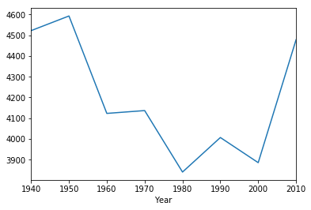


{:.input_area}
```python
historical.to_df().groupby('Year')['White'].mean()
```


{:.output .output_data_text}
```
Year
1940    2880.50
1950    2469.40
1960    1702.10
1970    1341.80
1980    1170.30
1990    1195.60
2000    1322.10
2010    1679.25
Name: White, dtype: float64
```


We can plot the average population of different racial groups.


{:.input_area}
```python
historical.to_df().groupby('Year')['White'].mean().plot()
```


{:.output .output_data_text}
```
<matplotlib.axes._subplots.AxesSubplot at 0x1329e64e0>
```


{:.output .output_png}
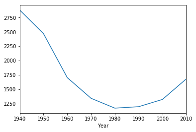


{:.input_area}
```python
historical.to_df().groupby('Year')['Black'].mean()
```


{:.output .output_data_text}
```
Year
1940    37.2
1950    84.3
1960    39.0
1970    33.3
1980    41.9
1990    52.0
2000    50.7
2010    71.5
Name: Black, dtype: float64
```


{:.input_area}
```python
historical.to_df().groupby('Year')['Black'].mean().plot()
```


{:.output .output_data_text}
```
<matplotlib.axes._subplots.AxesSubplot at 0x1329bcf28>
```


{:.output .output_png}
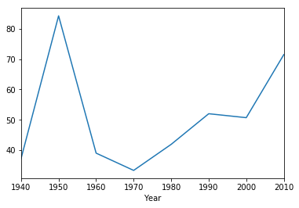


{:.input_area}
```python
historical.to_df().groupby('Year')['Other'].mean()
```


{:.output .output_data_text}
```
Year
1940    1604.200
1950    2038.700
1960    2382.300
1970    2761.900
1980    2628.900
1990    2759.700
2000    2513.500
2010    2727.375
Name: Other, dtype: float64
```


{:.input_area}
```python
historical.to_df().groupby('Year')['Other'].mean().plot()
```


{:.output .output_data_text}
```
<matplotlib.axes._subplots.AxesSubplot at 0x132419cf8>
```


{:.output .output_png}
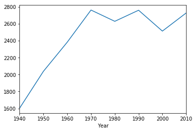


<div class="alert alert-info">
Question: Describe the population trends you observed from the above graphs. How would you compare the changes in Asian vs Black vs White populations?
</div>

_Replace this text with your response_

## 2.5 Manhattan
One of the goals of this module is to compare different Chinatowns from across the US. We will now compare the SF Chinatown data to the census data from Manhattan's Chinatown.  Let's load the Manhattan data.


{:.input_area}
```python
manhattan = Table.read_table('data/manhattan_cleaned.csv')
manhattan.show(10)
```


<div markdown="0" class="output output_html">
<table border="1" class="dataframe">
    <thead>
        <tr>
            <th>Year</th> <th>Census Tract</th> <th>Total Population</th> <th>Asian/Other Population</th> <th>Chinese Population</th> <th>White Population</th>
        </tr>
    </thead>
    <tbody>
        <tr>
            <td>1950</td> <td>29          </td> <td>6695            </td> <td>3180                  </td> <td>3180              </td> <td>6228            </td>
        </tr>
        <tr>
            <td>1960</td> <td>29          </td> <td>7091            </td> <td>4677                  </td> <td>4677              </td> <td>2390            </td>
        </tr>
        <tr>
            <td>1970</td> <td>6           </td> <td>8322            </td> <td>2684                  </td> <td>2684              </td> <td>4669            </td>
        </tr>
        <tr>
            <td>1970</td> <td>8           </td> <td>9597            </td> <td>4258                  </td> <td>4258              </td> <td>5311            </td>
        </tr>
        <tr>
            <td>1970</td> <td>16          </td> <td>6381            </td> <td>4069                  </td> <td>4069              </td> <td>2141            </td>
        </tr>
        <tr>
            <td>1970</td> <td>18          </td> <td>7764            </td> <td>2281                  </td> <td>2281              </td> <td>4766            </td>
        </tr>
        <tr>
            <td>1970</td> <td>27          </td> <td>1671            </td> <td>623                   </td> <td>623               </td> <td>993             </td>
        </tr>
        <tr>
            <td>1970</td> <td>29          </td> <td>9435            </td> <td>5996                  </td> <td>5996              </td> <td>2321            </td>
        </tr>
        <tr>
            <td>1970</td> <td>41          </td> <td>9294            </td> <td>5262                  </td> <td>5262              </td> <td>3845            </td>
        </tr>
        <tr>
            <td>1980</td> <td>6           </td> <td>10638           </td> <td>5172                  </td> <td>5086              </td> <td>2179            </td>
        </tr>
    </tbody>
</table>
<p>... (53 rows omitted)</p>
</div>


{:.input_area}
```python
manhattan.to_df().corr()
```


<div markdown="0" class="output output_html">
<div>
<style scoped>
    .dataframe tbody tr th:only-of-type {
        vertical-align: middle;
    }

    .dataframe tbody tr th {
        vertical-align: top;
    }

    .dataframe thead th {
        text-align: right;
    }
</style>
<table border="1" class="dataframe">
  <thead>
    <tr style="text-align: right;">
      <th></th>
      <th>Year</th>
      <th>Census Tract</th>
      <th>Total Population</th>
      <th>Asian/Other Population</th>
      <th>Chinese Population</th>
      <th>White Population</th>
    </tr>
  </thead>
  <tbody>
    <tr>
      <th>Year</th>
      <td>1.000000</td>
      <td>0.054710</td>
      <td>-0.191828</td>
      <td>-0.087767</td>
      <td>-0.118715</td>
      <td>-0.539567</td>
    </tr>
    <tr>
      <th>Census Tract</th>
      <td>0.054710</td>
      <td>1.000000</td>
      <td>-0.412661</td>
      <td>-0.376237</td>
      <td>-0.378750</td>
      <td>-0.014695</td>
    </tr>
    <tr>
      <th>Total Population</th>
      <td>-0.191828</td>
      <td>-0.412661</td>
      <td>1.000000</td>
      <td>0.907103</td>
      <td>0.904009</td>
      <td>0.408393</td>
    </tr>
    <tr>
      <th>Asian/Other Population</th>
      <td>-0.087767</td>
      <td>-0.376237</td>
      <td>0.907103</td>
      <td>1.000000</td>
      <td>0.998946</td>
      <td>0.119564</td>
    </tr>
    <tr>
      <th>Chinese Population</th>
      <td>-0.118715</td>
      <td>-0.378750</td>
      <td>0.904009</td>
      <td>0.998946</td>
      <td>1.000000</td>
      <td>0.123380</td>
    </tr>
    <tr>
      <th>White Population</th>
      <td>-0.539567</td>
      <td>-0.014695</td>
      <td>0.408393</td>
      <td>0.119564</td>
      <td>0.123380</td>
      <td>1.000000</td>
    </tr>
  </tbody>
</table>
</div>
</div>


{:.input_area}
```python
manhattan.scatter('Chinese Population', 'White Population')
```


{:.output .output_png}
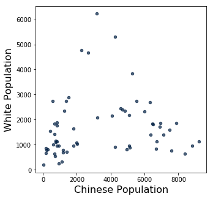


{:.input_area}
```python
manhattan_2010 = manhattan.where('Year', are.equal_to(2010))
manhattan_2010.show()
```


<div markdown="0" class="output output_html">
<table border="1" class="dataframe">
    <thead>
        <tr>
            <th>Year</th> <th>Census Tract</th> <th>Total Population</th> <th>Asian/Other Population</th> <th>Chinese Population</th> <th>White Population</th>
        </tr>
    </thead>
    <tbody>
        <tr>
            <td>2010</td> <td>2.01        </td> <td>3058            </td> <td>1266                  </td> <td>1202              </td> <td>777             </td>
        </tr>
        <tr>
            <td>2010</td> <td>6           </td> <td>11367           </td> <td>7253                  </td> <td>6886              </td> <td>1708            </td>
        </tr>
        <tr>
            <td>2010</td> <td>8           </td> <td>10290           </td> <td>9069                  </td> <td>8832              </td> <td>964             </td>
        </tr>
        <tr>
            <td>2010</td> <td>14.02       </td> <td>2782            </td> <td>880                   </td> <td>760               </td> <td>1142            </td>
        </tr>
        <tr>
            <td>2010</td> <td>16          </td> <td>8478            </td> <td>7058                  </td> <td>6733              </td> <td>1117            </td>
        </tr>
        <tr>
            <td>2010</td> <td>18          </td> <td>8660            </td> <td>5281                  </td> <td>4827              </td> <td>2338            </td>
        </tr>
        <tr>
            <td>2010</td> <td>22.01       </td> <td>6398            </td> <td>1553                  </td> <td>1267              </td> <td>2349            </td>
        </tr>
        <tr>
            <td>2010</td> <td>25          </td> <td>4869            </td> <td>1919                  </td> <td>1818              </td> <td>965             </td>
        </tr>
        <tr>
            <td>2010</td> <td>27          </td> <td>1264            </td> <td>978                   </td> <td>941               </td> <td>254             </td>
        </tr>
        <tr>
            <td>2010</td> <td>29          </td> <td>6398            </td> <td>4461                  </td> <td>4260              </td> <td>917             </td>
        </tr>
        <tr>
            <td>2010</td> <td>30.01       </td> <td>4492            </td> <td>1029                  </td> <td>592               </td> <td>2732            </td>
        </tr>
        <tr>
            <td>2010</td> <td>31          </td> <td>2550            </td> <td>712                   </td> <td>413               </td> <td>1550            </td>
        </tr>
        <tr>
            <td>2010</td> <td>36.01       </td> <td>3393            </td> <td>852                   </td> <td>678               </td> <td>1424            </td>
        </tr>
        <tr>
            <td>2010</td> <td>41          </td> <td>7817            </td> <td>5015                  </td> <td>4598              </td> <td>2445            </td>
        </tr>
        <tr>
            <td>2010</td> <td>43          </td> <td>4270            </td> <td>1046                  </td> <td>827               </td> <td>1750            </td>
        </tr>
        <tr>
            <td>2010</td> <td>45          </td> <td>1136            </td> <td>230                   </td> <td>176               </td> <td>851             </td>
        </tr>
    </tbody>
</table>
</div>


{:.input_area}
```python
def choro_column(tab, column):
    tab = tab.to_df()
    tab['Census Tract'] = tab['Census Tract'].astype(str).str.strip('0').str.strip('.')
    nyc_2010 = geojson.load(open("data/nyc-census-2010.geojson"))
    tracts = folium.features.GeoJson(nyc_2010)
    threshold_scale = np.linspace(min(tab[column]), max(tab[column]), 6, dtype=float).tolist()

    mapa = folium.Map(location=(40.7128, -74.00609), zoom_start=11)
    mapa.choropleth(geo_data=nyc_2010,
                    data=tab,
                    columns=['Census Tract', column],
                    fill_color='YlOrRd',
                    key_on='feature.properties.CTLabel',
                    threshold_scale=threshold_scale)
    mapa.save("output/map-{}.html".format(column.replace(" ", "-")))
    return mapa
```


{:.input_area}
```python
choro_column(manhattan_2010, 'Chinese Population')
IFrame('output/map-Chinese-Population.html', width=700, height=400)
```


<div markdown="0" class="output output_html">

<iframe
    width="700"
    height="400"
    src="output/map-Chinese-Population.html"
    frameborder="0"
    allowfullscreen
></iframe>

</div>


{:.input_area}
```python
manhattan_2010['Asian_percentage'] = manhattan_2010['Asian/Other Population'] / manhattan_2010['Total Population']
manhattan_2010.show(5)
```


<div markdown="0" class="output output_html">
<table border="1" class="dataframe">
    <thead>
        <tr>
            <th>Year</th> <th>Census Tract</th> <th>Total Population</th> <th>Asian/Other Population</th> <th>Chinese Population</th> <th>White Population</th> <th>Asian_percentage</th>
        </tr>
    </thead>
    <tbody>
        <tr>
            <td>2010</td> <td>2.01        </td> <td>3058            </td> <td>1266                  </td> <td>1202              </td> <td>777             </td> <td>0.413996        </td>
        </tr>
        <tr>
            <td>2010</td> <td>6           </td> <td>11367           </td> <td>7253                  </td> <td>6886              </td> <td>1708            </td> <td>0.638075        </td>
        </tr>
        <tr>
            <td>2010</td> <td>8           </td> <td>10290           </td> <td>9069                  </td> <td>8832              </td> <td>964             </td> <td>0.881341        </td>
        </tr>
        <tr>
            <td>2010</td> <td>14.02       </td> <td>2782            </td> <td>880                   </td> <td>760               </td> <td>1142            </td> <td>0.316319        </td>
        </tr>
        <tr>
            <td>2010</td> <td>16          </td> <td>8478            </td> <td>7058                  </td> <td>6733              </td> <td>1117            </td> <td>0.832508        </td>
        </tr>
    </tbody>
</table>
<p>... (11 rows omitted)</p>
</div>


{:.input_area}
```python
choro_column(manhattan_2010, 'Asian_percentage')
IFrame('output/map-Asian_percentage.html', width=700, height=400)
```


<div markdown="0" class="output output_html">

<iframe
    width="700"
    height="400"
    src="output/map-Asian_percentage.html"
    frameborder="0"
    allowfullscreen
></iframe>

</div>


# 3. Reading Primary Texts


In this class, we have been learning how to 'close-read' primary texts. Close-reading generally involves picking select passages and reading for the latent meanings embedded in word choice, syntax, the use of metaphors and symbols, etc. Here, we are introducing another way of analyzing primary texts using computational methods. Computational text analysis generally involves 'counting' words. Let's see how this works by analyzing some of the poems written by Chinese immigrants on Angel Island.

Run the following cell to import the poems from a .txt file.


{:.input_area}
```python
with open('data/islandpoetry1_22.txt', "r") as f:
    raw = f.read()
print(raw)
```


{:.output .output_stream}
```
The sea-scape resembles lichen twisting and
turning for a thousand li
There is no shore to land and it is difficult to
walk.
With a gentle breeze I arrived at the city
thinking all would be so.
At ease, how was one to know he was to live in a
wooden building?

Because my house had bare walls, I began
rushing all about.
The waves are happy, laughing "Ha-ha!"
When I arrived on Island, I heard I was
forbidden to land.
I could do nothing but frown and feel angry
at heaven.

As a rule, a person is twenty before he starts
making a living.
Family circumstances have forced me to
experience wind and dust.
The heartless months and years seem bent on
defeating me.
It is a pity that time quickly ages one.

The gold and silver of America is very
appealing.
Jabbing an awl into the thigh in search of
glory,
I embarked on the journey.
Not only are my one-thousand pieces of gold
already depleted, but
My countenance is blackened. It is surely for
the sake of the family.

Four days before the Qiqiao Festival,
I boarded the steamship for America.
Time flew like a shooting arrow.
Already, a cool autumn has passed.
Counting on my fingers, several months have
elapsed.
Still I am at the beginning of the road.
I have yet to be interrogated.
My heart is nervous with anticipation.

Everyone says travelling to North America is
a pleasure.
I suffered misery on the ship and sadness in
the wooden building.
After several interrogations, still I am not
done.
I sigh because my compatriots are being
forceably detained.

Originally, I had intended to come to
America last year.
Lack of money delayed me until early
autumn.
It was on the day that the Weaver Maiden
met the Cowherd
That I took passage on the President Lincoln.
I ate wind and tasted waves for more than
twenty days.
Fortunately, I arrived safely on the American
continent.
I thought I could land in a few days.
How was I to know I would become a
prisoner suffering in the wooden building?
The barbarians' abuse is really difficult to
take.
When my family's circumstances stir my
emotions, a double stream of tears flow.
I only wish I can land in San Francisco soon.
Thus sparing me this additional sorrow here.

Instead of remaining a citizen of China, I
willingly became an ox.
I intended to come to America to earn a
living.
The Western styled buildings are lofty; but I
have not the luck to live in them.
How was anyone to know that my dwelling
place would be a prison?

I used to admire the land of the Flowery
Flag as a country of abundance.
I immediately raised money and started my
journey.
For over a month, I have experienced enough
winds and waves.
Now on an extended sojourn in jail, I am
subject to the ordeals of prison life.
I look up and see Oakland so close by.
I wish to go back to my motherland to carry
the farmer's hoe.
Discontent fills my belly and it is difficult for
me to sleep.
I just write these few lines to express what is
on my mind.

Just talk about going to the land of the
Flowery Flag and my countenance fills
with happiness.
Not without hard work were 1,000 pieces of
gold dug up and gathered together.
There were words of farewell to the parents,
but the throat choked up first.
There were many feelings, many tears flowing
face to face, when parting with the wife.
Waves big as mountains often astonished this
traveller.
With laws harsh as tigers, I had a taste of all
the barbarities.
Do not forget this day when you land ashore.
Push yourself ahead and do not be lazy or
idle.

I think back on the past when I had not
experienced hardship.
I resolved to go and seek Taogong.
The months and years are wasted and still it
has not ended.
Up to now, I am still trapped on a lonely
island.

Today is the last day of winter.
Tomorrow morning is the vernal equinox.
One year's prospects have changed to another.
Sadness kills the person in the wooden
building.

In the quiet of night, I heard, faintly, the
whistling of wind.
The forms and shadows saddened me, upon
seeing the landscape, I composed a poem.
The floating clouds, the fog, darken the sky.
The moon shines faintly as the insects chirp.
Grief and bitterness entwined are heaven sent.
The sad person sits alone, leaning by a window.

The night is cool as I lie stiff on the steel bunk.
Before the window the moon lady shines on me.
Bored, I get up and stand beneath the cold
window.
Sadly, I count the time that's elapsed.
It is already mid-autumn.
We should all honor and enjoy her.
But I have not prepared even the most trifling
gift and I feel embarrassed.

The insects chirp outside the four walls.
The inmates often sigh.
Thinking of affairs back home.
Unconscious tears wet my lapel.

Depressed from living on Island, I sought the
Sleeping Village.
The uncertain future altogether wounds my
spirit.
When I see my old country fraught with chaos,
I, a drifting leaf, become doubly saddened.

My belly is so full of discontent it is really
difficult to relax.
I can only worry silently to myself.
At times I gaze at the cloud- and fog-enshrouded
mountain-front.
It only deepens my sadness.

Sadly, I listen to the sounds of insects and
angry surf.
The harsh laws pile layer upon layer; how
can I dissipate my hatred?
Drifting in as a traveller, I met with this
calamity.
It is more miserable than owning only a flute
in the marketplace of Wu.

Living on Island away from home elicits a
hundred feelings.
My chest is filled with a sadness and anger I
cannot bear to explain.
Night and day, I sit passively and listlessly.
Fortunately, I have a novel as my companion.

Imprisonment at Youli, when will it end?
Fur and linen garments have been exchanged;
it is already another autumn.
My belly brims with discontent, too numerous
to inscribe on bamboo slips.
Snow falls, flowers wilt, expressing sorrow
through the ages.

The west wind ruffles my thin gauze clothing.
On the hill sits a tall building with a room of
wooden planks.
I wish I could travel on a cloud far away,
reunite with my wife and son.
When the moonlight shines on me alone, the
nights seem even longer.
At the head of the bed there is wine and my
heart is constantly drunk.
There is no flower beneath my pillow and
my dreams are not sweet.
To whom can I confide my innermost
feelings?
I rely solely on close friends to relieve my
loneliness.

America has power, but not justice.
In prison, we were victimized as if we were
guilty.
Given no opportunity to explain, it was really
brutal.
I bow my head in reflection but there is
nothing I can do.

This place is called an island of immortals.
When, in fact, this mountain wilderness is a
prison.
Once you see the open net, why throw
yourself in?
It is only because of empty pockets I can do
nothing else.

I, a seven foot man, am ashamed I cannot
extend myself.
Curled up in an enclosure, my movements
are dictated by others."
Enduring a hundred humiliations, I can only
cry in vain.
This person's tears fall, but what can the blue
heavens do?

I have infinite feelings that the ocean
has changed into a mulberry grove.
My body is detained in this building.
I cannot fly from this grassy hill.
And green waters block the hero.
Impetuously, I threw away my writing brush.
My efforts have all been in vain.
It is up to me to answer carefully.
I have no words to murmur against the east
wind.

My grief, like dense clouds, cannot be
dispersed.
Whether deliberating or being melancholy
and bored,
I constantly pace to and fro.
Wang Can ascended the tower but who
pitied his sorrow?
Lord Yu who left his country could only wail
to himself.

Over a hundred poems are on the walls.
Looking at them, they are all pining at the
delayed progress.
What can one sad person say to another?
Unfortunate travellers everywhere wish to
commiserate.
Gain or lose, how is one to know what is
predestined?
Rich or poor, who is to say it is not the will
of heaven?
Why should one complain if he is detained
and imprisoned here?
From ancient times, heroes often were the
first ones to face adversity.

The male eagle is also easy to tame.
One must be able to bend before one can
stretch.
China experienced calamities for a thousand
years.
Confucius was surrounded in Chen for seven
days.
Great men exhibit quality.
Scholars take pride in being themselves.
Gains and losses are entangled in my bosom.
My restlessness is a sign of self-illumination.

Half way up the hill on Island, in the
building upstairs.
The imprisoned one has been separated from
his people summer to autumn.
Three times I dreamed of returning to the
native village.
My intestines are agitated in its nine turns by
the false Westerner.
I have run into hard times and am uselessly
depressed.
There are many obstacles in life but who will
commiserate with me?
If at a later time I am allowed to land on the
American shore,
I will toss all the miseries of this jail to the
flowing current.

After leaping into prison, I cannot come out.
From endless sorrows, tears and blood streak.
The jingwei bird carries gravel to fill its old
grudge.
The migrating wild goose complains to the
moon, mourning his harried life.
When Ziqing was in distant lands, who
pitied and inquired after him?
When Ruan Ji reached the end of the road,
he shed tile tears.
The scented grass and hidden orchids
complain of withering and falling.
When can I be allowed to rise above as I
please?

There are tens of thousands of poems
composed on these walls.
They are all cries of complaint and sadness.
The day I am rid of this prison and attain
success,
I must remember that this chapter once
existed.
In my daily needs, I must be frugal.
Needless extravagance leads youth to ruin.
All my compatriots should please be mindful.
Once you have some small gains, return
home early.

Imprisoned in the wooden building day after
day.
My freedom withheld; how can I bear to talk
about it?
I look to see who is happy but they only sit
quietly.
I am anxious and depressed and cannot fall
asleep.
The days are long and the bottle constantly
empty; my sad mood, even so, is not
dispelled.
Nights are long and the pillow cold; who can
pity my loneliness?
After experiencing such loneliness and sorrow.
Why not just return home and learn to plow
the fields?

A building does not have to be tall; if it has
windows, it will be bright.
Island is not far, Angel Island.
Alas, this wooden building disrupts my
travelling schedule.
Paint on the four walls are green.
And green is the grass which surrounds.
It is noisy because of the many country folk.
And there are watchmen guarding during the
night.
To exert influence, one can use a square-holed
elder brother.
There are children who disturb the ears.
But there are no incoherent sounds that
cause fatigue.
I gaze to the south at the hospital,
And look to the west at the army camp.
This author says, "What happiness is there in
this?

For what reason must I sit in jail?
It is only because my country is weak and
my family poor.
My parents wait at the door but there is no
news.
My wife and child wrap themselves in quilt,
sighing with loneliness.
Even if my petition is approved and I can
enter the country.
When can I return to the Mountains of Tang
with a full load?
From ancient times, those who venture out
usually become worthless.
How many people ever return from battles?


Leaving behind my writing brush and
removing my sword, I came to America.
Who was to know two streams of tears would
flow upon arriving here?
If there comes a day when I will have
attained my ambition and become
successful,
I will certainly behead the barbarians and
spare not a single blade of grass.

I am a member of the Huang clan from
Xiangcheng.
I threw away my writing brush and pushed
forward, journeying to the capital of the
U.S.
I bought an oar and arrived in the land of the
Golden Mountain.
Who was to know they would banish me to
Island?
If my country had contrived to make herself
strong, this never would have happened.
Then when the ship had docked, we could
have gone directly ashore.

Just now the five nationalities in China have
become one family,
But the powers still have not yet recognized
our China,
Primarily because foreign debts were piling
up.
The foreigners pushed to control finances
and to seize power.

Being idle in the wooden building, I opened
a window.
The morning breeze and bright moon lingered
together.
I reminisce the native village far away, cut off
by clouds and mountains.
On the little island the wailing of cold, wild
geese can be faintly heard.
The hero who has lost his way can talk
meaninglessly of the sword.
The poet at the end of the road can only
ascend a tower.
One should know that when the country is
weak, the people's spirit dies.
Why else do we come to this place to be
imprisoned?

Twice I have passed through the blue ocean,
experienced the wind and dust of journey.
Confinement in the wooden building has
pained me doubly.
With a weak country, we must all join
together in urgent effort.
It depends on all of us together to roll back
the wild wave.

I lean on the railing and lift my head to look
at the cloudy sky.
All the mountains and rivers are dark.
Eastern Mongolia is lost and the date of her
return is uncertain.
The recovery of the Central Plains depends
on the youth.
Only the tongue of Changshan can slay the
villainous.
To kill the bandit we must wave the whip of
Zu Di.
I am ashamed to be curled up like a worm
on Island.
I grieve for my native land but what else can
I say?

I have ten-thousand hopes that the
revolutionary armies will complete their
victory.
And help make the mining enterprises
successful in the ancestral land.
They will build many battleships and come to
the U.S. territory.
Vowing never to stop till the white men are
completely annihilated.

The dragon out of water is humiliated by
ants;
The fierce tiger who is caged is baited by a
child.
As long as I am imprisoned, how can I dare
strive for supremacy?
An advantageous position for revenge will
surely come one day.

I left the village well behind me, bade
farewell to my father and mother.
Now I gaze at distant clouds and mountains,
tears forming like pearls.
The wandering son longed to be wealthy like
Taozhu.
Who would have known I would be
imprisoned on Island?
I beat my breast when I think of China and
cry bitterly like Ruan Ji.
Our country's wealth is being drained by
foreigners, causing us to suffer national
humiliations.
My fellow countrymen, have foresight, plan
to be resolute.
And vow to conquer the U.S. and avenge
previous wrongs!

If the land of the Flowery Flag is occupied by
us in turn.
The wooden building will be left for the
angel's revenge.

If you have but one breath left, do not be
discouraged from your purpose.
I respectfully exhort my brothers who are all
talents of Chu.
Having a sense of shame, one can eradicate
shame.
Only by wielding the lance can one avoid
certain defeat.
Do not say that we have not the means to
level the ugly barbarians.
I am searching for a method that will turn
destiny back.
One-hundred-thousand men sharpen their
swords.
Swearing to behead the Loulan and open
the grasslands and fallow fields.

The low building with three beams merely
shelters the body.
It is unbearable to relate the stories
accumulated on the Island slopes.
Wait till the day I become successful and
fulfill my wish!
I will not speak of love when I level the
immigration station!

I am distressed that we Chinese are detained
in this wooden building.
It is actually racial barriers which cause
difficulties on Yingtai Island.
Even while they are tyrannical, they still
claim to be humanitarian.
I should regret my taking the risks of coming
in the first place.

I thoroughly hate the barbarians because they
do not respect justice.
They continually promulgate harsh laws to
show off their prowess.
They oppress the overseas Chinese and also
violate treaties.
They examine for hookworms and practice
hundreds of despotic acts.

I cannot bear to describe the harsh treatment
by the doctors.
Being stabbed for blood samples and
examined for hookworms was even more
pitiful.
After taking the medicine, I also drank
liquid,
Like a dumb person eating the huanglian.


```

We're interested in which words appear the most often in our set of poems. It's pretty hard to read or see much in this form. We'll coming back to the topic of what words are the most common with actual numbers a bit later but for now, run the following cell to generate two interesting visualizations of the most common words (minus those such as "the", "a", etc.). 


{:.input_area}
```python
wordcloud = WordCloud().generate(raw)

plt.imshow(wordcloud, interpolation='bilinear')
plt.axis("off")

# lower max_font_size
wordcloud = WordCloud(max_font_size=40).generate(raw)
plt.figure()
plt.imshow(wordcloud, interpolation="bilinear")
plt.axis("off")
plt.show()
```


{:.output .output_png}
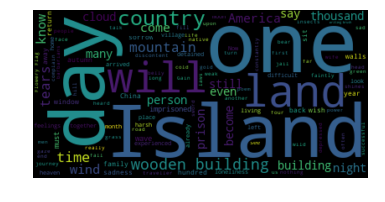


{:.output .output_png}
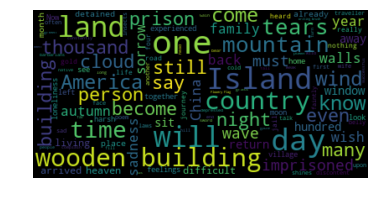


<div class="alert alert-info">
Question: What are the most common words you notice? Judging from these words, what do you think these poems are about?
</div>

_Replace this text with your response_

Oops, it seems we've forgotten just how many poems we have in our set. Luckily we have a quick way of finding out! Each "\n" in the display of the poem text indicates a line break. It turns out that each poem is separated by an empty line, a.k.a. two line breaks or "\n"'s.


{:.input_area}
```python
num_poems = len(raw.split("\n\n"))
num_poems
```


{:.output .output_data_text}
```
49
```


We can also use this idea to calculate the number of characters in each poem.


{:.input_area}
```python
num_char_per_poem = [len(p) for p in raw.split("\n\n")]
print(num_char_per_poem)
```


{:.output .output_stream}
```
[259, 212, 227, 262, 306, 233, 654, 260, 488, 550, 206, 167, 331, 325, 128, 203, 196, 251, 221, 250, 488, 201, 206, 237, 344, 243, 442, 345, 507, 474, 382, 465, 624, 444, 302, 399, 230, 505, 268, 437, 288, 226, 532, 116, 487, 254, 279, 263, 233]

```

This is interesting but seems like just a long list of numbers. What about the average number of characters per poem?


{:.input_area}
```python
np.mean(num_char_per_poem)
```


{:.output .output_data_text}
```
325.51020408163265
```


Let's look at it in histogram form to get a better idea of our data.


{:.input_area}
```python
Table().with_columns("Character Count", np.asarray(num_char_per_poem)).hist()
```


{:.output .output_png}
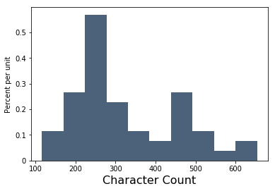


Each bar of this histogram tells us what proportion of the poems (the height of the bar) have that many characters (the position of the bar on the x-axis).

We can also use "\n" to look at [enjambment](https://en.wikipedia.org/wiki/Enjambment) too. Let's calculate the proportion of lines that are enjambed out of the total number of lines per poem. 


{:.input_area}
```python
from string import punctuation

poems = raw.split("\n\n")

all_poems_enjambment = []
for p in poems:
    lines = p.split("\n")
    poems = raw.split("\n\n")
    enjambment = 0
    for l in lines:
        try:
            if l[-1] in punctuation:
                pass
            else:
                enjambment += 1
        except:
            pass
    enj = enjambment/len(lines)
    all_poems_enjambment.append(enj)

print(all_poems_enjambment)
```


{:.output .output_stream}
```
[0.625, 0.42857142857142855, 0.42857142857142855, 0.5555555555555556, 0.1111111111111111, 0.5, 0.45, 0.5, 0.4666666666666667, 0.4375, 0.42857142857142855, 0.2, 0.25, 0.2222222222222222, 0.0, 0.3333333333333333, 0.3333333333333333, 0.5, 0.3333333333333333, 0.2857142857142857, 0.4, 0.42857142857142855, 0.42857142857142855, 0.5, 0.2, 0.4444444444444444, 0.42857142857142855, 0.2727272727272727, 0.5, 0.35714285714285715, 0.3333333333333333, 0.5, 0.3157894736842105, 0.35714285714285715, 0.5, 0.5384615384615384, 0.5, 0.5, 0.375, 0.4666666666666667, 0.5555555555555556, 0.5, 0.47058823529411764, 0.5, 0.5, 0.5, 0.5, 0.5, 0.4444444444444444]

```

Once again, what about the average?


{:.input_area}
```python
np.mean(all_poems_enjambment)
```


{:.output .output_data_text}
```
0.41237745084889205
```


Let's now return to the question of the words that appear the most frequently in these 49 poems. First we have to use spaCy, an open-source software library for Natural Language Processing (NLP), to parse through the text and replace all the "\n"'s with spaces.


{:.input_area}
```python
nlp = spacy.load('en', parser=False)
parsed_text = nlp(raw.replace("\n", " "))
```


We can separate all the words/symbols and put them in a table.


{:.input_area}
```python
toks_tab = Table()
toks_tab.append_column(label="Word", values=[word.text for word in parsed_text])
toks_tab
```


<div markdown="0" class="output output_html">
<table border="1" class="dataframe">
    <thead>
        <tr>
            <th>Word</th>
        </tr>
    </thead>
    <tbody>
        <tr>
            <td>The      </td>
        </tr>
        <tr>
            <td>sea      </td>
        </tr>
        <tr>
            <td>-        </td>
        </tr>
        <tr>
            <td>scape    </td>
        </tr>
        <tr>
            <td>resembles</td>
        </tr>
        <tr>
            <td>lichen   </td>
        </tr>
        <tr>
            <td>twisting </td>
        </tr>
        <tr>
            <td>and      </td>
        </tr>
        <tr>
            <td>turning  </td>
        </tr>
        <tr>
            <td>for      </td>
        </tr>
    </tbody>
</table>
<p>... (3366 rows omitted)</p>
</div>


{:.input_area}
```python
toks_tab.append_column(label="POS", values=[word.pos_ for word in parsed_text])
toks_tab
```


<div markdown="0" class="output output_html">
<table border="1" class="dataframe">
    <thead>
        <tr>
            <th>Word</th> <th>POS</th>
        </tr>
    </thead>
    <tbody>
        <tr>
            <td>The      </td> <td>DET  </td>
        </tr>
        <tr>
            <td>sea      </td> <td>NOUN </td>
        </tr>
        <tr>
            <td>-        </td> <td>PUNCT</td>
        </tr>
        <tr>
            <td>scape    </td> <td>NOUN </td>
        </tr>
        <tr>
            <td>resembles</td> <td>NOUN </td>
        </tr>
        <tr>
            <td>lichen   </td> <td>ADJ  </td>
        </tr>
        <tr>
            <td>twisting </td> <td>VERB </td>
        </tr>
        <tr>
            <td>and      </td> <td>CCONJ</td>
        </tr>
        <tr>
            <td>turning  </td> <td>VERB </td>
        </tr>
        <tr>
            <td>for      </td> <td>ADP  </td>
        </tr>
    </tbody>
</table>
<p>... (3366 rows omitted)</p>
</div>


Now let's create a new table with even more columns using the "tablefy" function below.


{:.input_area}
```python
def tablefy(parsed_text):
    toks_tab = Table()
    toks_tab.append_column(label="Word", values=[word.text for word in parsed_text])
    toks_tab.append_column(label="POS", values=[word.pos_ for word in parsed_text])
    toks_tab.append_column(label="Lemma", values=[word.lemma_ for word in parsed_text])
    toks_tab.append_column(label="Stop Word", values=[word.is_stop for word in parsed_text])
    toks_tab.append_column(label="Punctuation", values=[word.is_punct for word in parsed_text])
    toks_tab.append_column(label="Space", values=[word.is_space for word in parsed_text])
    toks_tab.append_column(label="Number", values=[word.like_num for word in parsed_text])
    toks_tab.append_column(label="OOV", values=[word.is_oov for word in parsed_text])
    toks_tab.append_column(label="Dependency", values=[word.dep_ for word in parsed_text])
    return toks_tab
```


{:.input_area}
```python
tablefy(parsed_text)
```


<div markdown="0" class="output output_html">
<table border="1" class="dataframe">
    <thead>
        <tr>
            <th>Word</th> <th>POS</th> <th>Lemma</th> <th>Stop Word</th> <th>Punctuation</th> <th>Space</th> <th>Number</th> <th>OOV</th> <th>Dependency</th>
        </tr>
    </thead>
    <tbody>
        <tr>
            <td>The      </td> <td>DET  </td> <td>the     </td> <td>True     </td> <td>False      </td> <td>False</td> <td>False </td> <td>True</td> <td>det       </td>
        </tr>
        <tr>
            <td>sea      </td> <td>NOUN </td> <td>sea     </td> <td>False    </td> <td>False      </td> <td>False</td> <td>False </td> <td>True</td> <td>compound  </td>
        </tr>
        <tr>
            <td>-        </td> <td>PUNCT</td> <td>-       </td> <td>False    </td> <td>True       </td> <td>False</td> <td>False </td> <td>True</td> <td>punct     </td>
        </tr>
        <tr>
            <td>scape    </td> <td>NOUN </td> <td>scape   </td> <td>False    </td> <td>False      </td> <td>False</td> <td>False </td> <td>True</td> <td>nsubj     </td>
        </tr>
        <tr>
            <td>resembles</td> <td>NOUN </td> <td>resemble</td> <td>False    </td> <td>False      </td> <td>False</td> <td>False </td> <td>True</td> <td>ROOT      </td>
        </tr>
        <tr>
            <td>lichen   </td> <td>ADJ  </td> <td>lichen  </td> <td>False    </td> <td>False      </td> <td>False</td> <td>False </td> <td>True</td> <td>compound  </td>
        </tr>
        <tr>
            <td>twisting </td> <td>VERB </td> <td>twist   </td> <td>False    </td> <td>False      </td> <td>False</td> <td>False </td> <td>True</td> <td>dobj      </td>
        </tr>
        <tr>
            <td>and      </td> <td>CCONJ</td> <td>and     </td> <td>True     </td> <td>False      </td> <td>False</td> <td>False </td> <td>True</td> <td>cc        </td>
        </tr>
        <tr>
            <td>turning  </td> <td>VERB </td> <td>turn    </td> <td>False    </td> <td>False      </td> <td>False</td> <td>False </td> <td>True</td> <td>conj      </td>
        </tr>
        <tr>
            <td>for      </td> <td>ADP  </td> <td>for     </td> <td>True     </td> <td>False      </td> <td>False</td> <td>False </td> <td>True</td> <td>prep      </td>
        </tr>
    </tbody>
</table>
<p>... (3366 rows omitted)</p>
</div>


Next, let's look at the frequency of words. However, we want to get rid of words such as "the" and "and" (stop words), punctuation, and spaces. We can do this by selecting rows that are not stop words, punctuation, or spaces and then sorting by word!


{:.input_area}
```python
word_counts = tablefy(parsed_text).where("Stop Word", are.equal_to(False)).where(
    "Punctuation", are.equal_to(False)).where(
    "Space", are.equal_to(False)).group("Word").sort("count",descending=True)
word_counts
```


<div markdown="0" class="output output_html">
<table border="1" class="dataframe">
    <thead>
        <tr>
            <th>Word</th> <th>count</th>
        </tr>
    </thead>
    <tbody>
        <tr>
            <td>building</td> <td>15   </td>
        </tr>
        <tr>
            <td>land    </td> <td>12   </td>
        </tr>
        <tr>
            <td>wooden  </td> <td>11   </td>
        </tr>
        <tr>
            <td>Island  </td> <td>11   </td>
        </tr>
        <tr>
            <td>day     </td> <td>10   </td>
        </tr>
        <tr>
            <td>country </td> <td>10   </td>
        </tr>
        <tr>
            <td>tears   </td> <td>8    </td>
        </tr>
        <tr>
            <td>know    </td> <td>7    </td>
        </tr>
        <tr>
            <td>America </td> <td>7    </td>
        </tr>
        <tr>
            <td>wind    </td> <td>6    </td>
        </tr>
    </tbody>
</table>
<p>... (899 rows omitted)</p>
</div>


In this table, we have both the words "sad" and "sadness" - it seems strange to separate them. It turns out that these words are part of the same "lexeme", or a unit of meaning. For example, "run", "runs", "ran", and "running" are all part of the same lexeme with the lemma 'run'. Lemmas are another column in our table from above! Nice!


{:.input_area}
```python
lemma_counts = tablefy(parsed_text).where("Stop Word", are.equal_to(False)).where(
    "Punctuation", are.equal_to(False)).where(
    "Space", are.equal_to(False)).group("Lemma").sort("count",descending=True)
lemma_counts
```


<div markdown="0" class="output output_html">
<table border="1" class="dataframe">
    <thead>
        <tr>
            <th>Lemma</th> <th>count</th>
        </tr>
    </thead>
    <tbody>
        <tr>
            <td>building</td> <td>16   </td>
        </tr>
        <tr>
            <td>day     </td> <td>15   </td>
        </tr>
        <tr>
            <td>land    </td> <td>13   </td>
        </tr>
        <tr>
            <td>wooden  </td> <td>11   </td>
        </tr>
        <tr>
            <td>country </td> <td>10   </td>
        </tr>
        <tr>
            <td>Island  </td> <td>10   </td>
        </tr>
        <tr>
            <td>come    </td> <td>9    </td>
        </tr>
        <tr>
            <td>time    </td> <td>8    </td>
        </tr>
        <tr>
            <td>tear    </td> <td>8    </td>
        </tr>
        <tr>
            <td>know    </td> <td>8    </td>
        </tr>
    </tbody>
</table>
<p>... (796 rows omitted)</p>
</div>


Now let's look at how many words there are of each part of speech.


{:.input_area}
```python
pos_counts = tablefy(parsed_text).where("Stop Word", are.equal_to(False)).where(
    "Punctuation", are.equal_to(False)).where(
    "Space", are.equal_to(False)).group("POS").sort("count",descending=True)
pos_counts
```


<div markdown="0" class="output output_html">
<table border="1" class="dataframe">
    <thead>
        <tr>
            <th>POS</th> <th>count</th>
        </tr>
    </thead>
    <tbody>
        <tr>
            <td>NOUN </td> <td>585  </td>
        </tr>
        <tr>
            <td>VERB </td> <td>392  </td>
        </tr>
        <tr>
            <td>ADJ  </td> <td>173  </td>
        </tr>
        <tr>
            <td>PROPN</td> <td>85   </td>
        </tr>
        <tr>
            <td>ADV  </td> <td>65   </td>
        </tr>
        <tr>
            <td>ADP  </td> <td>12   </td>
        </tr>
        <tr>
            <td>NUM  </td> <td>8    </td>
        </tr>
        <tr>
            <td>INTJ </td> <td>1    </td>
        </tr>
    </tbody>
</table>
</div>


We can also look at the proportions of each POS out of all the words!


{:.input_area}
```python
for i in np.arange(pos_counts.num_rows):
    pos = pos_counts.column("POS").item(i)
    count = pos_counts.column("count").item(i)
    total = np.sum(pos_counts.column("count"))
    proportion = str(count / total)
    print(pos + " proportion: " + proportion)
```


{:.output .output_stream}
```
NOUN proportion: 0.4428463285389856
VERB proportion: 0.2967448902346707
ADJ proportion: 0.13096139288417866
PROPN proportion: 0.0643451930355791
ADV proportion: 0.04920514761544285
ADP proportion: 0.009084027252081756
NUM proportion: 0.006056018168054504
INTJ proportion: 0.000757002271006813

```

If we're interested in words' relations with each other, we can look at words that are next to each other. The function below returns the word following the first instance of the word you search for in the specified source.


{:.input_area}
```python
def nextword(word, source):
    for i, w in enumerate(source):
        if w == word:
            return source[i+1]
```


Mess around a bit with this function! Change the "word" argument.


{:.input_area}
```python
split_txt = raw.split()

# Change the target or "home" to other words!
nextword("home", split_txt)
```


{:.output .output_data_text}
```
'elicits'
```


We are specifically interested in the word "I" and the words that poets use in succession. Let's make an array of all the words that come after it in these poems. For easier viewing, the phrases have been printed out. What do you notice?


{:.input_area}
```python
one_after_i = make_array()
for i, w in enumerate(split_txt):
    if w == "I":
        one_after_i = np.append(one_after_i, split_txt[i+1])
for i in one_after_i:
    print("I " + i)
```


{:.output .output_stream}
```
I arrived
I began
I arrived
I heard
I was
I could
I embarked
I boarded
I am
I have
I suffered
I am
I sigh
I had
I took
I ate
I arrived
I thought
I could
I to
I would
I only
I can
I willingly
I intended
I have
I used
I immediately
I have
I am
I look
I wish
I just
I had
I think
I had
I resolved
I am
I heard,
I composed
I lie
I get
I count
I have
I feel
I sought
I see
I can
I gaze
I listen
I dissipate
I met
I cannot
I sit
I have
I wish
I could
I confide
I rely
I bow
I can
I can
I cannot
I can
I have
I cannot
I threw
I have
I constantly
I dreamed
I have
I am
I will
I cannot
I be
I please?
I am
I must
I must
I bear
I look
I am
I gaze
I sit
I can
I return
I came
I will
I will
I am
I threw
I bought
I opened
I reminisce
I have
I lean
I am
I grieve
I say?
I have
I am
I dare
I left
I gaze
I would
I beat
I think
I respectfully
I am
I become
I will
I level
I am
I should
I thoroughly
I cannot
I also

```

Above we have only shown the next word, what about the next two words? Does this give you any new insight?


{:.input_area}
```python
two_after_i = make_array()
for i, w in enumerate(split_txt):
    if w == "I":
        two_after_i = np.append(two_after_i, split_txt[i+1] + " " + split_txt[i+2])
for i in two_after_i:
    print("I " + i)
```


{:.output .output_stream}
```
I arrived at
I began rushing
I arrived on
I heard I
I was forbidden
I could do
I embarked on
I boarded the
I am at
I have yet
I suffered misery
I am not
I sigh because
I had intended
I took passage
I ate wind
I arrived safely
I thought I
I could land
I to know
I would become
I only wish
I can land
I willingly became
I intended to
I have not
I used to
I immediately raised
I have experienced
I am subject
I look up
I wish to
I just write
I had a
I think back
I had not
I resolved to
I am still
I heard, faintly,
I composed a
I lie stiff
I get up
I count the
I have not
I feel embarrassed.
I sought the
I see my
I can only
I gaze at
I listen to
I dissipate my
I met with
I cannot bear
I sit passively
I have a
I wish I
I could travel
I confide my
I rely solely
I bow my
I can do.
I can do
I cannot extend
I can only
I have infinite
I cannot fly
I threw away
I have no
I constantly pace
I dreamed of
I have run
I am allowed
I will toss
I cannot come
I be allowed
I please? There
I am rid
I must remember
I must be
I bear to
I look to
I am anxious
I gaze to
I sit in
I can enter
I return to
I came to
I will have
I will certainly
I am a
I threw away
I bought an
I opened a
I reminisce the
I have passed
I lean on
I am ashamed
I grieve for
I say? I
I have ten-thousand
I am imprisoned,
I dare strive
I left the
I gaze at
I would be
I beat my
I think of
I respectfully exhort
I am searching
I become successful
I will not
I level the
I am distressed
I should regret
I thoroughly hate
I cannot bear
I also drank

```

Try doing some exploring of your own! If you're feeling stuck, feel free to copy and edit code from above.


{:.input_area}
```python
# Write your own code here!
```


### Sentiment Analysis

We can do some analysis of the overall sentiments, or emotions conveyed, in each of the poems using the code below. Here, we analyze the overall sentiment of each poem individually. Once you run the next cell, you'll see the sentiment values for each poem. A value below 0 denotes a negative sentiment, and a value above 0 is positive.


{:.input_area}
```python
sentiments = make_array()
for p in poems:
    poem = TextBlob(p)
    sentiments = np.append(sentiments, poem.sentiment.polarity)
sentiments
```


{:.output .output_data_text}
```
array([-0.04090909,  0.18333333, -0.02222222,  0.38333333,  0.175     ,
        0.        ,  0.09791667,  0.12878788, -0.02380952,  0.15104167,
       -0.19166667,  0.        , -0.46      , -0.08061224, -0.03333333,
        0.03333333, -0.03      , -0.28333333,  0.03333333,  0.        ,
       -0.195     , -0.6875    , -0.025     ,  0.        ,  0.16666667,
       -0.26      , -0.155     ,  0.38611111, -0.10083333, -0.03194444,
       -0.10833333, -0.07727273,  0.12777778, -0.134375  ,  0.15      ,
        0.08333333,  0.1375    , -0.12625   ,  0.075     , -0.05      ,
        0.29      ,  0.225     , -0.05138889,  0.        ,  0.00204082,
        0.265625  ,  0.0625    , -0.33333333, -0.025     ])
```


Now, what does this mean? It appears that the number of poems with negative sentiment is about the same as the number of poems with positive or neutral (0) sentiment. We can look at the proportion of negative poems in the next cell:


{:.input_area}
```python
neg_proportion = np.count_nonzero(sentiments < 0)/len(sentiments)
neg_proportion
```


{:.output .output_data_text}
```
0.4897959183673469
```


Okay, so just under half of the poems have negative sentiment. So, on average the poems have slightly positive sentiment, right?

We can also perform sentiment analysis across the text of all of the poems at once and see what happens:


{:.input_area}
```python
poems_all = TextBlob(raw.replace('\n', ' '))
poems_all.sentiment.polarity
```


{:.output .output_data_text}
```
-0.014875449409347723
```


This way of analyzing the text tells us that the language in all of the poems has slightly negative sentiment.

One more analysis we can perform is computing the average sentiment of the poems, given the list of each individual poem's sentiments that we computed earlier:


{:.input_area}
```python
np.mean(sentiments)
```


{:.output .output_data_text}
```
-0.007540473981800516
```


This method also tells us that our poems have slightly negative sentiment, on average.

Here, let's look at one of the poems with it's sentiment value:


{:.input_area}
```python
poem_3 = poems[3].replace('\n', ' ')
print(poem_3)
print(TextBlob(poem_3).sentiment.polarity)
```


{:.output .output_stream}
```
The gold and silver of America is very appealing. Jabbing an awl into the thigh in search of glory, I embarked on the journey. Not only are my one-thousand pieces of gold already depleted, but My countenance is blackened. It is surely for the sake of the family.
0.3833333333333333

```

Let's look at one more poem:


{:.input_area}
```python
poem_47 = poems[47].replace('\n', ' ')
print(poem_47)
print(TextBlob(poem_47).sentiment.polarity)
```


{:.output .output_stream}
```
I thoroughly hate the barbarians because they do not respect justice. They continually promulgate harsh laws to show off their prowess. They oppress the overseas Chinese and also violate treaties. They examine for hookworms and practice hundreds of despotic acts.
-0.3333333333333333

```

<div class="alert alert-info">
Question: Do you think the sentiment analyzer did a good job assigning the sentiment to these poems? What might that mean for the trends we see in our average sentiment across the poems?
</div>

_Replace this text with your response_

<!-- 

---

***Please fill out our [feedback form](https://goo.gl/forms/Ir0Ulg5WDQogHhK72)!***

-->
